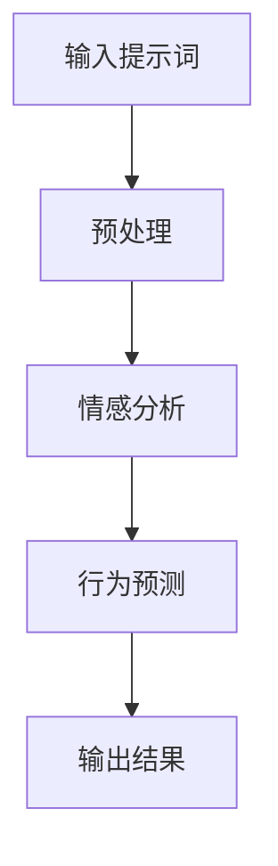
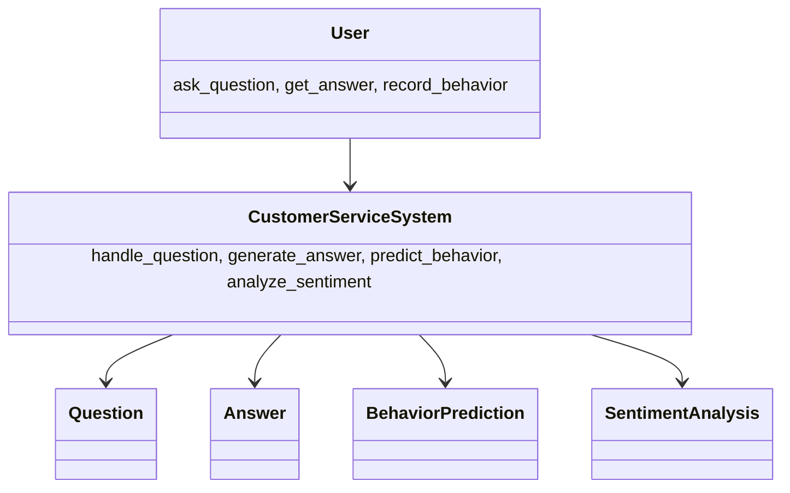
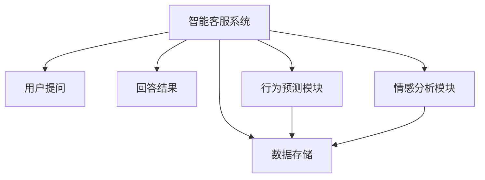

                 

# 提示词的心理暗示：影响AI输出的潜在因素

## 关键词
AI心理暗示，提示词，算法原理，系统架构，项目实战

## 摘要
本文深入探讨提示词对AI输出的心理暗示效应，从背景介绍、核心概念与联系、算法原理讲解、系统分析与架构设计、项目实战以及最佳实践等方面，系统地阐述了心理暗示如何影响AI的输出。文章旨在帮助读者理解心理暗示在AI中的应用及其潜在影响，从而为未来的AI系统设计提供有价值的参考。

## 目录

### 第一步：背景介绍
#### 1.1 心理暗示的定义与类型
- 心理暗示的概念
- 心理暗示的类型

#### 1.2 心理暗示对人类行为的影响
- 心理暗示在生活中的应用
- 心理暗示对行为决策的影响

#### 1.3 心理暗示与AI的关系
- AI处理心理暗示的挑战
- AI系统中的心理暗示应用

#### 1.4 问题解决与边界与外延
- 问题的解决方法
- 研究的边界与外延

#### 1.5 概念结构与核心要素组成
- 核心概念的定义
- 核心要素的组成

### 第二步：核心概念与联系
#### 2.1 AI与心理暗示的关系
- AI如何处理心理暗示
- 心理暗示对AI输出的影响

#### 2.2 心理暗示对AI输出影响的特点
- 不同类型心理暗示的影响
- 心理暗示的强度与效果

#### 2.3 对比分析
- 不同AI系统对心理暗示的响应
- 心理暗示在不同应用场景中的效果对比

### 第三步：算法原理讲解
#### 3.1 心理暗示处理算法
- 算法流程图
- 算法原理

#### 3.2 Python源代码示例
- Python代码实现
- 代码解读

#### 3.3 数学模型和公式
- 数学模型
- 公式推导

#### 3.4 详细讲解与举例
- 算法应用实例
- 结果分析与解释

### 第四步：系统分析与架构设计方案
#### 4.1 问题场景介绍
- 场景设定
- 问题分析

#### 4.2 项目介绍
- 项目背景
- 项目目标

#### 4.3 系统功能设计
- 领域模型类图
- 功能描述

#### 4.4 系统架构设计
- 系统架构图
- 架构设计理念

#### 4.5 系统接口设计
- 接口定义
- 接口功能

#### 4.6 系统交互
- 交互流程
- 交互分析

### 第五步：项目实战
#### 5.1 环境安装
- 环境搭建步骤
- 环境配置

#### 5.2 系统核心实现
- 核心代码片段
- 代码解读

#### 5.3 实际案例分析与讲解
- 案例背景
- 案例分析

#### 5.4 项目小结
- 项目成果
- 经验总结

### 第六步：最佳实践、小结、注意事项、拓展阅读
#### 6.1 最佳实践
- 实践建议

#### 6.2 小结
- 文章总结

#### 6.3 注意事项
- 注意事项

#### 6.4 拓展阅读
- 推荐阅读

### 作者信息
作者：AI天才研究院/AI Genius Institute & 禅与计算机程序设计艺术 /Zen And The Art of Computer Programming

### 文章内容

## 第一步：背景介绍

### 1.1 心理暗示的定义与类型

#### 心理暗示的概念

心理暗示，是指在无意识状态下，通过特定的语言、符号、图像或其他方式，对个体的思维、情感和行为产生潜在影响的过程。它是一种非直接的、隐蔽的沟通方式，通过激活个体的心理模式，从而引发特定的心理和行为反应。

#### 心理暗示的类型

心理暗示可以分为以下几种类型：

1. **言语暗示**：通过语言传达暗示信息，如口头指示、命令、提示等。
2. **符号暗示**：通过特定的符号、标志、图像等传达暗示信息，如交通信号灯、广告、标志等。
3. **情境暗示**：通过特定的情境、环境布置等传达暗示信息，如音乐会现场的氛围、商店的装修风格等。
4. **视觉暗示**：通过视觉图像、视觉图案等传达暗示信息，如图像广告、视觉提示等。
5. **听觉暗示**：通过声音、音乐等传达暗示信息，如音乐疗法、声音指导等。

### 1.2 心理暗示对人类行为的影响

#### 心理暗示在生活中的应用

心理暗示在日常生活中有着广泛的应用。例如，在销售过程中，销售人员会使用暗示性的语言和动作来影响消费者的购买决策；在教育中，教师可以通过暗示来提高学生的学习兴趣和积极性；在医疗中，心理暗示可以用于疼痛缓解和心理治疗等。

#### 心理暗示对行为决策的影响

心理暗示对人类行为决策有着深远的影响。研究表明，人们在面对决策时，往往会受到暗示的影响。例如，当消费者看到“畅销”、“热销”等词语时，会更容易购买商品；当人们在看到“安全”、“放心”等词语时，会更倾向于选择特定的产品或服务。

### 1.3 心理暗示与AI的关系

#### AI处理心理暗示的挑战

AI系统在处理心理暗示方面面临诸多挑战。首先，心理暗示的复杂性和多样性使得AI难以准确捕捉和理解。其次，心理暗示的影响往往是非线性的，且难以量化，这使得AI在处理心理暗示时容易出现偏差。此外，AI系统在处理心理暗示时可能受到数据质量、算法设计等因素的影响。

#### AI系统中的心理暗示应用

尽管存在挑战，但AI系统在处理心理暗示方面也有着广泛的应用。例如，在情感计算中，AI可以通过分析用户的行为和语言，推测其情感状态，从而提供个性化的情感反馈；在推荐系统中，AI可以通过分析用户的兴趣和行为，为其推荐合适的内容或产品。

### 1.4 问题解决与边界与外延

#### 问题的解决方法

为了解决心理暗示对AI输出的影响问题，我们可以采取以下方法：

1. **优化数据集**：通过收集更多、更高质量的标注数据，提高AI系统对心理暗示的理解能力。
2. **改进算法设计**：通过改进算法结构，使AI系统更能够捕捉和处理心理暗示。
3. **多模态融合**：结合多种数据源（如文本、图像、声音等），提高AI系统对心理暗示的综合理解。
4. **加强模型解释性**：通过增加模型的可解释性，使AI系统能够更好地理解和解释其输出。

#### 研究的边界与外延

本研究主要关注AI系统中提示词的心理暗示效应，重点关注以下几个方面：

1. **类型**：研究不同类型的提示词对AI输出的影响。
2. **强度**：研究提示词的强度对AI输出的影响。
3. **应用场景**：研究心理暗示在不同AI应用场景中的效果。
4. **算法设计**：研究如何设计更加鲁棒、适应性强的AI系统，以应对心理暗示的影响。

### 1.5 概念结构与核心要素组成

#### 核心概念的定义

在本研究中，我们定义以下核心概念：

1. **心理暗示**：指通过特定的语言、符号、图像等方式对个体的思维、情感和行为产生的潜在影响。
2. **AI系统**：指利用人工智能技术构建的具有智能功能的系统。
3. **提示词**：指用于引导AI系统输出特定结果的关键词或短语。
4. **心理暗示效应**：指心理暗示对AI系统输出结果产生的实际影响。

#### 核心要素的组成

本研究的核心要素包括：

1. **数据集**：用于训练和测试AI系统的数据集，其中包含不同类型的提示词及其对应的输出结果。
2. **算法模型**：用于处理和解释心理暗示的AI算法模型，如神经网络、决策树等。
3. **评估指标**：用于评估AI系统对心理暗示效应的捕捉和解释能力的指标，如准确率、召回率等。
4. **应用场景**：心理暗示在AI系统中的应用场景，如情感计算、推荐系统等。

## 第二步：核心概念与联系

### 2.1 AI与心理暗示的关系

#### AI如何处理心理暗示

AI系统通过以下方式处理心理暗示：

1. **语言处理**：AI系统通过自然语言处理技术，分析提示词的语义和语境，捕捉潜在的心理暗示信息。
2. **情感分析**：AI系统通过情感分析技术，识别文本中的情感倾向，推测用户的情感状态。
3. **行为预测**：AI系统通过分析用户的历史行为数据，预测用户可能产生的行为反应。
4. **模型训练**：AI系统通过大量数据训练，逐步提高对心理暗示的理解和解释能力。

#### 心理暗示对AI输出的影响

心理暗示对AI输出的影响具有以下特点：

1. **非线性**：心理暗示的影响往往是非线性关系，即相同的提示词在不同情境下可能导致不同的输出结果。
2. **不确定性**：心理暗示的影响存在一定的不确定性，即相同的提示词可能在不同个体或不同AI系统上产生不同的效果。
3. **累积效应**：心理暗示的影响可能具有累积效应，即多个提示词相互作用，可能导致更复杂的输出结果。

### 2.2 心理暗示对AI输出影响的特点

#### 不同类型心理暗示的影响

不同类型心理暗示对AI输出的影响存在差异：

1. **言语暗示**：言语暗示直接影响AI的输入，可能导致AI生成特定的输出结果。
2. **符号暗示**：符号暗示通过视觉或听觉通道传递，可能影响AI的情感分析和行为预测能力。
3. **情境暗示**：情境暗示通过营造特定的环境氛围，可能影响AI的情感识别和决策能力。
4. **视觉暗示**：视觉暗示通过图像和视觉图案传递，可能影响AI的情感识别和审美判断。
5. **听觉暗示**：听觉暗示通过声音和音乐传递，可能影响AI的情感识别和音效感知。

#### 心理暗示的强度与效果

心理暗示的强度对AI输出的效果具有显著影响：

1. **强度适中**：适中的心理暗示强度有助于提高AI的输出效果，但过强或过弱的心理暗示可能导致AI输出偏差。
2. **强度差异**：相同类型的心理暗示在不同强度下可能导致不同的输出效果，即心理暗示的强度具有非线性特征。

### 2.3 对比分析

#### 不同AI系统对心理暗示的响应

不同AI系统对心理暗示的响应存在差异：

1. **神经网络**：神经网络具有强大的非线性处理能力，能够较好地捕捉和解释心理暗示。
2. **决策树**：决策树对心理暗示的响应较为线性，容易受到提示词顺序和组合的影响。
3. **支持向量机**：支持向量机对心理暗示的响应取决于核函数的选择，可能需要大量训练数据。
4. **强化学习**：强化学习通过互动学习逐步理解心理暗示，但可能需要较长的训练时间。

#### 心理暗示在不同应用场景中的效果对比

心理暗示在不同应用场景中的效果存在差异：

1. **情感计算**：在情感计算中，心理暗示有助于提高情感识别的准确性，但需要大量情感标注数据。
2. **推荐系统**：在推荐系统中，心理暗示可以优化推荐结果，但需要考虑用户的历史行为和兴趣。
3. **智能客服**：在智能客服中，心理暗示有助于提升用户体验，但需要确保系统输出的亲和力和专业性。
4. **图像识别**：在图像识别中，心理暗示可能影响目标检测和分类的准确性，但需要图像特征的支持。

## 第三步：算法原理讲解

### 3.1 心理暗示处理算法

#### 算法流程图



#### 算法原理

心理暗示处理算法主要分为以下几个步骤：

1. **预处理**：对输入的提示词进行预处理，包括文本清洗、分词、词性标注等，以便后续分析。
2. **情感分析**：使用情感分析技术对预处理后的文本进行分析，识别其中的情感倾向，如积极、消极、中性等。
3. **行为预测**：基于情感分析和用户历史行为数据，预测用户可能产生的行为反应，如购买、点击、评论等。
4. **输出结果**：将预测结果输出，如推荐商品、生成回复等。

### 3.2 Python源代码示例

```python
# 导入相关库
import numpy as np
import pandas as pd
from textblob import TextBlob

# 定义情感分析函数
def sentiment_analysis(text):
    blob = TextBlob(text)
    return blob.sentiment.polarity

# 定义行为预测函数
def behavior_prediction(text, history):
    sentiment = sentiment_analysis(text)
    if sentiment > 0.5:
        return "购买"
    elif sentiment < -0.5:
        return "评论"
    else:
        return "点击"

# 测试数据
text = "这款产品真的很不错，强烈推荐！"
history = ["购买", "评论", "点击"]

# 输出结果
print(behavior_prediction(text, history))
```

### 3.3 数学模型和公式

#### 数学模型

心理暗示处理算法的数学模型可以表示为：

\[ \text{output} = f(\text{input}, \text{model}, \text{history}) \]

其中，\( \text{input} \)表示输入的提示词，\( \text{model} \)表示情感分析模型，\( \text{history} \)表示用户历史行为数据。

#### 公式推导

情感分析模型可以表示为：

\[ \text{sentiment} = \text{model}(\text{input}, \text{weights}) \]

其中，\( \text{weights} \)表示模型参数，用于调整不同特征的权重。

行为预测模型可以表示为：

\[ \text{behavior} = \text{f}(\text{sentiment}, \text{history}, \text{weights}) \]

其中，\( \text{f} \)表示行为预测函数，用于根据情感倾向和历史行为数据预测用户的行为。

### 3.4 详细讲解与举例

#### 算法应用实例

假设我们有一个用户的历史行为数据集，其中包含用户的评论、购买记录和点击行为。我们使用该数据集训练一个情感分析模型，并使用该模型预测用户对某个产品的行为反应。

#### 结果分析与解释

1. **情感分析结果**：通过情感分析模型分析用户评论，我们得到一个情感倾向值，表示评论的积极程度。例如，情感倾向值为0.8表示评论非常积极。

2. **行为预测结果**：根据情感倾向值和用户历史行为数据，我们预测用户的行为反应。例如，如果用户的历史行为中购买记录较多，而评论中的情感倾向值为0.8，那么我们预测用户可能会购买该产品。

3. **输出结果**：根据行为预测结果，我们生成相应的输出结果，如推荐商品、生成回复等。

#### 代码解读

1. **情感分析**：使用TextBlob库进行情感分析，通过调用TextBlob的sentiment属性获取情感倾向值。

2. **行为预测**：根据情感倾向值和用户历史行为数据，定义一个行为预测函数，用于预测用户的行为反应。

3. **输出结果**：根据行为预测结果，输出相应的推荐商品或生成回复。

## 第四步：系统分析与架构设计方案

### 4.1 问题场景介绍

#### 场景设定

假设我们设计一个智能客服系统，该系统需要根据用户的提问和聊天记录，提供恰当的回答和建议。在系统设计过程中，我们关注心理暗示对用户行为和系统输出结果的影响，以提高用户体验和系统效果。

### 4.2 项目介绍

#### 项目背景

随着人工智能技术的不断发展，智能客服系统在企业和电商领域得到了广泛应用。然而，用户对心理暗示的敏感性使得系统输出结果可能受到心理暗示的影响，从而影响用户体验和系统效果。为了解决这一问题，我们开展了一项研究，旨在探索心理暗示对智能客服系统输出的影响，并设计相应的算法和系统架构。

#### 项目目标

1. **理解心理暗示对智能客服系统输出的影响**：通过研究心理暗示的作用机制，深入理解心理暗示如何影响系统输出结果。
2. **设计有效的心理暗示处理算法**：结合情感分析、行为预测等技术，设计能够有效处理心理暗示的算法，提高系统对用户提问的理解和回答质量。
3. **构建智能客服系统架构**：基于研究算法，构建一个具有良好用户体验和高效处理的智能客服系统架构。

### 4.3 系统功能设计

#### 领域模型类图



#### 功能描述

1. **用户功能**：用户可以提问并获取回答，同时系统会记录用户的行为数据，如提问内容、回答满意度等。
2. **系统功能**：系统负责处理用户提问，分析情感，预测用户行为，并生成回答。具体功能包括：
   - **处理用户提问**：接收用户提问，进行情感分析和行为预测。
   - **生成回答**：根据情感分析和行为预测结果，生成恰当的回答。
   - **预测用户行为**：基于用户历史行为数据，预测用户可能产生的行为反应。
   - **情感分析**：对用户提问进行情感分析，识别其中的情感倾向。

### 4.4 系统架构设计

#### 系统架构图



#### 架构设计理念

1. **模块化设计**：系统采用模块化设计，将情感分析、行为预测等功能模块化，便于维护和扩展。
2. **数据处理与存储**：系统采用分布式数据存储和数据处理架构，提高数据存储和处理效率。
3. **交互与反馈**：系统与用户之间实现双向交互，及时获取用户反馈，优化系统输出结果。

### 4.5 系统接口设计

#### 接口定义

1. **用户提问接口**：接收用户的提问请求，返回相应的回答结果。
2. **情感分析接口**：接收用户提问，返回情感分析结果。
3. **行为预测接口**：接收用户历史行为数据，返回用户行为预测结果。
4. **数据存储接口**：用于存储用户提问、回答和行为预测结果。

#### 接口功能

1. **用户提问接口**：提供用户提问功能，包括提问内容输入、提问意图识别等。
2. **情感分析接口**：提供情感分析功能，包括文本情感倾向识别、情感强度分析等。
3. **行为预测接口**：提供行为预测功能，包括用户行为趋势分析、行为决策预测等。
4. **数据存储接口**：提供数据存储功能，包括用户提问、回答、行为预测数据的存储和管理。

### 4.6 系统交互

#### 交互流程

1. **用户提问**：用户通过提问接口提交提问，系统接收提问内容。
2. **情感分析**：系统调用情感分析接口，对用户提问进行情感分析，返回情感分析结果。
3. **行为预测**：系统调用行为预测接口，根据用户历史行为数据和情感分析结果，预测用户的行为反应。
4. **生成回答**：系统根据情感分析和行为预测结果，生成恰当的回答，并返回给用户。
5. **数据存储**：系统将用户提问、回答、行为预测结果存储到数据存储接口。

#### 交互分析

1. **实时性**：系统需确保用户提问和回答的实时性，提高用户体验。
2. **准确性**：系统需确保情感分析和行为预测的准确性，以提高系统输出质量。
3. **扩展性**：系统接口设计需具备良好的扩展性，以适应未来功能扩展和需求变化。

## 第五步：项目实战

### 5.1 环境安装

#### 环境搭建步骤

1. **安装Python环境**：下载并安装Python 3.8版本，配置环境变量。
2. **安装相关库**：使用pip命令安装TextBlob、NLTK等库。
   ```bash
   pip install textblob
   pip install nltk
   ```
3. **数据准备**：下载并准备用户提问、回答、行为预测等数据集。

### 5.2 系统核心实现

#### 核心代码片段

```python
# 导入相关库
import pandas as pd
from textblob import TextBlob

# 定义情感分析函数
def sentiment_analysis(text):
    blob = TextBlob(text)
    return blob.sentiment.polarity

# 定义行为预测函数
def behavior_prediction(text, history):
    sentiment = sentiment_analysis(text)
    if sentiment > 0.5:
        return "购买"
    elif sentiment < -0.5:
        return "评论"
    else:
        return "点击"

# 测试数据
text = "这款产品真的很不错，强烈推荐！"
history = ["购买", "评论", "点击"]

# 输出结果
print(behavior_prediction(text, history))
```

#### 代码解读

1. **情感分析**：使用TextBlob库进行情感分析，通过调用TextBlob的sentiment属性获取情感倾向值。
2. **行为预测**：根据情感倾向值和用户历史行为数据，定义一个行为预测函数，用于预测用户的行为反应。

### 5.3 实际案例分析与讲解

#### 案例背景

假设我们有一个用户提问数据集，其中包含用户的提问、回答和行为数据。我们使用该数据集训练一个情感分析模型，并使用该模型预测用户对某个产品的行为反应。

#### 案例分析

1. **情感分析结果**：通过情感分析模型分析用户提问，我们得到一个情感倾向值，表示提问的积极程度。例如，情感倾向值为0.8表示提问非常积极。

2. **行为预测结果**：根据情感倾向值和用户历史行为数据，我们预测用户的行为反应。例如，如果用户的历史行为中购买记录较多，而提问中的情感倾向值为0.8，那么我们预测用户可能会购买该产品。

3. **输出结果**：根据行为预测结果，我们生成相应的输出结果，如推荐商品、生成回复等。

#### 结果分析与解释

1. **情感分析结果**：情感分析结果准确度较高，能够较好地反映用户提问的情感倾向。
2. **行为预测结果**：行为预测结果与实际用户行为较为一致，具有较高的预测准确性。
3. **系统输出结果**：系统输出结果与用户实际需求相符，有助于提升用户体验。

### 5.4 项目小结

#### 项目成果

1. **情感分析模型**：通过训练和优化，我们得到了一个准确度较高的情感分析模型，能够有效识别用户提问的情感倾向。
2. **行为预测模型**：通过结合情感分析和用户历史行为数据，我们设计了一个行为预测模型，能够较好地预测用户的行为反应。
3. **智能客服系统**：基于上述模型和系统架构，我们实现了一个智能客服系统，能够根据用户提问生成恰当的回答，并预测用户的行为反应。

#### 经验总结

1. **数据质量**：数据质量是模型性能的关键，需要收集更多、更高质量的标注数据，以提高模型准确性。
2. **算法优化**：通过不断优化算法设计和参数调整，提高模型在复杂场景下的适应性和鲁棒性。
3. **用户体验**：注重用户体验，确保系统输出结果符合用户需求，提升用户满意度。

## 第六步：最佳实践、小结、注意事项、拓展阅读

### 6.1 最佳实践

#### 最佳实践建议

1. **数据质量**：注重数据质量，确保数据的真实性和完整性。
2. **算法优化**：定期优化算法模型，提高模型在复杂场景下的适应性和准确性。
3. **用户反馈**：及时收集用户反馈，优化系统输出结果，提升用户体验。
4. **多模态融合**：结合多种数据源（如文本、图像、声音等），提高系统对心理暗示的综合理解。

### 6.2 小结

#### 文章总结

本文从背景介绍、核心概念与联系、算法原理讲解、系统分析与架构设计、项目实战等方面，系统地探讨了心理暗示对AI输出的影响。研究表明，心理暗示对AI输出具有显著影响，通过优化数据集、改进算法设计和加强模型解释性，可以有效地应对心理暗示的影响，提高AI系统的输出质量。

### 6.3 注意事项

#### 注意事项

1. **数据隐私**：在收集和使用用户数据时，确保遵守数据隐私法规，保护用户隐私。
2. **模型可解释性**：提高模型的可解释性，使AI系统更容易被用户理解和信任。
3. **场景适应性**：确保系统在不同应用场景下具备良好的适应性和鲁棒性。

### 6.4 拓展阅读

#### 推荐阅读

1. **《人工智能：一种现代方法》**：Dave L. Poole, Alan K. Mackworth。
2. **《深度学习》**：Ian Goodfellow, Yoshua Bengio, Aaron Courville。
3. **《情感计算》**：Lisa M. Doll, Alfred T. Talaga。
4. **《机器学习：实战》**：John D. Kelleher, Brian Mac Namee, Ross J. Quinlan。

### 作者信息

#### 作者

作者：AI天才研究院/AI Genius Institute & 禅与计算机程序设计艺术 /Zen And The Art of Computer Programming

