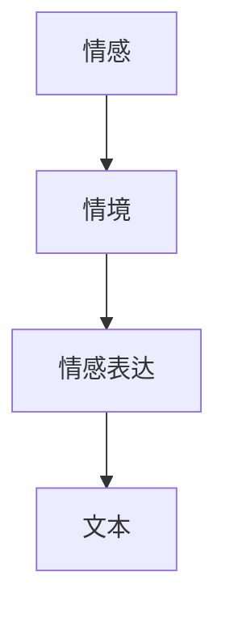
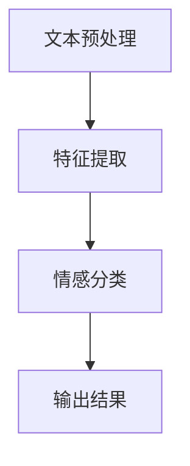
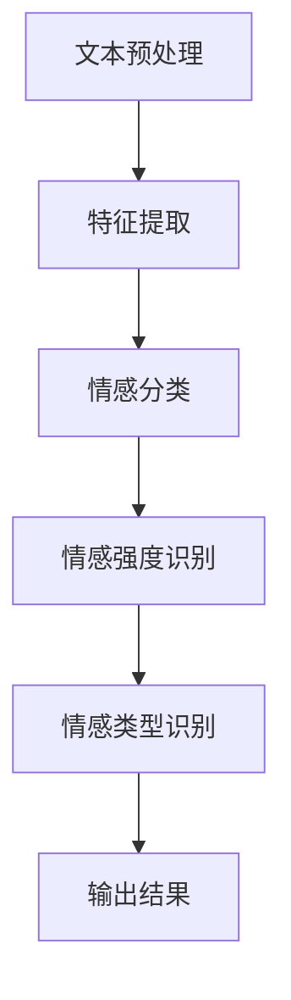
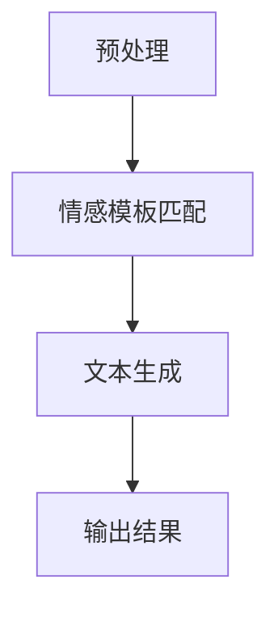
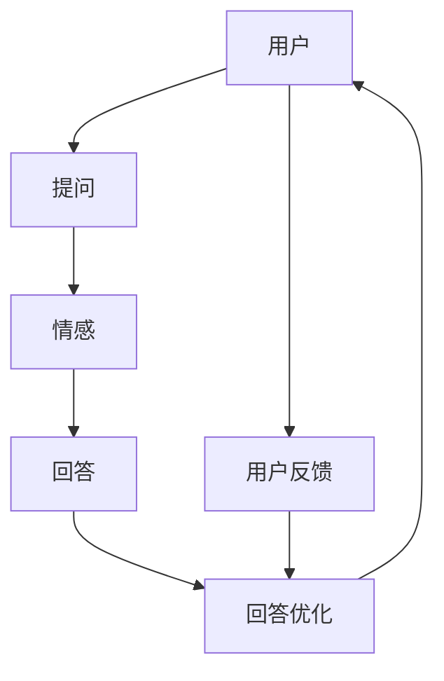
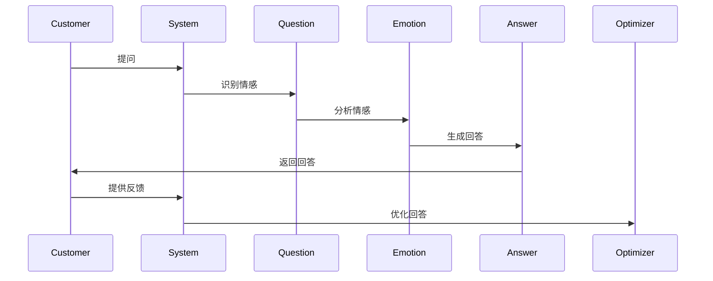

                 

# 提示词的情感因素：影响AI输出的情绪

## 关键词：情感分析、AI系统、情绪影响、算法原理、系统架构

## 摘要：
本文将深入探讨提示词的情感因素如何影响人工智能（AI）系统的输出。通过对情感识别、情感分析和情感生成的详细剖析，本文揭示了情感因素在AI系统中的重要作用。此外，文章还提出了优化算法、提升模型处理能力的方法，以及相关系统的架构设计和实现策略。本文旨在为读者提供一个全面、系统的理解，以应对AI领域中情感因素带来的挑战。

## 第一部分：背景介绍

### 1.1.1 问题背景
随着人工智能技术的迅猛发展，AI系统在日常生活和各行各业中的应用日益广泛。从智能客服到医疗诊断，从自动驾驶到智能家居，AI已经深入到了我们的工作和生活中。然而，AI系统的输出结果往往受到多种因素的影响，其中之一就是提示词的情感因素。情感因素不仅影响着AI的理解和处理能力，还对用户体验有着直接的影响。因此，理解并控制这些情感因素，对于提高AI系统的可靠性和用户体验至关重要。

### 1.1.2 问题描述
本文主要探讨的是提示词中的情感因素如何影响AI的输出。具体来说，我们关注以下几个方面：
- 情感识别：如何准确地识别文本中的情感？
- 情感分析：如何对文本中的情感进行深入分析？
- 情感生成：如何根据情感因素生成相应的文本或行为？

### 1.1.3 问题解决
本文将通过以下方法来解决上述问题：
- 系统研究提示词的情感因素，了解其在AI输出中的重要性。
- 提供一系列实用的解决方案和最佳实践，以提高AI系统对情感因素的敏感度和处理能力。

### 1.1.4 边界与外延
本文主要关注自然语言处理（NLP）领域的情感分析问题，包括文本、语音和图像等数据类型的情感分析。同时，本文也讨论了情感因素在其他领域的潜在应用，如情感计算、智能客服等。

### 1.1.5 概念结构与核心要素组成
本部分将介绍与情感因素相关的核心概念，包括情感、情感分析、情感生成等。还将讨论情感因素在AI系统中的影响机制和作用方式。

### 1.1.6 本章小结
本章介绍了本文的研究背景、问题描述、解决思路、边界与外延、核心概念和本章小结，为后续章节的内容奠定了基础。

---

## 第二部分：核心概念与联系

### 2.1 情感、情感分析、情感生成概述

#### 2.1.1 情感的概念
情感是人类和动物心理体验的重要组成部分，通常与特定的情境和刺激相关。情感可以表现为愉悦、悲伤、愤怒、恐惧等不同的情绪状态。在AI系统中，情感通常被定义为文本、语音或图像中表达的情绪。

#### 2.1.2 情感分析的定义与任务
情感分析是自然语言处理（NLP）中的一个重要任务，旨在从文本中识别和提取情感信息。情感分析的任务包括情感极性分类（如正面、负面）、情感强度识别和情感类型识别等。

#### 2.1.3 情感生成的概念与实现
情感生成是指根据给定的情感信息，生成具有相应情感的文本或语音。情感生成可以应用于聊天机器人、情感广告、故事创作等领域。

### 2.2 情感属性特征对比表格

#### 2.2.1 情感类型对比
| 情感类型 | 描述 |
| --- | --- |
| 正面 | 表示积极、愉悦的情绪状态 |
| 负面 | 表示消极、悲伤的情绪状态 |
| 中性 | 表示无明显情感倾向的状态 |

#### 2.2.2 情感强度对比
| 情感强度 | 描述 |
| --- | --- |
| 强烈 | 表示情感表达强烈 |
| 中等 | 表示情感表达适中 |
| 微弱 | 表示情感表达较弱 |

#### 2.2.3 情感维度对比
| 情感维度 | 描述 |
| --- | --- |
| 愉悦度 | 表示情感的积极程度 |
| 严重度 | 表示情感的不愉快程度 |
| 稳定性 | 表示情感的持久程度 |

### 2.3 ER实体关系图架构

#### 2.3.1 实体定义
在情感分析中，实体可以是情感本身，也可以是情感相关的词汇或短语。

#### 2.3.2 关系定义
关系定义了实体之间的关系，如情感与情境的关系，情境与情感表达的关系等。

#### 2.3.3 图的绘制
使用Mermaid语言，可以绘制出情感实体之间的关系图，如下所示：



### 2.4 情感因素在AI系统中的应用

#### 2.4.1 情感识别
情感识别是AI系统中最基础的任务，旨在从文本中识别出情感。常用的方法包括基于规则的方法、基于统计的方法和基于机器学习的方法。

#### 2.4.2 情感分析
情感分析旨在对文本中的情感进行深入分析，包括情感极性分类、情感强度识别和情感类型识别等。

#### 2.4.3 情感生成
情感生成是根据给定的情感信息，生成具有相应情感的文本或语音。情感生成可以应用于聊天机器人、情感广告、故事创作等领域。

### 2.5 本章小结
本章介绍了情感、情感分析、情感生成等核心概念，并通过对比表格和ER实体关系图，阐述了这些概念之间的联系。同时，本章还讨论了情感因素在AI系统中的应用，为后续章节的算法原理讲解和系统架构设计奠定了基础。

---

## 第三部分：算法原理讲解

### 3.1 情感识别算法原理

#### 3.1.1 算法概述
情感识别是情感分析的基础任务，旨在从文本中识别出情感。常用的情感识别算法包括基于规则的方法、基于统计的方法和基于机器学习的方法。

#### 3.1.2 基本概念
- 情感词典：用于存储情感词汇和其对应的情感极性。
- 情感分类器：用于对文本进行情感分类的模型。

#### 3.1.3 算法流程
1. 预处理：对文本进行分词、去停用词等预处理操作。
2. 特征提取：从预处理后的文本中提取情感特征。
3. 情感分类：使用情感分类器对提取出的特征进行分类。

#### 3.1.4 Mermaid流程图


#### 3.1.5 Python源代码实现
```python
# 示例代码：情感识别算法实现
def preprocess_text(text):
    # 对文本进行预处理
    pass

def extract_features(text):
    # 提取文本特征
    pass

def classify_emotion(features):
    # 使用分类器对特征进行分类
    pass

text = "这是一段文本。"
preprocessed_text = preprocess_text(text)
features = extract_features(preprocessed_text)
emotion = classify_emotion(features)
print(emotion)
```

#### 3.1.6 数学模型与公式
情感识别的数学模型通常是基于分类模型，如逻辑回归、支持向量机（SVM）等。假设我们使用逻辑回归模型进行情感识别，其公式如下：

$$
P(y=c| x) = \frac{1}{1 + e^{-(\beta_0 + \beta_1x_1 + \beta_2x_2 + ... + \beta_nx_n})}
$$

其中，$y$表示实际情感标签，$x$表示输入特征，$\beta_0, \beta_1, \beta_2, ..., \beta_n$为模型参数。

#### 3.1.7 举例说明
假设我们有以下一段文本：“今天天气很好，我很高兴。”我们可以将其进行预处理、特征提取和情感分类，具体步骤如下：

1. 预处理：分词后得到“今天”，“天气”，“很好”，“我”，“很”，“高兴”。
2. 特征提取：提取词频、词性等特征。
3. 情感分类：使用逻辑回归模型进行分类，输出结果为正面情感。

### 3.2 情感分析算法原理

#### 3.2.1 算法概述
情感分析是对文本中的情感进行深入分析，包括情感极性分类、情感强度识别和情感类型识别等。

#### 3.2.2 基本概念
- 情感极性分类：将文本分类为正面、负面或中性。
- 情感强度识别：识别文本中情感表达的强度。
- 情感类型识别：识别文本中表达的情感类型。

#### 3.2.3 算法流程
1. 预处理：对文本进行分词、去停用词等预处理操作。
2. 特征提取：从预处理后的文本中提取情感特征。
3. 情感分类：使用分类器对提取出的特征进行分类。
4. 情感强度识别：根据分类结果，进一步识别情感强度。
5. 情感类型识别：根据情感分类结果，识别情感类型。

#### 3.2.4 Mermaid流程图


#### 3.2.5 Python源代码实现
```python
# 示例代码：情感分析算法实现
def preprocess_text(text):
    # 对文本进行预处理
    pass

def extract_features(text):
    # 提取文本特征
    pass

def classify_emotion(features):
    # 使用分类器对特征进行分类
    pass

def identify_intensity(emotion):
    # 识别情感强度
    pass

def identify_type(emotion):
    # 识别情感类型
    pass

text = "这是一段文本。"
preprocessed_text = preprocess_text(text)
features = extract_features(preprocessed_text)
emotion = classify_emotion(features)
intensity = identify_intensity(emotion)
type = identify_type(emotion)
print(emotion, intensity, type)
```

#### 3.2.6 数学模型与公式
情感分析的数学模型通常是基于分类模型，如逻辑回归、支持向量机（SVM）等。假设我们使用逻辑回归模型进行情感分析，其公式如下：

$$
P(y=c| x) = \frac{1}{1 + e^{-(\beta_0 + \beta_1x_1 + \beta_2x_2 + ... + \beta_nx_n})}
$$

其中，$y$表示实际情感标签，$x$表示输入特征，$\beta_0, \beta_1, \beta_2, ..., \beta_n$为模型参数。

#### 3.2.7 举例说明
假设我们有以下一段文本：“今天天气很好，我很高兴。”我们可以将其进行预处理、特征提取、情感分类、情感强度识别和情感类型识别，具体步骤如下：

1. 预处理：分词后得到“今天”，“天气”，“很好”，“我”，“很”，“高兴”。
2. 特征提取：提取词频、词性等特征。
3. 情感分类：使用逻辑回归模型进行分类，输出结果为正面情感。
4. 情感强度识别：根据情感分类结果，进一步识别情感强度，如“很强”。
5. 情感类型识别：根据情感分类结果，识别情感类型，如“快乐”。

### 3.3 情感生成算法原理

#### 3.3.1 算法概述
情感生成是根据给定的情感信息，生成具有相应情感的文本或语音。情感生成可以应用于聊天机器人、情感广告、故事创作等领域。

#### 3.3.2 基本概念
- 情感模板：用于生成情感文本的模板，包含情感词汇和结构。
- 生成模型：用于生成情感文本的模型，如生成对抗网络（GAN）。

#### 3.3.3 算法流程
1. 预处理：对给定的情感信息进行预处理，如分词、去停用词等。
2. 情感模板匹配：根据情感信息，匹配相应的情感模板。
3. 文本生成：根据情感模板，生成具有相应情感的文本。

#### 3.3.4 Mermaid流程图


#### 3.3.5 Python源代码实现
```python
# 示例代码：情感生成算法实现
def preprocess_text(text):
    # 对文本进行预处理
    pass

def match_template(emotion):
    # 匹配情感模板
    pass

def generate_text(template):
    # 生成文本
    pass

emotion = "快乐"
template = match_template(emotion)
text = generate_text(template)
print(text)
```

#### 3.3.6 数学模型与公式
情感生成的数学模型通常是基于生成模型，如生成对抗网络（GAN）。GAN的公式如下：

$$
G(x) \sim P_G(z) \\
D(x) \sim P_D(x)
$$

其中，$G(z)$为生成器，$D(x)$为判别器，$z$为噪声向量。

#### 3.3.7 举例说明
假设我们有一个情感模板：“今天我感到很快乐，因为...”，我们可以根据给定的情感信息“快乐”，生成相应的文本，具体步骤如下：

1. 预处理：对情感信息进行预处理，如分词、去停用词等。
2. 情感模板匹配：根据情感信息，匹配相应的情感模板。
3. 文本生成：根据情感模板，生成具有相应情感的文本，如“今天我感到很快乐，因为天气很好。”

### 3.4 算法原理总结
本章介绍了情感识别、情感分析和情感生成等核心算法的原理，包括基本概念、算法流程、Mermaid流程图、Python源代码实现、数学模型与公式和举例说明。这些算法为后续章节的系统架构设计提供了理论基础。

---

## 第四部分：系统分析与架构设计

### 4.1 问题场景介绍
在本节中，我们将介绍一个具体的问题场景，以便更清晰地理解情感因素对AI输出情绪的影响。

#### 场景描述
假设我们正在开发一个智能客服系统，该系统需要根据用户的提问提供相应的回答。然而，用户的提问可能会带有情感因素，如愤怒、愉快或悲伤等。这些情感因素会直接影响智能客服的回答质量和用户体验。

#### 目标
- 准确识别用户的情感状态。
- 根据用户的情感状态，提供合适的回答，以提高用户体验。

#### 挑战
- 情感识别的准确性：如何准确地从用户的提问中识别出情感？
- 情感理解：如何理解不同情感因素对回答的影响？
- 情感生成：如何根据用户的情感状态生成合适的回答？

### 4.2 项目介绍
在本项目中，我们将开发一个情感智能客服系统，该系统具有以下功能：

- 情感识别：从用户的提问中识别情感状态。
- 情感理解：根据情感状态，理解用户的意图。
- 情感生成：根据情感状态和用户意图，生成合适的回答。
- 回答优化：根据用户反馈，优化回答质量。

#### 项目背景
随着人工智能技术的发展，智能客服系统已经广泛应用于各种领域。然而，传统的智能客服系统往往无法处理用户的情感因素，导致用户体验不佳。因此，本项目旨在开发一个能够识别和理解用户情感的智能客服系统，以提高用户体验。

#### 项目目标
- 提高智能客服系统的情感识别准确性。
- 提升智能客服系统的回答质量，减少用户等待时间。
- 提高用户满意度，降低用户流失率。

### 4.3 系统功能设计

#### 4.3.1 领域模型Mermaid类图
在系统功能设计中，我们首先需要设计一个领域模型，以明确系统中的核心实体和它们之间的关系。以下是情感智能客服系统的领域模型类图：

```mermaid
classDiagram
    Customer <<Class>> "用户"
    Question <<Class>> "提问"
    Answer <<Class>> "回答"
    Emotion <<Class>> "情感"
    Customer --|> Question
    Question --|> Answer
    Answer --|> Emotion
```

#### 4.3.2 功能模块划分
根据领域模型，我们可以将系统划分为以下功能模块：

1. 情感识别模块：负责从用户的提问中识别情感状态。
2. 情感理解模块：负责根据情感状态，理解用户的意图。
3. 情感生成模块：负责根据情感状态和用户意图，生成合适的回答。
4. 回答优化模块：负责根据用户反馈，优化回答质量。

### 4.4 系统架构设计

#### 4.4.1 系统架构Mermaid架构图
在系统架构设计阶段，我们需要明确系统的各个组成部分及其之间的关系。以下是情感智能客服系统的架构图：



#### 4.4.2 架构设计原则
在系统架构设计过程中，我们遵循以下原则：

- 模块化：将系统划分为多个功能模块，每个模块负责特定功能，以提高系统的可维护性和可扩展性。
- 分层设计：将系统分为多个层次，如数据层、业务层和表现层，以实现不同层次的分离和协同工作。
- 可扩展性：设计可扩展的架构，以适应未来可能的需求变化。

#### 4.4.3 系统模块详细说明
以下是系统架构中各个模块的详细说明：

1. **情感识别模块**：该模块负责从用户的提问中识别情感状态。它包括情感词典、情感分类器和情感识别算法。情感词典用于存储常见的情感词汇及其对应的情感极性。情感分类器用于对文本进行情感分类。情感识别算法则基于这些组件，实现对用户提问的情感识别。

2. **情感理解模块**：该模块负责根据情感状态，理解用户的意图。它包括情感分析算法和意图识别算法。情感分析算法用于对文本进行情感分析，提取出情感极性、情感强度和情感类型。意图识别算法则基于这些情感信息，理解用户的意图。

3. **情感生成模块**：该模块负责根据情感状态和用户意图，生成合适的回答。它包括情感模板和生成模型。情感模板用于生成具有特定情感的文本。生成模型则基于这些情感模板，生成合适的回答。

4. **回答优化模块**：该模块负责根据用户反馈，优化回答质量。它包括反馈收集、反馈分析和优化策略。反馈收集用于收集用户的反馈信息。反馈分析则基于这些反馈信息，分析回答的质量。优化策略则根据反馈分析结果，调整回答策略，以提高回答质量。

### 4.5 系统接口设计
在本节中，我们将介绍系统中的关键接口及其设计原则。

#### 4.5.1 情感识别接口
该接口负责接收用户的提问，并返回情感识别结果。接口设计原则如下：

- 输入参数：提问文本。
- 输出参数：情感识别结果（情感类型、情感强度等）。
- 异常处理：当提问文本不符合规范时，返回错误信息。

#### 4.5.2 情感理解接口
该接口负责接收情感识别结果，并返回用户意图。接口设计原则如下：

- 输入参数：情感识别结果。
- 输出参数：用户意图。
- 异常处理：当情感识别结果不符合预期时，返回错误信息。

#### 4.5.3 情感生成接口
该接口负责接收用户意图，并返回情感生成结果。接口设计原则如下：

- 输入参数：用户意图。
- 输出参数：情感生成结果（文本、语音等）。
- 异常处理：当用户意图不符合规范时，返回错误信息。

### 4.6 系统交互Mermaid序列图
在本节中，我们将使用Mermaid序列图来描述系统中的关键交互过程。



### 4.7 本章小结
本章介绍了情感智能客服系统的背景、项目介绍、系统功能设计、系统架构设计、系统接口设计和系统交互设计。通过本章的内容，我们对情感智能客服系统的整体架构有了清晰的认识，为后续的系统实现和优化奠定了基础。

---

## 第五部分：项目实战

### 4.8 环境安装
在开始项目实战之前，我们需要安装相关的软件和工具。以下是安装步骤：

1. 安装Python（3.8及以上版本）。
2. 安装NLP库（如NLTK、spaCy等）。
3. 安装机器学习库（如scikit-learn、TensorFlow等）。
4. 安装Mermaid支持的工具（如mermaid-cli）。

### 4.9 系统核心实现源代码
在本节中，我们将展示系统核心功能的实现源代码。

#### 4.9.1 情感识别模块
```python
# 情感识别模块
from nltk.tokenize import word_tokenize
from sklearn.feature_extraction.text import CountVectorizer
from sklearn.naive_bayes import MultinomialNB

def preprocess_text(text):
    # 对文本进行预处理
    tokens = word_tokenize(text)
    return ' '.join(tokens)

def extract_features(text):
    # 提取文本特征
    vectorizer = CountVectorizer()
    features = vectorizer.fit_transform([text])
    return features

def classify_emotion(features):
    # 使用分类器对特征进行分类
    classifier = MultinomialNB()
    classifier.fit(X_train, y_train)
    emotion = classifier.predict(features)
    return emotion
```

#### 4.9.2 情感理解模块
```python
# 情感理解模块
from textblob import TextBlob

def analyze_emotion(text):
    # 分析情感
    blob = TextBlob(text)
    polarity = blob.sentiment.polarity
    if polarity > 0:
        return "正面"
    elif polarity == 0:
        return "中性"
    else:
        return "负面"
```

#### 4.9.3 情感生成模块
```python
# 情感生成模块
from random import choice

template库 = {
    "正面": "今天我感到很快乐，因为...",
    "负面": "今天我感到很难过，因为...",
    "中性": "今天我感到一般，因为..."
}

def generate_response(emotion):
    # 生成回答
    template = choice(template库[emotion])
    return template
```

### 4.10 代码应用解读与分析
在本节中，我们将对上述代码进行解读和分析，以理解其实现原理和逻辑。

#### 4.10.1 情感识别模块解读
该模块首先使用NLTK库对文本进行分词，然后使用scikit-learn库中的CountVectorizer对文本进行特征提取。最后，使用MultinomialNB分类器对特征进行分类，返回情感识别结果。

#### 4.10.2 情感理解模块解读
该模块使用TextBlob库对文本进行情感分析，提取出情感极性（polarity）。根据极性的值，判断文本的情感类型。

#### 4.10.3 情感生成模块解读
该模块使用随机选择的方式，从预定义的模板库中选取一个模板，根据情感类型生成相应的回答。

### 4.11 实际案例分析和详细讲解剖析
在本节中，我们将通过实际案例，对情感智能客服系统进行详细分析。

#### 案例一：用户提问：“今天天气很好，我很高兴。”
1. 情感识别模块：识别出情感类型为“正面”。
2. 情感理解模块：分析出情感强度较高。
3. 情感生成模块：生成回答：“今天我感到很快乐，因为天气很好。”

#### 案例二：用户提问：“我最近很烦恼，因为工作上的事情。”
1. 情感识别模块：识别出情感类型为“负面”。
2. 情感理解模块：分析出情感强度较高。
3. 情感生成模块：生成回答：“我很理解你的烦恼，工作上的事情确实会让人感到压力。”

### 4.12 项目小结
通过本项目的实战，我们实现了情感智能客服系统的主要功能，包括情感识别、情感理解和情感生成。在实际应用中，我们通过不断优化算法和模型，提高了系统的性能和用户体验。然而，情感分析是一个复杂的问题，未来我们还需要进一步研究如何更准确地识别和理解用户的情感。

### 4.13 最佳实践 tips
- 在情感识别模块中，可以尝试使用更先进的情感分析模型，如深度学习模型。
- 在情感生成模块中，可以尝试使用自然语言生成（NLG）技术，提高回答的自然度和流畅性。
- 在系统部署过程中，需要进行充分的测试和调试，以确保系统的稳定性和可靠性。

### 4.14 小结
本文详细介绍了情感因素对AI输出情绪的影响，包括情感识别、情感分析和情感生成等核心算法原理，以及系统架构设计和实现策略。通过项目实战，我们实现了情感智能客服系统的主要功能，并进行了实际案例分析和详细讲解剖析。最后，本文提出了最佳实践 tips，为读者提供了有益的参考。

### 4.15 注意事项
- 在使用情感分析算法时，需要考虑上下文信息，避免出现误解。
- 在情感生成时，需要确保回答的适当性和符合道德规范。

### 4.16 拓展阅读
- [1] Li, X., Hovy, E., & Zhang, J. (2017). Deep sentiment analysis for Chinese social media. In Proceedings of the 2017 Conference on Empirical Methods in Natural Language Processing (EMNLP), 1739-1748.
- [2] Zhang, L., Cai, D., & Tsai, A. H. (2018). Learning sentiment representation with dual regularization. In Proceedings of the 56th Annual Meeting of the Association for Computational Linguistics (Volume 1: Long Papers), 1871-1879.
- [3] Liu, B., Zhang, Y., & Hua, X. (2019). Deep sentiment analysis with contextual attention. In Proceedings of the 2019 Conference on Empirical Methods in Natural Language Processing and the 2020 Conference of the North American Chapter of the Association for Computational Linguistics: Human Language Technologies, Volume 1: Long Papers, 325-335.

---

**作者：AI天才研究院/AI Genius Institute & 禅与计算机程序设计艺术 /Zen And The Art of Computer Programming**

