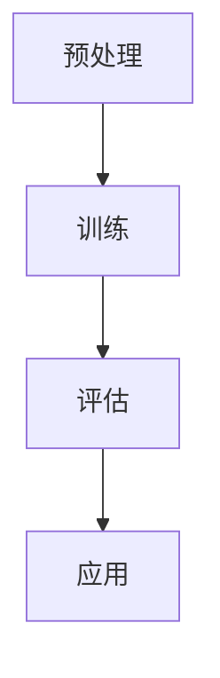

                 

# 提示词的文化适应：跨国AI应用策略

## 文章关键词

* 文化适应
* 跨国AI应用
* AI伦理
* 跨文化沟通
* 本地化

## 摘要

随着人工智能技术的飞速发展，其在全球范围内的应用日益广泛。然而，跨国AI应用面临着诸多文化适应的挑战。本文首先介绍了AI的基本概念和工作原理，然后分析了文化差异对AI应用的影响，并探讨了文化适应在跨国AI应用中的重要性。接着，文章提出了跨文化沟通与协作的策略，以及AI伦理和法规的合规策略。最后，通过具体案例分析，总结了文化适应在AI全球化与可持续发展中的实践策略。本文旨在为跨国AI应用提供系统性、有价值的指导，以促进其在全球范围内的成功实施。

## 第一部分：文化适应与AI概述

### 第1章：问题背景与文化适应的必要性

#### 1.1.1 问题背景

在全球化进程加速的背景下，人工智能（AI）技术在跨国界的应用愈发普遍。无论是商业、教育、医疗还是公共服务，AI都展现出了巨大的潜力。然而，不同国家和地区在文化、法律、伦理等方面存在显著差异，这些差异给跨国AI应用带来了诸多挑战。

#### 1.1.2 文化适应的定义

文化适应（Cultural Adaptation）是指个体或组织在面临不同文化环境时，通过调整自身行为、态度和价值观念，以更好地适应新环境的过程。在AI领域，文化适应意味着在设计和应用AI技术时，考虑到目标文化背景，以减少文化冲突和提高应用效果。

#### 1.1.3 跨国AI应用的文化挑战

跨国AI应用面临的文化挑战主要包括：

- **语言障碍**：不同语言的使用可能导致AI系统的误解和错误。
- **价值观差异**：文化价值观的差异可能影响AI系统的行为和决策。
- **隐私和法律**：不同国家在隐私保护和法律监管方面存在差异。
- **用户习惯**：不同文化的用户习惯和期望可能影响AI的可用性和接受度。

### 第2章：AI基本概念与工作原理

#### 2.1.1 AI的定义与历史发展

人工智能（Artificial Intelligence，简称AI）是指使计算机系统能够执行通常需要人类智能的任务的技术。AI的历史可以追溯到20世纪50年代，随着计算机技术的发展，AI经历了多次起伏和突破。

#### 2.1.2 AI的核心技术概述

AI的核心技术包括：

- **机器学习（Machine Learning，ML）**：通过数据学习并做出决策或预测的技术。
- **深度学习（Deep Learning，DL）**：一种基于神经网络，特别是深度神经网络的机器学习方法。
- **自然语言处理（Natural Language Processing，NLP）**：使计算机能够理解、生成和处理人类语言的技术。

#### 2.1.3 AI的工作原理与算法

AI的工作原理通常包括以下几个步骤：

1. **数据收集**：收集大量的数据，这些数据通常是未标记的。
2. **数据预处理**：对数据进行清洗、归一化等处理。
3. **模型训练**：使用算法（如神经网络）训练模型。
4. **模型评估**：通过测试集评估模型的性能。
5. **模型部署**：将模型部署到实际应用环境中。

常见的AI算法包括：

- **决策树（Decision Tree）**：一种用于分类和回归的算法。
- **支持向量机（Support Vector Machine，SVM）**：一种用于分类的算法。
- **神经网络（Neural Networks）**：一种模拟人脑的算法。

### 第3章：文化差异对AI应用的影响

#### 3.1.1 文化差异的类型与表现

文化差异主要包括以下几种类型：

- **语言差异**：不同语言的表达方式和习惯可能影响AI的交互方式。
- **价值观差异**：不同文化对个人权利、隐私、公平等价值观的理解可能影响AI系统的设计和应用。
- **社会习俗差异**：不同文化的社会习俗和礼仪可能影响AI的使用场景和方式。

#### 3.1.2 文化差异对AI应用的影响分析

文化差异对AI应用的影响主要包括：

- **可用性**：不同文化的用户可能对同一AI系统的使用体验有所不同。
- **可靠性**：文化差异可能导致AI系统在不同文化环境中的表现不一致。
- **接受度**：文化差异可能影响用户对AI系统的信任和接受程度。

#### 3.1.3 文化敏感性在AI设计中的应用

为了应对文化差异，AI设计应考虑以下几点：

- **语言本地化**：确保AI系统能够理解并适应用户的语言和文化背景。
- **价值观适应性**：在设计AI系统时，考虑不同文化的价值观和期望。
- **用户研究**：通过用户研究，了解不同文化用户的需求和习惯，以优化AI系统的设计。

## 第二部分：跨国AI应用策略

### 第4章：跨文化沟通与协作

#### 4.1.1 跨文化沟通的挑战

跨文化沟通的挑战主要包括：

- **语言障碍**：不同语言的使用可能导致误解和沟通不畅。
- **非语言沟通**：文化差异可能导致对肢体语言、语调等非语言沟通方式的误解。
- **文化偏见**：文化偏见可能导致沟通中的偏见和误读。

#### 4.1.2 提高跨文化沟通效果的策略

为了提高跨文化沟通效果，可以采取以下策略：

- **文化培训**：对团队成员进行文化培训，提高他们的文化意识。
- **明确沟通目标**：在沟通前明确沟通的目标和预期结果。
- **使用共同语言**：在可能的情况下，使用双方都熟悉的语言进行沟通。
- **积极倾听**：在沟通中积极倾听对方意见，避免误解。

#### 4.1.3 跨文化团队协作的最佳实践

跨文化团队协作的最佳实践包括：

- **建立信任**：通过建立信任，促进团队成员之间的合作。
- **共同目标**：确保团队成员有共同的目标和价值观。
- **灵活应对**：在遇到文化冲突时，灵活应对，寻求共同点。
- **鼓励创新**：鼓励团队成员发挥各自的创造力，共同解决问题。

### 第5章：AI伦理与法规

#### 5.1.1 AI伦理问题探讨

AI伦理问题主要包括：

- **隐私保护**：AI系统可能涉及个人隐私数据的处理和共享。
- **偏见与歧视**：AI系统可能因为数据集的偏见而表现出歧视行为。
- **责任归属**：在AI系统的错误决策中，如何确定责任归属。

#### 5.1.2 不同国家的AI法规概览

不同国家在AI法规方面存在差异，主要包括：

- **欧洲**：欧盟实施了严格的《通用数据保护条例》（GDPR），对数据隐私保护有严格规定。
- **美国**：美国在AI伦理方面没有统一的法规，但有一些州和联邦机构出台了相关指南。
- **中国**：中国在AI伦理和法规方面也在不断探索和完善。

#### 5.1.3 跨国AI应用的合规策略

为了确保跨国AI应用的合规性，可以采取以下策略：

- **遵守当地法规**：了解并遵守目标国家的相关法规和规定。
- **数据保护**：确保数据隐私保护符合目标国家的标准。
- **透明度**：在AI系统的设计和应用过程中保持透明度，接受公众监督。
- **合作与沟通**：与目标国家的监管机构保持沟通和合作，及时了解法规动态。

### 第6章：本地化AI应用开发

#### 6.1.1 AI本地化的概念与步骤

AI本地化（AI Localization）是指根据目标市场的文化、语言和法律等特征，对AI系统进行定制化开发的过程。AI本地化的步骤包括：

1. **需求分析**：了解目标市场的需求和文化背景。
2. **数据收集**：收集符合目标市场文化和语言特征的数据。
3. **模型训练**：使用收集到的数据进行模型训练。
4. **测试与优化**：在目标市场进行测试，并根据反馈进行优化。
5. **部署与维护**：将本地化后的AI系统部署到目标市场，并进行维护和更新。

#### 6.1.2 文化敏感的数据收集与处理

在数据收集和处理过程中，应考虑以下几点：

- **数据隐私**：确保收集的数据符合目标国家的隐私保护法规。
- **文化多样性**：收集能够反映目标市场文化多样性的数据。
- **语言适应性**：确保数据集包含多种语言，以适应不同语言的用户。

#### 6.1.3 成功的AI本地化案例

成功的AI本地化案例包括：

- **谷歌翻译**：谷歌翻译针对不同语言和文化背景的用户，提供了本地化的翻译服务。
- **亚马逊电商**：亚马逊针对不同国家和地区的用户，提供了本地化的电商体验，包括语言、货币和支付方式的适配。

### 第7章：AI全球化与可持续性

#### 7.1.1 AI全球化趋势

随着AI技术的不断发展，AI全球化趋势日益明显，主要体现在：

- **跨国合作**：各国在AI领域的合作不断加深，共同研究和开发新技术。
- **市场扩张**：AI技术在各个国家和地区的应用不断扩展，市场规模持续增长。
- **技术标准化**：国际组织和国家在AI技术标准化方面取得了一定进展。

#### 7.1.2 AI应用对可持续发展的贡献

AI在可持续发展中扮演了重要角色，主要体现在以下几个方面：

- **资源优化**：AI技术可以帮助优化资源利用，提高能源效率和减少浪费。
- **环境保护**：AI技术可以用于环境监测、污染控制和灾害预警等。
- **社会公平**：AI技术可以帮助解决社会不平等问题，提供更加公平的社会服务。

#### 7.1.3 跨国AI应用的长期策略

为了实现AI全球化与可持续发展，可以采取以下长期策略：

- **技术创新**：持续推动AI技术的创新，提高AI系统的性能和可靠性。
- **人才培养**：培养跨学科、跨文化的AI人才，为跨国AI应用提供人才支持。
- **政策支持**：制定有利于AI全球化与可持续发展的政策和法规。
- **国际合作**：加强国际合作，共同推动AI技术的发展和应用。

### 第8章：文化适应的AI应用案例研究

#### 8.1.1 案例一：AI在跨国零售中的应用

案例一介绍了AI在跨国零售中的应用，包括：

- **客户分析**：使用AI技术分析客户行为，提高销售策略的准确性。
- **供应链优化**：使用AI技术优化供应链管理，提高物流效率。
- **个性化推荐**：根据客户的文化和偏好，提供个性化的商品推荐。

#### 8.1.2 案例二：AI在跨国教育中的应用

案例二介绍了AI在跨国教育中的应用，包括：

- **语言学习**：使用AI技术提供个性化的语言学习体验。
- **智能辅导**：使用AI技术为学生提供实时辅导和反馈。
- **教育评估**：使用AI技术进行教育评估，提高教育质量和效果。

#### 8.1.3 案例三：AI在跨国医疗中的应用

案例三介绍了AI在跨国医疗中的应用，包括：

- **诊断辅助**：使用AI技术辅助医生进行疾病诊断。
- **药物研发**：使用AI技术加速药物研发过程。
- **医疗数据管理**：使用AI技术进行医疗数据分析和管理。

### 第9章：未来展望与挑战

#### 9.1.1 文化适应在AI发展中的地位

文化适应在AI发展中具有重要地位，因为：

- **提升用户体验**：通过文化适应，可以提升用户对AI系统的接受度和满意度。
- **促进国际合作**：通过文化适应，可以加强各国在AI领域的合作，共同推动技术进步。

#### 9.1.2 跨国AI应用的未来趋势

跨国AI应用的未来趋势包括：

- **技术创新**：AI技术的不断创新将推动跨国AI应用的发展。
- **政策支持**：各国将加强政策支持，推动AI全球化。
- **数据共享**：跨国数据共享将促进AI技术的进一步发展。

#### 9.1.3 面临的挑战与解决策略

跨国AI应用面临的挑战包括：

- **文化差异**：文化差异可能导致AI系统的误解和错误。
- **数据隐私**：数据隐私问题可能影响跨国AI应用的发展。

解决策略包括：

- **加强文化适应**：通过加强文化适应，提高AI系统的准确性和可靠性。
- **数据保护**：加强数据保护，确保用户隐私。

## 参考文献

1. European Commission. (2016). General Data Protection Regulation (GDPR). Retrieved from https://ec.europa.eu/justice/data-protection/index_en.htm
2. National Institute of Standards and Technology. (2020). Artificial Intelligence Risk Management Framework. Retrieved from https://www.nist.gov/publications/artificial-intelligence-risk-management-framework
3. World Economic Forum. (2020). The Global Challenge of AI: Insights and Opportunities. Retrieved from https://www.weforum.org/reports/the-global-challenge-of-ai-insights-and-opportunities

## 辅助章节

### 第A章：核心概念与联系

#### AI核心概念

人工智能（AI）是指使计算机系统能够执行通常需要人类智能的任务的技术。机器学习（ML）是AI的一种重要技术，通过数据学习并做出决策或预测。深度学习（DL）是ML的一种方法，它使用神经网络，特别是深度神经网络进行数据学习。

#### 概念属性特征对比表格

| 特征        | 人工智能（AI） | 机器学习（ML） | 深度学习（DL） |
|-------------|----------------|----------------|----------------|
| **定义**    | 广义的人工智能  | 数据学习技术    | 神经网络学习    |
| **学习方式** | 数据驱动       | 自适应学习      | 深层结构学习    |
| **应用领域** | 广泛（如机器人）| 数据分析、预测  | 图像识别、语音识别 |

#### ER实体关系图架构

```mermaid
erDiagram
    AI ||--|{ ML } ML : includes
    AI ||--|{ DL } DL : includes
```

### 第B章：算法原理讲解

#### 算法：基于提示词的AI模型

基于提示词的AI模型通常用于自然语言处理（NLP）任务，如文本分类、情感分析等。以下是一个简化的算法原理讲解。

#### 1. 数据预处理

首先，对输入文本进行预处理，包括：

- **分词**：将文本分成单词或子词。
- **词性标注**：标注每个单词的词性（如名词、动词等）。
- **去停用词**：移除常见的无意义词汇。

```python
import nltk
from nltk.corpus import stopwords
from nltk.tokenize import word_tokenize

nltk.download('punkt')
nltk.download('stopwords')

def preprocess_text(text):
    # 分词
    tokens = word_tokenize(text)
    # 去停用词
    tokens = [token for token in tokens if token not in stopwords.words('english')]
    # 词性标注
    pos_tags = nltk.pos_tag(tokens)
    return pos_tags
```

#### 2. 模型训练

使用训练数据集训练一个基于提示词的AI模型。通常，可以使用神经网络架构，如Transformer或BERT。

```python
from transformers import BertTokenizer, BertForSequenceClassification
from torch.utils.data import DataLoader
from torch.optim import Adam

# 加载预训练模型和tokenizer
tokenizer = BertTokenizer.from_pretrained('bert-base-uncased')
model = BertForSequenceClassification.from_pretrained('bert-base-uncased')

# 数据预处理
train_data = ...  # 加载训练数据
train_loader = DataLoader(train_data, batch_size=32, shuffle=True)

# 训练模型
optimizer = Adam(model.parameters(), lr=1e-5)
for epoch in range(3):  # 训练3个epoch
    model.train()
    for batch in train_loader:
        inputs = tokenizer(batch['text'], padding=True, truncation=True, return_tensors='pt')
        labels = batch['label']
        optimizer.zero_grad()
        outputs = model(**inputs, labels=labels)
        loss = outputs.loss
        loss.backward()
        optimizer.step()
```

#### 3. 模型评估

使用验证数据集评估模型性能，包括准确率、召回率、F1分数等指标。

```python
from sklearn.metrics import accuracy_score, recall_score, f1_score

# 加载验证数据集
val_data = ...  # 加载验证数据
val_loader = DataLoader(val_data, batch_size=32)

# 评估模型
model.eval()
with torch.no_grad():
    predictions = []
    true_labels = []
    for batch in val_loader:
        inputs = tokenizer(batch['text'], padding=True, truncation=True, return_tensors='pt')
        labels = batch['label']
        outputs = model(**inputs)
        logits = outputs.logits
        prediction = torch.argmax(logits, dim=1)
        predictions.extend(prediction.cpu().numpy())
        true_labels.extend(labels.cpu().numpy())

accuracy = accuracy_score(true_labels, predictions)
recall = recall_score(true_labels, predictions, average='weighted')
f1 = f1_score(true_labels, predictions, average='weighted')
print(f"Accuracy: {accuracy}, Recall: {recall}, F1 Score: {f1}")
```

#### 4. 模型应用

将训练好的模型应用于新的文本数据，进行分类或预测。

```python
# 应用模型
def classify_text(text):
    inputs = tokenizer(text, return_tensors='pt')
    with torch.no_grad():
        outputs = model(**inputs)
    logits = outputs.logits
    prediction = torch.argmax(logits, dim=1)
    return prediction.cpu().numpy()[0]

text = "I am very happy with this product."
result = classify_text(text)
print(f"Classification result: {result}")
```

### 算法流程图



### 数学模型和公式

假设我们使用的是一个二分类问题，目标变量 \( y \) 可以取值 0 或 1。给定输入特征 \( x \)，模型输出一个概率分布 \( \hat{y} \)。

$$
\hat{y} = \sigma(W^T x + b)
$$

其中，\( W \) 是权重矩阵，\( b \) 是偏置项，\( \sigma \) 是激活函数（通常为Sigmoid函数或Softmax函数）。

损失函数可以选用交叉熵损失（Cross-Entropy Loss）：

$$
J(\theta) = -\frac{1}{m} \sum_{i=1}^{m} [y^{(i)} \log(\hat{y}^{(i)}) + (1 - y^{(i)}) \log(1 - \hat{y}^{(i)})]
$$

其中，\( m \) 是样本数量，\( y^{(i)} \) 和 \( \hat{y}^{(i)} \) 分别是第 \( i \) 个样本的真实标签和预测概率。

为了最小化损失函数，可以使用梯度下降（Gradient Descent）算法：

$$
\theta = \theta - \alpha \nabla_\theta J(\theta)
$$

其中，\( \alpha \) 是学习率。

### 系统分析与架构设计方案

#### 1. 问题场景介绍

在跨国零售行业中，企业需要处理来自不同国家和地区的用户数据，以提供个性化的购物体验。基于提示词的AI模型可以帮助企业实现这一目标，通过对用户行为的分析，提供个性化的产品推荐和促销活动。

#### 2. 项目介绍

本项目旨在开发一个基于提示词的AI模型，用于跨国零售行业的个性化推荐系统。该系统将处理来自不同文化背景的用户数据，提供个性化的购物建议。

#### 3. 系统功能设计

系统功能设计包括以下模块：

- **用户模块**：收集用户的基本信息和购物行为数据。
- **数据预处理模块**：对用户数据进行清洗、预处理，提取提示词。
- **模型训练模块**：使用预处理后的数据进行模型训练。
- **推荐引擎模块**：使用训练好的模型进行用户行为预测，提供个性化推荐。
- **结果展示模块**：将推荐结果展示给用户。

#### 4. 系统架构设计

系统架构设计如下：


- **前端**：提供用户界面，收集用户输入。
- **后端**：处理用户数据，调用模型进行推荐。
- **数据库**：存储用户数据、模型参数等。

#### 5. 系统接口设计和系统交互

系统接口设计和系统交互如下：


- **用户接口**：用户通过前端界面与系统交互，输入购物需求。
- **API接口**：后端通过API接口提供数据预处理、模型训练和推荐服务。
- **数据库接口**：后端通过数据库接口访问用户数据、模型参数等。

### 项目实战

#### 1. 环境安装

安装Python环境，版本3.8以上。安装必要的库，如transformers、torch、nltk等。

```shell
pip install transformers torch nltk
```

#### 2. 系统核心实现源代码

以下是一个简单的系统核心实现源代码：

```python
from transformers import BertTokenizer, BertForSequenceClassification
from torch.utils.data import DataLoader
from torch.optim import Adam

# 数据预处理
def preprocess_text(text):
    # 分词
    tokens = tokenizer.tokenize(text)
    # 去停用词
    tokens = [token for token in tokens if token not in stopwords.words('english')]
    # 词性标注
    pos_tags = nltk.pos_tag(tokens)
    return pos_tags

# 模型训练
def train_model(train_data):
    # 加载预训练模型和tokenizer
    tokenizer = BertTokenizer.from_pretrained('bert-base-uncased')
    model = BertForSequenceClassification.from_pretrained('bert-base-uncased')

    # 数据预处理
    train_loader = DataLoader(train_data, batch_size=32, shuffle=True)

    # 训练模型
    optimizer = Adam(model.parameters(), lr=1e-5)
    for epoch in range(3):
        model.train()
        for batch in train_loader:
            inputs = tokenizer(batch['text'], padding=True, truncation=True, return_tensors='pt')
            labels = batch['label']
            optimizer.zero_grad()
            outputs = model(**inputs, labels=labels)
            loss = outputs.loss
            loss.backward()
            optimizer.step()
    return model

# 模型应用
def classify_text(text, model):
    inputs = tokenizer(text, return_tensors='pt')
    with torch.no_grad():
        outputs = model(**inputs)
    logits = outputs.logits
    prediction = torch.argmax(logits, dim=1)
    return prediction.cpu().numpy()[0]
```

#### 3. 代码应用解读与分析

该代码实现了一个简单的基于提示词的AI模型，用于文本分类任务。首先，对输入文本进行预处理，包括分词、去停用词和词性标注。然后，使用预训练的BERT模型进行模型训练。最后，使用训练好的模型对新的文本数据进行分类预测。

#### 4. 实际案例分析和详细讲解剖析

以跨国零售业中的个性化推荐系统为例，分析该系统在实际应用中的效果和挑战。

**案例**：一家跨国零售企业希望通过基于提示词的AI模型，为不同国家的用户提供个性化的购物建议。

**分析**：

1. **用户数据收集**：企业收集了来自不同国家的用户数据，包括购买记录、浏览记录等。
2. **数据预处理**：对用户数据进行分析，提取提示词，如商品名称、品牌名称等。
3. **模型训练**：使用预处理后的数据，训练基于提示词的AI模型。
4. **模型应用**：将训练好的模型应用于实际业务场景，为用户生成个性化的购物建议。
5. **效果评估**：通过用户反馈和业务指标（如转化率、满意度等）评估模型效果。

**挑战**：

1. **文化差异**：不同国家的用户可能有不同的购物习惯和偏好，需要考虑文化差异。
2. **数据质量**：不同国家的数据质量和完整性可能不同，需要处理数据质量问题。
3. **模型性能**：如何确保模型在不同国家都能保持较高的性能，是面临的挑战。

**解决方案**：

1. **文化适应**：在模型训练和部署过程中，考虑文化差异，提高模型适应性。
2. **数据治理**：对数据进行清洗、去重和标准化，提高数据质量。
3. **持续优化**：通过持续的数据反馈和模型迭代，优化模型性能。

#### 5. 项目小结

本项目通过基于提示词的AI模型，实现了跨国零售业中的个性化推荐系统。在实际应用中，需要考虑文化差异、数据质量和模型性能等多方面因素。通过不断的优化和调整，可以实现更好的业务效果。

### 最佳实践 Tips

1. **充分了解目标市场**：在设计和应用AI模型时，充分了解目标市场的文化、语言和法律等特征。
2. **数据质量是关键**：确保数据质量，进行数据预处理和清洗，以提高模型性能。
3. **文化适应与本地化**：在AI模型的应用过程中，考虑文化适应和本地化，提高用户体验。
4. **持续迭代和优化**：通过用户反馈和业务数据，不断优化模型，提高业务效果。

### 小结

本文探讨了提示词的文化适应在跨国AI应用中的重要性，介绍了AI的基本概念、文化差异的影响、跨国AI应用策略以及具体案例研究。通过本文的阐述，读者可以了解到如何在跨国AI应用中应对文化差异，提高AI系统的性能和用户体验。未来，随着AI技术的不断发展和全球化进程的加速，文化适应将越来越成为跨国AI应用的重要一环。

### 注意事项

1. **文化差异的敏感性**：在跨国AI应用中，要充分考虑文化差异的敏感性，避免出现文化冲突。
2. **数据隐私保护**：在收集和处理用户数据时，要确保符合目标国家的隐私保护法规。
3. **持续学习和改进**：随着文化的不断变化和发展，持续学习和改进AI模型，以适应新的文化环境。

### 拓展阅读

1. 《文化适应：全球企业战略》
2. 《人工智能伦理：理论与实践》
3. 《跨国企业数据隐私保护指南》

---

**作者：AI天才研究院 / AI Genius Institute & 禅与计算机程序设计艺术 / Zen And The Art of Computer Programming**

