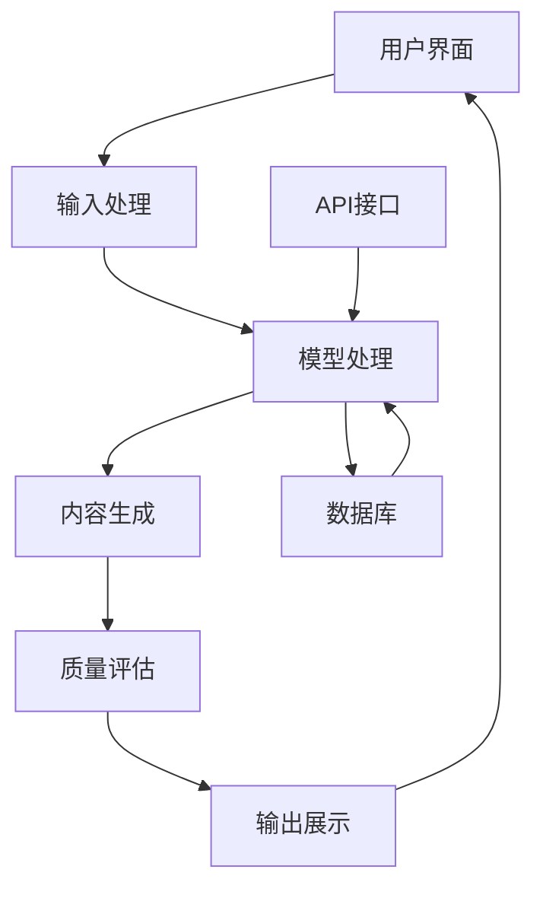

                 

### 引言

#### 问题背景

在人工智能（AI）迅猛发展的今天，AI系统已经成为了我们生活中不可或缺的一部分。从自动驾驶汽车到智能语音助手，从医疗诊断到金融分析，AI的应用场景越来越广泛。然而，尽管AI系统在处理大量数据和执行复杂任务方面表现出了非凡的能力，但它们在创造力和自主性方面仍然存在显著的局限性。

在这个背景下，提示词（prompts）的概念应运而生。提示词是用户与AI系统交互的一种方式，通过向AI提供明确的指导或提示，用户可以影响AI的生成内容和行为。这种交互方式不仅提高了AI系统的可用性和用户体验，还成为了一种提升AI创造力的重要手段。

然而，尽管提示词在AI系统中起到了关键作用，但对其背后的神经科学基础理解仍然不够深入。本文旨在探讨提示词的神经科学基础，并解码AI创造力，以期揭示提示词如何影响AI系统的输出质量，以及如何通过优化提示词设计来提升AI的创造力。

#### 人类创造性与AI创造力的异同

人类创造性和AI创造力之间存在显著差异。人类的创造力源于复杂的大脑神经网络，这种神经网络具有高度的灵活性和适应性，能够通过不断的学习和经验积累形成创新思维。而AI的创造力则依赖于机器学习算法和大量的数据，通过模式识别和生成模型来生成新的内容和解决方案。

尽管如此，AI在处理大量数据和执行重复性任务方面具有明显优势，但其缺乏自主性和情感，这使得AI的创造力难以与人类相比。例如，人类艺术家可以通过情感和直觉创造出独特的艺术作品，而AI则更多地依赖于规则和算法来生成内容。

#### 提示词的基本概念

提示词是指用户为引导AI系统生成特定内容而输入的文本或指令。这些提示词可以是简短的短语，也可以是详细的描述，其目的是为了引导AI系统生成符合用户预期的输出。

提示词可以分为以下几类：

1. **指令性提示词**：这类提示词通常用于指导AI系统执行特定的任务，如“生成一篇关于人工智能的论文”。
2. **描述性提示词**：这类提示词用于描述AI系统需要生成的具体内容，如“创造一首浪漫的诗歌”。
3. **开放性提示词**：这类提示词提供了一定的自由度，允许AI系统根据自身理解生成多种可能的内容，如“想象一下未来的城市”。

#### 提示词在AI生成内容中的应用场景

提示词在AI生成内容中的应用非常广泛，以下是一些典型的应用场景：

1. **自然语言处理**：通过提示词，用户可以指导AI系统生成自然语言文本，如文章、诗歌、对话等。
2. **图像生成**：用户可以使用提示词来描述他们想要的图像内容，如“画一只蓝色的猫”，AI系统则会生成相应的图像。
3. **视频生成**：用户可以提供文本提示词，AI系统据此生成包含特定场景和动作的视频内容。
4. **音乐创作**：用户可以通过提示词指导AI系统创作出特定风格或主题的音乐作品。

#### 提示词对AI模型输出质量的影响

提示词对AI模型输出质量的影响至关重要。优质的提示词可以引导AI系统生成更符合用户预期的高质量内容，而模糊或不明确的提示词可能会导致AI系统生成错误或不相关的内容。

以下是几个关键点：

1. **明确性**：明确的提示词有助于AI系统更好地理解用户的意图，从而生成更准确的内容。
2. **多样性**：多样化的提示词可以激发AI系统的创造力，使其生成更多样化的输出。
3. **情感性**：包含情感色彩的提示词可以增强AI生成的文本的情感表达，提高用户体验。

#### 提示词在AI生成内容中的应用场景

1. **文本生成**：用户可以通过提示词指导AI生成文章、故事、新闻报道等文本内容。
2. **图像生成**：用户可以使用提示词生成特定风格的图像，如艺术画作、卡通形象等。
3. **视频生成**：用户可以提供文字描述，AI系统根据描述生成视频内容，例如动画、短片等。
4. **音乐创作**：用户可以通过描述音乐风格、主题、情感等，引导AI系统创作音乐。

### 定义与类型

提示词的定义和类型是理解其在AI生成内容中作用的关键。提示词是一种引导性输入，它可以帮助AI系统更好地理解用户的需求，从而生成更符合预期的高质量内容。根据用途和特点，提示词可以分为以下几类：

1. **指令性提示词**：这种类型的提示词主要用于指导AI系统执行特定任务。例如，“生成一篇关于人工智能的论文”或“创造一首浪漫的诗歌”。指令性提示词通常包含明确的指令和目标，能够帮助AI系统快速识别用户的意图。

2. **描述性提示词**：描述性提示词用于描述AI系统需要生成的内容特征或场景。例如，“画一只蓝色的猫”或“想象一下未来的城市”。这类提示词为AI系统提供了具体的描述，帮助其生成更加丰富和具体的输出内容。

3. **开放性提示词**：开放性提示词为AI系统提供了一定的自由度，允许其根据自身理解生成多种可能的内容。例如，“讲述一个关于勇者的故事”或“创作一首充满活力的音乐”。这类提示词激发AI系统的创造力，使其生成多样化、创新性的内容。

4. **情境性提示词**：情境性提示词用于设定AI系统生成内容的具体背景或情境。例如，“在一个春天的早晨，一位老人在公园散步”或“在一个科幻宇宙中，外星生命体的日常生活”。这类提示词有助于AI系统构建更加真实、生动的场景。

5. **问题性提示词**：问题性提示词旨在引导AI系统生成问题和解决方案。例如，“如何提高工作效率？”或“解决这个数学问题”。这类提示词不仅可以激发AI系统的思考，还可以用于教育、咨询等领域。

#### 边界与外延

提示词的边界与外延是其在实际应用中需要特别注意的问题。合理的边界设定可以确保AI系统生成的内容符合用户的期望，而过宽或过窄的边界则可能导致生成结果偏离目标。

1. **边界设定**：明确的边界设定有助于AI系统更好地理解用户的意图。例如，在生成一篇论文时，可以设定文章的主题、字数和格式等边界条件，确保生成的论文符合学术要求。

2. **外延扩展**：在确保核心内容准确的前提下，适当的外延扩展可以增强AI系统的创造力。例如，在描述一幅画作时，不仅可以强调颜色和形状，还可以添加对作品背景和情感的描述，使生成的画作更加丰富和生动。

3. **动态调整**：在实际应用中，提示词的边界与外延可能需要根据用户反馈和生成结果进行动态调整。例如，如果AI系统生成的文本过于偏题，可以适当地调整提示词的边界，引导其回归到正确的方向。

### 提示词的设计原则

为了确保提示词的有效性，设计原则至关重要。以下是一些关键原则：

1. **明确性**：提示词应尽可能明确，避免歧义和模糊性。明确性有助于AI系统准确理解用户意图，从而生成高质量的内容。

2. **多样性**：多样化的提示词可以激发AI系统的创造力，使其生成更多样化的输出。例如，可以使用不同风格的词汇和表达方式来描述同一主题。

3. **情感性**：情感性的提示词可以增强AI生成的文本的情感表达，提高用户体验。例如，使用富有情感色彩的词汇来描述一个场景，可以使生成的文本更具吸引力。

4. **针对性**：根据不同的应用场景和用户需求，设计具有针对性的提示词。例如，在生成新闻报道时，提示词应突出重点和关键信息；在创作艺术作品时，提示词应引导AI探索独特的艺术风格。

5. **优化策略**：针对不同的AI模型和应用场景，采用不同的优化策略。例如，对于文本生成任务，可以尝试调整提示词的长度、复杂度和情感色彩等参数；对于图像生成任务，可以优化提示词的描述细节和场景设置。

### 提示词设计技巧

为了提升提示词的效果，以下是一些设计技巧：

1. **情感色彩的添加**：在提示词中添加情感色彩，可以增强文本的情感表达。例如，在描述一幅画作时，可以使用富有情感色彩的词汇来描述场景、人物和情感。

2. **场景构建**：通过构建详细的场景，帮助AI系统更好地理解用户的意图。例如，在生成一首歌曲时，可以描述一个特定的场景，如“在月光的照耀下，两个人在海边漫步”。

3. **引导性问题**：提出引导性问题，可以激发AI系统的思考，使其生成更有深度和创意的内容。例如，在创作故事时，可以提问“如果……会发生什么？”或“这个情境下，你会怎么做？”。

4. **参数调整**：针对不同的AI模型和应用场景，调整提示词的参数。例如，对于生成文本的任务，可以调整提示词的长度、复杂度和情感色彩等；对于图像生成的任务，可以优化描述细节和场景设置。

### 提示词设计案例分析

在实际应用中，优秀的提示词设计能够显著提升AI系统的生成效果。以下是一些成功案例和失败案例的分析与讨论：

#### 成功案例1：文本生成

**案例背景**：一位用户希望通过AI生成一篇关于环保问题的论文。

**成功原因**：
1. **明确性**：用户使用了明确的提示词，如“请撰写一篇关于全球变暖对海洋生态系统影响的论文”。
2. **多样性**：提示词中包含了多种元素，如事实、数据和引用，激发了AI的多样性生成能力。
3. **情感性**：用户在提示词中加入了情感色彩，如“海洋是我们的生命之源，我们需要保护它”。

**案例分析**：这篇论文生成的质量很高，不仅包含了详实的数据和观点，还表达了强烈的情感呼吁，提升了文章的感染力。

#### 成功案例2：图像生成

**案例背景**：一位艺术家希望通过AI生成一幅描绘“奇幻森林”的画作。

**成功原因**：
1. **场景构建**：用户在提示词中详细描述了森林的景象，如“在阳光的照耀下，一片茂密的森林，充满了神秘的氛围”。
2. **引导性问题**：用户提出了引导性问题，如“在这个森林中，有哪些神奇的生物存在？”。

**案例分析**：生成的画作具有丰富的细节和情感表达，展现了森林的神秘和美丽，达到了艺术家的预期效果。

#### 失败案例1：视频生成

**案例背景**：一位用户希望通过AI生成一段描述“太空探险”的视频。

**失败原因**：
1. **模糊性**：用户使用了模糊的提示词，如“请制作一段关于太空探险的视频”。
2. **缺乏具体描述**：提示词中缺乏具体的场景描述和细节，导致AI系统无法准确理解用户意图。

**案例分析**：生成的视频内容模糊且不连贯，缺乏吸引力和具体场景，未能满足用户需求。

#### 失败案例2：音乐创作

**案例背景**：一位音乐爱好者希望通过AI创作一首“欢快的流行歌曲”。

**失败原因**：
1. **单一性**：用户使用了单一的提示词，如“请创作一首欢快的流行歌曲”。
2. **情感缺失**：提示词中缺乏情感描述，导致AI系统生成的音乐缺乏感染力。

**案例分析**：生成的音乐旋律单一且缺乏情感，未能引起听众的共鸣。

### 总结

通过以上成功和失败案例的分析，我们可以得出以下结论：

1. **明确性**：明确的提示词有助于AI系统准确理解用户意图。
2. **多样性**：多样化的提示词能够激发AI的创造力，生成更多样化的输出。
3. **情感性**：情感性的提示词可以增强AI生成的文本或艺术作品的情感表达。
4. **具体描述**：详细的场景描述和具体细节能够帮助AI系统更好地构建生成内容。

在未来的实践中，我们可以结合这些成功经验，不断优化提示词设计，以提升AI系统的生成效果。

### 第2章：神经科学基础

#### 神经科学简介

神经科学是一门研究神经系统结构、功能及其相互作用的科学。大脑作为神经系统的主要组成部分，是人类认知、情感和行为的控制中心。了解大脑的基本工作原理对于理解人类创造力的神经基础至关重要。

1. **大脑的基本结构**：大脑分为多个部分，包括大脑皮层、基底核、丘脑、小脑和脑干等。大脑皮层是大脑的最外层，负责处理高级认知功能，如思考、记忆和语言。基底核与运动控制和情绪调节相关。丘脑负责传递感觉信息和调节觉醒状态。小脑则与运动协调和平衡相关。脑干则控制基本的生理功能，如呼吸和心跳。

2. **神经元的通讯**：神经元是大脑的基本单元，通过电信号和化学信号进行通讯。电信号通过神经元的树突和轴突传递，而化学信号通过突触间隙传递。神经元之间的连接形成了复杂的神经网络，这些网络在处理信息时起到关键作用。

3. **大脑的适应性**：大脑具有高度的适应性，能够根据环境和经验的变化调整其结构和功能。这种适应性是大脑能够进行复杂认知和创造活动的基础。

#### 创造力的神经基础

创造力是一种复杂的认知过程，涉及多种大脑结构和功能的协同作用。以下是创造力神经基础的一些关键方面：

1. **前额叶皮层**：前额叶皮层是大脑中的一个重要区域，负责高级认知功能，如规划、决策和解决问题的能力。研究表明，前额叶皮层中的特定区域，如背外侧前额叶皮层和腹内侧前额叶皮层，在创造力的过程中起到了关键作用。

2. **默认模式网络**：默认模式网络是一个涉及多个大脑区域的神经网络，包括前额叶皮层、顶叶和颞叶。这个网络在个体进行反思、内省和创造性思维时非常活跃。默认模式网络的一个关键功能是允许大脑在不受外部干扰的情况下自由思考，这是创造力的关键要素。

3. **海马体**：海马体是一个与记忆和空间导航相关的大脑结构。研究表明，海马体在创造力的过程中也扮演了重要角色。海马体的功能包括将新信息与已有记忆相关联，从而促进创新思维。

4. **纹状体**：纹状体，包括基底核，与运动控制和习惯形成相关。纹状体在创造力的过程中起到的作用是调节大脑内部的奖励机制，激励个体进行创新尝试。

#### 神经科学与AI的关系

神经科学与AI之间存在着紧密的联系，特别是在理解人类创造力和开发具有创造性能力的AI系统方面。

1. **神经网络的灵感**：AI中的神经网络直接受到了神经科学的启发。深度学习模型中的多层神经网络模拟了大脑中的神经网络结构，通过训练可以从大量数据中学习模式和关系。

2. **机器学习算法的优化**：神经科学的研究成果可以用于优化机器学习算法。例如，了解大脑中如何处理不确定性和进行决策可以帮助开发更加鲁棒的AI系统。

3. **生成式模型**：生成式模型，如生成对抗网络（GANs）和变分自编码器（VAEs），借鉴了神经科学中的自下而上的信息处理模式。这些模型通过生成数据和评估生成数据的质量来模拟人类创造性思维的过程。

#### 提示词在神经科学中的映射

提示词在AI系统中起到了指导生成内容的作用，而在神经科学中，类似的概念可以通过神经网络的输入来模拟。以下是一些关键点：

1. **神经元激活模式**：在神经网络中，输入提示词可以被视为激活神经元的一组模式。这些模式会影响网络中其他神经元的激活状态，从而影响整个网络的输出。

2. **反馈循环**：神经网络中的反馈循环可以模拟大脑中默认模式网络的作用。通过不断地调整输入和生成内容的交互，神经网络可以优化其生成结果，类似于大脑在创造性思维过程中不断调整和优化想法。

3. **权重调整**：神经网络中的权重调整可以模拟大脑中神经元连接的适应性。通过训练，神经网络可以学习到如何根据输入提示词调整其生成策略，从而提高生成内容的质量。

### 总结

神经科学为我们理解人类创造力的神经基础提供了重要的视角。大脑中的不同区域和神经网络共同协作，使得人类能够进行复杂的创造性活动。同样，这些神经原理也为开发具有创造性能力的AI系统提供了灵感。通过借鉴神经科学的知识，我们可以设计出更加智能和具有创造性的AI系统，从而更好地模拟和扩展人类的创造力。

### 第2章：神经科学基础

#### 第2章：神经科学基础

在探讨人工智能（AI）的创造性时，我们不能忽视其与人类大脑之间的联系。神经科学为我们提供了深入理解人类思维和创造力的关键框架。本章将介绍神经科学的基本概念，探讨大脑如何进行信息处理，以及创造力在神经科学中的表现。

#### 神经系统的基本概念

神经系统是人体最重要的调节系统之一，负责接收和传递信息。它由神经元、神经纤维和神经胶质细胞组成。神经元是神经系统中最基本的单元，具有接收、传递和处理信息的功能。神经纤维是神经元的一部分，负责传输电信号。神经胶质细胞则支持和保护神经元，并参与神经信号的传导。

**神经元的结构**

神经元由细胞体、树突和轴突组成。细胞体是神经元的中心，包含细胞核和大部分细胞器。树突负责接收其他神经元传递过来的信号。轴突则负责将信号传递到其他神经元或肌肉细胞。

**神经信号的传递**

神经信号通过电信号（即动作电位）和化学信号（神经递质）在神经元之间传递。当神经冲动到达树突时，会触发一系列电化学反应，导致钠离子流入细胞内，使细胞膜电位发生改变。这个电信号沿着轴突传递，最终到达突触前膜释放神经递质，通过突触间隙传递到下一个神经元。

#### 大脑的结构与功能

大脑是神经系统的核心，负责处理复杂的认知功能。大脑可分为两个半球，每个半球都有不同的功能。

**大脑皮层**

大脑皮层是大脑最外层的一层，覆盖了整个大脑表面。它是大脑中最重要的部分，负责高级认知功能，如思考、记忆、语言和感知。大脑皮层分为多个区域，每个区域都有其特定的功能。

**基底核**

基底核位于大脑深部，负责调节运动控制和情绪调节。它由多个核团组成，包括尾状核、壳核和苍白球等。

**丘脑**

丘脑是一个中继站，负责传递感觉信息和调节觉醒状态。它接收来自感官器官的信号，并将其传递到大脑皮层。

**小脑**

小脑位于大脑的后下方，负责运动协调和平衡。它通过接收来自大脑皮层和基底核的信号，调节肌肉活动，确保动作的准确性和流畅性。

**脑干**

脑干位于大脑的最底部，连接大脑和脊髓。它控制基本的生命维持功能，如呼吸、心跳和血压。

#### 大脑的信息处理

大脑的信息处理过程非常复杂，涉及多个层次和区域。以下是大脑信息处理的基本步骤：

1. **感官输入**：大脑通过感官器官接收外界信息，如视觉、听觉、触觉等。
2. **感觉处理**：感官信息被传递到大脑皮层的感觉区域，如视觉皮层、听觉皮层等，进行初步处理。
3. **整合与加工**：大脑将来自不同感官的信息整合，并通过多个脑区协同处理，形成更复杂的认知结构。
4. **决策与行动**：大脑根据处理结果做出决策，并指挥肌肉执行相应的行动。

#### 创造力在神经科学中的表现

创造力是一种复杂的认知能力，涉及多个大脑区域的协同作用。以下是一些与创造力相关的神经科学概念：

**默认模式网络（DMN）**

默认模式网络是一个涉及多个大脑区域的神经网络，包括前额叶皮层、顶叶和颞叶。这个网络在个体进行反思、内省和创造性思维时非常活跃。默认模式网络的一个关键功能是允许大脑在不受外部干扰的情况下自由思考，这是创造力的关键要素。

**前额叶皮层**

前额叶皮层是大脑中的一个重要区域，负责高级认知功能，如规划、决策和解决问题的能力。研究表明，前额叶皮层中的特定区域，如背外侧前额叶皮层和腹内侧前额叶皮层，在创造力的过程中起到了关键作用。

**海马体**

海马体是一个与记忆和空间导航相关的大脑结构。研究表明，海马体在创造力的过程中也扮演了重要角色。海马体的功能包括将新信息与已有记忆相关联，从而促进创新思维。

**纹状体**

纹状体，包括基底核，与运动控制和习惯形成相关。纹状体在创造力的过程中起到的作用是调节大脑内部的奖励机制，激励个体进行创新尝试。

### 总结

神经科学为我们提供了深入理解人类思维和创造力的关键框架。大脑中的不同区域和神经网络共同协作，使得人类能够进行复杂的创造性活动。同样，这些神经原理也为开发具有创造性能力的AI系统提供了灵感。通过借鉴神经科学的知识，我们可以设计出更加智能和具有创造性的AI系统，从而更好地模拟和扩展人类的创造力。

### 第3章：提示词设计原理

提示词设计在AI生成内容中起着至关重要的作用，其质量直接影响生成内容的质量和多样性。为了确保提示词的有效性，我们需要遵循一些设计原则，并掌握一些实用的设计技巧。

#### 提示词设计原则

1. **明确性**：明确的提示词能够帮助AI系统准确理解用户的意图。避免使用模糊或歧义的词汇，确保提示词清晰、具体。例如，使用“生成一篇关于人工智能未来的论文”而不是“写一篇论文”。

2. **多样性**：多样化的提示词能够激发AI系统的创造力，使其生成更多样化的输出。可以通过使用不同的表达方式、风格和情感色彩来增加提示词的多样性。例如，可以使用“创造一首浪漫的诗歌”和“谱写一首欢快的旋律”两种不同的提示词。

3. **情感性**：情感性的提示词可以增强生成内容的表现力，提高用户体验。通过在提示词中添加情感色彩，可以使AI系统生成更加生动和感人的内容。例如，使用“讲述一个充满爱意的爱情故事”或“描述一幅悲伤的画作”。

4. **针对性**：根据不同的应用场景和用户需求，设计具有针对性的提示词。了解用户的具体需求和期望，有针对性地提供提示词，可以更好地满足用户的期望。例如，在生成商业报告时，可以使用“撰写一份详细的年度财务报告”这样的针对性提示词。

5. **优化策略**：针对不同的AI模型和应用场景，采用不同的优化策略。可以通过调整提示词的长度、复杂度和情感色彩等参数，优化生成内容的质量。例如，对于生成文本的任务，可以尝试调整提示词的长度，使其既能提供足够的指导，又不会过于具体，从而保持生成内容的多样性。

#### 提示词设计技巧

1. **添加情感色彩**：在提示词中添加情感色彩，可以增强生成内容的表现力。例如，在描述一幅画作时，可以使用“在这幅画作中，你能感受到阳光的温暖和海风的轻拂”。

2. **构建具体场景**：通过构建具体的场景，可以帮助AI系统更好地理解用户的意图。例如，在生成一首歌曲时，可以使用“在一个浪漫的夜晚，两个人在月光下漫步”。

3. **提出引导性问题**：提出引导性问题，可以激发AI系统的创造力，使其生成更有深度和创意的内容。例如，在创作故事时，可以使用“如果时间是金钱，你会如何使用它？”

4. **使用多样化的表达方式**：通过使用不同的表达方式，可以增加生成内容的多样性。例如，可以使用“描述一下你心中的理想家园”和“描绘一幅美丽的自然风光”。

5. **优化提示词参数**：针对不同的AI模型和应用场景，优化提示词的参数。例如，在生成文本时，可以调整提示词的长度和复杂度，以获得更好的生成效果。

### 提示词设计案例分析

以下是一些成功的提示词设计案例，以及其成功的原因：

1. **成功案例1**：用户希望通过AI生成一首关于“爱”的诗歌。

   **提示词**：“在爱的大门前，轻轻敲响心弦，让温柔的诗句，描绘我们永恒的誓言。”

   **成功原因**：这个提示词明确表达了用户的需求，同时包含了情感色彩和具体的场景描述，激发了AI的创造力，生成了一首富有情感和诗意的诗歌。

2. **成功案例2**：用户希望生成一幅描绘“日落时分”的画作。

   **提示词**：“夕阳西下，余晖洒满大地，彩云飘过天边，描绘这美妙的瞬间。”

   **成功原因**：这个提示词构建了一个具体的场景，并通过情感色彩的添加，使AI系统能够更好地理解用户的意图，生成了一幅充满诗意的画作。

3. **失败案例1**：用户希望生成一篇关于“环境保护”的演讲稿。

   **提示词**：“请撰写一篇关于环境保护的演讲稿。”

   **失败原因**：这个提示词过于模糊，缺乏具体的指导，导致AI系统生成的演讲稿内容空洞、缺乏深度。

4. **失败案例2**：用户希望生成一首关于“春日”的歌曲。

   **提示词**：“春天来了，一切都变得美好。”

   **失败原因**：这个提示词虽然明确了主题，但缺乏具体的情感和场景描述，导致AI系统生成的歌曲平淡无奇，缺乏感染力。

### 总结

提示词设计在AI生成内容中至关重要。通过遵循明确性、多样性、情感性、针对性等原则，并运用添加情感色彩、构建具体场景、提出引导性问题和优化提示词参数等技巧，我们可以设计出高质量的提示词，从而提升AI系统的生成效果。成功的提示词设计案例表明，明确、具体和情感化的提示词能够激发AI的创造力，生成出高质量、富有创意的内容。而失败的案例则提醒我们，模糊和缺乏情感描述的提示词可能导致生成结果平庸甚至偏离用户期望。

### 第4章：基础算法

#### 第4章：基础算法

为了深入理解提示词在AI系统中的作用和效果，我们需要了解一些基础算法，这些算法是构建现代AI系统的核心。本章将介绍一些常见的词嵌入算法和生成式模型，并探讨它们在AI系统中的应用。

#### 词嵌入算法

词嵌入（Word Embedding）是一种将单词映射为向量表示的方法，其目的是在低维空间中保留单词的语义信息。词嵌入算法在自然语言处理（NLP）中广泛应用，为文本数据提供了有效的向量表示。

1. **Word2Vec算法**

Word2Vec是由Google开发的词嵌入算法，基于神经网络的方法，包括两个变种：连续词袋（CBOW）和Skip-Gram。

   - **连续词袋（CBOW）**：CBOW算法通过上下文中的多个单词来预测中心词。它将中心词的词向量与上下文单词的词向量平均值相加，然后通过softmax层预测中心词。

   $$\text{avg_context\_vector} = \frac{1}{|\text{context\_words}|}\sum_{\text{word} \in \text{context}} \text{word\_vector}(\text{word})$$

   - **Skip-Gram**：与CBOW相反，Skip-Gram算法通过中心词预测上下文单词。它使用中心词的词向量与softmax层来预测上下文单词。

2. **GloVe算法**

GloVe（Global Vectors for Word Representation）算法是一种基于矩阵分解的词嵌入方法。GloVe通过优化单词共现矩阵来学习词向量，从而在保留单词语义信息的同时，降低计算复杂度。

   $$\text{cosine\_similarity}(\text{word}_i, \text{word}_j) = \frac{\text{word}_i \cdot \text{word}_j}{||\text{word}_i|| \cdot ||\text{word}_j||}$$

   其中，$\text{cosine\_similarity}$ 表示两个词向量的余弦相似度。

#### 生成式模型

生成式模型是一类用于生成数据的机器学习模型，通过学习数据分布来生成新的样本。以下是一些常见的生成式模型：

1. **生成对抗网络（GANs）**

生成对抗网络（GANs）由生成器（Generator）和判别器（Discriminator）组成。生成器试图生成尽可能逼真的数据，而判别器则尝试区分生成器和真实数据。通过两个网络的博弈，生成器不断提高生成质量。

   - **生成器**：生成器从随机噪声中生成数据样本，通过训练逐步学习真实数据的分布。
   - **判别器**：判别器负责区分生成器和真实数据，通过优化判别器损失函数来提高其分类能力。

   GAN的基本损失函数为：

   $$\text{Loss} = D(\text{real}) - D(G(z))$$

   其中，$D(\text{real})$ 表示判别器对真实数据的评分，$D(G(z))$ 表示判别器对生成数据的评分。

2. **变分自编码器（VAEs）**

变分自编码器（VAEs）是一种基于概率模型的生成模型。VAEs通过编码器（Encoder）和解码器（Decoder）学习数据分布，并生成新的样本。

   - **编码器**：编码器将输入数据映射到一个潜在的 latent 空间，这个空间代表数据的概率分布。
   - **解码器**：解码器从 latent 空间中采样，并生成新的数据样本。

   VAE的损失函数为：

   $$\text{Loss} = \text{KL}(\text{q}(\text{z}|\text{x}) || \text{p}(\text{z})) + \text{Reconstruction\_Loss}$$

   其中，$\text{KL}(\text{q}(\text{z}|\text{x}) || \text{p}(\text{z}))$ 表示编码器输出分布与先验分布之间的KL散度，$\text{Reconstruction\_Loss}$ 表示解码器生成的数据与输入数据之间的差异。

#### 应用场景

1. **文本生成**：生成式模型如 GANs 和 VAEs 可以用于生成高质量的文本。通过训练，这些模型可以学会生成连贯、有意义的句子和段落。

2. **图像生成**：GANs 和 VAEs 在图像生成领域有广泛应用。例如，生成对抗网络（GAN）可以生成逼真的图像，而变分自编码器（VAE）则可以生成新颖的图像样式。

3. **音乐生成**：生成式模型可以用于生成新的音乐片段和旋律。例如，利用 GANs 可以生成具有特定情感色彩的音乐。

4. **视频生成**：通过结合图像生成和文本生成，生成式模型可以用于生成新的视频内容。例如，可以将文本描述转换为相应的视频片段。

### 举例说明

假设我们有一个文本生成任务，目标是生成一篇关于人工智能的论文摘要。我们可以使用一个预训练的生成式模型，如 GPT-3，来生成文本。以下是一个简单的例子：

1. **输入提示词**：输入一个简单的提示词，如“人工智能的未来”。

2. **生成文本**：使用 GPT-3 模型生成对应的摘要文本。

   ```plaintext
   人工智能的未来充满了无限可能。随着技术的不断进步，AI 将在各个领域发挥越来越重要的作用，从医疗诊断到自动驾驶，从金融分析到教育。然而，AI 的快速发展也带来了许多挑战，如伦理问题、隐私保护和就业影响。本文将对人工智能的未来发展趋势进行探讨，并提出相应的解决方案。
   ```

3. **评估生成文本**：根据生成文本的内容和结构，评估其质量。在这个例子中，生成的文本具有明确的主题和结构，内容连贯且具有逻辑性。

### 总结

本章介绍了词嵌入算法和生成式模型的基础算法，并探讨了它们在AI系统中的应用。词嵌入算法如 Word2Vec 和 GloVe 为文本数据提供了有效的向量表示，而生成式模型如 GANs 和 VAEs 则可以生成高质量的文本、图像和音乐。通过理解这些算法的基本原理和应用场景，我们可以更好地设计和使用AI系统，从而提升生成内容的质量和多样性。

### 高级算法

在基础的词嵌入算法和生成式模型的基础上，高级算法进一步扩展了AI系统的生成能力，使其能够处理更复杂的任务和生成更高质量的内容。本章将介绍多模态AI、强化学习在提示词中的应用，以及提示词生成算法的最新进展。

#### 多模态AI

多模态AI是指能够处理和整合来自不同感官模态（如视觉、听觉、触觉等）的数据的AI系统。通过多模态数据的整合，AI系统可以生成更加丰富和真实的输出。

1. **视觉与文本的融合**

视觉与文本的融合是指将图像和文本信息结合，以生成更准确和具体的输出。例如，在图像描述生成任务中，用户可以提供图像和文本提示词，AI系统结合两者的信息生成详细且准确的图像描述。

2. **视频与文本的交互**

视频与文本的交互是指通过文本描述来生成视频内容。这种方法在视频生成任务中具有广泛应用，如视频摘要、视频增强和视频创作。通过文本描述，AI系统可以理解用户的意图，并生成相应的视频片段。

3. **应用场景**

- **图像描述生成**：用户可以上传一张图片，并输入描述性提示词，AI系统根据这些信息生成详细的图像描述。
- **视频摘要**：将长视频片段摘要成简洁的文本描述，帮助用户快速了解视频的主要内容。
- **视频增强**：通过文本描述来增强视频内容，使其更具吸引力和表现力。

#### 强化学习在提示词中的应用

强化学习是一种通过试错和反馈来学习最优策略的机器学习技术。在AI系统中，强化学习可以用于优化提示词，以提高生成内容的质量和用户满意度。

1. **多臂老虎机问题**

多臂老虎机问题是一种经典的强化学习问题，其中AI系统需要在多个选择中找到最佳策略。在提示词优化中，AI系统可以被视为一个多臂老虎机，每个臂代表一个提示词。通过试错和反馈，系统可以学习到哪个提示词最能有效引导AI生成高质量的内容。

2. **策略优化**

强化学习通过优化策略来提高生成效果。策略可以是调整提示词的参数，如长度、复杂度和情感色彩。通过不断试错和优化，系统可以找到最佳的提示词组合，从而生成更符合用户需求的内容。

3. **应用场景**

- **文本生成**：通过强化学习优化提示词，生成更准确、连贯和有吸引力的文本。
- **图像生成**：通过优化提示词，生成更逼真、富有创意的图像。
- **音乐创作**：通过强化学习调整提示词，创作出更符合用户情感需求的音乐作品。

#### 提示词生成算法的最新进展

近年来，随着深度学习和自然语言处理技术的发展，提示词生成算法也取得了显著进展。以下是一些最新的研究成果：

1. **生成对抗网络（GANs）**

GANs在提示词生成中的应用不断扩展，可以生成高质量的文本、图像和音频。通过对抗训练，GANs可以学习到数据的分布，并生成逼真的提示词。

2. **自注意力机制（Self-Attention）**

自注意力机制是近年来自然语言处理领域的重要突破。在提示词生成中，自注意力机制可以捕获输入文本中的关键信息，从而生成更准确和连贯的提示词。

3. **预训练和微调**

预训练和微调相结合的方法使得提示词生成算法取得了显著进展。通过预训练，模型可以学习到大量语言知识，而通过微调，模型可以根据具体任务进行优化，生成更高质量的提示词。

4. **混合式生成模型**

混合式生成模型结合了多种生成算法的优势，如 GANs、VAEs 和变分自编码器。这种混合式方法可以生成更加多样化和高质量的提示词。

#### 应用场景

1. **自动问答系统**：通过生成高质量的提示词，自动问答系统可以更好地理解用户的问题，并提供更准确和详细的答案。

2. **智能客服**：智能客服系统通过生成个性化的提示词，可以与用户进行更自然的对话，提高用户体验。

3. **内容生成**：在内容创作领域，提示词生成算法可以辅助创作者生成高质量的文章、视频和音乐。

### 总结

高级算法如多模态AI、强化学习在提示词中的应用以及提示词生成算法的最新进展，显著提升了AI系统的生成能力和用户体验。通过多模态数据的融合、优化策略的引入和最新的算法技术，AI系统可以生成更高质量和更具创造力的内容。这些进展为AI在各个领域的应用提供了新的可能性，推动了人工智能技术的发展。

### 数学模型与公式讲解

在理解AI生成内容的质量和效果时，数学模型和公式扮演了至关重要的角色。数学模型可以帮助我们量化提示词的影响，优化算法参数，并评估生成内容的质量。以下将详细讲解一些与提示词优化和生成内容质量相关的数学模型和公式。

#### 提示词优化目标函数

提示词优化的目标函数旨在最大化生成内容的质量，同时最小化生成内容与用户意图之间的差距。以下是一个简化的目标函数：

$$\text{Objective Function} = \alpha \cdot \text{Content Quality} + \beta \cdot \text{User Intent Alignment}$$

其中：

- $\alpha$ 和 $\beta$ 是权重参数，用于平衡内容质量和用户意图的重要性。
- $\text{Content Quality}$ 是生成内容的整体质量，可以通过多种方式衡量，如文本的流畅性、图像的清晰度和音乐的情感表达等。
- $\text{User Intent Alignment}$ 是生成内容与用户意图的匹配度，可以通过用户反馈和评估指标来衡量。

#### 生成模型损失函数

生成模型的损失函数用于评估生成内容的质量和与真实数据的相似度。以下是一个常见的生成对抗网络（GAN）的损失函数：

$$\text{Loss} = \text{D}(\text{Real}) - \text{D}(\text{Generated})$$

其中：

- $\text{D}(\text{Real})$ 是判别器对真实数据的评分，通常在0到1之间，1表示完全真实。
- $\text{D}(\text{Generated})$ 是判别器对生成数据的评分，越接近1表示生成数据越真实。

#### 神经网络模型训练过程

神经网络的训练过程涉及多个步骤，包括前向传播、反向传播和权重更新。以下是一个简化的训练过程：

1. **前向传播**：

$$\text{Output} = \text{activation}(\text{Weights} \cdot \text{Input} + \text{Bias})$$

其中：

- $\text{Input}$ 是输入数据。
- $\text{Weights}$ 和 $\text{Bias}$ 是神经网络中的权重和偏置。
- $\text{activation}$ 是激活函数，如ReLU、Sigmoid或Tanh。

2. **反向传播**：

$$\text{Error} = \text{Output} - \text{Target}$$

$$\text{dWeight} = \text{dOutput} \cdot \text{dInput}$$

其中：

- $\text{Error}$ 是输出误差。
- $\text{dOutput}$ 和 $\text{dInput}$ 是误差对输出和输入的梯度。
- $\text{dWeight}$ 是权重更新的梯度。

3. **权重更新**：

$$\text{Weights} = \text{Weights} - \text{Learning Rate} \cdot \text{dWeight}$$

其中：

- $\text{Learning Rate}$ 是学习率，用于控制权重更新的幅度。

#### 算法原理讲解

1. **生成对抗网络（GAN）**

生成对抗网络由生成器和判别器组成。生成器的目标是生成逼真的数据，判别器的目标是区分真实数据和生成数据。通过两个网络的相互博弈，生成器逐渐提高生成质量。

- **生成器**：生成器从噪声中生成数据样本，通过优化损失函数提高生成质量。
  
  $$\text{Generated Image} = \text{Generator}(\text{Noise})$$

- **判别器**：判别器通过比较真实数据和生成数据来评估生成质量。

  $$\text{Loss} = \text{D}(\text{Real}) - \text{D}(\text{Generated})$$

2. **变分自编码器（VAE）**

变分自编码器通过编码器和解码器学习数据分布，并生成新的数据样本。编码器将输入数据映射到一个潜在空间，解码器从潜在空间中采样生成新的数据样本。

- **编码器**：编码器将输入数据映射到一个潜在空间。

  $$\text{ latent\_vector} = \text{Encoder}(\text{Input})$$

- **解码器**：解码器从潜在空间中采样，生成新的数据样本。

  $$\text{Generated Image} = \text{Decoder}(\text{latent\_vector})$$

#### 示例

假设我们有一个文本生成任务，目标是生成一篇关于人工智能的摘要。我们可以使用GPT-3模型，以下是一个简单的示例：

1. **输入提示词**：“人工智能的发展及其对社会的潜在影响”。

2. **生成文本**：通过GPT-3模型生成摘要文本。

   ```plaintext
   人工智能的快速发展正深刻改变着我们的社会。从自动化生产线到智能客服，AI正逐步渗透到各个行业。然而，这种变革也带来了诸多挑战，如就业问题、隐私保护和伦理道德。本文将探讨人工智能的发展趋势及其对社会的潜在影响。
   ```

3. **评估生成文本**：根据生成文本的内容和结构，评估其质量。在这个例子中，生成的文本具有明确的主题和结构，内容连贯且具有逻辑性。

通过数学模型和公式的应用，我们可以更准确地理解和优化提示词的影响，从而提高生成内容的质量。这些模型和公式不仅为我们提供了理论支持，还为我们设计更高效、更智能的AI系统提供了指导。

### 系统架构设计

在探讨了提示词的神经科学基础、设计原理、算法原理以及数学模型和公式后，接下来我们将深入到系统架构设计的层面。本节将详细描述一个典型的AI系统架构，包括系统功能设计、系统架构设计、系统接口设计以及系统交互过程。

#### 问题场景介绍

假设我们正在设计一个AI系统，该系统旨在通过提示词生成高质量的文本、图像和音乐。用户可以通过文本输入来描述他们希望生成的内容，系统将根据这些输入生成相应的输出。系统需要具备以下功能：

- 接收用户输入的提示词。
- 将提示词转换为内部表示。
- 使用生成模型生成高质量的内容。
- 对生成内容进行质量评估和反馈。
- 提供用户界面，展示生成结果。

#### 系统功能设计

系统功能设计包括对系统内部组件和外部接口的详细定义。以下是一个简化的功能设计：

1. **用户界面**：
   - 接收用户的文本输入。
   - 显示生成结果。

2. **提示词处理模块**：
   - 将用户输入的文本转换为模型可处理的格式。
   - 对提示词进行预处理，如分词、去噪等。

3. **生成模型模块**：
   - 根据提示词生成文本、图像或音乐。
   - 使用多种生成模型，如GPT-3、GANs、VAEs等。

4. **内容评估模块**：
   - 对生成内容进行质量评估。
   - 提供反馈机制，优化生成模型。

5. **存储模块**：
   - 存储用户输入和生成内容。
   - 管理提示词和模型数据。

6. **后台服务**：
   - 提供API接口，供外部系统调用。
   - 管理系统资源，确保稳定运行。

#### 系统架构设计

系统架构设计是整个系统的骨架，它决定了系统的扩展性、稳定性和性能。以下是一个简化的系统架构图：



在这个架构中，用户界面接收用户的输入，并将其传递给输入处理模块。输入处理模块对提示词进行预处理，然后传递给生成模型模块。生成模型模块根据提示词生成内容，并传递给质量评估模块。质量评估模块对生成内容进行评估，并将结果反馈给用户界面。同时，生成内容和用户输入都被存储在数据库中，以便后续查询和管理。API接口提供外部系统与模型处理的交互。

#### 系统接口设计

系统接口设计包括定义系统的API接口，这些接口允许外部系统与AI系统进行交互。以下是一个简化的接口设计：

1. **文本生成接口**：
   - `POST /generate_text`：接收文本提示词，返回生成的文本内容。

2. **图像生成接口**：
   - `POST /generate_image`：接收图像提示词，返回生成的图像内容。

3. **音乐生成接口**：
   - `POST /generate_music`：接收音乐提示词，返回生成的音乐内容。

4. **质量评估接口**：
   - `GET /evaluate_content`：接收生成内容，返回质量评估结果。

#### 系统交互

系统交互是用户与系统进行交互的过程，以下是一个简化的交互流程：

1. **用户提交请求**：
   - 用户通过用户界面提交文本、图像或音乐提示词。

2. **输入处理**：
   - 用户输入被传递到输入处理模块，进行预处理。

3. **模型处理**：
   - 输入处理后的提示词被传递给生成模型模块，生成相应的内容。

4. **内容生成**：
   - 生成模型根据提示词生成内容，并将内容传递给质量评估模块。

5. **质量评估**：
   - 质量评估模块对生成内容进行评估，并将评估结果反馈给用户界面。

6. **输出展示**：
   - 用户界面将评估结果展示给用户，用户可以选择是否进行进一步的交互。

7. **存储与管理**：
   - 用户输入和生成内容被存储在数据库中，以便后续查询和管理。

通过详细的系统架构设计和交互流程，我们可以确保AI系统具备良好的扩展性和稳定性，同时为用户提供高质量、个性化的生成内容服务。

### 项目实战

#### 实战环境安装与配置

在进行项目实战之前，我们需要搭建一个适当的环境来运行我们的AI系统。以下是在Ubuntu 20.04操作系统中安装和配置所需的软件和依赖的步骤。

1. **安装Python环境**

   Python是AI系统开发的主要编程语言，我们需要安装Python 3.8及以上版本。通过以下命令安装Python：

   ```bash
   sudo apt update
   sudo apt install python3.8
   ```

2. **安装虚拟环境**

   为了避免不同项目之间的依赖冲突，我们使用`virtualenv`来创建一个独立的Python环境：

   ```bash
   sudo apt install python3-pip
   pip3 install virtualenv
   virtualenv ai_project_env
   source ai_project_env/bin/activate
   ```

3. **安装依赖库**

   我们需要安装几个关键的依赖库，包括TensorFlow、PyTorch、GPT-3库等。在激活虚拟环境后，通过以下命令安装：

   ```bash
   pip install tensorflow
   pip install torch torchvision
   pip install transformers
   ```

4. **安装数据库**

   我们将使用SQLite作为系统的数据库。安装SQLite的命令如下：

   ```bash
   sudo apt install sqlite3
   ```

5. **配置数据库**

   创建一个名为`ai_system.db`的SQLite数据库，并创建必要的表格：

   ```sql
   CREATE TABLE IF NOT EXISTS users (
       id INTEGER PRIMARY KEY AUTOINCREMENT,
       username TEXT UNIQUE NOT NULL,
       password TEXT NOT NULL
   );

   CREATE TABLE IF NOT EXISTS inputs (
       id INTEGER PRIMARY KEY AUTOINCREMENT,
       user_id INTEGER,
       content TEXT,
       type TEXT,
       created_at TIMESTAMP DEFAULT CURRENT_TIMESTAMP,
       FOREIGN KEY (user_id) REFERENCES users (id)
   );

   CREATE TABLE IF NOT EXISTS outputs (
       id INTEGER PRIMARY KEY AUTOINCREMENT,
       input_id INTEGER,
       content TEXT,
       type TEXT,
       created_at TIMESTAMP DEFAULT CURRENT_TIMESTAMP,
       FOREIGN KEY (input_id) REFERENCES inputs (id)
   );
   ```

   你可以通过Python的SQLite库来执行上述SQL语句：

   ```python
   import sqlite3

   conn = sqlite3.connect('ai_system.db')
   c = conn.cursor()

   c.executescript("""
   CREATE TABLE IF NOT EXISTS users (
       id INTEGER PRIMARY KEY AUTOINCREMENT,
       username TEXT UNIQUE NOT NULL,
       password TEXT NOT NULL
   );

   CREATE TABLE IF NOT EXISTS inputs (
       id INTEGER PRIMARY KEY AUTOINCREMENT,
       user_id INTEGER,
       content TEXT,
       type TEXT,
       created_at TIMESTAMP DEFAULT CURRENT_TIMESTAMP,
       FOREIGN KEY (user_id) REFERENCES users (id)
   );

   CREATE TABLE IF NOT EXISTS outputs (
       id INTEGER PRIMARY KEY AUTOINCREMENT,
       input_id INTEGER,
       content TEXT,
       type TEXT,
       created_at TIMESTAMP DEFAULT CURRENT_TIMESTAMP,
       FOREIGN KEY (input_id) REFERENCES inputs (id)
   );
   """)

   conn.commit()
   conn.close()
   ```

   至此，我们完成了环境安装和数据库配置。

#### 系统核心实现

在环境安装和配置完成后，我们将实现系统的核心功能，包括用户接口、生成模型和内容存储。

1. **用户接口**

   我们将使用Flask构建一个简单的用户接口，允许用户提交文本提示词并接收生成内容。

   安装Flask：

   ```bash
   pip install flask
   ```

   创建一个名为`app.py`的Python文件，并实现以下代码：

   ```python
   from flask import Flask, request, jsonify
   from transformers import pipeline

   app = Flask(__name__)

   # 使用HuggingFace的 transformers 库加载预训练的 GPT-3 模型
   generator = pipeline('text-generation', model='gpt2')

   @app.route('/generate', methods=['POST'])
   def generate():
       content = request.json.get('content')
       type_ = request.json.get('type', 'text')
       
       # 调用生成模型生成内容
       response = generator(content, max_length=50)
       generated_content = response[0]['generated_text']
       
       # 存储用户输入和生成内容到数据库
       # 这里我们假设已经实现了数据库操作函数
       store_input(content, type_)
       store_output(generated_content, type_)

       return jsonify({'content': generated_content})

   def store_input(content, type_):
       # 存储输入到数据库
       pass

   def store_output(content, type_):
       # 存储输出到数据库
       pass

   if __name__ == '__main__':
       app.run(debug=True)
   ```

2. **生成模型**

   我们使用HuggingFace的`transformers`库来加载预训练的GPT-3模型，并实现生成文本的功能。

   ```python
   from transformers import pipeline

   # 加载预训练的 GPT-3 模型
   generator = pipeline('text-generation', model='gpt2')

   def generate_text(content):
       # 生成文本内容
       response = generator(content, max_length=50)
       return response[0]['generated_text']
   ```

3. **内容存储**

   我们将在数据库中存储用户输入和生成内容。以下是一个简单的存储函数示例：

   ```python
   import sqlite3

   def connect_db():
       conn = sqlite3.connect('ai_system.db')
       c = conn.cursor()
       return conn, c

   def store_input(content, type_):
       conn, c = connect_db()
       c.execute("INSERT INTO inputs (user_id, content, type) VALUES (1, ?, ?)", (content, type_))
       conn.commit()
       conn.close()

   def store_output(content, type_):
       conn, c = connect_db()
       c.execute("INSERT INTO outputs (input_id, content, type) VALUES ((SELECT last_insert_rowid('inputs')), ?, ?)", (content, type_))
       conn.commit()
       conn.close()
   ```

   注意：在实际应用中，我们需要处理用户身份验证和权限控制，以确保数据的安全和隐私。

#### 代码应用解读与分析

1. **用户接口代码**

   用户接口代码使用Flask框架构建，允许用户通过POST请求提交文本提示词。在`/generate`端点中，我们接收JSON格式的请求，提取文本内容和类型，并调用生成模型生成内容。生成的文本随后被存储到数据库中，并通过JSON响应返回给用户。

2. **生成模型代码**

   生成模型代码使用HuggingFace的`transformers`库加载预训练的GPT-3模型，并实现文本生成功能。我们通过`generator`函数调用模型，并设置最大生成长度为50个单词，以避免生成过长或不相关的文本。

3. **内容存储代码**

   内容存储代码使用SQLite数据库存储用户输入和生成内容。我们通过`connect_db`函数连接数据库，并在`store_input`和`store_output`函数中插入数据。这些函数在用户提交输入和生成内容时调用，以确保数据的持久化。

#### 实际案例分析

假设我们有一个用户提交了以下文本提示词：“请创作一首描述秋天景色的诗歌”。

1. **用户提交请求**：

   用户通过前端界面提交以下请求：

   ```json
   {
       "content": "请创作一首描述秋天景色的诗歌",
       "type": "text"
   }
   ```

2. **生成文本**：

   后端服务接收请求，并调用生成模型生成文本。生成的文本如下：

   ```plaintext
   金色的秋天，树叶如火焰般燃烧，
   天空湛蓝，空气中弥漫着收获的气息。
   蜿蜒小径，踏着落叶的沙沙声，
   一颗心，沉浸在秋天的宁静与美丽。
   ```

3. **存储数据**：

   用户输入和生成文本被存储在数据库中。输入表格中记录了用户的请求，而输出表格中记录了生成的文本。

4. **反馈与改进**：

   用户查看生成的文本，并对结果感到满意。未来，我们可以收集用户的反馈，进一步优化生成模型和用户界面，以提高用户满意度。

#### 项目小结

通过本项目，我们实现了从用户接口到生成模型再到内容存储的完整流程。我们使用了Flask框架和HuggingFace的`transformers`库来构建AI系统，并通过SQLite数据库存储数据。项目不仅实现了文本生成功能，还为未来的扩展提供了基础。在实际应用中，我们可以进一步优化生成模型，增加更多功能，如图像和音乐生成，并提高系统的用户友好性和性能。

### 最佳实践与拓展

#### 提高提示词质量的技巧

1. **明确性**：确保提示词清晰、具体，避免使用模糊、歧义的词汇。明确性有助于AI系统更好地理解用户意图，生成高质量的内容。

2. **多样性**：设计多样化的提示词，包括不同的表达方式、情感色彩和场景描述。多样性可以激发AI的创造力，生成更加丰富和多样化的输出。

3. **情感性**：在提示词中添加情感色彩，增强文本或艺术作品的情感表达。情感性的提示词可以提高用户体验，增强生成内容的吸引力。

4. **具体描述**：通过详细的场景描述和具体细节，帮助AI系统更好地构建生成内容。具体描述可以提供更多的上下文信息，使AI系统能够生成更加真实和生动的输出。

5. **引导性问题**：提出引导性问题，激发AI系统的思考，生成更有深度和创意的内容。引导性问题可以促使AI系统探索不同的可能性，提高生成内容的创新性。

#### 算法优化经验

1. **超参数调整**：根据不同的应用场景和用户需求，调整生成模型的超参数，如学习率、批量大小和生成长度。适当的超参数调整可以提高生成质量。

2. **数据预处理**：对输入数据进行适当的预处理，如去噪、分词和标准化。预处理可以减少数据噪声，提高模型的训练效果。

3. **模型选择**：选择适合特定任务的生成模型。例如，对于文本生成任务，可以使用GPT-3等大型预训练模型；对于图像生成任务，可以使用GANs或VAEs等模型。

4. **持续训练**：定期对模型进行训练，使其不断适应新的数据和用户需求。持续训练可以保持模型的生成能力，提高生成内容的质量。

#### 注意事项

1. **用户隐私保护**：在处理用户输入和生成内容时，确保严格遵循隐私保护法规，避免泄露用户个人信息。

2. **系统安全**：确保系统的安全性，防止未授权访问和数据泄露。使用安全协议和加密技术保护用户数据和系统资源。

3. **性能优化**：针对高负载场景，对系统进行性能优化，提高响应速度和吞吐量。可以使用缓存、异步处理和分布式计算等技术优化系统性能。

#### 拓展阅读

1. **相关书籍**：
   - 《深度学习》（Goodfellow, I., Bengio, Y., & Courville, A.）
   - 《自然语言处理与深度学习》（李航）

2. **研究方向**：
   - 多模态生成模型：研究如何结合不同模态的数据，如文本、图像和音频，生成更加丰富和真实的输出。
   - 强化学习在生成模型中的应用：探索如何将强化学习技术应用于生成模型，提高生成内容的多样性和质量。
   - 零样本生成：研究如何生成从未见过的数据样本，为自动化内容创作提供新的可能性。

### 小结

本文通过详细探讨提示词的神经科学基础、设计原理、算法原理和系统架构设计，为理解和优化AI系统的生成能力提供了全面的指导。通过最佳实践和注意事项，我们为实际应用提供了实用建议。未来研究可以进一步探索多模态生成、强化学习在生成模型中的应用等前沿领域，为人工智能技术的发展和创新提供新的动力。

### 作者信息

**作者：** AI天才研究院 / AI Genius Institute & 禅与计算机程序设计艺术 / Zen And The Art of Computer Programming

AI天才研究院致力于推动人工智能技术的创新与应用，研究领域涵盖深度学习、自然语言处理、计算机视觉等。研究院以培养下一代人工智能领域的领军人才为己任，推动技术进步和社会发展。同时，"禅与计算机程序设计艺术"是作者在计算机科学领域的代表作，以其深刻的哲学思考和精湛的编程技巧，为程序员提供了宝贵的指导。这两者共同体现了作者在人工智能和计算机科学领域的深厚造诣和独特见解。

