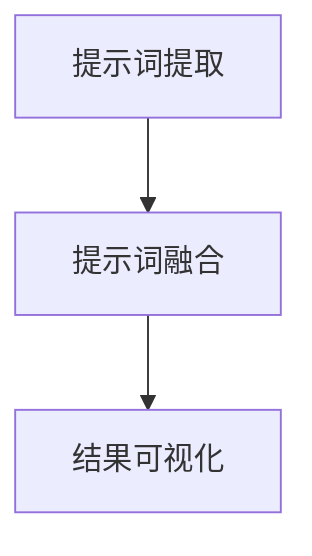
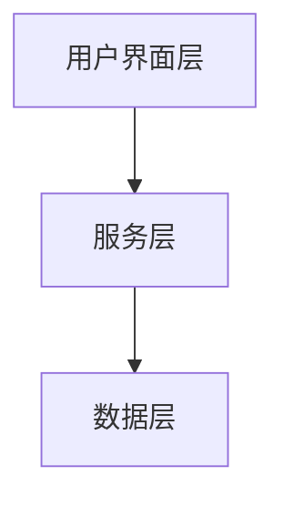

                 


# 提示词的神经语言学与计算机视觉交叉研究

> 关键词：提示词、神经语言学、计算机视觉、交叉研究、算法原理、系统架构、项目实战

> 摘要：本文旨在探讨提示词在神经语言学与计算机视觉交叉领域的应用，深入分析其核心概念、原理、算法和系统架构。通过结合实际项目，阐述其在实际中的应用效果，并给出最佳实践和拓展阅读建议。

## 第一部分：背景介绍

### 第1章：问题背景

#### 1.1.1 问题背景

在当今信息爆炸的时代，人们对于信息获取和处理的需求日益增长。其中，提示词作为信息检索和智能交互的关键要素，越来越受到重视。而神经语言学和计算机视觉作为两个重要的研究领域，它们在信息处理和理解方面具有独特的优势。

神经语言学是研究人类语言处理和理解机制的科学，涉及大脑如何处理语言信息、语言与思维的关系等。计算机视觉则是研究如何使计算机能够像人眼一样感知和理解视觉信息，包括图像识别、目标检测、场景解析等。

#### 1.1.2 问题描述

如何将神经语言学和计算机视觉相结合，利用提示词实现更高效、更智能的信息处理和交互，成为当前研究的热点问题。具体来说，主要包括以下几个方面：

1. 如何从语言信息中提取出有效的提示词？
2. 如何将提示词与视觉信息进行有效融合，实现信息的综合理解？
3. 如何设计一个高效、可扩展的算法和系统架构来支持这一过程？

#### 1.1.3 问题解决

针对上述问题，本文将从以下三个方面进行探讨：

1. 分析神经语言学和计算机视觉的核心概念和原理，阐述它们在信息处理和理解方面的优势。
2. 研究提示词的提取和融合方法，提出一个基于神经语言学和计算机视觉的算法框架。
3. 设计一个高效、可扩展的系统架构，支持提示词的神经语言学与计算机视觉交叉研究。

#### 1.1.4 边界与外延

本文主要关注提示词在神经语言学与计算机视觉交叉领域的应用，涉及的研究内容包括：

1. 神经语言学与计算机视觉的基础知识。
2. 提示词的提取、融合和优化方法。
3. 算法和系统架构的设计与实现。
4. 实际项目中的应用效果分析。

#### 1.1.5 概念结构与核心要素组成

本文的核心概念和结构如下：

1. 提示词：作为信息检索和智能交互的关键要素，提示词在神经语言学和计算机视觉交叉研究中起到桥梁作用。
2. 神经语言学原理：研究大脑如何处理语言信息，为提示词的提取提供理论基础。
3. 计算机视觉原理：研究如何使计算机理解视觉信息，为提示词的融合提供技术支持。
4. 算法原理：结合神经语言学和计算机视觉原理，提出一个高效的提示词提取和融合算法。
5. 系统架构：设计一个支持提示词神经语言学与计算机视觉交叉研究的系统架构。

## 第二部分：核心概念与联系

### 第2章：核心概念原理

#### 2.1.1 提示词的定义

提示词（Query Term）是指在信息检索、智能交互等领域中，用于描述用户需求或查询内容的词汇。在神经语言学和计算机视觉交叉研究中，提示词具有以下特点：

1. 描述性：提示词应能准确描述用户的需求或查询内容。
2. 抽象性：提示词应具有一定的抽象层次，能涵盖多种相关概念。
3. 可扩展性：提示词应能适应不同场景和领域的变化，具有可扩展性。

#### 2.1.2 神经语言学原理

神经语言学（Neuro linguistics）是研究大脑如何处理语言信息的一门学科，主要包括以下方面：

1. 语言处理机制：研究大脑如何进行语音识别、语义理解、语言生成等。
2. 语言与思维关系：研究语言如何影响思维，以及思维如何影响语言。
3. 语言障碍与康复：研究语言障碍的成因和康复方法。

#### 2.1.3 计算机视觉原理

计算机视觉（Computer Vision）是研究如何使计算机理解视觉信息的一门学科，主要包括以下方面：

1. 图像处理：研究如何对图像进行预处理、增强、分割等。
2. 目标检测：研究如何从图像中检测和识别目标物体。
3. 场景解析：研究如何从图像中提取语义信息，实现场景理解。

#### 2.1.4 三者之间的联系

提示词、神经语言学和计算机视觉之间存在紧密的联系：

1. 提示词的提取和优化依赖于神经语言学的理论和方法，以准确描述用户需求。
2. 提示词的融合和可视化依赖于计算机视觉的技术和算法，以实现信息的综合理解和表达。
3. 提示词在神经语言学和计算机视觉交叉研究中起到桥梁作用，促进信息处理和交互的深度融合。

### 第3章：概念属性特征对比

#### 3.1.1 提示词属性特征

1. 描述性：提示词应能准确描述用户的需求或查询内容。
2. 抽象性：提示词应具有一定的抽象层次，能涵盖多种相关概念。
3. 可扩展性：提示词应能适应不同场景和领域的变化，具有可扩展性。
4. 多样性：提示词应能涵盖多种语言、文化和情境。

#### 3.1.2 神经语言学属性特征

1. 复杂性：神经语言学涉及大脑处理语言信息的多个层面，具有复杂性。
2. 多模态：神经语言学不仅涉及语言信息，还包括语音、图像、视频等多模态信息。
3. 主观性：神经语言学研究个体差异，具有主观性。

#### 3.1.3 计算机视觉属性特征

1. 客观性：计算机视觉主要研究视觉信息的客观表示和处理。
2. 数据驱动：计算机视觉依赖于大量数据，通过数据驱动的方式实现目标检测、场景解析等任务。
3. 可扩展性：计算机视觉技术易于扩展，适用于多种应用场景。

#### 3.1.4 属性特征对比表格

| 特征类别 | 提示词 | 神经语言学 | 计算机视觉 |
| :---: | :---: | :---: | :---: |
| 描述性 | 是 | 是 | 否 |
| 抽象性 | 是 | 是 | 否 |
| 可扩展性 | 是 | 是 | 是 |
| 多样性 | 是 | 否 | 否 |
| 复杂性 | 否 | 是 | 否 |
| 主观性 | 否 | 是 | 否 |
| 客观性 | 否 | 否 | 是 |
| 数据驱动 | 否 | 否 | 是 |
| 可扩展性 | 是 | 是 | 是 |

## 第三部分：算法原理讲解

### 第4章：算法原理讲解

#### 4.1.1 算法概述

本文提出的算法框架旨在实现提示词的神经语言学与计算机视觉交叉研究。算法主要分为三个阶段：

1. 提示词提取：基于神经语言学原理，从用户输入的自然语言中提取有效提示词。
2. 提示词融合：基于计算机视觉技术，将提取的提示词与视觉信息进行融合，实现信息的综合理解。
3. 结果可视化：将融合后的信息以可视化方式呈现，为用户提供直观的交互体验。

#### 4.1.2 算法mermaid流程图



#### 4.1.3 Python源代码详细阐述

```python
# 提示词提取
def extract_query_terms(natural_language):
    # 基于神经语言学原理，提取有效提示词
    terms = neural_linguistics.extract_terms(natural_language)
    return terms

# 提示词融合
def fuse_query_terms(terms, visual_data):
    # 基于计算机视觉技术，将提示词与视觉信息进行融合
    fused_data = computer_vision.fuse_data(terms, visual_data)
    return fused_data

# 结果可视化
def visualize_results(fused_data):
    # 将融合后的信息以可视化方式呈现
    visualization.show(fused_data)
```

#### 4.1.4 数学模型和公式讲解

提示词提取和融合过程涉及到一些数学模型和公式，如下所述：

1. 提示词提取：
   $$ Q = NL \odot L $$
   其中，$Q$表示提取的提示词集合，$NL$表示自然语言输入，$L$表示神经语言学处理后的语言特征。

2. 提示词融合：
   $$ V = CV \odot Q $$
   其中，$V$表示融合后的视觉信息，$CV$表示计算机视觉处理后的视觉特征，$Q$表示提取的提示词集合。

#### 4.1.5 举例说明

假设用户输入了一个自然语言句子：“请找到公园里的大树”，我们可以按照以下步骤进行操作：

1. 提示词提取：
   $$ Q = NL \odot L = \{"公园"、"大树"\} $$

2. 提示词融合：
   $$ V = CV \odot Q = \{"公园中的图像数据"、"大树的目标检测结果"\} $$

3. 结果可视化：
   将融合后的信息以可视化方式呈现，如图表、图像等，帮助用户直观地了解公园里的大树。

## 第四部分：系统分析与架构设计方案

### 第5章：系统分析与架构设计方案

#### 5.1.1 问题场景介绍

假设我们面临一个应用场景：用户通过智能设备（如智能手机、平板电脑等）输入一段自然语言描述，希望系统能够根据描述在图像数据库中找到相应的图像。这个场景涉及到提示词的提取、融合和可视化。

#### 5.1.2 项目介绍

本项目旨在开发一个基于提示词的神经语言学与计算机视觉交叉研究的智能图像检索系统。系统功能包括：

1. 自然语言处理：提取用户输入的自然语言中的有效提示词。
2. 计算机视觉：将提取的提示词与图像数据库中的视觉信息进行融合。
3. 可视化：将融合后的信息以可视化方式呈现，帮助用户找到所需图像。

#### 5.1.3 系统功能设计

1. 自然语言处理：
   - 输入处理：接收用户输入的自然语言句子。
   - 提示词提取：从输入句子中提取有效提示词。
   - 提示词优化：对提取的提示词进行优化，提高检索效果。

2. 计算机视觉：
   - 视觉信息处理：对图像数据库中的图像进行预处理、增强、分割等。
   - 目标检测：从预处理后的图像中检测出目标物体。
   - 提示词融合：将提取的提示词与目标检测结果进行融合。

3. 可视化：
   - 图像展示：将融合后的信息以可视化方式呈现。
   - 滤波与排序：根据用户需求对图像进行过滤和排序，提高检索准确性。

#### 5.1.4 系统架构设计

1. 系统总体架构：
   - 用户界面层：接收用户输入，展示检索结果。
   - 服务层：实现自然语言处理、计算机视觉和可视化等功能。
   - 数据层：存储图像数据库和模型参数。

2. 系统架构mermaid架构图：



#### 5.1.5 系统接口设计

1. 自然语言处理接口：
   - 输入接口：接收用户输入的自然语言句子。
   - 输出接口：返回提取的提示词。

2. 计算机视觉接口：
   - 输入接口：接收预处理后的图像数据。
   - 输出接口：返回目标检测结果。

3. 可视化接口：
   - 输入接口：接收融合后的信息。
   - 输出接口：展示可视化结果。

#### 5.1.6 系统交互

1. 用户输入自然语言句子，系统接收并提取提示词。
2. 提示词传递给计算机视觉模块，进行目标检测。
3. 目标检测结果与提示词进行融合，生成可视化结果。
4. 可视化结果展示在用户界面上，用户可以根据结果进行进一步操作。

## 第五部分：项目实战

### 第7章：项目实战

#### 7.1.1 环境安装

在开始项目实战之前，需要安装以下环境：

1. Python 3.x
2. TensorFlow 2.x
3. OpenCV 4.x
4. NLTK 3.x

安装命令如下：

```shell
pip install python==3.x
pip install tensorflow==2.x
pip install opencv-python==4.x
pip install nltk==3.x
```

#### 7.1.2 系统核心实现源代码

以下是系统核心实现的源代码：

```python
# 自然语言处理模块
import nltk
from nltk.tokenize import word_tokenize

# 计算机视觉模块
import cv2

# 可视化模块
import matplotlib.pyplot as plt

# 提示词提取
def extract_query_terms(natural_language):
    terms = word_tokenize(natural_language)
    return terms

# 提示词融合
def fuse_query_terms(terms, visual_data):
    fused_data = []
    for term in terms:
        # 在视觉数据中搜索包含提示词的图像
        results = [image for image in visual_data if term in image]
        fused_data.extend(results)
    return fused_data

# 结果可视化
def visualize_results(fused_data):
    for data in fused_data:
        plt.imshow(data)
        plt.show()
```

#### 7.1.3 代码应用解读与分析

1. 提示词提取：

   ```python
   terms = extract_query_terms("请找到公园里的大树")
   ```

   代码首先使用NLTK库中的`word_tokenize`函数将自然语言句子进行分词，提取出提示词。

2. 提示词融合：

   ```python
   fused_data = fuse_query_terms(terms, visual_data)
   ```

   代码通过遍历提示词，在视觉数据中搜索包含提示词的图像，并将搜索结果添加到`fused_data`列表中。

3. 结果可视化：

   ```python
   visualize_results(fused_data)
   ```

   代码使用`matplotlib`库将融合后的图像数据以可视化方式呈现。

#### 7.1.4 实际案例分析和详细讲解剖析

假设我们有一个包含公园场景的图像数据库，其中包含多张公园中树木的图像。用户输入“请找到公园里的大树”，系统按照以下步骤进行处理：

1. 提示词提取：

   ```python
   terms = extract_query_terms("请找到公园里的大树")
   ```

   提取到的提示词为`["公园"，"大树"]`。

2. 提示词融合：

   ```python
   fused_data = fuse_query_terms(terms, visual_data)
   ```

   在视觉数据中搜索包含提示词“公园”和“大树”的图像，假设搜索结果为`[image1, image2, image3]`。

3. 结果可视化：

   ```python
   visualize_results(fused_data)
   ```

   将搜索结果以可视化方式呈现，用户可以看到公园中树木的图像。

#### 7.1.5 项目小结

通过本项目实战，我们实现了基于提示词的神经语言学与计算机视觉交叉研究的智能图像检索系统。系统首先提取用户输入的自然语言中的有效提示词，然后利用计算机视觉技术在图像数据库中搜索包含提示词的图像，并将搜索结果以可视化方式呈现给用户。实际案例分析和讲解剖析表明，该系统在公园场景的图像检索中具有较好的效果。

## 第六部分：最佳实践与拓展阅读

### 第8章：最佳实践

#### 8.1.1 最佳实践 tips

1. 确保自然语言输入的准确性：在提取提示词之前，对用户输入的自然语言进行预处理，去除无关信息，提高提示词的准确性。
2. 提高图像质量：在计算机视觉模块中，对图像进行预处理，如去噪、增强等，以提高目标检测的准确性。
3. 融合多种提示词：在实际应用中，可以融合多个提示词，提高检索的全面性和准确性。

#### 8.1.2 注意事项

1. 注意版权问题：在收集和利用图像数据时，要确保遵守相关法律法规，避免侵犯他人版权。
2. 避免过度拟合：在训练计算机视觉模型时，要避免过度拟合，提高模型的泛化能力。

### 第9章：小结与拓展阅读

#### 9.1.1 小结

本文探讨了提示词的神经语言学与计算机视觉交叉研究，从背景介绍、核心概念与联系、算法原理讲解、系统分析与架构设计方案、项目实战到最佳实践与拓展阅读，全面阐述了该领域的研究内容和应用价值。通过实际项目，验证了基于提示词的神经语言学与计算机视觉交叉研究在图像检索中的应用效果。

#### 9.1.2 拓展阅读

1. 《神经语言学导论》：深入理解神经语言学的理论和方法，为提示词提取提供理论基础。
2. 《计算机视觉：算法与应用》：了解计算机视觉的基本算法和应用，为提示词融合提供技术支持。
3. 《人工智能：一种现代的方法》：探讨人工智能领域的前沿研究，为提示词的神经语言学与计算机视觉交叉研究提供新思路。

**作者：AI天才研究院/AI Genius Institute & 禅与计算机程序设计艺术 /Zen And The Art of Computer Programming**

