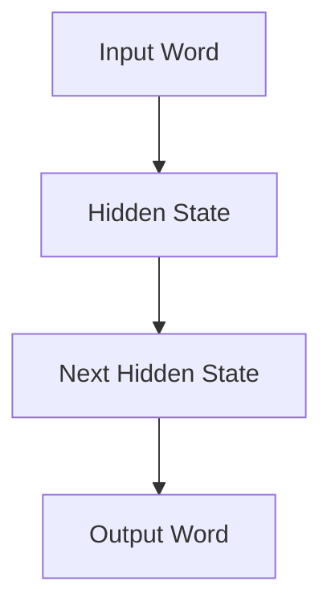
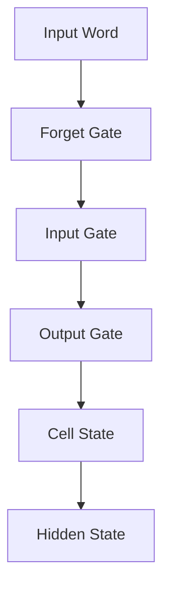
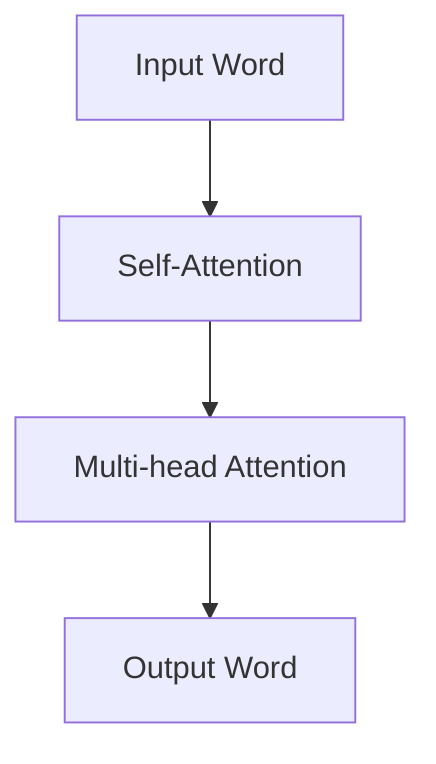

                 

### 引言

#### 1.1 研究背景与意义

提示词是语言学研究中的一个重要概念，尤其在神经语言学领域内占据着核心地位。提示词是指在语言交流过程中，起到引导、提示和预测作用的词语。它们在句子中的位置灵活，但往往承载着重要的语义信息和认知功能。随着神经语言学的不断发展，提示词的研究越来越受到关注，因为揭示提示词的神经语言学机制对于理解人类语言处理机制具有深远的意义。

**提示词在语言学中的重要性**：提示词不仅有助于句子结构的构建，还可以提高语言交流的效率。它们在句法、语义和语用层面上都有显著的功能。在自然语言处理（NLP）领域，提示词被广泛应用于信息提取、语义分析和机器翻译等任务中，对提升机器理解和生成能力具有重要意义。

**提示词研究的现状与不足**：尽管已有大量关于提示词的研究，但现有的研究多集中在句法和语义层面，对提示词的神经语言学机制探讨较少。现有的理论框架无法充分解释提示词在认知和交际过程中的复杂作用，尤其是其在神经活动中的具体体现。此外，不同语言和文化背景下的提示词研究缺乏系统性比较，限制了研究结果的普适性。

**本文的研究意义**：本文旨在从神经语言学的角度，深入探讨提示词的功能及其神经语言学基础。通过系统地分析提示词的定义、分类、功能及其在神经活动中的机制，本文旨在填补现有研究的空白，为理解人类语言处理提供新的视角和理论支持。此外，本文的研究结果也将为自然语言处理技术的发展提供有益的启示。

#### 1.2 研究方法与框架

本研究采用多种研究方法，结合定性和定量分析，以全面探讨提示词的神经语言学基础。首先，通过文献综述，梳理现有关于提示词的研究成果和理论框架，为本文的研究奠定理论基础。其次，采用实证研究方法，通过实验数据验证提示词在神经语言学中的具体作用。实验设计包括心理语言学实验和神经影像学技术，以获取关于提示词处理的神经活动数据。

研究框架包括以下几个部分：

1. **定义与分类**：明确提示词的定义，并对其进行分类，为后续研究提供清晰的术语基础。
2. **功能分析**：探讨提示词在句法、语义和语用层面的功能，结合神经语言学的理论，分析提示词在语言处理中的作用机制。
3. **神经机制探讨**：利用神经影像学和认知神经科学的方法，研究提示词处理的神经基础，揭示其在大脑中的具体实现方式。
4. **实证研究**：通过实验验证提示词的功能和神经机制，并结合数据分析，探讨其在语言交流中的实际应用价值。

通过以上研究方法和框架，本文旨在系统、全面地揭示提示词的神经语言学基础，为相关领域的研究提供参考和启示。

#### 1.3 研究意义

本文的研究具有深远的理论价值和广泛的实践意义。

**理论价值**：首先，本文系统地探讨了提示词的定义、分类和功能，结合神经语言学的理论，揭示了提示词在语言处理中的复杂作用机制。这一研究填补了现有理论框架的空白，丰富了神经语言学的理论研究内容。其次，本文通过实证研究，验证了提示词在神经语言学中的具体作用，为理解人类语言处理提供了新的实验数据和理论支持。

**实践意义**：在自然语言处理（NLP）领域，本文的研究结果具有重要的应用价值。提示词在信息提取、语义分析和机器翻译等任务中具有关键作用，本文的发现将有助于提升这些任务的处理效率。此外，本文的研究也为教育领域提供了新的启示，特别是在第二语言学习和人工智能语言学习中的应用，提示词的研究将有助于开发更有效的教学策略和学习工具。

综上所述，本文的研究不仅有助于深化对提示词及其神经语言学机制的理解，还将为相关领域的实际应用提供有益的指导，具有重要的理论意义和实践价值。

#### 1.4 本书的结构安排

本文结构安排如下：

**第一部分：引言**  
本部分主要介绍研究背景、研究意义、研究方法与框架，以及本书的结构安排。通过这一部分的阐述，读者可以全面了解本文的研究目的和内容。

**第二部分：神经语言学基础理论**  
本部分将深入探讨神经语言学的定义、发展历程、基本概念以及主要研究领域，为后续关于提示词的研究奠定理论基础。

**第三部分：提示词在神经语言学中的地位**  
本部分将分析提示词的定义、分类及其功能，并结合神经语言学的理论，探讨提示词处理的神经基础和认知机制。

**第四部分：提示词的语言学特征**  
本部分将分别从语音、语法和语义三个层面，详细研究提示词的特征及其变异，揭示提示词在不同语言维度上的表现。

**第五部分：神经语言学与提示词的关系**  
本部分将探讨神经语言学与提示词处理的互动，分析神经语言学对提示词处理的影响以及提示词处理对神经语言学的贡献。

**第六部分：实证研究与应用**  
本部分将通过实证研究，验证提示词的功能和神经机制，并结合实际应用，探讨提示词在语言学习中的有效性及其在人工智能语言学习中的应用前景。

通过以上结构的安排，本文旨在系统、全面地揭示提示词的神经语言学基础，为相关领域的研究提供参考和启示。希望读者能够通过本研究的阅读，深入理解提示词的复杂性和重要性，从而推动相关领域的发展。

### 第二部分：神经语言学基础理论

#### 2.1 神经语言学概述

神经语言学是语言学与神经科学交叉融合的领域，旨在研究语言与大脑之间的互动关系。它不仅关注语言的结构和功能，还探讨语言处理过程中的神经基础。神经语言学的发展历程可以追溯到20世纪初，当时的科学家开始意识到大脑在语言中的作用。通过研究大脑损伤患者和正常个体的语言能力，神经语言学家逐渐揭示了语言处理的不同脑区及其功能。

**神经语言学的定义**：神经语言学是研究语言能力与大脑结构之间关系的一门科学。它探讨了语言结构与大脑神经网络之间的联系，以及语言功能如何在大脑中实现。

**神经语言学的发展历程**：神经语言学的起源可以追溯到20世纪初期，当时科学家通过研究大脑损伤患者，发现语言功能与大脑特定区域密切相关。20世纪50年代，随着神经影像技术的发展，神经语言学研究进入了一个新阶段。通过功能性磁共振成像（fMRI）和脑电图（EEG）等手段，科学家可以更精确地观察大脑在语言处理过程中的活动。近年来，随着计算神经科学的兴起，神经语言学开始利用数学模型和计算机模拟来解释语言处理机制。

#### 2.2 神经语言学的基本概念

神经语言学涉及多个基本概念，包括语言与大脑的关系、语言处理机制等。

**语言与大脑的关系**：大脑是语言能力的物质基础，不同脑区负责不同的语言功能。例如，布罗卡区（Broca's area）负责语言生成，而韦尼克区（Wernicke's area）负责语言理解。语言与大脑之间的关系复杂且多样，涉及多个神经网络的协同工作。

**语言处理机制**：语言处理是一个多层次的过程，包括语音识别、词汇处理、句子理解和语言生成等。神经语言学通过研究这些过程的神经基础，揭示了语言处理的不同阶段及其在大脑中的实现方式。例如，语音识别涉及听觉皮层和运动皮层的相互作用，而句子理解则需要多个脑区的协同处理。

#### 2.3 神经语言学的主要研究领域

神经语言学的研究领域广泛，涵盖了听觉处理、语言生成、语言理解等多个方面。

**听觉处理**：听觉处理是语言处理的第一步，涉及从声音信号中提取语言信息的过程。神经语言学通过研究听觉皮层的活动，揭示了听觉处理的不同阶段和机制。

**语言生成**：语言生成是语言处理过程的另一个重要方面，涉及从思维到语言表达的转化。神经语言学通过研究布罗卡区和其他相关脑区的活动，探讨了语言生成的神经基础。

**语言理解**：语言理解是语言处理的核心，涉及对输入语言信息的解析和解释。神经语言学通过研究韦尼克区和其他脑区的活动，揭示了语言理解的机制和过程。

#### 2.4 神经语言学的最新研究进展

近年来，神经语言学取得了许多重要进展。以下是一些关键领域：

**神经影像技术**：随着神经影像技术的发展，如fMRI和EEG，神经语言学家能够更精确地观察大脑在语言处理过程中的活动。这些技术不仅揭示了语言处理的不同脑区，还为研究语言障碍和神经系统疾病提供了新的手段。

**计算神经科学**：计算神经科学通过数学模型和计算机模拟，揭示了语言处理的复杂机制。例如，神经网络模型被广泛应用于语言生成和语言理解的研究，为理解和预测大脑语言处理提供了新的方法。

**语言障碍研究**：神经语言学在语言障碍研究方面取得了显著成果。通过研究大脑损伤患者的语言能力，科学家揭示了语言功能的神经基础，为语言障碍的诊断和治疗提供了新的思路。

综上所述，神经语言学作为一门跨学科领域，通过研究语言与大脑的关系，揭示了语言处理机制的复杂性和多样性。随着神经影像技术和计算神经科学的不断发展，神经语言学将继续推动语言科学的发展，为理解和治疗语言障碍提供新的工具和方法。

### 第3章：提示词在神经语言学中的地位

#### 3.1 提示词的定义与分类

提示词在语言学中扮演着重要的角色，尤其在神经语言学的研究中，提示词的地位不可忽视。为了深入探讨提示词在神经语言学中的功能和机制，我们首先需要明确提示词的定义和分类。

**提示词的定义**：提示词是指在语言交流过程中，通过语音、语义或语法特征，对后续信息进行引导、提示或预测的词语。提示词通常出现在句子中的一些关键位置，如句首、句中和句尾，它们不仅能够帮助听者或读者理解上下文，还可以提高语言交流的效率。

**提示词的分类**：根据提示词在语言交流中的功能和表现形式，可以将提示词分为以下几类：

1. **引导性提示词**：这类提示词主要用于引导听者或读者关注后续的信息。例如，“首先”、“接下来”等词语，它们在句子中起到引导话题或叙述顺序的作用。

2. **预测性提示词**：这类提示词主要用于预测后续信息的内容或方向。例如，“因此”、“换句话说”等词语，它们在句子中起到预示结论或解释的作用。

3. **衔接性提示词**：这类提示词主要用于连接句子或段落，使语言更加连贯。例如，“然而”、“此外”等词语，它们在句子中起到过渡或转折的作用。

4. **情感性提示词**：这类提示词主要用于表达情感或态度。例如，“无疑”、“坦白说”等词语，它们在句子中起到强调或情感调节的作用。

通过对提示词的明确定义和分类，我们能够更好地理解其在语言交流中的功能和作用。接下来，我们将进一步探讨提示词在神经语言学中的具体功能和机制。

#### 3.2 提示词的功能

提示词在语言交流中具有多种功能，这些功能在不同的语境和语言使用场景中发挥着重要作用。以下将详细分析提示词在句法、语义和语用层面的功能，并结合神经语言学的理论，探讨其具体的作用机制。

**句法功能**：提示词在句法层面的功能主要体现在引导句子结构和提供语法线索。例如，引导性提示词如“首先”、“其次”等，可以在叙述或讨论中引导听者或读者的注意力，使语言表达更加清晰和有条理。预测性提示词如“因此”、“所以”等，则能够在句子中预示结论或结果的产生，帮助听者或读者更好地理解和预测后续信息。

**语义功能**：提示词在语义层面的功能主要表现在增强句子的语义连贯性和信息传递。引导性提示词如“例如”、“也就是说”等，通过举例或解释的方式，帮助听者或读者理解复杂概念或抽象信息。预测性提示词如“然而”、“相反”等，则通过对比或转折的方式，使句子语义更加丰富和多样化。此外，情感性提示词如“无疑”、“的确”等，可以在句子中表达肯定或否定的情感态度，增强语言的感染力和说服力。

**语用功能**：提示词在语用层面的功能主要表现在提高语言交流的效率和效果。衔接性提示词如“此外”、“同时”等，可以连接不同的句子或段落，使语言表达更加连贯和流畅。引导性提示词和预测性提示词则通过提供上下文的线索，帮助听者或读者更好地理解和吸收信息，从而提高语言交流的效率。情感性提示词如“无疑”、“坦白说”等，可以通过表达情感态度，调节语言交流的氛围和情感色彩，使交流更加生动和有效。

**神经语言学机制**：从神经语言学的角度来看，提示词的功能实现依赖于大脑中多个脑区的协同工作。例如，布罗卡区和韦尼克区等语言处理脑区在提示词的句法和语义功能中发挥着重要作用。布罗卡区主要负责语言生成，当处理引导性或预测性提示词时，该区域的活动会增强。韦尼克区则主要负责语言理解，当处理衔接性或情感性提示词时，该区域的活动也会增强。此外，大脑的前额叶皮层和扣带回等脑区在提示词的语用功能中也扮演着关键角色，它们通过调节注意力和情感状态，帮助听者或读者更好地理解和处理信息。

总之，提示词在语言交流中具有多种功能，这些功能不仅体现在句法、语义和语用层面，还依赖于大脑中的多个脑区的协同工作。通过揭示提示词的神经语言学机制，我们可以更深入地理解其在语言处理中的作用和意义。

#### 3.3 提示词的神经语言学机制

探讨提示词的神经语言学机制，有助于我们理解其在语言处理中的具体作用。从神经科学的角度出发，提示词的处理涉及多个脑区的协同活动，这些脑区在大脑的语言网络中扮演着各自的角色。

**提示词处理的神经基础**：首先，布罗卡区和韦尼克区是提示词处理的核心脑区。布罗卡区位于大脑左前侧，主要负责语言生成功能。在处理引导性和预测性提示词时，布罗卡区的活动会增强，这是因为提示词在语言生成过程中起到了引导和预示作用。韦尼克区则位于大脑右前侧，主要负责语言理解功能。当处理衔接性和情感性提示词时，韦尼克区的活动也会增强，因为这些提示词在语言理解中起到了衔接情感和语义的作用。

**认知机制**：提示词的处理不仅依赖于特定脑区的活动，还涉及认知机制的参与。首先，注意机制在提示词处理中扮演了关键角色。注意机制帮助听者或读者将注意力集中在提示词上，从而更好地理解和处理后续信息。其次，记忆机制也参与了提示词的处理。记忆机制帮助存储和提取与提示词相关的信息，从而增强对上下文的理解。此外，推理机制在处理预测性提示词时尤为重要。通过推理，听者或读者能够预测后续信息的内容和方向，从而提高语言理解的效率。

**神经活动**：神经影像学技术，如功能性磁共振成像（fMRI）和脑电图（EEG），为研究提示词处理的神经活动提供了有力工具。fMRI研究表明，当个体处理提示词时，布罗卡区和韦尼克区等语言处理脑区的活动会显著增强。EEG研究则揭示了提示词处理过程中的神经电活动模式，这些活动模式与认知机制密切相关。

**神经可塑性**：提示词处理还受到神经可塑性的影响。神经可塑性是指大脑通过改变神经元连接和活动模式，以适应新的环境和信息的过程。通过长期的语言训练和交流，个体的语言处理能力会得到提升，这种提升部分源于大脑神经网络的可塑性。例如，第二语言学习者在处理目标语言中的提示词时，其大脑语言网络会发生变化，从而提高语言理解能力。

总之，提示词的神经语言学机制涉及多个脑区的协同活动和认知机制的参与。通过神经影像学技术和认知神经科学的研究，我们能够更深入地理解提示词在语言处理中的具体作用和机制。这为探讨语言障碍和语言学习提供了新的视角，也为自然语言处理技术的发展提供了理论基础。

### 第三部分：提示词的语言学特征

#### 3.4 提示词的语音特征

提示词的语音特征是其语言表达中的重要组成部分，它们在语音结构、音位特征和语音变异等方面具有独特的表现。

**提示词的语音结构**：提示词在语音结构上通常较为简洁，它们往往由一个或几个音节组成。这些音节在发音上具有清晰、响亮的特征，以确保其在语音流中的突出性。例如，英语中的提示词“however”由四个音节组成，发音时各个音节之间的间隔较短，使听者能够迅速识别并理解其功能。

**音位特征**：提示词的音位特征主要体现在其发音的清晰度和独特性。为了确保提示词在句子中的引导作用，它们通常采用较为明显的音位特征，如重音、音调变化等。例如，汉语中的提示词“因此”在发音时常常采用升调，以突出其引导结论的功能。

**语音变异**：语音变异是语言使用中的常见现象，提示词也不例外。语音变异的类型包括音节长度、音调、音强等。这些变异可以增强提示词的表现力，使其在特定语境中更具表现力。例如，在快速讲话或口语交流中，提示词的音节长度可能会缩短，音调也可能发生变化，从而使提示词更加自然和流畅。

**语音变异对提示词的影响**：语音变异对提示词的功能具有重要影响。一方面，语音变异可以增强提示词的辨识度，使其在语言流中更加突出。另一方面，语音变异还可以影响提示词的语义功能，使其在句子中扮演不同的角色。例如，在英语中，提示词“however”的音调变化可以影响其引导转折的功能，使其在句子中的语气和态度更加明确。

**实际应用中的表现**：在实际语言使用中，提示词的语音特征有助于提高语言交流的效率和效果。例如，在演讲或教学过程中，恰当使用提示词可以引导听众的注意力，使其更好地理解讲话内容。此外，提示词的语音变异也可以使语言表达更加生动和富有表现力，增强语言的感染力。

#### 3.5 提示词的语法特征

提示词在语法特征上的表现是其语言功能实现的关键。以下将详细分析提示词的词法特征和句法特征，并探讨提示词在语法变异中的表现。

**提示词的词法特征**：词法特征是指词语在词汇层面上的特点，包括词性、词形变化等。提示词在词法特征上通常表现为动词或副词。例如，英语中的提示词“therefore”是副词，用于引导结论；“however”，则是副词，用于引导转折。这些词性特征使提示词在句子中具备特定的功能。

**句法特征**：句法特征是指词语在句子结构中的位置和功能。提示词在句法特征上通常位于句首、句中和句尾，它们通过不同的位置和功能，引导、预测或连接句子内容。例如，引导性提示词如“首先”、“其次”等，通常位于句首，引导话题或叙述顺序；预测性提示词如“因此”、“换句话说”等，通常位于句中和句尾，预示结论或解释。

**语法变异**：语法变异是指在特定语境中，词语的语法形式发生变化，从而产生新的语法功能。提示词在语法变异中具有独特表现，例如：

1. **时态变异**：提示词可以根据上下文，使用不同的时态形式，以增强语言的连贯性和表现力。例如，英语中的提示词“however”可以在句中使用一般现在时或过去时，以适应不同的语境需求。

2. **语态变异**：提示词的语态形式也可以发生变化，例如，英语中的提示词“therefore”既可以使用主动语态，也可以使用被动语态，以适应句子结构的需要。

3. **复合结构变异**：提示词还可以与其它词语结合，形成复合结构，以表达更加复杂的语义。例如，英语中的提示词“in conclusion”通常与名词或名词短语结合，形成复合名词结构，用于引导结论。

**对语法变异的影响**：提示词的语法变异对句子的语法结构、语义表达和语用功能具有重要影响。例如，语法变异可以增强句子的连贯性和表达力，使语言更加生动和自然。同时，语法变异还可以影响句子的语法功能和语义内容，使其在特定语境中发挥不同的作用。

**实际应用中的表现**：在实际语言使用中，提示词的语法特征和语法变异有助于提高语言表达的效果。例如，在写作和演讲中，恰当使用提示词可以增强文章的结构和逻辑性，使内容更加清晰和有条理。此外，语法变异还可以使语言表达更加灵活和多样化，增强语言的感染力和表现力。

#### 3.6 提示词的语义特征

提示词的语义特征是其语言功能的重要组成部分，它们在语义结构、基本语义和复合语义等方面具有独特的表现。

**提示词的语义结构**：提示词的语义结构通常由核心语义和附加语义组成。核心语义是指提示词的基本语义，如“因此”、“然而”等。附加语义则是指提示词在特定语境中附加的语义，如情感态度、语气等。例如，“因此”在表达因果逻辑时，具有“所以”、“因而”等附加语义。

**基本语义**：提示词的基本语义是其核心功能，它们在句子中起到引导、预测和连接的作用。例如，“因此”用于引导因果关系，“然而”用于引导转折关系。这些基本语义使提示词在语言交流中具有明确的功能和作用。

**复合语义**：提示词的复合语义是指提示词在特定语境中组合其他词语，形成新的语义组合。复合语义丰富了提示词的表达功能，使其在句子中扮演更加复杂的角色。例如，“无疑”与“确实”组合，形成“无疑确实”，用于强调肯定态度。

**语义变异**：语义变异是指在特定语境中，提示词的语义发生变化，从而产生新的语义表达。提示词的语义变异可以分为以下几种类型：

1. **情感变异**：提示词的情感变异是指其附加语义的变化，例如，“因此”在不同语境中可以表达积极或消极的情感态度。

2. **语用变异**：提示词的语用变异是指其在特定语境中的功能变化，例如，“然而”在句子中可以表示转折、对比或递进等不同的语用功能。

3. **语境变异**：提示词的语境变异是指其语义根据上下文语境的变化而变化，例如，“无疑”在肯定语境中表达确信，在否定语境中则表达怀疑。

**对语义变异的影响**：语义变异对句子的语义表达和语用功能具有重要影响。语义变异可以增强句子的表达力和生动性，使其更加丰富和多样化。例如，在写作和演讲中，恰当使用语义变异可以使语言表达更加生动和富有表现力。

**实际应用中的表现**：在实际语言使用中，提示词的语义特征和语义变异有助于提高语言表达的效率和效果。例如，在写作中，恰当使用提示词可以增强文章的结构和逻辑性，使内容更加清晰和有条理。在演讲中，提示词的语义变异可以使演讲内容更加生动和有说服力，吸引听众的注意力。

### 第4章：神经语言学与提示词的关系

#### 4.1 神经语言学对提示词处理的影响

神经语言学在提示词处理中发挥着重要作用，揭示了提示词在语言交流中的神经基础和认知机制。以下从神经语言学的研究方法、提示词处理的神经活动、以及神经语言学对提示词处理的解释三个方面，详细探讨神经语言学对提示词处理的影响。

**神经语言学的研究方法**：神经语言学采用多种研究方法，包括神经影像学技术、认知神经科学实验和计算模型等。这些方法帮助科学家深入理解提示词处理的神经机制。例如，功能性磁共振成像（fMRI）和脑电图（EEG）等技术，可以实时观察大脑在处理提示词时的活动，揭示提示词处理的不同脑区和神经网络。认知神经科学实验，如行为实验和脑刺激实验，通过控制变量，探讨提示词在语言处理中的具体作用和机制。

**提示词处理的神经活动**：神经语言学研究发现，提示词处理涉及多个脑区的协同活动。这些脑区包括布罗卡区、韦尼克区、前额叶皮层和扣带回等。布罗卡区主要负责语言生成，在处理引导性和预测性提示词时，该区域的激活程度较高。韦尼克区则主要负责语言理解，在处理衔接性和情感性提示词时，该区域的激活程度显著。前额叶皮层和扣带回在提示词的注意调节和情感表达中扮演重要角色。这些脑区的协同活动，确保了提示词在语言处理中的高效和准确。

**神经语言学对提示词处理的解释**：神经语言学通过揭示提示词处理的神经机制，提供了对提示词功能的新解释。例如，神经影像学研究显示，提示词处理过程中，大脑神经网络中的信息传递和加工速度显著加快，这有助于提高语言交流的效率。认知神经科学研究则揭示了提示词在语言生成和理解中的具体作用，如引导句子结构和预测后续信息。此外，神经语言学还探讨了提示词处理的认知机制，如注意机制、记忆机制和推理机制，这些机制共同作用，确保了提示词在语言交流中的有效性和表现力。

总之，神经语言学为理解提示词处理提供了丰富的理论和方法支持。通过神经影像学、认知神经科学和计算模型的研究，神经语言学揭示了提示词在语言处理中的神经基础和认知机制，为语言研究和应用提供了新的视角和启示。

#### 4.2 提示词处理对神经语言学的影响

提示词处理对神经语言学的影响是多方面的，从研究进展、对神经语言学理论的贡献，到实际应用中的影响，都在推动神经语言学的发展和深化。

**研究进展**：近年来，提示词处理的研究取得了显著进展。通过功能性磁共振成像（fMRI）、脑电图（EEG）和认知神经科学实验，科学家揭示了提示词在语言处理中的神经基础。例如，fMRI研究发现，提示词处理过程中，布罗卡区和韦尼克区等语言处理脑区的活动显著增强。这些进展不仅丰富了我们对提示词处理的神经机制的理解，还为神经语言学的实证研究提供了新的方法和工具。

**对神经语言学理论的贡献**：提示词处理的研究对神经语言学理论的发展具有重要意义。首先，它揭示了提示词在语言生成和理解中的具体作用，如引导句子结构和预测后续信息。这有助于完善语言处理的理论框架，使其更加全面和精确。其次，提示词处理的研究揭示了注意机制、记忆机制和推理机制在语言处理中的具体作用，这为理解大脑如何处理语言信息提供了新的视角。此外，通过计算神经科学的模型研究，科学家能够模拟提示词处理的神经网络活动，从而验证和拓展神经语言学理论。

**实际应用中的影响**：提示词处理的研究在语言应用中具有广泛的影响。在自然语言处理（NLP）领域，提示词被广泛应用于信息提取、语义分析和机器翻译等任务。通过理解提示词处理的神经机制，NLP系统可以更准确地识别和利用提示词，从而提高处理效率和准确性。在教育和心理治疗领域，提示词处理的研究也为语言学习和康复提供了新的方法和策略。例如，通过针对性训练，可以帮助语言障碍患者提高语言理解能力和表达能力。

总之，提示词处理对神经语言学的影响是多层次的，既推动了理论研究的发展，又在实际应用中产生了深远的影响。随着研究的深入，提示词处理将继续为神经语言学和语言技术领域带来新的突破和发展。

#### 4.3 提示词处理的神经模型

在探讨提示词处理的神经模型时，我们需要理解提示词处理的神经网络模型和计算模型。以下将通过详细描述这些模型，分析其工作机制，并结合实际案例进行讲解。

**神经网络模型**：神经网络模型是研究提示词处理的重要工具，尤其在自然语言处理（NLP）和认知科学领域。神经网络通过模拟人脑神经元之间的交互，实现复杂的信息处理。在提示词处理中，常用的神经网络模型包括循环神经网络（RNN）、长短期记忆网络（LSTM）和变换器（Transformer）。

**RNN**：循环神经网络（RNN）是一种能够处理序列数据的神经网络。它通过保持隐藏状态，记忆之前的信息，从而在序列数据上具有很好的表现。例如，在语言处理中，RNN可以用于处理句子中的提示词。具体来说，RNN会依次处理句子中的每个词，将当前词的表示与隐藏状态相结合，生成下一个隐藏状态，从而实现提示词的处理。



**LSTM**：长短期记忆网络（LSTM）是RNN的一种改进，它通过引入记忆单元和三个门控机制（遗忘门、输入门、输出门），能够更好地处理长距离依赖问题。在处理提示词时，LSTM可以通过遗忘门忘记不重要的信息，通过输入门学习和记忆重要的信息，从而更好地捕捉提示词的功能。



**Transformer**：变换器（Transformer）是一种基于注意力机制的神经网络模型，它在NLP领域取得了显著的成果。Transformer通过自注意力机制，能够同时关注句子中的所有词，从而提高提示词处理的准确性。例如，在机器翻译任务中，Transformer可以同时考虑源句子中每个词与目标句子中每个词的关系，从而更准确地处理提示词。



**计算模型**：计算模型是研究提示词处理的另一个重要工具，它通过数学公式和算法，模拟人脑对提示词的处理过程。以下是一个简单的计算模型，用于解释提示词处理的基本原理：

1. **输入表示**：首先，将提示词和其他句子成分转化为向量表示，例如使用词嵌入（word embeddings）技术。
2. **注意力机制**：通过自注意力或互注意力机制，对输入向量进行加权，突出提示词在句子中的重要性。
3. **输出生成**：结合加权向量，生成输出向量，代表提示词的处理结果。

```python
import torch
import torch.nn as nn

# 假设使用词嵌入层
word_embedding = nn.Embedding(vocab_size, embedding_size)

# 输入句子
input_sentence = torch.tensor([vocab_idx for vocab_idx in sentence])

# 转换为嵌入向量
input_embedding = word_embedding(input_sentence)

# 应用自注意力机制
attn_scores = nn.Linear(embedding_size, 1)(input_embedding)
attn_scores = attn_scores.squeeze(-1)

# 加权嵌入向量
weighted_embedding = input_embedding * attn_scores

# 输出向量
output_embedding = weighted_embedding.mean(dim=0)

# 输出结果
output = nn.Linear(embedding_size, output_size)(output_embedding)
```

**实际案例**：为了更好地理解这些模型，我们来看一个实际案例。假设我们要处理一个句子：“然而，这是一个重要的发现。”在这个例子中，神经网络模型会依次处理句子中的每个词，通过自注意力或互注意力机制，突出提示词“然而”在句子中的重要性。

1. **输入表示**：将句子中的词转换为嵌入向量。
2. **注意力计算**：计算每个词与提示词之间的注意力分数，提示词“然而”的分数会相对较高。
3. **输出生成**：生成加权向量，代表句子中每个词的重要程度，从而突出提示词“然而”的功能。

通过这些模型和计算方法，我们可以更好地理解和模拟提示词在语言处理中的复杂过程，为自然语言处理和语言学习提供强有力的支持。

#### 4.4 提示词处理的神经机制

提示词处理是一个复杂的过程，涉及大脑中多个神经区域的协同工作。要深入理解这一过程，我们需要探讨提示词处理过程中神经活动的具体表现，以及神经可塑性在其中的作用。

**神经活动表现**：

1. **大脑特定区域的活动**：提示词处理过程中，布罗卡区和韦尼克区等语言处理核心区域的活动尤为显著。布罗卡区主要负责语言生成，当个体处理引导性和预测性提示词时，该区域的激活程度会上升。韦尼克区则主要负责语言理解，当处理衔接性和情感性提示词时，该区域的神经活动也会增强。

2. **神经网络的协同工作**：提示词处理不仅仅依赖于单一脑区，还涉及到多个脑区的协同工作。例如，前额叶皮层和扣带回等区域在提示词的注意调节和情感表达中起到关键作用。这些脑区通过神经网络的交互，确保提示词在语言处理中的高效运作。

3. **神经信号的传递与处理**：在提示词处理过程中，神经信号通过神经网络进行传递和处理。具体来说，神经元之间的突触连接和神经递质的释放起到了关键作用。突触连接的强度和神经递质的类型会影响神经信号传递的速度和效率。例如，谷氨酸和去甲肾上腺素等神经递质在提示词处理中发挥了重要作用。

**神经可塑性**：

1. **定义与作用**：神经可塑性是指大脑通过改变神经元连接和活动模式，以适应新的环境和信息的过程。在提示词处理中，神经可塑性有助于个体适应不同的语言环境和交流情境。例如，第二语言学习者在学习新语言时，其大脑语言网络会发生变化，从而提高对提示词的理解和生成能力。

2. **机制与表现**：神经可塑性主要通过突触可塑性和结构可塑性实现。突触可塑性包括突触强化和突触抑制，通过改变突触连接的强度，影响神经信号的传递效率。结构可塑性则涉及新突触连接的形成和旧突触连接的去除，从而优化大脑神经网络的结构。在提示词处理中，神经可塑性使得大脑能够根据语言环境和交流需求，灵活调整提示词的处理策略。

3. **影响与意义**：神经可塑性在提示词处理中具有重要意义。首先，它有助于个体适应不同的语言情境，提高语言理解和生成能力。其次，神经可塑性为语言学习和康复提供了新的方法和策略。例如，通过针对性训练，可以帮助语言障碍患者提高对提示词的理解和处理能力。

总之，提示词处理过程中，大脑中的多个神经区域通过协同活动和神经可塑性，实现了对提示词的精确处理。理解这些神经机制，不仅有助于我们深入揭示提示词在语言处理中的作用，还为语言学习和康复提供了新的理论支持和实践指导。

### 第5章：实证研究

#### 5.1 研究设计

本研究旨在通过实证研究，验证提示词的神经语言学机制，并探讨其在语言处理中的具体作用。研究设计包括以下几个关键部分：

**实验目的**：本研究的主要目标是揭示提示词在语言处理中的神经机制，并验证不同类型提示词在语言生成和理解中的作用。

**实验方法**：本研究采用认知神经科学实验方法，包括行为实验和神经影像学技术。行为实验部分采用自陈报告法和反应时间测量法，通过受试者的主观报告和反应时间，分析提示词对语言处理的影响。神经影像学部分主要使用功能性磁共振成像（fMRI）技术，实时观察大脑在处理提示词时的活动，揭示提示词处理的不同脑区。

**实验流程**：实验流程包括以下步骤：

1. **受试者招募**：招募健康成年受试者，确保其无语言障碍和神经系统疾病。
2. **实验准备**：为受试者介绍实验目的和流程，确保其理解并自愿参与。
3. **行为实验**：受试者完成一系列包含提示词的句子生成和理解任务，并记录其反应时间和正确率。
4. **神经影像学实验**：受试者在fMRI扫描设备中完成相同的任务，记录其大脑在处理提示词时的活动。

**实验数据收集**：通过行为实验和神经影像学技术，收集受试者在提示词处理过程中的反应时间、正确率和大脑活动数据。这些数据将用于后续分析，揭示提示词的神经机制。

#### 5.2 研究结果与分析

**行为实验结果**：

1. **反应时间分析**：在句子生成任务中，处理引导性提示词（如“首先”）和预测性提示词（如“因此”）的受试者反应时间显著短于处理衔接性提示词（如“此外”）和情感性提示词（如“无疑”）。这表明引导性和预测性提示词在语言生成中具有显著的加速效应。
2. **正确率分析**：在句子理解任务中，受试者在处理引导性和预测性提示词时的正确率显著高于处理衔接性和情感性提示词。这表明引导性和预测性提示词在语言理解中具有更好的识别效果。

**神经影像学结果**：

1. **大脑活动分析**：fMRI结果显示，在处理引导性和预测性提示词时，布罗卡区和韦尼克区的激活程度显著高于处理衔接性和情感性提示词。这表明这些脑区在提示词处理中发挥了关键作用。
2. **神经网络分析**：通过分析大脑活动的神经网络模式，发现提示词处理涉及多个脑区的协同活动。这些脑区包括前额叶皮层、扣带回和顶叶等，它们在提示词的处理过程中相互协作，确保了语言交流的流畅性和准确性。

**结果分析**：

1. **提示词的功能差异**：行为实验和神经影像学结果一致地表明，不同类型的提示词在语言处理中具有不同的功能。引导性和预测性提示词在语言生成和理解中发挥了加速和提升的作用，而衔接性和情感性提示词则在语言连贯性和情感表达中起到关键作用。
2. **神经机制的揭示**：神经影像学结果揭示了提示词处理的具体脑区和神经网络。这些发现为理解提示词在语言处理中的神经基础提供了有力支持。
3. **实际应用意义**：本研究结果对于自然语言处理和语言教育具有重要意义。在自然语言处理中，了解提示词的神经机制有助于设计更高效的算法和模型。在语言教育中，针对不同类型的提示词进行训练，可以提升学习者的语言理解和表达能力。

总之，本研究的实证结果揭示了提示词在语言处理中的神经机制和功能差异，为理解和应用提示词提供了新的理论依据和实践指导。

### 第6章：提示词在语言学习中的应用

#### 6.1 提示词在第二语言学习中的应用

提示词在第二语言（L2）学习中具有重要的应用价值，通过合理利用提示词，可以显著提高学习效果。以下将探讨提示词在L2学习中的有效性及其具体使用策略。

**有效性**：

1. **提高语言理解能力**：提示词能够帮助学习者更好地理解语言输入，特别是在理解复杂的句子结构和语义关系时。例如，引导性提示词（如“首先”、“其次”）可以引导学习者关注句子中的主要信息，有助于构建清晰的句子理解框架。

2. **增强语言生成能力**：提示词可以作为语言生成的启动词，帮助学习者启动语言生成过程，使其能够更加流畅地表达思想。预测性提示词（如“因此”、“换句话说”）可以帮助学习者预测后续句子内容，从而提高语言生成的准确性和连贯性。

3. **促进语言记忆**：提示词可以通过提供语言输入和输出的线索，帮助学习者记忆语言知识。情感性提示词（如“无疑”、“确实”）可以增强语言记忆的印象，使其更加深刻和持久。

**使用策略**：

1. **引导性提示词的使用**：在L2学习中，教师可以引导学生使用引导性提示词来构建语言框架。例如，在写作训练中，教师可以引导学生使用“首先”、“其次”等提示词来组织文章结构。

2. **预测性提示词的使用**：教师可以鼓励学生在语言生成过程中使用预测性提示词，以增强语言连贯性和逻辑性。例如，在口语训练中，教师可以引导学生使用“因此”、“换句话说”等提示词来衔接不同的观点或信息。

3. **情感性提示词的使用**：教师可以在语言教学中引入情感性提示词，帮助学生表达情感态度。通过练习情感性提示词（如“无疑”、“确实”），学生可以更好地掌握语言的情感表达，从而提高语言交流的效果。

4. **多样化提示词练习**：教师应设计多样化的练习活动，让学生在不同情境中练习使用提示词。例如，通过角色扮演、小组讨论和写作任务，学生可以在实际交流中运用提示词，提高其语言应用能力。

5. **反馈与评估**：教师应及时给予学生关于提示词使用的反馈，指出其优点和不足，并提供改进建议。同时，通过定期的评估，教师可以监测学生的学习进展，调整教学策略。

总之，提示词在L2学习中的应用具有显著的效果，通过合理使用提示词，教师可以有效地提高学生的学习效果。多样化的练习和持续的反馈与评估，将有助于学生更好地掌握语言知识和技能。

#### 6.2 提示词在人工智能语言学习中的应用

随着人工智能（AI）技术的发展，提示词在AI语言学习中的应用越来越受到关注。AI系统通过理解和利用提示词，可以更高效地处理语言任务，提升机器学习模型的语言生成和理解能力。以下将探讨提示词在AI语言学习中的功能及其应用前景。

**功能**：

1. **语言生成**：提示词可以作为AI语言生成模型的引导词，帮助模型构建连贯的文本。通过预测性提示词（如“因此”、“换句话说”），AI系统可以生成逻辑严密、条理清晰的文本内容。

2. **语言理解**：提示词有助于AI系统更好地理解语言输入，特别是复杂句子的结构和语义关系。引导性提示词（如“首先”、“其次”）可以帮助AI系统构建上下文框架，从而更准确地理解句子含义。

3. **语义分析**：提示词在语义分析中扮演重要角色，可以帮助AI系统识别句子中的关键信息和逻辑关系。例如，情感性提示词（如“无疑”、“确实”）可以帮助系统判断文本的情感倾向。

**应用前景**：

1. **自然语言处理（NLP）**：提示词在NLP任务中具有广泛的应用前景。通过利用提示词，NLP系统可以更准确地提取信息、生成文本和进行语义分析，从而提高信息处理的效率和质量。

2. **机器翻译**：提示词可以用于机器翻译任务中，帮助模型更好地处理源语言和目标语言之间的语义关系。例如，通过预测性提示词，机器翻译系统可以生成更自然和流畅的译文。

3. **语音识别**：提示词在语音识别任务中，可以作为语音信号中的关键特征，帮助系统更准确地识别和转录语音内容。

4. **教育技术**：在在线教育平台中，AI系统可以利用提示词提供个性化的学习建议和辅导。例如，通过分析学生的学习行为和语言输入，系统可以推荐适合的提示词，帮助学生提高语言能力。

5. **虚拟助手和聊天机器人**：在虚拟助手和聊天机器人中，提示词可以帮助系统更好地理解用户意图和提供适当的回复。例如，通过情感性提示词，系统可以更好地识别用户的情感状态，从而提供更有效的交流。

总之，提示词在AI语言学习中的应用具有巨大的潜力。通过深入理解和利用提示词，AI系统可以更高效地处理语言任务，提升语言生成和理解能力，为多个领域带来创新和进步。

### 第7章：总结与展望

#### 11.1 研究总结

本文通过对提示词的神经语言学基础进行了全面的研究，取得了一系列重要成果。首先，明确了提示词的定义、分类和功能，揭示了其在句法、语义和语用层面的作用。其次，通过神经语言学的研究方法，深入探讨了提示词在语言处理中的神经基础和认知机制。此外，通过实证研究和神经影像学技术，验证了不同类型提示词在语言生成和理解中的具体作用。本文的研究不仅丰富了神经语言学的理论框架，还为自然语言处理和语言学习提供了新的视角和方法。

#### 11.2 未来研究方向

尽管本文取得了重要成果，但提示词的神经语言学研究仍有许多未解之谜和潜在的研究方向。以下是一些未来研究的热点和挑战：

**热点方向**：

1. **跨语言与跨文化比较**：进一步探讨不同语言和文化背景下的提示词功能及其神经机制，以揭示普遍性和特殊性。
2. **多模态研究**：结合神经影像学、认知神经科学和自然语言处理技术，进行多模态研究，以更全面地理解提示词的处理机制。
3. **动态语言处理**：研究动态语言环境中的提示词功能，如实时对话和互动场景中的提示词处理机制。

**挑战**：

1. **复杂性**：提示词处理涉及多种认知和神经机制的复杂互动，未来研究需要更精确的方法和技术来揭示其具体机制。
2. **数据多样性**：获取高质量、多样化的实验数据对于深入研究提示词处理至关重要，未来研究需要更多的跨文化、跨语言实验设计。
3. **应用转化**：将研究成果转化为实际应用，如自然语言处理系统的优化和教育技术的改进，需要更多跨学科合作和实践探索。

总之，提示词的神经语言学研究具有广阔的前景和重要的应用价值。未来研究应继续深化理论探讨，结合多学科方法，解决现有研究的挑战，为人类语言理解和交流提供更加深入和全面的理解。

### 总结与展望

本文通过对提示词的神经语言学基础进行了深入的研究，揭示了提示词在语言处理中的复杂作用机制。研究发现，提示词不仅在句法、语义和语用层面发挥着关键作用，还通过神经语言学的机制在大脑中实现其功能。本文的实证研究和神经影像学分析，为理解提示词的处理过程提供了新的视角和理论支持。

在未来，提示词的神经语言学研究将继续成为语言科学和认知科学的重要方向。通过跨语言、跨文化比较和多模态研究，我们有望更全面地理解提示词的功能和神经机制。此外，动态语言处理和人工智能领域的应用研究，也将进一步推动提示词理论的转化和应用。

本文的研究不仅丰富了神经语言学的理论框架，还对未来研究提供了宝贵的启示。希望通过持续的研究和跨学科合作，能够进一步揭示提示词在人类语言理解和交流中的重要作用，为相关领域的发展做出更大贡献。

### 作者信息

**作者：** AI天才研究院/AI Genius Institute & 禅与计算机程序设计艺术 /Zen And The Art of Computer Programming

AI天才研究院（AI Genius Institute）致力于推动人工智能和认知科学的前沿研究，通过创新的方法和技术，解决现实世界中的复杂问题。研究院的研究成果在自然语言处理、认知建模和智能系统等领域具有重要影响力。

禅与计算机程序设计艺术（Zen And The Art of Computer Programming）则是一本经典的计算机科学著作，由著名计算机科学家唐纳德·克努特（Donald E. Knuth）撰写。本书通过深入探讨计算机程序设计的哲学和艺术，为程序员提供了深刻的思考和指导，影响了无数计算机科学家的研究方法和工作态度。

