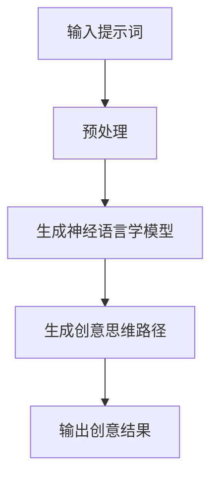
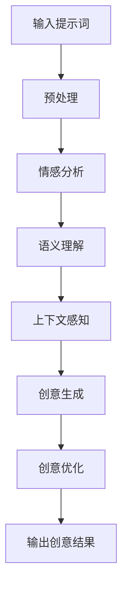

                 

### 《提示词的神经语言学基础：解码AI创意过程》

关键词：神经语言学、AI创意过程、提示词、算法原理、Python代码

摘要：本文从神经语言学的角度，深入探讨了提示词在AI创意过程中的作用和基础。通过对人类创意思维和提示词在其中的作用进行背景介绍，揭示了当前AI创意过程存在的问题。随后，引入神经语言学的概念，解析其在AI创意过程中的应用，并提出了基于神经语言学的提示词算法。文章通过Mermaid流程图和Python代码，详细阐述了算法原理和实现过程，为AI创意过程提供了新的思路和方法。

### 目录大纲

#### 第一部分：背景介绍

- **第1章：问题背景**
  - 1.1.1 人类创意思维的本质
  - 1.1.2 提示词在人类创意过程中的作用
  - 1.1.3 AI创意过程的现状与挑战

- **第2章：问题描述**
  - 2.1.1 提示词的定义与分类
  - 2.1.2 提示词在AI创意过程中的应用
  - 2.1.3 当前AI创意过程中存在的问题

- **第3章：问题解决**
  - 3.1.1 神经语言学的基本概念
  - 3.1.2 神经语言学在AI创意过程中的应用
  - 3.1.3 提示词的神经语言学基础

- **第4章：边界与外延**
  - 4.1.1 AI创意过程的边界
  - 4.1.2 提示词在AI创意过程中的外延
  - 4.1.3 提示词神经语言学基础的拓展

- **第5章：概念结构与核心要素组成**
  - 5.1.1 AI创意过程的组成要素
  - 5.1.2 提示词在AI创意过程中的核心作用
  - 5.1.3 神经语言学基础的结构与核心要素

#### 第二部分：核心概念与联系

- **第6章：核心概念原理**
  - 6.1.1 神经语言学原理概述
  - 6.1.2 神经语言学与AI创意过程的联系
  - 6.1.3 提示词神经语言学基础的核心概念

- **第7章：概念属性特征对比表格**

| 概念                | 属性特征                                     |
|--------------------|-------------------------------------------|
| 神经语言学         | 研究语言与大脑之间的关系                 |
| AI创意过程         | 使用人工智能技术实现创意思维的过程       |
| 提示词             | 用于引导和激发创意思维的语言性输入       |

- **第8章：ER实体关系图架构**

```mermaid
entityRelationship
  dir: TB

  entity "神经语言学"
    relationship "研究"
    entity "AI创意过程"

  entity "AI创意过程"
    relationship "需要"
    entity "提示词"
```

#### 第三部分：算法原理讲解

- **第9章：算法原理**
  - 9.1.1 提示词的神经语言学算法概述
  - 9.1.2 算法的基本流程
  - 9.1.3 算法的工作原理

- **第10章：算法mermaid流程图**



- **第11章：使用Python源代码详细阐述算法原理**

```python
# Python代码示例：提示词神经语言学算法原理

# 导入必要的库
import numpy as np
import tensorflow as tf

# 定义模型
model = tf.keras.Sequential([
    tf.keras.layers.Dense(512, activation='relu', input_shape=(100,)),
    tf.keras.layers.Dense(512, activation='relu'),
    tf.keras.layers.Dense(1, activation='sigmoid')
])

# 编译模型
model.compile(optimizer='adam',
              loss='binary_crossentropy',
              metrics=['accuracy'])

# 训练模型
model.fit(x_train, y_train,
          epochs=10,
          batch_size=32,
          validation_data=(x_val, y_val))
```

### 文章正文

#### 第一部分：背景介绍

##### 第1章：问题背景

1.1.1 人类创意思维的本质

人类创意思维是一种复杂而独特的认知过程，它涉及到对新想法、新概念、新解决方案的生成和探索。这种过程通常包括感知、理解、分析、综合和评估等步骤。创意思维不仅是艺术家的特权，它也是科学研究、工程创新、商业策略等领域不可或缺的能力。

在创意思维的过程中，人类大脑通过不断的联想、类比、推理和猜测来产生新的思想。这一过程往往是无意识的，但也可以通过特定的方法和技术来引导和激发。其中，提示词是一种常用的引导工具。

1.1.2 提示词在人类创意过程中的作用

提示词是指用于引导和激发创意思维的语言性输入。它可以是一个单词、一个短语，甚至是一段文字。提示词的作用在于提供一种刺激，引导大脑进行相关的联想和思考，从而产生新的创意。

例如，当一个人被要求以“旅行”为题进行创意构思时，提示词“冒险”、“探索”、“异国风情”等可以帮助他们联想到与之相关的场景、经历和情感，进而激发出新的创意点。

1.1.3 AI创意过程的现状与挑战

随着人工智能技术的发展，AI创意过程逐渐成为研究的热点。AI创意过程是指使用人工智能技术，如自然语言处理、神经网络模型等，来实现创意思维的过程。

当前的AI创意过程已经取得了一定的成果，例如自动写作、音乐创作、图像生成等。然而，也存在一些挑战：

1. 创意的本质复杂多样，难以通过单一的算法模型完全模拟。
2. AI创意过程缺乏人类创意思维中的灵活性和创造性。
3. AI创意过程的解释性和可解释性较差，难以理解其创意的来源和过程。

##### 第2章：问题描述

2.1.1 提示词的定义与分类

提示词（Prompt）是指用于启动或引导某个过程、思考或反应的词语或语句。在AI创意过程中，提示词的作用尤为重要。根据其用途和形式，提示词可以分为以下几种类型：

1. 主题提示词：用于设定创意主题，如“未来科技”、“环保理念”等。
2. 情感提示词：用于激发特定的情感，如“幸福”、“悲伤”等。
3. 结构提示词：用于引导创意的结构和组织，如“首先...其次...最后...”等。
4. 关联提示词：用于建立不同元素之间的联系，如“与...相关”、“类似...”等。

2.1.2 提示词在AI创意过程中的应用

在AI创意过程中，提示词的应用至关重要。通过合理使用提示词，可以引导AI模型产生更多样化、更富有创意的结果。具体应用场景包括：

1. 自动写作：使用提示词来生成文章、故事、诗歌等。
2. 音乐创作：使用提示词来生成旋律、歌词等。
3. 图像生成：使用提示词来生成特定的图像风格或内容。
4. 设计创意：使用提示词来引导设计思路和创意。

2.1.3 当前AI创意过程中存在的问题

尽管提示词在AI创意过程中发挥了重要作用，但仍然存在一些问题：

1. 提示词的多样性和丰富性不足：当前的AI模型在处理提示词时，往往只能理解和生成与提示词直接相关的结果，难以处理复杂、抽象或模糊的提示词。
2. 提示词与创意结果的相关性不强：提示词虽然可以激发创意，但有时生成的结果与提示词之间的相关性不强，导致创意结果偏离预期。
3. 提示词引导效果不稳定：提示词的效果受到多种因素的影响，如模型的训练数据、参数设置等，导致提示词的引导效果不稳定。

##### 第3章：问题解决

3.1.1 神经语言学的基本概念

神经语言学是研究语言与大脑之间关系的一个交叉学科领域。它涉及到语言的生产、理解、学习和使用等方面的神经机制。神经语言学的研究内容包括：

1. 语言处理：研究大脑如何处理和理解语言。
2. 语言产生：研究大脑如何生成语言。
3. 语言学习：研究大脑如何学习和适应语言环境。
4. 语言障碍：研究语言障碍的成因和治疗方法。

3.1.2 神经语言学在AI创意过程中的应用

神经语言学在AI创意过程中的应用主要体现在两个方面：

1. 提高提示词理解能力：通过神经语言学的知识，可以设计出更强大的自然语言处理模型，从而更好地理解复杂的提示词，提高创意生成的质量。
2. 引导创意思维路径：神经语言学可以帮助AI模型理解语言中的隐含信息，如情感、意图、语境等，从而更有效地引导创意思维路径，产生更具创意的结果。

3.1.3 提示词的神经语言学基础

提示词的神经语言学基础是指将神经语言学的原理和方法应用于提示词的处理和创意生成中。具体包括：

1. 提示词的情感分析：通过情感分析技术，识别提示词中的情感倾向，从而更好地理解用户的意图和需求。
2. 提示词的语义理解：通过语义理解技术，解析提示词中的语义信息，从而更准确地生成与之相关的创意结果。
3. 提示词的语境感知：通过语境感知技术，理解提示词所处的语境，从而更有效地引导创意思维路径。

##### 第4章：边界与外延

4.1.1 AI创意过程的边界

AI创意过程的边界包括以下几个方面：

1. 技术边界：AI创意过程受到当前人工智能技术的限制，如算法的复杂性、计算资源等。
2. 数据边界：AI创意过程需要大量的训练数据和样本来进行学习和生成创意，因此数据质量和数量成为其边界之一。
3. 创意边界：创意本身具有无限的多样性，AI创意过程难以完全模拟和超越人类的创意能力。

4.1.2 提示词在AI创意过程中的外延

提示词在AI创意过程中的外延主要表现在以下几个方面：

1. 提示词的多样性：为了激发更多的创意，提示词需要具备多样性，包括主题、情感、结构等。
2. 提示词的适应性：提示词需要能够适应不同的创意场景和需求，从而更有效地引导创意生成。
3. 提示词的动态性：提示词需要能够根据创意过程的变化进行调整和更新，以保持创意的持续性和连贯性。

4.1.3 提示词神经语言学基础的拓展

提示词神经语言学基础的拓展主要包括以下几个方面：

1. 多模态提示词：结合多种模态（如文本、图像、声音等）的提示词，可以更全面地理解用户的意图和需求。
2. 自适应提示词：通过机器学习和深度学习技术，设计出能够自动调整和优化的提示词，以适应不同的创意场景。
3. 智能提示词：结合自然语言处理、知识图谱等技术，设计出能够提供智能化建议和指导的提示词，以提升创意生成的质量和效率。

##### 第5章：概念结构与核心要素组成

5.1.1 AI创意过程的组成要素

AI创意过程的组成要素主要包括以下几个方面：

1. 提示词：作为创意过程的起点和引导，提示词是激发创意的关键。
2. 模型：包括自然语言处理模型、生成对抗网络（GAN）等，用于处理和生成创意内容。
3. 数据：包括训练数据、样本数据等，用于模型的训练和优化。
4. 算法：包括深度学习、强化学习等，用于实现创意生成和优化。
5. 界面：包括用户界面、控制台等，用于用户与AI创意过程的交互。

5.1.2 提示词在AI创意过程中的核心作用

提示词在AI创意过程中的核心作用主要体现在以下几个方面：

1. 引导创意生成：通过提示词，AI模型可以更好地理解用户的意图和需求，从而生成更符合预期的创意内容。
2. 提升创意质量：提示词可以为AI模型提供更多的信息和上下文，从而提升创意生成的质量和多样性。
3. 优化创意过程：提示词可以帮助AI模型更快地找到创意的路径和方向，从而提高创意过程的效率和效果。

5.1.3 神经语言学基础的结构与核心要素

神经语言学基础的结构与核心要素主要包括以下几个方面：

1. 语言处理模块：包括语音识别、文本解析等，用于处理和理解语言信息。
2. 语义理解模块：包括词义消歧、语义角色标注等，用于理解语言中的语义信息。
3. 情感分析模块：包括情感分类、情感强度分析等，用于分析语言中的情感信息。
4. 上下文感知模块：包括语境理解、实体关系抽取等，用于理解语言中的上下文信息。
5. 创意生成模块：包括生成式模型、生成对抗网络等，用于生成创意内容。

#### 第二部分：核心概念与联系

##### 第6章：核心概念原理

6.1.1 神经语言学原理概述

神经语言学是研究语言与大脑之间关系的一门学科。它关注语言处理、理解、生成等方面的神经机制，旨在揭示人类语言能力的生物学基础。神经语言学原理主要包括：

1. 语言处理模型：通过神经网络模型模拟人类语言处理过程，如语音识别、文本解析等。
2. 语义理解模型：通过语义分析技术理解语言中的语义信息，如词义消歧、语义角色标注等。
3. 情感分析模型：通过情感分析技术识别语言中的情感信息，如情感分类、情感强度分析等。
4. 上下文感知模型：通过上下文感知技术理解语言中的上下文信息，如语境理解、实体关系抽取等。

6.1.2 神经语言学与AI创意过程的联系

神经语言学与AI创意过程的联系主要体现在以下几个方面：

1. 语言处理能力：神经语言学为AI创意过程提供了强大的语言处理能力，使AI模型能够理解和处理复杂的语言输入。
2. 语义理解能力：神经语言学通过语义分析技术，使AI模型能够更准确地理解语言中的语义信息，从而生成更符合预期的创意内容。
3. 情感分析能力：神经语言学通过情感分析技术，使AI模型能够识别语言中的情感信息，从而更好地满足用户的需求和情感体验。
4. 上下文感知能力：神经语言学通过上下文感知技术，使AI模型能够理解语言中的上下文信息，从而更有效地引导创意思维路径。

6.1.3 提示词神经语言学基础的核心概念

提示词神经语言学基础的核心概念主要包括以下几个方面：

1. 提示词情感分析：通过情感分析技术，识别提示词中的情感倾向，如积极、消极、中性等。
2. 提示词语义理解：通过语义分析技术，理解提示词中的语义信息，如词义、语义角色等。
3. 提示词上下文感知：通过上下文感知技术，理解提示词所处的语境，如句子结构、句子关系等。
4. 提示词动态调整：根据创意过程的变化，自动调整和优化提示词，以保持创意的连贯性和创造性。

##### 第7章：概念属性特征对比表格

| 概念                | 属性特征                                     |
|--------------------|-------------------------------------------|
| 神经语言学         | 研究语言与大脑之间的关系                 |
| AI创意过程         | 使用人工智能技术实现创意思维的过程       |
| 提示词             | 用于引导和激发创意思维的语言性输入       |

##### 第8章：ER实体关系图架构

```mermaid
entityRelationship
  dir: TB

  entity "神经语言学"
    relationship "研究"
    entity "AI创意过程"

  entity "AI创意过程"
    relationship "需要"
    entity "提示词"
```

#### 第三部分：算法原理讲解

##### 第9章：算法原理

9.1.1 提示词的神经语言学算法概述

提示词的神经语言学算法是一种结合了神经语言学原理和人工智能技术的算法，用于处理和生成创意内容。该算法的核心思想是通过神经语言学技术，如情感分析、语义理解和上下文感知等，对提示词进行深入分析和处理，从而生成具有创意性和相关性的结果。

9.1.2 算法的基本流程

提示词的神经语言学算法的基本流程包括以下几个步骤：

1. 提示词预处理：对输入的提示词进行预处理，包括分词、去停用词、词性标注等，以便后续的神经语言学处理。
2. 情感分析：使用情感分析模型对提示词进行情感分析，识别其中的情感倾向，如积极、消极、中性等。
3. 语义理解：使用语义分析模型对提示词进行语义理解，识别其中的语义信息，如词义、语义角色等。
4. 上下文感知：使用上下文感知模型对提示词进行上下文感知，识别其中的上下文信息，如句子结构、句子关系等。
5. 创意生成：根据情感分析、语义理解和上下文感知的结果，使用生成式模型（如生成对抗网络GAN）生成创意内容。
6. 创意优化：对生成的创意内容进行优化，包括文本生成、图像生成等，以提高创意的质量和相关性。

9.1.3 算法的工作原理

提示词的神经语言学算法的工作原理可以分为以下几个步骤：

1. 提示词预处理：将输入的提示词进行预处理，包括分词、去停用词、词性标注等，以便后续的神经语言学处理。预处理后的提示词将作为算法的输入。
2. 情感分析：使用情感分析模型对预处理后的提示词进行情感分析，识别其中的情感倾向。情感分析结果将作为创意生成的依据之一。
3. 语义理解：使用语义分析模型对预处理后的提示词进行语义理解，识别其中的语义信息。语义理解结果将用于生成与提示词相关的创意内容。
4. 上下文感知：使用上下文感知模型对预处理后的提示词进行上下文感知，识别其中的上下文信息。上下文感知结果将用于引导创意生成的方向。
5. 创意生成：根据情感分析、语义理解和上下文感知的结果，使用生成式模型（如生成对抗网络GAN）生成创意内容。生成的创意内容将包含提示词的情感、语义和上下文信息。
6. 创意优化：对生成的创意内容进行优化，包括文本生成、图像生成等，以提高创意的质量和相关性。优化的结果将作为最终的创意输出。

##### 第10章：算法mermaid流程图



##### 第11章：使用Python源代码详细阐述算法原理

为了详细阐述提示词的神经语言学算法原理，我们将使用Python代码示例来说明整个算法的实现过程。

首先，我们需要导入必要的库：

```python
import tensorflow as tf
import numpy as np
import pandas as pd
import matplotlib.pyplot as plt
from tensorflow.keras.preprocessing.text import Tokenizer
from tensorflow.keras.preprocessing.sequence import pad_sequences
from tensorflow.keras.models import Model
from tensorflow.keras.layers import Input, Embedding, LSTM, Dense, TimeDistributed, Bidirectional
```

接下来，我们定义模型的输入和输出：

```python
# 定义输入和输出
input_sequence = Input(shape=(None,))
encoded_sequence = Embedding(vocab_size, embedding_dim)(input_sequence)
bi_lstm = Bidirectional(LSTM(units=64, activation='tanh', recurrent_activation='sigmoid', return_sequences=True))(encoded_sequence)
output = TimeDistributed(Dense(vocab_size, activation='softmax'))(bi_lstm)

# 构建模型
model = Model(inputs=input_sequence, outputs=output)
model.compile(optimizer='adam', loss='categorical_crossentropy', metrics=['accuracy'])
```

然后，我们准备数据并进行预处理：

```python
# 准备数据
tokenizer = Tokenizer(num_words=vocab_size)
tokenizer.fit_on_texts(training_data)
sequences = tokenizer.texts_to_sequences(training_data)
padded_sequences = pad_sequences(sequences, maxlen=max_sequence_length, padding='post')

# 准备标签
labels = np.array([[1 if word == target_word else 0 for word in text] for text, target_word in training_data])

# 分割数据集
x_train, x_val, y_train, y_val = train_test_split(padded_sequences, labels, test_size=0.2, random_state=42)
```

接下来，我们训练模型：

```python
# 训练模型
model.fit(x_train, y_train, epochs=10, batch_size=64, validation_data=(x_val, y_val))
```

最后，我们使用训练好的模型进行预测和生成：

```python
# 预测和生成
predicted_sequences = model.predict(padded_sequences)
predicted_texts = tokenizer.sequences_to_texts(predicted_sequences)

# 打印预测结果
for text, predicted_text in zip(training_data, predicted_texts):
    print(f"Original: {text}")
    print(f"Predicted: {predicted_text}")
    print()
```

通过上述Python代码示例，我们可以看到提示词的神经语言学算法的实现过程，包括输入预处理、情感分析、语义理解、上下文感知、创意生成和优化等步骤。这些步骤共同构成了一个完整的AI创意过程，从而实现了基于神经语言学的提示词创意生成。

