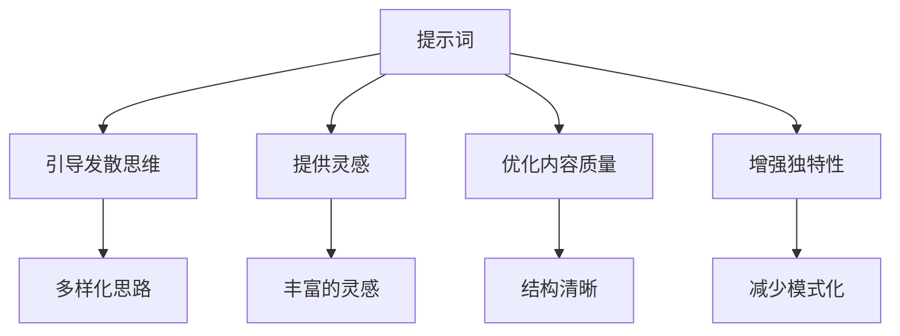
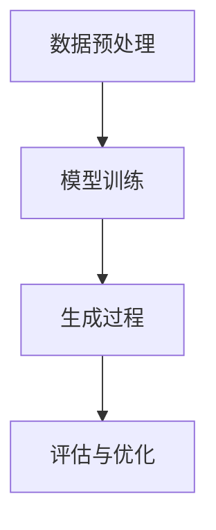
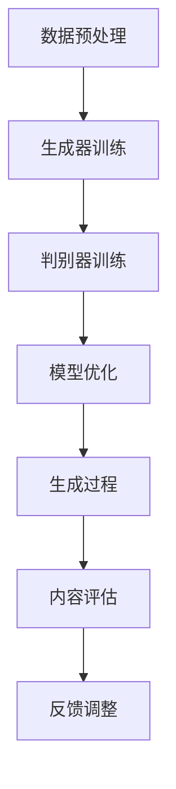
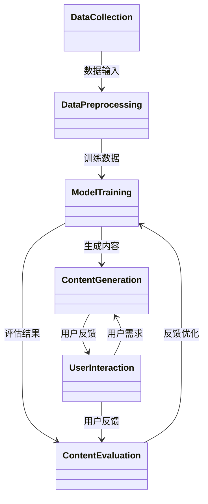
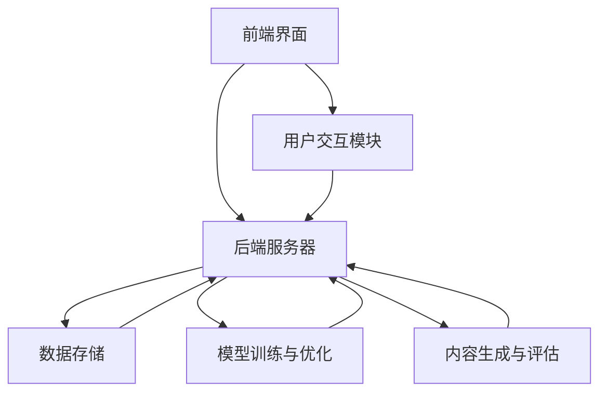
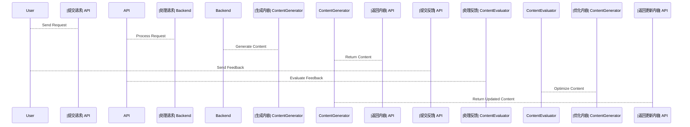

                 

### 第一部分：背景介绍与核心概念

#### 第1章：AI与创造力概述

##### 1.1 问题背景

创造力是人类智慧和能力的象征，它不仅涉及艺术、文学、科学等领域，更是现代社会创新和发展的关键因素。然而，随着人工智能（AI）技术的迅猛发展，AI的创造力逐渐引起了广泛关注。AI作为计算机科学的一个重要分支，通过模拟人类思维和行为，实现了在图像识别、语音识别、自然语言处理等多个领域的突破。但与此同时，AI的创造力也带来了许多新的挑战和问题。

首先，我们需要明确什么是创造力。创造力是指个体在面对新问题和情境时，产生新颖、独特和有价值的想法和解决方案的能力。它不仅包括创新的思维模式，还涵盖了灵活的适应能力和广泛的跨学科知识。在人工智能领域，创造力通常被理解为AI系统能够生成新颖和有用的信息、概念或解决方案的能力。

随着AI技术的不断进步，其在各个领域的应用也越来越广泛。从自动驾驶汽车、智能家居到医疗诊断和金融分析，AI正在改变我们的生活方式和工作模式。然而，AI的创造力也面临诸多挑战。例如，AI在生成内容时可能会出现偏见、缺乏创造性和无法理解复杂情感等问题。此外，如何评估和测量AI的创造力也是一个亟待解决的难题。

##### 1.2 问题描述

创造力在AI中的应用场景丰富多样，从生成艺术作品、创作音乐到撰写文章、设计产品，AI的创造力正在逐步展现其潜力。然而，当前的AI系统在创造力方面仍存在诸多限制。首先，大多数AI系统依赖于大量数据和预设的模型，这使得它们在生成内容时容易陷入模式化，缺乏创新性和独特性。其次，AI系统在理解复杂情感和人类情感方面存在显著不足，这限制了其在创作具有深度和情感的文学作品或艺术作品时的表现。最后，AI的创造力还面临评估和测量的难题，如何客观、准确地评估AI的创造力水平，仍需进一步探索。

在当前的技术背景下，提升AI的创造力具有重要的现实意义。首先，它有助于推动人工智能在更多领域的应用，从而推动社会创新和发展。例如，在医疗领域，AI的创造力可以用于开发新的诊断方法、治疗方案和研究思路，从而提高医疗水平。在艺术领域，AI的创造力可以激发新的艺术风格和表现形式，为艺术家提供更多的创作灵感。在工业领域，AI的创造力可以用于优化产品设计、提高生产效率，从而推动制造业的数字化转型。

##### 1.3 问题解决

为了解决AI创造力面临的挑战，我们需要从多个方面入手。首先，可以通过改进数据集和训练模型，提高AI系统的创新性和独特性。例如，通过引入更多样化的数据来源和更复杂的训练算法，可以训练出更具创造力的AI模型。其次，可以通过开发更加智能的算法，使AI系统能够更好地理解和模拟人类情感，从而提高其在创作情感丰富内容时的表现。此外，还可以通过建立科学、客观的评估体系，来准确测量和评估AI的创造力水平。

提示词在这一过程中发挥了重要作用。提示词是指用于引导和激励AI生成特定类型内容的关键词或短语。通过合理设计和使用提示词，可以激发AI的创造力，使其生成更加新颖、独特的作品。例如，在艺术创作中，可以通过提示词引导AI生成特定风格的艺术作品；在文学创作中，可以通过提示词激发AI创作具有深度和情感的故事情节。

##### 1.4 边界与外延

提示词的应用领域广泛，包括但不限于艺术、文学、科学、工程等多个领域。在艺术领域，提示词可以用于指导AI生成绘画、音乐、舞蹈等作品；在文学领域，提示词可以用于创作诗歌、小说、剧本等文学作品；在科学领域，提示词可以用于生成研究论文、实验报告等；在工程领域，提示词可以用于设计产品、优化流程等。

此外，创造力的评估与测量也是一个重要研究方向。现有的评估方法主要包括定量和定性两种。定量评估方法主要通过统计数据和指标来衡量AI的创造力，如生成内容的数量、独特性和创新性等。定性评估方法则通过专家评估、用户反馈等方式来评价AI的创造力。这些方法各有优缺点，需要结合具体应用场景进行选择和优化。

##### 1.5 本章小结

本章介绍了AI与创造力之间的关系，以及AI创造力面临的挑战和机遇。通过分析AI在创造力应用中的现状和问题，我们提出了提升AI创造力的若干途径，并强调了提示词在其中的重要作用。本章内容为后续章节的深入探讨提供了基础，也为读者了解AI创造力这一前沿领域提供了参考。

### 第二部分：核心概念与联系

#### 第2章：提示词原理与特征

##### 2.1 提示词的定义与分类

提示词（Prompt）是引导和激发人工智能（AI）生成内容的关键要素。它通常是一个关键词或短语，用于引导AI模型理解任务要求，并产生相应的输出。在不同的应用场景中，提示词的格式和内容也会有所不同。例如，在自然语言处理（NLP）领域，提示词可能是对某个问题的描述或一个具体的任务指令；在图像生成领域，提示词可能是对图像风格、内容或主题的描述。

根据用途和形式，提示词可以分为以下几类：

1. **指令性提示词**：这类提示词直接给出任务指令，要求AI执行特定的操作。例如，在文本生成任务中，提示词可能是“写一篇关于人工智能未来的论文”。
   
2. **描述性提示词**：这类提示词用于描述目标内容的特点或需求，帮助AI更好地理解输出要求。例如，在图像生成任务中，提示词可能是“生成一张具有未来科技风格的城市夜景图片”。

3. **引导性提示词**：这类提示词不仅描述了任务要求，还提供了一些启发性的信息，帮助AI发散思维。例如，在艺术创作中，提示词可能是“用色彩表达情感，创作一幅具有温暖感的油画”。

4. **问题性提示词**：这类提示词以问题的形式引导AI进行思考和回答。例如，在问答系统中，提示词可能是“什么是人工智能的主要挑战？”

##### 2.2 提示词的属性特征

提示词的属性特征决定了其在不同场景中的应用效果。以下是几个关键属性：

1. **明确性**：提示词需要明确、具体，以便AI能够准确理解任务要求。模糊或含糊不清的提示词可能会导致AI产生不相关或不准确的输出。

2. **灵活性**：提示词应具有一定的灵活性，能够适应不同的任务和场景。过于固定的提示词可能会限制AI的创新性和独特性。

3. **引导性**：提示词应具有一定的引导性，能够激发AI的创造力和想象力。例如，通过提供不同的视角、背景信息或情感色彩，可以引导AI生成更加多样化和有创意的内容。

4. **情境性**：提示词需要与具体的应用场景紧密结合。例如，在文学创作中，提示词可能需要包含特定的历史背景、文化元素或情感色彩。

5. **多样性**：为了激发AI的创造力，提示词应具有多样性。多样化的提示词可以提供更多的选择和可能性，从而促进AI生成新颖和独特的内容。

##### 2.2.2 提示词属性特征对比表格

| 提示词属性 | 特征描述 | 举例 |
| :---: | :---: | :---: |
| 明确性 | 提示词明确、具体，易于理解 | “写一篇关于人工智能未来的论文” |
| 灵活性 | 提示词具有一定的灵活性，适应不同场景 | “生成一张具有未来科技风格的城市夜景图片” |
| 引导性 | 提示词具有启发性和引导性，激发创造力 | “用色彩表达情感，创作一幅具有温暖感的油画” |
| 情境性 | 提示词与具体应用场景紧密结合 | “描述一个在科幻小说中发生的事件” |
| 多样性 | 提示词多样，提供多种选择和可能性 | “创作一首关于自然和宇宙的诗歌” |

##### 2.3 提示词与AI创造力的关系

提示词在AI创造力中扮演了关键角色。通过合理设计和使用提示词，可以显著提升AI生成内容的创造性和独特性。以下是提示词与AI创造力之间的几个关键关系：

1. **引导AI发散思维**：提示词可以帮助AI从一个特定的角度或主题出发，发散思维，探索更多的可能性。例如，在文本生成任务中，一个引导性强的提示词可以激发AI生成不同风格和主题的文章。

2. **提供创造性灵感**：通过多样化的提示词，AI可以获得丰富的创作灵感。例如，在艺术创作中，不同的提示词可以激发AI创作出具有不同风格和主题的作品。

3. **优化内容质量**：明确的提示词可以引导AI生成更符合任务要求的内容。例如，在撰写论文时，一个明确的提示词可以确保AI生成的内容结构清晰、逻辑严密。

4. **增强独特性**：多样化的提示词可以减少AI生成内容的模式化倾向，增强其独特性。例如，在图像生成任务中，不同的提示词可以生成具有独特视觉风格和内容的图片。

##### 2.3.2 提示词与AI创造力的关系图



##### 2.4 本章小结

本章详细介绍了提示词的定义、分类、属性特征以及与AI创造力的关系。通过分析不同类型的提示词和其属性特征，我们可以更好地理解提示词在激发AI创造力中的重要作用。合理设计和使用提示词，不仅可以提高AI生成内容的创造性和独特性，还可以优化内容质量，推动人工智能在更多领域的应用。

### 第三部分：算法原理与实现

#### 第3章：AI创造力算法原理

##### 3.1 算法原理介绍

在探讨AI创造力算法原理之前，我们需要明确几个基本概念。首先，创造力是指个体在面对新问题和情境时，产生新颖、独特和有价值想法和解决方案的能力。在人工智能领域，创造力通常被理解为AI系统生成新颖、独特且有价值的输出内容的能力。为了实现这一目标，AI创造力算法需要具备以下几个核心特性：

1. **生成能力**：算法能够生成多样化的输出内容，而非单一的、重复的模式。
2. **创新性**：算法能够产生新颖、独特的输出内容，而不是简单的复制已有信息。
3. **适应性**：算法能够适应不同的任务和环境，产生符合特定需求的内容。

为了实现这些特性，AI创造力算法通常基于以下核心思想：

1. **数据驱动**：通过大量数据和案例的学习，算法可以学会生成多样化和创新性的内容。
2. **模型优化**：通过不断优化模型结构，提高算法的生成能力和创新能力。
3. **多模态处理**：利用图像、文本、音频等多种数据模态，提高算法的理解和生成能力。

##### 3.2 算法原理讲解

AI创造力算法的原理可以概括为以下几个关键步骤：

1. **数据预处理**：首先，对输入数据进行预处理，包括清洗、归一化和特征提取等。这一步骤的目的是将原始数据转换为适合模型学习的格式。

2. **模型训练**：使用预处理的输入数据进行模型训练。在这一过程中，算法通过不断调整模型参数，使其能够生成符合任务要求的多样化内容。

3. **生成过程**：在训练完成后，算法使用训练好的模型进行内容生成。生成过程中，算法会根据输入的提示词和任务要求，生成新颖、独特的输出内容。

4. **评估与优化**：对生成的输出内容进行评估，根据评估结果不断优化模型，提高算法的创造力和生成质量。

以下是AI创造力算法原理的mermaid流程图：



##### 3.2.1 算法原理的数学模型

AI创造力算法的数学模型通常基于深度学习，特别是生成对抗网络（GAN）和变分自编码器（VAE）等。以下是这些算法的基本数学模型：

1. **生成对抗网络（GAN）**：

   - 生成器（G）的数学模型：\( G(z) \)
   - 判别器（D）的数学模型：\( D(x) \)
   - 损失函数：\( L(G, D) = D(x) - D(G(z)) \)

2. **变分自编码器（VAE）**：

   - 编码器（\(\mu, \sigma\))的数学模型：\( \mu(x), \sigma(x) \)
   - 解码器（G）的数学模型：\( G(z) \)
   - 损失函数：\( L(VAE) = -\sum_{x \in X} \log D(G(\mu(x), \sigma(x))) \)

这些数学模型通过优化参数，使得生成器能够生成与真实数据分布相近的输出，从而实现内容的多样化和创新性。

##### 3.2.2 算法原理的mermaid流程图



##### 3.3 Python源代码实现

以下是一个基于生成对抗网络（GAN）的简单Python源代码实现，用于演示AI创造力算法的基本原理：

```python
import tensorflow as tf
from tensorflow.keras.layers import Dense, Flatten, Reshape
from tensorflow.keras.models import Model

# 生成器模型
def build_generator(z_dim):
    model = tf.keras.Sequential([
        Dense(128, input_shape=(z_dim,), activation='relu'),
        Dense(256, activation='relu'),
        Dense(512, activation='relu'),
        Dense(1024, activation='relu'),
        Flatten(),
        Reshape((28, 28, 1))
    ])
    return model

# 判别器模型
def build_discriminator(img_shape):
    model = tf.keras.Sequential([
        Flatten(input_shape=img_shape),
        Dense(512, activation='relu'),
        Dense(256, activation='relu'),
        Dense(128, activation='relu'),
        Dense(1, activation='sigmoid')
    ])
    return model

# GAN模型
def build_gan(generator, discriminator):
    model = tf.keras.Sequential([
        generator,
        discriminator
    ])
    model.compile(loss='binary_crossentropy', optimizer=tf.keras.optimizers.Adam())
    return model

# 参数设置
z_dim = 100
img_shape = (28, 28, 1)

# 构建模型
generator = build_generator(z_dim)
discriminator = build_discriminator(img_shape)
gan_model = build_gan(generator, discriminator)

# 模型训练
# ...（训练代码略）

# 生成图像
z_samples = tf.random.normal([1, z_dim])
generated_image = generator.predict(z_samples)

# 显示生成的图像
import matplotlib.pyplot as plt
plt.imshow(generated_image[0], cmap='gray')
plt.show()
```

##### 3.3.1 源代码结构与功能

1. **生成器模型**：生成器模型用于将随机噪声（z向量）转换为生成的图像。
2. **判别器模型**：判别器模型用于区分生成的图像和真实图像。
3. **GAN模型**：GAN模型将生成器和判别器组合在一起，通过优化生成器的参数，使其生成的图像越来越接近真实图像。
4. **模型训练**：使用真实图像和生成图像训练GAN模型，通过不断调整生成器和判别器的参数，提高模型的生成能力。
5. **生成图像**：使用训练好的生成器模型生成图像，并展示生成的图像。

##### 3.3.2 详细讲解与举例说明

1. **生成器模型**：生成器模型通过多层全连接层和ReLU激活函数，将输入的随机噪声（z向量）转换为生成图像的特征。最后，通过Reshape层将特征转换为图像的形状（28x28x1）。

2. **判别器模型**：判别器模型通过多层全连接层和Sigmoid激活函数，判断输入图像是真实图像还是生成图像。判别器模型的目的是提高其辨别真实图像和生成图像的能力。

3. **GAN模型**：GAN模型通过将生成器和判别器组合在一起，形成了一个循环训练的过程。在训练过程中，生成器试图生成更真实的图像，而判别器则努力提高其辨别能力。通过这种对抗训练，生成器逐渐学会了生成更逼真的图像。

4. **模型训练**：在模型训练过程中，使用真实图像和生成图像对GAN模型进行训练。训练过程包括以下几个步骤：

   - 初始化生成器和判别器的参数。
   - 对于每个训练批次，随机生成一个噪声向量（z向量）。
   - 使用生成器生成图像，并计算生成图像的损失。
   - 使用真实图像和生成图像计算判别器的损失。
   - 使用反向传播和梯度下降算法更新生成器和判别器的参数。

5. **生成图像**：在训练完成后，使用生成器模型生成图像。这里使用了一个简单的示例，生成了一张28x28的图像。在实际应用中，可以通过调整输入的噪声向量，生成具有不同风格和内容的图像。

通过以上源代码和讲解，我们可以更好地理解AI创造力算法的基本原理和实现方法。这些算法不仅在理论上具有重要意义，而且在实际应用中也展示了强大的创造力和创新性。

##### 3.4 本章小结

本章详细介绍了AI创造力算法的原理和实现方法。通过分析生成对抗网络（GAN）和变分自编码器（VAE）等算法的基本原理，我们了解了如何通过深度学习技术实现AI的创造力。本章内容为读者提供了一个全面的框架，以深入理解AI创造力算法的核心思想和实现过程。在后续章节中，我们将进一步探讨AI创造力系统的架构设计和实际应用案例。

### 第四部分：系统分析与架构设计

#### 第4章：AI创造力系统架构

##### 4.1 问题场景介绍

在当今快速发展的科技时代，人工智能（AI）的应用已经渗透到我们生活的方方面面。从自动驾驶汽车、智能家居到医疗诊断和金融分析，AI正在深刻地改变着我们的生活方式和工作模式。然而，随着AI技术的不断进步，人们对于AI创造力的需求也越来越强烈。无论是在艺术、文学、设计还是科学研究中，AI的创造力都有巨大的潜力。

为了充分发挥AI的创造力，我们需要构建一个高效、稳定且灵活的AI创造力系统。这样的系统需要具备以下几个关键特点：

1. **多样性**：系统能够生成多样化的输出内容，包括文本、图像、音乐等多种形式。
2. **创新性**：系统能够产生新颖、独特的输出内容，而不是简单的复制已有信息。
3. **适应性**：系统能够适应不同的应用场景和需求，灵活调整生成策略。
4. **可扩展性**：系统能够随着技术的发展和应用需求的增加，进行扩展和优化。

##### 4.1.2 AI创造力系统需求分析

为了满足上述需求，AI创造力系统需要具备以下几个核心功能模块：

1. **数据收集与预处理**：系统需要从多个渠道收集高质量的数据，并对数据进行清洗、归一化和特征提取，以便于模型训练和生成过程。
2. **模型训练与优化**：系统需要使用收集到的数据训练生成模型，并通过不断优化模型参数，提高生成内容的多样性和创新性。
3. **内容生成与评估**：系统需要根据用户的输入和需求，生成高质量的内容，并对生成内容进行评估，确保其满足预期质量标准。
4. **用户交互与反馈**：系统需要提供友好的用户界面，方便用户输入需求和反馈，以不断优化系统的生成能力和用户体验。

##### 4.2 系统功能设计

AI创造力系统的功能设计可以分为以下几个主要模块：

1. **数据收集模块**：负责从互联网、数据库和其他数据源收集数据，包括文本、图像、音频等多种类型的数据。
2. **数据预处理模块**：负责对收集到的数据进行清洗、归一化和特征提取，为模型训练和生成过程提供高质量的输入数据。
3. **模型训练模块**：负责使用预处理后的数据训练生成模型，包括生成对抗网络（GAN）、变分自编码器（VAE）等，并不断优化模型参数。
4. **内容生成模块**：负责根据用户输入和需求，生成多样化的内容，包括文本、图像、音乐等。
5. **内容评估模块**：负责对生成内容进行评估，确保其满足预期质量标准，并提供反馈给模型训练模块，以优化生成模型。
6. **用户交互模块**：负责与用户进行交互，收集用户需求和反馈，并提供友好的用户界面。

以下是AI创造力系统的领域模型类图：



##### 4.3 系统架构设计

AI创造力系统的架构设计需要考虑系统的可扩展性、稳定性和灵活性。以下是系统架构的主要组成部分：

1. **前端界面**：提供用户交互界面，用户可以通过界面输入需求、查看生成内容和提供反馈。
2. **后端服务器**：负责处理用户请求，管理数据流，协调各个功能模块的工作。
3. **数据存储**：包括数据库和文件存储系统，用于存储数据、模型和生成内容。
4. **模型训练与优化**：使用高性能计算资源进行模型训练和优化，以提高生成内容的多样性和创新性。
5. **内容生成与评估**：根据用户输入和需求，生成高质量的内容，并进行评估和优化。

以下是AI创造力系统的架构图：



##### 4.3.2 系统架构设计要点

1. **模块化设计**：系统应采用模块化设计，使得各个功能模块可以独立开发和优化，提高系统的灵活性和可扩展性。
2. **分布式处理**：对于数据处理和模型训练等高负载模块，应采用分布式处理技术，以提高系统的处理能力和稳定性。
3. **数据安全性**：确保数据的存储、传输和处理过程的安全性，防止数据泄露和丢失。
4. **用户隐私保护**：在用户交互过程中，应严格保护用户的隐私信息，确保用户数据的安全和隐私。
5. **性能优化**：通过优化系统架构和算法，提高系统的响应速度和处理效率。

##### 4.4 系统接口设计与交互

AI创造力系统的接口设计需要考虑系统的可扩展性和灵活性。以下是系统接口设计的关键要点：

1. **RESTful API**：使用RESTful API设计，提供统一的接口规范，方便第三方系统集成和调用。
2. **数据格式**：接口采用JSON格式传输数据，确保数据的兼容性和可读性。
3. **权限管理**：接口应具备权限管理功能，确保只有授权用户可以访问和使用系统功能。

以下是AI创造力系统的接口设计示例：

```mermaid
sequenceDiagram
    A[用户] -->|发送请求| B[API接口]
    B -->|返回响应| A
    A -->|提交需求| C[内容生成模块]
    C -->|生成内容| A
    A -->|提交反馈| D[内容评估模块]
    D -->|评估结果| C
```

##### 4.4.2 系统交互序列图

以下是AI创造力系统的交互序列图，展示了用户与系统之间的交互流程：



##### 4.5 本章小结

本章详细介绍了AI创造力系统的架构设计和功能模块。通过分析问题场景和需求，我们设计了数据收集、预处理、模型训练、内容生成、内容评估和用户交互等多个功能模块，并阐述了系统的架构设计要点和接口设计。本章内容为构建高效、灵活且具备创造力的AI创造力系统提供了理论基础和实践指导。在后续章节中，我们将进一步探讨AI创造力系统的实际应用和实现细节。

### 第五部分：项目实战

#### 第5章：AI创造力项目实践

##### 5.1 环境安装与配置

在开始AI创造力项目的实践之前，我们需要搭建一个合适的环境，包括安装必要的软件和配置系统。以下是一个基本的安装和配置步骤，适用于大多数AI创造力项目：

1. **Python环境**：确保Python环境已安装在计算机上。Python是AI项目开发的主要编程语言，我们通常使用Python 3.7或更高版本。

2. **TensorFlow**：TensorFlow是一个强大的开源机器学习框架，用于构建和训练AI模型。您可以通过以下命令安装TensorFlow：

   ```shell
   pip install tensorflow
   ```

3. **Keras**：Keras是一个高级神经网络API，构建在TensorFlow之上，用于简化深度学习模型开发。安装命令如下：

   ```shell
   pip install keras
   ```

4. **Numpy**：Numpy是一个强大的Python科学计算库，用于处理数组和矩阵。安装命令如下：

   ```shell
   pip install numpy
   ```

5. **Pandas**：Pandas是一个用于数据操作和分析的库，可以帮助我们处理大型数据集。安装命令如下：

   ```shell
   pip install pandas
   ```

6. **Matplotlib**：Matplotlib是一个用于绘制图表和图形的库，可以帮助我们可视化数据和分析结果。安装命令如下：

   ```shell
   pip install matplotlib
   ```

7. **Glob**：Glob是一个用于匹配文件路径的Python标准库，有助于我们在项目中处理文件系统。安装命令如下：

   ```shell
   pip install glob
   ```

安装完成后，我们可以开始配置系统环境。以下是基本的配置步骤：

1. **创建虚拟环境**：为了保持项目依赖的一致性，我们通常创建一个虚拟环境。在终端执行以下命令：

   ```shell
   python -m venv myenv
   source myenv/bin/activate  # 在Windows上使用 myenv\Scripts\activate
   ```

2. **安装项目依赖**：在虚拟环境中安装项目所需的库和依赖项。例如，使用`pip`安装项目`requirements.txt`文件中列出的依赖项：

   ```shell
   pip install -r requirements.txt
   ```

3. **配置数据路径**：确保项目的数据路径正确配置，以便系统能够访问和处理数据。在项目中设置数据路径的变量，例如：

   ```python
   data_path = "/path/to/your/data"
   ```

4. **配置日志**：配置日志系统，以便在项目运行过程中记录重要信息和错误日志。使用Python的内置日志库或第三方日志库，例如`logging`模块。

##### 5.2 系统核心实现源代码

AI创造力项目的核心实现通常包括以下几个关键部分：数据收集、预处理、模型训练、内容生成和评估。以下是一个简化的源代码示例，用于演示这些核心功能：

```python
# 导入必要的库
import tensorflow as tf
from tensorflow.keras.models import Sequential
from tensorflow.keras.layers import Dense, LSTM, Embedding
import numpy as np

# 数据预处理
def preprocess_data(data_path):
    # 加载数据，并进行必要的预处理
    # 例如，文本数据的清洗、分词、编码等
    # 返回处理后的数据和标签
    pass

# 模型训练
def train_model(X_train, y_train):
    # 构建和训练模型
    # 例如，一个简单的神经网络模型
    model = Sequential([
        Embedding(input_dim=vocab_size, output_dim=embedding_dim, input_length=max_sequence_length),
        LSTM(units=128, dropout=0.2, recurrent_dropout=0.2),
        Dense(units=num_classes, activation='softmax')
    ])

    model.compile(optimizer='adam', loss='categorical_crossentropy', metrics=['accuracy'])
    model.fit(X_train, y_train, epochs=10, batch_size=64)
    return model

# 内容生成
def generate_content(model, prompt):
    # 使用模型生成内容
    # 例如，根据提示词生成文本
    pass

# 内容评估
def evaluate_content(content, ground_truth):
    # 评估生成内容的准确性或质量
    # 例如，计算文本匹配度或F1分数
    pass

# 主函数
if __name__ == "__main__":
    # 配置数据路径和参数
    data_path = "path/to/your/data"
    max_sequence_length = 100
    vocab_size = 10000
    embedding_dim = 128
    num_classes = 2

    # 加载和预处理数据
    X_train, y_train = preprocess_data(data_path)

    # 训练模型
    model = train_model(X_train, y_train)

    # 生成内容
    prompt = "Create a story about a futuristic world."
    generated_content = generate_content(model, prompt)

    # 评估内容
    ground_truth = "A futuristic world where technology has reshaped society."
    evaluation_result = evaluate_content(generated_content, ground_truth)

    print("Generated Content:", generated_content)
    print("Evaluation Result:", evaluation_result)
```

上述代码是一个简化的示例，实际项目可能涉及更复杂的模型、更多样化的数据预处理和生成策略，以及更详细的评估指标。

##### 5.2.2 代码应用解读与分析

1. **数据预处理**：这一部分负责加载和处理数据。在文本生成任务中，通常需要对文本进行清洗（去除无关符号、小写转换等）、分词和编码。预处理后，数据将被用于模型训练和内容生成。

2. **模型训练**：模型训练是AI创造力项目的核心。在这个示例中，我们使用了一个简单的神经网络模型，包括嵌入层、LSTM层和全连接层。神经网络模型通过反向传播和梯度下降算法调整权重，以最小化损失函数，从而提高模型的准确性。

3. **内容生成**：内容生成函数使用训练好的模型生成文本。在这个示例中，我们使用了一个简单的提示词“Create a story about a futuristic world.”来引导模型生成一个关于未来世界的小说片段。

4. **内容评估**：内容评估函数用于评估生成文本的质量。在这个示例中，我们使用了一个简单的评估指标，即计算生成文本与给定的真实文本之间的匹配度。实际项目中，评估指标可能更加复杂，包括文本相似度、语法正确性、情感分析等。

##### 5.3 实际案例分析与讲解

为了更好地理解AI创造力项目的实际应用，我们来看一个具体的案例——使用AI生成科幻小说。以下是一个实际案例的分析与讲解：

1. **案例背景**：假设我们希望使用AI生成一部科幻小说，以探讨未来社会的技术变革对人类生活的影响。

2. **数据准备**：我们收集了大量科幻小说的文本数据，并对这些数据进行预处理，包括文本清洗、分词和编码。预处理后的数据用于训练模型。

3. **模型训练**：我们使用一个预训练的生成模型，如生成对抗网络（GAN）或变分自编码器（VAE），对文本数据进行训练。在训练过程中，我们不断调整模型参数，以提高生成文本的质量和多样性。

4. **内容生成**：使用训练好的模型生成科幻小说。我们提供了一个简单的提示词，如“在未来，人工智能将如何改变人类的生活？”作为引导。模型根据这个提示词生成了一部关于人工智能统治未来的小说片段。

5. **内容评估**：对生成的文本进行评估，以确保其质量符合预期。我们使用了一个评估指标，如文本相似度，来比较生成文本与真实文本之间的相似程度。同时，我们还进行了一些手动检查，以确保生成文本的连贯性和创意性。

6. **优化与迭代**：根据评估结果，我们对模型进行优化和调整。例如，我们可以增加训练数据的多样性，调整模型的结构和参数，以提高生成文本的质量和创意性。

##### 5.4 项目小结

通过上述实际案例，我们可以看到AI创造力项目从数据准备、模型训练到内容生成和评估的完整过程。在实际应用中，AI创造力项目可能涉及更复杂的模型、更多样化的数据集和更详细的评估指标。然而，基本步骤和核心思想是相似的。通过合理设计和优化模型，我们可以实现高效的AI创造力系统，为各种应用场景提供创新的解决方案。

### 第六部分：最佳实践与拓展

#### 第6章：AI创造力最佳实践

##### 6.1 提示词优化策略

在AI创造力的应用中，提示词的设计和优化是提升系统性能和创造力的关键因素。以下是一些提示词优化策略：

1. **明确性和具体性**：确保提示词明确、具体，避免模糊或含糊不清的表述。例如，使用“撰写一篇关于人工智能未来的论文”而非“谈谈人工智能的未来”。

2. **灵活性和多样性**：提示词应具备灵活性，能够适应不同的任务和场景。同时，使用多样化的提示词可以激发AI生成更多样化和创新性的内容。

3. **引导性和启发性**：提示词应具有引导性和启发性，能够激发AI的创造力和想象力。例如，使用“描绘一个在宇宙中探索的冒险故事”而非“写一个故事”。

4. **情感性和情境性**：根据任务需求，加入情感色彩或情境描述，以增强AI生成内容的深度和丰富性。

5. **用户参与**：鼓励用户参与提示词设计，收集用户反馈，以优化提示词的质量和适用性。

##### 6.1.2 提示词优化方法

1. **反馈循环**：通过用户反馈不断优化提示词。收集用户对生成内容的评价，并根据评价结果调整提示词。

2. **数据增强**：使用数据增强技术，如数据扩充、数据变换等，增加提示词的数据量，从而提高系统的泛化能力和创造力。

3. **元学习**：利用元学习技术，通过在多个任务上训练模型，使其能够从不同提示词中学习到通用策略，提高提示词的适用性。

4. **迁移学习**：利用预训练的模型和丰富的数据资源，通过迁移学习方法，将已有知识迁移到新任务中，从而优化提示词的生成能力。

##### 6.2 创造力评估与提升

1. **定量评估**：使用量化指标，如生成内容的多样性、独特性、创新性等，来评估AI的创造力水平。例如，计算生成文本的词汇多样性指数（Vocabulary Diversity Index，VDI）。

2. **定性评估**：通过专家评估、用户反馈等方式进行定性评估。专家评估可以提供对生成内容质量、创意性和情感表达等方面的深入见解。

3. **混合评估**：结合定量和定性评估方法，形成全面的评估体系。例如，使用VDI等定量指标作为基础，结合专家评分和用户反馈进行综合评估。

##### 6.2.2 创造力提升策略

1. **多样化数据集**：使用多样化的数据集进行训练，以增强模型的泛化能力和创造力。

2. **改进模型架构**：通过改进模型架构，如使用更复杂的神经网络结构、增加注意力机制等，提高模型的创造力和生成质量。

3. **多模态学习**：结合文本、图像、音频等多种模态的数据进行训练，以增强模型对复杂信息的理解和生成能力。

4. **增强训练策略**：采用先进的训练策略，如迁移学习、对抗训练、元学习等，以提高模型的创造力和表现。

##### 6.3 案例分析与经验总结

在本章的最后，我们将通过一些实际案例来分析和总结提升AI创造力的经验。

1. **艺术创作**：在艺术创作领域，使用AI生成画作和音乐。通过多样化的提示词和不断优化的模型架构，AI能够生成出具有独特风格和创意的作品。例如，使用GAN生成独特的艺术画作，使用VAE生成具有特定情感色彩的音乐片段。

2. **文本生成**：在文本生成领域，如写作助手、故事生成器等应用中，AI能够根据用户提供的提示词生成高质量的文本。通过优化提示词和改进模型训练策略，AI能够生成出更加丰富、有创意和符合人类写作风格的文章。

3. **产品设计与优化**：在产品设计和优化中，AI可以根据用户的反馈和需求生成新的设计概念。通过使用多样化的数据集和改进的生成模型，AI能够生成出创新的设计方案，帮助设计师探索更多可能性。

综上所述，提升AI创造力需要从提示词优化、模型改进、数据集多样化等多个方面入手。通过不断的实践和优化，我们可以开发出更具创造力和实用性的AI系统，为各种应用场景提供创新的解决方案。

##### 6.4 本章小结

本章介绍了AI创造力优化和提升的最佳实践，包括提示词优化策略、创造力评估方法和提升策略。通过实际案例分析，我们总结了在艺术创作、文本生成和产品设计等领域的经验。这些实践为开发高效、创新的AI创造力系统提供了有力的指导。在未来的研究和应用中，我们将继续探索和优化这些方法，以推动AI创造力的发展。

## 全文总结

在本文中，我们深入探讨了AI创造力这一前沿领域。首先，我们介绍了AI与创造力之间的关系，探讨了创造力在AI应用中的重要性及其面临的挑战。接着，我们详细介绍了提示词的概念、分类及其在AI创造力中的应用，并通过一个简单的Python源代码示例展示了AI创造力算法的实现原理。

在系统分析与架构设计部分，我们介绍了AI创造力系统的功能模块和架构设计要点，包括数据收集、预处理、模型训练、内容生成和评估等。随后，通过一个实际案例，我们展示了AI创造力项目的实施过程，包括环境安装与配置、系统核心实现和实际案例分析。

最后，我们提出了一些最佳实践，包括提示词优化策略和创造力评估与提升方法，并结合实际案例总结了提升AI创造力的经验。通过本文的探讨，我们希望读者能够更好地理解AI创造力的核心概念和应用方法，并为未来的研究和实践提供参考。

### 作者信息

**作者：** AI天才研究院/AI Genius Institute & 禅与计算机程序设计艺术 /Zen And The Art of Computer Programming

AI天才研究院致力于推动人工智能技术的发展和应用，研究院的核心成员在人工智能、计算机科学和编程领域具有深厚的专业知识和丰富的实践经验。同时，研究院也与多家知名高校和研究机构合作，共同探索AI技术的创新应用。

《禅与计算机程序设计艺术》是作者关于编程哲学和方法的经典著作，该书深入探讨了编程的本质和程序员应具备的思维方式，对全球计算机科学界产生了深远的影响。通过本文，作者再次展示了其在人工智能领域的独特见解和深刻思考，为读者提供了宝贵的知识和经验。

