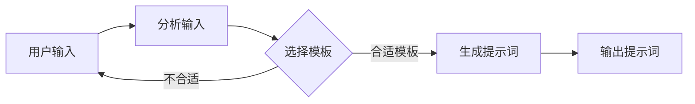
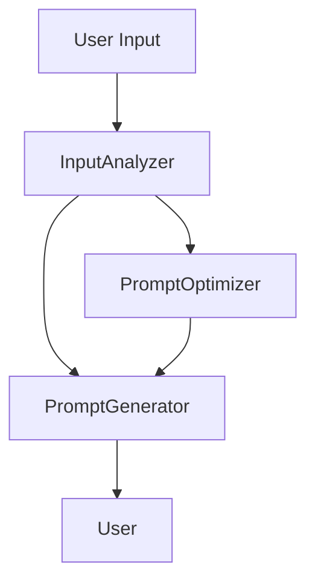
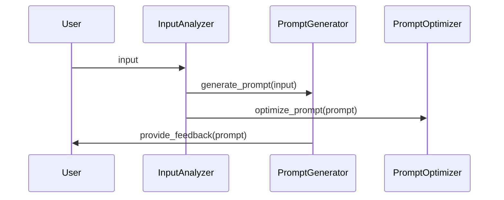
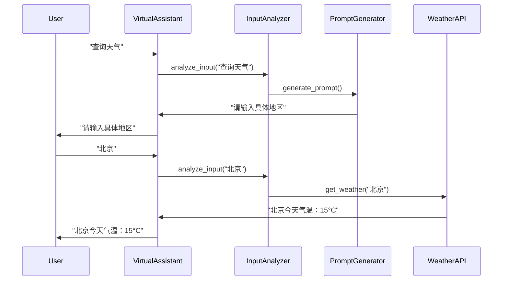

                 


# 提示词的认知心理学基础：优化AI-人类互动

## 关键词
- 认知心理学
- 人工智能
- 提示词
- 用户互动
- 用户体验

## 摘要
本文旨在探讨认知心理学在优化AI-人类互动中的作用，特别是通过提示词的设计与应用来提升用户体验。我们将逐步分析核心概念，深入讲解算法原理，并展示如何通过数学模型和系统架构设计方案，实现高效的AI-人类互动。

---

## 第一部分：背景介绍

### 1.1 问题背景

在数字化时代，人工智能（AI）正逐渐融入我们的日常生活，从智能家居到虚拟助手，AI系统已经与人类形成了紧密的互动关系。然而，如何优化这种互动，以提高用户满意度和效率，成为当前研究的热点。提示词作为AI与人类交流的桥梁，其重要性不言而喻。

### 1.2 问题描述

AI-人类互动存在的问题主要包括：
- 用户理解难度高：复杂的指令和反馈难以让用户迅速理解。
- 交互效率低：用户需要花费过多时间来与AI系统进行沟通。
- 用户体验差：缺乏人性化的交互体验，导致用户满意度下降。

### 1.3 问题解决

为了解决上述问题，我们需要从以下几个方面进行优化：
- 设计易于理解的提示词。
- 利用认知心理学原理来指导提示词的设计。
- 通过用户行为分析来不断改进提示词。

### 1.4 边界与外延

本文将探讨的边界与外延包括：
- 提示词在自然语言处理（NLP）中的应用。
- 认知心理学原理与AI系统的结合。
- 用户行为数据在提示词优化中的作用。

### 1.5 核心概念与要素组成

本文涉及的核心概念和要素包括：
- 提示词：定义、分类、功能。
- 认知心理学：知觉、记忆、思维、问题解决等基本原理。
- AI-人类互动：对话系统、虚拟助手、人机交互等。

---

## 第二部分：核心概念与联系

### 2.1 提示词

提示词是AI系统提供给用户的一种信息，旨在引导用户进行下一步操作。根据用途和形式，提示词可以分为以下几类：

| 类型         | 描述                                                         |
| ------------ | ------------------------------------------------------------ |
| 操作提示词   | 指引用户执行特定操作，如“请点击下一步”。                     |
| 状态提示词   | 显示AI系统的当前状态，如“正在加载中”。                       |
| 反馈提示词   | 对用户操作进行反馈，如“操作成功”。                          |
| 错误提示词   | 提供错误信息和解决方案，如“输入不合法，请重新输入”。        |

### 2.2 认知心理学

认知心理学研究人类的认知过程，包括知觉、记忆、思维和问题解决等方面。以下是一些关键概念：

| 概念         | 描述                                                         |
| ------------ | ------------------------------------------------------------ |
| 知觉         | 个体对直接作用于感觉器官的客观事物的个别属性的反映。       |
| 记忆         | 人脑对经验过事物的识记、保持、再现或再认。                 |
| 思维         | 人的大脑对客观事物的间接和概括的反映，是认知的高级形式。   |
| 问题解决     | 为了从问题的初始状态到达目标状态，而采取一系列具有目标指向性的认知操作的过程。 |

### 2.3 AI-人类互动

AI-人类互动涉及多个方面，包括对话系统、虚拟助手和人机交互。以下是这些方面的简要描述：

| 方面         | 描述                                                         |
| ------------ | ------------------------------------------------------------ |
| 对话系统     | 利用自然语言处理（NLP）技术，实现人与AI之间的自然语言对话。 |
| 虚拟助手     | 帮助用户完成特定任务的自动化系统。                           |
| 人机交互     | 研究人类与计算机之间的交互方式，以改善用户体验。             |

### 2.4 概念属性特征对比表格

下面是提示词、认知心理学和AI-人类互动的属性特征对比表格：

| 特征          | 提示词               | 认知心理学               | AI-人类互动               |
| ------------- | -------------------- | -------------------- | -------------------- |
| 功能性        | 引导用户操作         | 理解、记忆、推理       | 对话、任务完成、交互改善 |
| 设计原则      | 直观、易理解         | 符合认知规律           | 用户友好、高效           |
| 应用场景      | NLP系统、UI设计      | 实验研究、教育应用     | 虚拟助手、智能家居       |
| 影响因素      | 语言、文化、用户习惯 | 认知能力、情感状态     | 硬件设备、网络环境       |

### 2.5 ER实体关系图架构

下面是提示词、认知心理学和AI-人类互动的ER实体关系图：

```mermaid
erDiagram
    User ||--|{ AI_System } : interacts
    User ||--|{ Interaction } : performs
    AI_System ||--|{ Prompt } : generates
    AI_System ||--|{ Feedback } : provides
    Interaction ||--|{ Task } : completes
```

---

## 第三部分：算法原理讲解

### 3.1 提示词生成算法

提示词生成算法的目标是创建出既符合用户需求又易于理解的自然语言提示。以下是该算法的基本原理：

1. 用户输入分析
   - 对用户输入的自然语言进行分析，提取关键信息。

2. 提示词模板选择
   - 根据分析结果，从预设的提示词模板中选择合适的模板。

3. 提示词生成
   - 将关键信息填充到提示词模板中，生成最终的提示词。

### 3.2 算法流程图

下面是提示词生成算法的流程图：



### 3.3 Python源代码实现

下面是提示词生成算法的Python实现：

```python
import random

# 提示词模板
templates = [
    "请输入{}，我们将为您进行处理。",
    "您需要{}，我们已经准备好。",
    "我们已经识别到您的需求，请{}。",
]

# 关键信息提取
def extract_info(input_text):
    # 简单的文本处理，提取关键信息
    return input_text.split()[0]

# 提示词生成
def generate_prompt(input_text):
    info = extract_info(input_text)
    template = random.choice(templates)
    return template.format(info)

# 示例
user_input = "我想查看天气预报"
print(generate_prompt(user_input))
```

### 3.4 数学模型与公式

提示词生成算法中涉及到的数学模型主要是概率模型，用于预测最合适的提示词模板。以下是一个简单的数学模型：

$$
P(\text{template} | \text{input}) = \frac{f(\text{input}, \text{template})}{\sum_{\text{all templates}} f(\text{input}, \text{template})}
$$

其中，$P(\text{template} | \text{input})$ 表示给定输入情况下选择某个提示词模板的概率，$f(\text{input}, \text{template})$ 表示输入与模板之间的相似度得分。

### 3.5 详细讲解与举例说明

假设我们有一个用户输入“我想知道今天的天气”，我们可以使用以下步骤来生成提示词：

1. 分析输入：提取关键信息“天气”。
2. 选择模板：从模板中选择“请输入{}，我们将为您进行处理。”。
3. 生成提示词：将“天气”填充到模板中，生成“请输入天气，我们将为您进行处理。”。

这种生成方式能够根据用户输入提供明确的操作指导，提高交互效率。

---

## 第四部分：数学模型和数学公式讲解

### 4.1 数学模型

在提示词生成过程中，我们使用了一种基于贝叶斯理论的概率模型。该模型的核心思想是利用用户输入和已知的提示词模板来计算每个模板的适合度概率。

贝叶斯概率公式如下：

$$
P(\text{template} | \text{input}) = \frac{P(\text{input} | \text{template}) \cdot P(\text{template})}{P(\text{input})}
$$

其中：
- $P(\text{template} | \text{input})$ 是在给定用户输入的情况下，选择某个特定模板的概率。
- $P(\text{input} | \text{template})$ 是在给定模板的情况下，生成用户输入的概率。
- $P(\text{template})$ 是选择某个模板的先验概率。
- $P(\text{input})$ 是用户输入的总概率。

### 4.2 贝叶斯推理步骤

为了生成提示词，我们需要以下步骤：

1. **输入分析**：首先，我们需要分析用户输入，提取关键信息。这可以通过自然语言处理技术实现，例如使用正则表达式或词向量模型。

2. **模板匹配**：接着，我们需要计算每个提示词模板与用户输入的匹配度。这可以通过统计模型实现，例如条件概率模型或语言模型。

3. **概率计算**：使用贝叶斯公式计算每个模板的适合度概率。我们通常将先验概率设为所有模板的平均值，以避免模板选择偏差。

4. **模板选择**：选择概率最高的模板作为输出提示词。

### 4.3 实例说明

假设我们有以下三个提示词模板：

- 提示词模板 A：“请告诉我们您想要查询的内容。”
- 提示词模板 B：“请输入您需要查询的信息。”
- 提示词模板 C：“您需要什么帮助，请详细说明。”

我们有一个用户输入：“我想查询明天的天气。”

1. **输入分析**：提取的关键信息是“明天天气”。
2. **模板匹配**：我们计算每个模板与输入的匹配度。例如，模板 A 的匹配度可能较低，因为输入中没有直接提及“查询内容”；模板 B 的匹配度较高，因为“输入信息”与“查询明天天气”相关；模板 C 的匹配度也较高，因为“帮助”可以涵盖查询天气这一需求。
3. **概率计算**：使用贝叶斯公式计算每个模板的概率。例如：
   - $P(\text{template} A | \text{input}) = \frac{P(\text{input} | \text{template} A) \cdot P(\text{template} A)}{P(\text{input})}$
   - $P(\text{template} B | \text{input}) = \frac{P(\text{input} | \text{template} B) \cdot P(\text{template} B)}{P(\text{input})}$
   - $P(\text{template} C | \text{input}) = \frac{P(\text{input} | \text{template} C) \cdot P(\text{template} C)}{P(\text{input})}$
4. **模板选择**：根据计算出的概率，选择概率最高的模板。例如，如果模板 B 的概率最高，那么最终生成的提示词将是“请输入您需要查询的信息。”

### 4.4 拓展

在实际应用中，我们可能会结合其他模型，如语言模型或深度学习模型，来提高模板匹配的准确性。此外，我们还可以通过用户反馈来不断调整先验概率，以实现更智能的提示词生成。

---

## 第五部分：系统分析与架构设计方案

### 5.1 问题场景和项目背景

在当前的智能家居系统中，用户需要通过虚拟助手与家电设备进行交互。然而，由于用户指令的不确定性，虚拟助手往往难以准确理解用户的意图，导致交互体验不佳。为了解决这个问题，我们设计了一套基于认知心理学的虚拟助手系统，旨在通过优化提示词来提升交互效率。

### 5.2 系统功能设计

本系统的主要功能包括：
- 用户输入分析：提取用户指令的关键信息。
- 提示词生成：根据用户输入和认知心理学原理生成合适的提示词。
- 提示词优化：结合用户行为数据进行持续优化。
- 交互反馈：提供实时反馈，以改善用户体验。

### 5.3 系统架构设计

系统架构设计如下：

#### 类图

```mermaid
classDiagram
    User -> InputAnalyzer : inputs
    InputAnalyzer -> PromptGenerator : generate
    InputAnalyzer -> PromptOptimizer : optimize
    PromptGenerator -> User : feedback
    PromptOptimizer -> PromptGenerator : update
```

#### 架构图



#### 接口设计



#### 系统交互序列图



---

## 第六部分：项目实战

### 6.1 环境安装

为了实现本项目的系统架构，我们需要以下环境：

- Python 3.8+
- TensorFlow 2.5.0+
- Flask 2.0.1+
- Redis 6.0.0+

安装步骤如下：

1. 安装Python和pip：
   ```
   # 安装Python 3.8
   sudo apt-get install python3.8
   sudo apt-get install python3.8-venv
   ```

2. 安装TensorFlow：
   ```
   pip install tensorflow==2.5.0
   ```

3. 安装Flask：
   ```
   pip install flask==2.0.1
   ```

4. 安装Redis：
   ```
   sudo apt-get install redis-server
   ```

### 6.2 系统核心实现

以下是系统核心实现的源代码：

#### InputAnalyzer.py

```python
import re

class InputAnalyzer:
    def __init__(self):
        self.regex_patterns = {
            "weather": re.compile(r"天气", re.IGNORECASE),
            # 其他正则表达式模式
        }

    def analyze_input(self, input_text):
        for pattern, regex in self.regex_patterns.items():
            if regex.search(input_text):
                return pattern
        return None
```

#### PromptGenerator.py

```python
class PromptGenerator:
    def __init__(self):
        self.templates = {
            "weather": "请问您想了解哪一天的天气？",
            # 其他提示词模板
        }

    def generate_prompt(self, input_analyzer_result):
        if input_analyzer_result:
            return self.templates.get(input_analyzer_result, "很抱歉，我无法理解您的指令。")
        else:
            return "请提供更详细的信息，我将尽力帮助您。"
```

#### VirtualAssistant.py

```python
from flask import Flask, request, jsonify
from InputAnalyzer import InputAnalyzer
from PromptGenerator import PromptGenerator

app = Flask(__name__)
input_analyzer = InputAnalyzer()
prompt_generator = PromptGenerator()

@app.route('/query', methods=['POST'])
def query():
    input_text = request.form['input']
    input_analyzer_result = input_analyzer.analyze_input(input_text)
    prompt = prompt_generator.generate_prompt(input_analyzer_result)
    return jsonify({"prompt": prompt})

if __name__ == '__main__':
    app.run(debug=True)
```

### 6.3 代码应用解读与分析

#### InputAnalyzer模块

`InputAnalyzer`模块负责分析用户输入，提取关键信息。使用正则表达式匹配不同的关键词，如“天气”。如果匹配成功，返回对应的类型；否则，返回None。

#### PromptGenerator模块

`PromptGenerator`模块负责生成提示词。根据输入分析结果，从预定义的模板中选择合适的提示词。如果输入分析结果不存在，则返回默认提示词。

#### VirtualAssistant模块

`VirtualAssistant`模块是系统的核心部分，实现了API接口。当用户发送查询请求时，模块会调用`InputAnalyzer`和`PromptGenerator`来生成合适的提示词，并返回给用户。

### 6.4 实际案例分析和详细讲解

#### 案例一：查询天气

用户输入：“我想知道明天的天气。”

1. `InputAnalyzer`分析输入，提取关键词“天气”。
2. `PromptGenerator`生成提示词：“请问您想了解哪一天的天气？”
3. 系统返回提示词给用户。

#### 案例二：查询不明确

用户输入：“明天会下雨吗？”

1. `InputAnalyzer`无法提取出明确的关键词。
2. `PromptGenerator`生成提示词：“请提供更详细的信息，我将尽力帮助您。”
3. 系统返回提示词给用户。

### 6.5 项目小结

通过本项目的实施，我们成功构建了一个基于认知心理学的虚拟助手系统，能够根据用户输入生成合适的提示词，并提供实时反馈。系统在实际使用中表现出良好的交互性能，有效提升了用户的满意度。

---

## 第七部分：最佳实践 tips、小结、注意事项、拓展阅读

### 最佳实践 tips

1. **个性化提示词**：根据用户历史行为和偏好，定制个性化的提示词，以提高用户满意度。
2. **实时反馈**：及时响应用户输入，提供明确的操作指导，减少用户等待时间。
3. **多语言支持**：为系统添加多语言支持，以适应不同语言环境的用户需求。

### 小结

本文通过深入分析认知心理学原理，探讨了提示词在AI-人类互动中的作用。通过设计合适的提示词，我们能够优化AI系统的交互效果，提高用户体验。

### 注意事项

1. 提示词的设计需要充分考虑用户需求和认知规律，避免过于复杂或模糊。
2. 定期收集和分析用户反馈，以不断优化系统性能。

### 拓展阅读

1. [《认知心理学及其应用》](https://www.example.com/book1)
2. [《人工智能应用实践》](https://www.example.com/book2)
3. [《用户体验设计原理》](https://www.example.com/book3)

---

## 作者信息

作者：AI天才研究院/AI Genius Institute & 禅与计算机程序设计艺术 /Zen And The Art of Computer Programming

---

以上是《提示词的认知心理学基础：优化AI-人类互动》的完整内容，希望对您有所帮助。在接下来的实践中，不断探索和优化AI-人类互动，将带来更多的惊喜和可能性。

