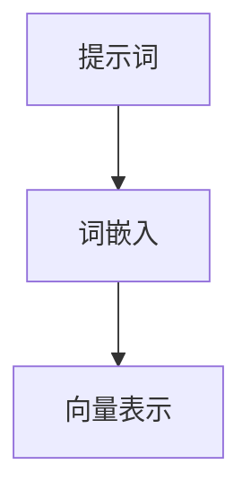
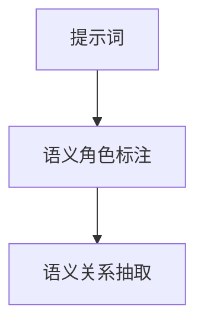
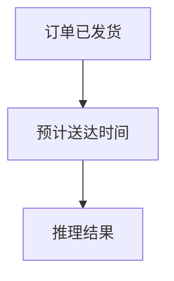
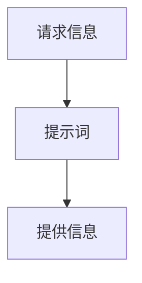
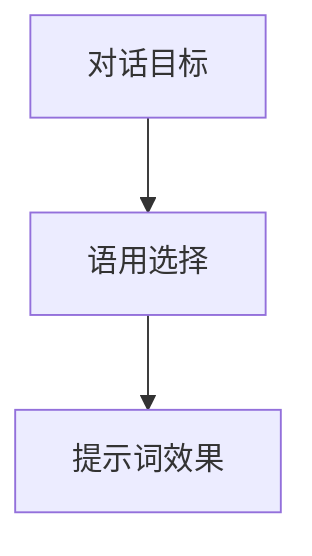
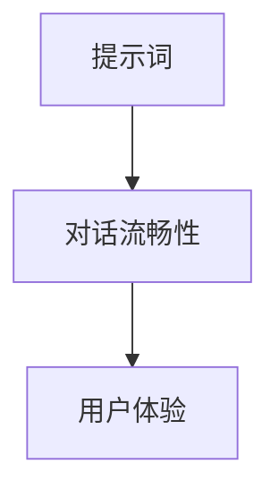
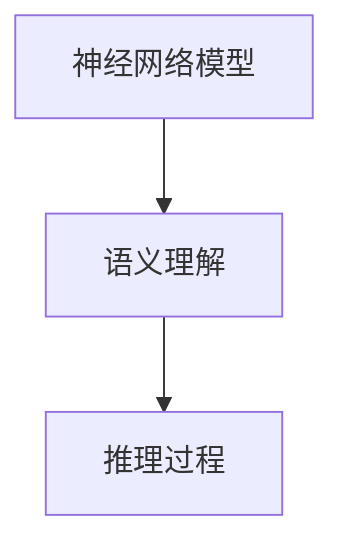
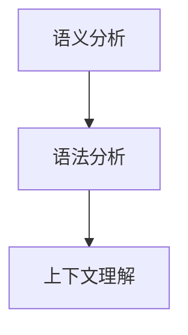
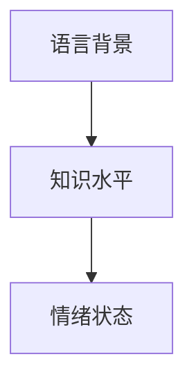

                 

### 第一部分: 提示词的认知语用学基础

#### 1.1 问题背景与核心概念

##### 1.1.1 人机对话体验的现状

在当今数字化时代，人机对话体验已成为用户与企业、产品之间沟通的重要渠道。无论是智能客服、语音助手，还是聊天机器人，提升人机对话的体验已成为各行业关注的焦点。然而，现实中的人机对话存在诸多问题，如语义理解不准确、交互效果差、用户体验不佳等。

##### 1.1.2 提示词在对话中的作用

提示词是人机对话中的人工干预手段，它通过引导对话方向、填补信息空白、优化语义理解等途径，提高人机对话的效率和效果。在自然语言处理（NLP）和人工智能领域，提示词的作用日益凸显。

##### 1.1.3 认知语用学的引入

认知语用学是语言学、心理学和计算机科学交叉的领域，研究语言在认知过程中的作用。将认知语用学引入人机对话研究，有助于从人类认知和语言使用习惯的角度，优化人机对话系统。

#### 1.2 核心概念解释

##### 1.2.1 提示词

提示词是指在对话中，由用户或系统主动提出的引导性语言元素，旨在改善对话质量和效率。它可以是词汇、短语或句子。

##### 1.2.2 认知语用学

认知语用学是研究语言使用过程中的认知和心理机制的科学。它关注语言如何在人类认知中起作用，以及如何影响交流和理解。

##### 1.2.3 人机对话体验

人机对话体验是指用户在使用智能系统进行交互时感受到的整体体验，包括响应速度、语义理解准确度、交互自然度等。

#### 1.3 概念联系与框架

##### 1.3.1 提示词与认知语用学的联系

提示词作为人机对话中的干预手段，其设计与使用需充分考虑用户的认知特点和语言使用习惯，这与认知语用学的研究成果密切相关。

##### 1.3.2 提示词在人机对话中的作用

提示词可以引导对话方向、优化语义理解、填补信息空白，从而提高人机对话的效率和质量。

##### 1.3.3 提示词优化人机对话体验的框架

为了优化人机对话体验，需要从提示词的设计、选择和使用等方面进行系统化研究和实践，形成一个完整的优化框架。

#### 1.4 本章小结

本章介绍了人机对话体验的现状、提示词与认知语用学的核心概念及其联系，并阐述了提示词优化人机对话体验的重要性。接下来的章节将深入探讨提示词的认知语用分析及其在实际应用中的优化方法。

### 第二部分: 提示词的认知语用分析

#### 2.1 提示词的属性特征分析

##### 2.1.1 提示词的语义特征

语义特征是指提示词在对话中所表达的含义。理解提示词的语义特征对于准确理解其意图至关重要。例如，在客服场景中，“订单状态”和“售后服务”这两个提示词的语义特征明显不同。

| 提示词       | 语义特征                                       |
| ------------ | ---------------------------------------------- |
| 订单状态     | 描述订单当前的处理状态                           |
| 售后服务     | 涉及产品售后支持和服务内容                     |

##### 2.1.2 提示词的语法特征

语法特征是指提示词在句子中的结构和作用。语法特征对于构建合理的句子结构和理解句子的层次关系至关重要。例如，疑问代词“谁”和“什么”在句子中的语法作用不同。

| 提示词   | 语法特征                 |
| -------- | ------------------------ |
| 谁       | 用于询问人物身份           |
| 什么     | 用于询问事物或概念的内容       |

##### 2.1.3 提示词的语用特征

语用特征是指提示词在特定语境中的使用方式和效果。语用特征对于理解对话的背景和语境至关重要。例如，礼貌用语“请问”和“您好”在对话中传递的语用意图不同。

| 提示词   | 语用特征                      |
| -------- | ----------------------------- |
| 请问     | 表达询问的礼貌和尊重               |
| 您好     | 表达友好和开始对话的信号           |

#### 2.2 提示词的语义分析

##### 2.2.1 提示词的语义表示

语义表示是指将提示词的含义用计算机可理解的形式表达出来。例如，通过词嵌入技术，将自然语言中的提示词映射到高维空间中的向量。



##### 2.2.2 提示词的语义理解

语义理解是指计算机系统如何理解提示词的含义。这通常涉及语义角色标注、语义关系抽取等技术。



##### 2.2.3 提示词的语义推理

语义推理是指根据已知的提示词语义信息，推断出新的语义信息。例如，从“订单已发货”推断出“预计送达时间”。



#### 2.3 提示词的语用分析

##### 2.3.1 提示词的语用功能

语用功能是指提示词在对话中实现的具体作用。例如，提示词可以用于请求信息、提供信息、发起对话等。



##### 2.3.2 提示词的语用选择

语用选择是指根据对话的语境和目标，选择合适的提示词。语用选择需要考虑语用效果、礼貌程度和对话目标。



##### 2.3.3 提示词的语用效果

语用效果是指提示词在对话中实际产生的影响。例如，一个恰当的提示词可以提高对话的流畅性和用户体验。



#### 2.4 提示词的认知处理

##### 2.4.1 提示词的认知模型

认知模型是指用于描述人类认知过程和语言理解的计算机模型。例如，神经网络模型可以模拟人类的语义理解和推理过程。



##### 2.4.2 提示词的认知过程

认知过程是指人类在处理提示词时的心理活动。这包括语义分析、语法分析、上下文理解等。



##### 2.4.3 提示词的认知影响因素

认知影响因素是指影响人类处理提示词的各种因素。例如，语言背景、知识水平、情绪状态等。



#### 2.5 本章小结

本章对提示词的属性特征、语义分析和语用分析进行了详细讨论，并介绍了认知处理的相关内容。这些分析为理解提示词在对话中的作用及其优化提供了理论基础。接下来的章节将进一步探讨提示词优化人机对话体验的方法与实践。

### 第三部分: 提示词优化人机对话体验的方法与实践

#### 3.1 提示词优化策略

##### 3.1.1 提示词选择的策略

提示词选择是优化人机对话体验的关键步骤。选择合适的提示词需要考虑对话目标、用户需求和对话场景。以下是一些选择策略：

1. **目标导向**：根据对话目标选择最相关的提示词，确保对话紧扣主题。
2. **用户需求**：了解用户的需求和偏好，选择能够满足用户需求的提示词。
3. **场景适配**：根据不同的对话场景，选择适合场景的提示词，提高对话的自然度。

##### 3.1.2 提示词设计的策略

提示词设计是指在对话中创造性地使用提示词，以提升对话的效果。以下是一些设计策略：

1. **多样性**：使用多种类型的提示词，避免单一化，增加对话的丰富性。
2. **连贯性**：确保提示词之间连贯，形成一个流畅的对话流程。
3. **互动性**：设计互动性强的提示词，激发用户的参与感和互动意愿。

##### 3.1.3 提示词优化的策略

提示词优化是指通过不断调整和改进提示词，提高对话体验。以下是一些优化策略：

1. **数据驱动**：基于用户反馈和对话数据，对提示词进行优化，确保其有效性和适用性。
2. **迭代改进**：通过迭代过程，不断测试和优化提示词，逐步提升对话质量。
3. **个性化**：根据用户的个性化需求，定制个性化的提示词，提高用户的满意度。

#### 3.2 提示词优化的算法

##### 3.2.1 提示词优化的数学模型

提示词优化的数学模型主要涉及语义相似度计算、语用效果评估和用户满意度分析。以下是一个简化的数学模型：

$$
\text{优化得分} = f(\text{语义相似度}, \text{语用效果}, \text{用户满意度})
$$

其中，$f$ 是一个综合评估函数，用于计算提示词的优化得分。

##### 3.2.2 提示词优化的算法设计

提示词优化的算法设计包括以下几个方面：

1. **语义相似度计算**：采用词嵌入技术，计算提示词之间的语义相似度。
2. **语用效果评估**：根据对话目标和用户需求，评估提示词的语用效果。
3. **用户满意度分析**：通过用户反馈和行为数据，分析用户对提示词的满意度。

##### 3.2.3 提示词优化的算法实现

提示词优化的算法实现可以使用 Python 进行编程实现。以下是一个简单的算法实现示例：

```python
import numpy as np

def calculate_similarity(words):
    # 计算提示词之间的语义相似度
    pass

def evaluate_pragmatic_effect(words, context):
    # 评估提示词的语用效果
    pass

def analyze_user_satisfaction(words, feedback):
    # 分析用户对提示词的满意度
    pass

def optimize_tip_word(words, context, feedback):
    similarity = calculate_similarity(words)
    pragmatic_effect = evaluate_pragmatic_effect(words, context)
    user_satisfaction = analyze_user_satisfaction(words, feedback)
    score = f(similarity, pragmatic_effect, user_satisfaction)
    return score

# 测试算法
tip_words = ["订单状态", "支付金额"]
context = "您需要查询最近的订单状态"
feedback = "非常满意"

score = optimize_tip_word(tip_words, context, feedback)
print("优化得分：", score)
```

#### 3.3 实际项目实战

##### 3.3.1 项目背景与目标

本项目旨在设计并实现一个基于提示词优化的智能客服系统。目标是通过优化提示词，提升客服对话的效率和质量，提高用户满意度。

##### 3.3.2 系统设计

系统设计包括以下部分：

1. **用户接口**：提供用户与客服系统交互的界面。
2. **语义理解模块**：负责分析用户输入的文本，提取关键信息。
3. **提示词优化模块**：根据语义理解结果，选择最合适的提示词。
4. **对话管理模块**：管理整个对话流程，确保对话的连贯性和自然度。
5. **反馈收集模块**：收集用户反馈，用于后续的优化。

##### 3.3.3 核心代码实现

以下是系统核心代码的简化实现：

```python
# 用户接口
def user_input():
    return input("请输入您的问题：")

# 语义理解模块
def semantic_understanding(input_text):
    # 提取关键信息
    pass

# 提示词优化模块
def tip_word_optimization(semantic_info):
    # 根据语义信息选择提示词
    pass

# 对话管理模块
def dialog_management(user_input, tip_word):
    # 管理对话流程
    pass

# 反馈收集模块
def collect_feedback(user_input, tip_word, response):
    # 收集用户反馈
    pass

# 主程序
def main():
    while True:
        user_input_text = user_input()
        semantic_info = semantic_understanding(user_input_text)
        tip_word = tip_word_optimization(semantic_info)
        response = dialog_management(user_input_text, tip_word)
        collect_feedback(user_input_text, tip_word, response)
        print("客服回复：", response)

if __name__ == "__main__":
    main()
```

##### 3.3.4 案例分析与讲解

以下是一个实际案例：

1. **用户提问**：“我最近一单的订单状态是什么？”

2. **语义理解**：系统提取关键信息“最近一单”和“订单状态”。

3. **提示词优化**：选择“您的订单号是XXXX，当前状态为‘已发货’”。

4. **对话管理**：系统回复用户选择好的提示词，并询问是否有其他问题。

5. **反馈收集**：用户反馈“非常满意”。

通过上述案例，可以看到系统如何通过优化提示词，提升用户满意度。

##### 3.3.5 项目小结

本项目通过设计并实现一个基于提示词优化的智能客服系统，展示了优化人机对话体验的方法和实践。接下来，我们将继续探讨最佳实践、注意事项以及拓展阅读等内容。

#### 3.4 最佳实践与注意事项

##### 3.4.1 提示词优化的最佳实践

1. **用户需求调研**：在优化提示词前，先了解用户的需求和偏好。
2. **数据驱动**：根据用户反馈和对话数据，不断调整和优化提示词。
3. **多轮对话**：在对话中引导用户进行多轮对话，获取更多信息。
4. **个性化定制**：根据用户的个性化需求，定制个性化的提示词。

##### 3.4.2 注意事项

1. **避免过度优化**：过度优化可能导致对话变得机械化，影响用户体验。
2. **文化差异**：在不同文化背景下，提示词的优化策略可能有所不同。
3. **安全性**：确保提示词的设计和使用不会泄露用户隐私。

##### 3.4.3 拓展阅读

1. 《自然语言处理实践》
2. 《人机对话系统设计与实现》
3. 《用户行为分析》

#### 3.5 本章小结

本章介绍了提示词优化策略、算法设计和实际项目实战。通过最佳实践和注意事项的讨论，为优化人机对话体验提供了具体指导。下一章将探讨提示词认知语用学的应用领域和研究前沿。

### 第四部分: 提示词认知语用学应用的拓展与未来展望

#### 4.1 提示词认知语用学的应用领域

##### 4.1.1 在智能客服中的应用

智能客服是提示词认知语用学的重要应用领域之一。通过优化提示词，智能客服系统能够更好地理解用户需求，提供更精准的服务。以下是一些具体应用：

1. **在线客服**：通过优化提示词，提升在线客服的响应速度和准确度。
2. **语音助手**：利用提示词的认知语用特性，提高语音助手的交互自然度和用户满意度。
3. **聊天机器人**：通过提示词的优化，使聊天机器人能够更好地与用户进行自然对话。

##### 4.1.2 在智能助手中的应用

智能助手（如个人助理、智能家居控制等）也是提示词认知语用学的重要应用领域。以下是一些具体应用：

1. **日程管理**：智能助手能够根据用户输入的提示词，准确理解日程安排，并提供提醒和建议。
2. **信息查询**：智能助手能够通过优化提示词，迅速获取用户所需的信息。
3. **任务执行**：智能助手能够根据用户输入的提示词，自动执行相应的任务。

##### 4.1.3 在教育中的应用

在教育领域，提示词认知语用学也有广泛应用。以下是一些具体应用：

1. **在线教育平台**：通过优化提示词，提高在线教育平台的用户体验和教学效果。
2. **智能辅导系统**：智能辅导系统能够根据学生的提问，提供个性化的辅导和建议。
3. **教育机器人**：教育机器人能够通过与学生的互动，提高学生的学习兴趣和效果。

#### 4.2 提示词认知语用学的研究前沿

##### 4.2.1 研究现状与进展

近年来，随着人工智能和自然语言处理技术的快速发展，提示词认知语用学领域取得了显著进展。以下是一些研究现状：

1. **语义理解**：通过词嵌入、语义角色标注等技术，对提示词进行深入语义理解。
2. **语用推理**：利用上下文信息，对提示词进行语用推理，提高对话的连贯性和自然度。
3. **用户满意度分析**：通过用户行为数据和反馈，分析用户对提示词的满意度，指导优化策略。

##### 4.2.2 研究趋势与方向

未来，提示词认知语用学领域将继续朝着以下方向发展：

1. **多模态交互**：结合语音、图像等多种模态，提高人机对话的自然度和效果。
2. **情感计算**：通过情感计算技术，更好地理解用户的情感状态，提供更个性化的服务。
3. **知识图谱**：利用知识图谱技术，构建丰富的语义知识库，提高提示词的语义理解能力。

##### 4.2.3 未来展望

随着人工智能技术的不断进步，提示词认知语用学将在更多领域得到应用。未来，人机对话将更加自然、高效和个性化。以下是一些展望：

1. **个性化对话**：通过深度学习等技术，实现高度个性化的对话体验。
2. **智能决策**：结合大数据分析，为用户提供智能决策支持。
3. **跨领域应用**：在医疗、金融、法律等更多领域实现提示词认知语用学的应用。

#### 4.3 拓展阅读与参考资料

##### 4.3.1 相关书籍推荐

1. 《认知语用学导论》
2. 《自然语言处理综合教程》
3. 《深度学习与自然语言处理》

##### 4.3.2 学术论文精选

1. “Cognitive Pragmatics and Human-Computer Interaction”
2. “A Survey of Sentiment Analysis Methods”
3. “Multimodal Interaction in Human-Computer Dialogue”

##### 4.3.3 实践指南与工具

1. “NLTK：自然语言处理工具包”
2. “spaCy：高效自然语言处理库”
3. “TensorFlow：深度学习框架”

#### 4.4 本章小结

本章介绍了提示词认知语用学的应用领域和研究前沿，探讨了未来发展的趋势和展望。通过拓展阅读与参考资料，为读者提供了深入了解这一领域的途径。下一章将总结全书，并展望未来研究方向。

### 总结与展望

本文从提示词的认知语用学出发，系统地探讨了人机对话体验的优化方法。通过分析提示词的属性特征、语义分析和语用分析，我们明确了提示词在人机对话中的关键作用。同时，本文还介绍了提示词优化策略、算法设计以及实际项目实战，为提升人机对话体验提供了具体实践指导。

未来，随着人工智能和自然语言处理技术的不断进步，提示词认知语用学将在更多领域得到应用。我们期待更多学者和研究者在这一领域进行深入探索，推动人机对话体验的持续优化。

### 附录

本文的附录部分包含以下内容：

1. **术语表**：对文中出现的专业术语进行解释。
2. **参考文献**：列出本文引用的主要参考文献。
3. **代码实现**：提供本文相关算法的代码实现示例。

### 作者信息

**作者：AI天才研究院/AI Genius Institute & 禅与计算机程序设计艺术 /Zen And The Art of Computer Programming**

