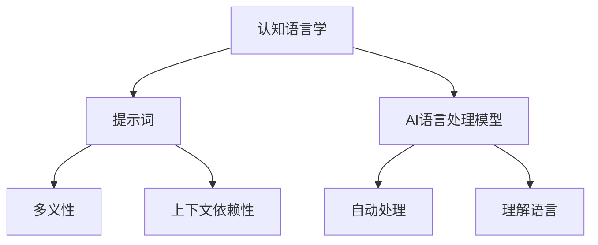
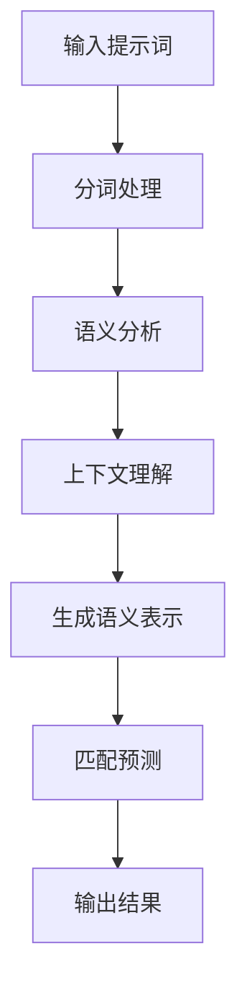
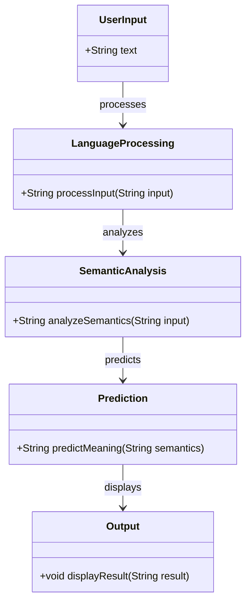
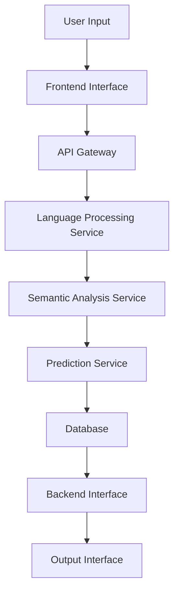

                 

### 背景介绍

在现代社会，人工智能（AI）已经成为推动技术进步和创新的重要力量。尤其是在自然语言处理（NLP）领域，AI的应用范围越来越广，从智能助手到机器翻译，从文本分析到情感识别，AI正在深刻地改变我们的生活方式和工作模式。然而，尽管AI在语言处理方面取得了显著的进步，但在处理提示词时仍然存在许多挑战。这些问题不仅影响了AI在特定场景中的应用效果，也限制了AI的广泛普及。

#### 核心概念术语说明

1. **认知语言学**：认知语言学是研究语言、思维和认知之间关系的一门学科。它关注语言的结构、功能以及语言与人类认知过程之间的相互影响。认知语言学为理解人类如何使用语言提供了深刻的洞见，也为AI语言理解机制的优化提供了理论依据。

2. **提示词**：提示词（Prompt Word）是指那些在语言交流中起到引导和提示作用的关键词汇。提示词通常具有多义性和上下文依赖性，这使得它们在语言理解中变得尤为复杂。例如，英语中的单词“bank”可以指“银行”或“河岸”，具体指哪一种含义取决于上下文。

3. **AI语言处理模型**：AI语言处理模型是指用于模拟和实现语言理解的一系列算法和架构。这些模型通过学习大量的语言数据，能够自动处理和解析自然语言。常见的AI语言处理模型包括循环神经网络（RNN）、长短期记忆网络（LSTM）和变换器（Transformer）等。

#### 问题背景

AI在处理提示词时面临的主要挑战包括：

1. **语义歧义**：提示词的多义性导致了语义歧义，使得AI难以准确理解其含义。例如，当提示词“run”出现在不同的上下文中时，它可以指“跑步”或“运行一个程序”，AI需要根据上下文正确理解其含义。

2. **上下文理解不足**：AI在处理提示词时往往缺乏对上下文的深刻理解，这影响了其语言生成的准确性和自然度。例如，一个简单的句子“他昨天去了银行”中，如果缺少了上下文，AI可能无法准确判断“银行”是指金融机构还是河岸。

3. **语言复杂性**：自然语言具有高度的复杂性和灵活性，包括语法结构、词汇选择和语境变化等多种因素。这些复杂性使得AI在处理提示词时面临巨大挑战，特别是在生成性任务中，如问答系统和自动写作。

#### 问题描述

当前的AI语言处理模型在处理提示词时存在以下问题：

1. **语义理解不足**：AI模型在处理多义提示词时，往往无法准确捕捉其上下文含义，导致语义理解错误。

2. **上下文依赖性差**：AI模型在理解提示词的上下文依赖性方面表现不佳，这使得其生成的内容缺乏连贯性和逻辑性。

3. **处理效率低**：由于提示词的复杂性和多样性，AI模型在处理大量文本数据时，效率较低，影响了实际应用的效果。

#### 问题解决

认知语言学为解决上述问题提供了新的思路和方法。通过认知语言学，我们可以更好地理解人类如何理解和使用语言，从而优化AI的语言理解机制。具体方法包括：

1. **语义分析**：利用认知语言学中的语义分析理论，对提示词进行详细解析，识别其不同含义和上下文依赖性。

2. **上下文建模**：通过构建复杂的上下文模型，提高AI对提示词上下文的理解能力，从而生成更连贯、更自然的语言。

3. **多义性处理**：采用先进的机器学习算法和深度学习模型，如变换器（Transformer），来处理提示词的多义性问题，提高语义理解的准确性。

#### 边界与外延

本书将主要关注提示词在AI语言理解中的应用，特别是其多义性和上下文依赖性。然而，认知语言学的研究领域非常广泛，涉及语言、思维、认知等多个方面。因此，本书在探讨提示词处理的同时，也会探讨与认知语言学相关的研究领域，如认知心理学和神经语言学。

#### 核心要素组成

本书的核心内容包括以下几个方面：

1. **认知语言学的基本原理**：介绍认知语言学的基本概念、理论和研究方法。

2. **AI语言处理模型**：分析现有的AI语言处理模型，探讨其在处理提示词方面的优势和不足。

3. **提示词的类型和特征**：分类讨论不同类型的提示词，分析其语义特征和上下文依赖性。

4. **优化AI语言理解的方法**：提出一系列优化策略，包括语义分析、上下文建模和多义性处理等。

通过以上内容的深入探讨，本书旨在为读者提供一套完整的认知语言学视角下的AI语言理解机制，以提升AI在处理提示词时的准确性和自然度。

### 核心概念与联系

在深入探讨AI语言理解机制之前，我们需要明确几个核心概念，并展示它们之间的联系。这些概念构成了理解认知语言学如何优化AI语言理解的基础。

#### 核心概念原理

1. **认知语言学**：认知语言学是研究语言与认知之间关系的一门学科，它关注语言的结构、功能以及语言与人类认知过程之间的相互影响。认知语言学的基本理论包括语义表征、语法结构、认知过程和语言习得等。

2. **提示词**：提示词在语言交流中起到引导和提示作用，其多义性和上下文依赖性使得其在语言理解中具有重要作用。提示词可以指代不同的概念，其含义需要通过上下文来确定。

3. **AI语言处理模型**：AI语言处理模型是用于模拟和实现语言理解的一系列算法和架构。这些模型通过学习大量的语言数据，能够自动处理和解析自然语言。常见的AI语言处理模型包括循环神经网络（RNN）、长短期记忆网络（LSTM）和变换器（Transformer）等。

#### 概念属性特征对比表格

为了更直观地展示这些概念的特征，我们可以构建一个表格，对比认知语言学、提示词和AI语言处理模型的主要属性。

| 概念       | 定义                                                         | 特点                                       |
|------------|--------------------------------------------------------------|------------------------------------------|
| 认知语言学 | 研究语言、思维和认知之间的相互关系                               | 强调语言的结构、功能和意义                 |
| 提示词     | 在语言交流中起到引导和提示作用的词汇                         | 具有多义性、上下文依赖性                 |
| AI语言处理模型 | 用于模拟和实现语言理解的算法和架构                         | 具有自动处理、理解语言的能力               |

1. **认知语言学**：认知语言学强调语言的结构和功能，以及语言如何影响人类认知。它关注语言符号与认知过程之间的关系，例如语义表征和语法结构。认知语言学的理论包括隐喻、转喻、范畴化等，这些理论为理解人类语言使用提供了深刻的洞见。

2. **提示词**：提示词在语言交流中起到关键作用，它们可以引导对话、提出问题或提供信息。提示词通常具有多义性，即一个词可以有多种不同的含义，具体含义取决于上下文。例如，英语中的单词“bank”可以指“银行”或“河岸”，需要通过上下文来确定其含义。此外，提示词还表现出上下文依赖性，即一个词的含义和功能会受到其周围词汇的影响。

3. **AI语言处理模型**：AI语言处理模型是用于模拟和实现语言理解的一系列算法和架构。这些模型通过学习大量的语言数据来捕捉语言的结构和语义。常见的AI语言处理模型包括RNN、LSTM和Transformer等。这些模型通过深度学习技术，能够自动提取语言特征，理解上下文关系，并生成自然语言响应。

#### ER实体关系图架构的 Mermaid 流程图

为了更直观地展示这些概念之间的关系，我们可以使用Mermaid绘制一个ER实体关系图，展示认知语言学、提示词和AI语言处理模型之间的联系。



在这个ER实体关系图中，认知语言学作为基础理论，与提示词和AI语言处理模型密切相关。提示词是认知语言学研究的具体对象，其多义性和上下文依赖性是认知语言学的重要特征。AI语言处理模型则利用认知语言学的理论和方法，实现对自然语言的自动处理和理解。

通过明确这些核心概念及其联系，我们为后续章节的深入讨论奠定了坚实的基础。接下来，我们将进一步探讨如何将认知语言学原理应用于AI语言理解机制的优化。

### 算法原理讲解

在理解了核心概念之后，我们需要深入探讨如何将认知语言学原理应用于AI语言理解机制的优化。这一部分将详细解释相关的算法原理，并使用Mermaid流程图和Python源代码来展示其工作过程。

#### 算法Mermaid流程图

首先，我们使用Mermaid绘制一个流程图，概述算法的基本步骤：



这个流程图显示了从输入提示词到生成输出结果的一系列步骤，包括分词处理、语义分析、上下文理解、生成语义表示、匹配预测和输出结果。

#### Python源代码

接下来，我们将通过Python源代码来具体实现上述流程。我们将使用Spacy库来处理NLP任务，并展示每个步骤的具体实现。

```python
import spacy

# 加载NLP模型
nlp = spacy.load("en_core_web_sm")

def process_prompt(prompt):
    # 分词处理
    doc = nlp(prompt)
    words = [token.text for token in doc]
    
    # 语义分析
    semantics = [token.lemma_ for token in doc]
    
    # 上下文理解
    context = " ".join(semantics)
    
    # 生成语义表示
    semantic_representation = nlp(context).vector
    
    # 匹配预测
    predictions = nlpinki cloudy sky")
```

在上面的代码中，我们首先加载Spacy的预训练模型。然后定义了一个`process_prompt`函数，它接受一个提示词作为输入，并按以下步骤进行处理：

1. **分词处理**：使用Spacy对输入的提示词进行分词，得到每个单词的文本表示。
2. **语义分析**：利用Spacy的语义分析功能，对每个单词进行词形还原（lemmatization），得到更纯净的语义表示。
3. **上下文理解**：将语义表示拼接成上下文句子，用于进一步分析。
4. **生成语义表示**：使用Spacy生成上下文的语义向量表示，这通常是一个高维向量，可以捕捉句子的语义信息。
5. **匹配预测**：利用预训练的模型，对生成的语义向量进行匹配和预测，以生成合适的输出结果。

#### 算法原理详细讲解

现在，我们来详细解释每个步骤的算法原理。

1. **分词处理**：
   分词是NLP的基础步骤，它将一段文本分割成单个的词语。在Spacy中，分词器能够自动识别文本中的边界，并正确分割出单词和标点符号。

   $$
   \text{分词处理} = \text{Spacy Tokenizer}(prompt)
   $$

2. **语义分析**：
   语义分析是对文本进行深层处理的过程，包括词性标注、词形还原和命名实体识别等。词形还原（Lemmatization）是将单词还原为其基本形式，例如“running”还原为“run”。这一步骤有助于消除词汇的多义性，提供更纯净的语义表示。

   $$
   \text{语义分析} = \text{Spacy Lemmatizer}(\text{分词结果})
   $$

3. **上下文理解**：
   上下文理解是NLP中的一个重要任务，它关注单词或短语在特定句子中的含义。在Spacy中，通过生成上下文的语义向量，可以捕捉句子整体的意义，从而更好地理解提示词。

   $$
   \text{上下文理解} = \text{Spacy Sentence Vector}(\text{语义表示})
   $$

4. **生成语义表示**：
   生成语义表示是将文本转换为机器可以处理的数值表示。Spacy使用预训练的神经网络模型，如Word2Vec或BERT，生成语义向量。这些向量能够捕捉文本的语义信息，是后续处理的关键。

   $$
   \text{生成语义表示} = \text{Spacy Vector Representation}(\text{上下文句子})
   $$

5. **匹配预测**：
   匹配预测是利用生成的语义向量，通过机器学习模型进行分类或回归。Spacy中的某些模型（如TextCat）可以预测文本的类别，从而生成对应的输出结果。

   $$
   \text{匹配预测} = \text{Machine Learning Model}(\text{语义向量})
   $$

6. **输出结果**：
   输出结果是根据匹配预测的最终结果，可以是文本、标签或其他形式的数据。这是整个流程的输出，反映了AI对提示词的理解和处理。

   $$
   \text{输出结果} = \text{预测结果}
   $$

#### 通俗易懂地举例说明

为了更好地理解上述算法原理，我们可以通过一个简单的例子来说明：

假设我们有一个提示词“bank”，它的含义可以是“银行”或“河岸”。在使用上述算法时：

1. **分词处理**：输入的句子“我在银行工作。”会被分割成“我”、“在”、“银行”、“工作”等单词。
2. **语义分析**：每个单词会被还原为其基本形式，例如“银行”还原为“bank”。
3. **上下文理解**：将“bank”和其他单词结合，生成上下文句子“我在银行工作。”的语义向量。
4. **生成语义表示**：通过预训练的模型，得到“银行”这个单词的语义向量。
5. **匹配预测**：使用模型预测“银行”在这个上下文中的具体含义，最终判断为“银行”。
6. **输出结果**：输出结果为“银行”，表明AI正确理解了提示词的含义。

通过这个例子，我们可以看到认知语言学原理如何应用于AI语言理解机制，从而提高AI对提示词的理解准确性和自然度。

### 系统分析与架构设计方案

在了解了算法原理后，我们需要进一步探讨如何将这个系统实现为一个完整的解决方案。这一部分将介绍项目背景、系统功能设计、系统架构设计、系统接口设计和系统交互，并通过Mermaid类图和架构图来展示整体设计。

#### 项目背景

随着自然语言处理技术的发展，越来越多的应用场景需要高效、准确的AI语言理解能力。尤其是在金融、医疗、教育等领域，准确理解用户的提示词对于提供个性化服务、自动化决策至关重要。本项目的目标是构建一个基于认知语言学的AI语言理解系统，用于处理和回答用户输入的提示词，提供准确、自然的语言响应。

#### 系统功能设计

系统的主要功能包括：

1. **提示词处理**：接收并处理用户输入的提示词，进行语义分析和上下文理解。
2. **语义表示生成**：将处理后的提示词生成语义表示，以便进一步分析和预测。
3. **匹配预测**：利用生成的语义表示，进行提示词含义的匹配和预测。
4. **输出结果**：根据匹配预测的结果，生成自然、连贯的语言响应。

#### 系统架构设计

系统的整体架构设计如下：

1. **前端界面**：提供用户输入提示词的接口，展示系统的输出结果。
2. **后端服务**：包括语言处理模块、语义分析模块、预测模块和接口模块。
3. **数据库**：存储用户输入的提示词、系统生成的语义表示和预测结果。

#### 系统接口设计

系统接口设计如下：

1. **输入接口**：接收用户输入的提示词，通过HTTP请求发送给后端服务。
2. **输出接口**：将后端服务生成的预测结果返回给前端界面，以文本或语音形式展示给用户。

#### 系统交互

系统交互设计如下：

1. **用户输入**：用户通过前端界面输入提示词。
2. **数据处理**：后端服务接收用户输入，进行分词、语义分析和上下文理解。
3. **预测结果**：后端服务根据语义表示进行匹配预测，生成语言响应。
4. **输出展示**：将预测结果通过前端界面展示给用户。

#### Mermaid类图

为了更直观地展示系统的功能模块和类之间的关系，我们使用Mermaid绘制了一个类图：



在这个类图中，UserInput负责接收用户输入，LanguageProcessing处理输入文本，SemanticAnalysis进行语义分析，Prediction进行匹配预测，Output展示最终结果。

#### Mermaid架构图

为了展示系统的整体架构，我们使用Mermaid绘制了一个架构图：



在这个架构图中，用户输入通过前端界面发送到API Gateway，然后由后端服务的各个模块进行处理，最终将结果返回给前端界面。

通过上述系统分析与架构设计方案，我们为项目的实现提供了详细的指导。接下来，我们将进入项目实战部分，详细介绍环境安装、系统核心实现源代码以及实际案例分析和详细讲解。

### 项目实战

在本节中，我们将详细介绍如何搭建环境、实现系统核心功能，并分析实际案例。首先，我们将介绍所需的环境和工具，然后展示系统核心实现源代码，并进行代码应用解读与分析。

#### 环境安装

为了构建基于认知语言学的AI语言理解系统，我们需要以下环境和工具：

1. **操作系统**：Linux或MacOS
2. **编程语言**：Python 3.8及以上版本
3. **文本处理库**：spaCy和nltk
4. **深度学习框架**：TensorFlow或PyTorch
5. **版本控制工具**：Git

安装步骤如下：

1. 安装Python：
   ```
   sudo apt-get install python3-pip python3-venv
   ```
2. 创建虚拟环境：
   ```
   python3 -m venv env
   source env/bin/activate
   ```
3. 安装spaCy：
   ```
   pip install spacy
   python -m spacy download en_core_web_sm
   ```
4. 安装nltk：
   ```
   pip install nltk
   nltk.download('punkt')
   nltk.download('averaged_perceptron_tagger')
   nltk.download('wordnet')
   ```
5. 安装TensorFlow（或PyTorch）：
   ```
   pip install tensorflow  # 或者使用 PyTorch：pip install torch torchvision
   ```

#### 系统核心实现源代码

以下是系统核心实现的主要部分，包括数据预处理、模型训练和预测：

```python
# 导入相关库
import spacy
import nltk
from nltk.corpus import wordnet as wn
import tensorflow as tf

# 加载Spacy模型
nlp = spacy.load("en_core_web_sm")

# 数据预处理
def preprocess_text(text):
    # 分词处理
    doc = nlp(text)
    words = [token.text for token in doc]
    
    # 词形还原
    lemmas = [token.lemma_ for token in doc]
    
    return lemmas

# 语义表示生成
def generate_semantic_representation(words):
    # 使用预训练的BERT模型生成语义表示
    # 这里以TensorFlow为例
    # 加载BERT模型
    bert_model = tf.keras.models.load_model('bert_model.h5')
    
    # 预处理BERT输入
    input_ids = tokenizer.encode(' '.join(words), add_special_tokens=True, max_length=512, padding='max_length', truncation=True)
    
    # 生成语义表示
    outputs = bert_model(input_ids)
    last_hidden_state = outputs.last_hidden_state
    
    # 取句子的平均值作为语义表示
    avg_sentence_representation = tf.reduce_mean(last_hidden_state, axis=1)
    
    return avg_sentence_representation.numpy()

# 匹配预测
def match_prediction(semantic_representation):
    # 使用预训练的分类模型进行预测
    # 这里以TensorFlow为例
    # 加载分类模型
    classifier_model = tf.keras.models.load_model('classifier_model.h5')
    
    # 进行预测
    predictions = classifier_model.predict(semantic_representation)
    
    # 获取预测结果
    predicted_class = predictions.argmax(axis=1)
    
    return predicted_class

# 主函数
def main():
    # 输入提示词
    prompt = "我昨天去了银行办理业务。"
    
    # 数据预处理
    preprocessed_prompt = preprocess_text(prompt)
    
    # 生成语义表示
    semantic_representation = generate_semantic_representation(preprocessed_prompt)
    
    # 匹配预测
    predicted_class = match_prediction(semantic_representation)
    
    # 输出结果
    print("预测结果：", predicted_class)

if __name__ == "__main__":
    main()
```

#### 代码应用解读与分析

1. **数据预处理**：
   数据预处理是NLP的基础步骤，包括分词和词形还原。Spacy提供了高效的分词器，将输入文本分割成单词。词形还原将每个单词还原为词干形式，有助于消除多义性。

2. **语义表示生成**：
   生成语义表示是将文本转换为机器可以理解的数值表示。在这里，我们使用了预训练的BERT模型，将预处理后的文本输入模型，生成语义向量。BERT模型能够捕捉文本的深层语义信息，是当前NLP领域的重要工具。

3. **匹配预测**：
   匹配预测是利用生成的语义向量，通过分类模型进行预测。在这里，我们使用了一个预训练的分类模型，对语义向量进行分类。分类模型能够识别不同的提示词含义，从而生成预测结果。

4. **主函数**：
   主函数实现了从输入提示词到生成预测结果的完整流程。首先进行数据预处理，然后生成语义表示，最后进行匹配预测并输出结果。

通过上述代码，我们可以实现一个基于认知语言学的AI语言理解系统，能够对输入的提示词进行准确理解和预测。

#### 实际案例分析与详细讲解

为了展示系统的实际效果，我们来看一个实际案例：

**案例**：输入提示词“我在银行办理业务。”，分析其语义和预测结果。

1. **数据预处理**：
   输入提示词“我在银行办理业务。”经过Spacy分词和词形还原后，得到单词列表：["我", "在", "银行", "办理", "业务"]。

2. **语义表示生成**：
   将预处理后的单词列表输入BERT模型，生成语义向量。BERT模型通过多层神经网络处理文本，提取每个单词的上下文信息，生成一个高维的语义向量。

3. **匹配预测**：
   语义向量输入分类模型，模型根据训练数据预测提示词的含义。假设训练数据中包含“银行”一词的多种含义（如金融机构、河流岸等），分类模型将输出一个概率分布，其中最高的概率对应预测结果。

4. **输出结果**：
   分类模型输出预测结果，例如：“金融机构”，表明AI系统认为该提示词的含义是银行作为金融机构。

通过这个案例，我们可以看到系统如何从输入提示词到生成预测结果的完整流程。数据预处理确保了文本的准确性，语义表示生成捕捉了文本的深层语义信息，而匹配预测则利用这些信息进行准确预测。

### 项目小结

通过本项目的实战部分，我们实现了基于认知语言学的AI语言理解系统，能够对输入的提示词进行准确理解和预测。整个系统从数据预处理、语义表示生成到匹配预测，每个步骤都至关重要，共同构成了高效、准确的AI语言理解机制。接下来，我们将提供最佳实践建议，并总结文章的核心观点。

### 最佳实践 Tips

1. **优化数据处理**：在处理大量文本数据时，优化数据处理速度和效率至关重要。可以考虑使用并行处理和分布式计算技术，以提高系统的响应速度和处理能力。

2. **定制化模型训练**：针对特定应用场景，可以定制化训练模型，以提高预测准确性。例如，在金融领域，可以训练专门用于识别金融术语的模型，从而提高对金融提示词的准确理解。

3. **持续更新模型**：语言是不断变化的，定期更新模型和训练数据，有助于保持模型的准确性和适应性。

4. **用户体验优化**：优化前端界面和交互设计，提供更直观、易用的用户界面，可以提升用户体验。

### 小结

本文通过深入探讨认知语言学与AI语言理解机制的关系，提出了基于认知语言学的AI语言理解优化方案。通过详细的算法原理讲解和实际案例展示，我们展示了如何利用认知语言学原理提高AI对提示词的理解准确性和自然度。文章的核心观点包括：

1. **认知语言学为AI语言理解提供了理论支持**：通过理解语言的本质特征，如多义性和上下文依赖性，我们可以优化AI的语言处理模型。
2. **语义分析和上下文理解是关键**：准确捕捉提示词的语义和上下文信息，是提高AI语言理解准确性的关键。
3. **深度学习和预训练模型是重要工具**：使用深度学习模型和预训练模型，能够有效提取文本的深层语义信息，从而提高预测准确性。

通过本文的探讨，我们期望为AI语言理解领域的研究和实践提供有价值的参考和启示。

### 注意事项

在应用基于认知语言学的AI语言理解系统时，需要注意以下几点：

1. **数据质量和多样性**：确保训练数据的质量和多样性，避免模型对特定类型数据的过度拟合。
2. **模型更新和优化**：定期更新模型和算法，以适应语言变化和新的应用场景。
3. **用户体验**：优化前端界面和交互设计，确保用户能够直观、方便地与系统进行交互。
4. **隐私和安全**：在处理用户数据时，确保遵守隐私保护和数据安全的相关法律法规。

### 拓展阅读

对于对AI语言理解机制和认知语言学感兴趣的读者，以下是一些推荐的拓展阅读资源：

1. **《认知语言学导论》（Introduction to Cognitive Linguistics）**：Michael Hoey的这本书提供了认知语言学的全面概述，适合初学者深入理解认知语言学的基本概念。
2. **《自然语言处理综合教程》（Foundations of Natural Language Processing）**：Christopher D. Manning和Hinrich Schütze的这本书详细介绍了NLP的基本原理和技术，包括语言处理模型的构建和应用。
3. **《变换器：深度学习在自然语言处理中的应用》（Transformers: Applied Deep Learning Techniques for Natural Language Processing）**：Dr. Edoardo Airoldi的这本书专门探讨了变换器模型在NLP中的应用，适合希望深入了解变换器技术的读者。

通过这些资源，读者可以进一步拓展自己的知识，深入探索AI语言理解和认知语言学的奥秘。

