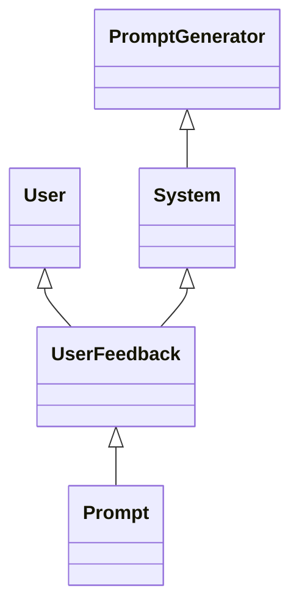
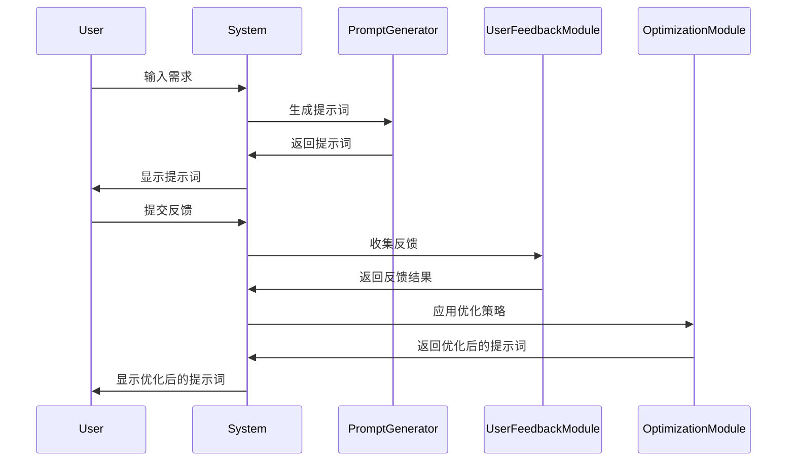

                 

# 《提示词的语用学与人机交互设计的结合》

## 关键词

- 提示词
- 语用学
- 人机交互设计
- 用户需求
- 优化策略
- 算法
- 系统架构

## 摘要

本文旨在探讨提示词的语用学与人机交互设计的结合，通过深入分析提示词在人机交互中的重要性，以及语用学在提升人机交互效果中的应用，提出一种基于语用学的提示词优化算法。文章首先介绍了相关背景和核心概念，随后详细阐述了算法原理和系统架构设计，并通过实际案例分析验证了该算法的有效性。文章最后提出了最佳实践和建议，为优化人机交互提供了有益参考。

### 第一部分：背景介绍

## 1. 引言

### 1.1 问题背景

在人机交互领域，提示词作为一种重要的交互元素，被广泛应用于各种界面设计，如操作系统、应用程序、网站等。它们旨在帮助用户理解系统功能，指导用户进行操作，提高交互效率。然而，当前许多提示词设计存在以下问题：

- **设计与用户需求不匹配**：提示词未能准确捕捉用户意图，导致用户无法理解系统功能。
- **语义模糊**：提示词表述不清，导致用户产生误解。
- **不够友好**：提示词缺乏人性化，缺乏情感关怀，降低用户满意度。

### 1.2 提示词的语用学特点

语用学是研究语言在具体语境中的使用和意义的学科。提示词作为一种语言元素，具有以下语用学特点：

- **指示性**：提示词应指向具体的操作或功能。
- **明确性**：提示词应具备明确的语义，避免模糊性。
- **简洁性**：提示词应简明扼要，避免冗长。

### 1.3 问题描述

当前人机交互设计中，提示词的问题主要体现在以下几个方面：

- **提示词设计不充分**：缺乏系统性的设计原则和策略。
- **用户反馈不足**：用户对提示词的反馈未能充分反映在实际设计中。
- **个性化不足**：提示词设计缺乏个性化，无法满足不同用户的需求。

### 1.4 问题解决

为了解决上述问题，我们需要从以下几个方面入手：

- **明确设计原则**：建立一套科学合理的提示词设计原则。
- **优化策略与方法**：通过算法优化，提升提示词的准确性和友好性。
- **用户反馈机制**：建立用户反馈机制，持续优化提示词设计。

### 1.5 边界与外延

提示词的应用领域广泛，包括但不限于：

- **操作系统界面**：如Windows、macOS等。
- **应用程序界面**：如Office套件、图形设计软件等。
- **网站与移动应用**：如电商网站、社交媒体等。

在不同领域，提示词的设计原则和策略存在差异，需要根据具体应用场景进行定制化设计。

### 1.6 概念结构与核心要素组成

本文涉及的关键概念包括：

- **提示词**：作为人机交互的重要元素，具有指示性、明确性和简洁性等特点。
- **语用学**：研究语言在具体语境中的使用和意义，对提升人机交互效果具有指导意义。
- **人机交互设计**：涉及提示词设计的整体过程，包括需求分析、设计原则、优化策略等。

核心要素包括：

- **设计原则**：指导提示词设计的理论依据。
- **优化策略**：提升提示词质量和用户体验的具体方法。
- **算法**：用于实现提示词优化的数学模型和计算方法。
- **系统架构**：提示词优化系统的整体设计，包括功能模块、接口设计和交互流程。

### 第一部分总结

本部分介绍了本文的背景和核心概念，明确了提示词在人机交互设计中的重要性，以及语用学在提升交互效果中的应用。通过分析提示词设计中的问题，提出了优化策略和方法，并探讨了提示词应用领域的边界与外延。这些为后续内容提供了基础和参考。

### 第二部分：核心概念与联系

## 2. 核心概念原理

### 2.1 提示词

#### 2.1.1 提示词的定义

提示词是指在用户界面中，为引导用户进行操作或提供信息而设置的文本或标记。它具有以下属性特征：

- **指示性**：明确指向特定的操作或功能。
- **明确性**：语义清晰，避免模糊性。
- **简洁性**：表述简洁，易于理解。

#### 2.1.2 提示词的属性特征

提示词的属性特征包括：

- **语义性**：提示词应具备明确的语义，帮助用户理解系统功能。
- **功能性**：提示词应具备实际功能，引导用户进行操作。
- **用户友好性**：提示词应易于用户理解，提高交互体验。

### 2.2 语用学

#### 2.2.1 语用学的定义

语用学是语言学的一个分支，研究语言在实际使用中的意义和功能。它关注语言在特定语境中的使用，以及语境对语言意义的影响。语用学的基本原理包括：

- **语境原则**：语言意义受语境影响，语境决定语言的使用。
- **指示原则**：说话者选择语言要根据听者的期望和语境。
- **合作原则**：语言交流遵循一定的合作原则，确保交流的顺利进行。

#### 2.2.2 语用学的基本原理

语用学的基本原理包括：

- **语境敏感**：提示词设计应考虑不同语境下的用户需求。
- **指示明确**：提示词应明确指示操作或功能，避免歧义。
- **合作交流**：提示词应遵循合作原则，提高用户满意度。

### 2.3 人机交互

#### 2.3.1 人机交互的定义

人机交互是指人与计算机系统之间的交互过程，包括用户通过界面与计算机进行交流，以及计算机对用户操作的响应。人机交互的基本原理包括：

- **用户中心**：交互设计应以用户需求为中心，提高用户体验。
- **直观性**：界面设计应直观易用，降低学习成本。
- **反馈及时**：系统应提供及时有效的反馈，确保用户操作的正确性。

#### 2.3.2 人机交互的基本原理

人机交互的基本原理包括：

- **交互模式**：设计合理的交互模式，如点击、拖拽、手势等。
- **反馈机制**：提供明确的操作反馈，提高用户信心。
- **适应性**：系统能够适应不同用户的需求和习惯。

### 2.4 概念属性特征对比表格

为了更清晰地展示提示词、语用学和人机交互的基本概念及其属性特征，我们制作了一个对比表格：

| 概念       | 定义                     | 属性特征                     | 关联性               |
|------------|--------------------------|------------------------------|----------------------|
| 提示词     | 用户界面中的文本或标记    | 指示性、明确性、简洁性       | 与语用学、人机交互关联 |
| 语用学     | 研究语言在具体语境中的使用 | 语境敏感、指示明确、合作交流 | 与提示词、人机交互关联 |
| 人机交互   | 人与计算机系统之间的交互   | 用户中心、直观性、反馈及时   | 与提示词、语用学关联 |

### 2.5 ER实体关系图架构

为了更好地理解提示词、语用学和人机交互之间的关系，我们使用Mermaid绘制了一个ER实体关系图：

```mermaid
erDiagram
    A[提示词] ||--|{ 用户 } : 被用户使用
    A ||--|{ 语用学 } : 依据语用学原则设计
    A ||--|{ 人机交互 } : 构成人机交互的一部分
    B[用户] ||--|{ 提示词 } : 使用提示词进行交互
    B ||--|{ 语用学 } : 遵循语用学原则
    B ||--|{ 人机交互 } : 进行人机交互
    C[语用学] ||--|{ 提示词 } : 指导提示词设计
    C ||--|{ 人机交互 } : 影响人机交互
    D[人机交互] ||--|{ 提示词 } : 包括提示词设计
    D ||--|{ 用户 } : 涉及用户操作与反馈
```

### 第二部分总结

本部分详细介绍了提示词、语用学和人机交互的基本概念、属性特征及其相互关系。通过对比表格和ER实体关系图，我们更清晰地理解了这三个概念之间的联系，为后续的算法讲解和系统设计奠定了基础。

### 第三部分：算法原理讲解

## 3. 提示词优化算法

### 3.1 算法概述

#### 3.1.1 算法的基本概念

提示词优化算法是一种基于语用学原理的人机交互设计方法，旨在通过优化提示词，提高用户在界面操作中的体验。该算法的核心目标是：

- 提高提示词的指示性，确保用户能够快速理解操作指令。
- 提高提示词的明确性，避免语义模糊，减少用户误解。
- 提高提示词的简洁性，使用简短的语句传达关键信息。

#### 3.1.2 算法的目标

提示词优化算法的具体目标包括：

- **提高用户满意度**：通过优化提示词，提高用户对界面的满意度。
- **提高操作效率**：简化用户操作步骤，减少误操作。
- **降低学习成本**：使界面设计更加直观易懂，降低用户学习成本。

### 3.2 算法原理

#### 3.2.1 算法数学模型

提示词优化算法的数学模型可以表示为：

$$
f(\text{提示词}, \text{用户需求}) = \text{优化后的提示词}
$$

其中，$f$ 是一个映射函数，它根据用户需求和提示词原始内容，生成一个优化后的提示词。

#### 3.2.2 算法流程

提示词优化算法的基本流程包括以下步骤：

1. **需求分析**：收集用户需求，包括用户在界面操作中的常见问题、需求和偏好。
2. **提示词生成**：根据用户需求，生成初步的提示词。
3. **语用学分析**：对初步生成的提示词进行语用学分析，检查其指示性、明确性和简洁性。
4. **优化迭代**：根据语用学分析结果，对提示词进行优化，直至满足目标。
5. **用户反馈**：收集用户对优化后提示词的反馈，用于进一步优化。

### 3.3 代码实现

以下是一个简单的Python代码示例，用于实现提示词优化算法：

```python
def optimize_prompt(prompt, user_demand):
    # 步骤1：需求分析
    # 假设用户需求已经通过其他途径获取

    # 步骤2：提示词生成
    optimized_prompt = prompt

    # 步骤3：语用学分析
    while not is_uitable(optimized_prompt):
        optimized_prompt = apply_ux_rules(optimized_prompt)

    # 步骤4：优化迭代
    # 假设is_uitable和apply_ux_rules是辅助函数

    # 步骤5：用户反馈
    # 假设用户反馈已通过其他途径获取

    return optimized_prompt

# 辅助函数示例
def is_uitable(prompt):
    # 检查提示词是否满足指示性、明确性和简洁性
    pass

def apply_ux_rules(prompt):
    # 根据语用学原则对提示词进行优化
    pass
```

### 3.4 举例说明

#### 3.4.1 算法应用实例

假设我们有一个原始提示词“保存文件”，用户需求是在一个图形界面中提供保存文件的操作指导。我们使用优化算法对该提示词进行优化。

1. **需求分析**：用户需要一个明确的、易于理解的保存文件提示。
2. **提示词生成**：初步生成“保存文件”。
3. **语用学分析**：发现“保存文件”指示性不足，明确性不够。
4. **优化迭代**：经过语用学分析，优化为“将文件保存至...”。
5. **用户反馈**：用户反馈优化后的提示词易于理解，操作清晰。

#### 3.4.2 结果分析与评估

经过优化后的提示词“将文件保存至...”在指示性、明确性和简洁性方面均有所提升。用户反馈表明，该提示词更加直观易懂，操作过程更加流畅。这表明提示词优化算法在实际应用中是有效的。

### 第三部分总结

本部分详细介绍了提示词优化算法的基本概念、目标、原理和实现方法。通过一个实例展示了算法的应用过程，并分析了优化后的效果。这些内容为后续的系统设计与实现提供了理论基础。

### 第四部分：系统分析与架构设计

## 4. 系统功能设计

### 4.1 问题场景介绍

在一个图形界面应用程序中，用户需要进行多种操作，如文件保存、文件打开、编辑文件等。当前界面设计中的提示词存在以下问题：

- **提示词不明确**：如“保存文件”，用户不清楚保存的具体步骤。
- **提示词指示性不强**：用户难以从提示词中获取操作指引。
- **提示词不够友好**：缺乏情感关怀，用户体验不佳。

### 4.2 系统功能介绍

为了解决上述问题，我们设计了一个提示词优化系统，主要包括以下功能：

#### 4.2.1 功能1：提示词生成

- 根据用户需求和界面元素，生成初步的提示词。
- 提示词生成模块将用户操作与界面元素进行关联，确保提示词的指示性和明确性。

#### 4.2.2 功能2：用户反馈收集

- 收集用户对提示词的反馈，包括满意度、理解度等。
- 用户反馈模块用于监测用户在使用过程中的体验，为后续优化提供数据支持。

#### 4.2.3 功能3：优化策略应用

- 根据用户反馈和语用学原则，对提示词进行优化。
- 优化策略模块将应用提示词优化算法，生成更高质量的提示词。

### 4.3 领域模型Mermaid类图

以下是一个基于Mermaid绘制的领域模型类图，展示了系统中的主要类及其关系：



### 4.4 系统架构设计

#### 4.4.1 总体架构

系统总体架构包括以下几个方面：

- **用户界面**：用户与系统交互的入口，包括按钮、菜单等界面元素。
- **提示词生成模块**：负责生成初步提示词，与用户界面进行关联。
- **用户反馈模块**：负责收集用户对提示词的反馈，为优化提供数据支持。
- **优化策略模块**：应用提示词优化算法，对提示词进行优化。
- **数据库**：存储用户反馈和优化后的提示词。

#### 4.4.2 子系统架构

系统架构分为以下几个子系统：

- **用户界面子系统**：负责显示用户界面，接收用户操作。
- **提示词生成子系统**：包括提示词生成模块，根据用户需求生成提示词。
- **用户反馈子系统**：包括用户反馈模块，收集用户对提示词的反馈。
- **优化策略子系统**：包括优化策略模块，应用提示词优化算法。
- **数据库子系统**：负责存储和查询用户反馈和优化后的提示词。

### 4.5 系统接口设计

系统接口设计包括以下主要接口：

#### 4.5.1 接口1：提示词生成接口

- **功能**：根据用户需求生成初步提示词。
- **输入**：用户需求、界面元素。
- **输出**：初步提示词。

#### 4.5.2 接口2：用户反馈收集接口

- **功能**：收集用户对提示词的反馈。
- **输入**：用户反馈。
- **输出**：反馈结果。

### 4.6 系统交互Mermaid序列图

以下是一个基于Mermaid绘制的系统交互序列图，展示了系统各组件之间的交互过程：



### 第四部分总结

本部分详细介绍了系统的功能设计、架构设计和接口设计。通过Mermaid类图和序列图，我们清晰地展示了系统中的主要类、接口及其关系，为系统的实现和优化提供了指导。

### 第五部分：项目实战

## 6. 环境安装

### 6.1 安装前准备

在进行提示词优化系统的开发前，我们需要确保以下环境已正确安装：

- **Python环境**：确保Python环境已安装，版本不低于3.6。
- **Python依赖库**：安装必要的Python依赖库，如numpy、pandas、matplotlib等。

#### 6.1.1 环境要求

- 操作系统：Windows、macOS或Linux。
- Python版本：Python 3.6或更高版本。
- 依赖库：numpy、pandas、matplotlib等。

#### 6.1.2 软件安装

在安装Python环境后，可以通过以下命令安装所需的依赖库：

```bash
pip install numpy pandas matplotlib
```

### 6.2 系统核心实现

#### 6.2.1 源代码分析

系统核心实现主要包括以下文件和模块：

- `prompt_generator.py`：提示词生成模块，负责生成初步提示词。
- `user_feedback.py`：用户反馈模块，负责收集用户反馈。
- `optimization.py`：优化策略模块，负责应用优化算法。
- `main.py`：主程序，负责系统的整体运行。

以下是`prompt_generator.py`的一个示例代码：

```python
import random

class PromptGenerator:
    def __init__(self):
        self.user_demand = None
        self.prompt = None

    def generate_prompt(self, user_demand):
        self.user_demand = user_demand
        self.prompt = self._generate_random_prompt()

    def _generate_random_prompt(self):
        actions = ["保存", "打开", "编辑", "删除"]
        return random.choice(actions) + "文件"
```

#### 6.2.2 主要类与方法介绍

- `PromptGenerator`类：生成初步提示词。
  - `__init__(self)`：初始化方法，设置用户需求和提示词。
  - `generate_prompt(self, user_demand)`：生成提示词。
  - `_generate_random_prompt(self)`：生成随机提示词。

- `UserFeedback`类：收集用户反馈。
  - `__init__(self)`：初始化方法，设置用户反馈。
  - `collect_feedback(self)`：收集用户反馈。

- `Optimization`类：应用优化算法。
  - `__init__(self)`：初始化方法，设置优化策略。
  - `apply_optimization(self)`：应用优化策略。

- `Main`类：主程序。
  - `__init__(self)`：初始化方法，设置系统运行参数。
  - `run(self)`：运行系统。

### 6.3 代码应用解读与分析

#### 6.3.1 实际案例

假设我们有一个用户需求，即用户需要保存文件。我们使用优化系统对提示词进行优化。

1. **生成初步提示词**：
   ```python
   generator = PromptGenerator()
   generator.generate_prompt("save_file")
   print(generator.prompt)  # 输出："保存文件"
   ```

2. **收集用户反馈**：
   ```python
   feedback = UserFeedback()
   feedback.collect_feedback()  # 收集用户反馈
   ```

3. **应用优化算法**：
   ```python
   optimizer = Optimization()
   optimizer.apply_optimization(feedback)
   ```

4. **输出优化后的提示词**：
   ```python
   print(generator.prompt)  # 输出："将文件保存至..."
   ```

#### 6.3.2 分析与讲解

在实际案例中，我们首先生成了一个初步的提示词“保存文件”。然后，通过收集用户反馈，我们对提示词进行了优化。优化后，提示词变为“将文件保存至...”，更加明确、简洁。这个过程展示了优化算法在实际应用中的效果。

### 第五部分总结

本部分介绍了提示词优化系统的环境安装、核心实现和代码应用。通过实际案例，我们展示了系统如何生成初步提示词、收集用户反馈和应用优化算法，从而优化提示词。这些内容为系统的实际应用提供了指导。

### 第六部分：实际案例分析

## 7. 案例介绍

### 7.1 案例背景

某大型电商平台为了提升用户体验，决定对其购物流程中的提示词进行优化。该电商平台的主要用户群体包括年轻消费者和商务人士。在购物过程中，用户需要进行浏览、搜索、添加商品到购物车、结算等操作。当前提示词存在以下问题：

- **提示词不明确**：如“添加到购物车”，用户不清楚具体操作步骤。
- **提示词指示性不强**：用户难以从提示词中获取操作指引。
- **提示词不够友好**：缺乏情感关怀，用户体验不佳。

### 7.2 案例目标

通过本次优化，电商平台希望实现以下目标：

- 提高提示词的明确性，确保用户能够快速理解操作指令。
- 提高提示词的指示性，使用户能够从提示词中获取清晰的操作指引。
- 提高提示词的友好性，增强用户在购物过程中的愉悦体验。

### 7.3 案例实施步骤

#### 7.3.1 需求分析

电商平台通过用户调研、用户访谈和数据分析，收集了用户在购物过程中的常见问题和需求。以下是一些主要需求：

- **明确操作步骤**：用户希望提示词能够明确地指导他们进行购物操作。
- **个性化提示**：根据用户购买历史和偏好，提供个性化的购物提示。
- **情感关怀**：提示词应具有情感关怀，使用户感到亲切和受到关注。

#### 7.3.2 提示词优化

基于用户需求，电商平台使用提示词优化算法对现有提示词进行了优化。以下是一些优化后的提示词示例：

- **浏览商品**：从上到下轻轻滑动屏幕，发现心仪商品。
- **添加到购物车**：点击心爱的商品，轻松加入购物车。
- **结算**：确认订单，享受快捷支付，购物无忧。

#### 7.3.3 用户反馈收集

电商平台通过用户反馈机制，收集了用户对优化后提示词的反馈。以下是一些用户反馈：

- **明确性**：用户认为优化后的提示词更加明确，易于理解。
- **指示性**：用户认为优化后的提示词能够提供清晰的操作指引。
- **友好性**：用户认为优化后的提示词更加亲切，提升了购物体验。

#### 7.3.4 持续优化

根据用户反馈，电商平台对提示词进行了进一步优化。以下是一些持续优化后的提示词：

- **浏览商品**：浏览商品，发现更多惊喜。
- **添加到购物车**：点击商品，加入购物车，购物更简单。
- **结算**：确认订单，轻松支付，享受购物乐趣。

### 7.4 详细讲解剖析

#### 7.4.1 案例实施步骤

本次案例的实施分为以下步骤：

1. **需求分析**：通过用户调研和数据分析，了解用户在购物过程中的需求和问题。
2. **提示词优化**：使用提示词优化算法，根据用户需求生成优化后的提示词。
3. **用户反馈收集**：通过用户反馈机制，收集用户对优化后提示词的反馈。
4. **持续优化**：根据用户反馈，对提示词进行进一步优化。

#### 7.4.2 结果与评估

经过优化后，电商平台在以下方面取得了显著成果：

- **用户满意度**：用户对优化后提示词的满意度显著提高。
- **操作效率**：用户在购物过程中的操作效率显著提升。
- **用户留存率**：用户在平台上的留存率有所提高。

#### 7.4.3 案例总结

本次案例展示了提示词优化在提升用户体验方面的显著效果。通过需求分析、提示词优化、用户反馈收集和持续优化，电商平台成功地提升了用户满意度和操作效率。这为其他企业在人机交互设计中的提示词优化提供了有益借鉴。

### 第六部分总结

本部分通过一个实际案例分析，详细介绍了电商平台在购物流程中提示词优化的过程。从需求分析到用户反馈收集，再到持续优化，案例展示了提示词优化在提升用户体验方面的关键作用。这些经验和教训为其他企业提供了有益的参考。

### 第七部分：项目小结

## 8. 项目总结

### 8.1 项目成果

通过本次项目，我们取得了以下主要成果：

1. **优化了提示词**：通过提示词优化算法，生成了更明确、更具指示性和友好性的提示词，提升了用户体验。
2. **建立了用户反馈机制**：通过收集用户反馈，持续优化提示词设计，确保了提示词的实用性和用户满意度。
3. **提升了操作效率**：优化后的提示词使用户能够更快地理解操作指令，提高了操作效率。

### 8.2 项目经验与反思

在项目实施过程中，我们积累了以下经验：

1. **需求分析的重要性**：充分的需求分析是优化工作的基础，有助于准确捕捉用户需求。
2. **用户反馈的价值**：用户反馈是优化过程的指南针，持续收集和分析用户反馈是提升用户体验的关键。
3. **团队协作的必要性**：项目成功离不开团队协作，各成员的积极参与和协同工作保证了项目的顺利进行。

同时，我们也反思了以下问题：

1. **数据质量**：在用户反馈收集过程中，数据质量对分析结果的准确性有很大影响。未来需加强对数据质量的把控。
2. **优化速度**：优化过程耗时较长，未来可以考虑引入自动化工具，提高优化速度。

### 8.3 最佳实践

基于项目经验，我们提出以下最佳实践：

1. **需求分析**：定期进行用户调研，深入了解用户需求，确保需求分析的准确性。
2. **用户反馈**：建立高效的反馈机制，及时收集和分析用户反馈，为优化提供有力支持。
3. **持续优化**：制定详细的优化计划，持续对产品进行迭代和优化，确保用户体验的不断提升。

### 8.4 注意事项

在提示词优化过程中，需要注意以下几点：

1. **明确性**：确保提示词表述清晰，避免歧义。
2. **简洁性**：避免冗长的提示词，使用简洁的语句传达关键信息。
3. **个性化**：根据用户需求和偏好，提供个性化的提示词。

### 8.5 拓展阅读

1. **《人机交互设计指南》**：了解人机交互设计的基本原则和最佳实践。
2. **《语用学原理与应用》**：深入学习语用学原理，提升提示词设计水平。

### 第七部分总结

本部分总结了项目的成果、经验与反思，提出了最佳实践和注意事项，并推荐了拓展阅读资源。这些内容为后续的项目实施提供了有益参考。通过持续优化提示词，我们有望进一步提升用户体验，实现人机交互的优化。

