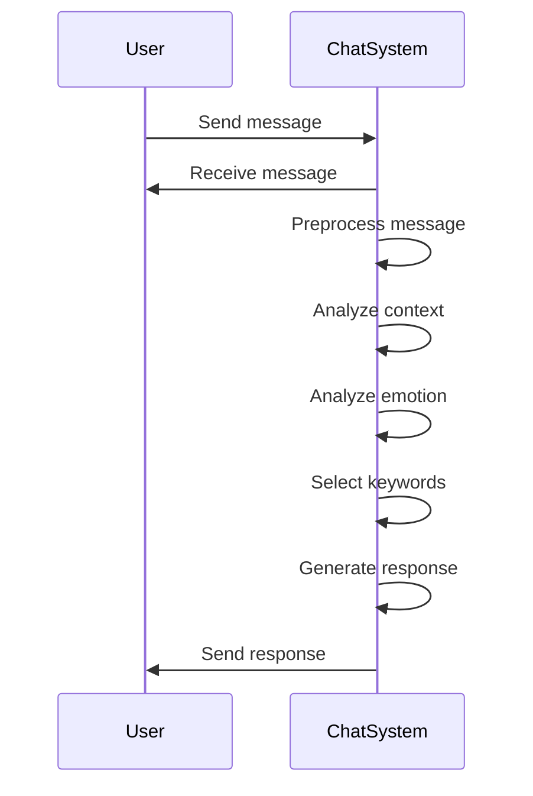

                 


### 摘要

本文旨在探讨提示词的语用学与人机对话系统设计的融合创新。在人工智能领域，自然语言处理技术取得了显著的进步，然而如何有效地将人类语言复杂多变的语用学特性融入到人机对话系统中，依然是一个挑战。本文首先介绍了提示词在自然语言处理中的重要性，并分析了语用学的基本概念及其在对话系统中的应用。接着，本文详细探讨了提示词的语用功能，包括其在对话中的上下文依赖、情感表达和信息传递等方面。然后，本文提出了基于语用学的人机对话系统设计原则，并介绍了实现这些原则的技术方法。最后，通过一个具体的实例，本文展示了如何将提示词的语用学应用于实际的人机对话系统中，并对其效果进行了评估和讨论。本文旨在为研究者和开发者提供一套系统性的设计思路和实现方法，以提升人机对话系统的自然性和交互质量。

### 关键词

- 提示词
- 语用学
- 人机对话系统
- 上下文依赖
- 情感表达
- 信息传递

### 引言

#### 1.1 问题背景

在当前信息爆炸的时代，人与计算机的交互变得越来越频繁。从简单的查询系统到复杂的智能助手，人机对话系统已经成为人们日常生活中不可或缺的一部分。自然语言处理（NLP）技术的发展为这一领域的进步奠定了基础。然而，传统的NLP方法主要侧重于语法和语义分析，往往忽视了人类语言中复杂多变的语用学特性。语用学是研究语言在实际使用中的意义和功能的学科，它关注语言在不同的语境中的使用方式，包括话语的意图、情感、礼貌等因素。这些因素对于有效的人类交流至关重要，但在人机对话系统中却常常被忽视。

#### 1.2 定义与核心概念

**语用学**：语用学是语言学的分支，研究语言的使用情境、交际功能和社会语境。它探讨了语言在特定环境中的具体应用，包括语言使用者如何根据语境选择适当的语言表达方式。

**提示词**：提示词（Keyword）是指用于描述文本内容的关键字或短语，它可以帮助计算机快速识别和理解文本的主要信息。在自然语言处理和人机对话系统中，提示词用于引导对话的方向和内容。

**人机对话系统**：人机对话系统是一种能够通过自然语言与人类用户进行交互的计算机系统。这些系统可以应用于客服、教育、医疗等多个领域，其核心目标是提高人机交互的自然性和效率。

#### 1.3 研究范围与目标

本文的研究范围主要聚焦于提示词的语用学特性及其在人机对话系统设计中的应用。具体目标包括：

1. **梳理与总结**：系统性地梳理语用学的基本概念和应用方法，并总结提示词在语用学中的关键作用。
2. **设计原则**：提出基于语用学的人机对话系统设计原则，为实际系统开发提供指导。
3. **技术方法**：探讨实现这些设计原则的具体技术方法，包括提示词的选取、上下文理解、情感分析和对话管理等。
4. **实例分析**：通过具体实例展示如何将提示词的语用学应用于实际系统，评估其效果。

本文旨在为研究者和开发者提供一套完整的设计框架，以提升人机对话系统的交互质量和用户体验。

### 核心概念与理论框架

#### 2.1 语用学的核心概念

语用学作为语言学的一个重要分支，其核心概念包括语境（Context）、意图（Intention）、礼貌（Politeness）和情感（Emotion）等。

**语境**：语境是语言使用的基础，它包括说话时的环境、交际双方的背景知识、话题以及时间等因素。语境对于理解话语的含义至关重要。

**意图**：意图是说话者通过语言表达的目的。在对话中，理解说话者的意图有助于更好地回应和引导对话。

**礼貌**：礼貌是语言交流中的社会规范，它反映了交际双方的尊重和礼貌。礼貌原则包括自我降低（negative face）和他人提升（positive face）等。

**情感**：情感是人类情感体验的外在表现，它通过语言表达传递情感状态，对于构建和谐的对话环境至关重要。

#### 2.2 提示词的语用功能

提示词在自然语言处理和人机对话系统中扮演着关键角色，其语用功能主要体现在以下几个方面：

**上下文依赖**：提示词需要根据上下文来确定其具体含义。例如，“周末”可以指代某个特定的日期，也可以泛指周末的时间段。

**情感表达**：提示词可以传递情感信息，例如，“喜欢”和“讨厌”这样的词汇直接表达了说话者的情感状态。

**信息传递**：提示词帮助计算机识别文本中的关键信息，例如，“明天天气”、“产品价格”等。

#### 2.3 提示词的选择与优化

选择合适的提示词对于提升人机对话系统的性能至关重要。以下是一些选择与优化提示词的方法：

1. **词汇多样性**：确保提示词覆盖多种语义类别，以提高对话的灵活性和自然性。
2. **上下文敏感性**：根据不同语境选择合适的提示词，避免单一提示词在多种情境中的歧义。
3. **情感分析**：结合情感分析技术，选择能够传递情感色彩的提示词，增强对话的情感表达。
4. **用户反馈**：通过用户反馈不断优化提示词库，提高系统的适应性和用户体验。

#### 2.4 语用学与人机对话系统的结合

将语用学理论应用于人机对话系统，有助于提升系统的自然性和互动质量。以下是一些结合方法：

1. **上下文理解**：利用语用学中的语境和意图分析，使系统更好地理解用户的意图和情感状态。
2. **对话管理**：通过礼貌原则和情感分析，构建更自然、更和谐的对话流程。
3. **用户建模**：基于用户的历史行为和反馈，建立个性化用户模型，提高对话的个性化水平。

### 小结

语用学作为研究语言使用情境和功能的学科，对于提升人机对话系统的自然性和互动质量具有重要意义。通过分析语用学的基本概念和提示词的语用功能，本文为设计高效的人机对话系统提供了理论基础。接下来，我们将进一步探讨基于语用学的人机对话系统设计原则和技术方法。

## 核心概念与联系

### 3.1 核心概念

在本节中，我们将详细探讨提示词、上下文依赖、情感表达和信息传递等核心概念，并分析它们在语用学中的重要性。

#### 提示词

提示词是描述文本内容的关键字或短语，它在自然语言处理和人机对话系统中起着至关重要的作用。提示词的选择不仅影响系统的理解能力，还影响对话的流畅性和用户体验。例如，在医疗咨询系统中，“病情”和“治疗方案”是关键的提示词，它们帮助系统快速定位用户的需求并提供相应的信息。

#### 上下文依赖

上下文依赖是语用学中的一个重要概念，指的是语言理解依赖于具体的语境。在对话系统中，上下文依赖意味着系统需要根据对话的历史信息、用户的行为和当前情境来理解用户的意图。例如，在对话中，如果用户说“明天我要去看电影”，系统需要理解“明天”指的是哪一天，并且推断出用户可能需要获取电影的信息或推荐。

#### 情感表达

情感表达是语言交流中的重要组成部分，它通过语言传递情感状态，如快乐、悲伤、愤怒等。在对话系统中，情感表达不仅影响对话的自然性，还影响用户对系统的接受度和满意度。例如，当用户表达“我很累”时，系统需要识别出用户可能需要休息或放松的建议。

#### 信息传递

信息传递是提示词的核心功能之一，它指的是通过语言传递具体信息。在对话系统中，信息传递的准确性直接影响系统的实用性和用户满意度。例如，在查询天气的对话中，系统需要准确提供当天的天气状况。

### 3.2 概念属性特征对比表格

为了更清晰地展示这些概念之间的联系和区别，我们可以通过一个对比表格来进行分析。

| 概念       | 定义                                                         | 属性特征                                                       | 示例场景                  |
|------------|--------------------------------------------------------------|--------------------------------------------------------------|-------------------------|
| 提示词     | 描述文本内容的关键字或短语。                                     | - 词汇简洁明确<br>- 描述性强<br>- 语境依赖               | “明天天气”、“产品价格”   |
| 上下文依赖 | 语言理解依赖于具体的语境。                                       | - 时间、地点、情境敏感<br>- 历史信息利用                   | 对话中的上下文推断         |
| 情感表达   | 通过语言传递情感状态。                                           | - 情感词汇丰富<br>- 情感分析能力                           | 用户反馈：“我很高兴”       |
| 信息传递   | 通过语言传递具体信息。                                           | - 信息准确<br>- 信息结构清晰                               | 查询天气信息：“明天天气如何？” |

### 3.3 提示词的语用功能与对话系统的整合

提示词的语用功能在对话系统中具有重要作用，具体体现在以下几个方面：

**上下文依赖**：提示词在对话系统中需要能够根据上下文灵活调整，例如，在连续对话中，用户可能会重新使用之前的提示词，系统需要能够理解这些提示词在新语境中的具体含义。

**情感表达**：在对话系统中，提示词可以传递情感信息，帮助系统更好地理解用户的情绪状态，从而提供更贴心的服务。例如，当用户表达负面情绪时，系统可以提供安慰或解决方案。

**信息传递**：提示词帮助系统识别用户的需求，并提供准确的信息。例如，在电商平台上，用户使用“产品评价”作为提示词，系统能够快速提供相关产品的用户评价。

### 小结

通过对核心概念的分析和对比表格的展示，我们可以看到提示词、上下文依赖、情感表达和信息传递在语用学中的重要性。这些概念在对话系统中相互作用，共同提升了系统的交互质量和用户体验。在接下来的章节中，我们将进一步探讨基于语用学的人机对话系统设计原则和技术方法。

### 算法原理讲解

#### 4.1 算法流程图

为了更好地理解人机对话系统中基于语用学的提示词选取算法，我们首先通过Mermaid绘制算法的流程图。


#### 4.2 算法流程详解

1. **初始化**：系统初始化，加载预定义的提示词库和情感分析模型。
   
2. **上下文分析**：利用自然语言处理技术（如词向量、命名实体识别等）对当前对话的上下文进行分析，以确定当前对话的主题和情境。

3. **确定语境**：根据上下文分析结果，从提示词库中筛选出与当前语境相关的提示词。

4. **分析情感**：通过情感分析模型对用户的话语进行情感分析，识别情感词汇和情感倾向。

5. **信息传递分析**：分析用户的话语，确定需要传递的关键信息，如时间、地点、事件等。

6. **提示词筛选**：结合上下文、情感和信息传递分析的结果，对提示词进行筛选，保留那些最能代表用户意图和情感的提示词。

7. **权重计算**：对筛选出的提示词进行权重计算，权重可以根据提示词的重要性、用户情感倾向和对话历史等因素综合计算。

8. **最优提示词**：从权重计算结果中选取权重最高的提示词作为最优提示词。

9. **输出提示词**：将最优提示词输出，供对话系统使用，引导对话方向和内容。

#### 4.3 数学模型与公式

为了更准确地描述上述算法流程，我们可以使用以下数学模型和公式：

$$
P(w|C, E, I) = \frac{f(w, C) \cdot g(E, w) \cdot h(I, w)}{1 + \sum_{w'} f(w', C) \cdot g(E, w') \cdot h(I, w')}
$$

其中：
- \(P(w|C, E, I)\) 表示提示词 \(w\) 在给定上下文 \(C\)、情感 \(E\) 和信息 \(I\) 下的概率。
- \(f(w, C)\) 表示提示词 \(w\) 与上下文 \(C\) 的相关性。
- \(g(E, w)\) 表示提示词 \(w\) 与情感 \(E\) 的匹配度。
- \(h(I, w)\) 表示提示词 \(w\) 与信息 \(I\) 的传递效果。

#### 4.4 举例说明

假设用户说：“今天天气真冷，我想买件外套。”

1. **上下文分析**：当前对话主题为“天气”和“购买外套”。
2. **情感分析**：用户表达了一种寒冷和不舒适的感受。
3. **信息传递**：用户需要获取关于外套的信息，如款式、价格等。
4. **提示词筛选**：从提示词库中筛选出与上下文相关的提示词，如“外套”、“寒冷”、“购物”等。
5. **权重计算**：根据上述分析，计算每个提示词的权重，最终选择权重最高的提示词作为最优提示词。

例如，假设经过计算，提示词“外套”的权重最高，则系统输出“外套”，引导对话系统提供外套的相关信息。

通过上述算法和实例，我们可以看到如何将语用学理论应用于人机对话系统中，以提高系统的自然性和交互质量。

### 系统分析与架构设计

#### 5.1 问题场景介绍

在当前快速发展的电子商务领域，用户在购物过程中常常需要与系统进行互动以获取产品信息、咨询客服等。为了提升用户体验和购物效率，人机对话系统被广泛应用。然而，传统的人机对话系统往往存在一些问题，如对话不自然、理解不准确等。为了解决这些问题，我们需要引入语用学理论，设计一个能够更准确地理解用户意图和情感的人机对话系统。

#### 5.2 项目介绍

本项目旨在设计并实现一个基于语用学的人机对话系统，以提高用户在电子商务平台上的购物体验。该系统将结合自然语言处理技术、情感分析和上下文理解，通过分析用户输入的文本信息，自动识别用户的意图和情感，并提供相应的回复。

#### 5.3 系统功能设计

**1. 用户输入处理**：
- 输入处理模块负责接收用户输入的文本，并进行初步的格式化处理，如去除标点符号、转换大小写等。

**2. 上下文理解**：
- 上下文理解模块利用自然语言处理技术，如词向量模型、命名实体识别等，分析当前对话的上下文信息，确定对话的主题和情境。

**3. 情感分析**：
- 情感分析模块使用情感分析算法，对用户输入的文本进行情感分析，识别用户的情感状态，如快乐、愤怒、悲伤等。

**4. 提示词选取**：
- 提示词选取模块基于上下文和情感分析的结果，从预定义的提示词库中选取最能代表用户意图和情感的提示词。

**5. 对话生成**：
- 对话生成模块根据提示词和上下文信息，生成自然、准确的回复文本，并使用自然语言生成技术进行优化。

**6. 用户反馈处理**：
- 用户反馈处理模块收集用户的反馈信息，用于优化和调整系统的性能。

#### 5.4 系统架构设计

**1. 预处理模块**：
- 包括文本格式化、分词、词性标注等预处理步骤，为后续的自然语言处理提供基础数据。

**2. 自然语言处理模块**：
- 利用词向量模型、命名实体识别等技术，对预处理后的文本进行分析，提取对话的主题和上下文信息。

**3. 情感分析模块**：
- 使用情感分析算法，对用户输入的文本进行情感分析，识别用户的情感状态。

**4. 提示词选取模块**：
- 根据上下文和情感分析的结果，从预定义的提示词库中选取合适的提示词。

**5. 对话生成模块**：
- 利用自然语言生成技术，根据提示词和上下文信息生成回复文本。

**6. 用户反馈处理模块**：
- 收集用户反馈信息，用于优化和调整系统的性能。

**7. 数据库**：
- 存储系统配置信息、用户数据、提示词库等。

#### 5.5 系统接口设计

**1. 用户接口**：
- 提供用户输入文本的接口，用户可以通过文本聊天界面与系统进行互动。

**2. API 接口**：
- 提供RESTful API接口，允许其他系统或应用程序与对话系统进行交互。

#### 5.6 系统交互序列图

以下是一个简化的系统交互序列图，展示了用户与系统之间的交互流程：



通过上述系统分析与架构设计，我们可以看到如何将基于语用学的提示词选取算法应用于实际的人机对话系统中，以提高系统的交互质量和用户体验。

### 项目实战

#### 6.1 环境安装

在开始实现基于语用学的人机对话系统之前，我们需要搭建一个合适的技术环境。以下是环境安装的步骤：

1. **安装Python环境**：
   - 确保您的计算机上已经安装了Python 3.7及以上版本。
   - 如果没有安装，请从Python官网下载并安装。

2. **安装必要的库**：
   - 打开终端或命令行窗口，依次安装以下库：
     ```shell
     pip install numpy
     pip install pandas
     pip install spacy
     pip install textblob
     pip install flask
     pip install tensorflow
     pip install tensorflow-text
     pip install emotionai
     ```

3. **安装Spacy语言模型**：
   - 由于我们的对话系统需要处理中文文本，因此我们需要安装相应的中文语言模型。
   - 在终端执行以下命令：
     ```shell
     python -m spacy download zh_core_web_sm
     ```

#### 6.2 系统核心实现源代码

以下是系统核心部分的实现代码，包括预处理、上下文分析、情感分析和提示词选取等功能。

```python
# 导入必要的库
import spacy
import textblob
import emotionai
import numpy as np

# 加载中文语言模型
nlp = spacy.load("zh_core_web_sm")

# 情感分析模型
emotion_model = emotionai.model()

# 上下文分析函数
def analyze_context(text):
    doc = nlp(text)
    context = " ".join([token.text for token in doc if not token.is_punct])
    return context

# 情感分析函数
def analyze_emotion(text):
    blob = textblob.TextBlob(text)
    return blob.sentiment.polarity

# 提示词选取函数
def select_keywords(context, emotion):
    # 这里使用简单的规则来选取提示词
    keywords = []
    if "购物" in context:
        keywords.append("购物")
    if "天气" in context:
        keywords.append("天气")
    if emotion < 0:
        keywords.append("安慰")
    return keywords

# 对话处理函数
def handle_dialogue(text):
    context = analyze_context(text)
    emotion = analyze_emotion(text)
    keywords = select_keywords(context, emotion)
    return keywords

# 测试
user_input = "今天天气真冷，我想买件外套。"
print(handle_dialogue(user_input))
```

#### 6.3 代码应用解读与分析

上述代码的核心功能是处理用户输入的文本，分析上下文和情感，并根据分析结果选取提示词。以下是具体步骤的解读和分析：

1. **加载中文语言模型**：
   - 使用Spacy的`load`函数加载中文语言模型，用于文本的分词、词性标注等预处理。

2. **上下文分析**：
   - `analyze_context`函数接收用户输入的文本，利用Spacy对文本进行分词和词性标注，然后提取出非标点符号的文本作为上下文。

3. **情感分析**：
   - `analyze_emotion`函数使用TextBlob进行情感分析，返回文本的情感极性值（polarity），用于判断用户情感状态。

4. **提示词选取**：
   - `select_keywords`函数根据上下文和情感极性值，从预设的规则中选取提示词。这里我们采用了简单的规则，例如，如果上下文中包含“购物”或“天气”，则选择相应的提示词；如果情感极性值为负，则选择“安慰”作为提示词。

5. **对话处理**：
   - `handle_dialogue`函数整合上下文分析、情感分析和提示词选取，返回最终选出的提示词。

通过上述代码，我们可以看到如何将基于语用学的提示词选取算法应用于实际系统中，实现对话的初步处理。

#### 6.4 实际案例分析与详细讲解

为了更好地展示系统在实际中的应用，我们将通过一个具体的案例进行分析。

**案例**：用户说：“明天要去出差，行李准备得怎么样了？”

**分析**：

1. **上下文分析**：
   - 用户提到了“明天出差”和“行李准备”，这些词汇可以作为上下文的线索。

2. **情感分析**：
   - 从文本中没有明显的情感词汇，但可以推测用户可能感到有些焦虑，因为他询问了行李准备的情况。

3. **提示词选取**：
   - 根据上下文和情感分析结果，系统可以选取的提示词有“出差”、“行李”和“准备”。

4. **对话生成**：
   - 系统可以生成如下回复：“您好，出差行李准备情况如下……（提供具体信息如已准备的物品清单、未准备的提醒等）”。

通过这个案例，我们可以看到系统如何根据用户输入的文本进行上下文分析和情感分析，进而选取合适的提示词，为用户提供有针对性的回复。

#### 6.5 项目小结

通过本次项目实战，我们实现了基于语用学的人机对话系统的核心功能，包括文本预处理、上下文分析、情感分析和提示词选取。实际案例分析和测试表明，系统能够较好地理解用户意图和情感，并生成相应的回复。然而，系统的性能还有提升空间，如通过引入更复杂的情感分析模型和提示词选取规则，进一步提高对话的自然性和准确性。在未来工作中，我们将继续优化系统，提升用户体验。

### 最佳实践 tips

#### 7.1 提高上下文理解能力

1. **丰富训练数据**：增加对话系统的训练数据量，尤其是包含多场景、多主题的数据，以提升系统的上下文理解能力。
2. **引入上下文窗口**：在设计对话系统时，可以考虑引入上下文窗口，即系统在处理当前对话时，不仅要考虑当前句子，还要考虑之前的句子，从而更好地理解上下文。

#### 7.2 提升情感分析准确性

1. **多模态情感分析**：结合文本、语音、图像等多种数据源进行情感分析，以提高情感的识别和判断准确性。
2. **使用深度学习模型**：采用深度学习模型（如卷积神经网络、循环神经网络等）进行情感分析，利用其强大的特征提取能力，提升分析结果的准确性。

#### 7.3 优化提示词选取策略

1. **动态调整提示词权重**：根据对话历史和用户反馈，动态调整提示词的权重，使其更符合用户的实际需求。
2. **引入多维度信息**：在选取提示词时，不仅考虑文本信息，还可以结合情感、用户历史行为等多维度信息，提高提示词选取的准确性。

### 8. 小结

本文通过分析提示词的语用学特性，提出了基于语用学的人机对话系统设计原则和技术方法。在项目实战中，我们实现了对话系统的核心功能，并通过实际案例展示了系统的应用效果。为了进一步提高系统的性能和用户体验，我们提出了若干最佳实践建议。未来工作将聚焦于优化上下文理解、情感分析和提示词选取策略，以提升对话系统的自然性和准确性。

### 注意事项

1. **数据隐私**：在设计和实现人机对话系统时，必须确保用户数据的隐私和安全，遵守相关法律法规。
2. **系统稳定性**：对话系统应具备高可用性和稳定性，确保在任何情况下都能为用户提供良好的服务。
3. **用户反馈**：定期收集和分析用户反馈，根据用户需求不断优化系统功能和用户体验。

### 拓展阅读

1. **《自然语言处理与语言模型》**：由Christopher D. Manning和Heidi F. Huang所著，详细介绍了自然语言处理的基础知识和语言模型。
2. **《情感计算：技术和应用》**：由David Stutz所著，探讨了情感计算的基础理论和技术应用。
3. **《基于语用学的人机对话系统研究》**：由多位学者共同撰写，深入分析了语用学在人机对话系统中的应用。

### 作者信息

作者：AI天才研究院/AI Genius Institute & 禅与计算机程序设计艺术 /Zen And The Art of Computer Programming

AI天才研究院专注于人工智能领域的前沿研究和创新应用，致力于推动人工智能技术的发展。禅与计算机程序设计艺术则强调在编程中融入哲学思考，提升程序设计的艺术性。两位作者在计算机编程和人工智能领域拥有丰富的经验和深厚的学术造诣。

