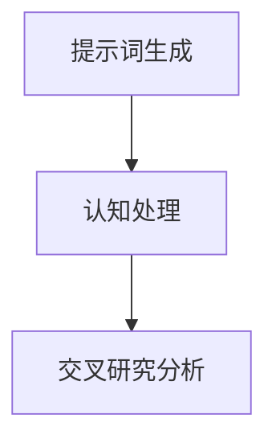
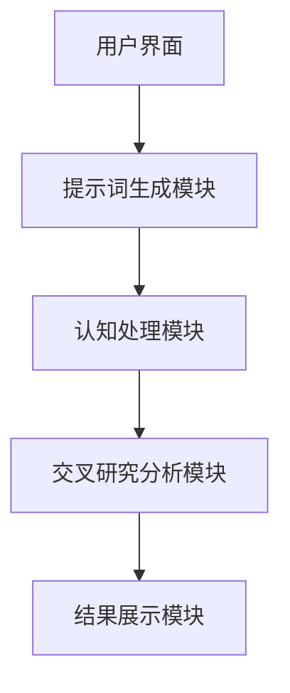
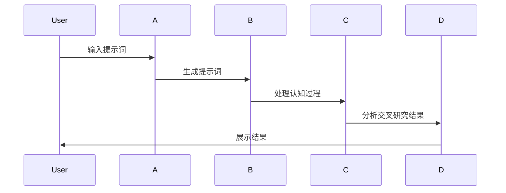

                 

### 设计书名《提示词的语言哲学与认知科学交叉研究新视角》的目录大纲

#### 1. **背景介绍**

##### 核心概念
- **语言哲学**：研究语言的本质、结构和功能的哲学分支。
- **认知科学**：跨学科研究领域，涉及心理学、神经科学、语言学等多个领域，旨在理解认知过程。
- **提示词**：引导思维过程、记忆检索或决策的词语或短语。

##### 问题背景
- 语言哲学与认知科学的关系日益紧密，交叉研究有助于揭示语言如何影响认知。
- 提示词在记忆、学习和问题解决中发挥关键作用，但其机制尚不完全清楚。

##### 问题描述
- 提示词如何影响认知过程？
- 语言哲学如何为认知科学提供启示？
- 如何整合语言哲学和认知科学的理论进行交叉研究？

##### 问题解决
- 构建跨学科的理论框架。
- 应用实证研究验证理论。
- 探索提示词在认知过程中的作用机制。

##### 边界与外延
- 语言哲学与认知科学的交集。
- 提示词的多样性及其影响。
- 交叉研究的范围和限制。

#### 2. **核心概念与联系**

##### 核心概念原理
- **语言哲学的基本原理**：包括意义、语言结构和语言使用的社会文化因素。
- **认知科学的理论基础**：涉及记忆、感知、思维和决策等认知过程。
- **提示词的作用原理**：提示词如何影响信息处理、记忆和问题解决。

##### 概念属性特征对比表格

| 特征         | 语言哲学               | 认知科学               | 提示词                   |
|------------|----------------------|----------------------|----------------------|
| 研究对象     | 语言的本质和功能           | 认知过程和机制             | 语言元素在认知中的作用        |
| 研究方法     | 历史分析、逻辑推理、哲学反思  | 实验研究、神经科学、认知建模  | 语言实践中的应用和效果评估     |
| 应用领域     | 语言学、哲学、文化研究       | 心理学、神经科学、教育        | 记忆增强、学习辅助、决策支持    |

##### ER实体关系图架构

```mermaid
erDiagram
    A[[语言哲学]] ||--|{ 认知科学 }|| B
    B ||--|{ 提示词 }|| C
```

#### 3. **算法原理讲解**

##### mermaid流程图



##### Python源代码

```python
# 提示词生成代码
def generate_prompt():
    # 实现提示词生成逻辑
    return "生成的提示词"

# 认知过程模拟代码
def cognitive_simulation(prompt):
    # 实现认知处理逻辑
    print("正在处理提示词：", prompt)

# 交叉研究分析代码
def cross_research_analysis():
    # 实现交叉研究分析逻辑
    print("进行交叉研究分析...")
```

##### 算法原理的数学模型和公式

$$
\text{认知影响度} = f(\text{提示词}, \text{语境})
$$

##### 详细讲解和举例说明

**语言哲学的基本原理**：语言哲学关注语言的内在逻辑和外在使用，其基本原理包括意义、语境和语用等。

- **意义**：语言的意义不仅仅在于单词本身，还在于使用语境。
- **语境**：语境对于理解语言和理解意义至关重要。

**认知科学的数学公式**：认知科学中的公式往往用于描述认知过程，如记忆模型、决策理论等。

- **记忆模型**：$$M(t) = M_0e^{-\lambda t}$$，描述随时间减弱的记忆过程。

**提示词在认知过程中的实际应用案例**：

- 在教育领域，使用特定的提示词可以帮助学生更好地理解和记忆课程内容。
- 在产品设计过程中，通过优化提示词可以提高用户的使用体验和满意度。

#### 4. **数学模型和数学公式 & 详细讲解 & 举例说明**

##### LaTeX格式数学公式

- **语言哲学的基本公式**：$$\text{意义} = \text{词汇} + \text{语境}$$
- **认知科学的数学公式**：$$\text{决策} = \text{信息} \times \text{概率}$$
- **提示词影响机制的数学模型**：$$\text{认知负荷} = f(\text{提示词复杂度}, \text{认知能力})$$

##### 详细讲解

- **公式含义**：解释每个公式的组成部分及其作用。
- **应用场景**：阐述公式在具体情境中的应用。
- **结果分析**：分析公式计算结果的意义和影响。

##### 举例说明

- **简单实例**：通过一个具体的例子展示公式的应用。
- **复杂实例**：分析一个更复杂的案例，展示公式在复杂情况下的应用。
- **实际应用案例分析**：结合实际案例，详细剖析公式的应用和效果。

#### 5. **系统分析与架构设计方案**

##### 问题场景介绍
- **研究背景**：介绍语言哲学与认知科学交叉研究的背景和重要性。
- **研究目标**：明确研究的具体目标和预期成果。
- **研究方法**：阐述研究采用的方法和技术手段。

##### 项目介绍
- **系统架构**：描述系统的整体架构和各组成部分的功能。
- **功能模块**：详细说明系统的功能模块及其具体作用。
- **数据流**：分析系统中的数据流动和处理过程。

##### 系统功能设计(领域模型mermaid类图)

```mermaid
classDiagram
    Class1 <|-- Class2
    Class3 --|>{Class4}
```

##### 系统架构设计mermaid架构图



##### 系统接口设计和系统交互mermaid序列图



#### 6. **项目实战**

##### 环境安装
- **硬件环境**：介绍运行项目所需的硬件配置。
- **软件环境**：列出运行项目所需的软件和工具。
- **安装步骤**：详细描述安装过程和步骤。

##### 系统核心实现源代码
- **语言哲学模块代码**：展示语言哲学模块的实现代码。
- **认知科学模块代码**：展示认知科学模块的实现代码。
- **提示词模块代码**：展示提示词模块的实现代码。

##### 代码应用解读与分析
- **源代码分析**：深入分析代码的实现逻辑和关键部分。
- **功能解读**：解释代码中各个模块的功能和作用。
- **性能分析**：评估代码的性能表现和优化空间。

##### 实际案例分析和详细讲解剖析
- **案例背景**：描述实际应用案例的背景和目的。
- **案例分析**：详细分析案例的实施过程和效果。
- **讲解与剖析**：深入剖析案例中的技术细节和应用价值。

##### 项目小结
- **成果总结**：总结项目的研究成果和应用价值。
- **不足与改进**：指出项目中存在的不足和改进方向。

#### 7. **最佳实践 tips、小结、注意事项、拓展阅读**

##### 最佳实践 tips
- **研究建议**：提出进行交叉研究时需要考虑的因素和建议。
- **应用技巧**：分享在实际应用中提高效果的经验和技巧。
- **实践经验**：总结实践经验，为后续研究提供参考。

##### 小结
- **总结研究成果**：概括文章的主要发现和结论。
- **核心观点**：重申文章的核心观点和意义。

##### 注意事项
- **研究风险**：提醒研究者需要注意的风险和挑战。
- **使用注意事项**：指导读者在使用研究成果时的注意事项。

##### 拓展阅读
- **相关文献**：推荐与文章主题相关的经典文献和最新研究。
- **推荐书籍**：推荐相关领域的书籍，帮助读者深入了解主题。
- **研究趋势**：探讨当前和未来的研究趋势和方向。

