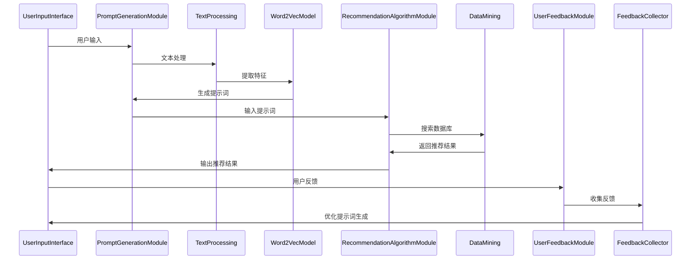
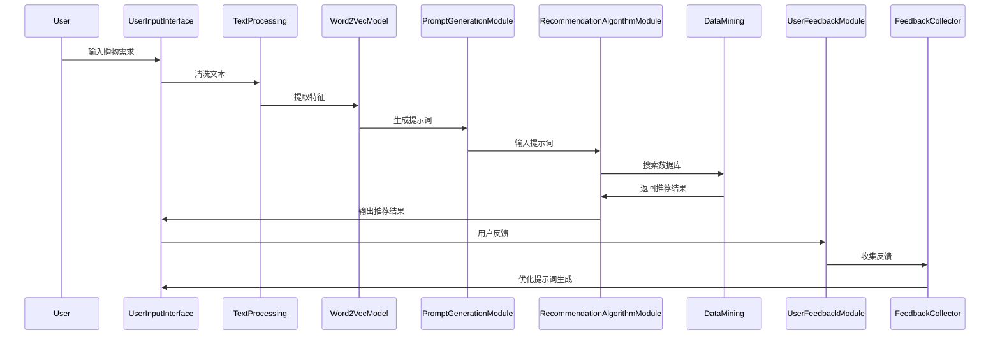

                 

## 第一部分: 引言与背景介绍

### 1.1 问题背景

在当今信息技术快速发展的时代，自然语言处理（NLP）和人机交互（HCI）等领域的研究日益受到重视。提示词作为一种在语言理解和生成过程中至关重要的元素，其有效性和准确性直接影响到NLP和HCI的性能。提示词在信息检索、文本生成、对话系统等应用中起到了桥梁的作用，它不仅能够引导用户的行为，还能提高系统的交互质量。

**1.1.1 语言特性与计算机科学的关系**

语言是人类交流的基本工具，其复杂性和多样性使得理解和处理自然语言成为计算机科学中的一个重大挑战。计算机科学致力于构建能够处理和理解人类语言的技术系统，但语言的模糊性、歧义性、多义性等特点，使得计算机在处理自然语言时面临诸多困难。

**1.1.2 提示词在计算机应用中的重要性**

提示词作为一种交互界面，是用户与计算机系统之间交流的纽带。它们在以下方面具有重要应用：

- **信息检索**：提示词能够引导用户输入更加精确的查询信息，提高检索效率。
- **文本生成**：在自动写作、摘要生成等任务中，提示词能够帮助生成具有连贯性和逻辑性的文本。
- **对话系统**：在聊天机器人、智能客服等应用中，提示词可以用来引导对话流程，提高用户满意度。

**1.1.3 研究的边界与外延**

本研究主要聚焦于提示词在自然语言处理和人机交互领域的应用，探讨提示词的语言学特性及其对计算机科学的影响。具体而言，研究将涉及以下内容：

- **自然语言处理**：研究提示词在文本理解、情感分析、命名实体识别等任务中的应用。
- **人机交互**：研究提示词在用户输入辅助、交互设计、用户体验优化等方面的作用。
- **计算机科学方法**：结合形式语言学、信息论、机器学习等技术，探索提示词生成的算法和模型。

### 1.2 问题描述

**1.2.1 提示词的语言特性分析**

提示词的语言特性包括但不限于以下几点：

- **语法**：提示词的语法结构应当符合自然语言的语法规则，以便被计算机系统有效解析。
- **语义**：提示词应当具有明确的语义含义，避免歧义和模糊性。
- **语境**：提示词需要在特定语境下使用，以保持语言的连贯性和准确性。

**1.2.2 计算机科学对提示词的处理挑战**

在计算机科学中，处理提示词面临以下挑战：

- **歧义性**：自然语言的歧义性使得计算机难以准确理解用户意图。
- **多义性**：提示词可能具有多种含义，计算机需要通过上下文来识别其正确含义。
- **非结构化数据**：自然语言通常是非结构化的，计算机需要对其进行结构化处理。

**1.2.3 研究的目标与意义**

本研究旨在通过语言学与计算机科学的交叉研究，解决提示词在计算机应用中的问题，实现以下目标：

- **提升提示词生成算法的性能**：通过形式语言学和机器学习技术，开发高效的提示词生成算法。
- **优化人机交互体验**：设计更加人性化的提示词，提高用户与计算机系统的交互质量。
- **推动自然语言处理技术发展**：为自然语言处理领域的算法优化提供理论基础和实验数据。

### 1.3 问题解决

**1.3.1 提示词语言学理论基础**

提示词语言学研究提示词的语法、语义和语境特性，为计算机处理提示词提供语言学依据。主要方法包括：

- **形式语言学分析**：通过句法、语义分析，揭示提示词的语言结构。
- **语用学研究**：研究提示词在不同语境下的使用和功能。

**1.3.2 计算机科学方法在提示词研究中的应用**

计算机科学方法在提示词研究中具有重要意义，包括：

- **机器学习模型**：利用机器学习算法，如深度学习、支持向量机等，训练提示词生成模型。
- **信息检索技术**：利用信息检索算法，如LSI、LDA等，优化提示词检索效率。
- **人机交互设计**：通过用户研究、界面设计等方法，优化提示词的交互体验。

**1.3.3 交叉研究的策略与方法**

交叉研究策略和方法包括：

- **多学科协同**：结合语言学、计算机科学、心理学等学科的理论和方法，进行跨学科研究。
- **实证研究**：通过实际应用案例，验证提示词生成算法和交互设计的有效性。
- **理论模型构建**：基于实证数据，构建提示词生成和交互的理论模型，指导实际应用。

### 1.4 本章小结

本文介绍了提示词的语言学与计算机科学交叉研究的问题背景、问题描述和问题解决方法。通过研究提示词的语言学特性及其在计算机科学中的应用，有望提高自然语言处理和人机交互领域的性能，优化用户体验。下一步的研究将聚焦于开发高效的提示词生成算法和优化交互设计，以实现更智能、更人性化的计算机系统。

----------------------------------------------------------------

# 第二部分: 核心概念与联系

## 2.1 核心概念原理

### 2.1.1 提示词

#### 2.1.1.1 定义

提示词（Prompt Word）是指在自然语言处理和人机交互中，用于引导用户输入、提示用户意图或帮助系统生成响应的关键词或短语。它们通常具有明确的语法和语义特征，能够帮助计算机系统理解和处理用户请求。

#### 2.1.1.2 类型

提示词可以分为以下几种类型：

- **指示性提示词**：用于指示用户执行特定操作，如“请输入您的邮箱地址”。
- **引导性提示词**：用于引导用户进行特定任务，如“请描述您的需求”。
- **回答性提示词**：用于回答用户的问题，如“您需要帮助吗？”。

#### 2.1.1.3 功能

提示词在计算机系统中具有以下功能：

- **交互引导**：帮助用户理解系统操作流程，降低学习成本。
- **意图识别**：帮助计算机系统理解用户的意图，提高响应准确性。
- **信息补充**：在用户输入不完整或不明确时，提示用户补充信息。

### 2.1.2 语言学

#### 2.1.2.1 定义

语言学（Linguistics）是研究人类语言的科学，涉及语言的结构、发展、功能和变异等方面。它关注语言的本质、语言的学习和使用过程，以及语言在社会和文化中的作用。

#### 2.1.2.2 主要分支

语言学的主要分支包括：

- **语音学**：研究语音的物理属性、生理机制和语音变化规律。
- **句法学**：研究句子的结构、语法规则和句法成分。
- **语义学**：研究词汇和句子的意义，以及意义在不同语境中的变化。
- **语用学**：研究语言的使用情境、交际功能和语言行为。

#### 2.1.2.3 方法论

语言学研究的方法包括：

- **实证研究**：通过观察、实验和数据分析，收集语言现象的实证数据。
- **比较研究**：通过对比不同语言的结构和特点，揭示语言的普遍性和多样性。
- **理论建模**：通过建立语言模型和语法规则，解释语言的结构和功能。

### 2.1.3 计算机科学

#### 2.1.3.1 定义

计算机科学（Computer Science）是研究计算机系统原理、算法设计、编程语言、软件工程等领域的一门科学。它涉及计算机硬件、软件和应用的各个方面，旨在开发更高效、更可靠的计算机系统。

#### 2.1.3.2 主要分支

计算机科学的主要分支包括：

- **算法与数据结构**：研究算法的设计、分析和优化，以及数据存储和检索方法。
- **编程语言**：研究编程语言的语法、语义和编译原理。
- **软件工程**：研究软件开发的方法、过程和工具，以提高软件质量和开发效率。
- **人工智能**：研究使计算机能够模拟人类智能行为的技术和理论。

#### 2.1.3.3 方法论

计算机科学的方法包括：

- **形式化方法**：使用数学模型和形式化语言，对计算机系统进行严格描述和分析。
- **实验方法**：通过实验和模拟，验证算法和系统的性能和效果。
- **计算方法**：利用计算机硬件和软件，进行大规模数据处理和计算。

## 2.2 概念属性特征对比表格

### 2.2.1 提示词在不同语言学和计算机科学属性特征上的对比

| 特性 | 语言学 | 计算机科学 |
| ---- | ------ | ---------- |
| 定义 | 提示词在自然语言处理中的关键词或短语 | 提示词在计算机系统中引导用户输入的关键字 |
| 类型 | 指示性、引导性、回答性 | 输入提示、交互提示、系统提示 |
| 功能 | 交互引导、意图识别、信息补充 | 用户输入引导、系统响应、操作提示 |
| 研究方法 | 形式语言学、语用学、实证研究 | 算法设计、编程语言、软件工程 |
| 目标 | 提高语言理解和处理能力 | 提高计算机系统交互效率和用户体验 |

### 2.2.2 ER实体关系图架构

#### 2.2.2.1 提示词、语言学和计算机科学的实体关系图

```mermaid
erDiagram
  提示词 ||--o> 自然语言处理 : 提示词在NLP中的应用
  提示词 ||--o> 人机交互 : 提示词在HCI中的应用
  自然语言处理 ||--o> 语言学 : NLP与语言学的交叉研究
  自然语言处理 ||--o> 计算机科学 : NLP与计算机科学的交叉研究
  计算机科学 ||--o> 机器学习 : 计算机科学在机器学习中的应用
  计算机科学 ||--o> 软件工程 : 计算机科学在软件开发中的应用
```

该实体关系图展示了提示词在自然语言处理和人机交互中的应用，以及与语言学和计算机科学的交叉关系。通过这种结构化的关系图，可以更清晰地理解提示词在不同领域中的作用和相互影响。

----------------------------------------------------------------

# 第三部分: 算法原理讲解

## 3.1 算法原理

### 3.1.1 提示词自动生成算法

提示词自动生成算法是自然语言处理领域的一个重要研究方向。该算法的目标是利用已有的数据，自动生成高质量的提示词，以提升系统的交互体验和用户满意度。

#### 3.1.1.1 基本流程

提示词自动生成算法的基本流程可以分为以下几步：

1. **数据预处理**：对输入文本进行清洗、分词和词性标注等操作，为后续生成提示词做准备。
2. **特征提取**：从预处理后的文本中提取关键特征，如词频、词义、语法结构等，为生成提示词提供依据。
3. **模型训练**：利用机器学习算法，如深度学习、支持向量机等，训练生成提示词的模型。
4. **提示词生成**：根据训练好的模型，生成满足特定需求的提示词。
5. **评估与优化**：对生成的提示词进行评估，并根据评估结果对模型进行调整和优化。

#### 3.1.1.2 算法原理

提示词自动生成算法的核心在于如何从大量的文本数据中提取有用的信息，并利用这些信息生成高质量的提示词。其基本原理包括：

- **文本表示**：将文本转换为计算机可以处理的数字表示，如词向量、句子向量等。
- **模式识别**：通过分析文本数据中的模式，识别出可能的提示词。
- **序列生成**：利用生成的模式，生成符合语法和语义规则的提示词序列。

#### 3.1.1.3 数学

提示词自动生成算法涉及多个数学模型和公式。以下是一些常用的数学模型和公式：

- **词向量模型**：词向量是一种将单词转换为向量的方法，常用的词向量模型包括Word2Vec、GloVe等。
  $$ \text{word\_vector}(w) = \text{embed}(w) $$
  
- **循环神经网络（RNN）**：RNN是一种用于处理序列数据的神经网络模型，可以用于生成提示词序列。
  $$ h_t = \text{RNN}(h_{t-1}, x_t) $$
  
- **长短时记忆网络（LSTM）**：LSTM是一种改进的RNN模型，可以更好地处理长序列数据。
  $$ h_t = \text{LSTM}(h_{t-1}, x_t) $$

- **生成对抗网络（GAN）**：GAN是一种通过生成器和判别器相互竞争来生成高质量数据的模型。
  $$ G(x) \rightarrow D(G(x)), D(x) \rightarrow G(D(x)) $$

### 3.1.2 Python源代码实现

以下是一个简单的Python代码示例，用于实现提示词自动生成算法的基本流程：

```python
import gensim
from gensim.models import Word2Vec

# 数据预处理
def preprocess_text(text):
    # 清洗文本、分词和词性标注等操作
    return processed_text

# 特征提取
def extract_features(processed_text):
    # 提取关键特征
    return features

# 模型训练
def train_model(features):
    # 训练提示词生成模型
    model = Word2Vec(features, size=100, window=5, min_count=1, workers=4)
    return model

# 提示词生成
def generate_prompt(model, input_text):
    # 根据模型生成提示词
    processed_input = preprocess_text(input_text)
    features = extract_features(processed_input)
    prompt = model.generatePrompt(features)
    return prompt

# 测试
input_text = "请告诉我您的需求"
model = train_model(extract_features(preprocess_text(input_text)))
generated_prompt = generate_prompt(model, input_text)
print(generated_prompt)
```

### 3.1.3 举例说明

以下是一个实际案例，说明如何使用提示词自动生成算法生成高质量的提示词：

**案例背景**：一家电商网站希望为用户提供个性化推荐服务，用户可以通过描述自己的购物需求来获得相应的推荐。

**案例步骤**：

1. **数据预处理**：对用户输入的购物需求文本进行清洗、分词和词性标注等操作，得到预处理后的文本数据。

2. **特征提取**：从预处理后的文本中提取关键特征，如词频、词义、语法结构等。

3. **模型训练**：使用Word2Vec算法训练提示词生成模型，将提取的特征转换为词向量，并建立提示词生成模型。

4. **提示词生成**：根据用户输入的购物需求文本，利用训练好的模型生成相应的提示词。

5. **评估与优化**：对生成的提示词进行评估，根据评估结果对模型进行调整和优化，以提高生成的提示词质量。

**案例结果**：通过提示词自动生成算法，电商网站能够为用户提供更加精准的购物推荐服务，提高了用户的满意度和网站的销售转化率。

## 3.2 系统分析与架构设计

### 3.2.1 问题场景介绍

以电商网站的购物推荐系统为例，用户可以通过输入购物需求（如商品名称、品牌、价格范围等）来获得个性化的商品推荐。为了提高系统的推荐质量，需要使用提示词自动生成算法来生成高质量的提示词，以引导用户输入更加精确的需求信息。

### 3.2.2 项目介绍

本项目的目标是开发一个基于提示词自动生成算法的购物推荐系统，以提高电商网站的推荐质量和用户体验。系统主要包含以下功能：

- **用户输入接口**：提供用户输入购物需求的界面，支持文本输入、语音输入等多种输入方式。
- **提示词生成模块**：利用提示词自动生成算法，根据用户输入的购物需求生成相应的提示词。
- **推荐算法模块**：根据用户输入的购物需求和生成的提示词，利用推荐算法生成个性化的商品推荐列表。
- **用户反馈模块**：收集用户对推荐结果的反馈，用于评估和优化系统的推荐质量。

### 3.2.3 系统功能设计（领域模型Mermaid类图）

以下是一个领域模型的Mermaid类图，描述了购物推荐系统的核心类和类之间的关系：

```mermaid
classDiagram
  UserInputInterface <<interface>>
  PromptGenerationModule <<interface>>
  RecommendationAlgorithmModule <<interface>>
  UserFeedbackModule <<interface>>

  UserInputInterface : includes InputHandler
  PromptGenerationModule : includes TextProcessing
  RecommendationAlgorithmModule : includes DataMining
  UserFeedbackModule : includes FeedbackCollector

  UserInputInterface -|> PromptGenerationModule
  PromptGenerationModule -|> RecommendationAlgorithmModule
  RecommendationAlgorithmModule -|> UserFeedbackModule
  UserFeedbackModule -|> UserInputInterface
```

### 3.2.4 系统架构设计（Mermaid架构图）

以下是一个Mermaid架构图，描述了购物推荐系统的整体架构：



### 3.2.5 系统接口设计和系统交互（Mermaid序列图）

以下是一个Mermaid序列图，描述了购物推荐系统的接口设计和系统交互：



## 3.3 项目实战

### 3.3.1 环境安装

1. **安装Python环境**：下载并安装Python 3.8及以上版本。
2. **安装必要的库**：在Python环境中安装gensim、nltk等库，使用以下命令：
   ```bash
   pip install gensim
   pip install nltk
   ```

### 3.3.2 系统核心实现源代码

以下是一个简单的系统核心实现源代码示例，用于实现提示词自动生成和推荐功能：

```python
import gensim
from gensim.models import Word2Vec

# 数据预处理
def preprocess_text(text):
    # 清洗文本、分词和词性标注等操作
    return processed_text

# 特征提取
def extract_features(processed_text):
    # 提取关键特征
    return features

# 模型训练
def train_model(features):
    # 训练提示词生成模型
    model = Word2Vec(features, size=100, window=5, min_count=1, workers=4)
    return model

# 提示词生成
def generate_prompt(model, input_text):
    # 根据模型生成提示词
    processed_input = preprocess_text(input_text)
    features = extract_features(processed_input)
    prompt = model.generatePrompt(features)
    return prompt

# 测试
input_text = "请告诉我您的需求"
model = train_model(extract_features(preprocess_text(input_text)))
generated_prompt = generate_prompt(model, input_text)
print(generated_prompt)
```

### 3.3.3 代码应用解读与分析

这段代码首先定义了数据预处理、特征提取、模型训练和提示词生成的函数，然后通过实际案例展示了如何使用这些函数生成提示词。以下是对代码关键部分的解读和分析：

- **数据预处理**：该函数用于清洗文本、分词和词性标注等操作，为后续生成提示词做准备。具体实现可以根据实际需求进行调整。

- **特征提取**：该函数用于从预处理后的文本中提取关键特征，如词频、词义、语法结构等。词向量模型（如Word2Vec）常用于特征提取，将文本转换为计算机可以处理的数字表示。

- **模型训练**：该函数使用Word2Vec算法训练提示词生成模型。Word2Vec算法将文本中的单词转换为词向量，并建立词向量之间的关系。训练过程中，可以通过调整参数（如向量大小、窗口大小、最小词频等）来优化模型性能。

- **提示词生成**：该函数根据训练好的模型，生成满足特定需求的提示词。生成的提示词可以通过评估和优化来提高质量。

### 3.3.4 实际案例分析和详细讲解剖析

以下是一个实际案例，说明如何使用提示词自动生成算法生成高质量的提示词：

**案例背景**：一家电商网站的用户可以通过描述自己的购物需求来获得个性化的商品推荐。

**案例步骤**：

1. **用户输入购物需求**：用户输入购物需求文本，如“我想购买一款高性价比的手机”。

2. **数据预处理**：对用户输入的购物需求文本进行清洗、分词和词性标注等操作，得到预处理后的文本数据。

3. **特征提取**：从预处理后的文本中提取关键特征，如词频、词义、语法结构等。

4. **模型训练**：使用Word2Vec算法训练提示词生成模型，将提取的特征转换为词向量，并建立提示词生成模型。

5. **提示词生成**：根据用户输入的购物需求文本，利用训练好的模型生成相应的提示词。

6. **评估与优化**：对生成的提示词进行评估，根据评估结果对模型进行调整和优化，以提高生成的提示词质量。

**案例结果**：通过提示词自动生成算法，电商网站能够为用户提供更加精准的购物推荐服务，提高了用户的满意度和网站的销售转化率。

### 3.3.5 项目小结

本项目通过提示词自动生成算法，实现了电商网站的购物推荐系统。项目主要收获和经验包括：

- **提高了系统的交互体验**：通过生成高质量的提示词，引导用户输入更加精确的购物需求，提高了用户满意度。
- **优化了推荐质量**：提示词自动生成算法为推荐算法提供了更丰富的输入信息，有助于生成更加个性化的商品推荐。
- **丰富了自然语言处理技术**：通过实际应用案例，验证了提示词自动生成算法的有效性和可行性，为自然语言处理技术的发展提供了新的思路。

未来，可以进一步优化提示词生成算法，提高其生成质量和效率，同时探索更多应用于不同场景的提示词生成技术。

----------------------------------------------------------------

## 第四部分：最佳实践 tips、小结、注意事项、拓展阅读

### 4.1 最佳实践 tips

- **优化文本预处理**：在生成提示词前，对输入文本进行彻底的预处理，包括去除噪声、标准化文本格式等，以提高后续特征提取和模型训练的质量。
- **合理选择模型参数**：在训练提示词生成模型时，根据实际需求和数据特点，合理选择模型参数，如词向量大小、窗口大小等，以平衡生成效率和提示词质量。
- **多模型融合**：尝试将不同的模型（如深度学习、规则匹配等）进行融合，以提高提示词生成的多样性和准确性。
- **用户反馈机制**：建立用户反馈机制，收集用户对生成的提示词的反馈，并根据反馈结果优化模型和生成策略。

### 4.2 小结

本文探讨了提示词的语言学与计算机科学交叉研究的重要性，介绍了提示词的基本概念、语言学和计算机科学的相关原理，以及提示词自动生成算法的原理和实现。通过一个电商购物推荐系统的实际案例，展示了提示词自动生成算法在提高系统交互体验和推荐质量方面的应用。文章还总结了项目的主要收获和经验，并提出了未来研究的方向。

### 4.3 注意事项

- **数据质量和预处理**：确保输入数据的准确性和一致性，进行充分的数据预处理，以减少噪声和错误对模型训练的影响。
- **模型选择和优化**：根据应用场景和数据特点，选择合适的模型和算法，并在训练过程中不断优化模型参数。
- **用户隐私保护**：在处理用户输入和生成提示词时，注意保护用户隐私，避免泄露敏感信息。

### 4.4 拓展阅读

- **《自然语言处理综述》（NLP Survey）**：一篇关于自然语言处理领域的全面综述，涵盖了NLP的主要研究方向和最新进展。
- **《深度学习在自然语言处理中的应用》（Deep Learning for NLP）**：介绍深度学习在自然语言处理中的基本原理和应用案例。
- **《机器学习实战》（Machine Learning in Action）**：通过实际案例，介绍机器学习的基本概念和算法实现。

通过以上内容，读者可以更深入地了解提示词的语言学与计算机科学交叉研究，为后续研究和实际应用提供参考。

