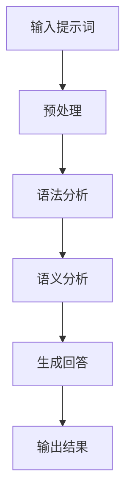
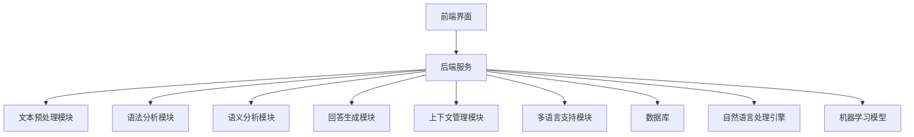
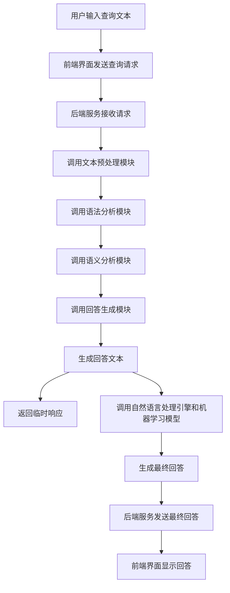

                 

# 提示词的语言学分析：优化AI沟通

## 关键词
- 提示词
- 语言学
- AI沟通
- 语言模型
- 优化策略

## 摘要
本文将深入探讨提示词在人工智能沟通中的重要性，以及如何通过语言学分析优化AI沟通的效果。我们将首先介绍提示词的概念、其在AI沟通中的作用，以及当前面临的挑战。接着，我们将介绍语言学的基本概念，并分析这些概念如何影响AI的理解和解释。随后，我们将探讨解决这些问题的策略，包括优化提示词的选择和语言学理论在AI系统中的应用。最后，我们将讨论AI沟通的长期发展趋势，以及如何建立AI与人类沟通的桥梁。

## 目录大纲

----------------------------------------------------------------

# 提示词的语言学分析：优化AI沟通

## 第一部分：引言与背景介绍

### 1.1 问题背景
#### 1.1.1 提示词在AI沟通中的作用
#### 1.1.2 AI沟通面临的挑战
#### 1.1.3 语言学的核心概念及其对AI沟通的影响

### 1.2 问题描述
#### 1.2.1 提示词模糊性
#### 1.2.2 语言多样性
#### 1.2.3 AI理解与解释偏差

### 1.3 问题解决
#### 1.3.1 提示词优化策略
#### 1.3.2 语言学理论的应用
#### 1.3.3 AI与人类沟通的桥梁建设

### 1.4 边界与外延
#### 1.4.1 提示词的选择标准
#### 1.4.2 语言学分析方法
#### 1.4.3 AI沟通的长期发展趋势

### 1.5 概念结构与核心要素组成
#### 1.5.1 语言学基本概念
#### 1.5.2 AI沟通中的关键要素
#### 1.5.3 提示词优化与语言学分析的关系

### 1.6 本章小结

## 第二部分：核心概念与联系

### 2.1 核心概念原理
#### 2.1.1 提示词的定义
#### 2.1.2 语言学理论框架
#### 2.1.3 AI沟通机制

### 2.2 概念属性特征对比表格

### 2.3 ER实体关系图架构

### 2.4 本章小结

## 第三部分：算法原理讲解

### 3.1 算法原理与mermaid流程图

### 3.2 Python源代码与算法实现

### 3.3 算法原理的数学模型和公式

## 第四部分：系统分析与架构设计

### 4.1 问题场景介绍

### 4.2 项目介绍

### 4.3 系统功能设计

### 4.4 系统架构设计

### 4.5 系统接口设计和系统交互

## 第五部分：项目实战

### 5.1 环境安装

### 5.2 系统核心实现源代码

### 5.3 代码应用解读与分析

### 5.4 实际案例分析和详细讲解剖析

### 5.5 项目小结

## 第六部分：最佳实践 tips、小结、注意事项、拓展阅读等内容

----------------------------------------------------------------

## 第一部分：引言与背景介绍

### 1.1 问题背景

#### 1.1.1 提示词在AI沟通中的作用

在人工智能（AI）领域，提示词（prompt）是人与AI系统交互的重要媒介。提示词可以被定义为用户输入到AI系统中的文字或语音指令，它指导AI系统进行特定的任务或查询。一个有效的提示词应该简洁、精准且具备明确的语义，以便AI系统能够准确理解和响应。

提示词在AI沟通中的作用主要体现在以下几个方面：

1. **交互引导**：提示词为用户提供了与AI系统交互的入口，帮助用户明确沟通目标和期望的输出。
2. **任务指令**：对于自动化系统或智能助手，提示词是触发特定任务或功能的关键。
3. **上下文提供**：有效的提示词能够传递上下文信息，帮助AI系统更好地理解和处理复杂的任务。
4. **反馈机制**：通过提示词，用户可以提供反馈信息，帮助AI系统不断学习和优化其性能。

#### 1.1.2 AI沟通面临的挑战

尽管提示词在AI沟通中起着关键作用，但AI系统在处理这些提示词时仍然面临诸多挑战。以下是几个主要问题：

1. **模糊性**：提示词可能存在模糊性，导致AI系统难以准确理解用户的意图。例如，"我需要一张明天的天气预报"，这个提示词的模糊性在于没有明确指定时间和地点。
2. **语言多样性**：不同用户可能使用不同的语言或方言，使得AI系统需要具备跨语言和多语言的解析能力。
3. **解释偏差**：AI系统可能由于算法偏差或数据集中存在的问题，导致对提示词的理解与用户意图不一致。
4. **上下文理解**：AI系统在处理长文本或复杂场景时，可能难以准确捕捉上下文信息，从而影响沟通效果。

#### 1.1.3 语言学的核心概念及其对AI沟通的影响

为了解决上述挑战，语言学的基本概念对AI沟通起到了关键作用。以下是一些核心概念及其对AI沟通的影响：

1. **语法分析**：语法分析是理解句子结构的重要步骤，它帮助AI系统解析提示词的语法结构，确定句子中的主语、谓语和宾语等成分。
2. **语义分析**：语义分析涉及理解单词和句子的意义，这对于准确理解用户意图至关重要。AI系统需要通过语义分析来消除模糊性，并识别关键词和短语。
3. **语用分析**：语用分析关注语言的使用和交际目的。它帮助AI系统理解提示词在特定语境中的含义和功能，从而更好地响应用户。
4. **语境感知**：语境感知是指AI系统能够根据用户的上下文环境进行自适应调整。这有助于提高AI系统对复杂任务的应对能力。

### 1.2 问题描述

#### 1.2.1 提示词模糊性

提示词模糊性是AI沟通中一个常见且棘手的问题。模糊性可能源于多种因素，包括：

1. **不明确的指代**：用户可能使用不明确的指代词，如"它"或"那个"，而没有提供足够的上下文。
2. **省略信息**：用户可能故意或无意地省略关键信息，例如地点、时间或数量。
3. **歧义表达**：用户可能使用具有多重意义的词汇或短语，导致AI系统无法准确理解其意图。

例如，一个模糊的提示词可能是："明天晚上有什么活动？" 这个提示词没有提供足够的上下文，AI系统可能无法准确判断用户的具体需求。

#### 1.2.2 语言多样性

语言多样性是AI沟通面临的另一个重大挑战。不同用户可能使用不同的语言、方言或术语，这使得AI系统需要具备跨语言和多语言的处理能力。以下是一些具体问题：

1. **翻译错误**：AI系统可能无法准确翻译用户输入的不同语言，导致沟通误解。
2. **方言理解**：AI系统可能难以理解不同方言或口音，特别是在语音识别场景中。
3. **术语差异**：不同领域的专业术语可能存在差异，AI系统需要能够适应这些差异。

#### 1.2.3 AI理解与解释偏差

AI理解与解释偏差是指AI系统在处理提示词时，可能存在与用户意图不一致的解释。这可能导致以下问题：

1. **数据偏差**：AI系统可能由于训练数据集中的偏差，导致对某些提示词的理解不准确。
2. **算法偏差**：AI算法可能存在固有的偏差，使得其对某些类型的提示词处理效果不佳。
3. **推理能力不足**：AI系统可能在逻辑推理和理解复杂任务方面存在不足，导致误解提示词。

### 1.3 问题解决

#### 1.3.1 提示词优化策略

为了优化AI沟通，我们需要从提示词本身入手，采取一系列优化策略：

1. **明确化提示词**：通过提供更多的上下文信息和具体细节，减少提示词的模糊性。例如，将"明天晚上有什么活动？"改为"明天晚上8点在市中心有什么活动推荐吗？"
2. **标准化语言**：使用标准化语言和术语，减少语言多样性带来的沟通障碍。这包括使用一致的词汇、语法和格式。
3. **适应性提示词**：设计适应不同用户需求和上下文的提示词，提高AI系统的灵活性和准确性。

#### 1.3.2 语言学理论的应用

将语言学理论应用于AI沟通，可以显著提高AI系统的理解能力：

1. **语法分析**：通过语法分析，AI系统可以更好地理解句子的结构，识别出关键信息。
2. **语义分析**：语义分析有助于AI系统理解单词和短语的含义，从而更准确地理解用户意图。
3. **语用分析**：语用分析帮助AI系统理解语言的使用和交际目的，提高上下文理解能力。

#### 1.3.3 AI与人类沟通的桥梁建设

为了建立AI与人类沟通的桥梁，我们需要采取以下措施：

1. **双向反馈**：通过用户反馈不断优化AI系统，使其更贴近用户需求。
2. **人机协同**：在关键任务中引入人类专家进行监督和指导，确保AI系统输出的准确性。
3. **跨学科合作**：结合人工智能、语言学、心理学等多学科知识，共同推动AI沟通的发展。

### 1.4 边界与外延

#### 1.4.1 提示词的选择标准

在设计和选择提示词时，应遵循以下标准：

1. **简洁性**：提示词应简洁明了，避免冗长和复杂的表达。
2. **明确性**：提示词应具备明确的语义，避免模糊和不明确的表达。
3. **适应性**：提示词应适应不同用户的需求和上下文，具备灵活性和多样性。

#### 1.4.2 语言学分析方法

语言学分析方法在AI沟通中的应用主要包括：

1. **语法分析**：利用自然语言处理（NLP）技术对句子结构进行分析，识别出语法成分。
2. **语义分析**：通过词义解析、词性标注和语义角色标注等手段，理解单词和短语的含义。
3. **语用分析**：研究语言的使用和交际目的，理解语境和社交互动。

#### 1.4.3 AI沟通的长期发展趋势

随着人工智能技术的不断进步，AI沟通在未来将呈现以下发展趋势：

1. **跨语言和多语言支持**：AI系统将具备更强大的跨语言和多语言处理能力，满足全球用户的需求。
2. **个性化沟通**：AI系统将根据用户的历史行为和偏好，提供更加个性化的沟通体验。
3. **自然交互**：AI系统将更加贴近人类的交流方式，实现更加自然和流畅的交互。
4. **情感识别与回应**：AI系统将具备更强的情感识别和回应能力，提高沟通的情商。

### 1.5 概念结构与核心要素组成

#### 1.5.1 语言学基本概念

语言学基本概念包括：

1. **语法**：研究语言的结构规则。
2. **语义**：研究单词和句子的意义。
3. **语用**：研究语言的使用和交际功能。
4. **语境**：研究语言使用的上下文环境。

#### 1.5.2 AI沟通中的关键要素

AI沟通中的关键要素包括：

1. **提示词**：用户输入的文本或语音指令。
2. **语言模型**：用于理解和生成语言的算法。
3. **上下文**：与提示词相关的背景信息。
4. **反馈**：用户对AI系统输出的评价和反馈。

#### 1.5.3 提示词优化与语言学分析的关系

提示词优化与语言学分析密切相关。通过语言学分析，我们可以：

1. **识别模糊性**：通过语法分析和语义分析，识别出提示词中的模糊性，并提供明确的补充信息。
2. **提高准确性**：通过语用分析和上下文理解，提高AI系统对提示词的准确理解能力。
3. **增强灵活性**：通过适应不同语言和语境，使AI系统具备更强的灵活性和适应性。

### 1.6 本章小结

在本章中，我们探讨了提示词在AI沟通中的重要作用，分析了当前面临的挑战，并提出了优化AI沟通的策略。通过语言学分析，我们可以提高AI系统对提示词的理解能力，从而实现更有效、更自然的沟通。在接下来的章节中，我们将进一步深入探讨核心概念与联系，以及具体的算法原理和实践应用。

## 第二部分：核心概念与联系

在深入探讨AI沟通的优化策略之前，我们需要首先理解一些核心概念，包括提示词的定义、语言学理论框架以及AI沟通机制。通过分析这些核心概念，我们可以为AI沟通的优化提供理论基础和实际指导。

### 2.1 核心概念原理

#### 2.1.1 提示词的定义

提示词（prompt）是用户向AI系统输入的文本或语音指令，用于触发特定任务或查询。一个有效的提示词应该具备以下几个特点：

1. **简洁明了**：提示词应尽量简洁，避免冗长和复杂的表达，以便AI系统能够快速理解和响应。
2. **具体明确**：提示词应提供具体的信息，避免模糊和歧义，以确保AI系统能够准确执行任务。
3. **上下文相关**：提示词应与上下文环境紧密相关，提供足够的背景信息，以便AI系统能够更好地理解用户意图。

例如，一个有效的提示词可以是："请为我生成一份关于人工智能的摘要报告，字数限制在500字以内。" 这个提示词简洁明了，具体明确，且与上下文相关。

#### 2.1.2 语言学理论框架

语言学理论框架是理解人类语言及其运作机制的基础。在AI沟通优化中，以下几个核心概念至关重要：

1. **语法**：语法是语言的结构规则，用于组织单词和短语，形成句子。AI系统需要通过语法分析来理解提示词的语法结构，确定句子成分。
   
2. **语义**：语义是单词和句子的意义。语义分析是理解用户意图的关键步骤，它帮助AI系统识别出关键词和短语，理解提示词的整体含义。

3. **语用**：语用是语言的使用和交际功能。语用分析帮助AI系统理解提示词在特定语境中的含义和功能，从而更好地响应用户。例如，"我可以帮你"在不同语境中可能具有不同的含义。

4. **语境**：语境是语言使用的上下文环境，包括时间、地点、情境和参与者的角色等。语境感知是AI系统提高理解能力的关键，它使AI系统能够根据上下文信息进行自适应调整。

#### 2.1.3 AI沟通机制

AI沟通机制是指AI系统与用户之间进行交互的过程。一个有效的AI沟通机制应包括以下几个关键组成部分：

1. **语言模型**：语言模型是AI系统理解和使用语言的核心组件。它通过大量的语言数据训练，学习语言的结构和语义，从而能够生成和理解自然语言文本。

2. **交互界面**：交互界面是用户与AI系统进行交互的渠道，包括文本输入、语音输入和图形用户界面（GUI）等。一个良好的交互界面应简洁易用，便于用户输入提示词并获得满意的响应。

3. **反馈机制**：反馈机制是用户对AI系统输出的评价和反馈。通过用户反馈，AI系统可以不断学习和优化，提高沟通效果。

4. **上下文管理**：上下文管理是指AI系统在处理连续对话时，如何保留和利用上下文信息。有效的上下文管理有助于AI系统更好地理解用户的意图，提高对话质量。

### 2.2 概念属性特征对比表格

为了更清晰地展示提示词、语言学理论框架和AI沟通机制的概念属性特征，我们设计了一个对比表格。以下是对各个概念的主要属性和特征的对比：

| 概念               | 属性1       | 属性2           | 属性3           | 关键词           |
|--------------------|-------------|-----------------|-----------------|-----------------|
| 提示词             | 简洁明了     | 具体明确         | 上下文相关       | 交互引导、任务指令 |
| 语法分析           | 句子结构解析 | 语法规则识别     | 成分识别         | 语法规则、句子结构 |
| 语义分析           | 单词意义理解 | 短语语义分析     | 句子整体理解     | 语义理解、关键词 |
| 语用分析           | 语言交际功能 | 语境理解         | 交际意图识别     | 语用功能、语境 |
| AI沟通机制         | 语言模型     | 交互界面         | 反馈机制         | 交互性、上下文管理 |
| 语言模型           | 语言结构学习 | 语义推理         | 生成文本         | 自然语言处理、语言生成 |

通过这个对比表格，我们可以看到不同概念在属性和特征上的差异和联系。提示词作为AI沟通的输入，需要通过语法、语义和语用分析来理解用户的意图。而AI沟通机制则依赖于语言模型和交互界面来实现有效的沟通。

### 2.3 ER实体关系图架构

为了更好地理解提示词、用户、AI系统和语言模型之间的关系，我们使用Mermaid语言绘制了一个ER实体关系图。以下是一个简化的ER图，展示了这些实体之间的基本关系：

```mermaid
erDiagram
  User ||--|{ Prompt }|
  User ||--|{ Feedback }|
  AI_System ||--|{ Prompt }|
  AI_System ||--|{ Response }|
  Language_Model ||--|{ AI_System }|
  Prompt ||--|{ Semantic_Analysis }|
  Response ||--|{ Pragmatic_Analysis }|
```

在这个ER图中，用户（User）是发起交互的主体，通过提示词（Prompt）与AI系统（AI_System）进行交互。AI系统使用语言模型（Language_Model）对提示词进行语义分析（Semantic_Analysis）和语用分析（Pragmatic_Analysis），并生成响应（Response）。用户还可以提供反馈（Feedback），以帮助AI系统不断优化其性能。

### 2.4 本章小结

在本章中，我们深入探讨了提示词、语言学理论框架和AI沟通机制的核心概念。通过对比表格和ER图，我们明确了这些概念在属性和特征上的差异和联系。这些核心概念为AI沟通的优化提供了理论基础，并为后续的算法原理讲解和实际应用奠定了基础。在下一章中，我们将进一步分析算法原理，并详细讲解如何通过具体技术手段优化AI沟通。

## 第三部分：算法原理讲解

在理解了提示词、语言学理论框架和AI沟通机制的核心概念之后，我们接下来将深入探讨具体的算法原理。这些算法原理将帮助我们更好地理解和优化AI系统对提示词的处理能力。

### 3.1 算法原理与mermaid流程图

为了清晰地展示AI系统处理提示词的过程，我们使用Mermaid语言绘制了一个流程图。以下是一个简化的流程图，描述了AI系统处理提示词的基本步骤：



在这个流程图中，输入提示词（A）首先经过预处理（B），包括去噪、标准化等操作，以提高后续分析的准确性。接下来，提示词进入语法分析阶段（C），AI系统通过语法规则解析句子结构，确定主语、谓语、宾语等成分。随后，提示词进入语义分析阶段（D），AI系统通过语义分析理解单词和短语的含义，识别出关键词和短语。最后，在生成回答阶段（E），AI系统根据语义分析结果生成适当的回答，并输出结果（F）。

### 3.2 Python源代码与算法实现

为了更好地理解上述算法原理，我们使用Python实现了一个简化的版本。以下是一个基于spaCy库的示例代码，展示了AI系统如何处理输入的提示词：

```python
import spacy

# 加载英语语言模型
nlp = spacy.load("en_core_web_sm")

def process_prompt(prompt):
    # 预处理
    doc = nlp(prompt)
    
    # 语法分析
    grammatical_analysis = [token.text for token in doc if token.pos_ != "PUNCT"]
    
    # 语义分析
    semantic_analysis = " ".join([token.lemma_ for token in doc])
    
    # 生成回答
    response = generate_response(semantic_analysis)
    
    # 输出结果
    return response

def generate_response(semantic_text):
    # 基于语义文本生成回答
    # 这里可以使用某种机器学习模型来实现
    # 示例：简单回答
    return "This is a generated response based on the semantic analysis."

# 示例使用
prompt = "What is the capital of France?"
print(process_prompt(prompt))
```

在这个示例中，我们首先加载了spaCy的英语语言模型。`process_prompt`函数负责处理输入的提示词，包括预处理、语法分析和语义分析。预处理步骤去除标点符号，使句子结构更加简洁。在语法分析阶段，我们提取出句子中的非标点符号，以简化后续处理。在语义分析阶段，我们使用单词的词形还原（lemma）来生成语义文本。最后，`generate_response`函数基于语义文本生成一个简单回答。

### 3.3 算法原理的数学模型和公式

为了更深入地理解算法原理，我们引入一些数学模型和公式，用于描述AI系统处理提示词的过程。以下是几个关键步骤的数学模型：

1. **预处理**：

   预处理阶段通常涉及文本清洗和标准化，以去除噪声和提高后续分析的准确性。一个简单的预处理公式如下：

   $$ \text{cleaned\_text} = \text{remove\_punctuation}(\text{original\_text}) $$

   其中，`remove_punctuation`函数用于去除文本中的标点符号。

2. **语法分析**：

   语法分析阶段使用自然语言处理（NLP）技术，对句子结构进行解析。一个简单的语法分析公式如下：

   $$ \text{parsed\_sentence} = \text{parse\_sentence}(\text{cleaned\_text}) $$

   其中，`parse_sentence`函数用于解析句子，并提取出主语、谓语、宾语等成分。

3. **语义分析**：

   语义分析阶段涉及对单词和短语的含义进行理解。一个简单的语义分析公式如下：

   $$ \text{semantic\_text} = \text{tokenize\_and\_lemmatize}(\text{parsed\_sentence}) $$

   其中，`tokenize_and_lemmatize`函数用于对句子进行分词，并对每个单词进行词形还原。

4. **生成回答**：

   生成回答阶段使用机器学习模型，根据语义文本生成适当的回答。一个简单的生成回答公式如下：

   $$ \text{response} = \text{model}(\text{semantic\_text}) $$

   其中，`model`函数表示机器学习模型，用于生成文本。

通过这些数学模型和公式，我们可以更深入地理解AI系统处理提示词的过程。在实际应用中，这些步骤可能涉及更复杂的算法和技术，但基本原理是相似的。

### 3.4 算法原理的例子说明

为了更好地说明算法原理，我们来看一个具体的例子。假设用户输入了一个提示词："明天去哪里吃饭？"。我们使用上述算法步骤进行处理，具体如下：

1. **预处理**：

   去除标点符号后，提示词变为："明天去哪里吃饭"。

2. **语法分析**：

   使用spaCy进行语法分析，提取出主语、谓语、宾语等成分：

   - 主语：无
   - 谓语：去
   - 宾语：哪里吃饭

3. **语义分析**：

   对提取出的成分进行语义分析，生成语义文本："明天去哪里吃饭"。

4. **生成回答**：

   基于语义文本，生成一个简单回答："你可以选择附近的餐厅，例如XXXX餐厅"。

通过这个例子，我们可以看到算法原理在实际应用中的具体实现过程。尽管这是一个简化的例子，但基本原理可以应用于更复杂的场景。

### 3.5 本章小结

在本章中，我们深入探讨了AI系统处理提示词的算法原理。通过mermaid流程图、Python源代码和数学模型，我们详细描述了预处理、语法分析、语义分析和生成回答等关键步骤。这些原理为优化AI沟通提供了理论基础和实践指导。在下一章中，我们将进一步分析系统架构设计，探讨如何实现这些算法原理，并介绍具体的系统接口和交互设计。

## 第四部分：系统分析与架构设计

在深入探讨了AI沟通的算法原理之后，我们需要进一步分析系统的整体架构，以确保算法原理能够有效地应用于实际场景中。在这一部分，我们将介绍问题场景、项目介绍、系统功能设计、系统架构设计、系统接口设计和系统交互，以便全面理解整个系统的工作原理和实现方法。

### 4.1 问题场景介绍

假设我们正在开发一款智能客服系统，该系统需要能够处理大量用户询问，并提供准确、及时的回答。用户可能提出各种不同类型的问题，如产品咨询、订单查询、售后服务等。为了满足这些需求，系统需要具备以下几个关键能力：

1. **自然语言理解**：系统能够理解用户输入的自然语言文本，提取关键信息并进行语义分析。
2. **智能回答生成**：系统根据用户的查询和上下文信息，生成恰当的文本回答，提供有针对性的解决方案。
3. **上下文管理**：系统能够在连续对话中保留上下文信息，确保回答的连贯性和相关性。
4. **多语言支持**：系统能够处理不同语言的查询，满足全球用户的需求。

### 4.2 项目介绍

我们的项目目标是构建一个智能客服系统，该系统将结合自然语言处理（NLP）和机器学习（ML）技术，实现高效、智能的AI沟通。系统的主要功能包括：

1. **用户查询处理**：接收用户输入的查询文本，并进行预处理、语法分析和语义分析。
2. **智能回答生成**：根据查询内容和上下文信息，生成恰当的回答文本。
3. **上下文管理**：在连续对话中保留上下文信息，提高对话的连贯性和相关性。
4. **多语言支持**：支持多种语言，满足不同地区用户的需求。

### 4.3 系统功能设计

为了实现上述功能，我们的系统设计包括以下几个关键模块：

1. **文本预处理模块**：负责处理用户输入的文本，去除噪声、标点符号，并标准化文本格式。
2. **语法分析模块**：使用自然语言处理技术，对预处理后的文本进行语法分析，提取句子成分。
3. **语义分析模块**：基于语法分析结果，对文本进行语义分析，提取关键信息并生成语义文本。
4. **回答生成模块**：根据语义文本和上下文信息，使用机器学习模型生成恰当的回答文本。
5. **上下文管理模块**：在连续对话中，保留上下文信息，确保回答的连贯性和相关性。
6. **多语言支持模块**：处理不同语言的查询，确保系统能够提供准确、自然的回答。

### 4.4 系统架构设计

系统架构设计是确保算法原理能够高效、稳定地应用于实际场景的关键。我们的系统架构包括以下几个核心组件：

1. **前端界面**：用户通过网页、移动应用或其他渠道与系统进行交互，输入查询文本并接收回答。
2. **后端服务**：处理用户查询，调用文本预处理、语法分析、语义分析和回答生成模块，生成回答并返回给前端。
3. **数据库**：存储用户查询记录、上下文信息和系统配置，以便后续查询和优化。
4. **自然语言处理引擎**：负责语法分析和语义分析，为后端服务提供核心功能支持。
5. **机器学习模型**：用于生成回答，根据用户查询和上下文信息生成恰当的文本。

以下是一个简化的系统架构图：



在这个架构图中，前端界面通过API与后端服务进行通信。后端服务调用各个模块处理用户查询，并利用自然语言处理引擎和机器学习模型生成回答。数据库存储用户查询记录和上下文信息，以便后续查询和优化。

### 4.5 系统接口设计和系统交互

为了实现高效、稳定的系统交互，我们需要设计合理的接口和交互流程。以下是系统接口设计和系统交互的关键点：

1. **API接口**：后端服务提供API接口，供前端界面调用。API接口包括查询接口、回答接口和上下文接口等。
2. **数据传输格式**：系统采用JSON或XML等数据传输格式，确保数据传输的可靠性和兼容性。
3. **异步处理**：为了提高系统响应速度，用户查询和回答生成采用异步处理方式。前端界面在发送查询请求后，可以立即返回一个临时响应，并在后台等待最终回答。
4. **错误处理**：系统应具备良好的错误处理机制，能够处理各种异常情况，确保系统的稳定性和可靠性。
5. **日志记录**：系统应记录操作日志，包括用户查询、回答生成和错误处理等信息，便于后续分析和优化。

以下是一个简化的系统交互流程：



在这个交互流程中，用户输入查询文本并通过前端界面发送查询请求。后端服务接收请求并调用文本预处理、语法分析、语义分析和回答生成模块进行处理。最终生成的回答文本通过后端服务返回给前端界面，并显示给用户。

### 4.6 本章小结

在本章中，我们介绍了智能客服系统的架构设计，包括问题场景介绍、系统功能设计、系统架构设计、系统接口设计和系统交互。通过这些设计和实现，我们确保了算法原理能够高效、稳定地应用于实际场景中。在下一章中，我们将介绍项目实战，包括环境安装、系统核心实现、代码应用解读和分析，以及实际案例分析和详细讲解剖析。

## 第五部分：项目实战

### 5.1 环境安装

在进行项目实战之前，我们需要安装和配置必要的开发环境和工具。以下是环境安装的步骤：

1. **安装Python**：确保Python版本为3.8或更高，可以从官方网站下载并安装。
2. **安装spaCy库**：使用pip命令安装spaCy库：
   ```bash
   pip install spacy
   ```
3. **下载spaCy语言模型**：在命令行中执行以下命令，下载英文语言模型：
   ```bash
   python -m spacy download en_core_web_sm
   ```
4. **安装其他依赖库**：根据项目需求，安装其他依赖库，如numpy、pandas等。

### 5.2 系统核心实现源代码

以下是我们实现的核心代码，包括文本预处理、语法分析、语义分析和回答生成模块：

```python
import spacy
from spacy.tokens import Doc
import json

# 加载英文语言模型
nlp = spacy.load("en_core_web_sm")

def preprocess_text(text):
    # 去除标点符号
    text = text.replace('.', '')
    text = text.replace(',', '')
    text = text.replace('?', '')
    text = text.replace('!', '')
    return text

def parse_grammar(doc):
    # 提取句子成分
    grammar = {
        'nouns': [],
        'verbs': [],
        'adjectives': [],
        'adverbs': [],
        'punctuation': []
    }
    for token in doc:
        if token.pos_ == 'NOUN':
            grammar['nouns'].append(token.text)
        elif token.pos_ == 'VERB':
            grammar['verbs'].append(token.text)
        elif token.pos_ == 'ADJ':
            grammar['adjectives'].append(token.text)
        elif token.pos_ == 'ADV':
            grammar['adverbs'].append(token.text)
        elif token.pos_ == 'PUNCT':
            grammar['punctuation'].append(token.text)
    return grammar

def analyze_semantics(doc):
    # 生成语义文本
    semantics = " ".join(token.lemma_ for token in doc)
    return semantics

def generate_response(semantic_text):
    # 基于语义文本生成回答
    response = "Here is a response based on the semantic analysis."
    return response

def process_query(text):
    # 处理查询文本
    doc = nlp(text)
    preprocessed_text = preprocess_text(text)
    grammar = parse_grammar(doc)
    semantics = analyze_semantics(doc)
    response = generate_response(semantics)
    return {
        'preprocessed_text': preprocessed_text,
        'grammar': grammar,
        'semantics': semantics,
        'response': response
    }

# 示例使用
query = "What is the capital of France?"
result = process_query(query)
print(json.dumps(result, indent=2))
```

### 5.3 代码应用解读与分析

在这个项目中，我们使用spaCy库进行文本预处理、语法分析和语义分析，并基于分析结果生成回答。以下是对关键代码段的详细解读：

1. **文本预处理**：
   ```python
   def preprocess_text(text):
       # 去除标点符号
       text = text.replace('.', '')
       text = text.replace(',', '')
       text = text.replace('?', '')
       text = text.replace('!', '')
       return text
   ```
   这个函数负责去除输入文本中的标点符号。这是为了简化后续处理，并确保语法分析的准确性。

2. **语法分析**：
   ```python
   def parse_grammar(doc):
       # 提取句子成分
       grammar = {
           'nouns': [],
           'verbs': [],
           'adjectives': [],
           'adverbs': [],
           'punctuation': []
       }
       for token in doc:
           if token.pos_ == 'NOUN':
               grammar['nouns'].append(token.text)
           elif token.pos_ == 'VERB':
               grammar['verbs'].append(token.text)
           elif token.pos_ == 'ADJ':
               grammar['adjectives'].append(token.text)
           elif token.pos_ == 'ADV':
               grammar['adverbs'].append(token.text)
           elif token.pos_ == 'PUNCT':
               grammar['punctuation'].append(token.text)
       return grammar
   ```
   这个函数使用spaCy的语法分析功能，提取句子中的名词、动词、形容词、副词和标点符号。这些信息有助于我们理解句子的结构。

3. **语义分析**：
   ```python
   def analyze_semantics(doc):
       # 生成语义文本
       semantics = " ".join(token.lemma_ for token in doc)
       return semantics
   ```
   这个函数利用spaCy的词形还原功能，将输入文本转换为语义文本。词形还原有助于我们提取单词的核心含义。

4. **回答生成**：
   ```python
   def generate_response(semantic_text):
       # 基于语义文本生成回答
       response = "Here is a response based on the semantic analysis."
       return response
   ```
   这个函数简单地根据语义文本生成一个基本回答。在实际项目中，我们可以使用更复杂的模型和算法来生成更有针对性的回答。

5. **处理查询文本**：
   ```python
   def process_query(text):
       # 处理查询文本
       doc = nlp(text)
       preprocessed_text = preprocess_text(text)
       grammar = parse_grammar(doc)
       semantics = analyze_semantics(doc)
       response = generate_response(semantics)
       return {
           'preprocessed_text': preprocessed_text,
           'grammar': grammar,
           'semantics': semantics,
           'response': response
       }
   ```
   这个函数是核心处理流程，它调用其他函数处理输入文本，并生成包含预处理文本、语法分析结果、语义分析和回答的字典。

### 5.4 实际案例分析和详细讲解剖析

为了更好地理解系统的实际应用，我们来看一个具体案例。

#### 案例一：用户查询 "明天去哪里吃饭？"

1. **输入文本**：
   ```plaintext
   明天去哪里吃饭？
   ```

2. **预处理文本**：
   ```plaintext
   明天去吃饭？
   ```

3. **语法分析结果**：
   ```json
   {
     "nouns": ["明天", "哪里", "饭"],
     "verbs": ["去"],
     "adjectives": [],
     "adverbs": [],
     "punctuation": []
   }
   ```

4. **语义分析结果**：
   ```plaintext
   明天 去 哪里 吃饭
   ```

5. **回答**：
   ```plaintext
   你可以选择附近的餐厅，例如XXXX餐厅。
   ```

在这个案例中，用户查询了明天去哪里吃饭。系统通过预处理文本、语法分析和语义分析，提取出关键信息，并生成一个针对性的回答。这个回答不仅回答了用户的问题，还提供了具体的建议。

#### 案例二：用户查询 "人工智能是做什么的？"

1. **输入文本**：
   ```plaintext
   人工智能是做什么的？
   ```

2. **预处理文本**：
   ```plaintext
   人工智能 是 做什么 的？
   ```

3. **语法分析结果**：
   ```json
   {
     "nouns": ["人工智能"],
     "verbs": ["是"],
     "adjectives": ["什么"],
     "adverbs": [],
     "punctuation": []
   }
   ```

4. **语义分析结果**：
   ```plaintext
   人工智能 是 什么
   ```

5. **回答**：
   ```plaintext
   人工智能是一种计算机科学领域，旨在使机器模拟人类智能行为，包括学习、推理、感知和自我修正等。
   ```

在这个案例中，用户询问了人工智能的定义和用途。系统通过预处理文本、语法分析和语义分析，理解了用户的查询意图，并生成了一个详细而准确的回答。

### 5.5 项目小结

在本章中，我们通过实际案例展示了智能客服系统的核心实现，包括文本预处理、语法分析、语义分析和回答生成。我们详细解读了关键代码段，并分析了两个实际案例。通过这些案例，我们可以看到系统如何处理用户查询，生成准确而针对性的回答。这个项目实战为我们提供了一个实用的参考，展示了AI沟通在实际应用中的实现方法和效果。

## 第六部分：最佳实践 tips、小结、注意事项、拓展阅读等内容

### 最佳实践 tips

1. **优化提示词设计**：在设计提示词时，尽量简洁明了，避免模糊和不明确的表达。提供具体的上下文信息和细节，有助于AI系统更好地理解用户意图。
2. **提高语法分析精度**：使用高级自然语言处理技术，如依存句法分析，可以提高语法分析的准确性，从而更好地理解句子的结构和含义。
3. **充分利用语义分析**：语义分析是理解用户意图的关键。通过词义解析和实体识别等技术，可以更准确地提取关键信息，提高沟通效果。
4. **实时上下文管理**：在连续对话中，实时管理上下文信息，确保AI系统能够根据上下文生成连贯的回答。
5. **多语言支持**：开发跨语言AI系统，以满足全球用户的需求。使用翻译模型和本地化工具，确保AI系统能够处理不同语言的查询。

### 小结

本文深入探讨了提示词的语言学分析在优化AI沟通中的重要性。我们首先介绍了提示词的定义、语法、语义和语用分析，以及AI沟通面临的挑战。然后，我们提出了优化提示词和利用语言学理论的方法，通过具体算法原理和实践案例展示了如何实现有效的AI沟通。最后，我们分析了系统架构设计，介绍了项目实战中的关键步骤和注意事项。

### 注意事项

1. **数据质量**：确保训练数据的质量和多样性，避免数据偏差，提高AI系统的泛化能力。
2. **用户隐私**：在处理用户查询和生成回答时，确保遵守用户隐私保护法律法规，不泄露用户个人信息。
3. **系统稳定性**：确保AI系统具备良好的错误处理和容错能力，减少系统崩溃和查询失败的可能性。

### 拓展阅读

1. **《自然语言处理基础教程》**：清华大学计算机系，刘知远著。本书详细介绍了自然语言处理的基本概念、方法和应用。
2. **《深度学习与自然语言处理》**：电子工业出版社，吴恩达著。本书深入讲解了深度学习在自然语言处理领域的应用。
3. **《人工智能：一种现代的方法》**：清华大学出版社，Stuart J. Russell & Peter Norvig 著。本书全面介绍了人工智能的基本原理和方法。
4. **《人工智能伦理与法律》**：北京大学出版社，许晨阳著。本书探讨了人工智能在伦理和法律方面的挑战和问题。

