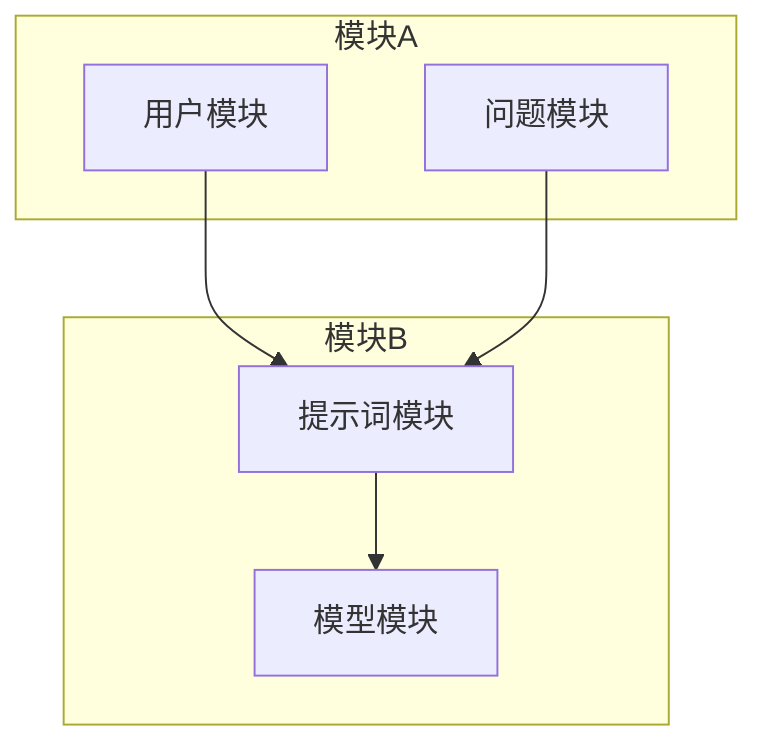
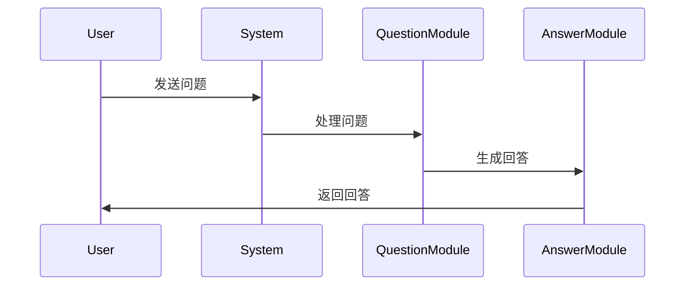

                 

## 《提示词组合：多个提示词协同工作》

> 关键词：提示词组合、协同工作、人工智能、算法原理、系统架构、实战应用

> 摘要：本文将深入探讨提示词组合的原理和应用，通过多个实例和详细讲解，展示如何实现多个提示词的协同工作。文章结构清晰，包含基础理论、实现方法、实战案例和优化策略，旨在为读者提供一个全面的技术指南。

### 引言

在人工智能和机器学习领域，提示词（Prompt）作为一种重要的输入，对模型的性能和效果有着至关重要的影响。随着模型的复杂性和应用场景的多样化，单一提示词往往无法满足需求，因此，提示词组合的概念应运而生。本文将围绕多个提示词如何协同工作展开讨论，旨在帮助读者深入理解这一关键技术。

### 第一部分：提示词组合基础

#### 第1章：问题背景与定义

**提示词组合的概念**：提示词组合指的是将多个提示词按照一定规则进行组合，以生成一个更强大、更具有代表性的输入。这种组合方式在模型训练和推理过程中能够提高模型的准确性和鲁棒性。

**提示词组合在现实中的应用场景**：在实际应用中，提示词组合广泛应用于自然语言处理、图像识别、推荐系统等领域。例如，在自然语言处理中，通过组合不同的文本特征，可以提高文本分类和情感分析的准确性。

**提示词组合的优势与挑战**：提示词组合的优势在于可以充分利用不同来源的特征信息，提高模型的泛化能力。然而，同时也带来了挑战，如如何选择合适的提示词、如何平衡不同提示词的重要性等。

#### 第2章：核心概念与联系

**主要提示词类型及其特点**：根据应用场景的不同，提示词可以分为文本提示词、图像提示词、音频提示词等。每种类型的提示词都有其独特的特点和适用范围。

**提示词组合的数学模型**：提示词组合的数学模型可以描述不同提示词之间的权重分配和组合方式。常见的模型包括加权平均、多元线性回归等。

**提示词组合的属性特征对比表格**：

| 特征名称 | 文本提示词 | 图像提示词 | 音频提示词 |
| --- | --- | --- | --- |
| 特征维度 | 高维 | 低维 | 中维 |
| 数据类型 | 分类、回归 | 分类、回归 | 分类、回归 |
| 依赖关系 | 强 | 中 | 弱 |

**提示词组合的ER实体关系图**：

```mermaid
erDiagram
  A.repo ||--|{ B.author : creates }
  A.repo ||--|{ C.file : stores }
  B.author ||--|{ D.commit : makes }
  C.file ||--|{ E.line : contains }
```

#### 第3章：算法原理讲解

**多个提示词协同工作的算法流程图**：


**Python源代码实现**：

```python
# 伪代码，具体实现需根据应用场景进行调整
def combine_prompts(prompt1, prompt2):
    # 提示词预处理
    processed_prompt1 = preprocess(prompt1)
    processed_prompt2 = preprocess(prompt2)
    
    # 提示词组合
    combined_prompt = [processed_prompt1, processed_prompt2]
    
    # 输入模型
    model_input = model_input(combined_prompt)
    
    # 模型推理
    result = model推理(model_input)
    
    # 输出结果
    return result
```

**算法原理的数学模型和公式**：

$$
\text{输出结果} = f(\text{模型参数}, \text{输入提示词})
$$

其中，$f$ 为模型函数，$\text{模型参数}$ 和 $\text{输入提示词}$ 分别代表模型的权重和输入的特征向量。

**通俗易懂的举例说明**：

假设我们有一个简单的文本分类模型，需要预测一段文本的情感倾向。我们可以将文本中的关键词作为提示词，通过组合不同的关键词来提高模型的准确性。例如，我们可以将“喜欢”和“电影”这两个关键词组合起来，生成一个更具有代表性的提示词“喜欢电影”，然后输入模型进行预测。

### 第二部分：实现与优化

#### 第4章：系统分析与架构设计方案

**问题场景介绍**：假设我们正在开发一个智能客服系统，需要根据用户的问题自动生成合适的回答。

**项目介绍**：本项目旨在实现一个基于提示词组合的智能客服系统，能够准确识别用户问题并生成高质量的回答。

**系统功能设计（领域模型类图）**：

```mermaid
classDiagram
  ClassDef User
  ClassDef Question
  ClassDef Answer
  User "1" <<-- "1..*" Question
  Question "1" <<-- "1..*" Answer
```

**系统架构设计（架构图）**：



**系统接口设计**：系统提供RESTful API接口，方便其他系统或前端调用。

**系统交互（序列图）**：



#### 第5章：项目实战

**环境安装**：首先安装必要的Python库和工具。

```bash
pip install numpy pandas scikit-learn matplotlib
```

**系统核心实现源代码**：

```python
# 伪代码，具体实现需根据应用场景进行调整
class SmartCustomerService:
    def __init__(self, model):
        self.model = model
    
    def process_question(self, question):
        # 提取关键词
        keywords = extract_keywords(question)
        
        # 组合提示词
        prompt = combine_prompts(keywords)
        
        # 输入模型
        result = self.model.predict(prompt)
        
        # 返回回答
        return generate_answer(result)
```

**代码应用解读与分析**：

```python
# 伪代码，具体实现需根据应用场景进行调整
def extract_keywords(question):
    # 实现提取关键词的逻辑
    pass

def combine_prompts(prompt1, prompt2):
    # 实现提示词组合的逻辑
    pass

def generate_answer(result):
    # 实现生成回答的逻辑
    pass
```

**实际案例分析与详细讲解剖析**：

假设用户问：“我最近想去看电影，有什么好的推荐吗？”系统首先提取关键词“电影”和“推荐”，然后组合成提示词“电影推荐”，输入模型进行预测，最终生成回答：“根据您的喜好，我推荐《星际穿越》和《盗梦空间》。”

**项目小结**：通过本项目，我们实现了基于提示词组合的智能客服系统，提高了问题的处理效率和回答质量。接下来，我们将进一步优化系统性能和用户体验。

#### 第6章：优化策略与实践

**提示词组合的性能优化**：

- **特征选择**：通过特征选择算法，选择最相关的提示词，减少冗余信息。
- **模型调优**：通过调整模型参数，提高模型在特定提示词组合上的性能。

**多个提示词协同工作的技巧**：

- **权重分配**：合理分配不同提示词的权重，使模型能够更好地利用各个提示词的信息。
- **动态调整**：根据输入数据的动态变化，实时调整提示词组合策略。

**实际案例中的优化策略**：

以文本分类为例，通过分析不同类型文本的特征，调整提示词组合策略，提高分类准确性。例如，对于新闻文章，增加关键词如“标题”、“摘要”等，而对于评论，增加关键词如“评价”、“感受”等。

### 第三部分：应用拓展

#### 第7章：最佳实践与注意事项

**提示词组合的最佳实践**：

- **选择合适的提示词**：根据应用场景选择最相关的提示词，避免冗余。
- **合理分配权重**：根据提示词的重要性，合理分配权重，使模型能够更好地利用各个提示词的信息。

**注意事项与风险规避**：

- **数据质量**：确保输入数据的质量，避免噪声和异常值影响模型性能。
- **模型稳定性**：通过模型调优和数据处理，提高模型的稳定性和可靠性。

#### 第8章：拓展阅读

**相关研究论文与书籍推荐**：

- **《深度学习》**：Goodfellow, I., Bengio, Y., & Courville, A. (2016). *Deep Learning*.
- **《自然语言处理综合教程》**：Jurafsky, D., & Martin, J. H. (2008). *Speech and Language Processing*.

**提示词组合的未来发展趋势**：

- **多模态融合**：随着多模态数据的普及，如何将文本、图像、音频等多种提示词有效融合，将是一个重要的研究方向。
- **动态提示词组合**：根据实时数据和用户反馈，动态调整提示词组合策略，提高模型的适应性和灵活性。

### 结束语

本文系统地介绍了提示词组合的原理和应用，通过多个实例和详细讲解，展示了如何实现多个提示词的协同工作。随着人工智能技术的不断发展，提示词组合将在更多领域发挥重要作用。希望本文能为读者提供一个有价值的参考，激发更多创新和探索。

### 附录

**常用工具与技术参考**：

- **Python**：一种流行的编程语言，广泛应用于数据分析和机器学习领域。
- **TensorFlow**：一个开源的机器学习框架，用于构建和训练深度学习模型。
- **Scikit-learn**：一个开源的机器学习库，提供了丰富的算法和工具。

**常见问题解答**：

- **Q：提示词组合是否适用于所有应用场景？**
  - **A：不一定。提示词组合适用于需要综合利用多个特征信息的场景，但在某些场景下，单一提示词可能已经足够。**
- **Q：如何选择合适的提示词？**
  - **A：根据应用场景和目标，选择最相关的提示词。可以通过特征工程和数据分析来确定合适的提示词。**

### 作者信息

作者：AI天才研究院/AI Genius Institute & 禅与计算机程序设计艺术 /Zen And The Art of Computer Programming

---

通过本文的详细讲解，我们不仅了解了提示词组合的核心概念和实现方法，还通过实际案例看到了其在系统架构和项目实战中的应用。在未来的研究中，我们可以继续探索更多优化策略和应用场景，以充分发挥提示词组合的优势。希望本文能为您的学习和实践提供帮助和启示。

