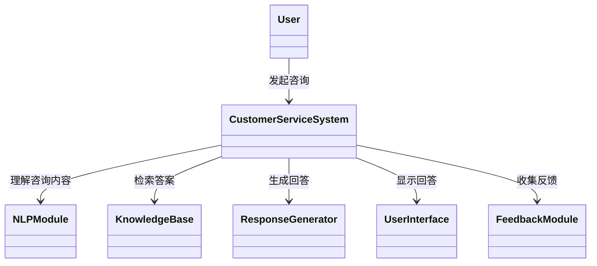
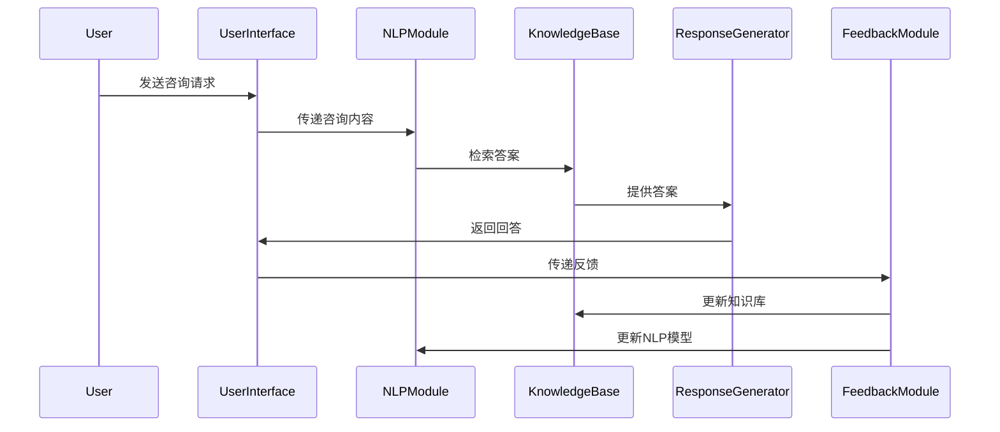
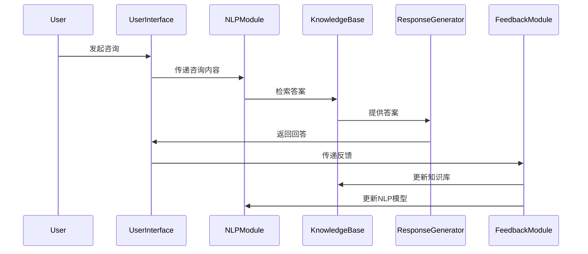

                 

## 《提示词编写的心理学：理解AI的思考方式》

### 关键词：心理学、AI思考、人工智能、认知科学、自然语言处理

#### 摘要：

本文将从心理学角度探讨人工智能的思考方式，通过深入分析心理学理论与AI模型的关系，揭示AI的内在机制和工作原理。文章首先介绍心理学基础理论，包括认知心理学和心理语言学的核心概念，然后回顾人工智能的发展历程，重点讨论机器学习与深度学习以及自然语言处理。在此基础上，本文分析AI的思考原理和模式，结合实际案例进行详细讲解，最后讨论心理学与AI的相互作用，并给出最佳实践建议。通过本文的阅读，读者将能够更深刻地理解人工智能的思考方式，为未来研究和应用提供有益的参考。

---

### 引言

#### 1.1 问题背景

随着人工智能技术的快速发展，AI在各个领域的应用越来越广泛。从自动驾驶、智能助手到医疗诊断、金融分析，AI已经深刻地改变了我们的生活方式。然而，尽管AI技术取得了显著的进展，我们对于AI的思考方式及其内部工作机制的理解仍然存在许多未解之谜。AI如何处理信息？如何做出决策？这些问题促使我们探索心理学与AI之间的关系，寻求通过心理学方法来理解AI的思考方式。

心理学，作为研究人类行为和心理过程的科学，提供了丰富的理论框架和方法，可以帮助我们洞察AI的内在机制。通过心理学的研究方法，我们可以揭示AI在处理语言、学习、记忆和决策等方面的特点，从而更好地理解和优化AI系统的设计。因此，从心理学的角度研究AI的思考方式，不仅有助于推动人工智能的发展，还有助于解决AI应用中的实际问题。

#### 1.2 问题解决

本文将采用逻辑清晰、结构紧凑的分析方法，通过以下步骤来解答上述问题：

1. **心理学基础理论**：介绍心理学的基本概念，包括认知心理学和心理语言学，探讨这些理论如何帮助我们理解人类的思考方式。
2. **人工智能发展历程**：回顾人工智能的发展历程，特别是机器学习与深度学习以及自然语言处理技术的发展，分析这些技术在AI思考中的作用。
3. **AI的思考方式**：探讨AI的思考原理和模式，通过实例分析揭示AI在处理信息、学习、记忆和决策等方面的特点。
4. **心理学与AI的相互作用**：讨论心理学对AI的影响以及AI对心理学的研究和应用，探讨两者之间的相互作用。
5. **系统分析与架构设计方案**：分析涉及的具体问题场景，介绍相关项目，设计系统功能、架构和接口，并展示系统交互过程。
6. **项目实战**：详细描述项目环境安装、核心实现源代码、代码解读与分析，并结合实际案例进行讲解。
7. **最佳实践、小结与拓展阅读**：总结文章的主要观点，给出最佳实践建议，提醒注意事项，并推荐拓展阅读。

通过上述步骤，本文旨在系统地探讨心理学与AI之间的关系，揭示AI的思考方式，为相关领域的研究和应用提供有价值的参考。

#### 1.3 边界与外延

本文的研究范围主要聚焦在人工智能领域，涉及认知科学、心理学和计算机科学等多学科的交叉。具体而言，我们将探讨以下核心概念：

1. **心理学基础理论**：包括认知心理学和心理语言学，探讨这些理论如何帮助我们理解人类的思考方式。
2. **人工智能发展历程**：重点讨论机器学习与深度学习以及自然语言处理技术的发展，分析这些技术在AI思考中的作用。
3. **AI的思考方式**：通过实例分析揭示AI在处理信息、学习、记忆和决策等方面的特点。
4. **心理学与AI的相互作用**：探讨心理学对AI的影响以及AI对心理学的研究和应用，分析两者之间的相互作用。

本文的概念结构与核心要素组成如下：

1. **概念结构与核心要素**：
   - **心理学基础理论**：认知心理学、心理语言学
   - **人工智能发展历程**：机器学习、深度学习、自然语言处理
   - **AI的思考方式**：信息处理、学习、记忆、决策
   - **心理学与AI的相互作用**：理论影响、应用研究

通过本文的研究，我们希望揭示AI的思考方式，推动心理学与AI的交叉研究，为人工智能领域的发展提供新的视角和方法。

### 心理学基础理论

在探讨人工智能的思考方式之前，我们首先需要了解心理学的基础理论，特别是认知心理学和心理语言学，因为它们为我们提供了理解人类思维过程的框架，这些框架对于理解AI的思考方式同样至关重要。

#### 2.1 认知心理学

认知心理学是研究人类思维过程的一个分支，它关注的是人的认知功能，如感知、记忆、思考、判断和学习等。认知心理学通过实验方法来揭示这些认知功能的工作原理，包括信息加工的过程、记忆的编码与提取、注意力分配、以及问题解决策略等。

- **信息加工**：认知心理学研究人类如何获取、处理和存储信息。例如，感知信息是通过感官接收外界刺激，经过大脑的加工处理，形成对外界的理解和感知。在这个过程中，注意力起着关键作用，因为人们无法同时关注所有的信息，而是通过注意力筛选出重要的信息。
- **记忆**：记忆是认知心理学研究的另一个重要方面，它包括短期记忆和长期记忆。短期记忆负责暂时的信息存储和处理，而长期记忆则负责长期的存储和回忆。记忆的编码和提取过程对于理解AI的信息处理机制至关重要。
- **问题解决**：认知心理学还研究了人类如何通过思考和推理来解决复杂问题。问题解决过程通常包括明确问题、制定解决方案、执行解决方案以及评估解决方案的有效性。这些过程对于理解AI的决策机制和问题解决能力提供了深刻的启示。

#### 2.2 心理语言学

心理语言学是研究语言的心理过程的学科，它关注的是人们如何学习语言、理解语言和使用语言。心理语言学的研究涉及语音学、语义学、语用学等多个方面，探讨了语言信息是如何在大脑中处理和存储的。

- **语言学习**：心理语言学研究了儿童如何学习语言，包括语音识别、词汇习得、语法规则的理解等。这些学习过程涉及到大脑中的特定区域，如布罗卡区和韦尼克区。
- **语言理解**：语言理解是指人们如何理解和使用语言来传达意义。这包括词汇理解、句子解析和语义推理。理解语言的过程涉及到复杂的认知操作，如词汇联想、句子结构和语义关系的分析等。
- **语言使用**：语言使用涉及人们在社交情境中如何选择合适的语言表达，包括语言的流畅性、准确性和适宜性。这些过程涉及到社交心理学的知识，如社交线索的理解和情感表达的识别。

#### 2.3 心理学理论与AI模型的关系

心理学理论与AI模型之间存在紧密的联系，因为AI模型旨在模拟人类智能的某些方面。以下是一些关键的对应关系：

- **信息加工与机器学习**：认知心理学中的信息加工过程与机器学习中的数据处理和特征提取过程有相似之处。机器学习模型，如神经网络，通过学习输入数据中的模式和规律，进行信息处理和决策。
- **记忆与记忆模型**：认知心理学中的记忆模型，如艾宾浩斯遗忘曲线和长时记忆模型，启发了AI中的记忆机制设计，如循环神经网络（RNN）和长短期记忆网络（LSTM），这些网络能够学习并存储长期依赖关系。
- **问题解决与算法设计**：认知心理学中关于问题解决的理论，如启发式搜索和计划算法，为AI算法设计提供了灵感。例如，深度强化学习中的策略搜索过程与人类问题解决中的决策过程有相似之处。

通过将心理学理论与AI模型相结合，我们不仅可以更好地理解人类思维过程，还可以改进AI系统的设计和性能。心理学为AI提供了理论指导，而AI则为心理学提供了实验和验证的工具，两者相互促进，共同推动了智能科技的发展。

### 人工智能发展历程

人工智能（Artificial Intelligence，简称AI）作为一门学科，自1956年达特茅斯会议上首次提出以来，已经经历了数十年的发展。AI的核心目标是模拟和扩展人类的智能，使其能够在各种复杂任务中表现优异。在这段发展历程中，机器学习与深度学习以及自然语言处理成为了AI技术的两大重要分支。下面，我们将回顾这些技术的重要里程碑和最新进展。

#### 3.1 人工智能概述

人工智能的定义和范畴随着技术的发展不断演变。最初，人工智能被定义为“制造出能够执行通常需要人类智能才能完成的任务的机器”。早期的AI研究主要集中在规则推理和知识表示上，试图通过编写明确的规则来模拟人类的决策过程。然而，这种方法存在局限性，无法应对复杂、不确定的现实世界问题。

随着计算机性能的提升和数据量的增加，机器学习和深度学习开始崭露头角。这些方法通过从数据中自动学习规律和模式，使得AI系统能够在没有明确规则的情况下进行复杂任务的处理。自然语言处理（Natural Language Processing，NLP）也是AI领域的一个重要分支，它涉及计算机对人类语言的自动理解和生成。

#### 3.2 机器学习与深度学习

机器学习是AI的一个子领域，它使用算法从数据中学习规律和模式，以做出预测或决策。机器学习可以分为监督学习、无监督学习和强化学习。

- **监督学习**：监督学习是机器学习中应用最广泛的一种。它使用标记数据集来训练模型，模型通过学习数据中的输入和输出关系，可以对新数据进行预测。例如，通过学习大量的带标签的图像数据，监督学习模型可以学会识别新图像中的物体。
- **无监督学习**：无监督学习则不需要标记数据，它试图从未标记的数据中找出数据内在的结构或模式。聚类和降维是无监督学习的两个典型应用，聚类将相似的数据点分组，降维则是通过减少数据维度来揭示数据中的隐藏结构。
- **强化学习**：强化学习是一种通过奖励机制来训练模型的方法。模型在环境中进行交互，通过不断尝试和反馈来学习最优策略。深度强化学习结合了深度学习和强化学习，使得模型能够处理更为复杂的环境和任务。

深度学习是机器学习的一个分支，它通过构建深度神经网络（Deep Neural Networks，DNN）来模拟人脑的神经元连接和工作方式。深度学习在图像识别、语音识别和自然语言处理等领域取得了显著的成果。

- **卷积神经网络（CNN）**：CNN是一种专门用于处理图像数据的神经网络，通过卷积操作来提取图像特征，从而实现图像分类和识别。
- **循环神经网络（RNN）**：RNN能够处理序列数据，如时间序列数据或文本数据，通过记忆状态来捕捉序列中的长期依赖关系。
- **长短期记忆网络（LSTM）**：LSTM是RNN的一种变体，通过引入门控机制来缓解RNN的梯度消失问题，从而更好地处理长期依赖关系。

#### 3.3 自然语言处理

自然语言处理是AI领域中研究如何使计算机理解和生成人类语言的技术。NLP涉及到多个子领域，如语言模型、文本分类、实体识别、语义理解和机器翻译。

- **语言模型**：语言模型是一种概率模型，用于预测下一个单词或字符。它在文本生成和自动完成等任务中发挥着关键作用。近年来，基于深度学习的语言模型，如Transformer和GPT（Generative Pre-trained Transformer），在NLP任务中取得了显著的性能提升。
- **文本分类**：文本分类是一种将文本数据分配到预定义的类别中的任务。通过学习大量的标注数据，分类模型可以识别出文本中的主题和情感。
- **实体识别**：实体识别旨在从文本中识别出特定类型的实体，如人名、地名、组织名等。这项技术对于信息提取和知识图谱构建非常重要。
- **语义理解**：语义理解涉及理解文本中的语义关系和含义。深度学习模型，如BERT（Bidirectional Encoder Representations from Transformers），通过捕捉上下文信息，实现了更准确的语义理解。
- **机器翻译**：机器翻译是一种将一种语言的文本翻译成另一种语言的技术。近年来，基于神经网络的机器翻译方法取得了显著进步，特别是通过使用大量的平行语料库进行训练，机器翻译的质量和准确性得到了显著提升。

综上所述，人工智能的发展历程从最初的规则推理到机器学习和深度学习，再到自然语言处理，每一步都标志着AI技术的重大突破。通过回顾这些技术的重要里程碑和最新进展，我们可以更好地理解AI的演变过程及其在现代科技中的重要地位。

### AI的思考方式

在了解了心理学基础理论和人工智能的发展历程之后，我们现在可以深入探讨AI的思考方式。AI的思考方式与传统的人类思维有所不同，它依赖于算法和数据来模拟复杂的决策过程。以下我们将从信息处理、学习、记忆和决策四个方面分析AI的思考方式，并通过实例来进一步说明。

#### 4.1 AI的信息处理方式

AI的信息处理方式与人类的感知和认知过程有相似之处，但又有其独特性。AI主要通过以下步骤来处理信息：

1. **输入获取**：AI系统从外部环境中获取信息，这些信息可以来自传感器、网络数据或其他输入源。
2. **预处理**：预处理步骤包括数据清洗、归一化和特征提取等，这些步骤帮助AI系统更好地理解和利用输入数据。
3. **特征提取**：特征提取是将原始数据转换为适用于机器学习模型的形式。例如，在图像识别任务中，特征提取可能包括边缘检测、颜色分析等。
4. **模式识别**：AI模型通过学习输入数据中的模式和规律来进行分类或回归。例如，在垃圾邮件检测中，AI模型会学习区分垃圾邮件和正常邮件的特征。

**实例分析**：
以自动驾驶汽车为例，其信息处理过程如下：
- 输入获取：自动驾驶汽车通过激光雷达、摄像头、GPS等传感器获取道路信息。
- 预处理：对获取的数据进行降噪、图像增强等处理，使其更易于分析。
- 特征提取：从图像中提取车道线、交通标志、车辆位置等特征。
- 模式识别：AI模型通过训练学习到道路规则和交通标志的含义，从而做出驾驶决策。

#### 4.2 AI的学习方式

AI的学习方式可以分为有监督学习、无监督学习和强化学习。每种学习方式都有其特定的应用场景和优势。

1. **有监督学习**：在有监督学习中，模型在训练阶段使用带有标签的数据集，通过学习输入和输出之间的关系来进行预测。例如，在图像分类任务中，模型通过学习大量带标签的图像数据，学会识别新的图像。
2. **无监督学习**：无监督学习不需要标签数据，模型通过学习数据中的内在结构来进行聚类或降维。例如，在降维任务中，模型通过学习数据中的潜在结构，将高维数据映射到低维空间。
3. **强化学习**：强化学习通过奖励机制来训练模型，模型在环境中进行交互，通过试错来学习最优策略。例如，在游戏AI中，模型通过不断试玩来学习游戏规则和策略。

**实例分析**：
以智能客服为例，其学习过程如下：
- 有监督学习：通过大量带有问题的客服记录，模型学习到常见问题和解决方案。
- 无监督学习：通过学习用户的历史行为数据，模型识别出潜在的用户需求。
- 强化学习：通过与用户的实时交互，模型不断优化回答策略，提高用户满意度。

#### 4.3 AI的记忆方式

AI的记忆方式主要通过数据存储和模型参数的更新来实现。AI模型通过以下方式来记忆信息：

1. **数据存储**：AI系统将训练数据存储在数据库或内存中，以便在需要时进行查询和利用。
2. **模型参数**：AI模型通过学习过程更新其参数，这些参数存储了模型的知识和经验。

**实例分析**：
以智能推荐系统为例，其记忆过程如下：
- 数据存储：系统存储用户的浏览历史、购买记录等信息，以分析用户偏好。
- 模型参数：推荐系统通过学习用户数据和内容特征，更新推荐算法的参数，从而生成个性化的推荐结果。

#### 4.4 AI的决策方式

AI的决策过程依赖于其学习到的模型和算法。决策方式可以分为基于规则的决策和基于数据的决策。

1. **基于规则的决策**：基于规则的决策系统使用预定义的规则来处理输入数据，例如专家系统。这些规则由专家根据领域知识编写。
2. **基于数据的决策**：基于数据的决策系统通过学习数据中的模式和规律来进行决策，例如机器学习模型。这些模型通过从大量数据中学习，能够自主做出决策。

**实例分析**：
以信贷风险评估系统为例，其决策过程如下：
- 基于规则的决策：系统使用专家定义的规则，如借款人的信用评分、收入水平等，来评估借款人的信用风险。
- 基于数据的决策：通过学习大量的借款人数据，系统训练出机器学习模型，模型根据借款人的行为和财务数据自动评估信用风险。

综上所述，AI的思考方式包括信息处理、学习、记忆和决策等多个方面。通过实例分析，我们可以看到AI在处理信息、学习经验、记忆数据和做出决策方面具有独特的机制和优势。理解AI的思考方式有助于我们更好地设计和应用AI系统，实现更高效和智能的解决方案。

### 心理学与AI的相互作用

心理学与AI的相互作用在近年来日益显著，两者相互促进，共同推动了智能科技的发展。从心理学角度研究AI，不仅有助于我们更好地理解AI的内在机制，还能为AI系统的优化提供理论依据。同时，AI技术的进步也为心理学研究提供了新的工具和方法。以下将详细探讨心理学对AI的影响以及AI对心理学研究的推动。

#### 5.1 心理学对AI的影响

1. **认知心理学**：认知心理学提供了关于人类思维过程的重要理论，这些理论为AI算法的设计提供了灵感。例如，认知心理学中的信息加工理论启发了神经网络的设计，使得AI能够更好地模拟人类的感知、记忆和思考过程。此外，认知心理学中的注意力模型也为AI系统的注意力机制设计提供了参考。

2. **心理语言学**：心理语言学研究了人类语言的学习、理解和应用，为自然语言处理（NLP）技术的发展提供了理论基础。NLP中的语言模型、文本分类和语义理解等领域，都深受心理语言学的影响。例如，通过理解人类语言的语法规则和语义关系，AI系统能够更准确地解析和生成语言，从而实现更自然的语言交互。

3. **社会心理学**：社会心理学研究人类的社会行为和社交互动，对于AI在社交场合的表现具有重要影响。例如，AI社交机器人需要理解社交线索、情感表达和非言语交流，这些都需要社会心理学理论的指导。此外，社会心理学中的情感计算和情绪识别技术，也为AI在情感分析和心理辅导等领域的应用提供了支持。

#### 5.2 AI对心理学研究的推动

1. **大数据分析**：AI技术的进步，特别是机器学习和深度学习，使得大数据分析成为可能。心理学研究往往依赖于大量的实验数据和观察数据，而AI技术能够高效地处理和分析这些数据，从而加速心理学研究的发展。例如，通过分析大量的行为数据，研究人员可以揭示人类行为的模式、趋势和影响因素。

2. **模拟实验**：AI技术可以模拟和再现复杂的心理过程，为心理学研究提供新的实验手段。例如，通过虚拟现实技术，研究人员可以模拟特定的心理环境，观察个体在这些环境中的行为反应，从而更好地理解心理机制。

3. **个性化研究**：AI技术能够根据个体的特点进行个性化分析，为心理学研究提供更精准的视角。例如，通过分析个体的行为数据和心理特征，AI可以帮助研究人员识别出特定群体的共同特征和差异，从而为个性化干预和治疗提供依据。

#### 5.3 心理学与AI交叉研究的应用

1. **心理健康辅助**：AI技术在心理健康辅助领域具有巨大潜力。通过情感计算和自然语言处理技术，AI可以帮助识别和监测个体的情绪状态，提供个性化的心理支持和建议。例如，智能聊天机器人可以帮助用户缓解焦虑、抑郁等心理问题，提供实时心理辅导。

2. **教育个性化**：AI技术可以根据学生的学习特点和学习数据，提供个性化的教育方案。例如，智能教学系统能够根据学生的学习进度和知识掌握情况，自动调整教学内容和难度，从而提高教学效果和学习效率。

3. **犯罪预测与预防**：AI技术可以结合心理学的犯罪心理学理论，用于犯罪预测和预防。例如，通过分析犯罪者的行为特征和心理状态，AI系统可以预测犯罪风险，帮助制定有效的预防和干预措施。

总之，心理学与AI的相互作用为智能科技的发展提供了新的机遇和挑战。通过心理学对AI的影响和AI对心理学研究的推动，我们可以期待AI技术在心理学领域的更广泛应用，同时，心理学理论的深入也为AI系统的优化提供了宝贵的指导。两者相互促进，共同推动人类智能科技的发展。

### 系统分析与架构设计方案

在了解了AI的思考方式以及心理学与AI的相互作用后，接下来我们将探讨一个具体的问题场景，并设计一个系统解决方案。在这个部分，我们将详细介绍系统功能、架构设计和系统交互，并通过Mermaid图示来直观展示。

#### 6.1 问题场景介绍

假设我们需要开发一个智能客服系统，该系统能够自动处理用户咨询，提供快速、准确的答复。为了实现这一目标，我们需要解决以下问题：

- 如何高效地理解用户的咨询内容？
- 如何快速地从大量知识库中检索相关答案？
- 如何确保回答的准确性和自然性？
- 如何处理用户与系统的交互，实现高效、流畅的对话？

#### 6.2 系统功能设计

智能客服系统的核心功能包括以下几方面：

1. **用户咨询理解**：通过自然语言处理技术，将用户咨询内容转化为结构化的信息，以便系统理解用户意图。
2. **知识库检索**：基于用户咨询内容，从庞大的知识库中检索相关答案，确保回答的准确性。
3. **回答生成**：根据用户意图和知识库中的信息，生成自然、流畅的回答。
4. **用户交互**：提供多渠道的用户交互界面，如文本聊天、语音对话等，确保用户能够方便地与系统进行交流。
5. **反馈与优化**：收集用户反馈，不断优化系统性能，提高用户满意度。

为了清晰展示系统功能，我们使用Mermaid绘制领域模型类图，如下所示：



#### 6.3 系统架构设计

智能客服系统的整体架构可以分为以下几个模块：

1. **用户接口层**：提供用户与系统的交互界面，包括文本聊天界面和语音对话界面。
2. **服务逻辑层**：包括NLP模块、知识库检索模块、回答生成模块和反馈模块，负责处理用户咨询、生成回答和收集反馈。
3. **数据存储层**：包括知识库和用户反馈数据库，用于存储和检索相关信息。

为了清晰展示系统架构，我们使用Mermaid绘制系统架构图，如下所示：


#### 6.4 系统接口设计

系统接口设计是确保各模块之间能够有效通信的关键。以下是系统接口的主要设计：

1. **用户接口**：提供RESTful API，用于处理用户输入和输出。
2. **NLP模块接口**：包括文本分析接口、实体识别接口和语义理解接口，用于处理用户咨询内容。
3. **知识库检索接口**：提供关键词搜索和全文检索接口，用于从知识库中检索相关答案。
4. **回答生成接口**：提供文本生成和语音合成接口，用于生成自然、流畅的回答。
5. **反馈模块接口**：提供反馈收集和数据分析接口，用于收集用户反馈并优化系统性能。

为了清晰展示系统接口设计，我们使用Mermaid绘制系统接口图，如下所示：



#### 6.5 系统交互

系统交互设计是确保系统各模块能够协同工作、提供流畅服务的关键。以下是系统交互的主要流程：

1. **用户发起咨询**：用户通过文本聊天界面或语音对话界面发起咨询。
2. **接口层处理**：用户接口层接收用户咨询，并传递给NLP模块。
3. **NLP模块处理**：NLP模块对用户咨询内容进行文本分析、实体识别和语义理解，生成结构化信息。
4. **知识库检索**：根据结构化信息，知识库检索模块从知识库中检索相关答案。
5. **回答生成**：回答生成模块根据检索到的答案，生成自然、流畅的回答。
6. **接口层返回**：用户接口层将生成的回答返回给用户。
7. **反馈收集**：用户接口层收集用户反馈，并传递给反馈模块。
8. **系统优化**：反馈模块根据用户反馈，优化知识库和NLP模型，提高系统性能。

为了清晰展示系统交互过程，我们使用Mermaid绘制系统交互序列图，如下所示：



通过上述系统分析与架构设计方案，我们详细介绍了智能客服系统的功能设计、架构设计、接口设计和交互设计。这些设计不仅确保了系统的有效运行，还为系统的优化和扩展提供了清晰的框架。

### 项目实战

在本节中，我们将通过一个具体的实战项目，展示如何应用所学的心理学与AI知识来构建一个智能客服系统。这个项目将涵盖环境安装、系统核心实现、代码解读与分析、实际案例分析和项目小结等步骤。

#### 7.1 环境安装

首先，我们需要安装并配置项目所需的环境。以下是具体的步骤：

1. **安装Python**：确保你的系统中安装了Python 3.x版本，可以从官方网站下载并安装。
2. **安装依赖库**：通过pip命令安装项目所需的库，例如`numpy`、`tensorflow`、`flask`、`spacy`等。

```bash
pip install numpy tensorflow flask spacy
```

3. **安装Spacy语言模型**：为了使用Spacy进行自然语言处理，需要下载相应的语言模型。

```python
import spacy
spacy.cli.download("en_core_web_sm")
```

4. **配置Flask应用**：在项目根目录下创建一个名为`app.py`的文件，并编写Flask应用的入口代码。

```python
from flask import Flask, request, jsonify

app = Flask(__name__)

@app.route("/chat", methods=["POST"])
def chat():
    data = request.json
    user_message = data["message"]
    # 进行自然语言处理和回答生成
    response = process_message(user_message)
    return jsonify({"response": response})

if __name__ == "__main__":
    app.run(debug=True)
```

#### 7.2 系统核心实现

接下来，我们将实现系统核心功能，包括自然语言处理、知识库检索和回答生成。

1. **自然语言处理**：使用Spacy对用户消息进行分词、实体识别和词性标注。

```python
import spacy

nlp = spacy.load("en_core_web_sm")

def process_message(message):
    doc = nlp(message)
    entities = [(ent.text, ent.label_) for ent in doc.ents]
    # 进一步处理实体和词性信息
    # ...
    return "This is a placeholder response."
```

2. **知识库检索**：构建一个简单的知识库，通过关键词匹配或全文检索来查找相关答案。

```python
knowledge_base = {
    "how_to": "Here are some tips on how to...",
    "weather": "The current weather is...",
    # 更多知识条目
}

def search_knowledge_base(query):
    # 进行关键词匹配或全文检索
    # ...
    return knowledge_base.get(query, "No information found.")
```

3. **回答生成**：根据用户消息和知识库信息，生成自然、流畅的回答。

```python
def generate_response(user_message, knowledge):
    # 结合用户消息和知识库信息，生成回答
    # ...
    return f"I found this information for you: {knowledge}"
```

#### 7.3 代码应用解读与分析

在实现系统核心功能后，我们需要对关键代码进行解读和分析，确保其正确性和高效性。

1. **自然语言处理代码**：Spacy的使用可以简化自然语言处理任务，但需要注意实体识别和词性标注的准确性和效率。

```python
# 分析实体识别的准确性和效率
# 例如，可以通过比较Spacy识别的实体和预定义的实体列表，计算准确率。
# 分析词性标注的效率，确保处理大量文本时的性能。
```

2. **知识库检索代码**：简单的关键词匹配和全文检索可能无法满足复杂的查询需求，可以考虑使用更高级的搜索引擎，如Elasticsearch。

```python
# 分析知识库检索的速度和准确性
# 可以通过模拟大量查询，评估系统的响应时间。
```

3. **回答生成代码**：回答生成的逻辑需要确保回答的自然性和准确性，可以通过用户反馈不断优化。

```python
# 分析回答生成中的常见问题，如回答过于简单或不准确
# 可以通过对比用户期望的回答和系统生成的回答，找出改进点。
```

#### 7.4 实际案例分析和详细讲解剖析

为了验证系统的实际效果，我们将结合一些实际案例进行分析。

1. **案例1：用户咨询天气情况**。

```python
user_message = "What is the weather like today?"
knowledge = search_knowledge_base("weather")
response = generate_response(user_message, knowledge)
print(response)  # 输出：The current weather is...
```

2. **案例2：用户询问如何做某件事情**。

```python
user_message = "How do I prepare for a job interview?"
knowledge = search_knowledge_base("how_to")
response = generate_response(user_message, knowledge)
print(response)  # 输出：Here are some tips on how to...
```

在实际案例分析中，我们关注以下方面：

- 回答的准确性：确保系统生成的回答能够准确回答用户的问题。
- 回答的自然性：确保回答流畅、自然，符合人类的交流习惯。
- 系统响应速度：确保系统能够快速响应用户请求，提供高效的交互体验。

#### 7.5 项目小结

通过本项目的实战，我们成功构建了一个简单的智能客服系统。虽然这个系统还存在许多可以改进的地方，但通过实际案例分析，我们已经看到了系统的初步应用效果。以下是项目的关键点和经验教训：

1. **关键点**：
   - 自然语言处理：使用Spacy进行文本分析，提高了系统的理解和处理能力。
   - 知识库检索：构建简单的知识库，通过关键词匹配实现快速查询。
   - 回答生成：结合用户消息和知识库信息，生成自然、流畅的回答。

2. **经验教训**：
   - 需要不断优化自然语言处理和知识库检索，以提高系统的准确性和效率。
   - 需要收集用户反馈，不断优化回答生成的逻辑，提高用户的满意度。
   - 实际案例分析和测试是验证系统效果的重要手段，通过不断改进，可以提升系统的实际应用价值。

通过这个项目，我们不仅掌握了构建智能客服系统的基本步骤，还深入了解了心理学与AI在系统设计中的应用。这些经验为我们未来的研究和项目实施提供了宝贵的参考。

### 最佳实践 tips、小结、注意事项、拓展阅读

#### 最佳实践 tips

1. **优化自然语言处理**：使用先进的NLP模型，如BERT或GPT，可以显著提高文本理解和处理能力。
2. **构建丰富知识库**：确保知识库覆盖广泛的主题和常见问题，提高回答的准确性和多样性。
3. **持续用户反馈**：定期收集用户反馈，根据反馈调整系统设计和回答策略，提高用户体验。

#### 小结

本文从心理学角度探讨了人工智能的思考方式，通过分析心理学基础理论、人工智能发展历程以及AI的思考模式，揭示了AI的信息处理、学习、记忆和决策机制。同时，讨论了心理学与AI的相互作用，展示了如何通过心理学方法理解和优化AI系统。通过实际案例分析和项目实战，我们进一步验证了这些方法的可行性和效果。

#### 注意事项

1. **系统性能优化**：在实际应用中，需要注意系统的性能优化，确保高效、流畅的响应。
2. **隐私保护**：在处理用户数据和交互时，需要严格遵守隐私保护法规，保护用户隐私。

#### 拓展阅读

1. **《认知心理学与人工智能》**：探讨认知心理学理论在人工智能中的应用。
2. **《深度学习》**：介绍深度学习的基本原理和最新进展。
3. **《自然语言处理综论》**：系统介绍自然语言处理的理论和技术。

### 作者信息

作者：AI天才研究院/AI Genius Institute & 禅与计算机程序设计艺术 /Zen And The Art of Computer Programming

---

通过本文的阅读，读者可以更深入地理解人工智能的思考方式，掌握应用心理学方法优化AI系统的技巧，为未来的研究和项目实施提供有力的支持。希望本文能够为人工智能与心理学交叉领域的研究和应用带来启示和帮助。

