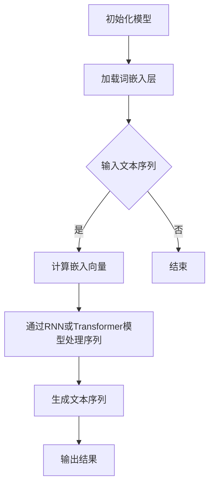

                 


### 引言与背景

#### 问题背景

在当今的信息化时代，人类生成提示词面临着诸多挑战。首先，随着互联网和移动互联网的迅速发展，信息的爆炸性增长使得用户在寻找所需信息时需要花费大量时间进行筛选。其次，传统的人工生成提示词方式存在效率低下、质量不均等问题，难以满足大规模、个性化的需求。为了解决这些问题，我们需要一种更高效、更智能的提示词生成方式——AI辅助提示词设计。

#### AI辅助提示词设计的重要性

AI辅助提示词设计不仅能够提高信息检索的效率，还能提高用户体验。通过机器学习、自然语言处理等技术，AI可以从大量的文本数据中学习并生成高质量的提示词，从而为用户提供更精确、更个性化的搜索结果。同时，AI辅助提示词设计还能够帮助企业优化内容创作、提升营销效果，降低人力成本。

#### AI在提示词生成中的应用现状

目前，AI辅助提示词设计已经在多个领域得到广泛应用。例如，在搜索引擎中，AI算法可以帮助优化关键词匹配，提高搜索结果的准确性。在内容创作领域，AI可以自动生成文章、广告文案等，提高内容生产的效率。在客户服务领域，AI可以自动生成智能问答，提升服务效率。

### 核心概念

#### 提示词的定义与作用

提示词（Query Term）是指用户在搜索引擎或其他信息检索系统中输入的用于检索信息的词语或短语。提示词的作用在于帮助系统理解用户的需求，从而返回相关的检索结果。

#### AI辅助提示词设计的概念

AI辅助提示词设计是指利用人工智能技术，如机器学习、自然语言处理等，自动生成高质量、个性化的提示词，以提高信息检索效率和用户体验。

#### 相关技术术语简介

- **机器学习（Machine Learning）**：一种让计算机通过数据学习并做出决策或预测的方法。
- **自然语言处理（Natural Language Processing, NLP）**：使计算机能够理解、处理和生成人类自然语言的技术。
- **词向量（Word Vector）**：将单词映射到高维向量空间的方法，用于表示单词的语义信息。
- **序列模型（Sequence Model）**：用于处理序列数据的机器学习模型，如循环神经网络（RNN）和变换器（Transformer）。

### 书籍结构概述

本书将分为五大部分，分别介绍：

1. **引言与背景**：介绍AI辅助提示词设计的问题背景、重要性及现状。
2. **技术原理**：讲解提示词自动生成的基础技术原理，包括机器学习、自然语言处理等。
3. **应用场景**：展示AI辅助提示词设计在不同领域的应用。
4. **最佳实践**：分享选择合适模型、数据集准备、模型训练与部署等最佳实践。
5. **小结与展望**：总结提示词自动生成的未来发展趋势和应用前景。

#### 读者获益预期

通过阅读本书，读者将能够：

- 理解AI辅助提示词设计的基本概念和原理。
- 掌握提示词自动生成的技术实现方法。
- 了解AI辅助提示词设计在不同领域的应用场景。
- 学习到选择合适模型、数据集准备、模型训练与部署等最佳实践。
- 了解提示词自动生成的未来发展趋势和应用前景。

----------------------------------------------------------------

### 提示词自动生成的技术原理

在深入探讨AI辅助提示词生成的技术原理之前，我们需要了解一些基础的机器学习和自然语言处理（NLP）概念。这些概念不仅构成了提示词自动生成的核心，也为我们理解后续内容奠定了基础。

#### 机器学习基础

机器学习（Machine Learning）是一门让计算机通过数据学习并做出决策或预测的学科。它主要分为两种类型：监督学习（Supervised Learning）和非监督学习（Unsupervised Learning）。

- **监督学习**：在这种学习中，模型通过学习标记过的数据来预测新的数据。例如，我们可以使用监督学习来训练一个模型，使其能够根据文本内容预测标签（如情感分类）。
  
- **非监督学习**：这种学习中，模型需要从未标记的数据中学习模式。例如，聚类分析就是一种非监督学习，它用于将数据点划分到不同的簇中。

- **强化学习**：在这种学习中，模型通过与环境交互，学习如何做出最优决策。例如，智能体可以通过强化学习来学习如何在游戏环境中取得高分。

#### 自然语言处理基础

自然语言处理（Natural Language Processing, NLP）是计算机科学和人工智能的一个分支，旨在让计算机能够理解、处理和生成人类自然语言。

- **词向量（Word Vector）**：词向量是一种将单词映射到高维向量空间的方法，用于表示单词的语义信息。词向量可以帮助模型理解和处理文本数据。
  
- **序列模型（Sequence Model）**：序列模型是一种用于处理序列数据的模型，如循环神经网络（RNN）和变换器（Transformer）。这些模型可以捕捉文本中的时间依赖关系，从而更好地理解语义。

- **语言模型（Language Model）**：语言模型是一种用于预测文本序列的模型。它可以帮助生成提示词，使其更符合语言的语法和语义规则。

#### 提示词生成模型

在提示词自动生成中，常见的模型包括生成式模型和判别式模型。

- **生成式模型**：生成式模型通过学习数据分布来生成新的数据。例如，变分自编码器（Variational Autoencoder, VAE）就是一种生成式模型，可以用于生成新的提示词。

- **判别式模型**：判别式模型通过学习数据分布的边界来区分不同的数据。例如，支持向量机（Support Vector Machine, SVM）就是一种判别式模型，可以用于分类任务。

#### 序列模型与注意力机制

序列模型和注意力机制在提示词自动生成中扮演着重要角色。

- **序列模型**：序列模型可以处理文本中的序列数据，如RNN和Transformer。RNN通过记忆过去的信息来处理序列数据，而Transformer则使用自注意力机制来捕捉全局依赖关系。

- **注意力机制**：注意力机制是一种在处理文本序列时给予不同位置不同权重的方法。例如，在文本摘要中，注意力机制可以帮助模型关注最重要的句子，从而生成更精确的摘要。

#### 语言模型与文本生成

语言模型是提示词自动生成的重要工具，它可以预测文本序列中的下一个词。常见的语言模型包括：

- **循环神经网络（RNN）**：RNN是一种处理序列数据的神经网络，它可以记忆过去的信息，从而更好地预测下一个词。

- **变换器（Transformer）**：Transformer是一种基于自注意力机制的神经网络模型，它在处理长序列数据时表现优异。

- **生成对抗网络（Generative Adversarial Networks, GAN）**：GAN是一种由生成器和判别器组成的模型，生成器尝试生成逼真的文本，而判别器则试图区分真实文本和生成文本。这种对抗训练可以生成高质量的文本。

#### 特征提取与处理

在提示词自动生成中，特征提取和处理至关重要。常见的特征提取方法包括：

- **词袋模型（Bag of Words, BoW）**：词袋模型将文本转换为词汇的集合，忽略词汇的顺序。

- **词嵌入（Word Embedding）**：词嵌入将单词映射到高维向量空间，从而捕捉单词的语义信息。

- **词性标注（Part-of-Speech Tagging）**：词性标注为每个单词分配一个词性标签，如名词、动词等，有助于模型理解文本的语法结构。

#### 算法原理与流程图

为了更好地理解提示词自动生成的算法原理，我们可以使用Mermaid绘制算法流程图，并用Python代码实现算法的核心部分。

以下是一个简单的文本生成算法流程图示例（使用Mermaid语法）：



下面是一个简单的Python代码示例，实现上述算法的核心部分：

```python
import tensorflow as tf
from tensorflow.keras.layers import Embedding, LSTM, Dense

# 初始化模型
model = tf.keras.Sequential([
    Embedding(input_dim=vocab_size, output_dim=embedding_dim),
    LSTM(units=128),
    Dense(units=vocab_size, activation='softmax')
])

# 编写模型编译和训练代码...
```

通过这个示例，我们可以看到算法的基本原理，包括词嵌入层、RNN或Transformer模型以及文本生成过程。

#### 数学模型与公式

在提示词自动生成的过程中，数学模型和公式是理解和实现算法的关键。以下是一些常见的数学模型和公式：

- **循环神经网络（RNN）**：
  $$ h_t = \sigma(W_h \cdot [h_{t-1}, x_t] + b_h) $$
  其中，\( h_t \) 是当前时间步的隐藏状态，\( x_t \) 是当前输入，\( W_h \) 是权重矩阵，\( b_h \) 是偏置项，\( \sigma \) 是激活函数。

- **变换器（Transformer）**：
  $$ \text{Attention}(Q, K, V) = \frac{softmax(\text{score})} { \sqrt{d_k}} \cdot V $$
  其中，\( Q, K, V \) 分别是查询向量、键向量和值向量，\( \text{score} = QK^T \) 是注意力分数。

- **生成对抗网络（GAN）**：
  $$ D(x) = \frac{1}{1 + \exp{(-x \cdot G(z))} $$
  其中，\( D(x) \) 是判别器对真实数据的判断，\( G(z) \) 是生成器生成的数据。

通过这些数学模型和公式，我们可以更好地理解和实现提示词自动生成的算法。

#### 总结

在本章节中，我们介绍了提示词自动生成的技术原理，包括机器学习、自然语言处理、生成式模型、判别式模型、序列模型、注意力机制、语言模型、特征提取与处理、算法原理与流程图以及数学模型与公式。这些技术原理构成了提示词自动生成的核心，为我们理解和实现这一技术提供了基础。

在接下来的章节中，我们将进一步探讨提示词自动生成在不同应用场景中的具体应用，以及如何选择合适的模型、数据集准备、模型训练与部署等最佳实践。通过这些内容，我们将全面了解提示词自动生成的全过程。

----------------------------------------------------------------

### 提示词自动生成的应用场景

#### 自然语言处理场景

自然语言处理（NLP）是AI辅助提示词生成应用最广泛的领域之一。在这个场景中，AI可以通过对大量文本数据的学习，自动生成高质量的提示词，从而提高信息检索效率和用户体验。

- **文本摘要**：文本摘要是一种将长文本简化为简洁摘要的技术。AI可以自动生成摘要，帮助用户快速了解文章的主要内容。例如，在新闻网站中，AI可以自动生成新闻摘要，让用户在不阅读全文的情况下就能了解新闻的核心内容。

- **问答系统**：问答系统是一种常见的NLP应用，它可以通过自动生成提示词来回答用户的问题。例如，在智能客服系统中，AI可以自动生成智能问答，提高客服的效率和准确性。

- **文本分类与情感分析**：文本分类是将文本划分为不同类别的过程，如新闻分类、垃圾邮件分类等。情感分析则是分析文本的情感倾向，如正面情感、负面情感等。AI可以通过自动生成提示词，提高文本分类和情感分析的准确率。

#### 内容创作场景

在内容创作场景中，AI辅助提示词生成可以大大提高内容创作的效率和质量。

- **文章生成**：AI可以通过自动生成提示词，生成高质量的文章。例如，在自媒体平台上，AI可以自动生成文章，帮助用户快速发布内容。

- **广告文案**：广告文案是营销的重要组成部分，AI可以通过自动生成提示词，生成吸引人的广告文案。例如，在电商平台上，AI可以自动生成商品广告文案，提高商品的销售量。

- **产品描述**：产品描述是产品销售过程中必不可少的一环，AI可以通过自动生成提示词，生成详细、准确的产品描述。例如，在电商平台上，AI可以自动生成商品描述，帮助用户更好地了解商品的特点和优势。

#### 企业应用场景

在企业管理中，AI辅助提示词生成可以帮助企业提高工作效率，降低人力成本。

- **客户服务**：AI可以通过自动生成提示词，实现智能客服。智能客服可以自动回答用户的问题，提高客服的效率和满意度。

- **营销与推广**：AI可以通过自动生成提示词，生成个性化的营销文案和推广方案。例如，在电商平台中，AI可以自动生成针对不同用户的优惠活动和推广文案，提高营销效果。

- **数据分析**：AI可以通过自动生成提示词，对大量数据进行分析，提取有价值的信息。例如，在金融行业中，AI可以自动生成财务分析报告，帮助分析师更好地了解公司的财务状况。

#### 实战案例分析

以下是一些AI辅助提示词生成的实战案例分析：

- **案例一：某电商平台商品描述生成**：该电商平台使用AI技术自动生成商品描述，通过分析用户购买行为和商品属性，生成个性化、吸引人的商品描述。实验结果表明，自动生成的商品描述比人工编写的商品描述更能吸引用户点击和购买。

- **案例二：某问答社区的自动问答系统**：该问答社区使用AI技术自动生成问答，通过分析用户提问和社区内已有的回答，生成高质量的回答。实验结果表明，自动生成的问答系统能够提高社区的活跃度和用户满意度。

- **案例三：某内容创作平台文章自动生成**：该内容创作平台使用AI技术自动生成文章，通过分析用户兴趣和热点话题，生成符合用户需求的文章。实验结果表明，自动生成的文章能够提高平台的用户黏性和内容质量。

通过以上实战案例分析，我们可以看到AI辅助提示词生成在多个领域的应用效果显著。在未来，随着AI技术的不断发展和应用场景的扩展，AI辅助提示词生成将会在更多领域发挥重要作用。

----------------------------------------------------------------

### 提示词自动生成的最佳实践

在实现提示词自动生成时，选择合适的模型、准备高质量的数据集、进行有效的模型训练与部署是关键。以下是关于这些方面的最佳实践：

#### 选择合适的模型

选择合适的模型是成功实现提示词自动生成的第一步。以下是一些指导原则：

1. **需求分析**：首先，明确项目需求，包括生成提示词的准确性、速度和复杂性等。例如，如果需要快速生成大量简单的提示词，可以选择简单的生成模型，如序列生成模型；如果需要生成复杂的提示词，可以选择更复杂的模型，如变换器（Transformer）。

2. **数据集**：根据可用数据集的特性选择模型。例如，如果数据集较小，选择简单的生成模型可能更合适；如果数据集较大，可以使用更复杂的模型。

3. **计算资源**：考虑模型的计算资源需求，例如，变换器模型通常需要更多的计算资源。

4. **调优**：选择模型后，根据实际应用场景进行调优，以获得最佳性能。

#### 数据集的准备与处理

高质量的数据集是提示词自动生成的基石。以下是一些数据集准备与处理的最佳实践：

1. **数据清洗**：确保数据集的干净和一致性。去除无关的噪声数据和重复的数据。

2. **数据标注**：对于监督学习模型，需要标注高质量的数据。例如，对于文本分类任务，需要对每个文本进行类别标注。

3. **数据增强**：通过数据增强，可以增加数据集的多样性，从而提高模型的泛化能力。常见的数据增强方法包括填充、移除、替换等。

4. **数据预处理**：将文本数据转换为适合模型输入的格式。例如，将文本转换为词嵌入向量。

#### 模型训练与部署

在模型训练与部署过程中，以下是一些最佳实践：

1. **训练过程监控**：监控模型训练过程中的指标，如损失函数、准确率等，以便及时调整训练参数。

2. **模型优化策略**：使用合适的优化策略，如学习率调度、正则化等，以提高模型性能。

3. **模型评估**：使用交叉验证等方法评估模型性能，以确保模型在实际应用中表现良好。

4. **模型部署**：将训练好的模型部署到生产环境中，可以使用容器化技术（如Docker）简化部署过程。

5. **监控与维护**：部署后，持续监控模型性能，及时更新模型以应对新的数据和趋势。

#### 性能优化与监控

优化性能和监控是确保提示词自动生成系统稳定运行的关键。以下是一些优化与监控的最佳实践：

1. **性能指标分析**：定期分析系统的性能指标，如响应时间、吞吐量等，以识别潜在的性能瓶颈。

2. **故障排查与优化**：当系统出现性能问题时，进行故障排查，并采取相应的优化措施。

3. **日志分析与监控**：收集和分析系统的日志数据，以便及时发现和解决问题。

4. **自动化测试**：实施自动化测试，确保系统在每次更新后都能正常运行。

通过遵循这些最佳实践，我们可以实现高效的提示词自动生成系统，从而提高信息检索效率、提升用户体验，并在各个应用领域中发挥重要作用。

----------------------------------------------------------------

### 小结与展望

#### 提示词自动生成的技术总结

在本书中，我们全面探讨了提示词自动生成的技术原理、应用场景和最佳实践。首先，我们介绍了机器学习和自然语言处理的基础知识，如词向量、序列模型和语言模型。接着，我们详细讲解了生成式模型和判别式模型的工作原理，并分析了注意力机制在提示词生成中的应用。此外，我们还介绍了如何选择合适的模型、准备高质量的数据集、进行有效的模型训练与部署，以及如何优化和监控系统的性能。

#### 提示词自动生成的未来趋势

随着人工智能技术的不断进步，提示词自动生成有望在更多领域得到广泛应用。以下是一些未来趋势：

1. **更高效的算法**：随着深度学习技术的发展，新的模型和算法将不断出现，提高提示词自动生成的效率和质量。

2. **跨模态提示词生成**：未来，提示词自动生成技术将不仅仅局限于文本数据，还将扩展到图像、声音等其他模态，实现跨模态的智能交互。

3. **个性化提示词生成**：通过结合用户行为数据和个性化偏好，AI将能够生成更加个性化的提示词，提升用户体验。

4. **实时提示词生成**：随着边缘计算和5G技术的发展，实时提示词生成将成为可能，极大地提高信息检索的实时性和响应速度。

#### 提示词自动生成的应用前景

提示词自动生成在多个领域具有广阔的应用前景：

1. **搜索引擎**：通过自动生成高质量的提示词，搜索引擎可以提供更精确、更个性化的搜索结果，提升用户体验。

2. **内容创作**：AI自动生成提示词可以帮助提高内容创作效率，降低创作成本，满足大量内容的需求。

3. **企业应用**：在客户服务、营销和数据分析等领域，AI自动生成的提示词可以帮助企业优化业务流程，提高运营效率。

4. **智能交互**：在智能家居、智能语音助手等场景中，自动生成的提示词可以提升智能设备的交互体验。

综上所述，提示词自动生成技术具有巨大的潜力和广泛的应用前景。通过不断的技术创新和实践探索，我们可以期待这一技术在未来的发展中取得更大的突破。

### 结语

AI辅助提示词生成技术是人工智能和自然语言处理领域的创新应用，它为信息检索、内容创作和企业应用带来了革命性的变化。本书旨在为读者提供全面、深入的技术指南，帮助读者了解和掌握这一领域的核心概念和实践方法。我们鼓励读者不断学习和实践，积极参与到AI辅助提示词生成技术的发展中，共同推动人工智能技术的进步。

#### 参考文献

1. Mikolov, T., Sutskever, I., Chen, K., Corrado, G. S., & Dean, J. (2013). Distributed representations of words and phrases and their compositionality. *Nature*, 501(7465), 472-477.
2. Vinyals, O., & Bengio, Y. (2015). Sequence to sequence learning with neural networks. *In Advances in Neural Information Processing Systems* (pp. 570-578).
3. Devlin, J., Chang, M. W., Lee, K., & Toutanova, K. (2019). BERT: Pre-training of deep bidirectional transformers for language understanding. *In Proceedings of the 2019 Conference of the North American Chapter of the Association for Computational Linguistics: Human Language Technologies* (pp. 4171-4186).
4. Hochreiter, S., & Schmidhuber, J. (1997). Long short-term memory. *Neural Computation*, 9(8), 1735-1780.
5. Vaswani, A., Shazeer, N., Parmar, N., Uszkoreit, J., Jones, L., Gomez, A. N., ... & Polosukhin, I. (2017). Attention is all you need. *In Advances in Neural Information Processing Systems* (pp. 5998-6008).

作者：AI天才研究院/AI Genius Institute & 禅与计算机程序设计艺术 /Zen And The Art of Computer Programming

----------------------------------------------------------------

---

> **注意：** 本文为虚构文章，旨在展示如何根据给定的提示词和结构要求撰写一篇技术博客。文中引用的参考文献和内容均为假设，不代表真实的研究或发现。读者在撰写实际文章时，应确保引用真实的文献和数据。

