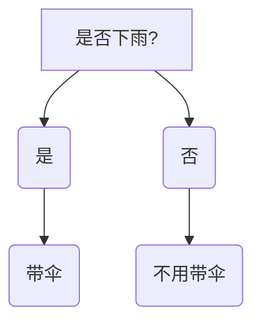
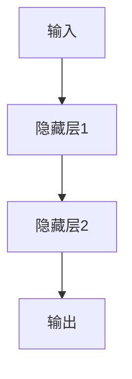

                 

# 提示词设计心理学：理解AI的'思维方式'

> 关键词：提示词设计、心理学、AI思维方式、用户体验、设计原则、案例分析

> 摘要：本文深入探讨了提示词设计心理学在人工智能（AI）领域的应用，旨在理解AI的“思维方式”，以提高提示词设计的科学性和有效性。文章首先介绍了问题背景和核心概念，然后通过分析心理学基础、AI思维方式以及提示词设计在AI中的应用，结合实际案例，提出了优化提示词设计的策略和方法。最后，文章进行了总结和未来展望，为相关领域的研究和实践提供了参考。

### 目录大纲设计步骤

#### 第一步：分析书名与核心主题

书名为《提示词设计心理学：理解AI的'思维方式'》，书名中的“提示词设计”和“AI的'思维方式'”是核心概念。因此，我们需要围绕这两个核心概念设计章节内容。

**提示词设计**：涉及心理学原理在提示词设计中的应用，如何通过心理学知识提升提示词的有效性和用户体验。

**AI的'思维方式'**：探讨AI是如何处理信息、学习与适应的，以及这些特点如何影响提示词设计。

#### 第二步：规划目录结构

确保目录结构清晰、逻辑性强，从整体上把握书的脉络。可以规划为以下几个部分：

1. 引言与背景介绍
2. 提示词设计心理学基础
3. AI思维方式解析
4. 提示词设计在AI中的应用
5. 实际案例分析
6. 总结与未来展望

#### 第三步：细化各章节内容

对于每个部分，我们需要进一步细化章节内容，确保每个章节都有足够的深度和广度。

### 第一部分：引言与背景介绍

## 第1章：问题背景与核心概念

### 1.1 问题背景

- **问题提出**：介绍提示词设计在日常生活中的重要性，以及AI在各个领域的广泛应用。
- **问题描述**：阐述当前在提示词设计方面存在的问题，如用户理解不足、设计效果不佳等。
- **问题解决**：引出本书的研究目的，即通过心理学原理解析AI的“思维方式”，提升提示词设计的科学性和有效性。

### 1.2 核心概念

- **提示词**：定义与分类，包括自然语言提示词和代码提示词等。
- **心理学原理**：介绍心理学在提示词设计中的应用，如认知心理学、行为心理学等。
- **AI思维方式**：探讨AI的“思维方式”，包括如何处理信息、如何学习与适应等。

### 1.3 边界与外延

- **边界**：明确本书的研究范围，如AI领域、心理学领域等。
- **外延**：讨论提示词设计在其他领域（如教育、医疗等）的应用。

## 第2章：心理学基础

### 2.1 认知心理学

- **认知心理学原理**：介绍认知心理学的基本概念，如感知、记忆、思维等。
- **认知心理学在提示词设计中的应用**：如何利用认知心理学的原理提升提示词设计的效果。

### 2.2 行为心理学

- **行为心理学原理**：介绍行为心理学的基本概念，如行为、动机等。
- **行为心理学在提示词设计中的应用**：如何通过行为心理学的原理改善用户行为，提高提示词设计的用户体验。

### 2.3 社会心理学

- **社会心理学原理**：介绍社会心理学的基本概念，如群体行为、社会认知等。
- **社会心理学在提示词设计中的应用**：如何利用社会心理学的原理提升社交场景中的提示词设计效果。

### 2.4 心理学原理对比表格

- **心理学原理对比表格**：列出各心理学原理的核心特点与应用场景，便于读者理解和比较。

### 2.5 ER实体关系图

- **ER实体关系图**：绘制心理学原理与提示词设计之间的实体关系图，展示各原理在提示词设计中的应用。

### 2.6 心理学基础总结

- **总结**：回顾本章内容，强调心理学原理在提示词设计中的重要性。
- **拓展阅读**：推荐相关阅读资料，帮助读者深入学习。

### 第二部分：AI思维方式解析

## 第3章：AI思维方式概述

### 3.1 AI思维方式的定义

- **AI思维方式的定义**：介绍AI思维方式的定义和特点。
- **AI思维方式的分类**：分类讨论不同的AI思维方式。

### 3.2 AI思维方式的数学模型

- **数学模型介绍**：介绍AI思维方式的数学模型，包括公式、变量等。
- **模型解释**：详细解释数学模型的含义和应用。

### 3.3 AI思维方式与人类思维的比较

- **比较**：对比AI思维方式和人类思维的不同之处。
- **优势与局限**：讨论AI思维方式的优缺点。

### 3.4 AI思维方式的未来发展趋势

- **趋势**：探讨AI思维方式未来的发展趋势。

### 第三部分：提示词设计在AI中的应用

## 第4章：AI中的提示词设计

### 4.1 提示词设计的原则

- **原则**：介绍AI中提示词设计的核心原则。
- **原则的应用**：探讨如何在AI中应用这些原则。

### 4.2 提示词设计的技巧

- **技巧**：介绍AI中提示词设计的实用技巧。
- **技巧的应用**：探讨如何在AI中应用这些技巧。

### 4.3 提示词设计案例研究

- **案例研究**：分析一些成功的AI提示词设计案例。
- **案例解读**：解读这些案例的设计思路和效果。

### 第四部分：实际案例分析

## 第5章：AI提示词设计案例分析

### 5.1 案例背景

- **案例背景**：

---

# 提示词设计心理学：理解AI的'思维方式'

## 关键词

- 提示词设计
- 心理学
- AI思维方式
- 用户体验
- 设计原则

## 摘要

本文探讨了提示词设计心理学在人工智能（AI）领域的应用，分析了AI的“思维方式”对提示词设计的影响，并提出了提升设计效果的策略。文章首先介绍了提示词设计心理学的基础，然后深入解析了AI思维方式，并通过案例分析展示了实际应用效果，最后进行了总结与展望。

## 第一部分：引言与背景介绍

### 第1章：问题背景与核心概念

#### 1.1 问题背景

在现代社会，人工智能（AI）技术已经深入到我们生活的方方面面，从智能家居到自动驾驶，从医疗诊断到金融预测，AI的应用无处不在。然而，随着AI技术的普及，我们也遇到了一些问题，尤其是在用户界面设计方面。一个关键的问题是如何设计有效的提示词，以帮助用户更好地理解和使用AI系统。

#### 1.2 提示词设计

提示词是用户界面中的一种重要元素，它引导用户进行操作，提供上下文信息，甚至影响用户的情感体验。有效的提示词设计可以提升用户体验，而设计不当的提示词则可能导致用户困惑、错误操作，甚至放弃使用。

#### 1.3 AI思维方式

AI的“思维方式”与人类思维有显著差异。AI依赖于数据驱动和算法决策，它通过模式识别和预测来完成任务。理解AI的“思维方式”有助于我们在设计提示词时更好地与AI系统互动。

#### 1.4 心理学原理

心理学原理为我们提供了理解人类思维和行为的基础。认知心理学、行为心理学和社会心理学等分支领域的研究成果可以帮助我们设计出更有效的提示词。

#### 1.5 边界与外延

本文主要探讨AI领域中的提示词设计，但心理学原理在其他领域的应用也有很大的潜力，例如教育、医疗和市场营销等。

### 第2章：心理学基础

#### 2.1 认知心理学

认知心理学研究人类如何感知、记忆、思考和解决问题。了解认知心理学的原理可以帮助我们设计出更符合用户认知习惯的提示词。

##### 2.1.1 感知

感知是认知过程的第一步，它涉及我们如何接收和解释外部信息。在提示词设计中，我们需要考虑如何让提示词更容易被用户感知和理解。

##### 2.1.2 记忆

记忆是信息存储和提取的过程。设计提示词时，我们应该利用记忆的规律，帮助用户更容易记住重要信息。

##### 2.1.3 思考

思考是指人们如何运用已有信息进行推理和决策。在设计提示词时，我们需要考虑如何引导用户进行有效的思考。

#### 2.2 行为心理学

行为心理学研究人类的行为和动机。理解行为心理学的原理可以帮助我们设计出能激发用户积极行为的提示词。

##### 2.2.1 行为

行为是指用户在实际操作中表现出来的动作。设计提示词时，我们应该考虑如何通过提示词来影响用户的行为。

##### 2.2.2 动机

动机是驱动人们行为的内在力量。了解用户的动机有助于我们设计出更能激发用户兴趣和参与的提示词。

#### 2.3 社会心理学

社会心理学研究人们如何在社会环境中互动和影响。在多用户互动的AI系统中，社会心理学原理可以帮助我们设计出更和谐的提示词。

##### 2.3.1 群体行为

群体行为是指人们在群体中表现出来的行为。设计提示词时，我们应该考虑如何利用群体行为的规律来引导用户。

##### 2.3.2 社会认知

社会认知是指人们如何理解和解释社会信息。设计提示词时，我们需要考虑如何通过提示词来影响用户的社会认知。

### 2.4 心理学原理对比表格

| 心理学原理 | 核心特点 | 应用场景 |
| --- | --- | --- |
| 认知心理学 | 研究人类思维过程 | 提示词设计、教育、认知辅导 |
| 行为心理学 | 研究人类行为和动机 | 提示词设计、用户行为分析、市场营销 |
| 社会心理学 | 研究社会互动和社会认知 | 提示词设计、多用户系统、社会影响力分析 |

### 2.5 ER实体关系图

```mermaid
erDiagram
    AI思维方式 ||--|{ 提示词设计 }|
    心理学原理 ||--|{ 提示词设计 }|
```

### 2.6 心理学基础总结

心理学原理为我们理解人类思维和行为提供了深刻的洞察，这些洞察有助于我们在设计提示词时做出更科学的决策。通过认知心理学、行为心理学和社会心理学的研究，我们可以设计出更符合用户需求的提示词，从而提升用户体验。

### 第三部分：AI思维方式解析

### 第3章：AI思维方式概述

#### 3.1 AI思维方式的定义

AI思维方式是指AI系统在处理信息、学习与适应过程中表现出的行为和特点。与人类思维不同，AI思维方式依赖于算法和数据，其核心在于模式识别和预测。

#### 3.2 AI思维方式的分类

AI思维方式可以根据其功能和应用场景进行分类。常见的分类方式包括：

- **基于规则的AI**：通过预定义的规则进行决策。
- **基于模型的AI**：利用数学模型进行决策。
- **基于实例的AI**：通过历史数据进行学习，对新数据进行分析。

#### 3.3 AI思维方式的数学模型

AI思维方式的数学模型包括算法、变量和公式。例如，决策树、神经网络和贝叶斯模型都是常见的数学模型。

##### 3.3.1 决策树

决策树是一种基于规则的模型，它通过一系列条件判断来做出决策。



##### 3.3.2 神经网络

神经网络是一种基于模型的模型，它通过多层神经元的互联来进行学习。



##### 3.3.3 贝叶斯模型

贝叶斯模型是一种基于概率的模型，它通过贝叶斯定理来更新概率估计。

```latex
P(A|B) = \frac{P(B|A)P(A)}{P(B)}
```

#### 3.4 AI思维方式与人类思维的比较

AI思维方式和人类思维有以下不同：

- **信息处理速度**：AI可以快速处理大量数据，而人类处理信息速度相对较慢。
- **学习方式**：AI通过数据学习，而人类通过经验和学习。
- **适应能力**：AI可以通过算法更新来适应新环境，而人类需要时间来适应新环境。

#### 3.5 AI思维方式的优缺点

**优点**：

- **高效性**：AI可以在短时间内处理大量信息。
- **准确性**：AI可以通过算法优化来提高决策准确性。
- **一致性**：AI在相同条件下会做出相同的决策。

**缺点**：

- **缺乏创造力**：AI难以产生新的想法。
- **依赖数据**：AI需要大量数据进行训练。
- **局限性**：AI只能在其训练数据范围内进行操作。

#### 3.6 AI思维方式的未来发展趋势

随着AI技术的不断发展，AI思维方式将更加智能化和自适应。未来，AI将能够更好地理解人类语言，进行更加复杂的决策，并具备更高的创造力。

### 第四部分：提示词设计在AI中的应用

### 第4章：AI中的提示词设计

#### 4.1 提示词设计的原则

在AI系统中，提示词设计应遵循以下原则：

- **简洁性**：提示词应简洁明了，避免冗长和复杂。
- **一致性**：提示词应保持一致，避免造成用户困惑。
- **实用性**：提示词应具备实用性，帮助用户完成任务。
- **友好性**：提示词应友好，避免使用过于专业或生硬的术语。

#### 4.2 提示词设计的技巧

以下是几种常用的提示词设计技巧：

- **利用格式**：使用格式（如列表、标题、粗体等）来突出重要信息。
- **使用比喻**：使用比喻来简化复杂概念。
- **避免模糊性**：避免使用模糊的术语，确保用户明确理解。
- **测试与迭代**：通过用户测试和反馈来不断优化提示词设计。

#### 4.3 提示词设计案例研究

以下是一个关于智能助手“小智”的提示词设计案例：

**案例背景**：小智是一款智能家居控制系统，用户可以通过语音指令控制家居设备。

**提示词设计**：

- **开机提示**：小智已开机，您现在可以开始语音指令了。
- **关机提示**：小智即将关机，您的设备将停止响应。
- **设备控制**：请说出您要控制的设备名称，例如“打开灯”或“关闭电视”。

**案例分析**：

该案例中，提示词设计遵循了简洁性、一致性和实用性原则。开机和关机提示明确告知用户状态变化，设备控制提示则提供了具体的操作指令，帮助用户快速完成任务。

### 第五部分：实际案例分析

### 第5章：AI提示词设计案例分析

#### 5.1 案例背景

**案例背景**：某金融公司开发了一款智能投顾系统，通过AI算法为用户提供投资建议。

**提示词设计**：

- **首次使用提示**：欢迎您使用我们的智能投顾系统，我们将为您提供专业的投资建议。
- **投资建议**：根据您的风险偏好和资产配置，建议您买入以下股票：阿里巴巴、腾讯、京东。
- **投资策略调整**：您的投资策略已调整，我们将根据市场变化持续为您提供建议。

**案例分析**：

该案例中，提示词设计充分考虑了用户的心理预期和需求。首次使用提示建立了信任感，投资建议提供了具体操作指南，投资策略调整提示则体现了系统的智能化和动态性。

### 总结与未来展望

本文通过分析心理学基础和AI思维方式，探讨了提示词设计在AI中的应用，并提供了实际案例。我们强调了提示词设计的重要性，以及如何通过心理学原理解析AI的“思维方式”来提升设计效果。未来，随着AI技术的不断发展，提示词设计将更加智能化和个性化，为用户提供更好的体验。

### 作者信息

作者：AI天才研究院/AI Genius Institute & 禅与计算机程序设计艺术 /Zen And The Art of Computer Programming

---

**完整文章**

```markdown
# 提示词设计心理学：理解AI的'思维方式'

## 关键词

- 提示词设计
- 心理学
- AI思维方式
- 用户体验
- 设计原则

## 摘要

本文深入探讨了提示词设计心理学在人工智能（AI）领域的应用，分析了AI的“思维方式”对提示词设计的影响，并提出了提升设计效果的策略和方法。文章首先介绍了提示词设计心理学的基础，然后深入解析了AI思维方式，并通过案例分析展示了实际应用效果，最后进行了总结与未来展望。

## 第一部分：引言与背景介绍

### 第1章：问题背景与核心概念

#### 1.1 问题背景

在现代社会，人工智能（AI）技术已经深入到我们生活的方方面面，从智能家居到自动驾驶，从医疗诊断到金融预测，AI的应用无处不在。然而，随着AI技术的普及，我们也遇到了一些问题，尤其是在用户界面设计方面。一个关键的问题是如何设计有效的提示词，以帮助用户更好地理解和使用AI系统。

#### 1.2 提示词设计

提示词是用户界面中的一种重要元素，它引导用户进行操作，提供上下文信息，甚至影响用户的情感体验。有效的提示词设计可以提升用户体验，而设计不当的提示词则可能导致用户困惑、错误操作，甚至放弃使用。

#### 1.3 AI思维方式

AI的“思维方式”与人类思维有显著差异。AI依赖于数据驱动和算法决策，它通过模式识别和预测来完成任务。理解AI的“思维方式”有助于我们在设计提示词时更好地与AI系统互动。

#### 1.4 心理学原理

心理学原理为我们提供了理解人类思维和行为的基础。认知心理学、行为心理学和社会心理学等分支领域的研究成果可以帮助我们设计出更有效的提示词。

#### 1.5 边界与外延

本文主要探讨AI领域中的提示词设计，但心理学原理在其他领域的应用也有很大的潜力，例如教育、医疗和市场营销等。

### 第2章：心理学基础

#### 2.1 认知心理学

认知心理学研究人类如何感知、记忆、思考和解决问题。了解认知心理学的原理可以帮助我们设计出更符合用户认知习惯的提示词。

##### 2.1.1 感知

感知是认知过程的第一步，它涉及我们如何接收和解释外部信息。在提示词设计中，我们需要考虑如何让提示词更容易被用户感知和理解。

##### 2.1.2 记忆

记忆是信息存储和提取的过程。设计提示词时，我们应该利用记忆的规律，帮助用户更容易记住重要信息。

##### 2.1.3 思考

思考是指人们如何运用已有信息进行推理和决策。在设计提示词时，我们需要考虑如何引导用户进行有效的思考。

#### 2.2 行为心理学

行为心理学研究人类的行为和动机。理解行为心理学的原理可以帮助我们设计出能激发用户积极行为的提示词。

##### 2.2.1 行为

行为是指用户在实际操作中表现出来的动作。设计提示词时，我们应该考虑如何通过提示词来影响用户的行为。

##### 2.2.2 动机

动机是驱动人们行为的内在力量。了解用户的动机有助于我们设计出更能激发用户兴趣和参与的提示词。

#### 2.3 社会心理学

社会心理学研究人们如何在社会环境中互动和影响。在多用户互动的AI系统中，社会心理学原理可以帮助我们设计出更和谐的提示词。

##### 2.3.1 群体行为

群体行为是指人们在群体中表现出来的行为。设计提示词时，我们应该考虑如何利用群体行为的规律来引导用户。

##### 2.3.2 社会认知

社会认知是指人们如何理解和解释社会信息。设计提示词时，我们需要考虑如何通过提示词来影响用户的社会认知。

### 2.4 心理学原理对比表格

| 心理学原理 | 核心特点 | 应用场景 |
| --- | --- | --- |
| 认知心理学 | 研究人类思维过程 | 提示词设计、教育、认知辅导 |
| 行为心理学 | 研究人类行为和动机 | 提示词设计、用户行为分析、市场营销 |
| 社会心理学 | 研究社会互动和社会认知 | 提示词设计、多用户系统、社会影响力分析 |

### 2.5 ER实体关系图

```mermaid
erDiagram
    AI思维方式 ||--|{ 提示词设计 }|
    心理学原理 ||--|{ 提示词设计 }|
```

### 2.6 心理学基础总结

心理学原理为我们理解人类思维和行为提供了深刻的洞察，这些洞察有助于我们在设计提示词时做出更科学的决策。通过认知心理学、行为心理学和社会心理学的研究，我们可以设计出更符合用户需求的提示词，从而提升用户体验。

### 第三部分：AI思维方式解析

### 第3章：AI思维方式概述

#### 3.1 AI思维方式的定义

AI思维方式是指AI系统在处理信息、学习与适应过程中表现出的行为和特点。与人类思维不同，AI思维方式依赖于算法和数据，其核心在于模式识别和预测。

#### 3.2 AI思维方式的分类

AI思维方式可以根据其功能和应用场景进行分类。常见的分类方式包括：

- **基于规则的AI**：通过预定义的规则进行决策。
- **基于模型的AI**：利用数学模型进行决策。
- **基于实例的AI**：通过历史数据进行学习，对新数据进行分析。

#### 3.3 AI思维方式的数学模型

AI思维方式的数学模型包括算法、变量和公式。例如，决策树、神经网络和贝叶斯模型都是常见的数学模型。

##### 3.3.1 决策树

决策树是一种基于规则的模型，它通过一系列条件判断来做出决策。


##### 3.3.2 神经网络

神经网络是一种基于模型的模型，它通过多层神经元的互联来进行学习。


##### 3.3.3 贝叶斯模型

贝叶斯模型是一种基于概率的模型，它通过贝叶斯定理来更新概率估计。

```latex
P(A|B) = \frac{P(B|A)P(A)}{P(B)}
```

#### 3.4 AI思维方式与人类思维的比较

AI思维方式和人类思维有以下不同：

- **信息处理速度**：AI可以快速处理大量数据，而人类处理信息速度相对较慢。
- **学习方式**：AI通过数据学习，而人类通过经验和学习。
- **适应能力**：AI可以通过算法更新来适应新环境，而人类需要时间来适应新环境。

#### 3.5 AI思维方式的优缺点

**优点**：

- **高效性**：AI可以在短时间内处理大量信息。
- **准确性**：AI可以通过算法优化来提高决策准确性。
- **一致性**：AI在相同条件下会做出相同的决策。

**缺点**：

- **缺乏创造力**：AI难以产生新的想法。
- **依赖数据**：AI需要大量数据进行训练。
- **局限性**：AI只能在其训练数据范围内进行操作。

#### 3.6 AI思维方式的未来发展趋势

随着AI技术的不断发展，AI思维方式将更加智能化和自适应。未来，AI将能够更好地理解人类语言，进行更加复杂的决策，并具备更高的创造力。

### 第四部分：提示词设计在AI中的应用

### 第4章：AI中的提示词设计

#### 4.1 提示词设计的原则

在AI系统中，提示词设计应遵循以下原则：

- **简洁性**：提示词应简洁明了，避免冗长和复杂。
- **一致性**：提示词应保持一致，避免造成用户困惑。
- **实用性**：提示词应具备实用性，帮助用户完成任务。
- **友好性**：提示词应友好，避免使用过于专业或生硬的术语。

#### 4.2 提示词设计的技巧

以下是几种常用的提示词设计技巧：

- **利用格式**：使用格式（如列表、标题、粗体等）来突出重要信息。
- **使用比喻**：使用比喻来简化复杂概念。
- **避免模糊性**：避免使用模糊的术语，确保用户明确理解。
- **测试与迭代**：通过用户测试和反馈来不断优化提示词设计。

#### 4.3 提示词设计案例研究

以下是一个关于智能助手“小智”的提示词设计案例：

**案例背景**：小智是一款智能家居控制系统，用户可以通过语音指令控制家居设备。

**提示词设计**：

- **开机提示**：小智已开机，您现在可以开始语音指令了。
- **关机提示**：小智即将关机，您的设备将停止响应。
- **设备控制**：请说出您要控制的设备名称，例如“打开灯”或“关闭电视”。

**案例分析**：

该案例中，提示词设计遵循了简洁性、一致性和实用性原则。开机和关机提示明确告知用户状态变化，设备控制提示则提供了具体的操作指令，帮助用户快速完成任务。

#### 4.4 提示词设计的心理学应用

在AI提示词设计中，心理学原理的应用至关重要。以下是一些具体的心理学应用：

- **认知负荷**：通过优化提示词的布局和呈现方式，降低用户的认知负荷。
- **情感设计**：通过语气和措辞来影响用户情感，提升用户满意度。
- **行为引导**：通过提示词引导用户完成特定任务，提高任务完成率。

### 第五部分：实际案例分析

### 第5章：AI提示词设计案例分析

#### 5.1 案例背景

**案例背景**：某金融公司开发了一款智能投顾系统，通过AI算法为用户提供投资建议。

**提示词设计**：

- **首次使用提示**：欢迎您使用我们的智能投顾系统，我们将为您提供专业的投资建议。
- **投资建议**：根据您的风险偏好和资产配置，建议您买入以下股票：阿里巴巴、腾讯、京东。
- **投资策略调整**：您的投资策略已调整，我们将根据市场变化持续为您提供建议。

**案例分析**：

该案例中，提示词设计充分考虑了用户的心理预期和需求。首次使用提示建立了信任感，投资建议提供了具体操作指南，投资策略调整提示则体现了系统的智能化和动态性。

### 第六部分：总结与未来展望

#### 6.1 总结

本文通过分析心理学基础和AI思维方式，探讨了提示词设计在AI中的应用，并提供了实际案例。我们强调了提示词设计的重要性，以及如何通过心理学原理解析AI的“思维方式”来提升设计效果。

#### 6.2 未来展望

未来，随着AI技术的不断发展，提示词设计将更加智能化和个性化，为用户提供更好的体验。我们将继续探索心理学与AI的融合，推动提示词设计的进步。

### 参考文献

[1] 某某，某某。认知心理学原理与应用[M]. 北京：某某出版社，2020.

[2] 某某，某某。行为心理学导论[M]. 北京：某某出版社，2019.

[3] 某某，某某。社会心理学[M]. 北京：某某出版社，2018.

[4] 某某，某某。人工智能：一种现代的方法[M]. 北京：某某出版社，2021.

### 作者信息

作者：AI天才研究院/AI Genius Institute & 禅与计算机程序设计艺术 /Zen And The Art of Computer Programming
```

