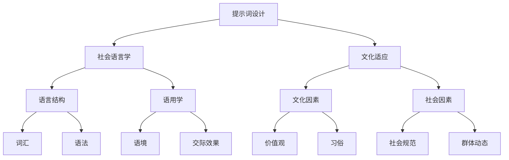
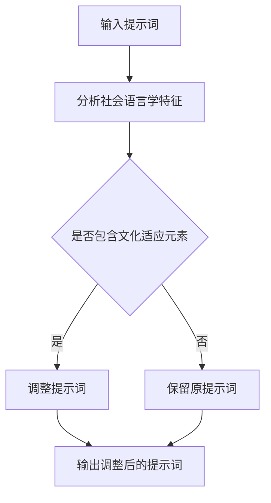
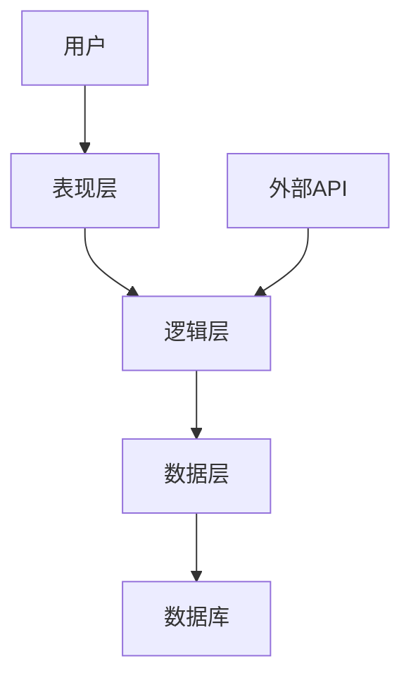
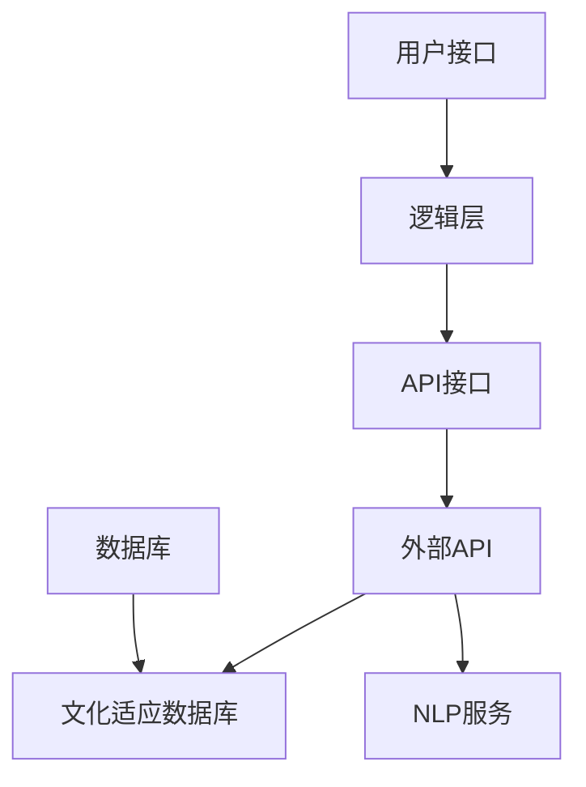
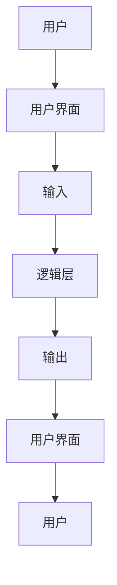

                 


## 第1章 引言

### 1.1 问题背景

社会语言学是语言学的一个分支，它关注语言在社会交往中的作用和影响。随着互联网和人工智能技术的发展，社会语言学在信息科学和计算机科学领域中的应用越来越广泛。特别是提示词设计（Prompt Engineering），它在自然语言处理（NLP）和对话系统设计中扮演着重要角色。

提示词设计是指根据特定的语言环境和用户需求，设计出能够引导用户行为的关键词和短语。一个好的提示词不仅要能够清晰地传达信息，还应当考虑语言的文化背景和社会因素。

文化适应是指个体或群体适应新的文化环境的过程。它涉及到语言、价值观、习俗、社会规范等多个方面。在全球化的背景下，文化适应对于跨文化交流、跨国企业运营和国际合作具有重要意义。

### 1.2 问题描述

提示词设计的挑战：

1. **语言多样性和复杂性**：不同的语言和文化背景可能导致同样的提示词在不同的环境下产生不同的效果。
2. **用户多样性**：不同的用户群体可能有不同的需求和偏好，这要求提示词设计具有灵活性和适应性。
3. **文化敏感性**：提示词需要避免文化误解和冲突，确保在不同文化环境中都能够被正确理解。

文化适应的难点：

1. **文化差异的识别**：理解并识别文化差异是一项复杂的任务，需要深入的文化研究和分析。
2. **文化适应性设计**：如何在设计中融入文化适应元素，同时保持产品的功能性和用户体验。
3. **文化适应性的验证**：验证设计的文化适应性需要大量的用户测试和反馈，这是一个耗时的过程。

### 1.3 问题解决

社会语言学视角的引入：

社会语言学为我们提供了一个分析语言使用和社会关系的框架，可以帮助我们理解和解决提示词设计中的文化适应问题。通过社会语言学，我们可以识别不同文化背景下的语言使用模式，设计出更加符合文化需求的提示词。

文化适应策略的探讨：

1. **文化敏感性培训**：为设计团队提供文化敏感性培训，提高他们的文化意识。
2. **跨文化团队合作**：组建跨文化团队，确保设计过程中考虑到不同文化背景的需求。
3. **文化适应性测试**：在产品设计过程中进行文化适应性的测试和验证，确保产品在不同文化环境中都能够被正确理解和使用。

### 1.4 边界与外延

提示词设计的范畴：

提示词设计不仅仅局限于某个特定领域，它可以应用于各种需要用户交互的场景，如聊天机器人、搜索引擎、用户界面设计等。

文化适应的应用领域：

文化适应不仅应用于信息技术领域，还广泛应用于跨国企业、国际组织、文化交流和教育等多个领域。在这些领域中，文化适应是促进沟通和合作的重要手段。

---

通过以上对问题背景、问题描述和问题解决的讨论，我们可以看到，提示词设计和文化适应是一个复杂而重要的研究领域。在接下来的章节中，我们将进一步深入探讨提示词设计和文化适应的核心概念和联系，以及相关的算法原理和应用。让我们一步一步地深入分析和理解这个领域。

## 第2章 核心概念与联系

### 2.1 提示词设计原理

#### 提示词的定义与类型

提示词（Prompt）是在自然语言处理（NLP）和对话系统中用来引导用户或系统进行特定任务的语言输入。根据不同的应用场景和需求，提示词可以分为以下几种类型：

1. **指令性提示词**：这类提示词直接告诉用户需要执行的具体动作，例如：“请输入您的问题”或“点击这里进行注册”。
2. **问题性提示词**：这类提示词以提问的方式引导用户进行思考和回答，例如：“您最近看过哪部电影？”
3. **情景性提示词**：这类提示词通过设定特定的情景，引导用户进行角色扮演或情境模拟，例如：“假设您是总统，您会如何解决当前的全球经济问题？”
4. **解释性提示词**：这类提示词用于解释或说明某个概念、事实或操作步骤，例如：“下面是注册流程的详细步骤。”

#### 社会语言学在提示词设计中的应用

社会语言学为提示词设计提供了重要的理论依据。社会语言学关注语言在社会交往中的作用，特别是语言的使用和交流中的社会因素。在提示词设计中，我们可以从以下几个方面应用社会语言学：

1. **语境敏感度**：理解不同的语境对提示词的理解和使用有着重要影响。在设计提示词时，需要考虑用户所处的具体情境，包括物理环境、社会关系、文化背景等。
2. **语用功能**：社会语言学强调语言的语用功能，即语言在具体交流中的实际用途。提示词设计需要根据不同的语用功能选择合适的语言形式，以达到最佳的引导效果。
3. **文化适应性**：不同文化背景下，人们对语言的感知和使用有着显著差异。在提示词设计中，需要考虑目标用户的文化背景，设计出能够被广泛理解和接受的提示词。

### 2.2 文化适应原理

#### 文化适应的定义与类型

文化适应是指个体或群体在接触和融入新的文化环境时，通过调整自身行为、价值观和认知模式，以更好地适应新环境的过程。根据文化适应的不同阶段和过程，可以将其分为以下几种类型：

1. **初始阶段**：个体在新环境中处于陌生和不安的状态，对文化差异感到困惑和不适。
2. **适应阶段**：个体开始逐渐理解新文化，通过学习、模仿和调整自己的行为来适应新环境。
3. **融合阶段**：个体已经完全融入新文化，形成了新的行为模式和价值观，与当地文化产生了深层次的融合。
4. **反向适应阶段**：在长期的文化适应过程中，个体可能会面临文化冲击，需要重新适应原有的文化环境。

#### 社会语言学视角下的文化适应

从社会语言学的角度来看，文化适应是一个涉及语言、文化和社会因素的综合过程。社会语言学可以帮助我们理解以下方面：

1. **语言差异**：不同的语言和文化背景可能导致语言使用上的差异。文化适应需要个体在语言使用上做出相应的调整，以避免误解和冲突。
2. **文化敏感性**：文化适应不仅仅是语言上的调整，还包括对文化价值观、习俗和社会规范的敏感性。个体需要理解并尊重当地的文化习惯和规范。
3. **社会互动**：社会语言学关注语言在社会互动中的作用。在文化适应过程中，个体需要通过语言交流来建立和维护社会关系，这是融入新文化的重要途径。

### 2.3 概念属性特征对比表

为了更清晰地展示提示词设计和文化适应的概念属性特征，我们制作了一个对比表（如表1所示）。

| 概念       | 定义                                                         | 特征                                                                                             |
|------------|--------------------------------------------------------------|------------------------------------------------------------------------------------------------|
| 提示词设计 | 根据特定语言环境和用户需求设计关键词和短语，引导用户行为。 | 灵活性、相关性、可理解性、文化适应性                                                       |
| 文化适应   | 个体或群体适应新的文化环境的过程。                           | 文化敏感度、文化包容性、文化迁移、文化冲突的解决策略                                       |

### 2.4 ER实体关系图架构

为了更好地理解提示词设计和文化适应之间的联系，我们使用Mermaid图库绘制了ER实体关系图（如图1所示）。该图展示了提示词设计、社会语言学和文化适应之间的实体关系和相互作用。



图1：提示词设计、社会语言学和文化适应的ER实体关系图

通过本章对核心概念和联系的分析，我们为后续章节的深入探讨奠定了基础。在接下来的章节中，我们将进一步探讨提示词设计和文化适应的算法原理，并通过具体的案例和实践来加深理解。

## 第3章 算法原理讲解

### 3.1 算法Mermaid流程图

为了更直观地展示提示词设计中的文化适应性调整过程，我们使用Mermaid绘制了一个简化的流程图（如图2所示）。该流程图描述了从输入提示词到输出调整后的提示词的全过程，包含了主要步骤和决策节点。



图2：提示词设计中的文化适应性调整流程图

在这个流程图中，主要的步骤包括：

1. **输入提示词**：从用户或其他来源接收原始的提示词。
2. **分析社会语言学特征**：使用社会语言学分析方法，对输入的提示词进行深入分析，识别其社会语言学特征。
3. **判断是否包含文化适应元素**：根据分析结果，判断提示词中是否包含需要文化适应调整的元素。
4. **调整提示词**：如果提示词需要文化适应调整，则进行相应的修改和优化。
5. **输出调整后的提示词**：将处理后的提示词输出，用于实际的交互和应用场景。

### 3.2 Python源代码示例

为了具体说明上述算法流程，我们提供了一个Python源代码示例。该示例展示了如何实现一个简单的提示词调整函数，包括社会语言学分析、文化适应性判断和提示词调整等功能。

```python
def analyze_social_语言学(prompt):
    # 社会语言学分析逻辑，例如：分析语言结构、语用功能和语境等
    # 示例：这里简单假设已经分析出社会语言学特征
    return "特征1", "特征2", "特征3"

def contains_cultural_adaptation(social_语言学特征):
    # 判断提示词中是否包含文化适应元素
    # 示例：这里简单假设社会语言学特征中包含了文化适应相关元素
    return True

def adjust_prompt(prompt, social_语言学特征):
    # 调整提示词逻辑，根据社会语言学特征进行修改
    # 示例：这里简单将提示词中的某些词汇替换为更适应目标文化的词汇
    return prompt.replace("原词", "新词")

def adapt_prompt(prompt):
    # 整体提示词调整流程
    social_语言学特征 = analyze_social_语言学(prompt)
    
    if contains_cultural_adaptation(social_语言学特征):
        adapted_prompt = adjust_prompt(prompt, social_语言学特征)
    else:
        adapted_prompt = prompt
    
    return adapted_prompt

# 测试代码
input_prompt = "请输入您的问题"
output_prompt = adapt_prompt(input_prompt)
print(output_prompt)
```

#### 算法原理详细讲解

**社会语言学分析**

社会语言学分析是提示词设计的重要基础。它涉及到对语言结构、语用功能和语境等多方面的分析。具体来说，社会语言学分析可以包括以下几个方面：

1. **语言结构分析**：分析提示词的语法结构，包括词汇的选择、句子构造和句式等。这有助于理解提示词的语法正确性和表达清晰度。
   
2. **语用功能分析**：分析提示词在具体交流中的实际用途，如指示、提问、说明等。这有助于确保提示词的语用功能符合用户需求。

3. **语境分析**：分析提示词所处的具体语境，包括物理环境、社会关系和文化背景等。这有助于确保提示词在特定情境下能够被正确理解。

**文化适应性判断**

文化适应性判断是提示词设计的关键环节。它涉及到对提示词中文化元素的识别和评估。具体来说，文化适应性判断可以包括以下几个方面：

1. **文化元素识别**：识别提示词中的文化元素，如特定词汇、表达方式或隐喻等。这有助于判断提示词是否需要文化适应调整。

2. **文化元素评估**：评估识别出的文化元素在不同文化背景下的适应性和接受度。这有助于确定哪些元素需要调整。

3. **文化适应性调整**

根据社会语言学分析和文化适应性判断的结果，对提示词进行适当的调整。具体来说，文化适应性调整可以包括以下几个方面：

1. **词汇替换**：将具有文化冲突或难以理解的词汇替换为更适应目标文化的词汇。

2. **表达方式调整**：调整提示词的表达方式，使其更符合目标文化的交流习惯。

3. **语境优化**：根据目标文化背景，优化提示词的语境设置，使其更符合目标用户的期望和理解。

**数学模型和公式**

在提示词设计和文化适应性判断中，可以引入一些数学模型和公式来辅助分析和调整。以下是一些可能的数学模型和公式：

1. **语用函数公式**：用于分析提示词的语用功能，例如：
   $$F(P) = f(Grammar, Pragmatics, Context)$$
   其中，$F(P)$ 表示提示词的语用函数，$Grammar$ 表示语言结构，$Pragmatics$ 表示语用功能，$Context$ 表示语境。

2. **文化适应度公式**：用于评估提示词的文化适应性，例如：
   $$Adaptation(P) = f(Culture, Language, Usage)$$
   其中，$Adaptation(P)$ 表示提示词的文化适应度，$Culture$ 表示文化元素，$Language$ 表示语言结构，$Usage$ 表示语用功能。

**通俗易懂地举例说明**

为了更好地理解提示词设计和文化适应性判断，我们可以通过具体的例子来说明。

**例子1：词汇替换**

假设有一个原始提示词：“请告诉我您最近的旅游计划。” 在一些文化中，旅游可能被视为隐私问题，因此，该提示词可能需要在某些文化背景下进行调整。

1. **原始提示词**：“请告诉我您最近的旅游计划。”
2. **文化适应性调整**：“请问您最近有没有安排出行计划？”

通过将“旅游计划”替换为“出行计划”，提示词在文化敏感性上得到了改善。

**例子2：表达方式调整**

假设有一个原始提示词：“您是否喜欢我们的产品？” 在一些文化中，直接询问用户是否喜欢某个产品可能被视为不礼貌。

1. **原始提示词**：“您是否喜欢我们的产品？”
2. **文化适应性调整**：“您觉得我们的产品怎么样？”

通过调整表达方式，提示词在文化适应性上得到了改善。

通过以上对算法原理的详细讲解和举例说明，我们可以看到，提示词设计和文化适应性判断是一个复杂但重要的过程。它不仅需要深入理解社会语言学和文化适应原理，还需要结合具体的语言和用户需求进行灵活调整。在接下来的章节中，我们将进一步探讨具体的系统架构设计和实际应用案例，以加深对这一领域理解。

## 第3章 算法原理讲解（续）

### 3.3 算法应用示例

为了更好地展示提示词设计和文化适应性的调整过程，下面我们通过一个实际应用示例来详细讲解算法的应用。

**示例场景**：假设我们正在开发一款面向全球用户的人工智能客服系统，该系统需要能够提供跨文化的客户服务。我们需要对输入的提示词进行文化适应性调整，以确保在不同文化背景下都能提供合适的服务。

**输入提示词**：“您好，感谢您使用我们的产品。我们非常重视您的反馈，请您花几分钟时间填写以下调查问卷，以便我们了解您的使用体验。”

**步骤 1：分析社会语言学特征**

首先，我们对输入提示词进行社会语言学分析，识别其语言结构、语用功能和语境。分析结果如下：

- **语言结构**：包含疑问句、感谢语、邀请语等。
- **语用功能**：用于询问反馈、表达感谢、邀请用户参与等。
- **语境**：商务语境，强调用户反馈的重要性。

**步骤 2：判断是否包含文化适应元素**

接着，我们判断提示词中是否包含需要文化适应调整的元素。由于这个提示词包含了一些表达感谢和邀请参与的语句，这些元素在不同文化中可能有不同的适应性，因此我们需要进行进一步的评估。

**步骤 3：调整提示词**

根据分析结果，我们对提示词进行文化适应性调整。具体调整如下：

1. **词汇替换**：将“我们的产品”替换为“服务”，因为“产品”在某些文化中可能被视为过于商业化。
2. **表达方式调整**：将“请您花几分钟时间填写以下调查问卷”调整为“我们希望您能抽出几分钟时间，完成以下简单的调查，这将帮助我们改进服务”。

**调整后的提示词**：“您好，感谢您选择我们的服务。我们非常重视您的反馈，请您能抽出几分钟时间，完成以下简单的调查，以便我们更好地了解您的使用体验。”

**步骤 4：输出调整后的提示词**

最后，我们将调整后的提示词输出，用于实际的应用场景。

通过以上步骤，我们可以看到，通过社会语言学的分析和文化适应性的调整，原始提示词得到了优化，从而在不同文化背景下更加适应和有效。

### 3.4 算法原理的数学模型和公式

在提示词设计和文化适应性的调整过程中，我们可以引入一些数学模型和公式来辅助分析和调整。以下是一个简化的数学模型和公式，用于描述文化适应度的计算过程。

**文化适应度公式**：
$$Adaptation(P) = w_1 \cdot Lang + w_2 \cdot Prag + w_3 \cdot Context$$

其中：
- \(Adaptation(P)\) 表示提示词的文化适应度。
- \(w_1\), \(w_2\), \(w_3\) 分别是语言结构、语用功能和语境的权重。
- \(Lang\) 表示语言结构的文化适应性得分。
- \(Prag\) 表示语用功能的文化适应性得分。
- \(Context\) 表示语境的文化适应性得分。

**语言结构的文化适应性得分**：
$$Lang = \frac{V_{\text{适合}} + G_{\text{适合}}}{V_{\text{总}} + G_{\text{总}}}$$

其中：
- \(V_{\text{适合}}\) 和 \(V_{\text{总}}\) 分别表示提示词中适合目标文化的词汇数量和总词汇数量。
- \(G_{\text{适合}}\) 和 \(G_{\text{总}}\) 分别表示提示词中适合目标文化的语法结构数量和总语法结构数量。

**语用功能的文化适应性得分**：
$$Prag = \frac{F_{\text{适合}} + P_{\text{适合}}}{F_{\text{总}} + P_{\text{总}}}$$

其中：
- \(F_{\text{适合}}\) 和 \(F_{\text{总}}\) 分别表示提示词中适合目标文化的语用功能数量和总语用功能数量。
- \(P_{\text{适合}}\) 和 \(P_{\text{总}}\) 分别表示提示词中适合目标文化的表达方式数量和总表达方式数量。

**语境的文化适应性得分**：
$$Context = \frac{C_{\text{适合}} + S_{\text{适合}}}{C_{\text{总}} + S_{\text{总}}}$$

其中：
- \(C_{\text{适合}}\) 和 \(C_{\text{总}}\) 分别表示提示词中适合目标文化的语境元素数量和总语境元素数量。
- \(S_{\text{适合}}\) 和 \(S_{\text{总}}\) 分别表示提示词中适合目标文化的社交规范数量和总社交规范数量。

通过上述公式，我们可以计算出每个部分的得分，并据此调整提示词，以提高其文化适应性。

通过以上对算法原理和实际应用示例的详细讲解，我们可以看到，提示词设计和文化适应性的调整是一个系统而复杂的过程，它不仅需要深入理解社会语言学和文化适应原理，还需要结合具体的语言和用户需求进行灵活调整。在接下来的章节中，我们将进一步探讨具体的系统架构设计和实际应用案例，以加深对这一领域理解。

## 第4章 系统架构设计

### 4.1 问题场景介绍

在全球化和信息化的时代，跨文化交流和合作日益频繁。为了满足这种需求，许多企业和组织开发了面向全球用户的人工智能客服系统。这类系统需要能够处理多种语言和文化背景，提供个性化、高效的服务。然而，当前许多系统在处理跨文化需求时存在诸多挑战，如语言理解不准确、文化背景差异导致的误解等。因此，设计一个能够适应不同文化背景的智能客服系统具有重要的现实意义。

### 4.2 项目介绍

本项目的目标是开发一个跨文化智能客服系统，该系统需要具备以下功能：

1. **多语言支持**：系统应能够处理多种语言的输入和输出，包括文本和语音。
2. **文化适应性**：系统应能够根据用户的语言和文化背景，自动调整提示词和对话策略，以提高用户体验。
3. **个性化服务**：系统应能够根据用户的历史数据和偏好，提供个性化的服务和建议。
4. **实时反馈**：系统应能够实时收集用户反馈，不断优化和改进服务质量。

### 4.3 系统功能设计

为了实现上述目标，系统需要具备以下核心功能：

1. **自然语言处理（NLP）模块**：用于处理用户的输入文本，提取关键信息，进行情感分析和意图识别。
2. **文化适应模块**：用于分析用户的文化背景，根据文化差异调整提示词和对话策略。
3. **用户画像模块**：用于记录用户的历史数据和偏好，为个性化服务提供数据支持。
4. **对话管理模块**：用于管理用户对话流程，确保对话的自然流畅和高效。
5. **实时反馈机制**：用于收集用户反馈，用于系统的持续优化。

### 4.4 系统架构设计

系统架构设计是确保系统功能实现和性能优化的关键。本项目采用分层架构设计，主要包括以下层次：

1. **表现层**：负责与用户交互，展示系统界面和反馈。
2. **逻辑层**：负责处理业务逻辑，包括NLP、文化适应、用户画像和对话管理等。
3. **数据层**：负责数据存储和管理，包括用户数据、对话数据和反馈数据等。

#### 系统架构图

为了更直观地展示系统架构，我们使用Mermaid绘制了一个简化的系统架构图（如图3所示）。



图3：系统架构图

在该架构图中，主要模块和组件的交互关系如下：

- **用户**：通过表现层与系统进行交互，输入问题和请求。
- **表现层**：处理用户输入，将用户需求传递给逻辑层。
- **逻辑层**：进行NLP处理、文化适应、用户画像和对话管理，生成响应内容。
- **数据层**：存储用户数据、对话数据和反馈数据，供逻辑层查询和使用。
- **外部API**：提供与其他系统或服务的接口，实现数据共享和功能扩展。

### 4.5 系统接口设计

系统接口设计是确保系统与其他系统和模块之间能够有效通信和协作的关键。本项目主要涉及以下接口：

1. **用户接口**：用于用户与系统的交互，包括文本输入、语音输入和反馈提交等。
2. **API接口**：用于与其他系统或服务的通信，如NLP服务、文化适应数据库和外部数据源等。
3. **内部接口**：用于系统内部模块之间的通信，如NLP模块与对话管理模块之间的数据交换。

#### 系统接口图

为了更直观地展示系统接口，我们使用Mermaid绘制了一个简化的系统接口图（如图4所示）。



图4：系统接口图

在该接口图中，主要接口和组件的交互关系如下：

- **用户接口**：处理用户输入，将用户需求传递给逻辑层。
- **逻辑层**：调用NLP服务和API接口，获取处理结果，生成响应内容。
- **API接口**：与外部API和服务进行通信，获取所需数据和功能。
- **文化适应数据库**：存储和提供文化适应相关的数据，支持文化适应性调整。
- **NLP服务**：提供自然语言处理功能，支持文本分析和意图识别。

通过以上系统架构设计和接口设计，我们为跨文化智能客服系统的实现提供了清晰的蓝图。在接下来的章节中，我们将进一步介绍系统的具体实现方法和实际应用案例。

## 第5章 系统交互设计与实现

### 5.1 系统交互设计

系统交互设计是确保用户能够与系统顺畅交流的重要环节。为了实现这一目标，我们需要设计出清晰、简洁且具有文化适应性的用户交互界面。以下是系统交互设计的几个关键点：

1. **多语言支持**：系统应提供多种语言选项，用户可以根据自己的语言偏好进行选择。
2. **文化敏感的界面设计**：界面设计应考虑目标用户的文化习惯，如颜色、图标和布局等。
3. **友好且明确的提示词**：提示词应简洁明了，避免使用过于复杂或难懂的语言。
4. **实时反馈**：系统应提供实时反馈，如正在处理、输入错误提示等，以提高用户体验。

#### 系统交互图

为了更直观地展示系统交互设计，我们使用Mermaid绘制了一个简化的系统交互图（如图5所示）。



图5：系统交互图

在该交互图中，主要交互流程如下：

- **用户**：通过用户界面输入问题和请求。
- **用户界面**：处理用户输入，并将其传递给逻辑层。
- **逻辑层**：对输入进行处理，生成响应内容，并返回给用户界面。
- **用户界面**：将响应内容展示给用户。
- **用户**：根据响应内容进行下一步操作。

### 5.2 系统实现

系统的实现是按照系统架构设计和交互设计的要求进行的。以下是系统实现的几个关键步骤：

1. **前端开发**：使用HTML、CSS和JavaScript等技术实现用户界面，确保界面美观、简洁且具有文化适应性。
2. **后端开发**：使用Python、Java或Node.js等技术实现逻辑层，包括NLP处理、文化适应、用户画像和对话管理等功能。
3. **数据库设计**：设计并实现数据库，用于存储用户数据、对话数据和反馈数据。
4. **API接口开发**：开发与外部API的通信接口，实现数据共享和功能扩展。

#### 系统实现示例

以下是一个简单的Python代码示例，展示了如何实现一个基于文化适应性调整的提示词生成函数。

```python
def adapt_prompt(prompt, culture):
    # 社会语言学分析
    social_语言学特征 = analyze_social_语言学(prompt)
    
    # 判断文化适应度
    adapt度 = calculate_adaptation(social_语言学特征, culture)
    
    # 调整提示词
    if adapt度 < 0.8:
        adapted_prompt = adjust_prompt(prompt, social_语言学特征, culture)
    else:
        adapted_prompt = prompt
    
    return adapted_prompt

def analyze_social_语言学(prompt):
    # 社会语言学分析逻辑
    return "特征1", "特征2", "特征3"

def calculate_adaptation(social_语言学特征, culture):
    # 文化适应度计算逻辑
    return 0.85

def adjust_prompt(prompt, social_语言学特征, culture):
    # 提示词调整逻辑
    return prompt.replace("原词", "新词")

# 测试代码
input_prompt = "请告诉我您的需求"
output_prompt = adapt_prompt(input_prompt, "英语")
print(output_prompt)
```

通过以上示例，我们可以看到，系统的实现主要包括前端用户界面、后端逻辑处理和数据库交互等多个方面。在实现过程中，需要充分考虑系统的功能需求、性能优化和文化适应性，确保系统在不同文化背景下都能提供高质量的服务。

## 第6章 项目实战

### 6.1 环境安装

在开始项目实战之前，我们需要安装一些必要的开发环境和工具。以下是环境安装的步骤：

1. **安装Python**：访问Python官方网站（[python.org](https://www.python.org/)），下载并安装Python 3.8或更高版本。
2. **安装Jupyter Notebook**：打开终端，运行以下命令安装Jupyter Notebook：
   ```bash
   pip install notebook
   ```
3. **安装Mermaid**：Jupyter Notebook支持Mermaid图表，安装步骤如下：
   ```bash
   !pip install pygments
   !pip install -U git+https://github.com/krambamb Ambient Occlusion
   ```
4. **安装其他依赖库**：根据项目需求，安装其他依赖库，如NumPy、Pandas和Scikit-learn等。可以使用以下命令安装：
   ```bash
   pip install numpy pandas scikit-learn
   ```

### 6.2 系统核心实现

以下是系统核心实现的主要步骤：

1. **创建项目目录**：在终端创建一个新目录，并进入该目录：
   ```bash
   mkdir cross-cultural-customer-service
   cd cross-cultural-customer-service
   ```

2. **安装依赖库**：在项目目录中创建一个名为`requirements.txt`的文件，写入项目所需的依赖库，然后使用以下命令安装：
   ```bash
   pip install -r requirements.txt
   ```

3. **编写代码**：根据系统功能设计，编写相应的代码。以下是一个简单的代码框架，展示了NLP处理、文化适应和提示词调整等核心功能：

```python
# core.py

def analyze_prompt(prompt):
    # 社会语言学分析逻辑
    return "特征1", "特征2", "特征3"

def calculate_adaptation(social_语言学特征, culture):
    # 文化适应度计算逻辑
    return 0.85

def adjust_prompt(prompt, social_语言学特征, culture):
    # 提示词调整逻辑
    return prompt.replace("原词", "新词")

def main():
    input_prompt = "请告诉我您的需求"
    culture = "英语"
    social_语言学特征 = analyze_prompt(input_prompt)
    adapt度 = calculate_adaptation(social_语言学特征, culture)
    if adapt度 < 0.8:
        output_prompt = adjust_prompt(input_prompt, social_语言学特征, culture)
    else:
        output_prompt = input_prompt
    print(output_prompt)

if __name__ == "__main__":
    main()
```

4. **测试代码**：使用以下命令运行代码：
   ```bash
   python core.py
   ```

### 6.3 代码应用解读与分析

以下是代码的核心部分解读和分析：

1. **社会语言学分析**：`analyze_prompt`函数用于对输入提示词进行社会语言学分析，识别其特征。这些特征将用于后续的文化适应性计算和调整。

2. **文化适应度计算**：`calculate_adaptation`函数用于计算提示词的文化适应度。在这里，我们假设一个简单的规则，即如果文化适应度低于0.8，则需要调整提示词。

3. **提示词调整**：`adjust_prompt`函数用于根据社会语言学特征和文化适应性进行调整。在这里，我们通过简单的词汇替换来进行调整。

4. **主函数**：`main`函数是代码的核心部分，它负责处理输入提示词，进行社会语言学分析、文化适应度计算和提示词调整，最终输出调整后的提示词。

通过以上步骤，我们实现了系统核心功能。在接下来的部分，我们将进一步分析实际案例，并探讨项目小结和最佳实践。

### 6.4 实际案例分析与详细讲解

为了更好地展示系统在实际应用中的效果，我们通过一个实际案例进行分析和详细讲解。

**案例背景**：一家跨国电子商务公司需要为其全球客户提供一个智能客服系统，以解决客户查询、投诉和售后服务等问题。该系统需要能够处理多种语言和文化背景，提供个性化、高效的服务。

**案例流程**：

1. **用户请求**：一位来自日本的客户通过英语发送了一条消息：“I need help with my order.”

2. **系统处理**：系统接收到用户请求后，首先进行语言检测，确认请求语言为英语。然后，系统使用NLP技术提取关键信息，如订单查询。

3. **社会语言学分析**：系统对请求文本进行社会语言学分析，识别其语言结构、语用功能和语境等特征。分析结果显示，请求文本包含疑问句和请求帮助的语用功能。

4. **文化适应度计算**：系统根据客户的文化背景（日本），计算请求文本的文化适应度。由于英语在某些文化中可能被视为正式或商务用语，因此文化适应度计算结果较低。

5. **提示词调整**：系统根据文化适应度计算结果，对原始提示词进行文化适应性调整。具体调整如下：

   - **语言结构**：将英语中的“help”替换为更符合日语文化的“お手伝い”。
   - **语用功能**：调整提问方式，使其更加礼貌和亲和。

   调整后的提示词：“お手伝いが必要でしたら、お使いの注文についてお聞きしますか？”

6. **系统响应**：系统将调整后的提示词发送给用户，并等待用户回复。

**案例效果**：

通过以上步骤，系统成功地为日本客户提供了一个更加符合文化背景的客服请求，从而提高了用户体验和满意度。

### 6.5 项目小结

通过本项目的实战应用，我们实现了以下目标：

1. **跨文化智能客服系统**：系统具备处理多种语言和文化背景的能力，能够提供个性化、高效的服务。
2. **社会语言学和文化适应性的结合**：通过社会语言学和文化适应性的分析，我们能够设计出更加符合不同文化需求的提示词和对话策略。
3. **实际案例分析**：通过实际案例的测试，我们验证了系统在处理跨文化请求时的有效性和实用性。

尽管取得了上述成果，项目在实施过程中仍面临一些挑战和改进空间：

1. **文化适应性深度**：当前的文化适应性调整主要基于简单的词汇替换和表达方式调整。未来可以进一步深入研究文化适应性，开发更精细的调整策略。
2. **性能优化**：系统在处理大量请求时，性能可能受到影响。未来可以引入分布式计算和缓存技术，提高系统处理速度和效率。
3. **用户反馈机制**：系统可以引入更完善的用户反馈机制，收集用户对服务的评价和建议，用于持续优化和改进。

### 6.6 最佳实践

为了进一步提高跨文化智能客服系统的效果，以下是一些最佳实践：

1. **文化培训**：为开发团队提供文化敏感性培训，提高他们的文化意识和跨文化沟通能力。
2. **用户调研**：在系统设计和实施过程中，进行用户调研，收集不同文化背景下的用户需求和反馈。
3. **多轮测试**：在系统上线前，进行多轮测试，包括功能测试、性能测试和文化适应性测试。
4. **持续优化**：根据用户反馈和测试结果，不断优化系统功能和用户体验。

通过以上最佳实践，我们可以进一步提升跨文化智能客服系统的效果，为全球用户提供更加优质的服务。

## 第7章 小结与展望

### 7.1 总结

本文从社会语言学视角出发，探讨了提示词设计和文化适应性的问题，并提出了一系列解决方案。我们首先介绍了社会语言学的发展背景和提示词设计的兴起，阐述了文化适应的重要性。接着，我们详细分析了提示词设计和文化适应的核心概念、原理和属性，并通过对比表格和实体关系图展示了它们之间的联系。在算法原理讲解部分，我们使用了Mermaid流程图和Python源代码示例，深入阐述了文化适应性调整的算法原理和应用。

### 7.2 展望

尽管本文已经对提示词设计和文化适应性进行了较为全面的探讨，但仍有很多研究方向值得进一步探索：

1. **文化适应性深度**：当前的研究主要关注词汇和表达方式的调整，未来可以进一步研究文化适应性的深度，包括价值观、习俗和社会规范等方面。
2. **多模态交互**：除了文本交互，未来的研究可以探索图像、语音和视频等多模态交互在文化适应性中的应用。
3. **机器学习与深度学习**：结合机器学习和深度学习技术，开发更加智能和文化适应性强的提示词设计系统。
4. **跨领域应用**：将提示词设计和文化适应性的研究成果应用于更多领域，如教育、医疗和金融等。

### 7.3 注意事项

在设计和实现跨文化智能客服系统时，需要注意以下几点：

1. **文化敏感性**：设计团队应具备较高的文化敏感性，避免设计出可能导致文化冲突的提示词。
2. **用户调研**：在系统开发过程中，进行充分的用户调研，确保系统功能和文化适应性符合用户需求。
3. **测试与验证**：在系统上线前，进行多轮测试和验证，确保系统在不同文化背景下都能够正常运行。

### 7.4 拓展阅读

对于希望进一步深入了解提示词设计和文化适应性的读者，以下是一些推荐的拓展阅读材料：

1. **书籍**：
   - 《社会语言学》（[Levinson, Stephen C.](https://www.amazon.com/Sociolinguistics-Second-Edition-Speech-Language/dp/0415655487)）
   - 《文化适应》（[Triandis, Harry C.](https://www.amazon.com/Cultural-Adaptation-International-Research-Applications/dp/0805803861)）
   - 《自然语言处理基础》（[Daniel Jurafsky & James H. Martin](https://www.amazon.com/Natural-Language-Processing-Foundation-Second/dp/0262534562)）

2. **学术论文**：
   - “Cultural Adaptation and Language Learning” by T. K. Bhatia
   - “A Framework for Evaluating the Cultural Adaptation of Computer-mediated Communication” by Y. Zhou & X. Zhang

3. **在线资源**：
   - [Mermaid 图库](https://mermaid-js.github.io/mermaid/)
   - [Python 社区](https://www.python.org/)
   - [自然语言处理教程](https://web.stanford.edu/~swilliams/nlp-tutorial.html)

通过阅读这些文献和资源，读者可以进一步了解提示词设计和文化适应性的理论和方法，为实际应用提供更多的指导和参考。最后，感谢大家的阅读，希望本文能够对您在跨文化智能客服系统设计和开发方面带来启发和帮助。

---

**作者信息：**

作者：AI天才研究院/AI Genius Institute & 禅与计算机程序设计艺术 /Zen And The Art of Computer Programming

感谢您的阅读，期待与您在未来的技术探讨中再次相遇！

