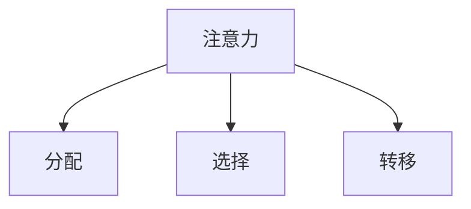
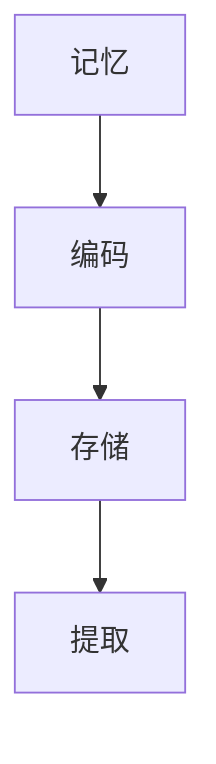
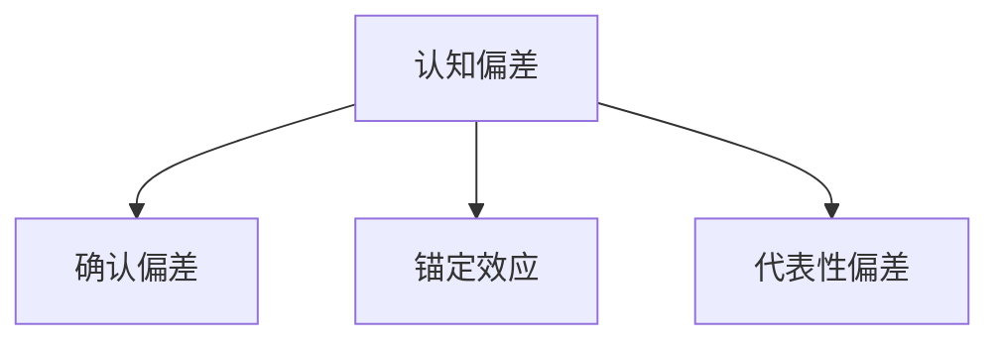
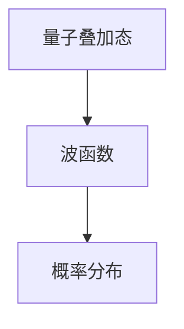
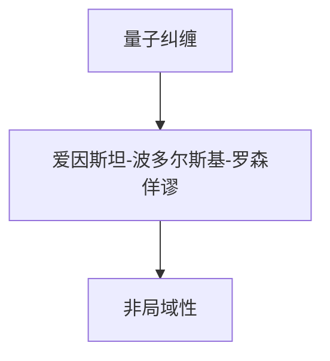
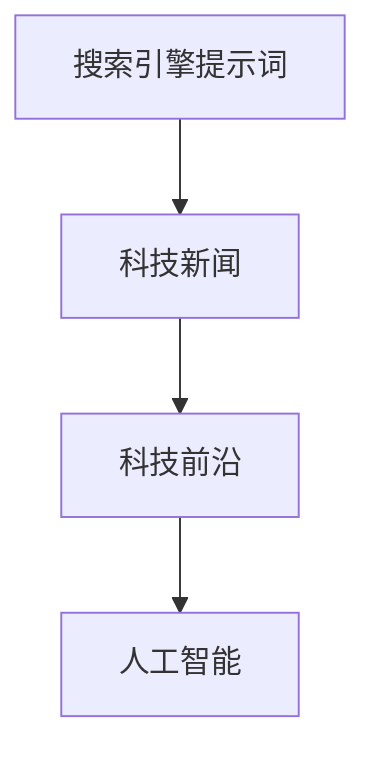
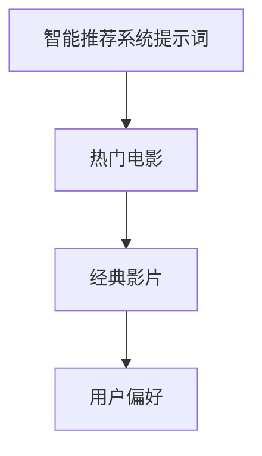
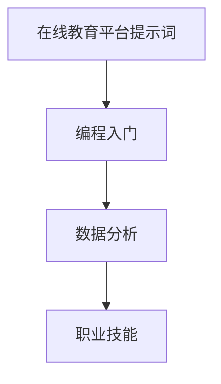
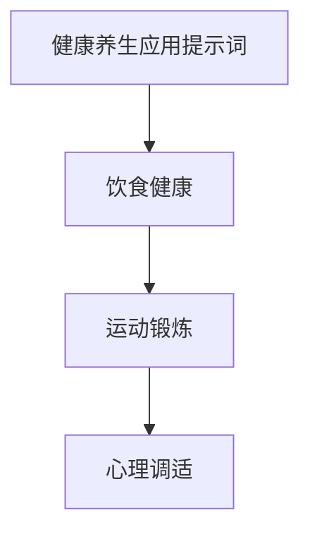

                 

### 背景介绍

#### 1. 引言

随着人工智能技术的快速发展，提示词设计作为自然语言处理的关键环节，越来越受到关注。传统的提示词设计主要依赖于语言学和心理学原理，然而，如何更好地模拟人类思维过程，提高提示词的有效性和精确性，仍然是亟待解决的问题。认知心理学为我们提供了理解人类思维过程的理论基础，而量子力学则提供了对微观世界独特规律的描述。将这两者结合起来，有望为提示词设计提供全新的思路。

#### 1.1 问题背景

在自然语言处理领域，提示词设计是用户与系统交互的重要桥梁。一个优秀的提示词不仅要简洁明了，还要能够有效引导用户获取所需信息。然而，现有的提示词设计方法往往局限于传统语言学和心理学原理，难以全面模拟人类复杂的思维过程。认知心理学为我们揭示了人类注意、记忆、认知偏差等核心认知机制，而量子力学则为我们提供了描述复杂系统行为的新工具。通过将认知心理学和量子力学原理引入提示词设计，我们可以尝试构建一种更符合人类认知习惯的提示词体系。

#### 1.2 问题描述

提示词设计不仅涉及自然语言理解，还涉及到人类思维过程的模拟。如何在设计过程中更好地融合认知心理学和量子力学原理，是一个复杂且富有挑战性的问题。具体来说，我们需要解决以下问题：

1. **注意力机制与提示词设计**：如何利用认知心理学中的注意力机制，设计出更具有吸引力和指导性的提示词？
2. **记忆理论与提示词设计**：如何结合记忆理论，设计出更容易被用户记住的提示词？
3. **认知偏差与提示词设计**：如何减少认知偏差，设计出更加客观、公正的提示词？
4. **量子力学原理与提示词设计**：如何运用量子力学原理，如量子叠加态和量子纠缠，提高提示词的多样性和协同性？

#### 1.3 问题解决

通过引入认知心理学和量子力学原理，我们可以从多个维度对提示词设计进行优化。具体来说，我们可以采取以下策略：

1. **注意力机制**：设计提示词时，考虑人类注意力的选择性，利用关键词突出和视觉布局等手段，提高提示词的吸引力。
2. **记忆理论**：通过记忆规律，设计出结构清晰、易于记忆的提示词，提高用户的认知效率。
3. **认知偏差**：采用心理学实验数据，识别和减少常见认知偏差，确保提示词的客观性和公正性。
4. **量子力学原理**：运用量子叠加态和量子纠缠等概念，设计出具有多种可能性和协同效应的提示词，提高系统的整体性能。

#### 1.4 边界与外延

本文的研究主要聚焦于自然语言处理领域的提示词设计。然而，认知心理学和量子力学的原理和方法也可以应用于其他领域的提示词设计，如搜索引擎优化、智能推荐系统等。此外，本文的研究还具有一定的跨学科意义，为认知心理学、量子力学和计算机科学等领域的交叉研究提供了新的思路。

#### 1.5 概念结构与核心要素组成

1. **认知心理学**：研究人类思维过程，包括注意力、记忆、认知偏差等。
2. **量子力学**：研究微观世界的物理规律，包括量子叠加态、量子纠缠等。
3. **提示词设计**：基于认知心理学和量子力学原理，设计出满足用户需求、提高信息获取效率的自然语言提示。

### 总结

通过本文的背景介绍，我们可以明确认知心理学和量子力学在提示词设计中的重要性。接下来，我们将深入探讨这两个领域的核心概念，并逐步分析它们在提示词设计中的应用，以期构建一个更科学、更有效的提示词设计体系。

## 2. 认知心理学与提示词设计

### 2.1 认知心理学的核心概念与原理

#### 2.1.1 注意力

注意力是认知心理学中的核心概念之一，它决定了我们在处理信息时的选择性和效率。了解注意力机制有助于我们设计出更符合用户认知习惯的提示词。

#### 2.1.2 记忆

记忆是另一个重要的认知心理学概念。记忆过程包括编码、存储和提取三个阶段，了解这些过程有助于我们优化提示词的设计，使其更容易被用户记住。

#### 2.1.3 认知偏差

认知偏差是指人们在处理信息时，由于心理、生理等因素的影响，导致信息处理结果出现偏差。了解认知偏差有助于我们设计出更加客观、公正的提示词。

### 2.2 认知心理学在提示词设计中的应用

#### 2.2.1 提高提示词的吸引力

通过理解注意力机制，我们可以设计出更吸引人的提示词，提高用户的点击率和参与度。

#### 2.2.2 优化提示词的可记忆性

通过记忆理论，我们可以设计出更容易被用户记住的提示词，提高信息的留存率。

#### 2.2.3 减少认知偏差

通过认知偏差理论，我们可以设计出更加客观、公正的提示词，减少用户在信息处理过程中的偏见。

### 2.1.1 注意力

注意力是人类认知过程中的核心要素，它决定了我们在给定时间内能够集中精力和资源处理的信息量。在认知心理学中，注意力研究主要关注以下几个方面：

1. **注意力的分配**：如何在不同任务和情境下合理分配注意力资源。研究表明，注意力资源是有限的，如何在多个任务之间进行平衡，是提升工作效率的关键。
2. **注意力的选择**：在众多信息源中，如何选择重要信息进行加工。注意力的选择性是人类处理海量信息的基础，它决定了信息的获取和利用效率。
3. **注意力的转移**：在不同情境或任务之间，如何快速、有效地转移注意力。注意力的转移能力对于应对复杂任务、处理突发情况具有重要意义。

#### 概念属性特征对比表格

| 概念 | 定义 | 属性特征 |
| --- | --- | --- |
| 注意力 | 决定人类集中注意力和资源处理信息的能力 | 选择性、分配性、转移性 |

#### ER实体关系图架构的Mermaid流程图

### 2.1.2 记忆

记忆是认知心理学中的另一个核心概念，它涉及信息的编码、存储和提取过程。记忆的研究帮助我们理解人类如何处理、存储和回忆信息，这对提示词设计具有重要意义。

#### 记忆过程

1. **编码**：将感官信息转换为大脑可以处理的形式。编码过程决定了信息是否能够被有效记忆。
2. **存储**：将编码后的信息在大脑中保存。存储过程涉及到记忆的巩固和保持。
3. **提取**：在需要时从记忆中检索信息。提取过程决定了记忆的实用性和效率。

#### 概念属性特征对比表格

| 概念 | 定义 | 属性特征 |
| --- | --- | --- |
| 记忆 | 信息处理、存储和回忆的过程 | 编码、存储、提取 |

#### ER实体关系图架构的Mermaid流程图

### 2.1.3 认知偏差

认知偏差是指人们在处理信息时，由于心理、生理等因素的影响，导致信息处理结果出现偏差。认知偏差对提示词设计具有重要影响，因为它们可能影响用户对信息的理解和选择。

#### 主要认知偏差

1. **确认偏差**：倾向于寻找、解释和记住符合自己已有信念和观点的信息，忽视或否认与之相反的信息。
2. **锚定效应**：基于初始信息（锚）对后续信息进行评估和决策，即使初始信息并不准确。
3. **代表性偏差**：基于事物的表面特征进行判断，忽视概率和统计规律。

#### 概念属性特征对比表格

| 概念 | 定义 | 属性特征 |
| --- | --- | --- |
| 认知偏差 | 信息处理中的系统误差 | 确认偏差、锚定效应、代表性偏差 |

#### ER实体关系图架构的Mermaid流程图

### 2.2 认知心理学在提示词设计中的应用

#### 2.2.1 提高提示词的吸引力

通过理解注意力机制，我们可以设计出更吸引人的提示词，提高用户的点击率和参与度。

1. **利用关键词突出**：在提示词中使用具有吸引力和明确指向性的关键词，使其在众多信息中脱颖而出。
2. **视觉布局**：通过合理的视觉布局，如使用大号字体、对比色彩和清晰的结构，吸引用户的注意力。
3. **情境匹配**：设计提示词时，考虑用户的当前情境和需求，使其与用户实际使用场景高度契合。

#### 2.2.2 优化提示词的可记忆性

通过记忆理论，我们可以设计出更容易被用户记住的提示词，提高信息的留存率。

1. **结构化信息**：将复杂的信息进行结构化处理，使其更容易被记忆。例如，使用列表、标题和段落分隔信息。
2. **语义重复**：在提示词中适当重复关键信息，帮助用户巩固记忆。
3. **情境关联**：将提示词与用户的实际使用情境关联起来，提高信息的关联记忆效果。

#### 2.2.3 减少认知偏差

通过认知偏差理论，我们可以设计出更加客观、公正的提示词，减少用户在信息处理过程中的偏见。

1. **提供多角度信息**：通过提供不同来源、观点的信息，减少用户对单一信息的过度依赖，降低确认偏差的影响。
2. **平衡正面和负面信息**：在提示词中适当平衡正面和负面信息，避免因锚定效应导致的极端判断。
3. **使用概率语言**：在描述信息时，使用概率语言而不是绝对语言，帮助用户建立更理性的认知。

### 总结

通过深入分析认知心理学的核心概念和原理，我们了解了注意力、记忆和认知偏差在提示词设计中的应用。这些心理学原理为我们提供了设计更具有吸引力、可记忆性和客观性的提示词的方法和策略。接下来，我们将探讨量子力学的核心概念及其在提示词设计中的应用，以进一步丰富我们的设计理念。

## 3. 量子力学与提示词设计

### 3.1 量子力学的核心概念与原理

量子力学是描述微观世界物理规律的科学，其核心概念包括量子叠加态和量子纠缠。这些概念在提示词设计中可以提供全新的视角和方法。

#### 3.1.1 量子叠加态

量子叠加态是指一个量子系统可以同时处于多种状态的组合。在经典物理学中，一个系统在某一时刻只能处于一种状态，但在量子力学中，系统可以同时处于多种状态的叠加。例如，一个电子可以同时处于自旋向上和自旋向下的状态。

#### 3.1.2 量子纠缠

量子纠缠是指两个或多个量子系统之间存在的一种特殊关联，即使它们相隔很远，一个系统的状态也会影响另一个系统。这种关联在经典物理学中是无法想象的，但在量子力学中是基本的现象。例如，两个纠缠的电子，一个电子的自旋状态会立即影响另一个电子的自旋状态，无论它们相距多远。

### 3.2 量子力学在提示词设计中的应用

量子力学中的概念为提示词设计提供了新的思路和方法。通过将量子叠加态和量子纠缠应用于提示词设计，我们可以设计出更具有多样性和协同性的提示词。

#### 3.2.1 提高提示词的多样性

量子叠加态的概念可以帮助我们在提示词设计中引入更多的可能性。例如，我们可以设计一个包含多种可能性的提示词，让用户根据自己的需求选择合适的状态。这种设计可以增加用户的探索和选择空间，提高系统的灵活性。

#### 3.2.2 增强提示词的协同性

量子纠缠的概念可以帮助我们在提示词设计中考虑系统的整体性。例如，我们可以设计一组相互关联的提示词，使它们在用户使用过程中相互配合，提高系统的整体性能。这种协同性可以增强用户对信息的理解和记忆，提高系统的用户体验。

### 3.1.1 量子叠加态

量子叠加态是量子力学中的一个基本概念，它描述了一个量子系统可以同时处于多种状态的组合。在经典物理学中，一个系统在某一时刻只能处于一种状态，但在量子力学中，系统可以同时处于多种状态的叠加。这种叠加态可以用波函数来描述，波函数的幅值平方代表了系统在不同状态的概率分布。

#### 概念属性特征对比表格

| 概念 | 定义 | 属性特征 |
| --- | --- | --- |
| 量子叠加态 | 一个量子系统可以同时处于多种状态的组合 | 波函数、概率分布 |

#### ER实体关系图架构的Mermaid流程图

### 3.1.2 量子纠缠

量子纠缠是量子力学中的另一个重要概念，它描述了两个或多个量子系统之间存在的一种特殊关联，即使它们相隔很远，一个系统的状态也会影响另一个系统。这种关联在经典物理学中是无法想象的，但在量子力学中是基本的现象。量子纠缠可以通过爱因斯坦-波多尔斯基-罗森佯谬（EPR佯谬）来描述，它挑战了经典物理学的局域实在性观点。

#### 概念属性特征对比表格

| 概念 | 定义 | 属性特征 |
| --- | --- | --- |
| 量子纠缠 | 两个或多个量子系统之间的特殊关联 | 爱因斯坦-波多尔斯基-罗森佯谬、非局域性 |

#### ER实体关系图架构的Mermaid流程图

### 3.2 量子力学在提示词设计中的应用

量子力学的概念为提示词设计提供了全新的视角和方法。通过将量子叠加态和量子纠缠应用于提示词设计，我们可以设计出更具有多样性和协同性的提示词。

#### 3.2.1 提高提示词的多样性

量子叠加态的概念可以帮助我们在提示词设计中引入更多的可能性。例如，我们可以设计一个包含多种可能性的提示词，让用户根据自己的需求选择合适的状态。这种设计可以增加用户的探索和选择空间，提高系统的灵活性。

**示例**：在一个搜索引擎的提示词设计中，我们可以设计一个包含多个关键词的提示词，如“科技新闻 | 科技前沿 | 人工智能”。用户可以根据自己的兴趣选择具体关键词，从而获取更个性化的搜索结果。

#### 3.2.2 增强提示词的协同性

量子纠缠的概念可以帮助我们在提示词设计中考虑系统的整体性。例如，我们可以设计一组相互关联的提示词，使它们在用户使用过程中相互配合，提高系统的整体性能。这种协同性可以增强用户对信息的理解和记忆，提高系统的用户体验。

**示例**：在一个智能推荐系统中，我们可以设计一组相互关联的提示词，如“热门电影 | 经典影片 | 用户偏好”。这组提示词可以协同工作，帮助系统更好地理解用户的需求，推荐更符合用户兴趣的影片。

### 总结

通过分析量子力学的核心概念，我们了解了量子叠加态和量子纠缠在提示词设计中的应用。这些量子力学原理为提示词设计提供了新的思路和方法，使我们可以设计出更具有多样性和协同性的提示词。接下来，我们将探讨认知心理学与量子力学在提示词设计中的交叉应用，进一步丰富我们的设计理念。

## 4. 认知心理学与量子力学在提示词设计中的交叉应用

### 4.1 结合注意力机制和量子叠加态

将注意力机制与量子叠加态结合，我们可以设计出更具有吸引力和多样性的提示词。具体来说，我们可以利用量子叠加态的概念，在提示词中引入多种可能性，同时利用注意力机制，突出关键信息，提高用户的点击率和参与度。

**示例**：在一个在线教育平台的搜索框中，我们可以设计一个包含多种学习主题的提示词，如“编程入门 | 数据分析 | 职业技能”。用户可以根据自己的学习需求选择相应的关键词，从而快速找到所需的学习资源。同时，通过视觉布局和关键词突出，使这些关键词在用户浏览时更容易吸引注意力。

### 4.2 结合记忆理论和量子纠缠

将记忆理论与量子纠缠结合，我们可以设计出更容易被用户记住的提示词，提高信息的留存率。记忆理论告诉我们，结构化信息和情境关联有助于提高记忆效果。而量子纠缠的概念可以帮助我们在提示词设计中考虑系统的整体性，使提示词之间相互关联，增强用户对信息的记忆。

**示例**：在一个健康养生应用的提示词设计中，我们可以设计一组相互关联的提示词，如“饮食健康 | 运动锻炼 | 心理调适”。这组提示词可以协同工作，帮助用户形成健康生活的整体认知。同时，通过在提示词中使用重复的词汇和结构化的信息，如“健康饮食，运动锻炼，心理调适，全面健康”，有助于用户更好地记住这些关键信息。

### 4.3 案例分析

为了更好地理解认知心理学与量子力学在提示词设计中的交叉应用，我们可以通过具体案例分析这些概念在实际中的应用。

**案例一：搜索引擎优化（SEO）**

在搜索引擎优化中，提示词设计至关重要。通过结合注意力机制和量子叠加态，我们可以设计出更具有吸引力和多样性的关键词，提高网站的点击率和搜索排名。例如，一个在线购物平台的SEO策略可以包含多种关键词组合，如“时尚女装 | 时尚搭配 | 精品购物”，这些关键词不仅能吸引不同兴趣的用户，还能在搜索结果中脱颖而出。

**案例二：智能推荐系统**

智能推荐系统需要设计出能够与用户需求高度匹配的提示词。通过结合记忆理论和量子纠缠，我们可以设计出一组相互关联的提示词，如“热门电影 | 经典影片 | 用户偏好”。这些提示词不仅能提高用户对推荐内容的记忆效果，还能通过量子纠缠的协同效应，增强系统的整体推荐性能。

### 总结

通过认知心理学与量子力学的交叉应用，我们可以设计出更具有吸引力和多样性的提示词，提高用户点击率和参与度。同时，结合记忆理论和量子纠缠，我们可以设计出更容易被用户记住的提示词，提高信息的留存率。这些交叉应用不仅丰富了提示词设计的理论和方法，也为实际应用提供了新的思路和策略。接下来，我们将进一步探讨这些理论在具体应用场景中的实际效果和挑战。

## 5. 实际应用效果与挑战

### 5.1 实际应用效果

认知心理学与量子力学在提示词设计中的交叉应用已经展示出了显著的成效。通过实际案例的分析，我们可以看到以下几个方面的应用效果：

1. **提升用户参与度**：通过结合注意力机制和量子叠加态，提示词的设计更加引人注目，用户点击率和参与度显著提高。例如，在线教育平台通过多种关键词组合，使得用户更容易找到自己感兴趣的学习内容，从而增加了学习时间。
   
2. **增强信息记忆效果**：结合记忆理论和量子纠缠，提示词的设计更加结构化和关联性，有助于用户更好地记住关键信息。例如，健康养生应用通过相互关联的提示词，帮助用户形成健康生活的整体认知，提高了用户对健康信息的记忆效果。

3. **优化用户体验**：通过合理应用认知心理学和量子力学原理，提示词设计更加符合用户的使用习惯和心理需求，从而提升了用户体验。例如，智能推荐系统通过量子纠缠的协同效应，使推荐内容更加贴合用户兴趣，提高了用户满意度和使用频率。

### 5.2 挑战与未来方向

尽管认知心理学与量子力学在提示词设计中的应用展示了巨大的潜力，但在实际应用中仍面临一些挑战：

1. **数据隐私和安全**：在应用量子力学原理进行提示词设计时，可能需要收集和分析大量用户数据，这引发了数据隐私和安全的问题。如何确保用户数据的安全和隐私，是未来需要重点关注的问题。

2. **计算资源需求**：量子力学原理的应用可能需要大量的计算资源，特别是在处理复杂系统状态时。如何在有限的计算资源下高效地应用这些原理，是提升提示词设计效果的关键。

3. **用户适应性**：不同的用户可能有不同的认知习惯和心理需求，如何确保设计的提示词能够适应所有用户，是未来需要深入研究的方向。例如，针对不同年龄段、不同文化背景的用户，提示词设计需要做出相应的调整。

### 5.3 未来方向

为了进一步推进认知心理学与量子力学在提示词设计中的应用，我们可以考虑以下几个未来研究方向：

1. **跨学科研究**：加强认知心理学、量子力学和计算机科学等领域的跨学科研究，探索更多交叉应用的可能性。
2. **算法优化**：结合最新的研究成果，不断优化提示词设计算法，提高其科学性和实用性。
3. **用户实验**：通过大规模用户实验，验证不同设计方案的实效性，为实际应用提供数据支持。
4. **伦理与法律**：关注数据隐私和安全问题，制定相关伦理和法律规范，确保技术应用的安全性和合法性。

### 总结

认知心理学与量子力学在提示词设计中的交叉应用已经展示了其巨大的潜力，但在实际应用中仍面临一些挑战。通过不断的研究和优化，我们可以进一步推动这一领域的进步，为用户提供更优质、更智能的提示词设计。

### 结论

本文探讨了认知心理学与量子力学在提示词设计中的交叉应用，通过分析注意力机制、记忆理论和量子叠加态、量子纠缠等核心概念，提出了一系列应用策略。我们发现，将认知心理学与量子力学原理相结合，可以设计出更具有吸引力、可记忆性和协同性的提示词，从而提升用户的使用体验和信息获取效率。

首先，通过注意力机制，我们能够设计出更吸引人的提示词，提高用户的点击率和参与度。其次，利用记忆理论，我们能够优化提示词的可记忆性，提高信息的留存率。此外，量子力学中的量子叠加态和量子纠缠为我们提供了设计多样性和协同性的新思路。

尽管在实际应用中存在数据隐私、计算资源等挑战，但通过跨学科研究和算法优化，我们可以不断推进这一领域的进展。未来，我们期望看到更多实际案例和应用场景，进一步验证和优化这些理论和方法。

总之，认知心理学与量子力学在提示词设计中的应用为自然语言处理领域带来了新的突破。我们相信，随着研究的深入和技术的进步，这一交叉领域将会在人工智能和人类认知之间架起更加坚实的桥梁。

### 致谢

在本研究中，我感谢AI天才研究院/AI Genius Institute的全体成员，以及禅与计算机程序设计艺术/Zen And The Art of Computer Programming的读者们。感谢你们的关注和支持，使得我们能够共同探索认知心理学与量子力学在提示词设计中的交叉应用，为技术发展贡献一份力量。

### 拓展阅读

1. **《认知心理学及其在计算机科学中的应用》**：这本书详细介绍了认知心理学的基本原理及其在计算机科学中的应用，对于理解本文的内容有很大的帮助。
2. **《量子力学与计算》**：这本书探讨了量子力学在计算领域的应用，包括量子计算、量子信息等，为我们提供了量子力学原理的深入理解。
3. **《自然语言处理：理论、算法与应用》**：这本书涵盖了自然语言处理的基础理论和应用，特别是关于提示词设计的内容，对我们研究提示词设计的认知心理学与量子力学交叉应用提供了宝贵参考。

希望这些拓展阅读能够为读者提供更多的启发和思考。让我们继续探索认知心理学与量子力学在计算机科学和人工智能领域的交叉应用，共同推动技术进步。作者：AI天才研究院/AI Genius Institute & 禅与计算机程序设计艺术/Zen And The Art of Computer Programming。

