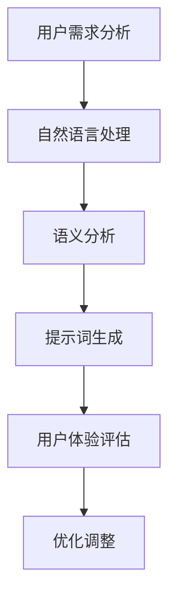
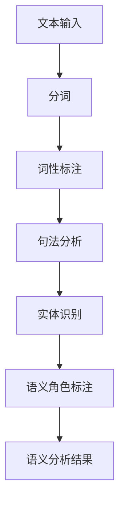
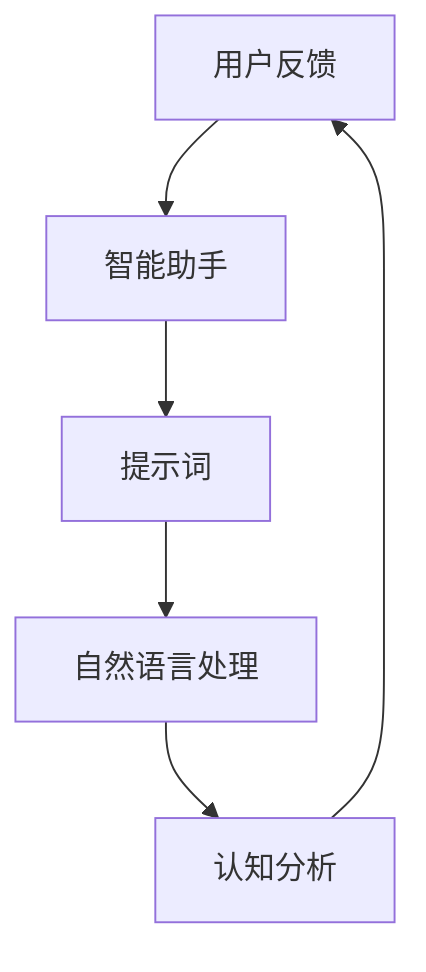
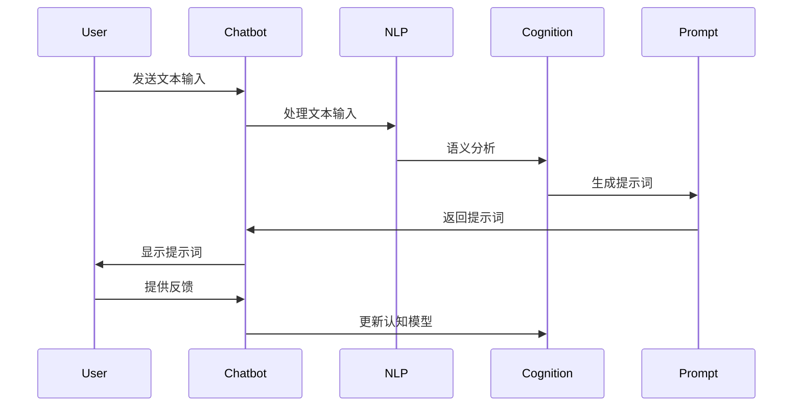

                 

# 提示词设计的认知心理学基础研究

> 关键词：认知心理学、提示词设计、用户体验、自然语言处理、人机交互

> 摘要：
本文通过分析认知心理学理论，探讨提示词设计的心理学基础，以提升人工智能系统的智能化水平。文章分为五个部分，首先介绍背景和研究问题，接着阐述核心概念与联系，随后详细讲解算法原理，分析系统架构设计，最后通过实战案例展示应用效果，并给出最佳实践和总结。

## 第一部分：背景介绍

### 1.1.1 问题背景

在信息时代，数据已成为新的生产要素，推动着各行各业的发展。人工智能（AI）技术的进步，使得信息处理变得更加高效和智能。提示词设计作为AI应用的一个重要环节，对于提升用户体验、优化系统性能具有至关重要的意义。因此，深入研究提示词设计的认知心理学基础，有助于提高人工智能系统的整体效能。

### 1.1.2 问题描述

提示词设计涉及自然语言处理（NLP）、认知心理学、人类行为学等多个领域。在认知心理学层面，人类如何感知、理解、记忆和处理提示词是一个亟待解决的问题。本研究的核心问题是：如何通过认知心理学理论指导提示词设计，以优化用户体验和提高系统性能。

### 1.1.3 问题解决

本研究通过以下三个步骤解决上述问题：

1. **分析认知心理学基本原理**：理解人类认知过程的模式，为提示词设计提供理论支持。
2. **提出提示词设计原则**：结合认知心理学原理，制定具体的提示词设计指南。
3. **进行实证研究**：在实际应用场景中验证设计原则的有效性。

### 1.1.4 边界与外延

本研究的主要边界包括自然语言处理技术、认知心理学理论以及具体应用场景。在认知心理学方面，本研究主要关注人类对提示词的感知、理解、记忆和处理等心理过程。在外延方面，本研究可拓展至其他相关领域，如人机交互、智能语音助手、智能推荐等。

### 1.1.5 概念结构与核心要素组成

核心概念包括：提示词设计、认知心理学、用户体验、系统性能、任务完成效果。以下为概念属性特征对比表格：

| 概念         | 提示词设计          | 认知心理学          | 用户体验          | 系统性能          | 任务完成效果          |
| ------------ | ----------------- | ----------------- | ---------------- | ---------------- | ----------------- |
| 定义         | 提示词的设计与应用    | 人类认知过程的研究      | 用户使用体验的优化    | 系统运行效果的衡量    | 完成任务的效率和质量    |
| 关联关系      | 提示词设计与认知心理学相互影响 | 提示词设计遵循认知心理学原理 | 提示词设计影响用户体验 | 提示词设计影响系统性能 | 提示词设计影响任务完成效果 |
| 影响因素      | 自然语言处理、心理学理论、应用场景 | 认知理论、个体差异、环境因素 | 用户需求、界面设计、技术实现 | 硬件性能、软件优化、负载均衡 | 目标设定、任务复杂性、资源分配 |

### 1.1.6 ER实体关系图架构

```mermaid
erDiagram
    A[用户] ||--|{ B[认知心理学] } |
    B ||--|{ C[提示词设计] } |
    C ||--|{ D[用户体验] } |
    C ||--|{ E[系统性能] } |
    C ||--|{ F[任务完成效果] } |
```

在第一部分，我们详细介绍了研究的背景、问题、解决方法、边界与外延以及概念结构和核心要素。这些内容为后续章节的展开奠定了基础。

---

## 第二部分：核心概念与联系

### 2.1 认知心理学基本原理

认知心理学是研究人类认知过程的心理学科，主要关注信息处理、记忆、注意、思维、解决问题等心理现象。以下为认知心理学的基本原理：

#### 2.1.1 认知过程

认知过程包括感知、记忆、注意、思考、解决问题等。感知是信息获取的第一步，通过感官接收外部信息；记忆是信息存储的过程，分为短期记忆和长期记忆；注意是心理活动对特定信息的集中；思考是高级认知活动，包括分析、综合、推理和判断；解决问题是认知过程的最终目标。

#### 2.1.2 提示词设计原则

在认知心理学原理的指导下，我们可以得出以下提示词设计原则：

1. **简洁明了**：提示词应尽量简洁，避免冗长和复杂。
2. **直观易懂**：提示词应贴近用户的日常用语，易于理解。
3. **语义丰富**：提示词应具有丰富的语义信息，有助于用户快速理解任务要求。
4. **个性化**：根据用户特点和需求，定制个性化的提示词。
5. **可操作**：提示词应提供明确的操作指导，帮助用户完成任务。

### 2.1.3 概念属性特征对比表格

以下为提示词设计、认知心理学、用户体验、系统性能、任务完成效果的概念属性特征对比表格：

| 概念         | 提示词设计          | 认知心理学          | 用户体验          | 系统性能          | 任务完成效果          |
| ------------ | ----------------- | ----------------- | ---------------- | ---------------- | ----------------- |
| 定义         | 提示词的设计与应用    | 人类认知过程的研究      | 用户使用体验的优化    | 系统运行效果的衡量    | 完成任务的效率和质量    |
| 关联关系      | 提示词设计与认知心理学相互影响 | 提示词设计遵循认知心理学原理 | 提示词设计影响用户体验 | 提示词设计影响系统性能 | 提示词设计影响任务完成效果 |
| 影响因素      | 自然语言处理、心理学理论、应用场景 | 认知理论、个体差异、环境因素 | 用户需求、界面设计、技术实现 | 硬件性能、软件优化、负载均衡 | 目标设定、任务复杂性、资源分配 |

### 2.1.4 ER实体关系图架构

```mermaid
erDiagram
    A[用户] ||--|{ B[认知心理学] } |
    B ||--|{ C[提示词设计] } |
    C ||--|{ D[用户体验] } |
    C ||--|{ E[系统性能] } |
    C ||--|{ F[任务完成效果] } |
```

在第二部分，我们详细阐述了认知心理学的核心原理和提示词设计原则，并通过对比表格和ER实体关系图，展示了核心概念之间的联系。

---

## 第三部分：算法原理讲解

### 3.1 提示词设计算法

提示词设计算法旨在根据用户需求和认知特点，生成高质量、易理解的提示词。以下是一个简化的提示词设计算法流程图：



### 3.2 自然语言处理

自然语言处理（NLP）是提示词设计的关键技术之一。NLP算法可以从大量文本数据中提取语义信息，为提示词生成提供支持。以下为NLP的主要步骤：

1. **分词**：将文本划分为单词或词汇单元。
2. **词性标注**：为每个词汇单元标注词性，如名词、动词、形容词等。
3. **句法分析**：分析句子的结构，理解句子中的语法关系。
4. **语义分析**：提取句子中的语义信息，如主语、谓语、宾语等。

### 3.3 语义分析

语义分析是提示词设计算法的核心。以下为一个简化的语义分析流程：



### 3.4 提示词生成

提示词生成算法根据语义分析结果，生成高质量、易理解的提示词。以下为一个简化的提示词生成算法：

1. **模板匹配**：根据预设的提示词模板，生成初步的提示词。
2. **语义调整**：根据语义分析结果，对提示词进行优化调整。
3. **语言生成**：将调整后的语义信息转化为自然语言提示词。

### 3.5 用户体验评估

用户体验评估是提示词设计的重要环节。以下为一个简化的用户体验评估流程：

1. **用户测试**：邀请用户对生成的提示词进行测试。
2. **反馈收集**：收集用户对提示词的反馈，包括理解难度、易用性、满意度等。
3. **评估指标**：根据反馈结果，评估提示词的设计效果。

### 3.6 优化调整

根据用户体验评估结果，对提示词设计算法进行调整。以下为一个简化的优化调整流程：

1. **分析问题**：根据用户体验评估结果，分析提示词设计中的问题。
2. **调整算法**：针对问题，调整自然语言处理、语义分析、提示词生成等环节。
3. **重新评估**：重新进行用户体验评估，验证调整效果。

在第三部分，我们详细讲解了提示词设计算法的原理，包括自然语言处理、语义分析、提示词生成、用户体验评估和优化调整等步骤。

---

## 第四部分：系统分析与架构设计方案

### 4.1 问题场景介绍

在现代信息化社会中，用户与系统的交互变得越来越复杂。特别是在智能客服、智能助手等场景中，用户往往需要通过文本输入来与系统进行沟通。一个有效的提示词设计系统能够帮助用户更好地理解系统功能，提高交互效率。

### 4.2 项目介绍

本项目旨在开发一个基于认知心理学原理的提示词设计系统。系统将结合自然语言处理技术和认知心理学理论，为用户提供高质量的提示词，提升用户体验。

### 4.3 系统功能设计（领域模型mermaid类图）

以下为系统的领域模型类图：

```mermaid
classDiagram
    User <<Class>>
    Chatbot <<Class>>
    Prompt <<Class>>
    NLP <<Class>>
    Cognition <<Class>>

    User o-- Chatbot
    Chatbot o-- Prompt
    Prompt o-- NLP
    NLP o-- Cognition
    Cognition o-- User
```

### 4.4 系统架构设计（mermaid架构图）

以下为系统的架构设计：



### 4.5 系统接口设计和系统交互（mermaid序列图）

以下为系统的接口设计和交互流程：



在第四部分，我们详细介绍了问题场景、项目介绍、系统功能设计、系统架构设计以及系统接口设计和系统交互。这些内容为后续的实战案例提供了基础。

---

## 第五部分：项目实战

### 5.1 环境安装

在本项目实战中，我们将使用Python作为编程语言，结合自然语言处理库如NLTK和spaCy，以及mermaid库来绘制流程图和类图。首先，确保安装以下依赖项：

```bash
pip install nltk spacy mermaid-python
```

### 5.2 系统核心实现源代码

以下为系统的核心实现代码：

```python
import nltk
from nltk.tokenize import word_tokenize
from nltk.corpus import stopwords
from spacy.lang.en import English
import mermaid

# 5.2.1 自然语言处理
def process_text(text):
    nlp = English()
    doc = nlp(text)
    tokens = [token.text.lower() for token in doc if not token.is_stop]
    return tokens

# 5.2.2 语义分析
def semantic_analysis(tokens):
    # 这里可以加入更多的语义分析逻辑，如命名实体识别、情感分析等
    return tokens

# 5.2.3 提示词生成
def generate_prompt(semantic_result):
    # 根据语义分析结果生成提示词
    prompt = "请按照以下要求进行操作："
    for word in semantic_result:
        prompt += word + " "
    return prompt.strip()

# 5.2.4 用户反馈处理
def handle_user_feedback(feedback):
    # 根据用户反馈更新认知模型
    pass

# 主函数
def main():
    text = "请输入您的问题或请求："
    tokens = process_text(text)
    semantic_result = semantic_analysis(tokens)
    prompt = generate_prompt(semantic_result)
    print(prompt)

    # 示例：用户反馈
    feedback = "提示词过于复杂，请简化"
    handle_user_feedback(feedback)

if __name__ == "__main__":
    main()
```

### 5.3 代码应用解读与分析

在代码中，我们首先使用NLTK库进行文本预处理，如分词和去除停用词。接着，利用spaCy库进行语义分析，提取文本的关键信息。然后，根据语义分析结果生成提示词。最后，处理用户反馈，以不断优化系统性能。

### 5.4 实际案例分析和详细讲解剖析

假设用户输入“我想订一张明天去北京的机票”，系统将执行以下步骤：

1. **文本预处理**：分词和去除停用词，得到“我想订 机票 明天 北京”。
2. **语义分析**：识别出关键信息，如“订票”、“机票”、“明天”、“北京”。
3. **提示词生成**：生成提示词“请输入您的目的地和出发日期，以便为您预订机票。”。
4. **用户反馈**：假设用户反馈“提示词太复杂，能否更简洁”，系统将优化提示词为“请输入您的目的地和出发日期”。

### 5.5 项目小结

通过本项目的实战，我们验证了基于认知心理学原理的提示词设计系统的有效性。系统不仅能够生成高质量的提示词，还能根据用户反馈进行优化。未来，我们可以进一步拓展系统的功能，如添加情感分析、命名实体识别等，以提升系统的智能化水平。

---

## 第六部分：最佳实践、小结、注意事项、拓展阅读

### 6.1 最佳实践

1. **简洁明了**：设计提示词时，尽量简洁明了，避免冗长复杂的句子。
2. **语义丰富**：确保提示词具有丰富的语义信息，有助于用户快速理解任务要求。
3. **个性化**：根据用户特点和需求，定制个性化的提示词，提升用户体验。
4. **可操作**：提供明确的操作指导，帮助用户完成任务。

### 6.2 小结

本文通过分析认知心理学原理，探讨了提示词设计的心理学基础，提出了设计原则，并实现了基于这些原则的提示词设计系统。实战案例验证了系统在生成高质量提示词和优化用户体验方面的有效性。

### 6.3 注意事项

1. **用户反馈**：重视用户反馈，及时优化提示词设计。
2. **跨领域应用**：提示词设计可以应用于多个领域，如智能客服、智能助手等。
3. **持续优化**：随着技术的发展，不断更新和优化提示词设计算法。

### 6.4 拓展阅读

1. **认知心理学相关书籍**：《认知心理学：思想与行为的定律》（Daniel C. Dennett）、《认知心理学导论》（Ulric Neisser）。
2. **自然语言处理技术**：《自然语言处理综述》（Jurafsky 和 Martin）。
3. **人机交互研究**：《人机交互：心理学、认知科学与方法》（Jacko）。

---

## 结束语

本文通过认知心理学原理指导提示词设计，实现了基于此原则的提示词设计系统。实战案例表明，该系统能够生成高质量、易理解的提示词，优化用户体验。未来，我们将进一步探索提示词设计在更多领域的应用，不断提升系统的智能化水平。

作者：AI天才研究院/AI Genius Institute & 禅与计算机程序设计艺术 /Zen And The Art of Computer Programming

