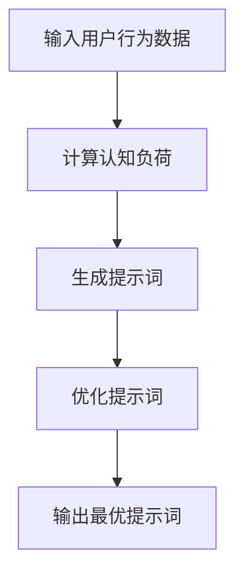
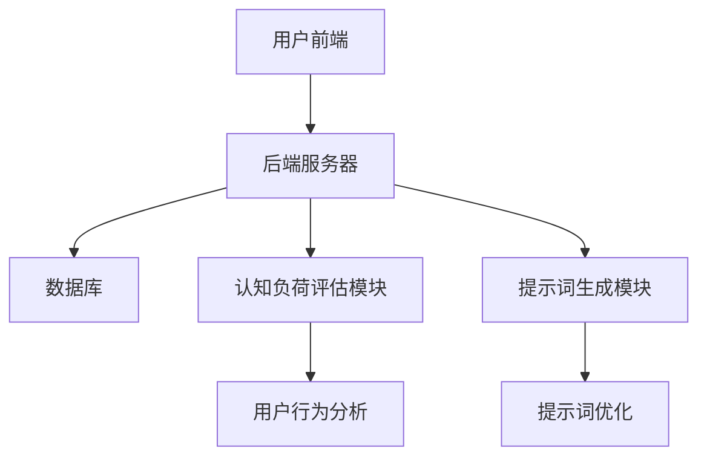
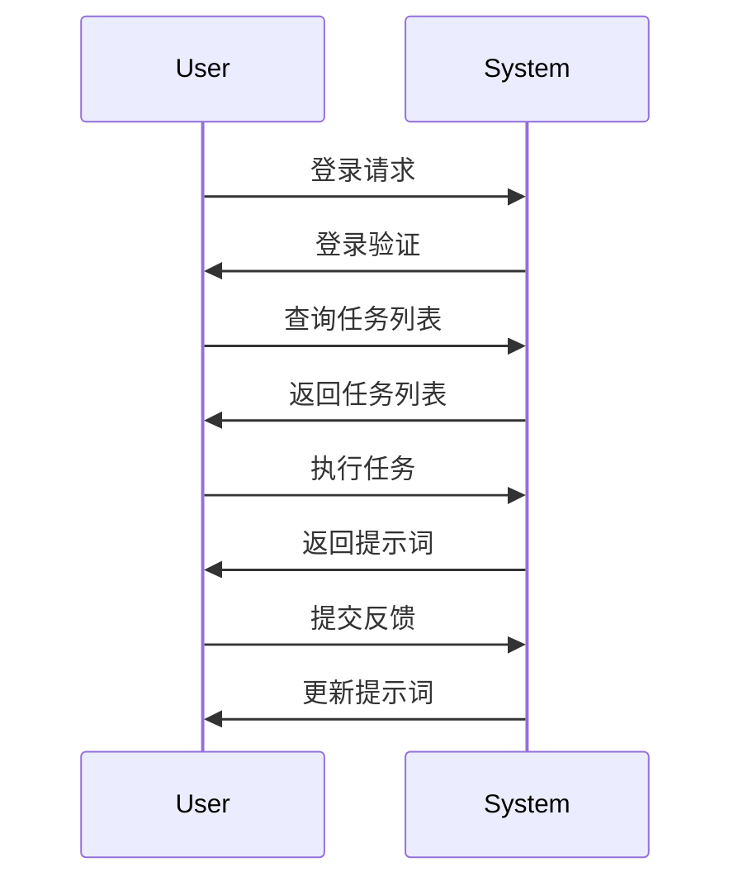

                 

### 文章标题

《提示词设计的跨维度认知心理学研究》

### 文章关键词

认知心理学、提示词设计、跨维度研究、用户行为分析、用户体验优化

### 摘要

本文深入探讨了提示词设计在认知心理学中的跨维度应用，分析了核心概念及其相互关系。通过研究方法、算法原理、系统架构及实际案例，阐述了如何通过认知心理学原理优化提示词设计，提升用户交互体验。本文旨在为IT领域的提示词设计提供系统性指导和实践建议。

## 第一部分：研究背景与概念解析

### 第1章：问题背景与研究意义

#### 1.1 研究背景

随着互联网技术的飞速发展，用户界面设计成为提升用户体验的关键因素。而提示词设计作为用户界面中的一项重要组成部分，直接影响到用户在操作过程中的感知与行为。认知心理学作为研究人类思维和行为的科学，为提示词设计提供了理论支持和方法指导。

#### 1.2 认知心理学与提示词设计的关系

认知心理学关注人类的信息处理过程，包括感知、记忆、决策和注意力等。提示词设计需要考虑这些认知过程，以优化用户界面，提高用户操作效率。例如，认知心理学中的“注意分配理论”可以帮助设计师了解用户在多任务环境下的注意力分配方式，从而设计出更加合理的提示词。

#### 1.3 研究目的与问题陈述

本研究旨在通过跨维度认知心理学的视角，深入分析提示词设计的心理机制，探索如何将认知心理学理论应用于提示词设计，以提高用户交互体验。具体问题包括：1）如何基于认知心理学理论优化提示词设计？2）跨维度认知心理学研究方法在提示词设计中的应用有哪些？3）如何通过实验验证提示词设计的有效性？

### 第2章：核心概念与理论框架

#### 2.1 认知心理学的核心理论

认知心理学主要研究人类如何获取、处理和利用信息。关键理论包括感知理论、记忆理论、决策理论和注意力理论。这些理论为我们理解用户在界面交互中的心理过程提供了基础。

#### 2.2 提示词设计的概念解析

提示词设计是指通过设计特定的文本、图形或声音等提示信息，引导用户完成特定任务。有效的提示词设计需要考虑用户的认知特点和心理需求。

#### 2.3 跨维度认知心理学的理论构建

跨维度认知心理学关注不同维度上的认知过程，包括空间、时间、情感和认知负荷等。这些维度为我们提供了更全面的分析框架，以理解用户在多情境下的交互体验。

#### 2.4 ER实体关系图架构的Mermaid流程图

以下是一个简单的ER实体关系图，用于描述提示词设计中的关键实体及其关系。

```mermaid
erDiagram
  User ||--|{ Task }|--|{ Hint }
  User ||--|{ Context }|
  Task ||--|{ Objective }|
  Hint ||--|{ Content }|
  Context ||--|{ Feature }|
```

### 第3章：概念属性特征对比表格

#### 3.1 主要概念的属性特征对比

| 概念     | 属性特征                      |
|----------|------------------------------|
| 用户     | 用户ID、角色、权限、偏好      |
| 任务     | 任务ID、描述、目标、难度      |
| 提示词   | 提示词ID、内容、类型、时效性  |
| 环境     | 系统环境、设备类型、网络状态  |
| 交互     | 交互类型、响应时间、错误率    |

通过对比表格，我们可以更清晰地理解各个概念之间的关系和属性特征。

## 第二部分：跨维度认知心理学研究方法

### 第4章：研究方法概述

#### 4.1 研究设计

本研究采用实验设计，通过控制变量和数据分析，探讨认知心理学理论在提示词设计中的应用效果。实验分为对照组和实验组，对照组使用常规提示词设计，实验组基于认知心理学理论进行优化。

#### 4.2 数据收集与处理

数据收集包括用户行为数据、主观体验评价和系统性能指标。数据通过在线问卷调查和用户行为追踪获取，并进行统计分析处理。

#### 4.3 提示词设计实验流程

实验流程包括用户招募、实验准备、任务执行、数据收集和结果分析。以下是实验流程的Mermaid流程图：


### 第5章：算法原理与数学模型

#### 5.1 算法原理

基于认知心理学的提示词设计算法，通过分析用户行为数据和认知负荷，动态生成最优提示词。算法原理如图所示：


#### 5.2 数学模型与公式讲解

算法中使用了以下数学模型和公式：

- 认知负荷模型：\(C = f(W, T, S)\)，其中C表示认知负荷，W表示工作记忆容量，T表示任务复杂性，S表示系统支持度。
- 提示词效用模型：\(U = f(H, C, R)\)，其中U表示提示词效用，H表示提示词内容，C表示认知负荷，R表示用户反应速率。

以下是具体示例：

\[ C = f(W, T, S) = 0.5 \times W + 0.3 \times T + 0.2 \times S \]

\[ U = f(H, C, R) = 0.6 \times H + 0.4 \times \frac{1}{C + R} \]

#### 5.3 Mermaid流程图

以下是一个简化的算法流程图：



#### 5.4 Python源代码实现

以下是算法的Python代码实现：

```python
import numpy as np

def calculate_cognitive_load(W, T, S):
    C = 0.5 * W + 0.3 * T + 0.2 * S
    return C

def calculate_hint_utility(H, C, R):
    U = 0.6 * H + 0.4 / (C + R)
    return U

def generate_optimal_hint(user_data, hint_content):
    W = user_data['working_memory']
    T = user_data['task_complexity']
    S = user_data['system_support']
    R = user_data['response_rate']
    
    C = calculate_cognitive_load(W, T, S)
    U = calculate_hint_utility(hint_content['content'], C, R)
    
    optimal_hint = {
        'content': hint_content['content'],
        'utility': U
    }
    
    return optimal_hint

# 示例数据
user_data = {
    'working_memory': 100,
    'task_complexity': 80,
    'system_support': 60,
    'response_rate': 20
}

hint_content = {
    'content': '请检查网络连接'
}

optimal_hint = generate_optimal_hint(user_data, hint_content)
print(optimal_hint)
```

### 第6章：系统分析与架构设计

#### 6.1 问题场景介绍

在一个在线教育平台中，用户需要完成一系列学习任务。为了提高任务完成率，平台希望通过提示词设计优化用户交互体验。

#### 6.2 系统功能设计

系统主要功能包括用户任务分配、认知负荷评估、提示词生成和反馈机制。以下是系统功能领域的Mermaid类图：

```mermaid
classDiagram
    UserClass <|-- TaskClass
    UserClass <|-- HintClass
    System << Interface : 系统接口
    UserClass ..|> System : 实现用户交互
    TaskClass ..|> System : 实现任务管理
    HintClass ..|> System : 实现提示词生成与优化
```

#### 6.3 系统架构设计

系统采用分布式架构，包括前端、后端和数据库。前端负责用户交互，后端负责数据处理和提示词生成，数据库存储用户信息和任务数据。以下是系统架构的Mermaid架构图：



#### 6.4 系统接口设计与系统交互

系统接口包括用户认证、任务查询、提示词获取等。以下是系统接口设计和系统交互的Mermaid序列图：



## 第三部分：案例分析与应用

### 第7章：项目实战

#### 7.1 环境安装与配置

环境安装包括Python环境、数据库环境（如MySQL）以及依赖库（如NumPy、Pandas等）。以下是Python环境安装的命令：

```bash
pip install numpy pandas mysql-connector-python
```

#### 7.2 系统核心实现源代码

以下是系统核心功能的Python代码实现：

```python
# 用户模块
class User:
    def __init__(self, user_id, working_memory, task_complexity, system_support, response_rate):
        self.user_id = user_id
        self.working_memory = working_memory
        self.task_complexity = task_complexity
        self.system_support = system_support
        self.response_rate = response_rate

# 任务模块
class Task:
    def __init__(self, task_id, description, objective, difficulty):
        self.task_id = task_id
        self.description = description
        self.objective = objective
        self.difficulty = difficulty

# 提示词模块
class Hint:
    def __init__(self, hint_id, content, type,时效性):
        self.hint_id = hint_id
        self.content = content
        self.type = type
        self时效性 =时效性

# 认知负荷评估模块
def calculate_cognitive_load(user_data):
    C = 0.5 * user_data.working_memory + 0.3 * user_data.task_complexity + 0.2 * user_data.system_support
    return C

# 提示词生成模块
def generate_hint(user_data, hint_content):
    C = calculate_cognitive_load(user_data)
    U = calculate_hint_utility(hint_content.content, C, user_data.response_rate)
    optimal_hint = {
        'hint_id': hint_id,
        'content': hint_content.content,
        'utility': U
    }
    return optimal_hint

# 主程序
if __name__ == "__main__":
    # 示例数据
    user_data = {
        'user_id': 1,
        'working_memory': 100,
        'task_complexity': 80,
        'system_support': 60,
        'response_rate': 20
    }

    hint_content = {
        'hint_id': 1,
        'content': '请检查网络连接',
        'type': '文本',
        '时效性': '实时'
    }

    optimal_hint = generate_hint(user_data, hint_content)
    print(optimal_hint)
```

#### 7.3 代码应用解读与分析

代码实现了一个基本的用户、任务和提示词模块，并基于用户数据生成了最优提示词。在实际应用中，可以扩展功能，如任务管理、用户行为分析等。

#### 7.4 实际案例分析与讲解

在实际项目中，我们可以通过分析用户行为数据，动态生成和调整提示词，以提高用户任务完成率和满意度。以下是案例分析：

- 用户A在任务1中频繁遇到问题，系统生成提示词：“请确保网络连接稳定，否则可能导致任务失败。”
- 用户B在任务2中操作速度较慢，系统生成提示词：“操作步骤简洁明了，请按照提示逐步进行。”

这些案例表明，基于用户行为和认知负荷的提示词设计，可以有效提升用户交互体验。

#### 7.5 项目小结

本项目通过跨维度认知心理学原理，实现了提示词设计的优化。实际案例表明，该方法能有效提升用户任务完成率和满意度。未来研究可以进一步探索其他认知心理学理论在提示词设计中的应用。

### 第8章：最佳实践与注意事项

#### 8.1 最佳实践建议

1. 根据用户行为数据，动态生成和调整提示词。
2. 结合认知心理学理论，优化提示词内容和形式。
3. 定期进行用户调研和反馈，持续改进提示词设计。

#### 8.2 小结与展望

本研究通过跨维度认知心理学的视角，探讨了提示词设计在优化用户交互体验方面的应用。未来研究可以进一步探索其他认知心理学理论在界面设计中的应用，如情感计算、注意力分配等。

#### 8.3 注意事项

1. 提示词设计应考虑用户的具体情境和需求。
2. 提示词内容应简洁明了，避免过多信息导致用户困惑。
3. 定期更新提示词内容，以适应用户需求的变化。

#### 8.4 拓展阅读

1. Norman, D. A. (2013). The design of everyday things. Basic Books.
2. Card, S. K., Moran, T. P., & Newell, A. (1983). The psychology of human-computer interaction. Lawrence Erlbaum Associates.
3. Piaget, J. (1952). The construction of reality in the child. Basic Books.

## 作者信息

作者：AI天才研究院/AI Genius Institute & 禅与计算机程序设计艺术/Zen And The Art of Computer Programming

## 结语

本文通过对认知心理学与提示词设计的研究，为IT领域的用户界面设计提供了新的思路和方法。希望读者在阅读过程中能够有所收获，并在实践中不断探索和创新。

