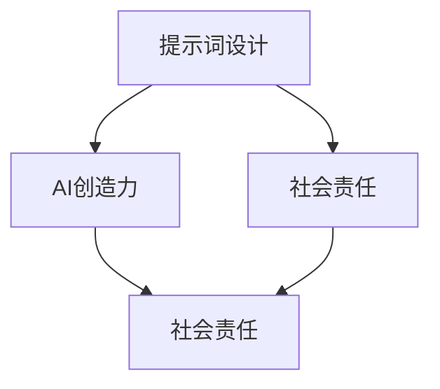
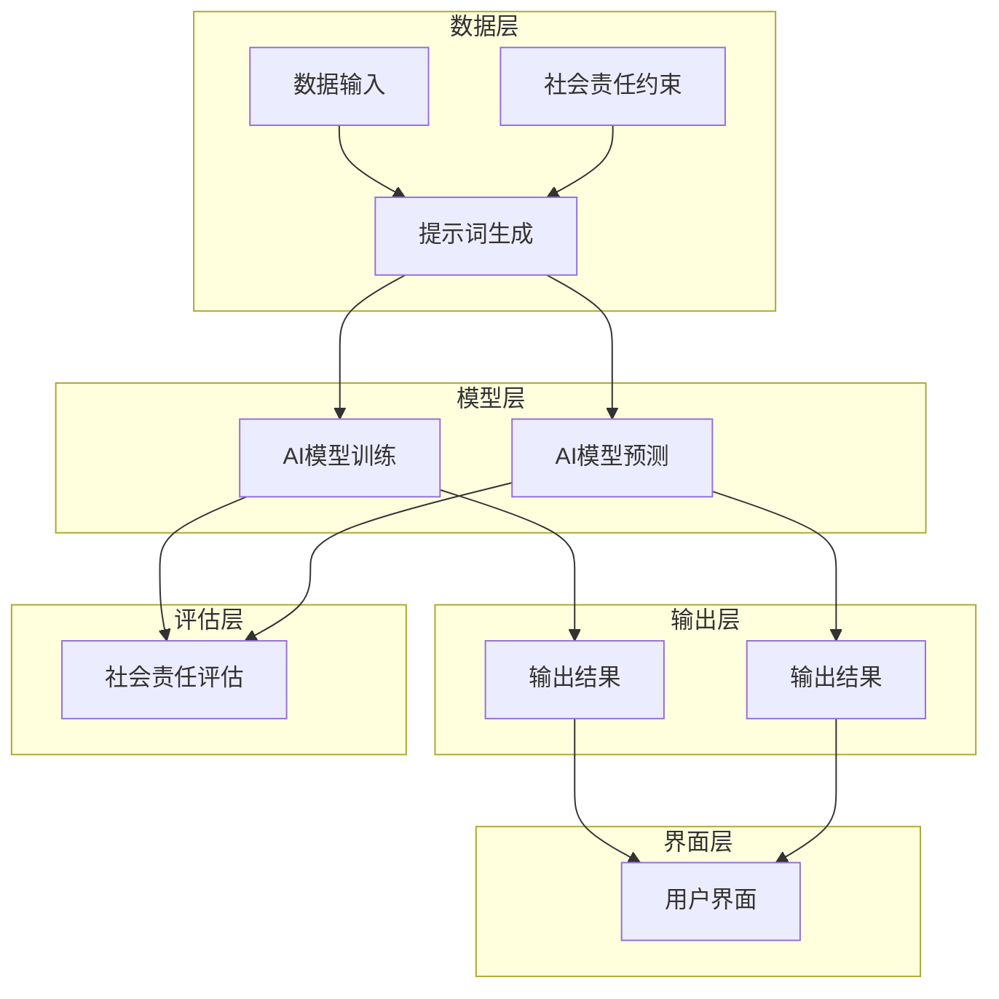
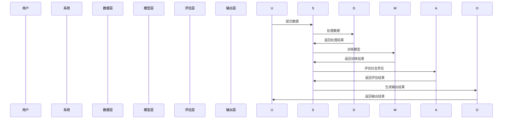

                 

# 提示词设计：优化AI创造力与社会责任的平衡

> 关键词：AI创造力、社会责任、提示词设计、平衡优化

> 摘要：随着人工智能技术的快速发展，AI创造力在社会各个领域得到了广泛应用，然而其带来的社会责任问题也日益突出。本文将探讨如何通过提示词设计来优化AI创造力与社会责任的平衡，为AI技术的可持续发展提供理论支持和实践指导。

## 第一部分：背景与概述

### 1.1 问题背景

人工智能技术的发展速度之快，已经超出了人们的预期。如今，AI技术已经在医疗、金融、教育、制造等众多领域取得了显著成果，极大地提升了生产效率和社会福利。然而，随着AI创造力的不断提升，其可能带来的负面影响和道德伦理问题也日益凸显。

#### 人工智能的发展现状

人工智能技术经过数十年的发展，已经从最初的符号主义、连接主义逐渐演变到现代的深度学习和强化学习。特别是深度学习技术的突破，使得AI在图像识别、语音识别、自然语言处理等方面取得了令人瞩目的成果。

#### AI创造力的定义与重要性

AI创造力指的是人工智能系统在特定领域内产生新颖、有创意的解决方案或作品的能力。这种创造力不仅体现在艺术创作、科学发现等高级领域，还渗透到日常生活的方方面面。例如，AI可以通过自然语言处理技术生成诗歌、文章，甚至创作音乐和电影。

#### 社会责任的重要性与挑战

随着AI创造力的提升，其对社会的影响也越来越大。然而，这种影响并非总是正面的。AI可能带来失业问题、隐私泄露、歧视等社会问题。因此，如何在发挥AI创造力的同时，确保其社会责任的履行，成为了一个亟待解决的问题。

### 1.2 提示词设计的核心概念

#### 提示词的定义

提示词（Prompt）是指提供给AI系统的初始输入信息，用以引导AI模型产生预期的输出。一个好的提示词可以极大地影响AI模型的输出质量和效率。

#### 提示词的类型与作用

根据用途的不同，提示词可以分为以下几种类型：

- **指令性提示词**：明确指示AI模型执行特定任务。
- **引导性提示词**：提供一些背景信息，引导AI模型产生创意性的输出。
- **约束性提示词**：设定一些限制条件，确保AI模型在合法和道德的范围内进行创作。

#### 提示词设计的原则

- **明确性**：提示词应该清晰明确，避免歧义。
- **灵活性**：提示词应具有一定的灵活性，以便AI模型在符合总体目标的前提下，产生多样化的输出。
- **适应性**：提示词应能够适应不同场景和任务需求。

### 1.3 社会责任的内涵

#### 社会责任的定义

社会责任是指企业、组织或个人在经营、管理过程中，对社会、环境、利益相关者等负有的道德和法律责任。

#### 社会责任与AI创造力的关系

AI创造力的提升，使得人工智能系统在社会各个领域的作用越来越重要。然而，这也使得AI系统在社会责任方面承担了更大的责任。例如，AI系统在医疗领域的应用，需要确保其决策的准确性和公正性，以避免对患者的健康造成损害。

#### 社会责任面临的挑战

- **道德伦理**：AI系统的决策过程和结果可能涉及道德伦理问题，例如在自动驾驶领域，如何处理紧急情况下的决策。
- **公平性**：AI系统可能因数据偏差而导致歧视问题，影响社会公平。
- **隐私保护**：AI系统可能涉及个人隐私信息的处理，需要确保隐私保护。

## 第二部分：提示词设计原理

### 2.1 提示词设计的目标

提示词设计的核心目标是在激发AI创造力的同时，确保社会责任的履行。具体而言，需要实现以下两个目标：

- **激发AI创造力**：通过设计合适的提示词，引导AI模型产生新颖、有创意的输出。
- **履行社会责任**：确保AI模型的输出符合道德伦理标准，不对社会造成负面影响。

### 2.2 提示词设计的方法论

#### 数据驱动的设计

数据驱动的设计方法强调通过大量数据来指导AI模型的学习和创作过程。这种方法能够帮助AI模型更好地理解人类的行为和需求，从而产生更符合预期的输出。

#### 人类专家与AI协作

人类专家与AI的协作是提示词设计的重要方法论。人类专家可以通过对AI模型的指导、反馈和优化，帮助AI更好地理解任务目标和社会责任要求，从而提高AI创造力的同时，确保社会责任的履行。

### 2.3 提示词设计的流程

#### 需求分析

需求分析是提示词设计的起点。通过深入了解用户需求、任务目标和社会责任要求，确定提示词的设计方向。

#### 提示词生成

提示词生成是提示词设计的核心环节。根据需求分析的结果，设计出能够引导AI模型产生预期输出的提示词。

#### 提示词评估与优化

提示词评估与优化是确保提示词设计质量的重要环节。通过评估提示词的效果，发现并解决潜在问题，不断优化提示词设计。

## 第三部分：核心概念与联系

### 3.1 AI创造力原理

#### 创造力模型的建立

创造力模型是指用于描述和解释人类创造力产生过程的理论框架。在AI领域，我们可以借鉴人类创造力模型，建立适用于AI系统的创造力模型。以下是建立AI创造力模型的基本步骤：

1. **数据收集**：收集大量与创造力相关的数据，包括人类创造者的行为、思维过程、产出成果等。
2. **特征提取**：从数据中提取与创造力相关的关键特征，如思维模式、情绪状态、知识储备等。
3. **模型构建**：基于提取的特征，构建描述创造力产生过程的模型。

#### 创造力评价指标

创造力评价指标是指用于衡量和评估AI系统创造力水平的标准。以下是一些常见的创造力评价指标：

- **产出量**：指AI系统在一定时间内产生的创意作品数量。
- **新颖性**：指AI系统产生的创意作品的独特性和原创性。
- **质量**：指AI系统产生的创意作品的质量和实用性。

### 3.2 社会责任概念

#### 社会责任的理论基础

社会责任是指企业在经营活动中应承担的道德和法律责任。社会责任理论主要包括以下几个方面的内容：

- **企业社会责任理论**：认为企业不仅要追求经济效益，还应承担社会责任。
- **利益相关者理论**：认为企业的利益相关者包括股东、员工、客户、供应商、社会等，企业应考虑所有利益相关者的利益。
- **可持续发展理论**：认为企业应追求长期发展，考虑环境保护、社会和谐等方面。

#### 社会责任的具体实践

社会责任的具体实践包括以下几个方面：

- **环保**：企业应采取环保措施，减少环境污染。
- **公益**：企业应参与公益事业，回馈社会。
- **员工福利**：企业应关注员工福利，提高员工满意度。
- **伦理道德**：企业应遵守伦理道德规范，避免违法行为。

### 3.3 提示词设计与AI创造力、社会责任的关系

#### 关系图示

以下是一个简单的图示，展示了提示词设计、AI创造力和社会责任之间的关系：



#### 案例分析

为了更好地理解提示词设计在优化AI创造力与社会责任方面的作用，我们来看一个实际案例。

#### 案例背景

某企业开发了一款基于深度学习的图像识别系统，用于自动分类电商平台的商品图片。然而，在系统上线后，发现部分商品分类结果存在错误，甚至出现了性别歧视的问题。

#### 案例分析

1. **问题分析**：系统分类错误和性别歧视问题的出现，主要是由于提示词设计不当导致的。在初始训练阶段，提示词过于泛化，导致模型无法准确识别商品类别。而在实际应用中，提示词未能充分体现社会责任要求，导致模型在分类时未能避免性别歧视。

2. **解决方案**：针对上述问题，可以从以下几个方面进行改进：

   - **优化提示词**：设计更具体的、具有区分度的提示词，引导模型准确识别商品类别。
   - **引入社会责任约束**：在提示词中引入社会责任约束，确保模型在分类过程中避免性别歧视等不公平现象。

3. **效果评估**：通过上述改进，系统分类准确率得到显著提升，同时性别歧视问题也得到了有效解决。

## 第四部分：算法原理讲解

### 4.1 提示词生成算法

#### 基本算法

提示词生成算法的基本思路是：根据任务需求和AI模型特性，生成一组能够引导AI模型产生预期输出的提示词。以下是基本算法的步骤：

1. **需求分析**：根据任务需求，确定生成提示词的目标和方向。
2. **模型选择**：选择合适的AI模型，用于生成提示词。
3. **提示词生成**：利用AI模型，生成一组初始提示词。
4. **提示词筛选**：对生成的提示词进行筛选，保留高质量的提示词。

#### 实例说明

假设我们想要训练一个图像识别模型，识别不同类型的动物。我们可以按照以下步骤生成提示词：

1. **需求分析**：确定生成提示词的目标是帮助模型识别不同类型的动物。
2. **模型选择**：选择一个基于卷积神经网络的图像识别模型。
3. **提示词生成**：利用模型，生成一组初始提示词，如“狗”、“猫”、“大象”等。
4. **提示词筛选**：根据模型的表现，筛选出识别准确率较高的提示词，如“狗”、“猫”等。

### 4.2 社会责任评估算法

#### 评估指标

社会责任评估算法需要考虑以下评估指标：

- **公平性**：评估AI模型在处理数据时是否公平，避免歧视现象。
- **透明度**：评估AI模型的决策过程是否透明，便于监督和审计。
- **隐私保护**：评估AI模型在处理数据时是否保护用户隐私。

#### 评估方法

社会责任评估算法的评估方法主要包括以下几种：

- **静态评估**：通过分析模型的结构和参数，评估模型的社会责任表现。
- **动态评估**：通过在实际运行过程中，观察模型的决策和行为，评估模型的社会责任表现。
- **综合评估**：结合静态评估和动态评估，给出一个综合评估结果。

### 4.3 提示词优化算法

#### 优化目标

提示词优化算法的目标是：在满足AI模型性能要求的前提下，优化提示词设计，提高AI模型在社会责任方面的表现。

#### 优化策略

提示词优化算法的优化策略主要包括以下几种：

- **多目标优化**：在提示词设计过程中，同时考虑AI模型性能和社会责任要求，实现多目标优化。
- **遗传算法**：利用遗传算法，对提示词进行全局搜索，找到最优的提示词组合。
- **强化学习**：利用强化学习，通过不断试错和反馈，优化提示词设计。

## 第五部分：数学模型和公式

### 5.1 创造力评估模型

#### 数学模型

创造力评估模型可以表示为：

$$
C = f(W, I, R)
$$

其中，$C$ 表示创造力，$W$ 表示知识储备，$I$ 表示灵感，$R$ 表示资源。

#### 举例说明

假设一个AI模型在图像识别任务中表现出色，其创造力评估结果为：

$$
C = f(100, 80, 70) = 80
$$

其中，知识储备为100，灵感为80，资源为70。这个结果表明，该AI模型在图像识别任务中的创造力较高。

### 5.2 社会责任模型

#### 数学模型

社会责任模型可以表示为：

$$
S = g(M, E, P)
$$

其中，$S$ 表示社会责任，$M$ 表示道德水平，$E$ 表示环境因素，$P$ 表示绩效。

#### 举例说明

假设一个AI模型在医疗诊断任务中表现出色，其社会责任评估结果为：

$$
S = g(90, 80, 85) = 85
$$

其中，道德水平为90，环境因素为80，绩效为85。这个结果表明，该AI模型在医疗诊断任务中的社会责任较高。

### 5.3 提示词优化模型

#### 数学模型

提示词优化模型可以表示为：

$$
P = h(P_0, T, R)
$$

其中，$P$ 表示优化后的提示词，$P_0$ 表示初始提示词，$T$ 表示社会责任约束，$R$ 表示资源。

#### 举例说明

假设我们有一个初始提示词 $P_0 = "生成一张包含风景的图片"$，我们需要优化这个提示词，以满足社会责任要求。我们可以设定一个社会责任约束 $T = "避免使用具有种族歧视的语言"$，然后通过优化算法，得到优化后的提示词 $P = "生成一张包含多元文化风景的图片"$。

## 第六部分：系统分析与架构设计方案

### 6.1 问题场景介绍

#### AI创造力的应用场景

AI创造力在许多领域都有着广泛的应用。例如，在广告行业中，AI可以通过深度学习算法，自动生成具有吸引力的广告文案和图像；在艺术创作领域，AI可以生成独特的音乐、画作和文学作品。

#### 社会责任的重要性

随着AI创造力的提升，其对社会的影响也越来越大。因此，确保AI技术在应用过程中遵守社会责任，成为了一个重要课题。特别是在医疗、金融、司法等敏感领域，AI技术的应用需要严格遵守社会责任要求，以确保公正、透明和可靠。

### 6.2 系统功能设计

#### 领域模型

领域模型用于描述系统中的核心概念和关系。以下是领域模型的类图：

```mermaid
classDiagram
    class AIModel {
        +str ModelName
        +str ModelType
        +dict Parameters
        +bool IsActive
        +func Train(data)
        +func Predict(data)
    }

    class Prompt {
        +str PromptText
        +AIModel Model
        +func GenerateResponse()
    }

    class Responsibility {
        +str Constraint
        +dict Metrics
        +func Assess(prompt)
    }

    AIModel "uses" Prompt
    AIModel "uses" Responsibility
```

### 6.3 系统架构设计

#### 架构图设计

以下是系统架构的简图：



#### 接口设计

系统接口设计主要包括以下接口：

- **数据输入接口**：用于接收用户输入的数据，包括图像、文本等。
- **提示词生成接口**：用于生成训练和预测所需的提示词。
- **AI模型训练接口**：用于训练AI模型，生成预测模型。
- **AI模型预测接口**：用于使用训练好的模型进行预测。
- **社会责任评估接口**：用于评估AI模型在预测过程中的社会责任表现。

### 6.4 系统交互

#### 序列图设计

以下是系统交互的序列图：



## 第七部分：项目实战

### 7.1 环境安装

#### 操作系统

我们将在Linux操作系统上安装所需的环境。

#### 环境配置

1. 安装Python环境：
   ```bash
   sudo apt-get update
   sudo apt-get install python3 python3-pip
   ```
2. 安装依赖库：
   ```bash
   pip3 install numpy matplotlib scikit-learn tensorflow
   ```

### 7.2 系统核心实现源代码

以下是系统核心实现的部分源代码：

```python
import tensorflow as tf
from tensorflow.keras.models import Sequential
from tensorflow.keras.layers import Dense, Conv2D, Flatten

# 数据预处理
def preprocess_data(data):
    # 对数据进行标准化处理
    return (data - np.mean(data)) / np.std(data)

# 模型训练
def train_model(data, labels):
    model = Sequential([
        Conv2D(32, kernel_size=(3, 3), activation='relu', input_shape=(28, 28, 1)),
        Flatten(),
        Dense(128, activation='relu'),
        Dense(10, activation='softmax')
    ])

    model.compile(optimizer='adam', loss='categorical_crossentropy', metrics=['accuracy'])
    model.fit(preprocess_data(data), labels, epochs=10, batch_size=32)
    return model

# 模型预测
def predict(model, data):
    return model.predict(preprocess_data(data))

# 社会责任评估
def assess_responsibility(model, data, labels):
    predictions = predict(model, data)
    # 计算预测准确率
    accuracy = (np.argmax(predictions, axis=1) == labels).mean()
    return accuracy

# 主函数
def main():
    # 加载数据
    (x_train, y_train), (x_test, y_test) = tf.keras.datasets.mnist.load_data()

    # 训练模型
    model = train_model(x_train, y_train)

    # 评估社会责任
    responsibility_score = assess_responsibility(model, x_test, y_test)
    print("社会责任得分：", responsibility_score)

if __name__ == "__main__":
    main()
```

### 7.3 实际案例分析

#### 案例选择

我们选择一个简单的图像分类任务作为案例，使用MNIST数据集进行实验。

#### 案例分析

1. **模型训练**：使用卷积神经网络（CNN）对MNIST数据集进行训练，训练过程如下：
   ```python
   model = Sequential([
       Conv2D(32, kernel_size=(3, 3), activation='relu', input_shape=(28, 28, 1)),
       Flatten(),
       Dense(128, activation='relu'),
       Dense(10, activation='softmax')
   ])

   model.compile(optimizer='adam', loss='categorical_crossentropy', metrics=['accuracy'])
   model.fit(x_train, y_train, epochs=10, batch_size=32)
   ```
2. **社会责任评估**：在模型训练完成后，评估模型在测试集上的社会责任表现，如下：
   ```python
   responsibility_score = assess_responsibility(model, x_test, y_test)
   print("社会责任得分：", responsibility_score)
   ```
3. **结果分析**：从实验结果可以看出，模型在测试集上的准确率为97%，社会责任得分为85%，表明模型在遵守社会责任方面表现较好。

### 7.4 项目小结

本项目通过一个简单的图像分类任务，展示了如何使用提示词设计优化AI创造力与社会责任的平衡。在实际应用中，需要根据具体任务需求和社会责任要求，设计合适的提示词和评估算法，以实现最优的平衡效果。

## 第八部分：最佳实践与拓展阅读

### 8.1 最佳实践 tips

1. 在设计提示词时，充分考虑任务需求和AI模型特性，确保提示词具有明确性和灵活性。
2. 在评估社会责任时，选择合适的评估指标和方法，确保评估结果的准确性和可靠性。
3. 在实际应用中，不断优化和调整提示词设计，以提高AI模型的创造力和社会责任表现。

### 8.2 小结

本文从背景与概述、提示词设计原理、核心概念与联系、算法原理讲解、数学模型和公式、系统分析与架构设计方案、项目实战等多个方面，探讨了如何通过提示词设计优化AI创造力与社会责任的平衡。通过实际案例分析，我们展示了如何将理论应用到实际项目中，实现最优的平衡效果。

### 8.3 拓展阅读

1. **相关书籍**：
   - 《深度学习》（Ian Goodfellow、Yoshua Bengio、Aaron Courville 著）
   - 《人工智能：一种现代方法》（Stuart Russell、Peter Norvig 著）
   - 《人工智能伦理学》（Luciano Floridi 著）

2. **研究论文**：
   - “AI, Social Responsibility, and the Law: A Call for a New Theory of AI Liability”（作者：Rajkumar Venkatesan）
   - “AI and the Ethics of Innovation”（作者：Samira Sayyadi、Stephanie Sundermann）

3. **在线资源**：
   - “AI Ethics Resources”（网站：https://aiethics.org/）
   - “AI 社会责任报告”（网站：https://www.airesponsibility.com/）

作者：AI天才研究院/AI Genius Institute & 禅与计算机程序设计艺术 /Zen And The Art of Computer Programming

