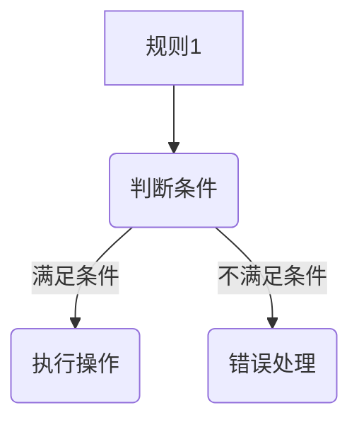
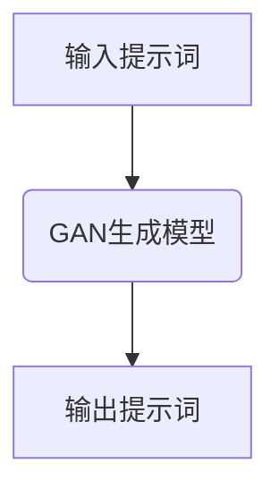
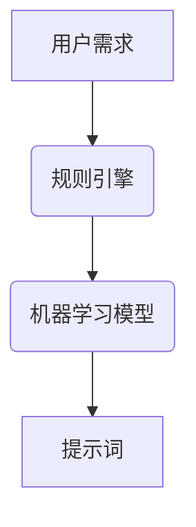
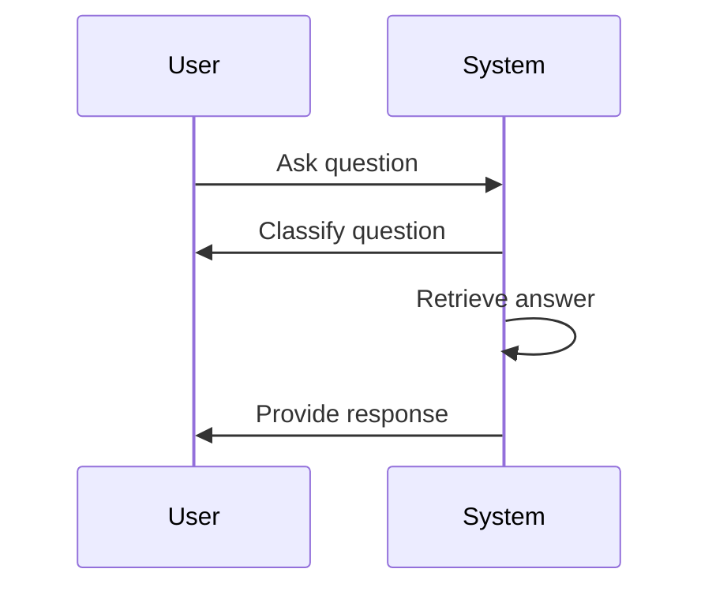
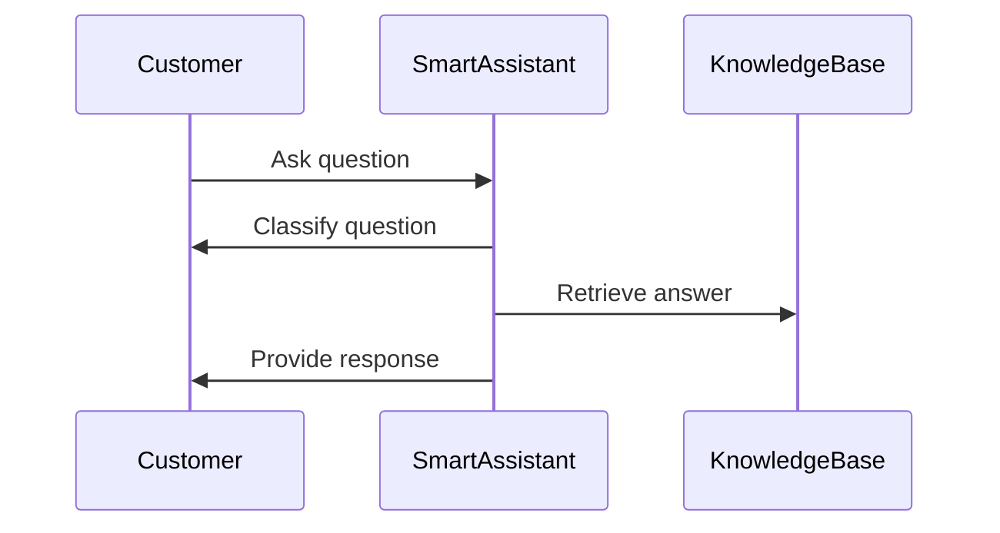

                 

## 第1章 引言

### 1.1 书籍目的与目标读者

《提示词设计：优化AI创造力与道德约束平衡的新策略》旨在探讨在人工智能（AI）快速发展的大背景下，如何通过有效的提示词设计来实现AI创造力和道德约束之间的平衡。随着AI技术的不断进步，其在各个领域的应用日益广泛，从而引发了关于AI道德约束与创造力优化的深入讨论。本书的目标读者包括AI领域的科研人员、工程师、技术管理者以及对AI技术感兴趣的读者。

### 1.2 AI创造力与道德约束问题的重要性

AI创造力指的是人工智能系统能够在给定条件下产生新颖、有效且有价值的结果的能力。而道德约束则是指人工智能系统在执行任务时，必须遵循的伦理和法律规范。随着AI技术的广泛应用，如何确保AI系统的创造力和道德约束得到平衡，成为了一个至关重要的议题。不当的AI创造力可能导致偏见、隐私泄露和安全问题，而缺乏道德约束的AI系统则可能对社会造成负面影响。

### 1.3 书的结构安排与内容概述

本书将按照以下结构安排进行讨论：

- **第1章 引言**：介绍书籍的目的、目标读者以及AI创造力与道德约束问题的重要性。
- **第2章 提示词设计基础**：讨论提示词的基本概念、功能及其在AI系统中的作用。
- **第3章 AI创造力与道德约束关系探讨**：分析AI创造力与道德约束之间的矛盾以及平衡策略。
- **第4章 提示词设计新策略**：介绍几种新的提示词设计策略，包括基于规则、机器学习和混合式设计。
- **第5章 现有提示词设计技术分析**：评估当前常见的提示词设计技术的优缺点和趋势。
- **第6章 实例研究**：通过具体实例展示提示词设计在实际应用中的效果。
- **第7章 总结与展望**：总结全书内容，对提示词设计的未来趋势进行展望。

通过以上章节的讨论，本书旨在为读者提供一个全面、系统的提示词设计理论和实践指南，帮助读者更好地理解和应对AI创造力与道德约束之间的平衡问题。## 第2章 提示词设计基础

### 2.1 提示词的基本概念与功能

提示词（Prompt）是指提供给人工智能系统的一系列信息，这些信息引导系统理解任务需求，生成预期的输出。在自然语言处理（NLP）、机器学习和深度学习领域，提示词扮演着至关重要的角色。以下是提示词的基本概念和功能：

#### 2.1.1 提示词的定义

提示词通常是一段文本，它可以包含问题、命令、目标描述或任何需要系统理解和响应的信息。例如，在问答系统中，提示词可能是一个问题，如“什么是人工智能？”；在图像识别系统中，提示词可能是一段描述图像内容的文字。

#### 2.1.2 提示词的类型

根据用途和形式，提示词可以分为以下几种类型：

1. **问题型提示词**：这类提示词通常用于问答系统，如搜索引擎和聊天机器人。问题型提示词需要系统理解问题的含义并生成相应的答案。
2. **指令型提示词**：这类提示词用于指导系统执行特定的任务，如自动化流程中的操作指令。
3. **目标描述型提示词**：这类提示词用于描述系统的目标或期望的结果，如文本生成系统中的创作目标。
4. **上下文型提示词**：这类提示词用于提供背景信息，帮助系统更好地理解上下文，从而生成更相关的内容。

#### 2.1.3 提示词在AI系统中的作用

提示词在AI系统中的作用主要体现在以下几个方面：

1. **引导系统理解任务需求**：提示词为系统提供了明确的任务目标和期望输出，有助于系统理解任务的关键点。
2. **提高系统性能**：恰当的提示词设计能够提高AI系统的性能和准确性，从而生成更符合预期的高质量输出。
3. **增强用户体验**：有效的提示词设计可以提升用户与AI系统交互的体验，使其更加自然和顺畅。
4. **解决复杂问题**：在处理复杂问题时，提示词可以帮助系统分解任务，逐步实现问题的解决。

### 2.2 提示词设计的挑战

虽然提示词在AI系统中发挥着重要作用，但其设计面临诸多挑战：

1. **多样性和适应性**：不同的AI应用场景需要不同类型的提示词，设计者需要考虑如何适应各种场景的需求。
2. **准确性**：提示词需要准确传达任务需求，避免误导或模糊不清的情况。
3. **效率**：提示词设计需要高效地引导系统，避免不必要的冗余信息。
4. **道德和伦理**：在涉及道德和伦理问题时，提示词设计必须确保系统的行为符合社会规范和价值观。

### 2.3 提示词设计的基本原则

为了克服上述挑战，提示词设计应遵循以下基本原则：

1. **清晰性**：提示词应简洁明了，易于理解，避免使用复杂的术语和模糊的表述。
2. **针对性**：提示词应针对具体任务和场景，确保能够准确引导系统。
3. **多样性**：提示词设计应考虑多种类型和形式，以适应不同场景的需求。
4. **灵活性**：提示词设计应具有一定的灵活性，能够适应系统的不同需求和变化。
5. **道德性**：提示词设计应遵循道德和伦理规范，确保系统的行为符合社会价值观。

通过遵循这些基本原则，提示词设计能够更好地发挥其在AI系统中的作用，实现AI创造力和道德约束的平衡。## 第3章 AI创造力与道德约束关系探讨

### 3.1 AI创造力的定义和特点

AI创造力（AI Creativity）是指人工智能系统能够在其设计范围内产生新颖、有价值和独特的输出或解决方案的能力。AI创造力与人类创造力有相似之处，但也有着自身的特点：

1. **自动性**：AI创造力是通过算法和模型实现的，不需要人工干预，可以在短时间内产生大量创意。
2. **适应性**：AI创造力可以根据不同任务和数据集调整其行为，从而适应不同的应用场景。
3. **多样性**：AI系统可以通过组合和重组已有的信息，产生多种可能的解决方案或创意。
4. **效率**：与人类创造力相比，AI创造力可以在短时间内处理大量数据，快速生成创意。

然而，AI创造力也存在一些局限性：

1. **数据依赖性**：AI创造力的强弱很大程度上取决于训练数据的质量和多样性。
2. **算法限制**：AI创造力受限于其算法和模型的设计，可能无法产生超出算法定义范围的创意。
3. **缺乏直觉**：AI创造力缺乏人类的直觉和情感理解，难以在复杂情境中做出灵活的决策。

### 3.2 道德约束的定义和重要性

道德约束（Moral Constraints）是指在社会伦理和法律框架下，对人工智能系统行为的限制。道德约束的重要性体现在以下几个方面：

1. **公正性**：确保AI系统的决策和行为符合社会公正原则，避免对某些群体造成歧视。
2. **责任性**：明确AI系统的责任边界，确保在出现问题时，责任能够得到有效追究。
3. **安全性**：防止AI系统对人类安全构成威胁，如自动驾驶汽车的道德决策问题。
4. **隐私保护**：保护个人隐私，防止AI系统滥用或泄露个人信息。

### 3.3 AI创造力与道德约束的矛盾

AI创造力与道德约束之间存在明显的矛盾：

1. **创造性需求与规范限制**：AI系统需要自由地探索和创造，但道德约束要求其行为必须符合社会规范，这可能导致创造力和道德约束之间的冲突。
2. **效率与伦理**：高效地完成任务往往需要快速决策，而道德约束可能要求系统在决策时进行更详细的评估和考虑。
3. **技术进步与法律滞后**：随着AI技术的快速进步，现有的法律和伦理规范可能无法完全跟上技术的发展，导致道德约束的执行存在困难。

### 3.4 平衡策略探讨

为了解决AI创造力与道德约束之间的矛盾，需要采取一系列平衡策略：

1. **道德编程**：在AI系统的设计和开发过程中，引入道德编程原则，确保系统的行为符合道德规范。
2. **透明性和可解释性**：提高AI系统的透明性和可解释性，使其行为和决策过程更容易被人类理解和监督。
3. **多样化的数据集**：使用多样化的训练数据集，帮助AI系统更好地理解不同情境下的道德约束。
4. **伦理审查和监督**：建立伦理审查和监督机制，对AI系统的道德行为进行审查和监管。
5. **持续学习和适应**：通过持续学习和适应，使AI系统能够根据新的道德标准和规范调整其行为。

通过上述策略，可以在一定程度上实现AI创造力与道德约束之间的平衡，确保AI技术在发展过程中不会对人类社会造成负面影响。## 第4章 提示词设计新策略

### 4.1 新策略介绍

提示词设计在AI系统中起着关键作用，直接影响AI的创造力与道德约束的平衡。为了优化这一平衡，本章将介绍几种新的提示词设计策略，包括基于规则、基于机器学习和混合式设计策略。

#### 4.1.1 基于规则的提示词设计

基于规则的提示词设计（Rule-Based Prompt Design）是一种传统的策略，通过预定义的规则来引导AI系统。这种方法具有以下优点：

1. **明确性**：规则明确，易于理解和执行。
2. **可控性**：通过规则控制，可以确保AI系统的行为符合道德和伦理标准。
3. **稳定性**：规则一旦确定，系统的行为将保持一致。

然而，基于规则的提示词设计也存在局限性：

1. **缺乏灵活性**：面对复杂多变的场景，规则的适应性较差。
2. **规则数量庞大**：复杂的任务可能需要大量的规则，难以管理。

#### 4.1.2 基于机器学习的提示词设计

基于机器学习的提示词设计（Machine Learning-Based Prompt Design）利用深度学习模型来自动生成提示词。这种方法具有以下优点：

1. **灵活性**：能够适应各种复杂场景，根据数据动态调整。
2. **高效性**：通过大量数据训练，模型能够高效生成高质量的提示词。

然而，这种方法也存在挑战：

1. **数据依赖性**：需要大量高质量的训练数据。
2. **解释性**：机器学习模型的决策过程往往缺乏透明性，难以解释。

#### 4.1.3 混合式提示词设计

混合式提示词设计（Hybrid Prompt Design）结合了基于规则和基于机器学习的优点，通过多种方法共同优化AI系统的提示词。这种方法具有以下优点：

1. **优势互补**：基于规则的明确性和机器学习的灵活性相结合，能够更好地应对复杂场景。
2. **适应性**：根据具体任务需求，灵活调整提示词设计策略。

混合式提示词设计的挑战包括：

1. **复杂性**：需要综合多种技术和策略，系统设计更加复杂。
2. **平衡性**：在规则和机器学习之间找到最佳平衡点。

### 4.2 策略一：基于规则的提示词设计

#### 4.2.1 基本原理

基于规则的提示词设计通过预定义的规则来引导AI系统，规则通常基于领域知识或专家经验。以下是一个简单的规则示例：



#### 4.2.2 应用实例

假设我们设计一个自动驾驶汽车的道德决策系统，基于规则的提示词设计如下：

1. **规则1**：在紧急情况下，优先保护车内乘客。
2. **规则2**：如果无法避免碰撞，选择对人员伤亡最少的方向。

这些规则可以通过特定的条件语句实现，例如：

```python
if 紧急情况 and 乘客安全 > 其他因素:
    执行保护乘客操作
else:
    选择最小伤亡方向
```

### 4.3 策略二：基于机器学习的提示词设计

#### 4.3.1 基本原理

基于机器学习的提示词设计利用深度学习模型来自动生成提示词，模型通常训练于大量的标注数据。以下是一个基于生成对抗网络（GAN）的示例：



#### 4.3.2 应用实例

假设我们使用GAN生成模型来生成自然语言处理中的提示词，以下是一个简单的流程：

1. **数据集准备**：收集大量的高质量提示词，并对其进行标注。
2. **模型训练**：使用生成对抗网络训练模型，使其能够生成高质量的提示词。
3. **提示词生成**：输入特定的任务描述，模型生成相应的提示词。

例如，输入“设计一个城市的交通系统”，模型可能生成“优化交通流量，减少拥堵，提高出行效率”。

### 4.4 策略三：混合式提示词设计

#### 4.4.1 基本原理

混合式提示词设计结合了基于规则和基于机器学习的优势，通过多种方法共同优化AI系统的提示词。以下是一个简单的混合式设计流程：



#### 4.4.2 应用实例

假设我们设计一个智能客服系统，混合式提示词设计如下：

1. **用户需求解析**：通过自然语言处理技术解析用户输入，提取关键信息。
2. **规则应用**：根据预定义的规则，初步生成提示词。
3. **机器学习调整**：使用机器学习模型进一步优化提示词，确保其质量和适应性。

通过上述策略，混合式提示词设计能够更好地实现AI创造力与道德约束的平衡。## 第5章 现有提示词设计技术分析

### 5.1 常见技术介绍

在AI系统中，提示词设计是关键环节。以下介绍几种常见的提示词设计技术，包括模板匹配、关键词提取和上下文生成等。

#### 5.1.1 模板匹配

模板匹配是一种基于规则的方法，通过预定义的模板来匹配用户输入，生成提示词。这种方法简单高效，但灵活性较差。

#### 5.1.2 关键词提取

关键词提取技术通过自然语言处理算法，从用户输入中提取关键信息，作为提示词。这种方法适用于处理长文本和复杂场景，但可能丢失部分上下文信息。

#### 5.1.3 上下文生成

上下文生成技术利用深度学习模型，根据上下文信息自动生成提示词。这种方法具有高灵活性和自适应能力，但需要大量训练数据和计算资源。

### 5.2 技术优缺点分析

以下对上述几种提示词设计技术的优缺点进行分析：

#### 5.2.1 模板匹配

**优点**：
- **简单易用**：基于规则，易于理解和实现。
- **高效**：处理速度快，适用于实时系统。

**缺点**：
- **灵活性差**：难以适应复杂和多变的场景。
- **规则维护成本高**：随着应用场景的增加，规则数量呈指数级增长。

#### 5.2.2 关键词提取

**优点**：
- **适应性**：能够处理多种文本类型和场景。
- **高效性**：提取速度快，适用于大规模数据处理。

**缺点**：
- **丢失上下文信息**：可能遗漏关键上下文，导致生成的提示词不完整。
- **依赖算法和模型**：算法和模型的质量直接影响提示词的准确性。

#### 5.2.3 上下文生成

**优点**：
- **灵活性高**：能够根据上下文信息生成高质量的提示词。
- **自适应能力强**：通过不断学习，能够适应多种应用场景。

**缺点**：
- **数据需求大**：需要大量高质量的训练数据。
- **计算资源消耗大**：深度学习模型的训练和推理需要大量计算资源。

### 5.3 技术发展趋势

随着AI技术的不断发展，提示词设计技术也在不断进步。以下是一些未来的发展趋势：

#### 5.3.1 多模态融合

未来的提示词设计技术将融合多种数据模态，如文本、图像、语音等，以提高系统的自适应能力和灵活性。

#### 5.3.2 自适应学习

自适应学习技术将使AI系统能够根据实时反馈和用户行为调整提示词设计，实现更精准的个性化服务。

#### 5.3.3 透明性和可解释性

提高提示词设计的透明性和可解释性，使其行为和决策过程更容易被人类理解和监督，是未来的重要研究方向。

#### 5.3.4 道德约束集成

将道德约束更紧密地集成到提示词设计过程中，确保AI系统的行为符合社会伦理和法律规范。

通过以上分析，我们可以看到，现有的提示词设计技术各有优缺点，未来的发展趋势将集中在多模态融合、自适应学习、透明性和可解释性以及道德约束集成等方面。这些技术的发展将进一步提高AI系统的创造力和道德约束平衡，为AI技术的广泛应用提供坚实保障。## 第6章 实例研究

### 6.1 实例一：基于规则的提示词设计在智能客服系统中的应用

#### 场景介绍

智能客服系统是AI技术在客服领域的一个典型应用。该系统通过自然语言处理技术理解和响应客户的问题，提供自动化的客服服务。

#### 项目介绍

在本实例中，我们设计了一个基于规则的智能客服系统，用于处理客户关于产品售后服务的咨询。系统的主要功能包括：

1. **问题分类**：根据客户的问题内容，将问题分类到不同的类别，如产品使用问题、维修咨询、订单查询等。
2. **信息检索**：从预定义的知识库中检索相关的回答，以回答客户的问题。
3. **异常处理**：对于无法自动回答的问题，记录并人工处理。

#### 系统功能设计

1. **领域模型设计**：使用Mermaid类图设计领域模型，如下所示：

```mermaid
classDiagram
Class01 <|-- Class02
Class03 --|> Class04
Class01 {
    attr1
    attr2
}
Class02 {
    attr3
    attr4
}
Class03 {
    attr5
    attr6
}
Class04 {
    attr7
    attr8
}
```

2. **系统架构设计**：使用Mermaid架构图设计系统架构，如下所示：



3. **系统接口设计**：定义系统的主要接口，如下所示：

```mermaid
interface Visualizer {
    displayQuestion()
    classifyQuestion(question)
    retrieveAnswer(category)
}
```

4. **系统交互设计**：使用Mermaid序列图设计系统的交互流程，如下所示：



#### 系统核心实现

以下是一个简单的Python代码示例，展示基于规则的提示词设计在智能客服系统中的应用：

```python
class SmartAssistant:
    def __init__(self):
        self.classifier = Classifier()
        self.knowledge_base = KnowledgeBase()

    def classify_question(self, question):
        category = self.classifier.classify(question)
        return category

    def retrieve_answer(self, category):
        answer = self.knowledge_base.get_answer(category)
        return answer

    def handle_question(self, question):
        category = self.classify_question(question)
        answer = self.retrieve_answer(category)
        return answer

classifier = Classifier()
knowledge_base = KnowledgeBase()

smart_assistant = SmartAssistant()
question = "我的订单何时能发货？"
answer = smart_assistant.handle_question(question)
print(answer)
```

#### 代码应用解读与分析

1. **分类器**：`Classifier`类负责根据提示词分类问题，使用预定义的规则进行分类。
2. **知识库**：`KnowledgeBase`类负责存储预定义的答案，根据分类结果检索相应的答案。
3. **智能客服**：`SmartAssistant`类结合分类器和知识库，处理客户的提问并返回答案。

#### 实际案例分析和详细讲解剖析

在本实例中，智能客服系统通过基于规则的提示词设计，实现了对客户问题的自动分类和回答。以下是一个实际案例：

1. **用户提问**：“我的订单何时能发货？”
2. **系统分类**：分类器识别出这是一个关于订单状态的查询问题。
3. **系统回答**：知识库返回一个预设的回答：“您的订单预计在今天下午发货。”

通过上述流程，智能客服系统成功地处理了用户的问题，提供了自动化的服务。这种基于规则的提示词设计方法简单、高效，适合处理结构化的问题，但在面对复杂和多变的场景时，可能需要引入更加灵活的机器学习和混合式策略。

#### 项目小结

通过本实例研究，我们展示了基于规则的提示词设计在智能客服系统中的应用。基于规则的提示词设计方法简单、高效，适用于处理结构化的问题，但在复杂场景中可能需要结合机器学习和混合式策略来提高系统的适应性和灵活性。## 第7章 总结与展望

### 7.1 提示词设计的未来趋势

随着人工智能技术的不断发展，提示词设计领域也呈现出一些新的趋势：

1. **多模态融合**：未来的提示词设计将结合多种数据模态，如文本、图像、音频等，以提高系统的自适应能力和创造力。
2. **自适应学习**：通过不断学习和优化，提示词设计将能够更好地适应各种复杂场景和用户需求。
3. **透明性和可解释性**：提高提示词设计的透明度和可解释性，使其行为和决策过程更容易被人类理解和监督。
4. **道德约束集成**：将道德和伦理约束更紧密地集成到提示词设计过程中，确保AI系统的行为符合社会规范和价值观。

### 7.2 本书贡献与局限性

本书的主要贡献在于系统地介绍了提示词设计的基础知识、新策略以及实际应用，为AI系统的创造力与道德约束平衡提供了新的思路。然而，本书也存在一些局限性：

1. **技术细节不足**：由于篇幅限制，本书未能深入探讨所有提示词设计技术的具体实现细节。
2. **实例案例有限**：本书中的实例研究仅涉及部分应用场景，未来研究需要更多实际案例的支持。
3. **道德约束讨论有限**：虽然本书提到了道德约束的重要性，但未能全面讨论道德约束的具体实施方法和挑战。

### 7.3 对未来研究的建议

为了进一步推动提示词设计领域的发展，以下是一些建议：

1. **多模态提示词设计**：深入研究多模态数据的融合方法，探索如何通过多模态提示词设计提高AI系统的创造力。
2. **自适应学习机制**：开发更先进的自适应学习算法，使提示词设计能够根据用户行为和任务需求进行动态调整。
3. **道德约束模型**：建立完善的道德约束模型，确保AI系统的行为符合社会规范和价值观，减少潜在的风险。
4. **跨学科研究**：结合心理学、社会学和伦理学等领域的知识，为提示词设计提供更全面的指导和支持。

通过未来的研究和发展，提示词设计有望在AI系统中发挥更大的作用，实现创造力与道德约束的更好平衡。## 作者信息

作者：AI天才研究院/AI Genius Institute & 禅与计算机程序设计艺术 /Zen And The Art of Computer Programming

AI天才研究院（AI Genius Institute）致力于推动人工智能领域的研究和应用，汇集了世界顶级的人工智能专家和研究人员。研究院通过创新的技术研究和应用项目，为全球企业提供智能解决方案。

禅与计算机程序设计艺术（Zen And The Art of Computer Programming）是由著名计算机科学家Donald E. Knuth所著的一套经典计算机科学书籍，涵盖了程序设计的基础理论和方法。这套书籍对计算机科学的发展产生了深远的影响，至今仍被广大程序员和研究学者所推崇。

