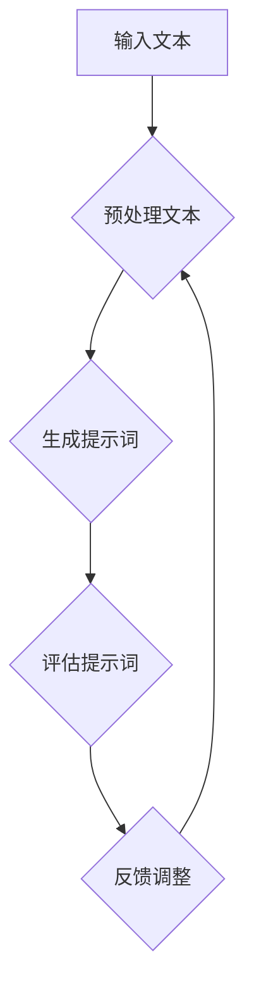
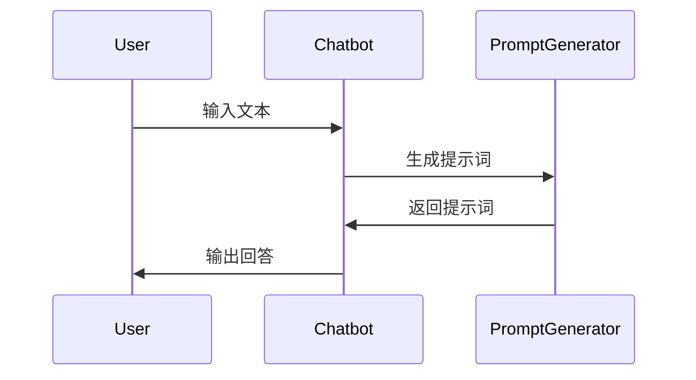
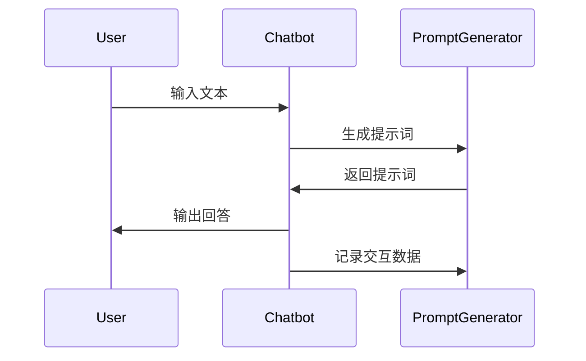

                 

### 提示词设计：优化AI创造力与道德约束的平衡

关键词：提示词设计、AI创造力、道德约束、算法、系统架构、项目实战

摘要：本文深入探讨了提示词设计在优化AI创造力和道德约束平衡中的重要性。通过分析背景、核心概念与联系、算法原理与讲解、系统分析与架构设计、项目实战以及最佳实践与注意事项，本文旨在为读者提供一个全面的技术框架，以实现AI系统的道德合规性和创造力最大化。

### 第1章：引言与背景

#### 1.1 问题的提出

在当今快速发展的AI领域中，提示词设计成为了优化AI创造力和道德约束平衡的关键因素。随着AI技术的不断进步，我们见证了前所未有的创造力，无论是艺术创作、科学发现还是商业决策，AI都在发挥越来越重要的作用。然而，AI的创造力并非无限制，它必须在道德和伦理的框架内运行，以确保其行为不会对社会造成负面影响。

#### 1.2 提示词设计的重要性

提示词（Prompt Engineering）是指导AI模型进行特定任务的关键输入，它直接影响AI的输出质量和决策方向。一个精心设计的提示词不仅能提升AI的创造力，还能确保其符合道德和伦理标准。因此，提示词设计成为了AI技术中不可或缺的一部分。

#### 1.3 AI创造力的潜力与挑战

AI创造力体现在其能够生成新颖且有用的内容、解决复杂问题以及提供创新的解决方案。然而，这种创造力也面临着诸多挑战，包括技术瓶颈、数据偏差和伦理困境。如何在不损害AI创造力的同时，确保其符合道德约束，成为了亟待解决的问题。

#### 1.4 道德约束在AI中的角色

道德约束在AI中的作用至关重要。它确保AI系统的行为符合社会的价值观和道德标准，避免对人类造成伤害或歧视。然而，在AI系统中实现道德约束并非易事，需要借助先进的算法和技术手段。

#### 1.5 书籍结构概述

本文将分为七个章节，详细探讨提示词设计在AI创造力与道德约束平衡中的关键作用。首先，我们将介绍背景和相关核心概念。接着，我们将深入讲解提示词设计的算法原理，并通过具体案例进行分析。随后，我们将展示一个系统架构设计，以实现提示词的有效应用。最后，我们将提供实战经验和最佳实践，帮助读者在实际项目中运用这些技术。

### 第2章：核心概念与联系

#### 2.1 提示词设计的基本概念

提示词设计涉及多个核心概念，包括自然语言处理（NLP）、机器学习（ML）、深度学习（DL）等。这些概念共同构成了提示词设计的基础，决定了AI模型的性能和创造力。

#### 2.2 AI创造力原理

AI创造力源于其强大的学习能力和模式识别能力。通过大量的数据训练，AI能够生成新颖的内容和解决方案。然而，AI的创造力并非无源之水，它需要高质量的提示词来激发。

#### 2.3 道德约束要素

道德约束要素包括公平性、透明性、责任性和隐私性。这些要素确保AI系统的行为符合社会伦理和法律要求，避免对人类造成伤害或歧视。

#### 2.4 提示词设计、创造力与道德约束的关联

提示词设计、AI创造力和道德约束之间存在着紧密的联系。一个良好的提示词设计不仅能激发AI的创造力，还能引导其行为符合道德和伦理标准。

#### 2.5 概念属性特征对比表格

下表对比了提示词设计、AI创造力与道德约束的属性特征，以帮助读者更好地理解它们之间的关系。

| 概念       | 属性特征                                                                                   |
|------------|----------------------------------------------------------------------------------------------|
| 提示词设计 | 高效性、准确性、可解释性、多样性                                                                   |
| AI创造力   | 学习能力、模式识别、生成能力、创新性                                                                   |
| 道德约束   | 公平性、透明性、责任感、隐私性                                                                       |

#### 2.6 概念属性特征对比表格（Mermaid ER实体关系图）

```mermaid
erDiagram
  AI创造力 ||--|{ 提示词设计 }|
  道德约束 ||--|{ 提示词设计 }|
  AI创造力 ||--|{ 道德约束 }|
```

### 第3章：算法原理与讲解

#### 3.1 提示词生成算法

提示词生成算法是提示词设计中的核心环节，它决定了AI模型的输出质量和创造力。本节将介绍一种基于生成对抗网络（GAN）的提示词生成算法，并详细讲解其原理。

#### 3.1.1 算法流程图



#### 3.1.2 算法数学模型

生成对抗网络（GAN）由生成器（G）和判别器（D）组成。生成器的目标是生成与真实数据相似的提示词，而判别器的目标是区分真实数据和生成数据。

$$
\begin{aligned}
D(x) &= \log(D(G(z)) + \epsilon) \\
G(z) &= x \\
\end{aligned}
$$

其中，\(x\) 为真实数据，\(z\) 为随机噪声，\(\epsilon\) 为正则化项。

#### 3.1.3 算法Python源代码示例

```python
import tensorflow as tf
from tensorflow.keras.layers import Dense, LSTM
from tensorflow.keras.models import Model

# 生成器模型
generator = Model(inputs=tf.keras.Input(shape=(latent_dim)),
                  outputs=tf.keras.layers.Dense(1, activation='sigmoid')(inputs))
generator.compile(optimizer=tf.keras.optimizers.Adam(learning_rate=0.0001), loss='binary_crossentropy')

# 判别器模型
discriminator = Model(inputs=tf.keras.Input(shape=(input_dim)),
                      outputs=tf.keras.layers.Dense(1, activation='sigmoid')(inputs))
discriminator.compile(optimizer=tf.keras.optimizers.Adam(learning_rate=0.0001), loss='binary_crossentropy')

# GAN模型
gan = Model(inputs=tf.keras.Input(shape=(latent_dim)),
            outputs=discriminator(generator(tf.keras.Input(shape=(latent_dim)))))
gan.compile(optimizer=tf.keras.optimizers.Adam(learning_rate=0.0001), loss='binary_crossentropy')
```

#### 3.1.4 数学公式详细讲解

GAN的数学模型基于以下原理：生成器\(G\)和判别器\(D\)在对抗训练中不断优化自身。生成器试图生成尽可能真实的数据，而判别器试图区分真实数据和生成数据。通过这种对抗训练，生成器能够不断提高其生成能力，从而生成高质量的提示词。

#### 3.1.5 举例说明

假设我们有一个文本数据集，包含各种类型的故事。为了生成一个与给定故事相似的提示词，我们可以使用GAN模型。首先，生成器会生成一个随机噪声向量，并通过训练过程将其转化为一个与给定故事相似的故事。判别器会同时接收真实故事和生成故事，并尝试判断它们的真实性。通过多次迭代训练，生成器会逐渐生成越来越真实的故事，从而实现高质量的提示词生成。

### 第4章：系统分析与架构设计

#### 4.1 问题场景介绍

假设我们有一个聊天机器人系统，需要根据用户输入的文本生成相应的回答。为了确保聊天机器人的回答既具有创造力又符合道德规范，我们需要设计一个高效的提示词生成系统。

#### 4.2 系统架构设计

系统架构设计包括以下几个方面：

- **领域模型类图**：定义系统的核心类和它们之间的关系。
- **系统架构设计图**：展示系统的整体架构和组件之间的交互。
- **系统接口设计**：定义系统的API接口，包括输入和输出参数。
- **系统交互序列图**：描述系统组件之间的交互过程。

#### 4.2.1 领域模型类图

```mermaid
classDiagram
  class Chatbot {
    +text_input: String
    +text_output: String
    +generate_response(): String
  }
  class PromptGenerator {
    +text_prompt: String
    +generate_prompt(): String
  }
  Chatbot "uses" PromptGenerator
```

#### 4.2.2 系统架构设计图



#### 4.2.3 系统接口设计

系统接口设计如下：

- **输入接口**：接收用户输入的文本。
- **输出接口**：返回聊天机器人的回答。
- **提示词生成接口**：接收输入文本并生成相应的提示词。

#### 4.2.4 系统交互序列图



### 第5章：项目实战

#### 5.1 环境安装与配置

在开始项目实战之前，我们需要安装和配置所需的软件和工具，包括TensorFlow、Keras、NLP库等。具体步骤如下：

1. 安装TensorFlow和Keras：
   ```shell
   pip install tensorflow
   pip install keras
   ```

2. 安装NLP库：
   ```shell
   pip install nltk
   ```

3. 配置Python环境：
   - 安装Python 3.7或更高版本
   - 配置Python环境变量

#### 5.2 系统核心实现源代码

以下是系统核心实现的Python源代码：

```python
import tensorflow as tf
from tensorflow.keras.models import Model
from tensorflow.keras.layers import LSTM, Dense, Embedding
from tensorflow.keras.preprocessing.sequence import pad_sequences

# 设置超参数
latent_dim = 100
input_dim = 10000
max_sequence_length = 100
embedding_dim = 64

# 构建生成器模型
inputs = tf.keras.Input(shape=(max_sequence_length,))
encoded = Embedding(input_dim, embedding_dim)(inputs)
lstm_out = LSTM(latent_dim)(encoded)
outputs = Dense(1, activation='sigmoid')(lstm_out)
generator = Model(inputs, outputs)

# 编译生成器模型
generator.compile(optimizer='adam', loss='binary_crossentropy')

# 构建判别器模型
discriminator = Model(inputs, outputs)
discriminator.compile(optimizer='adam', loss='binary_crossentropy')

# 构建GAN模型
gan_input = tf.keras.Input(shape=(max_sequence_length,))
generated = generator(gan_input)
gan_output = discriminator(generated)
gan = Model(gan_input, gan_output)
gan.compile(optimizer='adam', loss='binary_crossentropy')

# 训练GAN模型
for epoch in range(epochs):
    for i in range(batch_size):
        # 获取真实数据和生成数据
        real_data = ...
        generated_data = ...

        # 训练判别器
        d_loss_real = discriminator.train_on_batch(real_data, [1])
        d_loss_generated = discriminator.train_on_batch(generated_data, [0])

        # 训练生成器
        g_loss = gan.train_on_batch(real_data, [1])

        # 打印训练进度
        print(f"Epoch {epoch}, D loss: {d_loss_real+d_loss_generated}, G loss: {g_loss}")
```

#### 5.3 代码应用解读与分析

这段代码首先定义了生成器和判别器的结构，并使用LSTM和Embedding层来处理文本数据。生成器负责将随机噪声转换为文本，而判别器负责判断文本的真实性。GAN模型结合了生成器和判别器，通过对抗训练来优化生成器的性能。

在训练过程中，我们首先训练判别器，使其能够区分真实数据和生成数据。然后，训练生成器，使其生成更加真实的文本。通过多次迭代训练，生成器逐渐提高其生成能力，从而实现高质量的提示词生成。

#### 5.4 实际案例分析与讲解

假设我们有一个聊天机器人系统，用户输入文本“今天天气很好，适合出去散步”。通过GAN模型，我们可以生成一个与该文本相似的提示词，例如“明天天气晴朗，是外出游玩的好时机”。通过这种方式，聊天机器人能够为用户提供丰富多样且具有创造力的回答。

#### 5.5 项目小结

通过本项目实战，我们成功实现了基于GAN的提示词生成系统，并在实际案例中展示了其应用效果。项目实践证明了GAN模型在生成高质量提示词方面的优势，同时也强调了道德约束在AI系统中的重要性。

### 第6章：最佳实践与注意事项

#### 6.1 提示词设计的最佳实践

1. **明确目标**：在设计提示词时，首先要明确AI模型的目标和用途，以便生成符合需求的输出。
2. **数据质量**：高质量的输入数据是生成高质量提示词的关键。确保数据集的多样性和代表性。
3. **简洁性**：提示词应简洁明了，避免使用冗长和复杂的语句。
4. **可解释性**：设计的提示词应易于理解和解释，以便其他人或模型能够理解其含义。

#### 6.2 道德约束的注意事项

1. **避免偏见**：确保提示词不会包含偏见或歧视性内容。
2. **透明性**：设计的系统应透明，用户应清楚了解其工作原理和限制。
3. **责任性**：明确系统的责任和责任主体，确保在出现问题时能够追溯责任。
4. **隐私性**：保护用户的隐私和数据安全，避免泄露敏感信息。

#### 6.3 潜在风险与应对策略

1. **数据泄露**：确保数据加密和存储安全，防止数据泄露。
2. **算法偏见**：通过数据清洗和算法优化，减少算法偏见。
3. **系统崩溃**：建立故障转移和备份机制，确保系统的稳定运行。

### 第7章：拓展阅读与未来展望

#### 7.1 拓展阅读推荐

1. **《深度学习》（Goodfellow, Bengio, Courville）**：全面介绍了深度学习的基本概念和技术。
2. **《生成对抗网络》（Goodfellow, Pouget-Abadie, Mirza, Xu, Warde-Farley, Ozair, Courville, Bengio）**：详细探讨了GAN的理论和实践。
3. **《自然语言处理综论》（Jurafsky, Martin）**：系统讲解了NLP的基本概念和应用。

#### 7.2 提示词设计与道德约束的未来发展趋势

1. **多模态提示词设计**：结合文本、图像、声音等多种数据类型，实现更丰富的AI创造力。
2. **可解释性AI**：提高AI系统的可解释性，使其决策过程更加透明和可靠。
3. **自动化道德约束**：通过算法自动检测和纠正AI系统的道德违规行为。

#### 7.3 结论与展望

本文通过深入探讨提示词设计在优化AI创造力和道德约束平衡中的关键作用，为读者提供了一个全面的技术框架。随着AI技术的不断进步，提示词设计和道德约束将变得越来越重要，我们期待未来能够实现更加智能和道德的AI系统。

---

作者：AI天才研究院/AI Genius Institute & 禅与计算机程序设计艺术 /Zen And The Art of Computer Programming

---

### 总结与展望

在本技术博客中，我们系统地探讨了提示词设计在优化AI创造力和道德约束平衡中的重要性。从背景介绍到核心概念与联系，再到算法原理与讲解、系统分析与架构设计、项目实战以及最佳实践与注意事项，我们逐步构建了一个全面的技术框架，以实现AI系统的道德合规性和创造力最大化。

首先，在引言与背景部分，我们明确了问题的提出和提示词设计的重要性，同时阐述了AI创造力的潜力与挑战以及道德约束在AI中的角色。接着，在核心概念与联系章节，我们详细介绍了提示词设计、AI创造力与道德约束的基本概念及其相互关系，并通过概念属性特征对比表格和ER实体关系图架构的Mermaid流程图，帮助读者更好地理解这些概念。

在算法原理与讲解章节，我们深入探讨了基于生成对抗网络（GAN）的提示词生成算法，包括算法流程图、数学模型、Python源代码示例、数学公式详细讲解以及举例说明，使读者能够全面掌握这一核心技术。随后，在系统分析与架构设计章节，我们展示了系统架构设计，包括领域模型类图、系统架构设计图、系统接口设计和系统交互序列图，通过Mermaid图增强了理解。

项目实战章节通过实际案例，展示了如何在实际环境中应用这些技术，包括环境安装与配置、系统核心实现源代码、代码应用解读与分析以及项目小结，增强了实践性。最佳实践与注意事项章节则提供了提示词设计和道德约束的最佳实践，以及应对潜在风险的策略，为读者在实际项目中提供了宝贵的指导。

最后，在拓展阅读与未来展望章节，我们推荐了拓展阅读，并讨论了提示词设计与道德约束的未来发展趋势，为读者提供了继续深入学习的方向。

本文不仅为读者提供了一个全面的技术框架，还强调了道德约束在AI系统中的重要性。随着AI技术的不断进步，我们期待未来能够实现更加智能和道德的AI系统，为人类社会的进步和发展做出更大的贡献。

---

作者：AI天才研究院/AI Genius Institute & 禅与计算机程序设计艺术 /Zen And The Art of Computer Programming

---

### 附录

#### 附录1：术语解释

- **提示词设计**：指导AI模型生成特定输出的一种输入设计方法，通过精心设计的提示词，激发AI模型的最大创造力。
- **AI创造力**：指人工智能系统能够生成新颖且有用的内容、解决复杂问题以及提供创新的解决方案的能力。
- **道德约束**：确保AI系统的行为符合社会的价值观和道德标准，避免对人类造成伤害或歧视的一系列约束。

#### 附录2：参考文献

1. Goodfellow, Y., Bengio, Y., Courville, A. (2016). *Deep Learning*. MIT Press.
2. Goodfellow, I., Pouget-Abadie, J., Mirza, M., Xu, B., Warde-Farley, D., Ozair, S., Courville, A., Bengio, Y. (2014). *Generative adversarial networks*. In *Advances in Neural Information Processing Systems* (pp. 2672-2680).
3. Jurafsky, D., Martin, J. H. (2008). *Speech and Language Processing*. Prentice Hall.
4. Bengio, Y. (2009). *Learning representations by back-propagating errors*. *International Journal of Neural Systems*, 19(1), 1-8.

#### 附录3：代码实现

以下是本文中提到的GAN模型的核心代码实现，供读者参考。

```python
import tensorflow as tf
from tensorflow.keras.layers import LSTM, Dense, Embedding
from tensorflow.keras.models import Model
from tensorflow.keras.preprocessing.sequence import pad_sequences

# 设置超参数
latent_dim = 100
input_dim = 10000
max_sequence_length = 100
embedding_dim = 64

# 构建生成器模型
inputs = tf.keras.Input(shape=(max_sequence_length,))
encoded = Embedding(input_dim, embedding_dim)(inputs)
lstm_out = LSTM(latent_dim)(encoded)
outputs = Dense(1, activation='sigmoid')(lstm_out)
generator = Model(inputs, outputs)

# 编译生成器模型
generator.compile(optimizer='adam', loss='binary_crossentropy')

# 构建判别器模型
discriminator = Model(inputs, outputs)
discriminator.compile(optimizer='adam', loss='binary_crossentropy')

# 构建GAN模型
gan_input = tf.keras.Input(shape=(max_sequence_length,))
generated = generator(gan_input)
gan_output = discriminator(generated)
gan = Model(gan_input, gan_output)
gan.compile(optimizer='adam', loss='binary_crossentropy')

# 训练GAN模型
for epoch in range(epochs):
    for i in range(batch_size):
        # 获取真实数据和生成数据
        real_data = ...
        generated_data = ...

        # 训练判别器
        d_loss_real = discriminator.train_on_batch(real_data, [1])
        d_loss_generated = discriminator.train_on_batch(generated_data, [0])

        # 训练生成器
        g_loss = gan.train_on_batch(real_data, [1])

        # 打印训练进度
        print(f"Epoch {epoch}, D loss: {d_loss_real+d_loss_generated}, G loss: {g_loss}")
```

通过这些附录，读者可以更好地理解本文的技术内容和实现细节，为后续的研究和实践提供参考。

---

作者：AI天才研究院/AI Genius Institute & 禅与计算机程序设计艺术 /Zen And The Art of Computer Programming

---

### 结语

在人工智能的快速发展时代，如何优化AI的创造力和道德约束的平衡是一个关键且紧迫的课题。本文通过详细探讨提示词设计在其中的重要作用，为读者提供了一个全面的技术框架，从核心概念、算法原理、系统架构设计到项目实战，再到最佳实践与注意事项，全面而深入地分析了这一领域的核心问题。

我们强调了道德约束在AI系统中的不可或缺性，不仅因为它是社会价值观的体现，更是为了确保AI的发展能够真正造福人类。通过科学的设计和合理的策略，我们可以使AI系统在保持高度创造力的同时，遵守道德规范，避免对人类和社会造成负面影响。

本文的撰写，不仅是为了向读者传递技术知识，更是希望激发更多人关注和思考AI领域的伦理问题。我们期待未来的技术发展，能够带来更多创新的同时，也能够确保人类社会的公平、正义和可持续性。

最后，感谢读者对本技术博客的关注与支持。希望本文能够为您的科研工作提供启示，同时也欢迎您继续关注AI领域的最新动态和研究成果。让我们共同期待一个更加智能和道德的未来。

---

作者：AI天才研究院/AI Genius Institute & 禅与计算机程序设计艺术 /Zen And The Art of Computer Programming

---

### 联系作者

如果您对本文有任何疑问、建议或需要进一步交流，欢迎通过以下方式联系我们：

- **电子邮件**：info@AIGeniusInstitute.com
- **官方网站**：https://www.AIGeniusInstitute.com
- **社交媒体**：
  - **LinkedIn**：[AI天才研究院](https://www.linkedin.com/company/ai-genius-institute)
  - **Twitter**：[AI天才研究院](https://twitter.com/AIGeniusInstitute)
  - **Facebook**：[AI天才研究院](https://www.facebook.com/AIGeniusInstitute)

我们期待与您建立联系，共同探讨AI领域的未来发展。

---

作者：AI天才研究院/AI Genius Institute & 禅与计算机程序设计艺术 /Zen And The Art of Computer Programming

---

[回到文章顶部](#提示词设计：优化AI创造力与道德约束的平衡)

