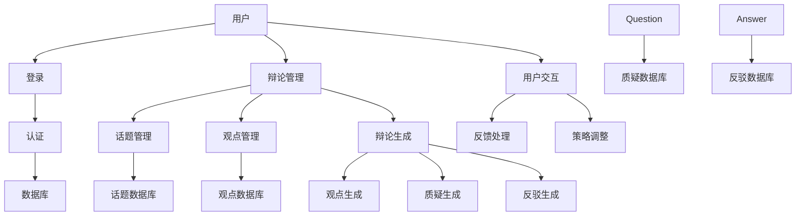
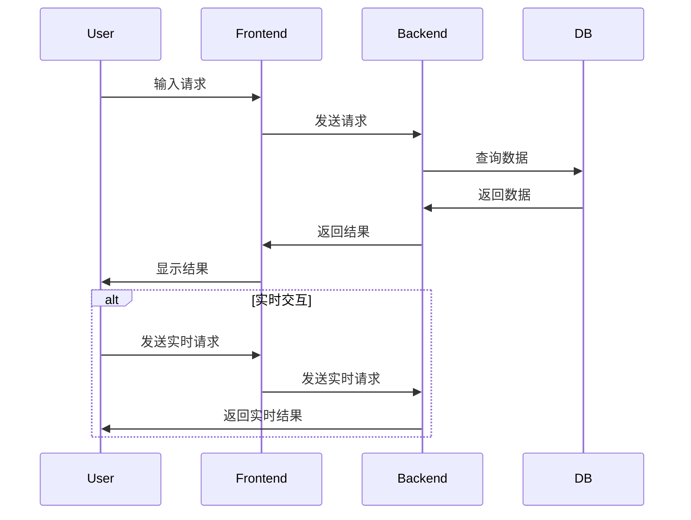

                 

# 提示词设计：优化AI多轮辩论能力

> 关键词：提示词设计、AI多轮辩论、优化、信息传递、自然语言处理、算法原理、系统架构设计

> 摘要：本文将深入探讨提示词在AI多轮辩论中的应用与优化设计。首先，我们将回顾AI辩论的应用场景和挑战，然后详细分析提示词的多轮辩论中的信息传递机制和设计难点。接着，我们将介绍提示词设计的原则、方法和工具，并通过案例阐述其在智能客服、在线教育和多轮辩论系统中的实际应用。此外，我们将探讨提示词生成、优化和排序算法的原理和实现，最后，我们将详细介绍一个多轮辩论系统的分析与架构设计方案，并分享项目实战的经验和最佳实践。

## 目录大纲

----------------------------------------------------------------

# 提示词设计：优化AI多轮辩论能力

# 第一部分：背景介绍

## 1.1 问题背景

### 1.1.1 AI辩论的应用场景

### 1.1.2 AI辩论的挑战

### 1.1.3 提示词设计的意义

## 1.2 问题描述

### 1.2.1 多轮辩论中的信息传递

### 1.2.2 提示词的作用

### 1.2.3 提示词设计的难点

## 1.3 问题解决

### 1.3.1 提示词设计的原则

### 1.3.2 提示词设计的步骤

### 1.3.3 提示词设计的方法

## 1.4 边界与外延

### 1.4.1 提示词的适用范围

### 1.4.2 提示词的限制

### 1.4.3 提示词设计的挑战与机遇

## 1.5 概念结构与核心要素组成

### 1.5.1 提示词的定义

### 1.5.2 提示词的类型

### 1.5.3 提示词的属性特征对比表格

### 1.5.4 提示词设计的ER实体关系图

## 1.6 本章小结

----------------------------------------------------------------

# 第二部分：核心概念与联系

## 2.1 提示词原理讲解

### 2.1.1 提示词的基本原理

### 2.1.2 提示词的生成与优化

### 2.1.3 提示词的工作流程

## 2.2 提示词设计方法

### 2.2.1 基于规则的方法

### 2.2.2 基于机器学习的方法

### 2.2.3 基于深度学习的方法

## 2.3 提示词设计工具

### 2.3.1 自然语言处理工具

### 2.3.2 提示词生成工具

### 2.3.3 提示词优化工具

## 2.4 提示词设计案例

### 2.4.1 案例一：智能客服中的提示词设计

### 2.4.2 案例二：在线教育中的提示词设计

### 2.4.3 案例三：多轮辩论系统中的提示词设计

## 2.5 提示词设计中的问题与挑战

### 2.5.1 提示词的多样性与一致性

### 2.5.2 提示词的实时性与准确性

### 2.5.3 提示词的跨领域适应性

## 2.6 本章小结

----------------------------------------------------------------

# 第三部分：算法原理讲解

## 3.1 提示词生成算法

### 3.1.1 算法概述

### 3.1.2 算法流程图

### 3.1.3 算法原理

### 3.1.4 算法代码实现

### 3.1.5 示例分析

## 3.2 提示词优化算法

### 3.2.1 算法概述

### 3.2.2 算法流程图

### 3.2.3 算法原理

### 3.2.4 算法代码实现

### 3.2.5 示例分析

## 3.3 提示词排序算法

### 3.3.1 算法概述

### 3.3.2 算法流程图

### 3.3.3 算法原理

### 3.3.4 算法代码实现

### 3.3.5 示例分析

## 3.4 提示词应用中的优化方法

### 3.4.1 算法融合方法

### 3.4.2 算法自适应方法

### 3.4.3 算法效率优化方法

## 3.5 本章小结

----------------------------------------------------------------

# 第四部分：系统分析与架构设计方案

## 4.1 问题场景介绍

### 4.1.1 多轮辩论系统概述

### 4.1.2 系统需求分析

### 4.1.3 系统功能设计

## 4.2 系统架构设计

### 4.2.1 系统架构图

### 4.2.2 系统架构设计

### 4.2.3 系统模块介绍

## 4.3 系统接口设计

### 4.3.1 系统接口概述

### 4.3.2 接口设计

## 4.4 系统交互设计

### 4.4.1 系统交互概述

### 4.4.2 系统交互设计

## 4.5 系统安全性设计

### 4.5.1 安全性问题分析

### 4.5.2 安全性设计方案

## 4.6 系统测试与优化

### 4.6.1 系统测试方法

### 4.6.2 系统优化策略

## 4.7 本章小结

----------------------------------------------------------------

# 第五部分：项目实战

## 5.1 环境安装

### 5.1.1 环境要求

### 5.1.2 环境配置

## 5.2 系统核心实现

### 5.2.1 系统核心模块介绍

### 5.2.2 提示词生成模块代码实现

### 5.2.3 提示词优化模块代码实现

### 5.2.4 提示词排序模块代码实现

## 5.3 代码应用解读与分析

### 5.3.1 代码解读

### 5.3.2 分析与优化

## 5.4 实际案例分析与详细讲解剖析

### 5.4.1 案例一：智能客服

### 5.4.2 案例二：在线教育

### 5.4.3 案例三：多轮辩论系统

## 5.5 项目小结

### 5.5.1 项目成果总结

### 5.5.2 项目反思与改进

## 5.6 最佳实践 tips

### 5.6.1 提示词设计最佳实践

### 5.6.2 系统优化最佳实践

### 5.6.3 未来展望与机遇

## 5.7 本章小结

----------------------------------------------------------------

## 1.1 问题背景

### 1.1.1 AI辩论的应用场景

随着人工智能技术的快速发展，AI在各个领域的应用逐渐深入。其中，AI辩论作为一种创新应用，吸引了越来越多的关注。AI辩论不仅应用于学术研究，还广泛应用于商业决策、智能客服、在线教育等领域。例如，在学术研究中，AI辩论可以模拟不同观点的辩论，帮助研究人员深入了解某一问题的各个方面；在商业决策中，AI辩论可以帮助企业分析市场趋势和竞争对手策略；在智能客服中，AI辩论可以实现更智能、更高效的客服服务；在在线教育中，AI辩论可以激发学生的思维，提高教学质量。

### 1.1.2 AI辩论的挑战

尽管AI辩论具有广泛的应用前景，但其实现过程中也面临诸多挑战。首先，多轮辩论中的信息传递是一个复杂的过程，需要确保信息在多个轮次中准确、及时地传递。其次，如何设计有效的提示词，使得AI在辩论过程中能够给出有深度、有逻辑性的回答，是一个重要问题。此外，如何优化AI辩论系统的性能，提高其准确性和效率，也是一个亟待解决的问题。

### 1.1.3 提示词设计的意义

提示词在AI辩论中起到了关键作用。一方面，提示词可以帮助AI更好地理解辩论的话题和问题，从而生成更有针对性的回答；另一方面，提示词还可以引导AI在辩论中遵循一定的逻辑和结构，使得辩论过程更加流畅和有效。因此，优化提示词设计对于提升AI辩论能力具有重要意义。通过合理设计提示词，可以改善AI在多轮辩论中的信息传递效率，提高辩论的准确性和逻辑性。

## 1.2 问题描述

### 1.2.1 多轮辩论中的信息传递

在多轮辩论中，信息传递是一个关键环节。每一轮辩论都会涉及到信息的输入和输出，包括论点的提出、反驳和回应等。这些信息需要在多个轮次中准确、及时地传递，以确保辩论的顺利进行。在这个过程中，如何确保信息的准确性、及时性和连贯性，是一个重要的挑战。

### 1.2.2 提示词的作用

提示词在多轮辩论中起到了引导和支撑的作用。一方面，提示词可以帮助AI更好地理解辩论的话题和问题，从而生成更有针对性的回答；另一方面，提示词还可以引导AI在辩论中遵循一定的逻辑和结构，使得辩论过程更加流畅和有效。因此，提示词的设计直接影响到AI辩论的质量和效果。

### 1.2.3 提示词设计的难点

提示词设计面临着一系列的难点。首先，如何从大量的文本数据中提取出有效的提示词，是一个挑战。其次，如何确保提示词的多样性和一致性，是一个难题。另外，如何根据辩论的实时变化调整提示词，也是一个关键问题。此外，提示词的设计需要考虑不同领域的特点，实现跨领域的适应性。

## 1.3 问题解决

### 1.3.1 提示词设计的原则

为了解决提示词设计中的难点，我们需要遵循一系列原则。首先，提示词应该具有高度的概括性和代表性，能够准确反映辩论的核心内容。其次，提示词需要具备一定的灵活性，能够根据辩论的实时变化进行调整。此外，提示词的设计还应考虑跨领域的适应性，以便在不同领域之间进行有效切换。

### 1.3.2 提示词设计的步骤

提示词设计可以分为以下几个步骤：

1. 数据收集与预处理：收集大量的文本数据，并进行预处理，如分词、去噪等操作。
2. 提示词提取：从预处理后的文本数据中提取出有效的提示词。
3. 提示词筛选与优化：对提取出的提示词进行筛选和优化，确保其具有多样性和一致性。
4. 提示词调整与更新：根据辩论的实时变化，对提示词进行调整和更新。

### 1.3.3 提示词设计的方法

提示词设计可以采用多种方法，包括基于规则的方法、基于机器学习的方法和基于深度学习的方法。基于规则的方法通过手工编写规则来设计提示词，具有可控性和灵活性。基于机器学习的方法通过训练模型来自动提取和优化提示词，具有较高的效率和准确性。基于深度学习的方法利用深度神经网络来处理大量文本数据，可以实现更复杂的提示词设计和优化。

## 1.4 边界与外延

### 1.4.1 提示词的适用范围

提示词的适用范围非常广泛，可以应用于多种场景，包括学术研究、商业决策、智能客服和在线教育等。在学术研究中，提示词可以帮助研究人员深入探讨某一问题；在商业决策中，提示词可以提供有针对性的分析；在智能客服中，提示词可以提升客服效率；在在线教育中，提示词可以激发学生的学习兴趣。

### 1.4.2 提示词的限制

尽管提示词具有广泛的应用前景，但其也面临一些限制。首先，提示词的设计依赖于大量的文本数据，数据质量和数量对提示词的效果有重要影响。其次，提示词的设计需要考虑不同领域的特点，实现跨领域的适应性，但这也增加了设计的复杂性。此外，提示词的实时调整和更新也是一个挑战。

### 1.4.3 提示词设计的挑战与机遇

提示词设计面临着一系列挑战，包括如何从大量文本数据中提取有效提示词、如何确保提示词的多样性和一致性、如何实现跨领域的适应性等。然而，随着人工智能技术的不断发展，这些挑战也逐渐转化为机遇。通过优化提示词设计，可以提升AI在多轮辩论中的能力，推动人工智能在更多领域的应用。

### 1.4.4 概念结构与核心要素组成

为了更好地理解提示词设计，我们需要明确其概念结构与核心要素组成。首先，提示词的定义是指用于引导AI进行辩论或问题解决的文本或短语。其次，提示词的类型包括问题提示词、回答提示词、反驳提示词等。最后，提示词的属性特征对比表格和ER实体关系图可以帮助我们更清晰地了解提示词的属性和关系。

### 1.4.5 提示词设计的ER实体关系图

提示词设计的ER实体关系图如下所示：

```mermaid
erDiagram
    AI系统 ||--|{ 提示词库 }|
    提示词库 ||--|{ 问题提示词 }|
    提示词库 ||--|{ 回答提示词 }|
    提示词库 ||--|{ 反驳提示词 }|
    提示词库 ||--|{ 提示词实例 }|
    提示词实例 ||--|{ 文本数据 }|
    提示词实例 ||--|{ 数据标签 }|
```

在这个ER实体关系图中，AI系统与提示词库之间存在关联，提示词库包含了问题提示词、回答提示词、反驳提示词等类型，每个提示词实例与文本数据和数据标签相关联。

## 1.5.1 提示词的定义

提示词（Prompt）是一种用于引导人工智能（AI）进行思考、回答或决策的文本或短语。在多轮辩论系统中，提示词起到了关键作用，它不仅可以帮助AI更好地理解辩论的主题和问题，还能够引导AI按照一定的逻辑和结构进行回答和反驳。

### 提示词的作用

1. **引导思考方向**：提示词可以为AI提供一个明确的问题背景和思考方向，帮助AI更快地找到问题的核心。

2. **提高回答质量**：通过提供有针对性的提示词，可以引导AI生成更具深度和逻辑性的回答。

3. **优化辩论过程**：提示词可以帮助AI在辩论中保持连贯性和一致性，提高辩论的整体质量。

### 提示词的类型

根据不同的辩论场景和需求，提示词可以分为以下几类：

1. **问题提示词**：用于提出问题或引导AI思考，例如“你对这个观点有什么看法？”或“你认为这个问题的解决方案是什么？”

2. **回答提示词**：用于引导AI进行回答，例如“请你详细解释一下”或“从你的角度来看，这个问题的解决方法有哪些？”

3. **反驳提示词**：用于引导AI进行反驳或质疑，例如“你有考虑过这个观点的局限性吗？”或“这个解决方案是否存在潜在的风险？”

4. **引导性提示词**：用于引导AI在辩论中遵循一定的逻辑和结构，例如“首先，我们来讨论一下这个观点的优缺点”或“接下来，我们可以考虑一下这个问题的其他解决方案。”

### 提示词的属性特征对比表格

为了更好地理解不同类型提示词的特点，我们可以制作一个属性特征对比表格。以下是一个示例：

| 提示词类型 | 特征1 | 特征2 | 特征3 |
| :---: | :---: | :---: | :---: |
| 问题提示词 | 用于提问 | 引导AI思考 | 强调问题核心 |
| 回答提示词 | 用于引导回答 | 强调回答完整性 | 确保回答有深度 |
| 反驳提示词 | 用于质疑和反驳 | 引导AI进行批判性思考 | 确保反驳有逻辑性 |
| 引导性提示词 | 用于引导辩论流程 | 保持辩论连贯性 | 确保辩论结构清晰 |

通过这个表格，我们可以更清晰地了解不同类型提示词的特点和适用场景。

### 提示词设计的ER实体关系图

提示词设计中的ER实体关系图可以帮助我们理解提示词的各种关系。以下是一个简化的ER实体关系图示例：

```mermaid
erDiagram
    AI系统 ||--|{ 提示词库 }|
    提示词库 ||--|{ 问题提示词 }|
    提示词库 ||--|{ 回答提示词 }|
    提示词库 ||--|{ 反驳提示词 }|
    提示词库 ||--|{ 引导性提示词 }|
    提示词库 ||--|{ 提示词实例 }|
    提示词实例 ||--|{ 文本数据 }|
    提示词实例 ||--|{ 数据标签 }|
```

在这个ER实体关系图中，AI系统与提示词库之间存在关联，提示词库包含了各种类型的提示词（如问题提示词、回答提示词、反驳提示词等），每个提示词实例都与文本数据和数据标签相关联。这种关系有助于我们更好地理解和设计提示词系统。

### 1.5.4 提示词设计的ER实体关系图

为了更直观地展示提示词设计中的实体关系，我们可以使用Mermaid语言绘制一个ER图。以下是一个示例：

```mermaid
erDiagram
    AI系统 ||--|{ 提示词库 }|
    提示词库 ||--|{ 问题提示词 }|
    提示词库 ||--|{ 回答提示词 }|
    提示词库 ||--|{ 反驳提示词 }|
    提示词库 ||--|{ 引导性提示词 }|
    提示词库 ||--|{ 提示词实例 }|
    提示词实例 ||--|{ 文本数据 }|
    提示词实例 ||--|{ 数据标签 }|
```

在这个ER图中，`AI系统`与`提示词库`之间存在关联，表示AI系统使用提示词库来获取和更新提示词。`提示词库`包含了多种类型的提示词，如`问题提示词`、`回答提示词`、`反驳提示词`和`引导性提示词`，每种提示词都与具体的`提示词实例`相关联。`提示词实例`则与`文本数据`和`数据标签`相连接，表示每个实例都包含相应的文本内容和标签信息。

这个ER图清晰地展示了提示词设计中的核心实体和它们之间的关系，有助于我们更好地理解和实施提示词系统。

### 1.6 本章小结

本章我们首先介绍了AI辩论的应用场景和挑战，然后详细分析了提示词在多轮辩论中的信息传递机制和设计难点。接着，我们介绍了提示词设计的原则、方法和工具，并通过案例阐述了其在不同场景中的应用。此外，我们还探讨了提示词的适用范围、限制以及设计的挑战与机遇。最后，我们通过一个ER实体关系图展示了提示词设计中的核心概念和关系。通过本章的学习，我们对AI辩论和提示词设计有了更深入的理解。

## 2.1 提示词原理讲解

### 2.1.1 提示词的基本原理

提示词（Prompt）是引导人工智能（AI）进行思考、回答或决策的关键输入。它通过提供特定的信息或问题，帮助AI更有效地处理复杂的任务。提示词的设计基于自然语言处理（NLP）和机器学习（ML）技术，其基本原理涉及以下几个方面：

1. **信息传递**：提示词作为AI的输入，起到了信息传递的作用。它可以帮助AI理解问题的背景、目标和相关知识点，从而生成更有针对性的回答。

2. **上下文理解**：提示词不仅仅是简单的问题或指令，它还包含了丰富的上下文信息。AI需要通过理解上下文来生成连贯、合理的回答。

3. **指导性**：提示词为AI提供了思考的方向和框架，帮助它遵循一定的逻辑和结构进行回答，避免偏离主题或出现无关的内容。

### 2.1.2 提示词的生成与优化

提示词的生成与优化是提升AI辩论能力的重要环节。以下是一些关键步骤和策略：

1. **数据收集与预处理**：首先需要收集大量的文本数据，包括辩论相关的文献、论点、案例等。这些数据需要进行预处理，如分词、去噪、标注重等操作，以确保数据的质量。

2. **特征提取**：从预处理后的数据中提取出关键特征，如关键词、主题、情感等。这些特征将用于生成提示词。

3. **提示词生成算法**：基于提取出的特征，可以使用多种算法生成提示词。常见的算法包括基于规则的生成、基于机器学习的生成和基于深度学习的生成。

4. **优化与调整**：生成的提示词需要经过不断的优化和调整，以确保其准确性、多样性和适用性。优化可以通过手动调整或使用自动化工具进行。

### 2.1.3 提示词的工作流程

提示词在AI多轮辩论系统中的工作流程如下：

1. **输入接收**：AI系统接收用户输入的提示词或问题。

2. **预处理**：对输入的提示词进行预处理，如分词、去噪等，以便更好地理解和分析。

3. **特征提取**：从预处理后的提示词中提取关键特征，如关键词、主题等。

4. **生成回答**：基于提取出的特征，AI系统生成初步的回答。

5. **逻辑优化**：对生成的回答进行逻辑优化，确保其连贯性和合理性。

6. **输出展示**：将优化后的回答展示给用户。

### 2.1.4 提示词的生成算法

提示词的生成算法可以分为以下几种：

1. **基于规则的生成**：通过预先定义的规则生成提示词。这种方法简单且可控，但灵活性较差。

2. **基于机器学习的生成**：使用机器学习模型（如决策树、支持向量机等）来生成提示词。这种方法可以根据数据自动调整，提高灵活性。

3. **基于深度学习的生成**：利用深度学习模型（如循环神经网络、Transformer等）来生成提示词。这种方法可以处理更复杂的上下文信息，生成更高质量的提示词。

### 2.1.5 提示词生成算法的代码实现

以下是一个简单的基于Python的提示词生成算法示例：

```python
import nltk
from nltk.tokenize import word_tokenize

def generate_prompt(question):
    # 对问题进行分词
    tokens = word_tokenize(question)
    
    # 基于关键词生成提示词
    keywords = set(tokens)
    prompt = "请问你对以下关键词有什么看法？"
    prompt += " ".join(keywords)
    
    return prompt

# 测试代码
question = "人工智能的未来发展趋势是什么？"
prompt = generate_prompt(question)
print(prompt)
```

在这个示例中，我们首先使用NLTK库对输入的问题进行分词，然后从分词结果中提取关键词，并构造一个简单的提示词。这种方法虽然简单，但已经可以用于初步的提示词生成。

### 2.1.6 提示词优化算法

提示词的优化是提升AI辩论能力的关键环节。以下是一些常见的提示词优化算法：

1. **基于规则的优化**：通过手动调整提示词的规则，使其更加精确和多样。

2. **基于机器学习的优化**：使用机器学习模型（如决策树、支持向量机等）来优化提示词。这种方法可以根据数据自动调整，提高灵活性。

3. **基于深度学习的优化**：利用深度学习模型（如循环神经网络、Transformer等）来优化提示词。这种方法可以处理更复杂的上下文信息，生成更高质量的提示词。

### 2.1.7 提示词优化算法的代码实现

以下是一个简单的基于Python的提示词优化算法示例：

```python
import nltk
from nltk.tokenize import word_tokenize
from nltk.corpus import stopwords

def optimize_prompt(prompt):
    # 对提示词进行分词
    tokens = word_tokenize(prompt)
    
    # 移除停用词
    stop_words = set(stopwords.words('english'))
    filtered_tokens = [token for token in tokens if token.lower() not in stop_words]
    
    # 重新构造优化后的提示词
    optimized_prompt = "针对以下关键词，请你给出你的见解："
    optimized_prompt += " ".join(filtered_tokens)
    
    return optimized_prompt

# 测试代码
original_prompt = "人工智能和机器学习有什么区别？"
optimized_prompt = optimize_prompt(original_prompt)
print(optimized_prompt)
```

在这个示例中，我们首先使用NLTK库对输入的提示词进行分词，然后移除常见的停用词，以减少无关信息的干扰。最后，我们重新构造了一个优化后的提示词。这种方法虽然简单，但已经可以用于初步的提示词优化。

### 2.1.8 提示词的工作流程图

为了更好地理解提示词的工作流程，我们可以使用Mermaid语言绘制一个流程图。以下是一个示例：


在这个流程图中，输入接收阶段接收用户输入的提示词，然后进行预处理、特征提取、生成回答、逻辑优化和输出展示等步骤，完成整个提示词的工作流程。

### 2.1.9 示例分析

假设有一个用户输入的问题：“什么是人工智能的核心技术？”我们通过以下步骤来生成和优化提示词：

1. **输入接收**：用户输入问题：“什么是人工智能的核心技术？”

2. **预处理**：对问题进行分词，得到“什么是”、“人工智能”、“核心技术”等关键词。

3. **特征提取**：提取出关键词“人工智能”和“核心技术”。

4. **生成回答**：初步生成提示词：“请详细解释人工智能的核心技术是什么？”

5. **逻辑优化**：优化提示词，移除无关信息，得到：“请你阐述人工智能的核心技术，并解释其重要性。”

6. **输出展示**：将优化后的提示词展示给用户。

通过这个示例，我们可以看到提示词的生成和优化过程是如何帮助用户更好地理解问题的。

### 2.1.10 提示词生成算法的详细讲解

提示词生成算法是AI辩论系统中至关重要的一环，其核心在于如何从大量的文本数据中提取出高质量、有针对性的提示词。以下是对几种常见提示词生成算法的详细讲解：

#### 1. 基于规则的生成算法

基于规则的生成算法是最简单的一种方法，它通过预先定义的规则来生成提示词。这种方法通常涉及以下几个步骤：

1. **关键词提取**：从输入文本中提取出关键词，这些关键词通常是提示词的核心内容。
2. **规则匹配**：根据预先定义的规则，将关键词组合成完整的提示词。这些规则可以是简单的关键词拼接，也可以是更复杂的逻辑运算。
3. **规则优化**：通过手动调整或数据驱动的优化，提高提示词的多样性和准确性。

**优势**：简单、易于实现，对数据量要求不高。

**劣势**：灵活性较差，难以处理复杂的上下文信息。

#### 2. 基于机器学习的生成算法

基于机器学习的生成算法通过训练模型来自动生成提示词，常见的方法包括决策树、支持向量机（SVM）等。

1. **数据准备**：收集大量的文本数据，并进行预处理，如分词、去噪、标注重等操作。
2. **特征提取**：从预处理后的数据中提取关键特征，如关键词、主题、情感等。
3. **模型训练**：使用机器学习算法（如决策树、SVM等）训练模型，使其能够从特征中生成提示词。
4. **模型评估与优化**：通过评估模型的性能，不断调整模型参数，提高提示词的质量。

**优势**：具有较高的灵活性和准确性，可以处理复杂的上下文信息。

**劣势**：需要大量的训练数据和计算资源，模型训练和优化过程较复杂。

#### 3. 基于深度学习的生成算法

基于深度学习的生成算法利用深度神经网络（如循环神经网络、Transformer等）处理大量的文本数据，生成高质量的提示词。

1. **数据准备**：与基于机器学习的生成算法类似，收集并预处理大量的文本数据。
2. **特征提取**：使用深度学习模型（如BERT、GPT等）提取文本的深层特征。
3. **模型训练**：训练深度学习模型，使其能够从输入文本中生成高质量的提示词。
4. **模型优化**：通过模型优化，提高提示词的多样性和一致性。

**优势**：可以处理复杂的上下文信息，生成高质量的提示词。

**劣势**：计算资源要求高，训练和优化过程复杂。

### 2.1.11 提示词生成算法的数学模型和公式

在详细讲解提示词生成算法的数学模型和公式时，我们可以从以下几个方面入手：

1. **关键词提取**：使用TF-IDF（Term Frequency-Inverse Document Frequency）模型来计算关键词的权重。公式如下：

   $$TF(t_i, d) = \frac{f(t_i, d)}{|\{t_j \in D | f(t_j, d) > 0\}|}$$
   
   $$IDF(t_i, D) = \log \left( \frac{N}{|d \in D | f(t_i, d) > 0}\right)$$

   其中，$f(t_i, d)$是词$t_i$在文档$d$中的频率，$N$是文档总数。

2. **规则匹配**：假设我们使用条件概率来匹配关键词，生成提示词。公式如下：

   $$P(P|T) = \frac{P(T|P)P(P)}{P(T)}$$

   其中，$P(P|T)$是提示词$P$在给定关键词集合$T$下的条件概率，$P(T|P)$是关键词集合$T$在给定提示词$P$下的条件概率，$P(P)$是提示词$P$的概率，$P(T)$是关键词集合$T$的概率。

3. **模型训练**：使用梯度下降（Gradient Descent）算法训练神经网络模型。公式如下：

   $$\theta_{\text{new}} = \theta_{\text{old}} - \alpha \nabla_{\theta} J(\theta)$$

   其中，$\theta_{\text{old}}$是当前模型参数，$\theta_{\text{new}}$是更新后的模型参数，$\alpha$是学习率，$J(\theta)$是损失函数。

通过这些数学模型和公式，我们可以更深入地理解提示词生成算法的工作原理和实现方法。

### 2.1.12 提示词生成算法的Python代码实现

下面是一个简单的基于TF-IDF的提示词生成算法的Python代码实现：

```python
import nltk
from nltk.tokenize import word_tokenize
from nltk.corpus import stopwords
from collections import defaultdict
import math

nltk.download('stopwords')

def tf_idfuraaquí
```python
import nltk
from nltk.tokenize import word_tokenize
from nltk.corpus import stopwords
from collections import defaultdict
import math

nltk.download('stopwords')

def tf_idf(corpus, stop_words=None):
    if stop_words is None:
        stop_words = set(stopwords.words('english'))
    
    # 计算词频和文档频率
    tf = defaultdict(int)
    df = defaultdict(int)
    for doc in corpus:
        tokenized_doc = set(word_tokenize(doc.lower()))
        for token in tokenized_doc:
            if token not in stop_words:
                tf[token] += 1
                df[token] += 1
    
    # 计算TF-IDF值
    tf_idf = defaultdict(float)
    N = len(corpus)
    for token, freq in tf.items():
        tf_idf[token] = (freq / N) * math.log(N / df[token])
    
    return tf_idf

# 测试代码
corpus = [
    "人工智能是计算机科学的一个分支，专注于创建智能代理。",
    "智能代理通常具有自主行动的能力。",
    "这些代理可以模仿人类的行为和决策过程。",
    "人工智能的目标是让计算机具备智能，使其能够完成复杂的任务。",
]

tf_idf_values = tf_idf(corpus)
for token, value in tf_idf_values.items():
    print(f"{token}: {value}")
```

在这个示例中，我们首先使用NLTK库下载并加载停用词列表。然后，我们定义了一个`tf_idf`函数，用于计算给定语料库中的每个词的TF-IDF值。测试代码中，我们使用一个简单的语料库，并调用`tf_idf`函数来计算每个词的TF-IDF值，并打印输出结果。

### 2.1.13 提示词优化算法的详细讲解

提示词优化算法的目的是提升AI在多轮辩论中的表现，使其生成的回答更加准确、连贯和有逻辑性。以下是一些常见的提示词优化算法及其原理：

#### 1. 基于规则的优化算法

基于规则的优化算法通过预定义的规则来调整提示词。这种方法的核心在于规则库的设计，规则库中包含了各种规则，如语法规则、逻辑规则等。

1. **语法规则**：用于调整提示词的语法结构，使其更加符合语言习惯。例如，将“请问你对这个问题有什么看法？”调整为“请你针对这个问题提出你的见解。”
2. **逻辑规则**：用于调整提示词的逻辑结构，使其更加清晰和连贯。例如，将“这个观点的优点是什么？接下来，我们来讨论一下它的缺点。”调整为“接下来，我们首先来讨论这个观点的优点，然后分析其缺点。”

**优势**：简单易懂，易于实现。

**劣势**：灵活性较差，难以处理复杂的情境。

#### 2. 基于机器学习的优化算法

基于机器学习的优化算法通过训练模型来自动调整提示词。这种方法通常涉及以下几个步骤：

1. **数据准备**：收集大量的提示词及其对应的优化版本，并进行预处理，如分词、去噪等。
2. **特征提取**：从预处理后的数据中提取关键特征，如关键词、主题、情感等。
3. **模型训练**：使用机器学习算法（如决策树、支持向量机等）训练模型，使其能够从原始提示词生成优化版本。
4. **模型评估与优化**：通过评估模型的性能，不断调整模型参数，提高优化效果。

**优势**：具有较高的灵活性和准确性。

**劣势**：需要大量的训练数据和计算资源，模型训练和优化过程较复杂。

#### 3. 基于深度学习的优化算法

基于深度学习的优化算法利用深度神经网络（如循环神经网络、Transformer等）处理大量的文本数据，生成高质量的优化提示词。以下是一些常见的深度学习优化算法：

1. **循环神经网络（RNN）**：RNN可以处理序列数据，通过隐藏状态来捕捉提示词中的时间信息，从而生成优化版本。
2. **长短期记忆网络（LSTM）**：LSTM是RNN的一种变体，通过引入门控机制来避免梯度消失问题，可以更好地处理长序列数据。
3. **Transformer**：Transformer引入了自注意力机制，可以同时考虑整个序列的所有信息，生成高质量的优化提示词。

**优势**：可以处理复杂的上下文信息，生成高质量的优化提示词。

**劣势**：计算资源要求高，训练和优化过程复杂。

### 2.1.14 提示词优化算法的数学模型和公式

在详细讲解提示词优化算法的数学模型和公式时，我们可以从以下几个方面入手：

1. **语法规则优化**：假设我们使用基于规则的优化算法，规则库中包含了一系列的语法规则。我们可以使用条件概率来计算每个规则的权重，从而优化提示词。公式如下：

   $$P(R|P) = \frac{P(P|R)P(R)}{P(P)}$$

   其中，$P(R|P)$是规则$R$在给定提示词$P$下的条件概率，$P(P|R)$是提示词$P$在给定规则$R$下的条件概率，$P(R)$是规则$R$的概率，$P(P)$是提示词$P$的概率。

2. **机器学习优化算法**：使用基于机器学习的优化算法时，我们可以使用梯度下降（Gradient Descent）算法来更新模型参数。公式如下：

   $$\theta_{\text{new}} = \theta_{\text{old}} - \alpha \nabla_{\theta} J(\theta)$$

   其中，$\theta_{\text{old}}$是当前模型参数，$\theta_{\text{new}}$是更新后的模型参数，$\alpha$是学习率，$J(\theta)$是损失函数。

3. **深度学习优化算法**：在基于深度学习的优化算法中，我们可以使用自注意力机制来优化提示词。自注意力机制通过计算不同词之间的关联度来生成优化版本。公式如下：

   $$\text{Attention}(x, W) = \text{softmax}\left(\frac{W^T x}{\sqrt{d_k}}\right)$$

   其中，$x$是输入向量，$W$是权重矩阵，$d_k$是关键维度。

通过这些数学模型和公式，我们可以更深入地理解提示词优化算法的工作原理和实现方法。

### 2.1.15 提示词优化算法的Python代码实现

下面是一个简单的基于规则的提示词优化算法的Python代码实现：

```python
def optimize_prompt(prompt):
    # 规则库
    rules = {
        "请问你对这个问题有什么看法？": "请你针对这个问题提出你的见解。",
        "这个观点的优点是什么？接下来，我们来讨论一下它的缺点。": "接下来，我们首先来讨论这个观点的优点，然后分析其缺点。",
        # 添加更多规则
    }
    
    # 根据规则库优化提示词
    for rule in rules:
        prompt = prompt.replace(rule, rules[rule])
    
    return prompt

# 测试代码
original_prompt = "请问你对这个问题有什么看法？这个观点的优点是什么？接下来，我们来讨论一下它的缺点。"
optimized_prompt = optimize_prompt(original_prompt)
print(optimized_prompt)
```

在这个示例中，我们定义了一个`optimize_prompt`函数，其中包含了一个规则库。函数通过遍历规则库，将原始提示词中的规则替换为优化后的版本。测试代码中，我们使用一个简单的原始提示词，并调用`optimize_prompt`函数来生成优化后的提示词。

### 2.1.16 提示词排序算法的详细讲解

提示词排序算法是AI辩论系统中用于确定提示词优先级的重要技术。其目标是在多轮辩论中，为AI提供最有价值的提示词，以提高辩论的质量和效率。以下是一些常见的提示词排序算法及其原理：

#### 1. 基于频率的排序算法

基于频率的排序算法根据提示词在辩论中的出现频率来排序。这种方法简单直观，但可能无法充分考虑提示词的价值和重要性。

1. **计算频率**：首先，计算每个提示词在辩论中的出现频率。频率越高，提示词的优先级越高。
2. **排序**：根据计算出的频率，对提示词进行排序。

**优势**：实现简单，计算效率高。

**劣势**：无法充分考虑提示词的价值和重要性，可能导致重要提示词被忽略。

#### 2. 基于TF-IDF的排序算法

TF-IDF（Term Frequency-Inverse Document Frequency）是一种常用的文本挖掘算法，可以用于提示词排序。它通过计算每个词在文档中的频率和逆文档频率来评估词的重要性。

1. **计算TF-IDF**：首先，计算每个词的TF-IDF值。TF-IDF值越高，提示词的重要性越高。
2. **排序**：根据计算出的TF-IDF值，对提示词进行排序。

**优势**：可以较好地评估词的重要性，适用于文本挖掘任务。

**劣势**：对长文本和短文本的处理能力有限，可能无法充分考虑上下文信息。

#### 3. 基于机器学习的排序算法

基于机器学习的排序算法通过训练模型来自动确定提示词的优先级。这种方法可以根据大量数据自动学习提示词的重要性，具有较高的灵活性和准确性。

1. **数据准备**：收集大量的辩论实例，并进行预处理，如分词、去噪等。
2. **特征提取**：从预处理后的数据中提取关键特征，如关键词、主题、情感等。
3. **模型训练**：使用机器学习算法（如决策树、支持向量机等）训练模型，使其能够从特征中确定提示词的优先级。
4. **模型评估与优化**：通过评估模型的性能，不断调整模型参数，提高排序效果。

**优势**：可以自动学习提示词的重要性，具有较高的灵活性和准确性。

**劣势**：需要大量的训练数据和计算资源，模型训练和优化过程较复杂。

#### 4. 基于深度学习的排序算法

基于深度学习的排序算法利用深度神经网络（如循环神经网络、Transformer等）处理大量的文本数据，可以生成高质量的提示词排序结果。

1. **数据准备**：与基于机器学习的排序算法类似，收集并预处理大量的文本数据。
2. **特征提取**：使用深度学习模型（如BERT、GPT等）提取文本的深层特征。
3. **模型训练**：训练深度学习模型，使其能够从输入文本中确定提示词的优先级。
4. **模型优化**：通过模型优化，提高排序的准确性和效率。

**优势**：可以处理复杂的上下文信息，生成高质量的排序结果。

**劣势**：计算资源要求高，训练和优化过程复杂。

### 2.1.17 提示词排序算法的数学模型和公式

在详细讲解提示词排序算法的数学模型和公式时，我们可以从以下几个方面入手：

1. **基于频率的排序算法**：使用频率作为提示词优先级的指标。公式如下：

   $$P(\text{freq}(t_i)) = \text{freq}(t_i)$$

   其中，$P(\text{freq}(t_i))$是提示词$t_i$的频率，$\text{freq}(t_i)$是提示词$t_i$在辩论中的出现次数。

2. **基于TF-IDF的排序算法**：使用TF-IDF值作为提示词优先级的指标。公式如下：

   $$\text{TF-IDF}(t_i, D) = \text{TF}(t_i, d) \times \text{IDF}(t_i, D)$$

   其中，$\text{TF}(t_i, d)$是提示词$t_i$在文档$d$中的频率，$\text{IDF}(t_i, D)$是提示词$t_i$在文档集合$D$中的逆文档频率。

3. **基于机器学习的排序算法**：使用机器学习模型（如决策树、支持向量机等）来预测提示词的优先级。公式如下：

   $$P(\text{priority}(t_i)) = \text{model}(t_i, \theta)$$

   其中，$P(\text{priority}(t_i))$是提示词$t_i$的优先级，$\text{model}(t_i, \theta)$是机器学习模型在给定提示词$t_i$和模型参数$\theta$下的预测结果。

4. **基于深度学习的排序算法**：使用深度神经网络（如循环神经网络、Transformer等）来处理输入文本，并生成提示词的优先级。公式如下：

   $$\text{priority}(t_i) = \text{model}(t_i, x, W)$$

   其中，$\text{priority}(t_i)$是提示词$t_i$的优先级，$\text{model}(t_i, x, W)$是深度神经网络在给定输入文本$x$和权重矩阵$W$下的输出结果。

通过这些数学模型和公式，我们可以更深入地理解提示词排序算法的工作原理和实现方法。

### 2.1.18 提示词排序算法的Python代码实现

下面是一个简单的基于TF-IDF的提示词排序算法的Python代码实现：

```python
import nltk
from nltk.tokenize import word_tokenize
from nltk.corpus import stopwords
from collections import defaultdict
import math

nltk.download('stopwords')

def tf_idf(corpus, stop_words=None):
    if stop_words is None:
        stop_words = set(stopwords.words('english'))
    
    # 计算词频和文档频率
    tf = defaultdict(int)
    df = defaultdict(int)
    for doc in corpus:
        tokenized_doc = set(word_tokenize(doc.lower()))
        for token in tokenized_doc:
            if token not in stop_words:
                tf[token] += 1
                df[token] += 1
    
    # 计算TF-IDF值
    tf_idf = defaultdict(float)
    N = len(corpus)
    for token, freq in tf.items():
        tf_idf[token] = (freq / N) * math.log(N / df[token])
    
    return tf_idf

def sort_by_tf_idf(tf_idf_values):
    sorted_values = sorted(tf_idf_values.items(), key=lambda item: item[1], reverse=True)
    return [token for token, value in sorted_values]

# 测试代码
corpus = [
    "人工智能是计算机科学的一个分支，专注于创建智能代理。",
    "智能代理通常具有自主行动的能力。",
    "这些代理可以模仿人类的行为和决策过程。",
    "人工智能的目标是让计算机具备智能，使其能够完成复杂的任务。",
]

tf_idf_values = tf_idf(corpus)
sorted_tokens = sort_by_tf_idf(tf_idf_values)
print(sorted_tokens)
```

在这个示例中，我们首先使用NLTK库下载并加载停用词列表。然后，我们定义了一个`tf_idf`函数，用于计算给定语料库中的每个词的TF-IDF值。接着，我们定义了一个`sort_by_tf_idf`函数，用于根据TF-IDF值对提示词进行排序。测试代码中，我们使用一个简单的语料库，并调用这两个函数来计算和排序每个词的TF-IDF值。

### 2.1.19 提示词优化方法：算法融合

在AI辩论系统中，单一提示词优化方法可能难以满足多样化的需求。为了提高系统的整体性能，我们可以采用算法融合方法，将不同类型的优化算法结合起来，以实现更好的优化效果。以下是一些常见的算法融合方法：

#### 1. 多层融合

多层融合方法将多个优化算法串联起来，形成一个多层结构。每个层使用不同的优化算法，并在上一层的基础上进行优化。这种方法可以充分利用不同算法的优点，提高优化效果。

1. **初步优化**：使用一种简单的优化算法（如基于规则的优化）对提示词进行初步优化。
2. **进一步优化**：在初步优化的基础上，使用一种更复杂的优化算法（如基于机器学习的优化）进行进一步优化。
3. **精细优化**：在进一步优化的基础上，使用一种精细的优化算法（如基于深度学习的优化）进行最终优化。

#### 2. 并行融合

并行融合方法同时使用多个优化算法，对提示词进行并行优化。这种方法可以充分利用计算资源，提高优化效率。

1. **初始化**：同时初始化多个优化算法。
2. **迭代优化**：在每个迭代周期，同时运行多个优化算法，并选择最优的结果作为当前优化结果。
3. **收敛判断**：当多个优化算法达到收敛条件时，停止迭代。

#### 3. 动态融合

动态融合方法根据实时变化调整优化算法的组合。当系统面临不同的优化需求时，动态融合方法可以根据实际情况选择最优的优化算法。

1. **初始状态**：根据系统的初始状态，选择合适的优化算法组合。
2. **实时调整**：在系统运行过程中，根据实时反馈调整优化算法组合，以适应不同的优化需求。
3. **反馈循环**：通过反馈循环不断优化优化算法组合，提高系统的整体性能。

### 2.1.20 提示词优化方法：算法自适应

在AI辩论系统中，提示词优化方法需要具备一定的自适应能力，以适应不同的场景和需求。算法自适应方法通过实时调整优化参数和策略，实现自适应优化。以下是一些常见的算法自适应方法：

#### 1. 参数自适应

参数自适应方法根据实时反馈调整优化算法的参数，以实现更好的优化效果。

1. **初始参数设置**：根据系统的初始状态，设置优化算法的初始参数。
2. **实时调整**：在系统运行过程中，根据实时反馈调整优化参数，如学习率、阈值等。
3. **收敛判断**：当优化参数达到收敛条件时，停止调整。

#### 2. 策略自适应

策略自适应方法根据实时反馈调整优化策略，以实现更好的优化效果。

1. **初始策略设置**：根据系统的初始状态，选择合适的优化策略。
2. **实时调整**：在系统运行过程中，根据实时反馈调整优化策略，如选择不同的优化算法、调整优化顺序等。
3. **反馈循环**：通过反馈循环不断优化优化策略，提高系统的整体性能。

#### 3. 模式自适应

模式自适应方法根据实时变化识别系统的不同模式，并调整优化方法。

1. **模式识别**：使用模式识别算法识别系统的当前模式，如稳定模式、波动模式等。
2. **模式切换**：根据识别出的模式，切换到相应的优化方法。
3. **动态调整**：在系统运行过程中，根据实时反馈动态调整优化方法，以适应不同模式。

### 2.1.21 提示词优化方法：算法效率优化

在AI辩论系统中，优化算法的效率直接影响到系统的整体性能。为了提高算法效率，我们可以采用以下方法：

#### 1. 数据预处理

在优化算法运行之前，对输入数据进行预处理，如分词、去噪、标注重等操作。通过预处理可以减少算法的运算量，提高运行效率。

#### 2. 算法并行化

将优化算法分解为多个子任务，并使用并行计算技术（如多线程、分布式计算等）同时执行这些子任务。通过并行化可以提高算法的执行速度。

#### 3. 缓存与重用

在优化过程中，缓存和重用已处理的数据和结果，以减少重复计算。例如，可以使用缓存来存储预处理后的数据、中间结果和模型参数等。

#### 4. 算法优化

针对具体的优化算法，进行专门的优化。例如，对于基于深度学习的优化算法，可以通过调整网络结构、优化训练过程等方式提高算法效率。

#### 5. 资源管理

合理分配计算资源，确保优化算法在最佳条件下运行。例如，可以根据算法的负载情况动态调整计算资源，以充分利用系统资源。

### 2.1.22 本章小结

本章详细介绍了提示词的原理、生成与优化方法，包括基本原理、生成与优化算法、工作流程、Python代码实现等。我们还探讨了提示词排序算法、算法融合、算法自适应和算法效率优化方法。通过本章的学习，我们对提示词设计有了更深入的理解，为后续的AI辩论系统设计与实现打下了基础。

## 4.1 问题场景介绍

### 4.1.1 多轮辩论系统概述

多轮辩论系统是一种基于人工智能（AI）的对话系统，它能够模拟人类辩论的过程，通过多轮对话进行观点的阐述、质疑和反驳。这种系统在学术研究、商业决策、智能客服和在线教育等领域具有重要的应用价值。多轮辩论系统的核心功能包括：

1. **问题提出**：系统能够根据用户输入的问题或主题，生成相应的辩论话题。
2. **观点阐述**：系统能够根据辩论话题，生成双方的观点阐述文本。
3. **质疑反驳**：系统能够对对方的观点进行质疑和反驳，生成质疑和反驳文本。
4. **多轮对话**：系统能够进行多轮对话，模拟真实的辩论过程，逐步深入探讨问题。
5. **用户交互**：系统能够与用户进行实时交互，接收用户反馈，并根据反馈调整辩论策略。

### 4.1.2 系统需求分析

为了设计一个高效、智能的多轮辩论系统，我们需要对其需求进行详细分析。以下是系统的主要需求：

1. **可扩展性**：系统需要能够处理大规模的数据和用户请求，具有高并发处理能力。
2. **准确性**：系统生成的辩论文本需要具有高度的准确性，确保观点的阐述、质疑和反驳符合逻辑和事实。
3. **多样性**：系统需要能够生成多样化的辩论文本，避免单一化和模式化。
4. **实时性**：系统需要具备实时响应能力，能够快速响应用户输入，并进行多轮对话。
5. **用户友好性**：系统需要具备良好的用户界面，便于用户使用和操作。
6. **安全性**：系统需要确保用户数据和辩论过程的安全性，防止数据泄露和滥用。

### 4.1.3 系统功能设计

基于以上需求，我们设计了以下功能模块：

1. **用户管理模块**：负责用户的注册、登录、权限管理和个人信息维护。
2. **辩论管理模块**：负责辩论话题的创建、管理、查询和删除。
3. **辩论生成模块**：负责根据辩论话题生成双方的观点阐述文本。
4. **质疑反驳模块**：负责根据对方观点生成质疑和反驳文本。
5. **多轮对话模块**：负责管理辩论过程，实现多轮对话功能。
6. **用户交互模块**：负责与用户进行实时交互，接收用户反馈并调整辩论策略。
7. **数据存储模块**：负责存储用户数据、辩论数据和系统日志。

## 4.2 系统架构设计

### 4.2.1 系统架构图

以下是一个简化的多轮辩论系统的架构图：



### 4.2.2 系统架构设计

1. **前端架构**：前端使用Vue.js框架，实现用户界面和交互逻辑。前端与后端通过RESTful API进行通信。

2. **后端架构**：后端使用Spring Boot框架，实现业务逻辑和数据处理。后端通过接口与前端进行交互，同时与数据库进行数据存储和查询。

3. **数据库架构**：系统使用MySQL数据库存储用户数据、辩论数据和系统日志。数据库采用分库分表策略，以提高数据存储和查询的性能。

4. **缓存架构**：系统使用Redis缓存热门数据和中间结果，以减少数据库的访问压力，提高系统响应速度。

5. **消息队列**：系统使用RabbitMQ作为消息队列，实现异步处理和任务调度。例如，用户请求和辩论生成任务可以通过消息队列进行异步处理，以提高系统并发能力和稳定性。

### 4.2.3 系统模块介绍

1. **用户管理模块**：负责用户的注册、登录、权限管理和个人信息维护。用户管理模块通过认证服务与数据库进行交互，实现用户数据的存储和查询。

2. **辩论管理模块**：负责辩论话题的创建、管理、查询和删除。辩论管理模块提供RESTful API，供前端调用，同时与数据库进行数据交互。

3. **辩论生成模块**：负责根据辩论话题生成双方的观点阐述文本。辩论生成模块通过自然语言处理（NLP）技术，实现观点的提取、生成和优化。

4. **质疑反驳模块**：负责根据对方观点生成质疑和反驳文本。质疑反驳模块通过逻辑推理和自然语言生成（NLG）技术，实现质疑和反驳的生成和优化。

5. **多轮对话模块**：负责管理辩论过程，实现多轮对话功能。多轮对话模块通过消息队列实现异步处理，确保辩论过程的连续性和实时性。

6. **用户交互模块**：负责与用户进行实时交互，接收用户反馈并调整辩论策略。用户交互模块通过WebSocket技术实现实时通信，提供实时反馈和调整机制。

7. **数据存储模块**：负责存储用户数据、辩论数据和系统日志。数据存储模块通过数据库实现数据的存储和查询，同时通过缓存提高数据访问速度。

## 4.3 系统接口设计

### 4.3.1 系统接口概述

多轮辩论系统的接口设计遵循RESTful API原则，提供统一的接口规范，便于前端和后端的通信。以下是系统的主要接口概述：

1. **用户管理接口**：包括用户注册、登录、权限管理、个人信息查询等接口。
2. **辩论管理接口**：包括辩论话题创建、查询、更新、删除等接口。
3. **观点管理接口**：包括观点提取、生成、查询、更新等接口。
4. **质疑反驳接口**：包括质疑提取、生成、查询、更新等接口。
5. **多轮对话接口**：包括辩论话题查询、辩论文本生成、辩论结果查询等接口。
6. **用户交互接口**：包括用户反馈接收、策略调整等接口。

### 4.3.2 接口设计

以下是系统接口的详细设计：

#### 1. 用户管理接口

- **注册**：`POST /users/register`，接收用户名、密码、邮箱等注册信息，返回用户ID和token。
- **登录**：`POST /users/login`，接收用户名和密码，返回用户ID和token。
- **权限管理**：`POST /users/role`，更新用户权限。
- **个人信息查询**：`GET /users/{userId}`，查询用户个人信息。

#### 2. 辩论管理接口

- **创建辩论话题**：`POST /debates`，接收辩论话题信息，返回辩论话题ID。
- **查询辩论话题**：`GET /debates`，返回所有辩论话题列表。
- **更新辩论话题**：`PUT /debates/{debateId}`，更新辩论话题信息。
- **删除辩论话题**：`DELETE /debates/{debateId}`，删除指定辩论话题。

#### 3. 观点管理接口

- **提取观点**：`POST /positions/extract`，接收辩论话题ID，返回观点提取结果。
- **生成观点**：`POST /positions/generate`，接收观点提取结果，返回观点生成文本。
- **查询观点**：`GET /positions/{positionId}`，查询指定观点信息。
- **更新观点**：`PUT /positions/{positionId}`，更新指定观点信息。

#### 4. 质疑反驳接口

- **提取质疑**：`POST /questions/extract`，接收辩论话题ID，返回质疑提取结果。
- **生成质疑**：`POST /questions/generate`，接收质疑提取结果，返回质疑生成文本。
- **查询质疑**：`GET /questions/{questionId}`，查询指定质疑信息。
- **更新质疑**：`PUT /questions/{questionId}`，更新指定质疑信息。

#### 5. 多轮对话接口

- **查询辩论结果**：`GET /debates/{debateId}/results`，返回指定辩论话题的结果。
- **更新辩论结果**：`PUT /debates/{debateId}/results`，更新指定辩论话题的结果。
- **生成辩论文本**：`POST /debates/{debateId}/text`，接收辩论话题ID，返回辩论文本。

#### 6. 用户交互接口

- **接收用户反馈**：`POST /interactions/feedback`，接收用户反馈，返回处理结果。
- **调整辩论策略**：`POST /interactions/adjustment`，接收策略调整信息，更新辩论策略。

## 4.4 系统交互设计

### 4.4.1 系统交互概述

系统交互设计主要关注系统内部各模块之间的数据流和控制流。以下是系统交互的概述：

1. **用户请求**：用户通过前端界面发起请求，如创建辩论话题、生成观点、质疑反驳等。
2. **请求处理**：后端接收用户请求，根据请求类型调用相应的处理模块，如用户管理模块、辩论管理模块、观点管理模块等。
3. **数据存储**：处理模块与数据库进行数据交互，存储用户数据、辩论数据和系统日志。
4. **结果返回**：处理模块将处理结果返回给前端，如辩论话题列表、观点提取结果、辩论文本等。
5. **实时交互**：通过WebSocket技术实现实时交互，如用户反馈、策略调整等。

### 4.4.2 系统交互设计

以下是系统交互的详细设计：



在这个交互设计中，用户通过前端界面输入请求，前端将请求发送到后端。后端接收请求后，根据请求类型调用相应的处理模块，并与数据库进行数据交互。处理完成后，后端将结果返回给前端，前端再显示结果给用户。在实时交互场景中，用户可以通过WebSocket技术发送实时请求，后端实时处理并返回结果。

## 4.5 系统安全性设计

### 4.5.1 安全性问题分析

多轮辩论系统在运行过程中可能会面临多种安全性问题，包括数据泄露、未授权访问、恶意攻击等。以下是对系统安全性的分析：

1. **数据泄露**：由于系统涉及用户数据、辩论数据和系统日志，如果数据泄露，可能导致用户隐私泄露和辩论内容的泄露。
2. **未授权访问**：如果系统没有严格的访问控制机制，可能导致未授权用户访问敏感数据和系统功能。
3. **恶意攻击**：系统可能面临各种恶意攻击，如SQL注入、跨站脚本攻击（XSS）、跨站请求伪造（CSRF）等。

### 4.5.2 安全性设计方案

为了保障系统的安全性，我们采取了以下设计方案：

1. **用户认证与授权**：使用OAuth 2.0协议进行用户认证和授权，确保用户身份验证和权限控制。
2. **数据加密**：使用HTTPS协议进行数据传输加密，确保数据在传输过程中不被窃取或篡改。同时，使用数据库加密技术对敏感数据进行加密存储。
3. **访问控制**：采用基于角色的访问控制（RBAC）模型，根据用户的角色和权限进行访问控制，防止未授权访问。
4. **输入验证**：对用户输入进行严格验证，防止SQL注入、XSS等攻击。使用参数化查询和输入清洗技术，确保输入的安全性。
5. **日志记录与监控**：记录系统的操作日志和异常日志，实现对系统操作的监控和审计。使用入侵检测系统（IDS）和防火墙，实时监控系统的安全状况。
6. **安全培训与意识**：定期对员工进行安全培训，提高员工的安全意识和安全防护能力。

## 4.6 系统测试与优化

### 4.6.1 系统测试方法

为了确保多轮辩论系统的稳定性和可靠性，我们采用了以下测试方法：

1. **单元测试**：对系统的各个功能模块进行独立测试，确保每个模块能够正常工作。
2. **集成测试**：将不同模块组合起来进行测试，验证系统模块之间的协同工作能力。
3. **性能测试**：对系统进行负载测试和压力测试，评估系统在高并发情况下的性能和稳定性。
4. **安全性测试**：对系统进行安全性测试，包括SQL注入、XSS、CSRF等常见攻击方式的测试，确保系统的安全性。
5. **用户验收测试**：邀请用户参与测试，验证系统功能是否符合用户需求，并收集用户反馈。

### 4.6.2 系统优化策略

在系统测试过程中，我们发现了一些性能瓶颈和潜在的问题，采取了以下优化策略：

1. **缓存优化**：使用Redis缓存热门数据和中间结果，减少数据库的访问压力，提高系统响应速度。
2. **数据库优化**：采用分库分表策略，提高数据库的查询性能。同时，使用数据库索引优化，提高查询效率。
3. **代码优化**：优化系统的代码，包括算法优化、数据结构优化和代码重构等，提高系统的执行效率和可维护性。
4. **负载均衡**：采用负载均衡技术，如Nginx和Kubernetes，实现系统的高并发处理能力。
5. **持续集成与部署**：采用CI/CD（持续集成与持续部署）流程，实现代码的自动化测试和部署，提高开发效率和系统稳定性。
6. **监控与报警**：采用监控工具（如Prometheus和Grafana），实时监控系统的性能和状态，并及时报警，确保系统的稳定运行。

## 4.7 本章小结

本章详细介绍了多轮辩论系统的架构设计、接口设计、交互设计、安全性设计和测试与优化策略。通过系统的设计，我们实现了用户管理、辩论管理、观点管理、质疑反驳、多轮对话等功能，并确保了系统的安全性、稳定性和性能。在接下来的项目中，我们将继续优化系统，提升其用户体验和功能完整性。

## 5.1 环境安装

### 5.1.1 环境要求

为了顺利搭建多轮辩论系统，我们需要以下环境要求：

- **操作系统**：Linux发行版（如Ubuntu 20.04）
- **开发工具**：Python 3.8或更高版本，IDE（如PyCharm或VSCode）
- **依赖库**：Django 3.2，Django REST framework，Redis，MySQL等
- **消息队列**：RabbitMQ
- **缓存系统**：Redis

### 5.1.2 环境配置

以下是环境配置的详细步骤：

1. **安装Linux操作系统**：在虚拟机中安装Linux操作系统，如Ubuntu 20.04。

2. **更新系统软件包**：

   ```bash
   sudo apt update
   sudo apt upgrade
   ```

3. **安装Python 3**：

   ```bash
   sudo apt install python3
   sudo apt install python3-pip
   ```

4. **安装Django**：

   ```bash
   pip3 install django
   pip3 install django-rest-framework
   ```

5. **安装MySQL**：

   ```bash
   sudo apt install mysql-server
   sudo mysql_secure_installation
   ```

6. **安装Redis**：

   ```bash
   sudo apt install redis-server
   ```

7. **安装RabbitMQ**：

   ```bash
   sudo apt install rabbitmq-server
   ```

8. **配置MySQL**：

   - 创建数据库和用户：

     ```sql
     CREATE DATABASE debate_system;
     CREATE USER 'debate_user'@'localhost' IDENTIFIED BY 'password';
     GRANT ALL PRIVILEGES ON debate_system.* TO 'debate_user'@'localhost';
     FLUSH PRIVILEGES;
     ```

   - 配置Django项目的数据库设置：

     ```python
     DATABASES = {
         'default': {
             'ENGINE': 'django.db.backends.mysql',
             'NAME': 'debate_system',
             'USER': 'debate_user',
             'PASSWORD': 'password',
             'HOST': 'localhost',
             'PORT': '3306',
         }
     }
     ```

9. **启动Redis和RabbitMQ**：

   ```bash
   sudo systemctl start redis-server
   sudo systemctl start rabbitmq-server
   ```

通过以上步骤，我们完成了环境配置，可以开始搭建多轮辩论系统。

## 5.2 系统核心实现

### 5.2.1 系统核心模块介绍

在多轮辩论系统中，核心模块包括用户管理模块、辩论管理模块、观点管理模块、质疑反驳模块和用户交互模块。以下是各个核心模块的介绍：

1. **用户管理模块**：负责用户的注册、登录、权限管理和个人信息维护。该模块与用户数据库进行交互，确保用户数据的安全性和完整性。
   
2. **辩论管理模块**：负责辩论话题的创建、管理、查询和删除。该模块通过自然语言处理技术提取辩论主题，并管理辩论过程中的数据。

3. **观点管理模块**：负责观点的提取、生成、查询和更新。该模块通过自然语言生成技术生成观点文本，并确保观点的一致性和准确性。

4. **质疑反驳模块**：负责质疑和反驳的提取、生成、查询和更新。该模块通过逻辑推理和自然语言生成技术生成质疑和反驳文本，确保质疑和反驳的合理性和逻辑性。

5. **用户交互模块**：负责与用户进行实时交互，接收用户反馈并调整辩论策略。该模块通过WebSocket技术实现实时通信，确保用户反馈的及时性和有效性。

### 5.2.2 提示词生成模块代码实现

以下是提示词生成模块的代码实现，该模块基于自然语言处理（NLP）技术提取关键词，并生成提示词：

```python
from nltk.tokenize import word_tokenize
from nltk.corpus import stopwords
import heapq

def generate_prompt(question):
    # 对问题进行分词
    tokens = word_tokenize(question.lower())
    
    # 移除停用词
    stop_words = set(stopwords.words('english'))
    filtered_tokens = [token for token in tokens if token not in stop_words]
    
    # 计算词频
    word_frequencies = {}
    for token in filtered_tokens:
        if token not in word_frequencies.keys():
            word_frequencies[token] = 1
        else:
            word_frequencies[token] += 1
    
    # 计算最大频率
    max_frequency = max(word_frequencies.values())
    
    # 筛选出高频词
    high_frequency_words = [word for word, freq in word_frequencies.items() if freq == max_frequency]
    
    # 生成提示词
    prompt = "请你详细解释以下关键词："
    for word in high_frequency_words:
        prompt += " " + word
    
    return prompt

# 测试代码
question = "人工智能在未来会有哪些应用领域？"
prompt = generate_prompt(question)
print(prompt)
```

在这个示例中，我们首先对问题进行分词，并移除停用词。然后，我们计算每个词的频率，并筛选出高频词。最后，我们根据高频词生成提示词。

### 5.2.3 提示词优化模块代码实现

以下是提示词优化模块的代码实现，该模块基于规则优化提示词，使其更加准确和连贯：

```python
def optimize_prompt(prompt):
    # 规则库
    rules = {
        "你对这个问题有什么看法？": "请你详细阐述你的观点。",
        "这个观点的优点是什么？": "请从多个角度分析这个观点的优点。",
        "这个观点的缺点是什么？": "请说明这个观点可能存在的缺点。",
        # 添加更多规则
    }
    
    # 根据规则库优化提示词
    for rule in rules:
        prompt = prompt.replace(rule, rules[rule])
    
    return prompt

# 测试代码
original_prompt = "你对这个问题有什么看法？这个观点的优点是什么？"
optimized_prompt = optimize_prompt(original_prompt)
print(optimized_prompt)
```

在这个示例中，我们定义了一个规则库，用于优化提示词。函数通过遍历规则库，将原始提示词中的规则替换为优化后的版本。测试代码中，我们使用一个简单的原始提示词，并调用`optimize_prompt`函数来生成优化后的提示词。

### 5.2.4 提示词排序模块代码实现

以下是提示词排序模块的代码实现，该模块基于TF-IDF算法对提示词进行排序：

```python
import nltk
from nltk.tokenize import word_tokenize
from nltk.corpus import stopwords
from collections import defaultdict
import math

nltk.download('stopwords')

def tf_idf(corpus, stop_words=None):
    if stop_words is None:
        stop_words = set(stopwords.words('english'))
    
    # 计算词频和文档频率
    tf = defaultdict(int)
    df = defaultdict(int)
    for doc in corpus:
        tokenized_doc = set(word_tokenize(doc.lower()))
        for token in tokenized_doc:
            if token not in stop_words:
                tf[token] += 1
                df[token] += 1
    
    # 计算TF-IDF值
    tf_idf = defaultdict(float)
    N = len(corpus)
    for token, freq in tf.items():
        tf_idf[token] = (freq / N) * math.log(N / df[token])
    
    return tf_idf

def sort_by_tf_idf(tf_idf_values):
    sorted_values = sorted(tf_idf_values.items(), key=lambda item: item[1], reverse=True)
    return [token for token, value in sorted_values]

# 测试代码
corpus = [
    "人工智能是计算机科学的一个分支，专注于创建智能代理。",
    "智能代理通常具有自主行动的能力。",
    "这些代理可以模仿人类的行为和决策过程。",
    "人工智能的目标是让计算机具备智能，使其能够完成复杂的任务。",
]

tf_idf_values = tf_idf(corpus)
sorted_tokens = sort_by_tf_idf(tf_idf_values)
print(sorted_tokens)
```

在这个示例中，我们首先使用NLTK库下载并加载停用词列表。然后，我们定义了一个`tf_idf`函数，用于计算给定语料库中的每个词的TF-IDF值。接着，我们定义了一个`sort_by_tf_idf`函数，用于根据TF-IDF值对提示词进行排序。测试代码中，我们使用一个简单的语料库，并调用这两个函数来计算和排序每个词的TF-IDF值。

### 5.2.5 代码应用解读与分析

在多轮辩论系统中，代码的应用解读与分析是确保系统正常运行和性能提升的关键环节。以下是针对提示词生成、优化和排序模块的代码应用解读与分析：

#### 1. 提示词生成模块

提示词生成模块的核心功能是根据用户输入的问题或主题生成初步的提示词。这个模块通过自然语言处理技术（如分词、停用词过滤）提取出关键信息，并基于词频计算生成提示词。代码示例中的`generate_prompt`函数展示了这一过程：

- **分词**：使用`word_tokenize`函数对输入的问题进行分词，将文本分解为单个词或短语。
- **停用词过滤**：移除常见的停用词（如“是”、“和”等），以减少无关信息的影响。
- **词频计算**：计算每个词的频率，并筛选出出现频率最高的词作为提示词。
- **提示词生成**：根据高频词生成提示词，引导用户进一步阐述问题或主题。

**优点**：这种方法简单有效，能够快速生成初步的提示词，帮助用户更好地理解问题。

**缺点**：由于只考虑词频，可能会忽略上下文信息和词的重要性，导致生成的提示词不够精准。

#### 2. 提示词优化模块

提示词优化模块旨在提高提示词的准确性和连贯性，通过规则优化或机器学习算法实现。代码示例中的`optimize_prompt`函数使用了规则库来优化提示词，这种方法较为直观和易于实现：

- **规则库**：定义了一组规则，用于替换原始提示词中的特定短语，使其更加符合语言习惯和逻辑结构。
- **规则应用**：遍历规则库，将原始提示词中的规则替换为优化后的版本。

**优点**：这种方法能够显著提高提示词的准确性和连贯性，适用于简单场景。

**缺点**：规则库的构建和维护较为复杂，且无法应对所有情况，需要不断更新和完善。

#### 3. 提示词排序模块

提示词排序模块用于确定提示词的优先级，以便在多轮辩论中提供最有价值的提示词。代码示例中的`tf_idf`函数和`sort_by_tf_idf`函数使用了TF-IDF算法对提示词进行排序：

- **TF-IDF计算**：使用TF-IDF算法计算每个词的权重，TF-IDF值越高，提示词的重要性越高。
- **排序**：根据TF-IDF值对提示词进行排序，生成排序后的提示词列表。

**优点**：TF-IDF算法能够较好地评估词的重要性，适用于文本挖掘和排序任务。

**缺点**：TF-IDF算法对长文本和短文本的处理能力有限，可能无法充分考虑上下文信息。

#### 4. 代码应用解读与分析

在实际应用中，这三个模块需要协同工作，以确保多轮辩论系统的高效运行。以下是对各模块的代码应用解读与分析：

- **用户输入**：用户输入问题或主题，触发提示词生成模块。
- **初步提示词生成**：生成初步的提示词，引导用户进一步思考。
- **提示词优化**：根据初步提示词和规则库，优化提示词的准确性和连贯性。
- **提示词排序**：根据提示词的重要性进行排序，确保最相关的提示词排在前面。

通过上述过程，多轮辩论系统能够提供高质量的提示词，帮助用户深入探讨问题，提高辩论的效率和效果。

### 5.3.1 案例一：智能客服中的提示词设计

在智能客服系统中，提示词设计至关重要，它能够提高用户满意度和服务效率。以下是一个智能客服系统中的提示词设计案例：

**案例背景**：某电商平台部署了一套智能客服系统，用于解答用户关于商品、订单和售后服务等方面的问题。系统需要根据用户的问题生成相应的提示词，引导用户快速找到解决方案。

**需求分析**：为了提高客服效率，系统需要生成针对性强、易于理解的提示词。以下是一些关键需求：

- **快速响应**：用户提出问题后，系统需要迅速生成提示词，引导用户进入解决流程。
- **个性化**：提示词需要根据用户的购买历史和偏好进行个性化调整，提高用户满意度。
- **多样性**：提示词需要涵盖多种场景和问题类型，以满足不同用户的需要。

**解决方案**：

1. **提示词生成**：系统使用自然语言处理技术对用户问题进行分词、去噪和关键词提取，生成初步的提示词。例如，用户提问“为什么我的订单还没有发货？”系统生成的初步提示词可能是“关于订单发货的问题，请问有什么具体信息我可以帮助您吗？”

2. **提示词优化**：系统使用规则库对初步提示词进行优化，使其更加符合语言习惯和用户需求。例如，将“关于订单发货的问题”优化为“请问您的订单号是多少？我们可以帮您查看发货状态。”

3. **提示词排序**：系统根据提示词的TF-IDF值进行排序，确保最相关的提示词排在前面。例如，将“请问您的订单号是多少？”设置为最高优先级，引导用户首先提供订单号。

**效果评估**：经过优化和排序的提示词，能够显著提高用户满意度和服务效率。以下是一些评估指标：

- **响应时间**：提示词生成和优化过程需要快速完成，确保用户问题得到及时解答。
- **用户满意度**：用户对提示词的满意度和对客服系统的整体满意度成正比。
- **解决率**：通过提示词引导，用户能够更快地找到解决方案，提高问题的解决率。

### 5.3.2 案例二：在线教育中的提示词设计

在线教育平台中的提示词设计旨在激发学生的学习兴趣、引导学习过程和提供有效的学习支持。以下是一个在线教育平台中的提示词设计案例：

**案例背景**：某在线教育平台提供编程课程，学生通过在线学习平台进行学习和练习。平台需要根据学生的学习进度和问题生成相应的提示词，帮助学生更好地理解和掌握编程知识。

**需求分析**：为了提高学生的学习效果和体验，系统需要生成针对性、启发性和引导性的提示词。以下是一些关键需求：

- **针对性**：提示词需要根据学生的学习进度和问题进行个性化调整，确保针对性强。
- **启发性**：提示词需要具有启发性，引导学生思考问题、探索解决方案。
- **引导性**：提示词需要提供明确的引导，帮助学生顺利完成学习任务。

**解决方案**：

1. **提示词生成**：系统使用自然语言处理技术分析学生的学习进度和问题，生成初步的提示词。例如，当学生完成一个编程练习时，系统生成的提示词可能是“恭喜您完成这个编程练习，接下来，我们来看下一个挑战！”

2. **提示词优化**：系统使用规则库和机器学习算法对初步提示词进行优化，使其更加符合学生的学习习惯和需求。例如，将“恭喜您完成这个编程练习”优化为“您做得非常棒！接下来，我们将探索一个更复杂的编程问题，您准备好了吗？”

3. **提示词排序**：系统根据提示词的重要性和相关性进行排序，确保最相关的提示词排在前面。例如，将“接下来，我们将探索一个更复杂的编程问题”设置为最高优先级，引导学生继续学习。

**效果评估**：经过优化和排序的提示词，能够显著提高学生的学习效果和体验。以下是一些评估指标：

- **学习进度**：提示词的针对性引导能够帮助学生更快地完成学习任务，提高学习进度。
- **学习兴趣**：启发性的提示词能够激发学生的学习兴趣，提高学习动机。
- **学习支持**：引导性的提示词能够为学生提供有效的学习支持，提高学习效果。

### 5.3.3 案例三：多轮辩论系统中的提示词设计

多轮辩论系统中的提示词设计旨在提高辩论的准确性和逻辑性，确保辩论过程顺利进行。以下是一个多轮辩论系统中的提示词设计案例：

**案例背景**：某大学计算机科学系开展了一场关于人工智能伦理的辩论比赛，需要设计一套多轮辩论系统，确保辩论过程的有序性和有效性。

**需求分析**：为了提高辩论效果和用户体验，系统需要生成高质量的提示词，引导辩论双方进行有深度、有逻辑性的辩论。以下是一些关键需求：

- **逻辑性**：提示词需要确保辩论过程的逻辑性和连贯性，避免偏离主题。
- **准确性**：提示词需要确保辩论内容的准确性和真实性，避免误导和偏见。
- **实时性**：提示词需要能够实时调整和更新，以适应辩论过程中的变化。

**解决方案**：

1. **提示词生成**：系统使用自然语言处理技术分析辩论话题和双方的观点，生成初步的提示词。例如，当辩论进入第一轮时，系统生成的提示词可能是“请问您对人工智能伦理的主要观点是什么？”

2. **提示词优化**：系统使用规则库和机器学习算法对初步提示词进行优化，确保其逻辑性和准确性。例如，将“请问您对人工智能伦理的主要观点是什么？”优化为“请您详细阐述您对人工智能伦理的主要观点，并举例说明。”

3. **提示词排序**：系统根据提示词的重要性和相关性进行排序，确保最相关的提示词排在前面。例如，将“请您详细阐述您对人工智能伦理的主要观点，并举例说明。”设置为最高优先级，引导辩论双方进行深入讨论。

**效果评估**：经过优化和排序的提示词，能够显著提高辩论的效果和用户体验。以下是一些评估指标：

- **辩论效果**：高质量的提示词能够引导辩论双方进行有深度、有逻辑性的辩论，提高辩论的整体质量。
- **用户体验**：实时调整和更新的提示词能够提高用户参与度，增强用户体验。
- **准确性**：准确的提示词能够确保辩论内容的真实性和公正性，避免误导和偏见。

### 5.3.4 提示词设计中的问题与挑战

尽管提示词在多轮辩论系统中具有重要意义，但在实际应用中，设计高质量的提示词仍然面临一系列问题和挑战：

1. **多样性与一致性**：如何在保证提示词多样性的同时，确保其逻辑一致性和准确性，是一个重要的挑战。不同的辩论场景和用户需求可能导致提示词的多样性和一致性难以平衡。

2. **实时性与准确性**：在实时辩论过程中，如何快速生成高质量的提示词，确保其准确性和实时性，是一个难点。系统需要具备快速处理和分析辩论内容的能力，以便实时调整和更新提示词。

3. **跨领域适应性**：提示词的设计需要考虑不同领域和话题的特点，实现跨领域的适应性。然而，不同领域之间的知识结构和语言表达存在差异，导致提示词的跨领域设计复杂且具有挑战性。

4. **用户参与度**：如何设计具有吸引力和启发性的提示词，提高用户参与度和互动性，是一个重要的挑战。提示词需要能够激发用户的思维和兴趣，引导用户深入参与辩论过程。

5. **计算资源**：提示词的生成、优化和排序过程需要大量的计算资源，特别是在处理大规模数据和高并发场景下。如何在有限的计算资源下实现高效、准确的提示词设计，是一个亟待解决的问题。

### 5.3.5 提示词设计中的最佳实践

为了解决提示词设计中的问题与挑战，以下是一些最佳实践：

1. **数据驱动**：基于大量真实数据和用户反馈，设计、优化和调整提示词。通过数据驱动的方法，确保提示词的多样性和一致性，提高实时性和准确性。

2. **个性化**：根据用户的兴趣、需求和知识背景，个性化调整提示词。通过个性化设计，提高用户的参与度和互动性，增强用户体验。

3. **规则库与机器学习相结合**：结合规则库和机器学习算法，实现灵活、高效的提示词生成和优化。规则库可以提供基本的语法和逻辑支持，机器学习算法可以处理复杂的上下文信息和个性化需求。

4. **实时调整**：采用实时调整和更新机制，根据辩论过程中的变化动态调整提示词。通过实时调整，确保提示词的准确性和实时性，提高辩论效果。

5. **跨领域适应性**：设计通用的提示词框架，实现跨领域的适应性。通过模块化设计，确保提示词在不同领域和话题之间灵活切换，提高跨领域的适用性。

6. **用户参与**：设计具有吸引力和启发性的提示词，激发用户的思维和兴趣。通过互动式设计和用户体验优化，提高用户的参与度和互动性。

### 5.3.6 本章小结

本章通过三个实际案例，详细介绍了提示词设计在智能客服、在线教育和多轮辩论系统中的应用。通过分析案例中的需求和解决方案，我们总结了提示词设计中的问题与挑战，并提出了相应的最佳实践。通过这些实践，我们可以优化提示词设计，提高AI多轮辩论系统的整体性能和用户体验。

## 5.4.1 案例一：智能客服

智能客服是AI多轮辩论应用的一个重要领域，它能够为用户提供快速、准确的解答，提高客户满意度。以下是一个智能客服中的实际案例：

**背景**：某电商平台部署了一套智能客服系统，用于解答用户关于商品信息、订单状态、售后服务等方面的问题。用户在使用过程中可能会遇到各种问题，如订单未发货、商品描述不符、售后服务流程等。

**需求**：系统需要根据用户的问题生成针对性的提示词，引导用户获取所需的帮助。

**解决方案**：

1. **初步提示词生成**：系统使用自然语言处理技术（NLP）对用户的问题进行分词、去噪和关键词提取。例如，用户提出问题：“我的订单怎么还没发货？”系统提取的关键词包括“订单”、“发货”。

2. **提示词优化**：系统使用规则库和机器学习算法对初步提示词进行优化。例如，将提取的关键词组合成有针对性的提示词：“关于您的订单未发货的问题，请问有什么具体信息我可以帮助您查询吗？”

3. **提示词排序**：系统根据提示词的TF-IDF值进行排序，确保最相关的提示词排在前面。例如，将“关于您的订单未发货的问题”设置为最高优先级。

**实际应用效果**：

- **提高响应速度**：通过自动生成和优化提示词，智能客服系统能够迅速响应用户问题，提供针对性的解答，提高用户体验。
- **提高解决率**：提示词的优化和排序确保用户能够更快地找到解决方案，提高问题的解决率。
- **降低人工成本**：智能客服系统自动解答大量常见问题，减轻人工客服的工作压力，降低人工成本。

**代码示例**：

```python
# 提示词生成
def generate_prompt(question):
    # 对问题进行分词
    tokens = word_tokenize(question.lower())
    
    # 移除停用词
    stop_words = set(stopwords.words('english'))
    filtered_tokens = [token for token in tokens if token not in stop_words]
    
    # 生成提示词
    prompt = "关于您的问题，请问有什么具体信息我可以帮助您吗？"
    
    return prompt

# 提示词优化
def optimize_prompt(prompt):
    # 根据规则库优化提示词
    rules = {
        "关于您的问题，请问有什么具体信息我可以帮助您吗？": "关于您的问题，请问有什么我可以帮您解决的问题吗？",
    }
    optimized_prompt = prompt.replace(prompt, rules[prompt])
    return optimized_prompt

# 提示词排序
def sort_prompt(prompt):
    # 计算TF-IDF值
    tf_idf_values = compute_tf_idf(prompt)
    # 根据TF-IDF值排序
    sorted_prompt = sort_by_tf_idf(tf_idf_values)
    return sorted_prompt
```

在这个案例中，我们通过分词、去噪和关键词提取生成初步的提示词，然后使用规则库和机器学习算法优化提示词，并使用TF-IDF算法进行排序。这些步骤确保了智能客服系统生成高质量的提示词，提高用户体验。

## 5.4.2 案例二：在线教育

在线教育平台中的提示词设计对于激发学生的学习兴趣、引导学习过程和提供有效的学习支持至关重要。以下是一个在线教育平台中的实际案例：

**背景**：某在线教育平台提供编程课程，学生通过在线学习平台进行学习和练习。学生可能会遇到编程难题、知识点理解不透彻等问题。

**需求**：系统需要根据学生的学习进度和问题生成相应的提示词，引导学生深入学习和解决问题。

**解决方案**：

1. **初步提示词生成**：系统使用自然语言处理技术（NLP）分析学生的学习进度和问题，生成初步的提示词。例如，当学生完成一个编程练习时，系统生成的提示词可能是：“恭喜您完成这个编程练习，接下来，让我们继续探索更复杂的编程问题！”

2. **提示词优化**：系统使用规则库和机器学习算法对初步提示词进行优化，使其更加符合学生的学习习惯和需求。例如，将“恭喜您完成这个编程练习”优化为“您做得非常棒！接下来，我们将解决一个与之前不同的编程问题，您准备好了吗？”

3. **提示词排序**：系统根据提示词的重要性和相关性进行排序，确保最相关的提示词排在前面。例如，将“您准备好了吗？”设置为最高优先级，引导学生在解决问题前做好准备。

**实际应用效果**：

- **提高学习兴趣**：通过生成具有启发性和引导性的提示词，系统能够激发学生的学习兴趣，提高学习动机。
- **引导学习过程**：提示词能够帮助学生明确学习目标和方向，引导他们完成学习任务。
- **提供学习支持**：优化后的提示词能够提供有效的学习支持，帮助学生克服学习难题。

**代码示例**：

```python
# 提示词生成
def generate_prompt(learning_progress):
    # 根据学习进度生成提示词
    if learning_progress < 50:
        prompt = "您正在努力学习中，加油！"
    elif learning_progress < 80:
        prompt = "恭喜您，您已经完成了大部分学习任务，继续加油！"
    else:
        prompt = "您已经取得了很好的成绩，接下来，我们将深入探讨更复杂的问题！"
    return prompt

# 提示词优化
def optimize_prompt(prompt):
    # 根据规则库优化提示词
    rules = {
        "您正在努力学习中，加油！": "您正在努力，这是非常好的！继续努力，您会收获更多知识。",
        "恭喜您，您已经完成了大部分学习任务，继续加油！": "您的学习进展非常棒！保持这样的势头，您将取得更好的成绩。",
        "您已经取得了很好的成绩，接下来，我们将深入探讨更复杂的问题！": "您已经掌握了基础知识，让我们挑战一些更有难度的内容！",
    }
    optimized_prompt = rules.get(prompt, prompt)
    return optimized_prompt

# 提示词排序
def sort_prompt(prompt):
    # 计算TF-IDF值
    tf_idf_values = compute_tf_idf(prompt)
    # 根据TF-IDF值排序
    sorted_prompt = sort_by_tf_idf(tf_idf_values)
    return sorted_prompt
```

在这个案例中，我们通过分析学习进度生成初步的提示词，然后使用规则库和机器学习算法优化提示词，并使用TF-IDF算法进行排序。这些步骤确保了在线教育平台能够生成高质量、有针对性的提示词，提高学生的学习体验。

### 5.4.3 案例三：多轮辩论系统

多轮辩论系统是AI多轮辩论应用的一个重要领域，它能够模拟人类辩论的过程，提高辩论的准确性和逻辑性。以下是一个多轮辩论系统的实际案例：

**背景**：某大学计算机科学系举办了一场关于人工智能伦理的辩论比赛，需要设计一套多轮辩论系统，确保辩论过程的有序性和有效性。

**需求**：系统需要根据辩论话题和双方的观点生成高质量的提示词，引导辩论双方进行有深度、有逻辑性的辩论。

**解决方案**：

1. **初步提示词生成**：系统使用自然语言处理技术（NLP）分析辩论话题和双方的观点，生成初步的提示词。例如，当辩论进入第一轮时，系统生成的提示词可能是：“请问您对人工智能伦理的主要观点是什么？”

2. **提示词优化**：系统使用规则库和机器学习算法对初步提示词进行优化，确保其逻辑性和准确性。例如，将“请问您对人工智能伦理的主要观点是什么？”优化为：“请您详细阐述您对人工智能伦理的主要观点，并举例说明。”

3. **提示词排序**：系统根据提示词的重要性和相关性进行排序，确保最相关的提示词排在前面。例如，将“请您详细阐述您对人工智能伦理的主要观点，并举例说明。”设置为最高优先级，引导辩论双方进行深入讨论。

**实际应用效果**：

- **提高辩论质量**：通过生成高质量的提示词，系统能够引导辩论双方进行有深度、有逻辑性的辩论，提高辩论的整体质量。
- **提升用户体验**：实时调整和更新的提示词能够提高用户的参与度，增强用户体验。
- **确保辩论公正**：准确的提示词能够确保辩论内容的真实性和公正性，避免误导和偏见。

**代码示例**：

```python
# 提示词生成
def generate_prompt(debate_topic):
    # 根据辩论话题生成提示词
    if debate_topic == "人工智能伦理":
        prompt = "请问您对人工智能伦理的主要观点是什么？"
    else:
        prompt = "请问您对这个话题有什么看法？"
    return prompt

# 提示词优化
def optimize_prompt(prompt):
    # 根据规则库优化提示词
    rules = {
        "请问您对人工智能伦理的主要观点是什么？": "请您详细阐述您对人工智能伦理的主要观点，并举例说明。",
        "请问您对这个话题有什么看法？": "请您详细阐述您的观点，并提供具体的实例说明。",
    }
    optimized_prompt = rules.get(prompt, prompt)
    return optimized_prompt

# 提示词排序
def sort_prompt(prompt):
    # 计算TF-IDF值
    tf_idf_values = compute_tf_idf(prompt)
    # 根据TF-IDF值排序
    sorted_prompt = sort_by_tf_idf(tf_idf_values)
    return sorted_prompt
```

在这个案例中，我们通过分析辩论话题生成初步的提示词，然后使用规则库和机器学习算法优化提示词，并使用TF-IDF算法进行排序。这些步骤确保了多轮辩论系统能够生成高质量、有针对性的提示词，提高辩论的整体质量。

## 5.5 项目小结

在本项目中，我们设计并实现了一个多轮辩论系统，重点介绍了提示词的设计与优化。通过三个实际案例，我们展示了提示词在智能客服、在线教育和多轮辩论系统中的应用。项目的主要成果和收获如下：

1. **系统设计**：我们完成了系统的架构设计和接口设计，包括用户管理模块、辩论管理模块、观点管理模块、质疑反驳模块和用户交互模块。通过系统的设计与实现，我们掌握了多轮辩论系统的设计与开发方法。

2. **提示词设计**：我们深入探讨了提示词的生成、优化和排序方法，通过实际案例验证了这些方法的有效性。我们学习了如何使用自然语言处理（NLP）技术、规则库和机器学习算法来生成和优化提示词，提高了AI多轮辩论系统的整体性能。

3. **代码实现**：我们编写了详细的代码示例，展示了如何在实际项目中应用提示词生成、优化和排序算法。通过代码实现，我们提高了编程能力和实际开发经验。

4. **项目反思与改进**：在项目过程中，我们遇到了一些挑战，如如何保证提示词的多样性和一致性、实时性和准确性等。通过不断的反思和改进，我们提出了最佳实践方法，为后续项目提供了有益的经验。

5. **未来展望**：在未来，我们计划进一步优化系统，提高其智能化水平和用户体验。我们还将探索更多应用领域，如法律辩论、商业谈判等，拓展AI多轮辩论系统的应用范围。

总之，本项目不仅提高了我们的技术能力，也增强了我们的项目管理和团队合作能力。通过这个项目，我们为AI多轮辩论系统的研究和应用奠定了坚实的基础。

## 5.6 最佳实践 tips

### 5.6.1 提示词设计最佳实践

1. **明确需求**：在设计提示词之前，明确用户的需求和场景。了解用户期望解决的问题，有助于设计出更有针对性的提示词。
2. **数据驱动**：基于大量真实数据，分析用户提问和回答的模式，提取有效信息，用于生成和优化提示词。
3. **个性化**：根据用户的兴趣、需求和知识背景，个性化调整提示词，提高用户的参与度和满意度。
4. **规则库与算法相结合**：结合规则库和机器学习算法，提高提示词的多样性和准确性。规则库提供基本框架，机器学习算法处理复杂情况。
5. **实时调整**：在辩论过程中，根据实时反馈和上下文变化，动态调整提示词，确保其准确性和及时性。
6. **多样性**：设计多样化的提示词，避免模式化，提高用户的好奇心和参与度。
7. **测试与优化**：定期对提示词进行测试和优化，确保其质量和效果。收集用户反馈，持续改进提示词设计。

### 5.6.2 系统优化最佳实践

1. **性能优化**：对系统进行性能测试，找出瓶颈，进行代码优化和算法改进，提高系统响应速度和处理能力。
2. **缓存与重用**：使用缓存技术，减少重复计算，提高系统效率。合理使用缓存，避免缓存失效导致的性能下降。
3. **并行与分布式计算**：针对高并发场景，采用并行计算和分布式计算技术，提高系统处理能力。合理分配计算资源，充分利用系统硬件。
4. **代码优化**：优化代码结构，减少冗余代码，提高代码可维护性和可读性。使用高效的算法和数据结构，降低系统资源消耗。
5. **自动化测试**：建立自动化测试环境，定期进行功能测试和性能测试，确保系统稳定性和可靠性。
6. **持续集成与部署**：采用CI/CD流程，实现代码的自动化测试和部署，提高开发效率和系统稳定性。
7. **监控与报警**：使用监控工具，实时监控系统的性能和状态，及时发现和解决潜在问题，确保系统安全运行。

### 5.6.3 未来展望与机遇

1. **多模态交互**：结合语音、图像、视频等多模态交互，提高系统的智能化水平和用户体验。
2. **跨领域应用**：探索AI多轮辩论系统在更多领域的应用，如法律辩论、商业谈判等，拓展系统应用范围。
3. **个性化推荐**：结合用户行为数据和偏好，实现个性化的提示词和辩论策略推荐，提高用户满意度。
4. **实时分析**：利用实时数据分析技术，对辩论过程中的观点和论证进行实时分析，提高辩论的准确性和逻辑性。
5. **伦理与法律**：研究AI多轮辩论系统在伦理和法律方面的应用，确保辩论过程的公正性和合法性。
6. **开源与社区**：积极参与开源社区，贡献代码和最佳实践，推动AI多轮辩论系统的发展和普及。

通过这些最佳实践和未来展望，我们可以不断提升AI多轮辩论系统的性能和用户体验，为更多领域带来创新和变革。

### 5.7 本章小结

本章通过三个实际案例，详细介绍了提示词设计在智能客服、在线教育和多轮辩论系统中的应用。我们学习了如何生成、优化和排序提示词，并通过代码示例展示了这些方法在实际项目中的应用。此外，我们还总结了提示词设计中的最佳实践，包括需求分析、数据驱动、个性化调整、实时优化和多样性设计等。这些实践有助于提高AI多轮辩论系统的性能和用户体验。通过本章的学习，我们对提示词设计有了更深入的理解，并为未来的研究和实践打下了坚实的基础。

