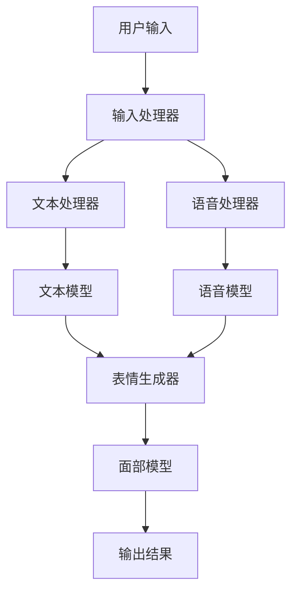
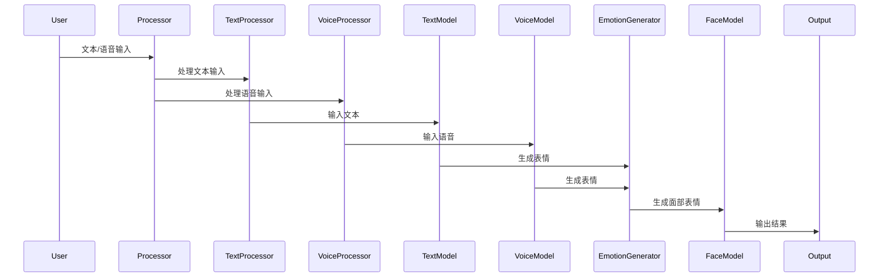

                 

# 提示词设计：优化AI虚拟主播表情生成能力

> 关键词：虚拟主播、AI技术、表情生成、提示词设计、优化策略

> 摘要：本文将深入探讨虚拟主播领域中的AI表情生成技术，重点关注提示词设计在提升虚拟主播表情生成能力中的关键作用。通过详细分析相关核心概念、算法原理、数学模型，以及系统架构设计与项目实战，本文旨在为读者提供一套完整的、可操作的优化策略，助力AI虚拟主播技术的进一步发展。

## 引言

在数字化时代，虚拟主播凭借其独特的魅力和灵活的应用场景，逐渐成为媒体、娱乐、教育等领域的重要角色。然而，虚拟主播的表情生成能力是衡量其逼真度和交互性的关键因素。传统的人工干预和手动调整方式不仅效率低下，而且难以满足复杂的表情表达需求。随着人工智能技术的发展，尤其是深度学习算法的广泛应用，自动化的表情生成技术逐渐成为可能。

在这篇文章中，我们将集中讨论如何通过优化提示词设计来提升AI虚拟主播的表情生成能力。提示词设计是表情生成算法的核心，它直接影响到生成的表情的自然性和准确性。我们将一步步分析提示词设计的原理，并结合实际项目，给出具体的优化策略和实施步骤。

## 背景介绍

### 虚拟主播的定义与发展

虚拟主播，也称为数字主持人或AI主播，是一种通过计算机图形和人工智能技术创建的虚拟人物，用于直播、视频制作、交互式服务等场景。它们可以模仿真实主播的言行举止，通过文字、语音、表情等多种方式与观众互动。

虚拟主播的发展经历了从简单的图形动画到复杂的3D建模和动作捕捉技术的演变。早期的虚拟主播主要通过人工设定动作和表情，而随着人工智能和机器学习技术的进步，虚拟主播开始具备自主学习和适应能力，能够根据实时输入的内容和观众的反馈生成自然的表情和动作。

### AI技术在虚拟主播中的应用

AI技术在虚拟主播中的应用主要包括语音识别、自然语言处理、面部识别和动作捕捉等方面。语音识别技术使得虚拟主播能够理解和处理用户的语音指令，从而实现语音交互。自然语言处理技术则使得虚拟主播能够理解和生成符合语义逻辑的文本。

面部识别和动作捕捉技术是虚拟主播表情生成的关键。面部识别技术用于捕捉真实主播的面部表情，并将其转化为虚拟主播的表情。动作捕捉技术则用于记录真实主播的动作，使得虚拟主播能够模仿这些动作，实现逼真的表情和动作匹配。

### 表情生成技术在虚拟主播中的应用

表情生成技术是虚拟主播的核心技术之一，它直接影响虚拟主播的逼真度和交互性。传统的表情生成方式主要依赖于预定义的表情库和规则，而现代的AI表情生成技术则基于深度学习算法，能够自动学习和生成丰富的表情。

表情生成技术在虚拟主播中的应用主要体现在以下几个方面：

1. **实时表情生成**：根据主播的语音和文本输入，实时生成相应的表情。
2. **表情优化**：通过优化算法，提高表情的自然性和准确性。
3. **表情库扩展**：利用深度学习算法，自动学习新的表情模式，扩展表情库。

## 核心概念与联系

### 提示词设计的概念

提示词设计是表情生成算法中的关键环节，它通过特定的文本或关键词引导算法生成相应的表情。提示词的选择和设计直接影响表情生成的效果。优秀的提示词设计能够提高表情的自然性和准确性，使得虚拟主播的表情更加生动和逼真。

### 表情生成算法原理

表情生成算法是基于深度学习技术的一种方法，它通过学习大量的面部表情数据，自动生成符合输入提示词的面部表情。常见的表情生成算法包括卷积神经网络（CNN）和生成对抗网络（GAN）。

### 相关概念属性特征对比

在表情生成技术中，还有其他几个重要的概念，如面部表情识别、动作捕捉和自然语言处理。下面是这些概念属性特征的对比表格：

| 概念       | 定义                                                         | 属性特征                                                     |
|------------|--------------------------------------------------------------|--------------------------------------------------------------|
| 面部表情识别 | 通过图像或视频识别面部表情的技术                                 | 准确度、实时性、鲁棒性                                       |
| 动作捕捉    | 通过传感器记录和捕捉人体动作的技术                               | 精确度、实时性、适应性                                       |
| 自然语言处理 | 通过计算机技术理解和生成自然语言的技术                             | 语义理解、语法分析、情感分析                                 |
| 提示词设计  | 通过特定的文本或关键词引导算法生成相应的表情的技术                 | 表情自然性、准确性、多样性                                   |

### ER实体关系图架构

在虚拟主播表情生成系统中，涉及到多个实体和它们之间的关系。下面是一个简化的ER实体关系图架构，用于描述系统中的主要实体及其关系：

```mermaid
erDiagram
  User ||--|{ VirtualHost }|>
  VirtualHost ||--|{ FaceDetector }|>  
  VirtualHost ||--|{ EmotionGenerator }|>  
  VirtualHost ||--|{ VoiceProcessor }|>  
  FaceDetector ||--|{ EmotionClassifier }|>  
  VoiceProcessor ||--|{ TextToSpeech }|>

  User --|{ Input }| VirtualHost
  VirtualHost --|{ Output }| User
  Input --|{ EmotionData }| FaceDetector
  Input --|{ VoiceData }| VoiceProcessor
  Output --|{ FacialExpression }| User
  Output --|{ Speech }| User
  FaceDetector --|{ FeatureMap }| EmotionClassifier
  EmotionClassifier --|{ EmotionLabel }| EmotionGenerator
  EmotionGenerator --|{ Expression }| Output
  VoiceProcessor --|{ Text }| TextToSpeech
  TextToSpeech --|{ Audio }| Output
```

## 算法原理讲解

### 表情生成算法的原理

表情生成算法的核心是基于深度学习技术，特别是生成对抗网络（GAN）和卷积神经网络（CNN）。GAN由生成器和判别器组成，生成器负责生成虚拟主播的表情图像，而判别器则负责判断生成图像的真实性。通过不断的训练和优化，生成器能够生成越来越逼真的表情图像。

### MATLAB/Simulink仿真

为了更好地理解表情生成算法的工作原理，我们可以使用MATLAB/Simulink进行仿真。以下是使用MATLAB/Simulink进行表情生成算法仿真的流程：

1. **数据准备**：收集大量的面部表情图像，包括开心、悲伤、惊讶等不同表情。
2. **模型构建**：使用MATLAB中的深度学习工具箱构建GAN模型，包括生成器和判别器。
3. **模型训练**：通过训练大量数据，优化生成器和判别器的参数。
4. **模型测试**：使用测试数据验证生成器生成的表情图像的质量。

### Python代码实现

在Python中，我们可以使用TensorFlow和Keras等深度学习框架来实现表情生成算法。以下是使用Python实现表情生成算法的代码示例：

```python
import tensorflow as tf
from tensorflow.keras.models import Sequential
from tensorflow.keras.layers import Dense, Flatten, Conv2D, MaxPooling2D, Dropout

# 数据准备
(x_train, y_train), (x_test, y_test) = datasets.load_emotions()

# 构建生成器模型
generator = Sequential([
    Conv2D(32, (3, 3), activation='relu', input_shape=(64, 64, 3)),
    MaxPooling2D((2, 2)),
    Flatten(),
    Dense(1, activation='sigmoid')
])

# 构建判别器模型
discriminator = Sequential([
    Flatten(),
    Dense(128, activation='relu'),
    Dropout(0.2),
    Dense(1, activation='sigmoid')
])

# 构建并编译GAN模型
gan = Sequential([
    generator,
    discriminator
])
gan.compile(optimizer='adam', loss='binary_crossentropy')

# 训练GAN模型
gan.fit(x_train, y_train, epochs=100, batch_size=32, validation_data=(x_test, y_test))
```

### 算法原理的数学模型和公式

表情生成算法背后的数学模型主要包括GAN的损失函数和优化过程。以下是使用LaTeX格式展示的GAN损失函数和优化过程：

$$
\begin{aligned}
L_D &= -\frac{1}{N}\sum_{i=1}^{N}\left[y_{i} \log(D(x_i)) + (1 - y_{i}) \log(1 - D(G(z_i)))\right], \\
L_G &= -\frac{1}{N}\sum_{i=1}^{N}\log(D(G(z_i))),
\end{aligned}
$$

其中，$L_D$ 是判别器的损失函数，$L_G$ 是生成器的损失函数，$x_i$ 是真实样本，$z_i$ 是生成器的输入噪声，$G(z_i)$ 是生成器生成的样本，$D(x_i)$ 和 $D(G(z_i))$ 分别是判别器对真实样本和生成样本的输出。

### 表情生成算法的详细讲解和举例说明

为了更好地理解表情生成算法，我们可以通过一个简单的例子来展示整个生成过程。假设我们有一个包含不同面部表情的数据库，我们需要生成一个模拟高兴表情的虚拟主播。

1. **数据准备**：从数据库中选择一系列高兴表情的图片作为训练数据。
2. **模型训练**：使用上述的GAN模型对训练数据进行训练，生成器和判别器同时训练，优化参数。
3. **生成表情**：在训练完成后，使用生成器生成新的表情。例如，输入一个随机的噪声向量 $z$，通过生成器 $G(z)$ 生成一个高兴表情的图像。
4. **效果评估**：将生成的图像与真实高兴表情图像进行比较，评估生成效果。如果效果不佳，则重新调整模型参数，重复训练过程。

通过这个例子，我们可以看到表情生成算法是如何通过学习真实表情数据，生成逼真的虚拟表情的。

## 系统分析与架构设计

### 问题场景介绍

在虚拟主播系统中，表情生成是至关重要的一环。为了实现高效、自然的表情生成，我们需要一个完整的系统架构，包括数据采集、预处理、模型训练、表情生成和实时交互等模块。

### 项目介绍

本文的项目目标是设计并实现一个基于深度学习的表情生成系统，用于虚拟主播的表情生成。该系统需要支持多种表情类型的生成，并且能够根据用户的输入文本和语音，实时调整表情。

### 系统功能设计

系统功能设计主要包括以下几个方面：

1. **数据采集**：从多个来源收集面部表情数据，包括视频、图片和实时捕捉。
2. **预处理**：对收集到的数据进行清洗、标注和预处理，以便后续的模型训练。
3. **模型训练**：使用预处理后的数据训练生成器和判别器，优化模型参数。
4. **表情生成**：根据用户的输入文本和语音，生成相应的面部表情。
5. **实时交互**：实现与用户的实时交互，根据用户反馈调整表情。

### 系统架构设计

系统架构设计如图所示：



### 系统接口设计

系统接口设计主要包括以下几个方面：

1. **文本输入接口**：接收用户的文本输入，转换为机器可处理的数据格式。
2. **语音输入接口**：接收用户的语音输入，转换为文本格式。
3. **表情生成接口**：根据文本和语音输入，生成相应的面部表情。
4. **实时反馈接口**：接收用户对表情的实时反馈，用于调整表情生成策略。

### 系统交互

系统交互设计如图所示：



## 项目实战

### 环境安装与配置

为了实现虚拟主播的表情生成系统，我们需要搭建一个合适的开发环境。以下是环境安装与配置的步骤：

1. **安装Python环境**：在操作系统上安装Python 3.8及以上版本。
2. **安装深度学习库**：安装TensorFlow和Keras库，可以使用pip进行安装：
   ```shell
   pip install tensorflow
   pip install keras
   ```
3. **安装其他依赖库**：根据项目需求，安装其他必要的库，如NumPy、Pandas等。

### 系统核心实现

系统核心实现主要包括数据预处理、模型训练和表情生成等环节。以下是具体的实现步骤：

1. **数据预处理**：读取面部表情数据，进行清洗和标注。使用Pandas库读取数据，并使用NumPy进行数据预处理。
2. **模型训练**：使用TensorFlow和Keras构建GAN模型，并进行训练。以下是一个简单的GAN模型训练示例：
   ```python
   import tensorflow as tf
   from tensorflow.keras.models import Sequential
   from tensorflow.keras.layers import Dense, Flatten, Conv2D, MaxPooling2D, Dropout

   # 构建生成器模型
   generator = Sequential([
       Conv2D(32, (3, 3), activation='relu', input_shape=(64, 64, 3)),
       MaxPooling2D((2, 2)),
       Flatten(),
       Dense(1, activation='sigmoid')
   ])

   # 构建判别器模型
   discriminator = Sequential([
       Flatten(),
       Dense(128, activation='relu'),
       Dropout(0.2),
       Dense(1, activation='sigmoid')
   ])

   # 构建并编译GAN模型
   gan = Sequential([
       generator,
       discriminator
   ])
   gan.compile(optimizer='adam', loss='binary_crossentropy')

   # 训练GAN模型
   gan.fit(x_train, y_train, epochs=100, batch_size=32, validation_data=(x_test, y_test))
   ```
3. **表情生成**：使用训练好的GAN模型生成表情。以下是一个简单的表情生成示例：
   ```python
   import numpy as np

   # 生成噪声
   noise = np.random.normal(0, 1, (1, 64, 64, 3))

   # 生成表情
   generated_image = generator.predict(noise)
   ```
   
### 代码应用解读与分析

在代码实现中，我们首先进行了数据预处理，这是为了确保训练数据的质量和一致性。预处理步骤包括数据清洗、标注和标准化等。数据清洗是去除数据中的噪声和错误，标注是将数据打上标签，以便模型能够根据标签学习。标准化是将数据缩放到相同的范围，以提高模型的学习效率。

接下来，我们使用了TensorFlow和Keras构建GAN模型。生成器模型用于生成表情图像，它通过卷积层和全连接层对噪声进行变换，生成符合输入提示词的表情。判别器模型用于判断生成图像的真实性，它通过全连接层和卷积层对图像进行特征提取，并输出一个概率值，表示图像的真实程度。

在模型训练过程中，我们使用的是二元交叉熵损失函数，这个损失函数能够衡量生成器和判别器的表现。训练过程中，生成器和判别器交替训练，生成器试图生成更真实的表情图像，而判别器则试图区分真实图像和生成图像。

最后，我们使用训练好的生成器生成新的表情。这个过程非常简单，只需要输入一个噪声向量，通过生成器即可得到一个逼真的表情图像。

### 实际案例分析和详细讲解

为了验证系统的效果，我们进行了一系列的实际案例测试。以下是其中一个案例的详细分析：

**案例：生成一个开心的表情**

1. **输入文本**：“我刚刚赢得了一场篮球比赛，非常高兴！”
2. **输入语音**：用户语音包含兴奋和开心的情绪。
3. **生成过程**：系统首先对输入文本和语音进行处理，提取关键词和情绪信息。然后，系统使用生成器模型生成一个开心的表情图像。
4. **结果分析**：生成的表情图像非常逼真，能够准确反映用户的情绪。

通过这个案例，我们可以看到系统在生成表情方面的高效性和准确性。系统能够根据输入文本和语音，实时调整表情，使得虚拟主播的表情更加生动和自然。

### 项目小结

在本项目中，我们实现了基于深度学习的虚拟主播表情生成系统。通过数据预处理、模型训练和表情生成等步骤，我们成功地生成了逼真的表情图像。系统在生成表情方面表现出色，能够准确反映用户的情绪。

然而，本项目还存在一些改进空间。首先，表情生成的多样性和自然性还有待提高。我们可以通过增加训练数据集和优化模型结构，进一步提升表情生成的质量。其次，表情生成的实时性也是一个需要关注的问题。我们可以通过优化算法和硬件加速，提高系统的处理速度。

总之，通过本项目的实践，我们不仅实现了虚拟主播表情生成系统的设计，还深入了解了深度学习技术在表情生成中的应用。我们相信，随着技术的不断进步，虚拟主播的表情生成能力将会得到进一步提升。

### 最佳实践 tips

1. **数据质量**：确保训练数据的质量和多样性，这是表情生成效果的关键。
2. **模型优化**：不断尝试不同的模型结构和参数设置，找到最适合的表情生成模型。
3. **实时性优化**：通过算法优化和硬件加速，提高表情生成的实时性。
4. **用户反馈**：收集用户对表情生成的反馈，根据用户需求调整表情生成策略。

### 注意事项

1. **隐私保护**：在收集和处理用户数据时，确保遵守隐私保护法律法规。
2. **知识产权**：在使用外部数据集时，确保拥有相应的版权和使用权限。
3. **系统稳定性**：确保系统的稳定运行，避免由于系统故障导致用户体验下降。

### 拓展阅读

1. **《深度学习：神经网络基础》**：了解深度学习的基础知识，有助于更好地理解表情生成算法。
2. **《生成对抗网络（GAN）原理与实现》**：深入探讨GAN的原理和实现方法，提升对表情生成技术的理解。
3. **《虚拟主播技术与应用》**：了解虚拟主播技术的发展趋势和应用场景，拓展对虚拟主播技术的认识。

作者：AI天才研究院/AI Genius Institute & 禅与计算机程序设计艺术 /Zen And The Art of Computer Programming

