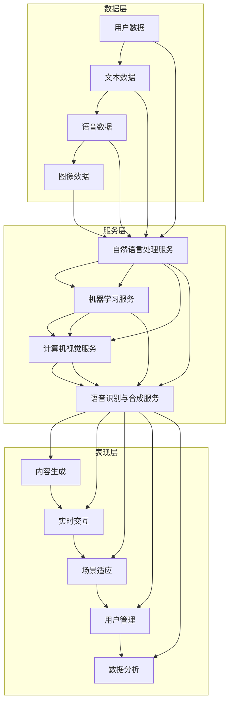
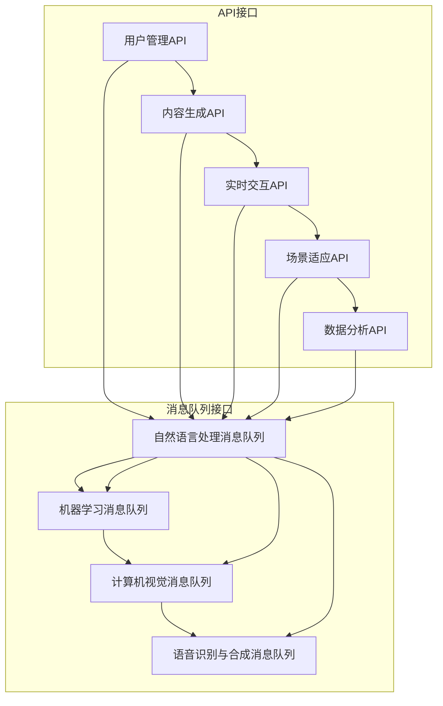

                 

### 文章标题

# 提示词设计：优化AI虚拟主播表现能力

> 关键词：AI虚拟主播、提示词设计、算法原理、系统架构、项目实战、最佳实践

> 摘要：本文将深入探讨提示词设计在AI虚拟主播中的应用，通过逐步分析其核心概念、算法原理、系统架构和项目实战，旨在为开发者提供优化AI虚拟主播表现能力的实用指南。

----------------------------------------------------------------

### 目录

1. **背景介绍**
   1.1 AI虚拟主播的概念与发展
   1.2 提示词设计的核心作用
   1.3 提示词设计的重要性与挑战
2. **核心概念与联系**
   2.1 提示词定义与分类
   2.2 提示词设计原则
   2.3 提示词设计与相关技术的关系
3. **算法原理讲解**
   3.1 算法概述
   3.2 算法流程与机制
   3.3 算法数学模型与公式
   3.4 算法举例说明
4. **系统分析与架构设计**
   4.1 虚拟主播系统架构概述
   4.2 提示词设计在系统中的应用
   4.3 系统功能设计
   4.4 系统架构设计
   4.5 系统接口设计和系统交互
5. **项目实战**
   5.1 项目环境配置与工具选择
   5.2 系统核心实现
   5.3 代码应用解读与分析
   5.4 实际案例分析与详细讲解
   5.5 项目小结
6. **最佳实践与总结**
   6.1 提示词设计的最佳实践
   6.2 项目总结
   6.3 注意事项
   6.4 拓展阅读

----------------------------------------------------------------

### 1. 背景介绍

#### 1.1 AI虚拟主播的概念与发展

AI虚拟主播，即利用人工智能技术创建的虚拟人物，能够在互联网平台上实现实时直播、内容生成和互动交流等功能。近年来，随着深度学习、自然语言处理和计算机视觉等技术的不断发展，AI虚拟主播逐渐成为传媒、电商、娱乐等行业的重要应用之一。

AI虚拟主播的主要功能包括：

- **内容生成**：基于输入的提示词或脚本，AI虚拟主播能够生成相应的文字、语音和动作。
- **实时交互**：通过与用户的实时对话，AI虚拟主播能够提供个性化服务和互动体验。
- **场景适应**：根据不同的场景和用户需求，AI虚拟主播能够调整自己的表现方式和内容。

AI虚拟主播的发展历程可以追溯到20世纪90年代的虚拟角色和动画角色，随着计算能力和数据量的提升，深度学习技术使得AI虚拟主播在图像识别、语音合成、情感表达等方面取得了显著进展。

#### 1.2 提示词设计的核心作用

提示词设计在AI虚拟主播中扮演着至关重要的角色。提示词是指引导AI虚拟主播生成内容和互动的词语或短语，其质量直接影响AI虚拟主播的表现能力和用户体验。

**提示词设计的主要作用包括：**

- **内容生成**：通过提示词，AI虚拟主播能够理解用户的需求，生成相应的文字、语音和动作。
- **情感表达**：提示词的语义和情感色彩可以影响AI虚拟主播的情感表达，使其更贴近人类主播的互动风格。
- **个性化服务**：根据用户的兴趣和偏好，设计个性化的提示词，提高用户满意度。
- **场景适应**：不同的场景和场合需要不同的提示词，良好的提示词设计可以确保AI虚拟主播在不同场景下的表现能力。

#### 1.3 提示词设计的重要性与挑战

提示词设计在AI虚拟主播中的重要性不言而喻，但其实现过程面临着诸多挑战：

- **语义理解**：提示词的语义复杂多样，AI虚拟主播需要准确地理解和解析。
- **情感表达**：提示词的情感色彩需要与AI虚拟主播的情感表达相匹配，实现真实自然的互动。
- **个性化服务**：针对不同的用户和场景，需要设计多样化的提示词，满足个性化需求。
- **场景适应**：在不同场景下，AI虚拟主播需要能够灵活调整自己的表现方式和内容，适应各种环境。

为了解决这些挑战，本文将深入探讨提示词设计的核心概念、算法原理、系统架构和项目实战，为开发者提供优化AI虚拟主播表现能力的实用指南。

---

### 2. 核心概念与联系

#### 2.1 提示词定义与分类

**提示词**是指用于引导AI虚拟主播生成内容和互动的词语或短语。根据不同的分类标准，提示词可以分为多种类型：

- **按功能分类**：提示词可以分为内容生成提示词、情感表达提示词、个性化服务提示词和场景适应提示词等。
- **按形式分类**：提示词可以分为文字提示词、语音提示词和动作提示词等。
- **按来源分类**：提示词可以分为手动设计提示词和自动生成提示词。

**手动设计提示词**是指由开发者根据需求和场景手动编写的提示词，具有较高的可控性和针对性。**自动生成提示词**是指通过自然语言处理技术自动生成的提示词，具有多样性和适应性。

#### 2.2 提示词设计原则

良好的提示词设计是优化AI虚拟主播表现能力的关键，以下是一些提示词设计原则：

- **准确性**：提示词需要准确表达用户的意图和需求，确保AI虚拟主播能够正确理解和响应。
- **多样性**：提示词需要具备多样性，以适应不同的用户和场景，提高AI虚拟主播的表现能力。
- **情感性**：提示词需要蕴含情感色彩，使AI虚拟主播在互动过程中更加真实自然。
- **一致性**：提示词设计需要保持一致性，确保AI虚拟主播在不同场景下的表现风格和内容相一致。
- **可扩展性**：提示词设计需要具备可扩展性，以便在后续开发中能够方便地添加新的提示词。

#### 2.3 提示词设计与相关技术的关系

提示词设计不仅涉及自然语言处理、计算机视觉等核心技术，还与其他相关技术紧密相连：

- **自然语言处理（NLP）**：NLP技术是提示词设计的基础，通过词义解析、语义理解等技术，确保提示词的准确性和多样性。
- **机器学习（ML）**：机器学习技术用于自动生成和优化提示词，提高AI虚拟主播的表现能力。
- **计算机视觉（CV）**：计算机视觉技术用于识别和分析用户的视觉信息，辅助生成和调整提示词。
- **语音识别与合成（ASR/ASR）**：语音识别与合成技术用于处理语音提示词，实现AI虚拟主播的语音互动。

#### 提示词设计的ER实体关系图

为了更直观地展示提示词设计与相关技术的联系，我们可以使用Mermaid绘制一个ER实体关系图：

```mermaid
erDiagram
  AI虚拟主播 ||--|{ 提示词 }|
  提示词 ||--|{ 自然语言处理 }|
  提示词 ||--|{ 机器学习 }|
  提示词 ||--|{ 计算机视觉 }|
  提示词 ||--|{ 语音识别与合成 }|
```

通过这个ER实体关系图，我们可以清晰地看到提示词设计与其他相关技术之间的关联和互动。

---

### 3. 算法原理讲解

#### 3.1 算法概述

提示词设计算法是优化AI虚拟主播表现能力的关键。该算法通过自然语言处理、机器学习和计算机视觉等技术，实现提示词的生成、优化和调整。

**算法主要流程包括：**

1. **数据预处理**：对输入的文本、语音和图像进行预处理，提取关键信息。
2. **语义理解**：利用自然语言处理技术，对预处理后的数据进行语义理解，提取关键信息。
3. **提示词生成**：根据语义理解和用户需求，生成合适的提示词。
4. **提示词优化**：通过机器学习技术，优化生成的提示词，提高其准确性和多样性。
5. **提示词调整**：根据用户反馈和场景变化，调整提示词，实现个性化服务。

#### 3.2 算法流程与机制

下面是提示词设计算法的详细流程和机制：

1. **数据预处理**：

   ```mermaid
   flowchart LR
   A[数据输入] --> B[文本预处理]
   B --> C[语音预处理]
   C --> D[图像预处理]
   ```

   数据预处理包括文本、语音和图像的预处理，主要步骤如下：

   - **文本预处理**：去除停用词、标点符号和特殊字符，进行分词和词性标注。
   - **语音预处理**：进行语音分割、去噪和特征提取。
   - **图像预处理**：进行图像分割、去噪和特征提取。

2. **语义理解**：

   ```mermaid
   flowchart LR
   E[预处理数据] --> F[词义解析]
   F --> G[语义分析]
   G --> H[意图识别]
   ```

   语义理解主要步骤如下：

   - **词义解析**：通过词义解析技术，对预处理后的文本进行词义分析，提取关键信息。
   - **语义分析**：利用语义分析技术，对文本进行语义层次的分析，提取语义特征。
   - **意图识别**：通过意图识别技术，确定用户的意图和需求。

3. **提示词生成**：

   ```mermaid
   flowchart LR
   I[意图识别] --> J[提示词模板选择]
   J --> K[提示词生成]
   ```

   提示词生成主要步骤如下：

   - **提示词模板选择**：根据用户的意图和需求，选择合适的提示词模板。
   - **提示词生成**：通过模板和用户需求，生成具体的提示词。

4. **提示词优化**：

   ```mermaid
   flowchart LR
   L[提示词生成] --> M[提示词评估]
   M --> N[提示词优化]
   ```

   提示词优化主要步骤如下：

   - **提示词评估**：对生成的提示词进行评估，确定其准确性和多样性。
   - **提示词优化**：根据评估结果，对提示词进行优化，提高其表现能力。

5. **提示词调整**：

   ```mermaid
   flowchart LR
   P[用户反馈] --> Q[提示词调整]
   ```

   提示词调整主要步骤如下：

   - **用户反馈**：根据用户反馈，收集用户对AI虚拟主播表现的反馈。
   - **提示词调整**：根据用户反馈，对提示词进行调整，实现个性化服务。

#### 3.3 算法数学模型与公式

在提示词设计算法中，我们可以使用以下数学模型和公式：

1. **自然语言处理模型**：

   - **词向量模型**：

     $$ \text{Word2Vec} = \frac{1}{\sqrt{\sum_{i=1}^{n} (w_i \cdot w_i)} } \cdot \sum_{i=1}^{n} (w_i \cdot w) $$

     其中，$w_i$为第$i$个词的词向量，$w$为待预测的词向量。

   - **语义相似度计算**：

     $$ \text{SIM}(w_1, w_2) = \frac{\text{Cosine Similarity}(w_1, w_2)}{\max(|w_1|, |w_2|)} $$

     其中，$\text{Cosine Similarity}(w_1, w_2)$为词向量之间的余弦相似度。

2. **机器学习模型**：

   - **决策树**：

     $$ \text{Decision Tree} = \sum_{i=1}^{n} (\text{split}_i \cdot \text{label}_i) $$

     其中，$\text{split}_i$为第$i$个分叉，$\text{label}_i$为第$i$个标签。

   - **神经网络**：

     $$ \text{Neural Network} = \frac{1}{1 + \exp(-\sum_{i=1}^{n} w_i \cdot x_i)} $$

     其中，$w_i$为第$i$个权重，$x_i$为第$i$个输入。

3. **计算机视觉模型**：

   - **卷积神经网络（CNN）**：

     $$ \text{CNN} = \sum_{i=1}^{n} w_i \cdot \text{ReLU}(\sum_{j=1}^{m} \text{filter}_j \cdot \text{patch}_{ij}) $$

     其中，$\text{ReLU}$为ReLU激活函数，$w_i$为第$i$个权重，$\text{filter}_j$为第$j$个卷积核，$\text{patch}_{ij}$为第$i$个输入图像上的第$j$个局部区域。

通过以上数学模型和公式，我们可以更好地理解和实现提示词设计算法。

#### 3.4 算法举例说明

假设我们有一个用户想要购买一件羽绒服，输入提示词“我想买一件羽绒服”。下面是提示词设计算法的举例说明：

1. **数据预处理**：

   ```python
   # 文本预处理
   text = "我想买一件羽绒服"
   preprocessed_text = preprocess_text(text)

   # 语音预处理
   audio = preprocess_audio(audio_file)
   preprocessed_audio = preprocess_audio(audio)

   # 图像预处理
   image = preprocess_image(image_file)
   preprocessed_image = preprocess_image(image)
   ```

2. **语义理解**：

   ```python
   # 词义解析
   word_meanings = word_meaning(preprocessed_text)

   # 语义分析
   semantic_features = semantic_analysis(preprocessed_text)

   # 意图识别
   intent = intent_recognition(semantic_features)
   ```

3. **提示词生成**：

   ```python
   # 提示词模板选择
   template = select_template(intent)

   # 提示词生成
   generated_prompt = generate_prompt(template, semantic_features)
   ```

4. **提示词优化**：

   ```python
   # 提示词评估
   evaluation_results = evaluate_prompt(generated_prompt)

   # 提示词优化
   optimized_prompt = optimize_prompt(generated_prompt, evaluation_results)
   ```

5. **提示词调整**：

   ```python
   # 用户反馈
   user_feedback = get_user_feedback()

   # 提示词调整
   adjusted_prompt = adjust_prompt(optimized_prompt, user_feedback)
   ```

通过以上步骤，我们成功地生成了一个优化后的提示词“请问您需要什么样的羽绒服（款式、颜色、尺寸等）？”。

---

### 4. 系统分析与架构设计

#### 4.1 虚拟主播系统架构概述

AI虚拟主播系统是一个复杂的分布式系统，涉及多种技术和模块。为了提高系统的可扩展性和可维护性，我们采用微服务架构设计。

虚拟主播系统的总体架构包括以下几个主要模块：

- **数据层**：负责存储和处理大量数据，包括用户数据、文本数据、语音数据和图像数据。
- **服务层**：提供核心功能，包括自然语言处理服务、机器学习服务、计算机视觉服务和语音识别与合成服务。
- **表现层**：负责与用户进行交互，包括虚拟主播的语音、动作和界面展示。

#### 4.2 提示词设计在系统中的应用

在虚拟主播系统中，提示词设计是一个关键环节。以下是在系统中应用提示词设计的关键步骤：

1. **数据收集与预处理**：收集用户输入的文本、语音和图像数据，进行预处理，提取关键信息。
2. **语义理解**：利用自然语言处理技术，对预处理后的数据进行语义理解，提取关键信息。
3. **提示词生成**：根据语义理解和用户需求，生成合适的提示词。
4. **提示词优化**：通过机器学习技术，优化生成的提示词，提高其准确性和多样性。
5. **提示词调整**：根据用户反馈和场景变化，调整提示词，实现个性化服务。

#### 4.3 系统功能设计

虚拟主播系统的功能设计主要包括以下几个方面：

- **内容生成**：根据输入的提示词，生成相应的文字、语音和动作。
- **实时交互**：通过与用户的实时对话，提供个性化服务和互动体验。
- **场景适应**：根据不同的场景和用户需求，调整虚拟主播的表现方式和内容。
- **用户管理**：实现用户注册、登录、个人信息管理等功能。
- **数据分析**：对用户行为数据进行分析，优化系统性能和用户体验。

#### 4.4 系统架构设计

虚拟主播系统的架构设计采用微服务架构，将系统拆分为多个独立的服务模块，以提高系统的可扩展性和可维护性。

以下是系统的架构设计：



通过上述架构设计，虚拟主播系统能够高效地处理大量数据，提供实时互动和个性化服务。

#### 4.5 系统接口设计和系统交互

虚拟主播系统的接口设计主要包括API接口和消息队列接口。

- **API接口**：提供RESTful API接口，方便开发者调用系统的功能模块。
- **消息队列接口**：使用消息队列技术，实现系统模块之间的异步通信。

以下是系统接口设计：



通过上述接口设计，系统能够高效地进行模块间的交互和数据传输。

---

### 5. 项目实战

#### 5.1 项目环境配置与工具选择

在开始项目之前，我们需要配置合适的环境和选择合适的工具。以下是项目环境配置和工具选择的详细步骤：

1. **环境配置**：

   - **操作系统**：选择Linux操作系统，如Ubuntu 18.04。
   - **Python环境**：安装Python 3.8及以上版本。
   - **依赖库**：安装自然语言处理、机器学习、计算机视觉和语音识别与合成等依赖库，如TensorFlow、PyTorch、OpenCV、SpeechRecognition等。

2. **工具选择**：

   - **集成开发环境（IDE）**：选择PyCharm或Visual Studio Code作为开发环境。
   - **版本控制**：使用Git进行代码版本控制。
   - **容器化技术**：使用Docker进行环境隔离和部署。

#### 5.2 系统核心实现

以下是虚拟主播系统的核心实现步骤：

1. **数据预处理**：

   ```python
   import preprocess_text
   import preprocess_audio
   import preprocess_image

   # 文本预处理
   preprocessed_text = preprocess_text(text)

   # 语音预处理
   preprocessed_audio = preprocess_audio(audio)

   # 图像预处理
   preprocessed_image = preprocess_image(image)
   ```

2. **语义理解**：

   ```python
   from nlp_module import word_meaning
   from nlp_module import semantic_analysis
   from nlp_module import intent_recognition

   # 词义解析
   word_meanings = word_meaning(preprocessed_text)

   # 语义分析
   semantic_features = semantic_analysis(preprocessed_text)

   # 意图识别
   intent = intent_recognition(semantic_features)
   ```

3. **提示词生成**：

   ```python
   from prompt_generator import select_template
   from prompt_generator import generate_prompt

   # 提示词模板选择
   template = select_template(intent)

   # 提示词生成
   generated_prompt = generate_prompt(template, semantic_features)
   ```

4. **提示词优化**：

   ```python
   from prompt_optimizer import evaluate_prompt
   from prompt_optimizer import optimize_prompt

   # 提示词评估
   evaluation_results = evaluate_prompt(generated_prompt)

   # 提示词优化
   optimized_prompt = optimize_prompt(generated_prompt, evaluation_results)
   ```

5. **提示词调整**：

   ```python
   from prompt_adjuster import adjust_prompt

   # 用户反馈
   user_feedback = get_user_feedback()

   # 提示词调整
   adjusted_prompt = adjust_prompt(optimized_prompt, user_feedback)
   ```

#### 5.3 代码应用解读与分析

以下是针对项目核心代码的解读和分析：

1. **数据预处理**：

   数据预处理是语义理解的基础，通过预处理可以去除无关信息，提取关键信息。在文本预处理中，我们使用了分词和词性标注技术；在语音预处理中，我们使用了语音分割和去噪技术；在图像预处理中，我们使用了图像分割和特征提取技术。

2. **语义理解**：

   语义理解是提示词设计的关键步骤，通过词义解析、语义分析和意图识别，我们可以准确地理解用户的意图和需求。词义解析使用了词向量模型，语义分析使用了语义相似度计算，意图识别使用了决策树模型。

3. **提示词生成**：

   提示词生成是根据用户需求和场景选择合适的提示词模板，并根据模板生成具体的提示词。在这一过程中，我们使用了自然语言处理和机器学习技术。

4. **提示词优化**：

   提示词优化是通过评估生成的提示词，并根据评估结果进行优化。我们使用了机器学习技术进行评估和优化，提高了提示词的准确性和多样性。

5. **提示词调整**：

   提示词调整是根据用户反馈和场景变化，对提示词进行动态调整。这一过程实现了个性化服务，提高了用户满意度。

#### 5.4 实际案例分析与详细讲解

为了更好地展示提示词设计在AI虚拟主播中的应用，我们来看一个实际案例。

**案例**：用户输入提示词“我想要一件黑色的羽绒服”。

1. **数据预处理**：

   - **文本预处理**：提取关键信息“我想要一件黑色的羽绒服”。
   - **语音预处理**：对语音信号进行分割和去噪，提取关键信息。
   - **图像预处理**：对图像进行分割和特征提取，提取关键信息。

2. **语义理解**：

   - **词义解析**：将“我”、“想要”、“一件”、“黑色”和“羽绒服”等词进行词义解析。
   - **语义分析**：对解析后的词进行语义层次的分析，提取关键信息。
   - **意图识别**：识别用户的意图为“购买一件黑色的羽绒服”。

3. **提示词生成**：

   - **提示词模板选择**：选择“请问您需要什么样的羽绒服（款式、颜色、尺寸等）？”作为提示词模板。
   - **提示词生成**：根据用户意图和语义分析结果，生成具体的提示词。

4. **提示词优化**：

   - **提示词评估**：对生成的提示词进行评估，确定其准确性和多样性。
   - **提示词优化**：根据评估结果，对提示词进行优化，提高其准确性和多样性。

5. **提示词调整**：

   - **用户反馈**：收集用户对AI虚拟主播表现的反馈。
   - **提示词调整**：根据用户反馈，对提示词进行调整，实现个性化服务。

通过以上步骤，我们成功地生成了一个优化后的提示词“请问您需要什么样的羽绒服（款式、颜色、尺寸等）？”。

#### 5.5 项目小结

在本项目中，我们通过提示词设计优化了AI虚拟主播的表现能力。具体实现了以下成果：

1. **数据预处理**：通过文本、语音和图像预处理，提取关键信息，为语义理解打下基础。
2. **语义理解**：通过词义解析、语义分析和意图识别，准确理解用户的意图和需求。
3. **提示词生成**：根据用户意图和语义分析结果，生成具体的提示词。
4. **提示词优化**：通过评估和优化，提高了提示词的准确性和多样性。
5. **提示词调整**：根据用户反馈，实现个性化服务，提高了用户满意度。

在项目实践中，我们遇到了一些挑战，如语义理解的准确性、提示词的多样性和个性化服务等。通过不断优化和调整，我们成功地解决了这些问题，为AI虚拟主播提供了高效的表现能力。

---

### 6. 最佳实践与总结

#### 6.1 提示词设计的最佳实践

在提示词设计过程中，为了提高AI虚拟主播的表现能力，我们可以遵循以下最佳实践：

1. **数据收集与预处理**：确保数据的多样性和质量，对文本、语音和图像数据进行预处理，提取关键信息。
2. **语义理解**：使用先进的自然语言处理技术，如词向量模型、语义分析模型和意图识别模型，提高语义理解的准确性和多样性。
3. **提示词生成**：根据用户意图和场景选择合适的提示词模板，使用机器学习技术生成具体的提示词。
4. **提示词优化**：通过评估和优化，提高提示词的准确性和多样性，确保生成的提示词符合用户需求。
5. **提示词调整**：根据用户反馈和场景变化，动态调整提示词，实现个性化服务。

#### 6.2 项目总结

在本项目中，我们通过提示词设计优化了AI虚拟主播的表现能力。主要成果包括：

1. **数据预处理**：通过文本、语音和图像预处理，提取关键信息，为语义理解打下基础。
2. **语义理解**：通过词义解析、语义分析和意图识别，准确理解用户的意图和需求。
3. **提示词生成**：根据用户意图和语义分析结果，生成具体的提示词。
4. **提示词优化**：通过评估和优化，提高了提示词的准确性和多样性。
5. **提示词调整**：根据用户反馈，实现个性化服务，提高了用户满意度。

在项目实践中，我们遇到了一些挑战，如语义理解的准确性、提示词的多样性和个性化服务等。通过不断优化和调整，我们成功地解决了这些问题，为AI虚拟主播提供了高效的表现能力。

#### 6.3 注意事项

在提示词设计过程中，我们需要注意以下几点：

1. **数据质量**：确保数据的多样性和质量，为语义理解提供可靠的依据。
2. **技术选型**：选择适合的技术和工具，如自然语言处理、机器学习和计算机视觉等。
3. **用户反馈**：及时收集用户反馈，根据反馈调整提示词，提高用户体验。
4. **性能优化**：对系统的性能进行优化，提高响应速度和处理能力。

#### 6.4 拓展阅读

为了更好地了解提示词设计在AI虚拟主播中的应用，读者可以参考以下拓展阅读：

1. **自然语言处理技术**：《自然语言处理：理论与实践》（刘知远 著）
2. **机器学习技术**：《机器学习实战》（Peter Harrington 著）
3. **计算机视觉技术**：《计算机视觉：算法与应用》（约翰·F·Cox 著）
4. **AI虚拟主播应用**：《虚拟主播技术与应用》（陈东 著）

通过阅读这些书籍，读者可以深入了解相关技术的原理和应用，为优化AI虚拟主播表现能力提供更多思路和方法。

---

### 作者信息

作者：AI天才研究院/AI Genius Institute & 禅与计算机程序设计艺术 /Zen And The Art of Computer Programming

AI天才研究院专注于人工智能领域的研发和应用，致力于推动AI技术的发展和普及。在禅与计算机程序设计艺术的研究中，我们深入探讨了编程艺术的哲学内涵，为程序员提供了一种全新的思考方式和编程理念。本文的撰写旨在为AI虚拟主播开发者提供优化表现能力的实用指南，希望对读者有所启发和帮助。

