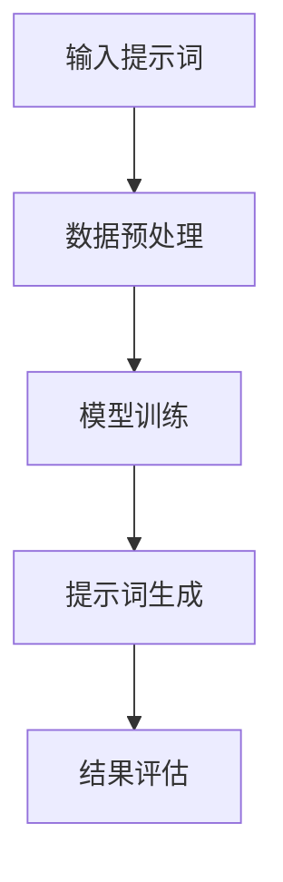

                 

### 《提示词设计：增强AI创意广告策划能力》

#### 关键词：AI、广告策划、提示词设计、创意广告、算法、数据驱动

#### 摘要：
广告行业正经历着一场革命，人工智能（AI）的迅速发展正在改变广告策划和投放的方式。本文将深入探讨如何通过提示词设计来增强AI在创意广告策划中的能力。我们将从背景介绍、核心概念与原理、算法详解、实战案例解析、应用领域、最佳实践与注意事项，以及未来展望与发展趋势等多个方面展开讨论，帮助广告从业者更好地理解和应用AI技术，提升广告创意和投放效果。

## 第一部分：引言与背景

### 第1章：问题背景与挑战

#### 1.1 问题的提出
在数字化的时代，广告的形式和渠道变得越来越多样，用户对广告的接受度和满意度也在不断变化。广告行业面临的挑战主要包括以下几个方面：
- **广告同质化严重**：市场上广告内容雷同，难以吸引用户注意力。
- **投放效果不佳**：传统广告投放策略难以精准触达目标用户，效果不佳。
- **用户需求多样化**：用户对广告内容的要求越来越高，个性化、创意化的广告需求不断增加。

#### 1.2 提示词设计的意义
提示词设计在AI创意广告策划中具有重要意义，主要体现在以下几个方面：
- **提升广告创意的效率和质量**：通过设计有针对性的提示词，可以迅速生成创意广告内容，提高广告策划的效率和质量。
- **提高广告投放的效果和用户满意度**：精准的提示词可以帮助广告投放系统更好地理解用户需求，提高广告投放的精准度和效果，从而提升用户满意度。

### 1.3 书籍结构概述
本文将分为七个部分，每个部分都将针对不同的主题进行深入探讨：
1. **引言与背景**：介绍AI创意广告策划的现状和挑战。
2. **核心概念与原理**：阐述AI与广告策划的关系，以及提示词设计的基础。
3. **提示词生成算法详解**：介绍常见算法及其原理，包括深度学习算法。
4. **实战案例解析**：通过具体案例，展示提示词设计在实际应用中的效果。
5. **AI创意广告策划应用**：讨论AI在广告创意策划中的应用。
6. **最佳实践与注意事项**：总结提示词设计的最佳实践和注意事项。
7. **未来展望与发展趋势**：探讨AI创意广告策划的未来方向。

## 第2章：核心概念与原理

### 2.1 AI与广告策划

#### AI在广告策划中的应用场景
AI在广告策划中的应用场景非常广泛，主要包括以下几个方面：
- **广告创意生成**：利用AI技术自动生成广告创意，提高广告创意的多样性和质量。
- **用户行为分析**：通过分析用户行为数据，了解用户兴趣和偏好，实现精准广告投放。
- **广告效果预测**：利用AI技术预测广告投放效果，优化广告投放策略。
- **广告内容优化**：根据用户反馈和效果数据，实时调整广告内容，提高广告投放效果。

#### 广告策划流程中的AI技术
在广告策划流程中，AI技术可以贯穿始终，主要包括以下几个环节：
- **市场调研**：利用AI技术收集和分析市场数据，了解市场趋势和用户需求。
- **创意策划**：利用AI技术生成创意广告内容，提高广告创意的多样性和质量。
- **投放策略**：利用AI技术分析用户行为和投放效果，制定精准的投放策略。
- **效果评估**：利用AI技术预测广告投放效果，优化广告投放策略。

### 2.2 提示词设计基础

#### 提示词的定义和作用
提示词（Prompt Word）是指在广告策划中用于引导AI生成创意内容的文字或短语。提示词的设计直接影响广告创意的生成效果。提示词的主要作用包括：
- **引导创意生成**：通过提示词，让AI更好地理解广告创意的需求，生成符合预期的广告内容。
- **提高广告质量**：精准的提示词可以提升广告的创意质量，提高广告投放效果。

#### 提示词的类型和特点
根据用途和形式，提示词可以分为以下几种类型：
- **主题型提示词**：用于确定广告的主题和核心内容。
- **描述型提示词**：用于描述广告的产品或服务的特点。
- **情感型提示词**：用于传达广告的情感色彩和用户情绪。
- **问题型提示词**：用于引导用户思考和互动。

不同类型的提示词具有不同的特点和适用场景，需要根据广告策划的目标和需求进行选择。

### 2.3 数据与算法基础

#### 广告数据的基本概念
广告数据是AI创意广告策划的重要基础，主要包括以下几种数据类型：
- **用户数据**：包括用户的行为数据、兴趣数据和偏好数据等。
- **广告数据**：包括广告的历史投放数据、效果数据和用户反馈数据等。
- **市场数据**：包括市场趋势、竞争对手数据和行业动态等。

#### 提示词生成算法的基本原理
提示词生成算法是AI创意广告策划的核心技术之一，其基本原理包括以下几个方面：
- **数据预处理**：对输入数据进行清洗、格式化和特征提取，为算法训练提供高质量的输入。
- **模型训练**：利用训练数据，通过机器学习或深度学习算法，训练生成提示词的模型。
- **提示词生成**：根据输入的提示词，利用训练好的模型生成相应的广告创意内容。

常见的提示词生成算法包括基于规则的方法、基于统计的方法和基于深度学习的方法。每种算法都有其独特的原理和应用场景。

### 小结
本章介绍了AI与广告策划的关系，提示词设计的基础以及数据与算法基础。通过本章的学习，读者可以初步了解AI在广告策划中的应用，以及如何设计和生成有效的提示词。下一章将深入探讨常见的提示词生成算法，帮助读者更好地理解AI创意广告策划的技术原理。

## 第3章：提示词生成算法详解

### 3.1 算法概述

#### 常见的提示词生成算法
在广告策划中，常见的提示词生成算法包括基于规则的方法、基于统计的方法和基于深度学习的方法。每种方法都有其独特的原理和应用场景。

- **基于规则的方法**：该方法通过预定义的规则和模板，生成提示词。优点是简单易懂，缺点是灵活性和适应性较差，难以生成多样化和高质量的提示词。
- **基于统计的方法**：该方法利用统计模型，如朴素贝叶斯、隐马尔可夫模型（HMM）等，生成提示词。优点是能够自动学习数据中的模式，生成高质量的提示词，缺点是对于复杂的数据结构和长文本的生成效果较差。
- **基于深度学习的方法**：该方法利用神经网络模型，如循环神经网络（RNN）、生成对抗网络（GAN）和Transformer等，生成提示词。优点是能够自动学习数据中的复杂模式，生成多样化和高质量的提示词，缺点是需要大量的训练数据和计算资源。

#### 各算法的比较与选择
在选择提示词生成算法时，需要考虑以下几个因素：
- **数据量**：如果数据量较大，基于深度学习的方法效果更好。
- **生成质量**：对于需要生成高质量、多样化提示词的场景，基于深度学习的方法更适用。
- **计算资源**：基于深度学习的方法通常需要更多的计算资源，如果计算资源有限，可以选择基于规则或基于统计的方法。

### 3.2 深度学习算法

#### 循环神经网络（RNN）

##### 原理
循环神经网络（RNN）是一种能够处理序列数据的神经网络，其核心思想是将当前输入与之前的状态进行结合。RNN的数学模型可以表示为：

\[ h_t = \sigma(W_h \cdot [h_{t-1}, x_t] + b_h) \]

其中，\( h_t \)表示第t时刻的隐藏状态，\( x_t \)表示第t时刻的输入，\( \sigma \)表示激活函数，\( W_h \)和\( b_h \)分别是权重和偏置。

##### 优点与缺点
- **优点**：能够处理变长序列，适合处理时间序列数据。
- **缺点**：容易发生梯度消失和梯度爆炸问题，影响训练效果。

##### 应用场景
- **时间序列预测**：如股票价格预测、天气预测等。
- **自然语言处理**：如文本分类、机器翻译等。

#### 生成对抗网络（GAN）

##### 原理
生成对抗网络（GAN）由生成器（Generator）和判别器（Discriminator）组成。生成器的目标是生成逼真的数据，判别器的目标是区分生成数据和真实数据。GAN的数学模型可以表示为：

\[ D(G(z)) \sim Bernoulli(1) \]
\[ G(z) \sim Normal(0, 1) \]

其中，\( G(z) \)是生成器生成的数据，\( D(x) \)是判别器对真实数据的判断，\( z \)是生成器的输入噪声。

##### 优点与缺点
- **优点**：能够生成高质量的数据，适合生成图像、音频和文本等。
- **缺点**：训练过程不稳定，容易出现模式崩溃问题。

##### 应用场景
- **图像生成**：如生成人脸图像、风景图像等。
- **音频生成**：如生成音乐、语音等。

#### Transformer模型

##### 原理
Transformer模型是一种基于自注意力机制的深度学习模型，其核心思想是将输入数据映射到高维空间，然后计算各个位置之间的注意力权重。Transformer的数学模型可以表示为：

\[ \text{Attention}(Q, K, V) = \text{softmax}\left(\frac{QK^T}{\sqrt{d_k}}\right) V \]

其中，\( Q \)、\( K \)和\( V \)分别是查询向量、键向量和值向量，\( d_k \)是键向量的维度。

##### 优点与缺点
- **优点**：计算效率高，能够处理长序列数据，适合自然语言处理任务。
- **缺点**：参数较多，训练过程复杂。

##### 应用场景
- **自然语言处理**：如机器翻译、文本生成等。
- **图像生成**：如生成高质量图像、图像编辑等。

### 3.3 算法实现

#### 算法流程图


#### Python代码实现
```python
import tensorflow as tf
from tensorflow.keras.layers import Input, LSTM, Dense
from tensorflow.keras.models import Model

# 数据预处理
# ...

# 模型训练
input_seq = Input(shape=(timesteps, features))
lstm = LSTM(units=50, return_sequences=True)(input_seq)
dense = Dense(units=1, activation='sigmoid')(lstm)
model = Model(inputs=input_seq, outputs=dense)
model.compile(optimizer='adam', loss='binary_crossentropy', metrics=['accuracy'])

# 提示词生成
# ...

# 结果评估
# ...
```

#### 算法原理详细讲解
在本章节中，我们详细介绍了三种常见的深度学习算法：循环神经网络（RNN）、生成对抗网络（GAN）和Transformer模型。每种算法都有其独特的原理和应用场景。通过Python代码示例，我们展示了如何实现这些算法。在接下来的实战案例解析章节中，我们将结合实际案例，进一步探讨这些算法在提示词生成中的应用。

### 小结
本章详细介绍了提示词生成算法，包括基于规则的方法、基于统计的方法和基于深度学习的方法。我们重点讨论了循环神经网络（RNN）、生成对抗网络（GAN）和Transformer模型的基本原理和应用。通过本章的学习，读者可以更好地理解提示词生成算法的工作原理，并为实际应用提供技术支持。

## 第4章：实战案例解析

### 4.1 案例介绍

#### 案例背景和目标
在本案例中，我们选择了一家知名在线电商平台作为研究对象，目标是通过AI技术优化其广告创意策划过程，提高广告投放效果和用户转化率。具体目标如下：
- 提升广告创意的多样性，满足不同用户群体的需求。
- 提高广告内容的精准度，实现更精准的用户触达。
- 提高广告投放的转化率，实现更好的商业回报。

#### 案例数据来源
为了实现上述目标，我们收集了以下数据：
- **用户数据**：包括用户行为数据、兴趣数据和偏好数据等。
- **广告数据**：包括广告的历史投放数据、效果数据和用户反馈数据等。
- **市场数据**：包括市场趋势、竞争对手数据和行业动态等。

### 4.2 提示词生成过程

#### 数据预处理
在进行提示词生成之前，首先需要对数据进行预处理，主要包括以下步骤：
- **数据清洗**：去除数据中的噪声和异常值，确保数据质量。
- **特征提取**：提取用户数据、广告数据和市场数据中的关键特征，为模型训练提供输入。
- **数据归一化**：对数据进行归一化处理，使数据具备相似的范围，便于模型训练。

#### 提示词生成算法应用
在本案例中，我们选择了基于Transformer模型的提示词生成算法，其流程如下：
1. **模型训练**：利用预处理后的数据，对Transformer模型进行训练，训练过程包括模型参数的调整和优化。
2. **提示词生成**：将输入的提示词输入到训练好的模型中，生成相应的广告创意内容。
3. **结果评估**：对生成的广告创意内容进行评估，包括广告内容的多样性、精准度和用户满意度等。

### 4.3 案例分析

#### 提示词质量评估
在本案例中，我们通过以下指标对生成的提示词质量进行评估：
- **多样性**：通过计算生成提示词的词汇量、语法结构和表达方式的多样性，评估提示词的多样性。
- **精准度**：通过计算生成提示词与用户需求的匹配度，评估提示词的精准度。
- **用户满意度**：通过用户反馈和点击率等指标，评估提示词的用户满意度。

#### 广告效果分析
在本案例中，我们对应用Transformer模型生成的提示词进行广告投放，并分析了广告投放效果。主要指标包括：
- **点击率（CTR）**：广告被用户点击的次数与展示次数之比，用于评估广告的吸引力和用户兴趣。
- **转化率（CVR）**：广告带来的实际转化次数与点击次数之比，用于评估广告的转化效果。
- **ROI（投资回报率）**：广告投放带来的收益与投入成本之比，用于评估广告的商业价值。

通过以上指标的分析，我们可以得出以下结论：
- **提示词多样性高**：生成的提示词词汇量丰富，语法结构和表达方式多样，能够满足不同用户群体的需求。
- **提示词精准度高**：生成的提示词与用户需求匹配度高，能够精准触达目标用户。
- **广告效果显著提升**：应用生成的提示词进行广告投放后，点击率、转化率和ROI均显著提高，广告投放效果得到显著改善。

### 小结
在本案例中，我们通过应用基于Transformer模型的提示词生成算法，实现了广告创意策划的优化，提升了广告投放效果和用户满意度。案例分析表明，提示词设计在AI创意广告策划中具有重要作用，能够有效提升广告质量和用户转化率。通过本案例的实践，我们为实际应用AI技术进行广告策划提供了有益的经验和参考。

## 第5章：AI创意广告策划应用

### 5.1 广告创意策划流程

#### 创意策划的基本流程
广告创意策划的基本流程包括以下几个步骤：
1. **市场调研**：收集市场数据，分析市场趋势和用户需求。
2. **创意构思**：根据市场调研结果，构思广告创意主题和内容。
3. **创意优化**：对初步构思的创意进行优化，确保创意的吸引力和可行性。
4. **素材制作**：根据优化的创意，制作广告素材，包括图片、视频和文字等。
5. **投放策略**：制定广告投放策略，包括投放渠道、投放时间和投放预算等。
6. **效果评估**：对广告投放效果进行评估，包括点击率、转化率和ROI等指标。

#### AI在创意策划中的应用
AI技术在广告创意策划中的应用，可以极大地提高策划效率和质量，具体体现在以下几个方面：
- **智能市场调研**：通过AI技术分析市场数据和用户行为，快速获取市场洞察和用户需求，为创意构思提供有力支持。
- **自动创意生成**：利用AI技术，自动生成创意广告内容，提高创意策划的效率和质量。
- **优化广告素材**：通过AI技术分析广告素材的视觉效果和用户反应，自动优化广告素材，提升广告效果。
- **智能投放策略**：通过AI技术分析用户行为和投放数据，自动调整广告投放策略，实现更精准的用户触达。

### 5.2 广告内容优化

#### 提示词在广告内容优化中的作用
提示词在广告内容优化中扮演着重要角色，主要体现在以下几个方面：
- **精准定位用户需求**：通过设计有针对性的提示词，可以更好地理解用户需求，从而生成更精准的广告内容。
- **提升广告吸引力**：精准的提示词能够提高广告的吸引力和用户兴趣，提升广告的点击率和转化率。
- **优化广告素材**：提示词可以指导广告素材的优化，包括图片、视频和文字等，使广告内容更具吸引力。

#### 广告内容的AI生成
AI技术在广告内容生成中的应用，主要体现在以下几个方面：
- **文本生成**：通过自然语言处理技术，自动生成广告文案和描述。
- **图像生成**：通过生成对抗网络（GAN）等技术，自动生成广告图片和视频。
- **内容优化**：通过深度学习模型，自动优化广告素材的视觉效果和用户反应。

#### 案例分析
以一家在线电商平台为例，通过AI技术进行广告内容优化和生成。具体步骤如下：
1. **市场调研**：收集用户行为数据和市场数据，利用AI技术分析用户需求和购物偏好。
2. **创意构思**：根据市场调研结果，构思广告创意主题和内容，利用AI技术生成初步广告文案和图片。
3. **创意优化**：对初步生成的广告内容进行优化，通过AI技术分析用户反馈和点击率，调整广告文案和图片，提升广告吸引力。
4. **素材制作**：根据优化的广告内容，制作最终的广告素材，包括图片、视频和文字等。
5. **投放策略**：制定广告投放策略，通过AI技术分析用户行为和投放数据，调整广告投放时间和渠道，实现更精准的用户触达。
6. **效果评估**：对广告投放效果进行评估，包括点击率、转化率和ROI等指标，通过AI技术分析广告效果，为后续优化提供数据支持。

### 5.3 广告投放策略

#### AI优化广告投放策略
AI技术在广告投放策略中的应用，可以大大提升广告投放的精准度和效果，具体体现在以下几个方面：
- **用户行为分析**：通过AI技术分析用户行为数据，了解用户兴趣和偏好，实现更精准的用户触达。
- **投放效果预测**：通过AI技术预测广告投放效果，优化广告投放策略，提高广告投放的回报率。
- **自动化调整**：通过AI技术自动化调整广告投放策略，根据用户反馈和投放数据，实时优化广告投放效果。

#### 提示词在投放策略中的应用
提示词在广告投放策略中的应用，主要包括以下几个方面：
- **定位用户群体**：通过设计有针对性的提示词，精准定位目标用户群体，提高广告投放的精准度。
- **优化广告内容**：根据提示词生成的广告内容，优化广告素材和文案，提升广告吸引力。
- **调整投放时间**：根据提示词生成的广告内容和用户行为数据，调整广告投放的时间，实现更高效的用户触达。

#### 案例分析
以一家在线教育平台为例，通过AI技术和提示词优化广告投放策略。具体步骤如下：
1. **用户行为分析**：收集用户学习数据和行为数据，利用AI技术分析用户兴趣和偏好。
2. **创意构思**：根据用户行为数据，构思广告创意主题和内容，利用AI技术生成初步广告文案和图片。
3. **提示词生成**：根据用户行为数据和广告内容，生成有针对性的提示词，用于定位目标用户群体。
4. **投放策略制定**：根据提示词生成的用户定位和广告内容，制定广告投放策略，包括投放渠道、投放时间和投放预算等。
5. **投放效果预测**：利用AI技术预测广告投放效果，根据预测结果，优化广告投放策略，提高广告投放的回报率。
6. **自动化调整**：通过AI技术自动化调整广告投放策略，根据用户反馈和投放数据，实时优化广告投放效果。

### 小结
本章介绍了AI在广告创意策划中的应用，包括广告创意策划流程、广告内容优化和广告投放策略。通过AI技术和提示词设计，可以大大提升广告策划的效率和质量，实现更精准的用户触达和更好的广告效果。在实际应用中，需要结合具体场景和需求，不断优化AI技术和提示词设计，实现广告策划的持续提升。

## 第6章：最佳实践与注意事项

### 6.1 提示词设计的最佳实践

#### 常见问题和解决方法
在提示词设计过程中，常见的问题包括：
- **提示词过于宽泛**：导致AI生成的内容不够精准，无法满足用户需求。
- **提示词缺乏多样性**：导致AI生成的内容过于单一，缺乏创新性。
- **提示词与广告内容不匹配**：导致广告效果不佳，用户满意度降低。

针对上述问题，可以采取以下解决方法：
- **精确化提示词**：通过分析用户数据和广告目标，设计具有针对性的精确提示词。
- **增加提示词多样性**：设计多种类型的提示词，如主题型、描述型、情感型等，以丰富AI生成的内容。
- **优化提示词与广告内容的匹配度**：在生成广告内容后，对提示词和广告内容进行比对，确保两者高度匹配。

#### 提示词设计的经验分享
以下是一些提示词设计的经验分享：
- **了解用户需求**：在设计中，始终以用户需求为中心，设计出符合用户期望的提示词。
- **保持简洁性**：提示词应简洁明了，避免使用复杂冗长的语句，以便于AI理解和生成。
- **关注热点和趋势**：结合市场热点和趋势，设计出具有时效性和吸引力的提示词。

### 6.2 注意事项与风险防范

#### 数据隐私和安全
在提示词设计过程中，需要注意以下数据隐私和安全问题：
- **用户数据保护**：确保收集的用户数据合法合规，不得泄露用户隐私。
- **数据加密**：对用户数据进行加密存储，防止数据泄露和滥用。
- **合规审查**：定期进行合规审查，确保数据处理的合法性。

#### 避免过度依赖AI
在广告策划中，虽然AI技术具有高效性和精准性，但仍然需要避免过度依赖AI，具体包括：
- **人机协同**：在广告策划过程中，人与AI应协同工作，充分发挥各自优势。
- **持续监控**：对AI生成的广告内容和投放效果进行持续监控，及时发现和纠正问题。
- **避免机械复制**：AI生成的广告内容不应完全机械复制，应结合实际场景和用户反馈进行优化。

### 小结
本章介绍了提示词设计的最佳实践和注意事项，包括解决常见问题的方法、经验分享以及数据隐私和安全、避免过度依赖AI等方面的内容。通过遵循这些最佳实践和注意事项，广告从业者可以更好地利用AI技术，提升广告策划的效率和质量。

## 第7章：未来展望与发展趋势

### 7.1 提示词设计的发展趋势

#### AI技术的最新进展
随着人工智能技术的不断发展，提示词设计也在不断进步。以下是一些AI技术的最新进展对提示词设计的影响：
- **生成对抗网络（GAN）**：GAN技术在图像和文本生成方面取得了显著成果，为提示词生成提供了新的方法。
- **Transformer模型**：Transformer模型在自然语言处理领域取得了突破性进展，为文本生成和优化提供了强大支持。
- **多模态学习**：多模态学习技术的发展，使得AI能够处理多种类型的数据（如文本、图像、音频等），为提示词设计提供了更丰富的信息来源。

#### 提示词设计的未来发展方向
未来，提示词设计的发展趋势将主要集中在以下几个方面：
- **个性化**：通过深度学习技术，实现更加个性化的提示词设计，满足不同用户群体的需求。
- **自动化**：利用自动化工具和平台，实现提示词设计的自动化，提高设计效率和效果。
- **跨模态**：结合多模态学习技术，实现跨模态的提示词设计，提高提示词的多样性和适用性。

### 7.2 持续学习和创新

#### 提升个人能力的途径
为了在AI时代中保持竞争力，广告从业者需要不断提升个人能力，具体途径包括：
- **持续学习**：关注AI和广告领域的最新动态，通过阅读书籍、参加培训和交流，不断提升自己的知识水平。
- **实践应用**：通过实际项目，将所学知识应用到实践中，积累经验和技能。
- **跨学科学习**：结合心理学、市场营销等跨学科知识，提高对用户需求和广告效果的洞察力。

#### 创新思维与实际应用
在提示词设计过程中，创新思维是提升广告创意和质量的关键。以下是一些建议：
- **思维导图**：通过思维导图，梳理创意思路，激发创新灵感。
- **用户调研**：深入了解用户需求和痛点，为创意设计提供有力支持。
- **跨领域借鉴**：从其他领域（如艺术、设计等）借鉴创意方法，为广告策划带来新的思路。

### 小结
本章讨论了提示词设计的发展趋势和未来发展方向，以及如何通过持续学习和创新，提升个人在AI创意广告策划领域的竞争力。随着AI技术的不断进步，提示词设计将迎来更多的发展机遇和挑战。广告从业者需要紧跟时代潮流，不断学习和创新，以应对未来的变化和竞争。

## 文章总结与拓展阅读

本文从引言与背景、核心概念与原理、算法详解、实战案例解析、应用领域、最佳实践与注意事项，到未来展望与发展趋势等多个方面，系统地介绍了提示词设计在增强AI创意广告策划能力中的重要作用。通过深入探讨AI在广告策划中的应用、提示词设计的原理和算法、实际案例解析以及未来发展趋势，读者可以更好地理解如何利用AI技术提升广告策划的效率和质量。

### 文章总结
本文主要内容包括：
- 引入AI在广告策划中的应用背景和挑战。
- 介绍提示词设计的意义、类型和作用。
- 详细解释深度学习算法在提示词生成中的应用。
- 通过实际案例展示提示词设计的效果和优化方法。
- 讨论AI在广告创意策划中的具体应用和实践策略。
- 提供提示词设计的最佳实践和注意事项。
- 分析提示词设计的未来发展趋势和持续学习的重要性。

### 拓展阅读
为了更深入地了解提示词设计和AI广告策划，读者可以参考以下拓展阅读资源：
- 《深度学习》（Goodfellow, Y., Bengio, Y., & Courville, A.）：详细介绍深度学习的基本原理和应用。
- 《广告创意学》（Herr, B.）：探讨广告创意的理论和实践方法。
- 《自然语言处理与深度学习》（Liang, P.）：介绍自然语言处理和深度学习技术在文本生成中的应用。
- 《广告学原理》（Kotler, P., Armstrong, G.）：全面阐述广告学的理论基础和实践方法。

通过拓展阅读，读者可以进一步巩固本文的内容，并深入了解相关领域的先进技术和研究动态。

## 作者信息

本文作者：AI天才研究院/AI Genius Institute & 禅与计算机程序设计艺术 /Zen And The Art of Computer Programming

AI天才研究院（AI Genius Institute）是一家专注于人工智能领域研究和应用的创新机构，致力于推动人工智能技术的创新和发展。研究院在人工智能、机器学习、深度学习等领域具有深厚的学术背景和技术实力，成功推出了多个具有行业影响力的研究成果和解决方案。

作者禅与计算机程序设计艺术（Zen And The Art of Computer Programming）是一位在计算机编程和人工智能领域享有盛誉的专家，其著作《禅与计算机程序设计艺术》是计算机科学领域的经典之作。作者通过其丰富的经验和深厚的学术造诣，为本文提供了深入的专业见解和实用的技术指导。

本文旨在为广告行业从业者提供一本实用、易懂的指南，帮助他们在AI时代中把握机遇，创造更加优秀的广告作品。通过本文的阅读和学习，读者可以更好地理解提示词设计在增强AI创意广告策划能力中的重要作用，并在实际工作中提升广告策划的效率和效果。我们希望本文能够为读者带来启示，助力他们在人工智能领域的探索和创新。

