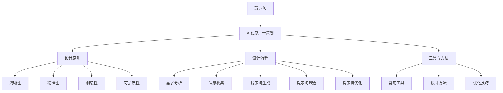

                 

### 引言

#### **1.1 书籍背景**

在当今数字营销时代，广告策划成为企业获取客户、提升品牌知名度的重要手段。随着人工智能技术的迅速发展，传统的广告策划方式正逐渐被智能化、自动化的方式所取代。其中，提示词设计作为AI创意广告策划的关键环节，正发挥着越来越重要的作用。本书籍旨在深入探讨提示词设计在AI创意广告策划中的应用，帮助广告从业者提升创意广告策划能力。

**1.1.1 问题背景**

当前，广告市场面临着激烈竞争和用户需求多样性的挑战。传统广告策划方式往往依赖于人工经验和主观判断，难以快速响应市场变化和用户需求。而AI技术的引入，为广告策划提供了新的思路和工具。通过AI算法，可以自动化生成大量创意广告，提高广告的投放效果。

**1.1.2 问题描述**

提示词设计是AI创意广告策划的核心环节，其目的是通过生成合适的提示词，引导AI算法生成具有创意性和吸引力的广告内容。然而，如何设计出高质量的提示词，使其能够有效驱动AI算法生成出色的广告创意，成为当前广告策划领域面临的重要问题。

**1.1.3 问题解决**

本书籍通过系统阐述提示词设计的基础知识、设计原则、设计流程、工具与方法，结合AI创意广告策划的实际案例，旨在为读者提供一套完整的提示词设计解决方案。通过学习本书，广告从业者可以掌握提示词设计的关键技巧，提升AI创意广告策划能力。

**1.1.4 边界与外延**

本书籍主要关注于AI创意广告策划中的提示词设计，涉及内容包括提示词的定义、分类、设计原则、流程、工具与方法等。同时，本书还探讨了AI技术在广告策划中的应用场景、优势与挑战，以及实际案例解析。通过本书的学习，读者不仅可以掌握提示词设计的基本技能，还能深入了解AI创意广告策划的整个流程。

#### **1.2 概念结构与核心要素组成**

**1.2.1 核心概念**

- **提示词**：提示词是引导AI算法生成广告内容的关键输入，具有明确的语义和意图。
- **AI创意广告策划**：利用人工智能技术，通过提示词设计、算法生成、广告优化等环节，实现广告创意的自动化策划。

**1.2.2 关键概念联系图**

以下是关键概念之间的联系图：

#### **1.3 目标读者与适用范围**

**1.3.1 目标读者**

- 广告策划从业者
- 数字营销专业人员
- 人工智能技术开发者
- 对AI创意广告策划感兴趣的读者

**1.3.2 适用范围**

- 广告策划公司
- 数字营销企业
- 人工智能技术团队
- 各类企业营销部门

#### **1.4 书籍结构与内容安排**

**1.4.1 整体结构**

本书分为三个主要部分，分别是：

1. **引言**：介绍书籍背景、问题背景、问题描述、问题解决和概念结构与核心要素组成。
2. **提示词设计基础**：详细阐述提示词的定义、分类、设计原则、设计流程、工具与方法。
3. **AI在创意广告策划中的应用**：探讨AI创意广告策划的概述、流程、工具、案例和效果评估。

**1.4.2 内容安排**

以下是各部分的具体内容安排：

1. **引言**
   - 1.1 书籍背景
     - 1.1.1 问题背景
     - 1.1.2 问题描述
     - 1.1.3 问题解决
     - 1.1.4 边界与外延
   - 1.2 概念结构与核心要素组成
     - 1.2.1 核心概念
       - 1.2.1.1 提示词
       - 1.2.1.2 AI创意广告策划
     - 1.2.2 关键概念联系图
   - 1.3 目标读者与适用范围
     - 1.3.1 目标读者
     - 1.3.2 适用范围
   - 1.4 书籍结构与内容安排
     - 1.4.1 整体结构
     - 1.4.2 内容安排
   - 1.5 本章小结

2. **提示词设计基础**
   - 2.1 提示词概述
     - 2.1.1 提示词的定义
     - 2.1.2 提示词的分类
     - 2.1.3 提示词的作用
   - 2.2 提示词设计原则
     - 2.2.1 清晰性
     - 2.2.2 精准性
     - 2.2.3 创意性
     - 2.2.4 可扩展性
   - 2.3 提示词设计流程
     - 2.3.1 需求分析
     - 2.3.2 信息收集
     - 2.3.3 提示词生成
     - 2.3.4 提示词筛选
     - 2.3.5 提示词优化
   - 2.4 提示词设计工具与方法
     - 2.4.1 常用工具介绍
     - 2.4.2 提示词设计方法
     - 2.4.3 提示词优化技巧
   - 2.5 本章小结

3. **AI在创意广告策划中的应用**
   - 3.1 AI创意广告策划概述
     - 3.1.1 AI在广告策划中的作用
     - 3.1.2 AI创意广告策划的优势
     - 3.1.3 AI创意广告策划的挑战
   - 3.2 AI创意广告策划流程
     - 3.2.1 需求分析
     - 3.2.2 创意构思
     - 3.2.3 广告文案撰写
     - 3.2.4 广告素材设计
     - 3.2.5 广告效果评估
   - 3.3 AI创意广告策划工具
     - 3.3.1 文本生成工具
     - 3.3.2 图像生成工具
     - 3.3.3 视频生成工具
     - 3.3.4 广告效果分析工具
   - 3.4 AI创意广告策划案例
     - 3.4.1 案例一：某品牌AI创意广告策划
       - 3.4.1.1 案例背景
       - 3.4.1.2 案例分析
       - 3.4.1.3 案例效果
     - 3.4.2 案例二：某电商平台AI创意广告策划
       - 3.4.2.1 案例背景
       - 3.4.2.2 案例分析
       - 3.4.2.3 案例效果
   - 3.5 本章小结

#### **1.5 本章小结**

本章首先介绍了书籍的背景、问题描述和解决方法，然后详细阐述了核心概念和书籍的整体结构。通过本章的学习，读者可以初步了解提示词设计在AI创意广告策划中的重要性，并对本书的内容安排有一个全面的了解。接下来，本书将逐步深入探讨提示词设计的具体方法和AI创意广告策划的实际应用，帮助读者掌握这一前沿技术的核心知识和技能。

### 提示词设计基础

#### **2.1 提示词概述**

提示词（Prompt）是AI创意广告策划中的核心要素，它作为输入引导AI算法生成创意广告内容。提示词的设计质量直接影响到广告的创意性和吸引力。因此，理解提示词的定义、分类和作用，是进行有效提示词设计的基础。

**2.1.1 提示词的定义**

提示词是一种简短且具有明确意图的文本或指令，用于引导AI算法进行特定任务的生成。它通常包含了广告的目标、主题、风格、情感等关键信息，是AI算法进行广告内容创作的依据。

**2.1.2 提示词的分类**

根据用途和形式，提示词可以分为以下几类：

1. **主题型提示词**：用于确定广告的主题，如“夏日促销”、“节庆活动”等。
2. **情感型提示词**：用于设定广告的情感基调，如“欢乐”、“温馨”、“激情”等。
3. **风格型提示词**：用于指定广告的风格，如“现代”、“复古”、“幽默”等。
4. **功能型提示词**：用于强调广告的功能和优势，如“高效节能”、“便捷智能”等。
5. **互动型提示词**：用于引导用户参与互动，如“点击了解更多”、“留言分享”等。

**2.1.3 提示词的作用**

提示词在AI创意广告策划中扮演着至关重要的角色，其作用主要体现在以下几个方面：

1. **引导创意生成**：提示词提供了明确的创作方向，帮助AI算法快速生成符合预期的广告内容。
2. **提高广告质量**：通过精确的提示词设计，可以确保广告内容的高质量和一致性。
3. **优化广告效果**：高质量的提示词能够提高广告的点击率、转化率和用户满意度，从而提升整体广告效果。
4. **降低创作成本**：提示词设计使得广告创作过程更加高效和自动化，减少了人工干预和创作成本。

#### **2.2 提示词设计原则**

设计高质量的提示词需要遵循以下原则：

**2.2.1 清晰性**

清晰性是提示词设计的基础，一个优秀的提示词应当明确传达广告的目标和意图。具体要求包括：

1. **明确主题**：确保提示词能够清晰地传达广告的主题，避免模糊和歧义。
2. **简洁明了**：尽量使用简短的语句，避免冗长和复杂的句子结构。
3. **逻辑连贯**：提示词中的各个部分应具有逻辑连贯性，确保广告内容的流畅性和一致性。

**2.2.2 精准性**

精准性是提示词设计的关键，提示词应能够精确地传达广告的核心信息和目标。具体要求包括：

1. **准确描述**：确保提示词中的每个词汇都能够准确地描述广告内容，避免模糊和泛泛而谈。
2. **针对目标受众**：根据广告的目标受众，设计出能够引起他们兴趣和关注的提示词。
3. **细节处理**：在提示词中包含具体的细节和关键信息，以增强广告的说服力和吸引力。

**2.2.3 创意性**

创意性是提升广告吸引力和竞争力的关键因素，一个有创意的提示词能够激发用户的兴趣和好奇心。具体要求包括：

1. **新颖独特**：设计出具有新颖独特性的提示词，避免与现有广告雷同。
2. **情感共鸣**：通过情感化的描述，引发用户的共鸣和情感反应。
3. **出人意料**：运用出人意料的手法，使提示词具有吸引力和独特性。

**2.2.4 可扩展性**

可扩展性是提示词设计的重要考量因素，一个具有良好扩展性的提示词可以适应不同的广告场景和需求。具体要求包括：

1. **通用性**：设计出具有通用性的提示词，能够适应多种广告主题和形式。
2. **可调整性**：提示词应具有一定的可调整性，可以根据不同的广告需求进行修改和优化。
3. **适应性**：提示词应能够适应不同的媒体形式和投放渠道，确保广告的多样性和灵活性。

#### **2.3 提示词设计流程**

一个完整的提示词设计流程包括以下步骤：

**2.3.1 需求分析**

需求分析是提示词设计的起点，旨在明确广告的目标和需求。具体步骤包括：

1. **确定广告目标**：明确广告的目标，如提升品牌知名度、增加销售量等。
2. **分析目标受众**：了解目标受众的需求、兴趣和行为习惯，确保提示词能够引起他们的关注。
3. **评估市场环境**：分析市场环境，包括竞争对手、行业趋势等，为提示词设计提供参考。

**2.3.2 信息收集**

信息收集是提示词设计的重要环节，旨在获取与广告相关的信息，为设计高质量的提示词提供素材。具体步骤包括：

1. **收集广告素材**：包括文案、图片、视频等，为设计提示词提供具体内容。
2. **分析市场信息**：收集和分析市场数据，了解行业动态和消费者需求。
3. **收集用户反馈**：通过调查、访谈等方式收集用户对广告的反馈，了解用户对广告内容和风格的偏好。

**2.3.3 提示词生成**

提示词生成是设计过程的核心步骤，通过创意构思和语言组织生成高质量的提示词。具体步骤包括：

1. **创意构思**：基于需求分析和信息收集，进行创意构思，构思出具有吸引力和创意性的提示词。
2. **语言组织**：运用语言技巧，将创意构思转化为简洁明了、具有感染力的提示词。
3. **多轮迭代**：对生成的提示词进行多轮迭代和优化，确保其质量。

**2.3.4 提示词筛选**

提示词筛选是确保设计出最佳提示词的过程，通过对多个候选提示词进行分析和评估，选择最适合的提示词。具体步骤包括：

1. **评估创意性**：评估提示词的创意性和独特性，确保其能够吸引目标受众的注意力。
2. **评估适用性**：评估提示词的适用性，确保其能够适用于不同的广告场景和需求。
3. **评估可扩展性**：评估提示词的可扩展性，确保其能够适应未来的广告需求。

**2.3.5 提示词优化**

提示词优化是提升提示词质量的过程，通过对提示词进行持续优化，确保其能够达到最佳效果。具体步骤包括：

1. **数据分析**：通过数据分析，了解提示词在广告中的效果，找出需要优化的问题。
2. **用户反馈**：收集用户对提示词的反馈，了解用户的喜好和需求，为优化提供依据。
3. **持续迭代**：根据数据分析结果和用户反馈，对提示词进行多轮迭代和优化，提升其质量。

#### **2.4 提示词设计工具与方法**

在提示词设计过程中，使用适当的工具和方法可以大大提升设计的效率和效果。以下是一些常用的工具和方法：

**2.4.1 常用工具介绍**

1. **自然语言处理工具**：如Google Cloud Natural Language API、OpenAI GPT-3等，用于处理和生成文本。
2. **文本编辑器**：如Notepad++、Visual Studio Code等，用于编写和编辑文本。
3. **图表工具**：如Mermaid、D3.js等，用于绘制流程图、图表等可视化内容。

**2.4.2 提示词设计方法**

1. **头脑风暴法**：通过集体讨论，激发创意，快速生成多个候选提示词。
2. **语义分析法**：通过分析关键词的语义和关联，设计出具有精准性和扩展性的提示词。
3. **用户反馈法**：通过用户调研和反馈，了解用户需求和喜好，优化提示词设计。

**2.4.3 提示词优化技巧**

1. **多轮迭代**：通过多轮迭代，不断优化提示词，提升其质量和效果。
2. **数据驱动**：通过数据分析，了解提示词的效果，为优化提供依据。
3. **用户参与**：邀请用户参与优化过程，获取真实的用户反馈，提升提示词的适用性。

#### **2.5 本章小结**

本章详细介绍了提示词的定义、分类、设计原则、设计流程、工具与方法。通过本章的学习，读者可以了解提示词在AI创意广告策划中的重要性，掌握提示词设计的基本原则和技巧。接下来，本书将深入探讨AI创意广告策划的实际应用，帮助读者了解如何将提示词设计与AI技术相结合，实现广告策划的自动化和智能化。

### AI在创意广告策划中的应用

随着人工智能（AI）技术的不断发展，AI在创意广告策划中的应用越来越广泛，成为现代广告营销的重要组成部分。AI不仅能够提高广告策划的效率，还能提升广告的创意性和效果。本节将详细探讨AI在创意广告策划中的应用，包括其作用、优势、挑战以及实际应用案例。

#### **3.1.1 AI在广告策划中的作用**

AI在广告策划中扮演着多种重要角色，主要包括：

1. **数据分析**：AI能够对海量数据进行分析，提取有价值的信息，为广告策划提供数据支持。
2. **创意生成**：通过深度学习和自然语言处理技术，AI能够自动生成创意广告文案和设计。
3. **优化投放**：AI可以根据用户行为和反馈，实时优化广告投放策略，提高广告效果。
4. **个性化推荐**：AI可以根据用户画像和行为，为用户提供个性化的广告推荐，提升用户体验。

#### **3.1.2 AI创意广告策划的优势**

AI创意广告策划相比传统方式具有显著的优势：

1. **高效性**：AI能够快速处理大量数据，自动生成广告内容，大大提高了广告策划的效率。
2. **创意性**：AI算法能够生成新颖独特的广告创意，超越人类的创造力，提高广告的吸引力。
3. **个性化**：AI可以根据用户行为和偏好，实现广告的个性化推荐，提高广告的转化率。
4. **精准性**：AI通过数据分析，能够精准定位目标受众，提高广告的投放效果。

#### **3.1.3 AI创意广告策划的挑战**

尽管AI创意广告策划具有众多优势，但同时也面临着一些挑战：

1. **数据隐私**：广告策划需要大量用户数据，数据隐私保护成为重要的挑战。
2. **算法偏见**：AI算法可能存在偏见，导致广告内容的公平性和准确性受到影响。
3. **技术门槛**：AI创意广告策划需要专业的技术支持，对广告从业者的技术能力提出了更高要求。
4. **用户体验**：过于机械和同质化的广告内容可能影响用户体验，需要平衡创意性和实用性。

#### **3.2 AI创意广告策划流程**

AI创意广告策划通常包括以下几个关键步骤：

**3.2.1 需求分析**

需求分析是整个广告策划流程的起点，旨在明确广告的目标、受众和需求。具体步骤包括：

1. **确定广告目标**：明确广告的目标，如品牌推广、产品销售、用户转化等。
2. **分析目标受众**：了解目标受众的年龄、性别、兴趣、行为等特征，为广告策划提供参考。
3. **评估市场环境**：分析市场环境，包括竞争对手、行业趋势等，为广告策划提供数据支持。

**3.2.2 创意构思**

创意构思是AI广告策划的核心环节，旨在生成具有创意性和吸引力的广告内容。具体步骤包括：

1. **收集创意素材**：通过头脑风暴、市场调研等方式，收集各种创意素材。
2. **生成初步创意**：利用AI算法，生成初步的创意广告文案和设计。
3. **创意筛选与优化**：对初步创意进行筛选和优化，确保其符合广告目标和受众需求。

**3.2.3 广告文案撰写**

广告文案撰写是将创意转化为具体广告内容的步骤。具体步骤包括：

1. **撰写广告文案**：根据创意构思，撰写具有吸引力和说服力的广告文案。
2. **多轮修改**：对广告文案进行多轮修改和优化，确保其质量和效果。
3. **审核与发布**：对广告文案进行审核，确保其符合广告法规和公司要求，然后发布广告。

**3.2.4 广告素材设计**

广告素材设计包括图像、视频、音频等元素的创作和设计。具体步骤包括：

1. **设计广告素材**：根据广告文案，设计相应的广告素材，如图片、视频、动画等。
2. **素材优化**：对广告素材进行优化，确保其质量和效果符合广告目标。
3. **素材组合**：将不同类型的广告素材进行组合，形成完整的广告作品。

**3.2.5 广告效果评估**

广告效果评估是对广告投放效果进行评估和反馈的过程。具体步骤包括：

1. **数据收集**：收集广告投放相关的数据，如点击率、转化率、用户反馈等。
2. **数据分析**：对收集到的数据进行分析，了解广告的效果和用户反馈。
3. **效果优化**：根据数据分析结果，对广告进行优化，提升其效果。

#### **3.3 AI创意广告策划工具**

AI创意广告策划需要使用一系列工具，以下是一些常用的工具：

1. **文本生成工具**：如OpenAI GPT-3、百度文心等，用于生成广告文案。
2. **图像生成工具**：如DeepArt、DeepDream等，用于生成创意广告图像。
3. **视频生成工具**：如AI Video Studio、Magisto等，用于生成创意广告视频。
4. **广告效果分析工具**：如Google Analytics、百度统计等，用于分析广告投放效果。

#### **3.4 AI创意广告策划案例**

**3.4.1 案例一：某品牌AI创意广告策划**

**案例背景**：某知名品牌为了提升品牌知名度和产品销量，决定利用AI技术进行创意广告策划。

**案例分析**：

1. **需求分析**：通过市场调研，确定广告目标为提升品牌知名度，目标受众为年轻人。
2. **创意构思**：利用AI文本生成工具，生成初步的创意广告文案。
3. **广告文案撰写**：对初步文案进行多轮修改和优化，确保其具有吸引力和说服力。
4. **广告素材设计**：设计创意广告图像和视频，确保其与广告文案相匹配。
5. **广告投放与优化**：通过AI广告效果分析工具，实时监测广告效果，进行广告优化。

**案例效果**：通过AI创意广告策划，该品牌成功提升了品牌知名度和产品销量，广告效果显著提升。

**3.4.2 案例二：某电商平台AI创意广告策划**

**案例背景**：某电商平台为了吸引更多用户和提升转化率，决定利用AI技术进行创意广告策划。

**案例分析**：

1. **需求分析**：通过用户数据分析和市场调研，确定广告目标为提升用户转化率和增加销售额。
2. **创意构思**：利用AI图像生成工具，生成创意广告图像。
3. **广告文案撰写**：撰写具有吸引力的广告文案，引导用户进行购买。
4. **广告素材设计**：设计创意广告视频，提高用户的购买欲望。
5. **广告投放与优化**：通过AI广告效果分析工具，实时监测广告效果，进行广告优化。

**案例效果**：通过AI创意广告策划，该电商平台成功提升了用户转化率和销售额，广告效果显著提升。

#### **3.5 本章小结**

本章详细探讨了AI在创意广告策划中的应用，包括其作用、优势、挑战以及实际应用案例。通过本章的学习，读者可以了解AI创意广告策划的基本流程和关键工具，掌握如何利用AI技术提升广告策划的效率和效果。接下来，本书将深入探讨具体案例，帮助读者更好地理解和应用AI创意广告策划的实践技巧。

