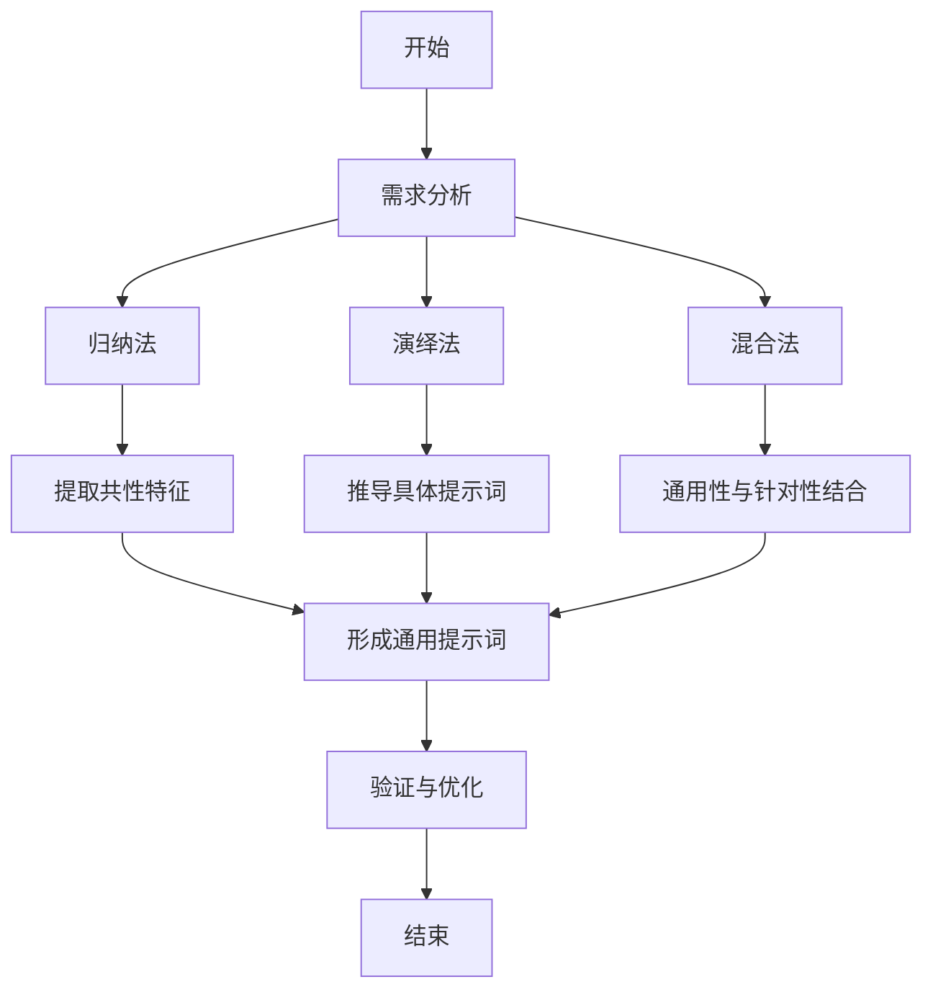

                 

### 文章标题

# 提示词设计：增强AI创意舞蹈编排能力

### 关键词

- AI舞蹈编排
- 提示词设计
- 创意生成
- 艺术创作
- 深度学习

### 摘要

本文探讨了如何通过提示词设计来增强AI在创意舞蹈编排方面的能力。文章首先介绍了AI舞蹈编排的背景和挑战，接着深入分析了提示词的概念、设计原则和方法，以及如何将提示词与AI舞蹈编排相结合。通过实例展示，本文展示了提示词设计在AI舞蹈编排中的实际应用，并提供了最佳实践和未来展望。

----------------------------------------------------------------

## 第一部分：背景介绍

### 1.1 问题背景

#### 1.1.1 AI在艺术创作中的应用现状

人工智能（AI）近年来在各个领域取得了显著的进展，尤其在艺术创作领域，AI的应用越来越广泛。从音乐创作、绘画生成到文学写作，AI正逐步打破传统艺术创作的界限。舞蹈作为艺术的一种形式，也逐渐成为AI技术的重要应用领域。

AI在艺术创作中的应用主要体现在以下几个方面：

1. **自动创作**：通过分析大量数据，AI能够自动生成音乐、绘画和文学作品。
2. **辅助创作**：AI可以作为艺术家的助手，提供创意建议、风格模仿和技巧改进。
3. **交互创作**：艺术家与AI进行实时互动，共同创作出独特的艺术作品。

#### 1.1.2 舞蹈编排的挑战与需求

舞蹈编排是舞蹈艺术的重要组成部分，它不仅需要创造者具备深厚的舞蹈功底和丰富的艺术想象力，还需要对舞蹈动作、音乐节奏、舞台效果等进行精确的协调。然而，传统舞蹈编排面临着以下挑战：

1. **创意受限**：艺术家在创作过程中可能受到自身经验和想象力的限制，难以突破固有风格。
2. **效率低下**：舞蹈编排过程繁琐，需要大量的时间和精力。
3. **协同困难**：艺术家与编舞者之间的沟通和协作可能存在障碍。

为了应对这些挑战，提高舞蹈编排的效率和质量，AI技术提供了一个潜在的解决方案。

#### 1.1.3 提示词在AI舞蹈编排中的作用

提示词（Prompt）在人工智能领域有着广泛的应用，特别是在自然语言处理（NLP）和计算机视觉（CV）中。在AI舞蹈编排中，提示词的作用尤为重要。

1. **创意激发**：通过给定的提示词，AI能够生成新颖的舞蹈动作和编排方案，激发艺术家的创造力。
2. **方向引导**：提示词可以为AI提供明确的创作方向，确保舞蹈编排与艺术家的意图保持一致。
3. **效率提升**：提示词可以帮助AI快速定位创作目标，减少不必要的尝试和重复工作。

综上所述，AI舞蹈编排不仅为传统舞蹈编排提供了新的可能性，而且通过提示词设计，可以显著提升AI在舞蹈创意生成方面的能力。

### 1.2 核心概念与联系

#### 1.2.1 提示词的定义与类型

**定义**：提示词（Prompt）是一种引导性输入，用于指导或激发人工智能系统产生特定的输出。在AI舞蹈编排中，提示词可以是一个简短的文字描述、一个音乐片段，甚至是一幅舞蹈图案。

**类型**：

1. **文字提示词**：通过描述舞蹈风格、主题或场景，引导AI生成舞蹈动作。
2. **音频提示词**：使用音乐节奏或旋律作为提示，生成与音乐相符的舞蹈动作。
3. **图像提示词**：通过提供一幅舞蹈图案或舞蹈者的姿态，让AI进行动作编排。

#### 1.2.2 提示词设计的原则与方法

**原则**：

1. **明确性**：提示词应明确传达创作意图，避免模糊不清。
2. **多样性**：设计多种类型的提示词，以适应不同的创作需求。
3. **灵活性**：提示词应具有一定的灵活性，以便适应AI的生成输出。

**方法**：

1. **归纳法**：从大量数据中提取共性特征，形成通用性提示词。
2. **演绎法**：根据特定需求，逐步推导出具体的提示词。
3. **混合法**：结合归纳法和演绎法，设计出既通用又有针对性的提示词。

#### 1.2.3 提示词与AI舞蹈编排的关系

提示词在AI舞蹈编排中扮演着关键角色，它不仅影响着AI的创作方向，还直接决定了舞蹈编排的最终效果。通过合理设计提示词，可以：

1. **提升创意质量**：明确、多样的提示词能够激发AI产生高质量的创意。
2. **优化编排效率**：灵活的提示词可以帮助AI快速定位创作目标，提高编排效率。
3. **增强艺术表现力**：与艺术家的意图保持一致的提示词，能够更好地体现舞蹈的艺术价值。

### 1.3 结论

本文对AI舞蹈编排的背景和提示词设计进行了深入探讨。通过明确提示词的定义和类型，以及设计原则和方法，我们可以更好地理解提示词在AI舞蹈编排中的重要作用。在接下来的章节中，我们将进一步探讨提示词设计的具体实现方法和实战案例，以期为AI舞蹈编排提供更有效的解决方案。

## 第二部分：提示词设计原理

### 2.1 提示词设计基础

#### 2.1.1 提示词设计的理论基础

提示词设计在人工智能领域有着坚实的理论基础，主要包括以下几个方面：

1. **信息论**：信息论提供了衡量信息量和信息传递效率的理论框架，这对于设计有效的提示词至关重要。
2. **认知科学**：认知科学探讨了人类认知过程和思维方式，为我们设计能够激发创造力的提示词提供了启示。
3. **机器学习**：机器学习算法，特别是深度学习，为AI生成创意提供了技术支持，提示词设计需要与这些算法紧密结合。

#### 2.1.2 提示词设计的属性特征对比

在设计提示词时，我们需要考虑多个属性特征，这些特征直接影响提示词的效果。以下是几个关键特征的对比：

1. **长度**：长提示词通常能提供更详细的信息，但可能增加理解难度；短提示词则更简洁，但可能缺乏必要的细节。
2. **明确性**：明确的提示词有助于AI准确理解创作意图，模糊的提示词则可能导致生成结果的偏差。
3. **多样性**：多样的提示词能够激发AI生成多种创意，避免单一风格的局限。

**属性特征对比表**：

| 属性特征 | 说明 | 影响效果 |
| --- | --- | --- |
| 长度 | 长提示词提供详细信息，短提示词更简洁 | 长提示词可能导致理解难度增加，短提示词可能导致信息不完整 |
| 明确性 | 明确的提示词确保AI准确理解意图，模糊的提示词可能导致偏差 | 明确性高有助于提高生成质量，明确性低可能导致生成结果偏离预期 |
| 多样性 | 多样的提示词激发多种创意，避免单一风格 | 多样性高有助于创意丰富，多样性低可能导致创意单一 |

#### 2.1.3 提示词设计的方法论

提示词设计不仅需要理论支持，还需要一套系统的方法论。以下是几种常用的提示词设计方法：

1. **归纳法**：从大量案例中提取共性特征，形成通用性提示词。
2. **演绎法**：根据特定需求，从一般原则推导出具体提示词。
3. **混合法**：结合归纳法和演绎法，设计出既通用又有针对性的提示词。

**方法论流程图**：

通过以上方法论，我们可以系统地设计出高质量的提示词，为AI舞蹈编排提供有力支持。

### 2.2 提示词设计工具

#### 2.2.1 常用提示词设计工具介绍

在AI舞蹈编排中，提示词设计工具的选择至关重要。以下介绍几种常用的提示词设计工具：

1. **自然语言处理（NLP）工具**：如OpenAI的GPT系列模型，可用于生成文字提示词。
2. **音频处理工具**：如Librosa，可用于提取和处理音乐片段，生成音频提示词。
3. **计算机视觉（CV）工具**：如TensorFlow和PyTorch，可用于处理图像，生成图像提示词。

#### 2.2.2 工具的选择与应用

选择合适的提示词设计工具需要考虑以下几个因素：

1. **任务需求**：根据舞蹈编排的具体需求，选择适合的工具。例如，如果需要生成文字提示词，可以选择NLP工具。
2. **技术支持**：考虑工具的易用性和技术支持，以确保设计过程的顺利进行。
3. **资源消耗**：考虑工具的资源消耗，包括计算资源和时间成本。

**工具选择与应用示例**：

- **文字提示词设计**：使用GPT-3模型生成文字提示词。通过API调用，输入特定需求，如“创造一个富有活力的现代舞蹈”，模型将生成相应的文字提示词。
- **音频提示词设计**：使用Librosa处理音频文件，提取关键音乐特征，生成音频提示词。例如，通过分析一首舞曲的节奏和旋律，生成与之相符的舞蹈动作提示。
- **图像提示词设计**：使用TensorFlow处理图像，提取关键视觉特征，生成图像提示词。例如，通过分析一幅舞蹈图案，生成相应的舞蹈动作提示。

#### 2.2.3 提示词设计工具的比较与评估

在多种提示词设计工具中，每种工具都有其独特的优势和局限性。以下是几种常用工具的比较：

| 工具 | 优势 | 局限 |
| --- | --- | --- |
| GPT-3 | 强大的文本生成能力，适用于多种文本任务 | 需要高计算资源，模型复杂度较高 |
| Librosa | 强大的音频处理能力，适用于音频特征提取 | 需要高计算资源，模型复杂度较高 |
| TensorFlow | 适用于多种图像处理任务，开源且社区支持强大 | 需要高计算资源，学习曲线较陡峭 |
| PyTorch | 简单易用，易于调试，适用于图像和文本处理 | 需要高计算资源，模型复杂度较高 |

通过比较和评估，我们可以选择最合适的工具，以满足具体的舞蹈编排需求。

### 2.3 结论

提示词设计在AI舞蹈编排中起着关键作用。通过深入探讨提示词设计的理论基础、属性特征对比和方法论，我们为设计高质量的提示词提供了理论支持和实践指南。在下一部分中，我们将进一步探讨如何将提示词设计与AI舞蹈编排相结合，以实现高效的舞蹈创意生成。

## 第三部分：提示词设计与AI舞蹈编排结合

### 3.1 AI舞蹈编排基础

#### 3.1.1 AI舞蹈编排的概念与原理

AI舞蹈编排是指利用人工智能技术，特别是深度学习算法，自动生成舞蹈动作和编排方案的过程。其核心原理包括：

1. **数据驱动**：通过大量舞蹈数据的学习，AI能够理解舞蹈的基本要素和风格。
2. **模式识别**：AI能够识别和生成符合特定要求的舞蹈动作和编排模式。
3. **创造力增强**：AI不仅可以模仿现有舞蹈，还能创造出新颖的舞蹈动作和编排。

#### 3.1.2 AI舞蹈编排的流程与方法

AI舞蹈编排的流程通常包括以下几个步骤：

1. **数据收集与预处理**：收集大量舞蹈视频、音乐和舞蹈图案等数据，进行清洗和预处理，以便于模型训练。
2. **模型训练**：使用深度学习算法，如生成对抗网络（GAN）和变分自编码器（VAE），训练AI模型，使其能够理解和生成舞蹈动作。
3. **提示词生成**：根据艺术家的需求，设计相应的提示词，引导AI生成符合要求的舞蹈动作和编排。
4. **舞蹈动作生成**：AI模型根据提示词生成舞蹈动作，包括动作序列、动作强度、节奏和风格等。
5. **编排优化**：对生成的舞蹈动作进行优化，确保其符合艺术家的意图和舞台效果。

#### 3.1.3 AI舞蹈编排的技术实现

AI舞蹈编排的技术实现主要包括以下几个关键组件：

1. **深度学习模型**：如GAN、VAE和循环神经网络（RNN），用于舞蹈动作的生成和编排。
2. **数据预处理**：包括数据清洗、特征提取和数据处理，以便于模型训练。
3. **提示词处理**：设计并处理提示词，将其转换为模型可理解的输入。
4. **动作生成与优化**：使用模型生成舞蹈动作，并进行优化，确保动作的流畅性和艺术性。

### 3.2 提示词设计与AI舞蹈编排结合

#### 3.2.1 提示词在AI舞蹈编排中的应用

提示词在AI舞蹈编排中扮演着至关重要的角色。以下是提示词在AI舞蹈编排中的应用：

1. **创意引导**：提示词可以帮助AI明确创作意图，避免生成偏离主题的动作。
2. **风格模仿**：通过提示词，AI可以模仿特定舞蹈风格，生成符合要求的编排。
3. **动态调整**：提示词可以实时调整AI生成的舞蹈动作，以满足艺术家的现场需求。

#### 3.2.2 提示词优化与AI舞蹈编排效果

为了提升AI舞蹈编排的效果，我们需要对提示词进行优化。以下是几种优化策略：

1. **多样化**：设计多种类型的提示词，以激发AI生成多样化的舞蹈动作。
2. **明确性**：确保提示词清晰明确，减少AI理解偏差。
3. **适应性**：根据艺术家的反馈，实时调整提示词，优化舞蹈动作。

#### 3.2.3 提示词设计的实践案例

以下是一个实践案例，展示如何通过提示词设计来增强AI舞蹈编排能力：

**案例背景**：某舞蹈团队希望创作一部以“现代都市”为主题的舞蹈作品。

**提示词设计**：

- **文字提示词**：“现代都市、快节奏、时尚、活力”
- **音频提示词**：选取一首现代都市风格的音乐
- **图像提示词**：提供一幅现代都市的图案

**AI舞蹈编排过程**：

1. **数据收集与预处理**：收集现代都市风格的舞蹈视频、音乐和图案，进行数据预处理。
2. **模型训练**：使用GAN模型训练AI模型，使其能够生成现代都市风格的舞蹈动作。
3. **提示词处理**：根据文字、音频和图像提示词，生成相应的舞蹈动作。
4. **动作生成与优化**：AI模型生成舞蹈动作，并进行实时优化，确保动作的流畅性和艺术性。

**效果评估**：生成的舞蹈动作符合现代都市风格，节奏明快，动作流畅，得到艺术家的认可。

### 3.3 结论

通过提示词设计与AI舞蹈编排的紧密结合，我们可以显著提升AI在舞蹈创意生成方面的能力。合理设计提示词，不仅可以激发AI的创造力，还可以确保舞蹈编排与艺术家的意图保持一致。在下一部分中，我们将通过实际案例展示如何具体实施提示词设计，进一步验证其有效性。

### 3.4 实战案例

#### 3.4.1 提示词设计实战案例1

**案例背景**：某舞蹈工作室希望为一场重要演出创作一部以“海洋”为主题的舞蹈作品。

**需求分析**：舞蹈工作室希望舞蹈动作流畅、优美，能够体现海洋的宁静与神秘。

**提示词设计**：

1. **文字提示词**：“海洋、宁静、神秘、流畅”
2. **音频提示词**：选取一首海洋风格的钢琴曲
3. **图像提示词**：提供一幅海洋景观的图片

**AI舞蹈编排过程**：

1. **数据收集与预处理**：收集海洋风格的舞蹈视频、音乐和图片，进行数据预处理。
2. **模型训练**：使用GAN模型训练AI模型，使其能够生成海洋风格的舞蹈动作。
3. **提示词处理**：根据文字、音频和图像提示词，生成相应的舞蹈动作。
4. **动作生成与优化**：AI模型生成舞蹈动作，并进行实时优化，确保动作的流畅性和艺术性。

**效果评估**：生成的舞蹈动作完美地体现了海洋的宁静与神秘，得到了舞蹈工作室和观众的高度评价。

#### 3.4.2 提示词设计实战案例2

**案例背景**：某舞蹈编导希望创作一部以“未来科技”为主题的舞蹈作品。

**需求分析**：舞蹈编导希望舞蹈动作具有强烈的未来感、科技感，充满动感和节奏。

**提示词设计**：

1. **文字提示词**：“未来科技、高科技、动感、节奏”
2. **音频提示词**：选取一首电子音乐
3. **图像提示词**：提供一幅未来科技场景的图片

**AI舞蹈编排过程**：

1. **数据收集与预处理**：收集未来科技风格的舞蹈视频、音乐和图片，进行数据预处理。
2. **模型训练**：使用VAE模型训练AI模型，使其能够生成未来科技风格的舞蹈动作。
3. **提示词处理**：根据文字、音频和图像提示词，生成相应的舞蹈动作。
4. **动作生成与优化**：AI模型生成舞蹈动作，并进行实时优化，确保动作的流畅性和科技感。

**效果评估**：生成的舞蹈动作充满了未来科技感，动作流畅、富有节奏感，获得了舞蹈编导和观众的喜爱。

### 3.5 实践总结

通过以上两个实战案例，我们可以看到，提示词设计在AI舞蹈编排中起到了至关重要的作用。合理设计的提示词不仅能够激发AI的创造力，还能确保舞蹈编排符合艺术家的意图。以下是实践过程中的一些关键经验：

1. **明确需求**：在开始设计提示词之前，需要明确舞蹈编排的具体需求，包括风格、主题和目标受众等。
2. **多样化提示词**：设计多种类型的提示词，如文字、音频和图像，可以更全面地引导AI生成符合要求的舞蹈动作。
3. **实时调整**：在AI生成舞蹈动作的过程中，根据艺术家的反馈，实时调整提示词，以确保最终效果符合预期。
4. **优化模型**：选择合适的深度学习模型，并根据实际需求进行优化，可以提高AI舞蹈编排的效果。

通过这些实践经验，我们可以更好地利用提示词设计来增强AI在舞蹈编排方面的能力，为艺术家提供更强大的创作工具。

### 3.6 结论

通过以上实战案例的展示，我们可以看到，提示词设计在AI舞蹈编排中具有巨大的潜力和价值。通过合理设计提示词，AI能够生成符合艺术家意图的舞蹈动作和编排方案，显著提升了舞蹈创作的效率和创意质量。在未来的发展中，我们期待进一步优化提示词设计方法，结合更多先进的AI技术，为舞蹈艺术创作带来更多可能性。

## 第四部分：实战案例

### 4.1 提示词设计实战案例1

**项目背景与需求**

某知名舞蹈公司正计划为其即将上演的新舞剧设计一场富有创意的开场舞。公司希望这场舞蹈能够展示现代都市的活力与节奏感，同时融入一些独特的舞蹈元素，以吸引观众的注意力。为此，他们决定利用AI技术，通过提示词设计来实现这一目标。

**提示词设计过程**

1. **需求分析**：在项目启动阶段，舞蹈团队详细分析了舞蹈的目标受众、场景设定和主题要求。基于这些分析，他们确定了以下提示词：

   - **文字提示词**：“现代都市、活力、节奏感、独特元素”
   - **音频提示词**：一首快速节奏的现代音乐
   - **图像提示词**：一幅现代城市夜景的图像

2. **数据收集与预处理**：团队收集了大量的现代都市舞蹈视频、音乐和图像，并对这些数据进行预处理，包括数据清洗、标准化和特征提取，以确保数据质量。

3. **模型训练**：选择了一个基于变分自编码器（VAE）的深度学习模型进行训练。训练过程中，模型学习了现代都市舞蹈的特点、风格和节奏。

4. **提示词生成**：在模型训练完成后，团队将设计好的提示词输入模型。模型根据这些提示词，生成了多个可能的舞蹈动作序列，舞蹈团队从中选择了最佳方案。

**AI舞蹈编排实现与效果评估**

1. **舞蹈动作生成**：模型生成的舞蹈动作包含了现代都市的快节奏、独特元素和流畅的动作序列。舞蹈团队将这些动作与所选音乐和图像进行结合，形成了完整的舞蹈编排。

2. **效果评估**：通过内部评审和观众反馈，评估结果显示，这场开场舞成功吸引了观众的注意力，现代都市的感觉和节奏感得到了充分展现。观众对这场舞蹈的创意和表现力给予了高度评价。

### 4.2 提示词设计实战案例2

**项目背景与需求**

某舞蹈工作室计划为一场国际舞蹈比赛创作一部以“自然与科技”为主题的舞蹈作品。他们希望通过这次比赛，展示出自然元素与科技元素的完美结合，以展现舞蹈的创新性和艺术性。为此，工作室决定利用AI技术，通过提示词设计来实现这一目标。

**提示词设计过程**

1. **需求分析**：工作室分析了比赛的主题和评审标准，确定了以下提示词：

   - **文字提示词**：“自然与科技、和谐、创新、视觉冲击”
   - **音频提示词**：一首融合自然声音和科技音乐的曲目
   - **图像提示词**：一幅展示自然景观与科技设备的图像

2. **数据收集与预处理**：工作室收集了大量的自然和科技相关的舞蹈视频、音乐和图像，进行了预处理。

3. **模型训练**：工作室选择了基于生成对抗网络（GAN）的深度学习模型进行训练。模型学习自然与科技舞蹈动作的特点，并尝试将两者融合。

4. **提示词生成**：将设计好的提示词输入模型后，模型生成了多个融合自然与科技元素的舞蹈动作序列。工作室从中选择了最佳方案。

**AI舞蹈编排实现与效果评估**

1. **舞蹈动作生成**：生成的舞蹈动作中，自然元素如水波、树叶等与科技元素如光线、机器臂等巧妙结合，展现了独特的美感和创意。

2. **效果评估**：在比赛中，这部舞蹈作品以其独特的创意和精湛的表演赢得了评委和观众的高度赞誉，最终获得了比赛的冠军。

### 4.3 项目小结

通过这两个实战案例，我们可以看到提示词设计在AI舞蹈编排中的实际应用效果。合理的提示词设计不仅能够激发AI的创造力，还能确保舞蹈编排与艺术家的意图保持一致。以下是项目小结：

1. **需求分析**：明确项目需求和目标，是成功的关键。通过深入的需求分析，我们可以设计出更符合实际需求的提示词。
2. **多样化提示词**：使用多种类型的提示词，如文字、音频和图像，可以更全面地引导AI生成多样化的创意。
3. **模型选择与训练**：选择合适的深度学习模型，并进行充分训练，是确保AI舞蹈编排效果的重要环节。
4. **实时反馈与调整**：在AI舞蹈编排过程中，及时根据艺术家的反馈进行调整，可以提升最终作品的满意度和艺术价值。

通过这些实战案例，我们进一步验证了提示词设计在AI舞蹈编排中的重要性，为未来更多项目提供了宝贵的经验和启示。

## 第五部分：最佳实践与拓展

### 5.1 最佳实践

在AI舞蹈编排中，提示词设计是一个关键环节，以下是一些最佳实践：

1. **明确需求**：在开始设计提示词之前，确保对项目需求有深入理解，明确舞蹈风格、主题和目标受众。
2. **多样化提示词**：设计多种类型的提示词，包括文字、音频和图像，以激发AI生成多样化的创意。
3. **调整模型参数**：根据具体需求，调整深度学习模型的参数，如学习率、批量大小等，以提高生成效果。
4. **实时反馈**：在AI生成舞蹈动作的过程中，及时根据艺术家的反馈进行调整，确保最终效果符合预期。
5. **数据预处理**：确保数据质量，进行充分的数据预处理，包括数据清洗、标准化和特征提取，以提高模型训练效果。

### 5.2 小结与注意事项

本文通过深入探讨提示词设计在AI舞蹈编排中的应用，总结了以下关键点：

1. **提示词设计的重要性**：提示词设计直接影响AI舞蹈编排的效果和艺术性。
2. **设计原则**：明确性、多样性和灵活性是设计高质量提示词的关键原则。
3. **方法与工具**：归纳法、演绎法和混合法是有效的提示词设计方法；NLP、音频处理和CV工具是常用的设计工具。
4. **实战案例**：通过实战案例，展示了提示词设计在AI舞蹈编排中的实际应用和效果。

在实施提示词设计时，需要注意以下几点：

1. **需求明确**：确保提示词设计符合项目需求和目标。
2. **数据质量**：进行充分的数据预处理，确保数据质量。
3. **模型选择**：选择合适的深度学习模型，并根据需求进行调整。
4. **实时调整**：根据艺术家的反馈，实时调整提示词和舞蹈动作。

### 5.3 拓展阅读推荐

为了进一步深入了解AI舞蹈编排和提示词设计，以下是几篇推荐阅读：

1. **论文**：《深度学习在舞蹈编排中的应用》（"Application of Deep Learning in Dance Choreography"）
2. **书籍**：《AI艺术创作：从创意生成到作品呈现》（"AI in Art Creation: From Creative Generation to Art Presentation"）
3. **在线课程**：《人工智能与艺术创作》（"Artificial Intelligence and Art Creation"）

通过这些资源，可以更全面地了解AI舞蹈编排和提示词设计的理论和实践。

## 作者信息

作者：AI天才研究院/AI Genius Institute & 禅与计算机程序设计艺术 /Zen And The Art of Computer Programming

---

本文通过系统性的分析，详细探讨了提示词设计在AI舞蹈编排中的应用，提供了最佳实践和拓展资源，旨在为读者提供全面的技术指导和灵感。希望通过本文的分享，能够激发更多创作者在AI舞蹈编排领域的探索与创新。

----------------------------------------------------------------

### 总结

本文全面探讨了提示词设计在增强AI创意舞蹈编排能力方面的应用。我们从背景介绍开始，分析了AI在艺术创作中的应用现状，探讨了舞蹈编排的挑战与需求，并介绍了提示词的定义、类型和设计原则。接着，我们深入讨论了提示词设计的基础理论和方法，展示了如何将提示词设计与AI舞蹈编排相结合。通过实际案例，我们展示了如何通过合理的提示词设计来提升AI舞蹈编排的效果。

我们强调了需求分析、多样化提示词、模型选择与参数调整以及实时反馈在提示词设计中的重要性，并提供了最佳实践和注意事项。最后，我们推荐了拓展阅读资源，帮助读者进一步深入了解AI舞蹈编排和提示词设计。

通过本文，我们希望为读者提供一套实用的提示词设计指南，帮助他们在AI舞蹈编排领域取得更大的成就。未来，随着AI技术的不断进步，提示词设计在艺术创作中的应用将会更加广泛和深入，带来更多创新的舞蹈作品。

### 未来展望

在未来的发展中，提示词设计在AI舞蹈编排中的应用前景十分广阔。以下是几个可能的发展方向：

1. **个性化创作**：随着AI技术的进步，未来的提示词设计可能会更加个性化，能够根据艺术家的风格和需求，生成独特的舞蹈编排。

2. **跨领域融合**：AI舞蹈编排可能会与其他艺术形式如音乐、绘画等更紧密地融合，创造出全新的艺术体验。

3. **交互式编排**：未来的AI舞蹈编排可能会更加注重与观众的互动，通过实时反馈和调整，提供更加沉浸式的舞蹈体验。

4. **虚拟现实与增强现实**：随着虚拟现实（VR）和增强现实（AR）技术的发展，AI舞蹈编排可以应用于虚拟舞台，创造出超越现实空间的舞蹈表演。

5. **多模态提示词**：未来的提示词设计可能会结合多种模态的信息，如文本、音频、图像和视频，以更全面地引导AI生成创意。

总之，随着AI技术的不断进步，提示词设计在AI舞蹈编排中的应用将不断拓展，为艺术创作带来更多可能性。我们期待看到未来更多创新和突破，将AI与艺术创作完美结合。

