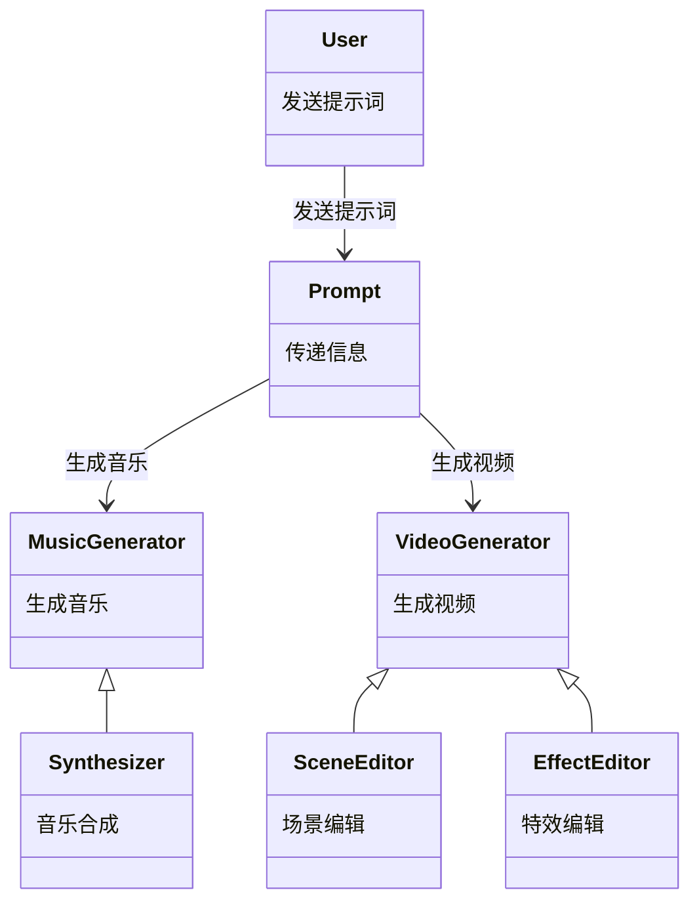
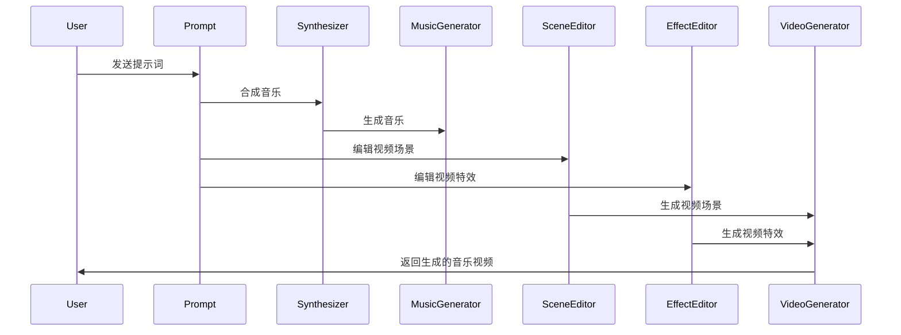
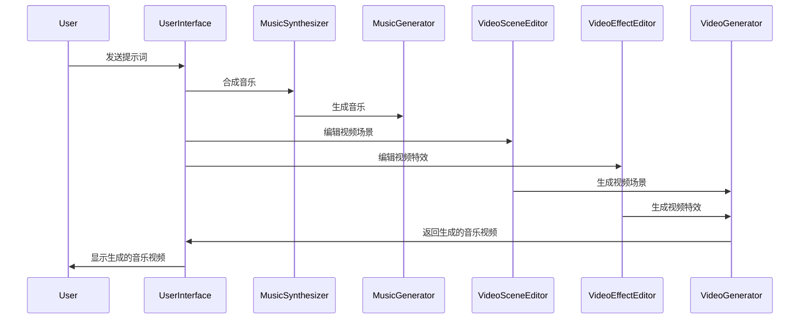

                 


# 第2章 核心概念与联系

## 2.1 核心概念原理

在本章中，我们将深入探讨与AI创意音乐视频生成相关的核心概念。这些概念不仅构成了我们的研究框架，也是理解整个问题的基础。

### 2.1.1 提示词

提示词（Prompt）是AI生成音乐视频的重要输入。它是一段文本或语音信息，用于指导AI在生成过程中遵循特定的方向。提示词可以是简单的关键词，也可以是复杂的句子，甚至可以是整段故事或场景描述。

### 2.1.2 AI音乐视频生成

AI音乐视频生成是通过人工智能技术自动生成音乐和视频内容的过程。这通常涉及到音乐生成、视频合成以及两者之间的同步。

### 2.1.3 创意

创意（Creativity）在音乐视频中是指独特的、有吸引力的元素。它可能体现在旋律、歌词、画面、剪辑等方面，是区分普通视频和高质量视频的关键。

### 2.1.4 提示词设计

提示词设计（Prompt Design）是创造和优化提示词的过程。这包括确定合适的提示词类型、长度、复杂度等，以最大化AI生成创意音乐视频的能力。

## 2.2 概念属性特征对比表格

为了更好地理解这些核心概念，我们提供了一个对比表格，展示它们的主要属性特征。

| 概念           | 定义                                                         | 属性特征                                                         |
| -------------- | ------------------------------------------------------------ | ------------------------------------------------------------ |
| 提示词         | 引导AI生成音乐视频的文本或语音信息                           | 类型：文本、语音；长度：短至长；复杂度：简单至复杂；目的：引导生成创意音乐视频 |
| AI音乐视频生成 | 利用人工智能技术自动生成音乐和视频内容的过程                 | 技术基础：机器学习、深度学习；过程：音乐生成、视频合成；结果：创意音乐视频 |
| 创意           | 音乐视频中独特的、有吸引力的元素                             | 表现形式：旋律、歌词、画面、剪辑；作用：提升视频质量；特点：独特性、吸引力 |
| 提示词设计     | 创造和优化提示词的过程                                       | 设计原则：清晰性、相关性、多样性；设计工具：文本编辑器、语音合成器；目标：增强AI生成能力 |

## 2.3 ER实体关系图架构

为了更直观地理解这些概念之间的关系，我们使用ER（实体-关系）图来展示它们之间的联系。

```mermaid
erDiagram
    Aedge(Author) ||-->|{ Book }|| BTitle(Title)
    Aedge ||-->|{ PublishDate }|| BDate(Date)
    Aedge ||-->|{ Publisher }|| BPublisher(Publisher)
    Aedge ||-->|{ Category }|| BCategory(Category)
```

在上面的ER图中，我们定义了四个主要实体：作者（Author）、标题（Title）、出版日期（Date）和出版社（Publisher）。这些实体之间的关系包括：作者撰写了某本书（Aedge），这本书有一个标题（BTitle）、一个出版日期（BDate）和一个出版社（BPublisher）。此外，这本书属于一个类别（BCategory），而这个类别也可能包含其他书籍。

通过这个ER图，我们可以更清晰地看到不同概念之间的关联，以及它们在整体架构中的作用。这为后续章节的分析提供了坚实的基础。

## 2.4 核心概念与音乐视频生成的关系

### 2.4.1 提示词与音乐视频生成

提示词是音乐视频生成过程中的关键输入。通过提示词，我们可以指导AI生成具有特定风格、情感或主题的音乐和视频内容。例如，一个简单的提示词“夏日海滩”可能会引导AI创作一首轻松愉悦的夏日海滩音乐，并配以相关的视频画面。

### 2.4.2 创意与音乐视频生成

创意是音乐视频的核心。一个富有创意的音乐视频能够在观众心中留下深刻的印象。提示词设计的关键在于如何激发AI的创意，生成独特且引人入胜的音乐和视频内容。例如，通过设计复杂的提示词，AI可以创作出与传统音乐不同的新颖旋律，或者将不同的音乐风格融合在一起。

### 2.4.3 提示词设计与AI音乐视频生成

提示词设计是一个精细的过程，它要求设计者了解AI的工作原理，并能够有效地将人类创意转化为AI可以理解和执行的指令。通过优化提示词的长度、复杂度和结构，我们可以提高AI生成音乐视频的质量和创意性。

总之，核心概念之间的相互作用构成了AI创意音乐视频生成的关键。通过理解这些概念，我们可以更好地设计提示词，引导AI创作出更高质量的音乐视频内容。

----------------------------------------------------------------

# 第3章 AI创意音乐视频生成基础

## 3.1 AI音乐视频生成的概述

AI音乐视频生成是一种利用人工智能技术自动生成音乐和视频内容的过程。在这一过程中，AI不仅能够创作出独特的音乐旋律，还能够根据音乐内容生成相应的视频画面，使得整个视频作品具有高度的创意性和个性化。

### 3.1.1 音乐生成

音乐生成是AI音乐视频生成的核心组成部分。它通常通过以下几个步骤实现：
1. **旋律创作**：AI根据给定的提示词或风格特征创作出独特的旋律。这一过程涉及到音乐理论、旋律生成算法和机器学习技术。
2. **节奏编排**：在创作出旋律后，AI会根据旋律的特点和节奏要求，编排出合适的节奏和节拍，使得音乐更具动感。
3. **和声填充**：为了增强音乐的表现力，AI还会在旋律的基础上进行和声填充，为音乐增添丰富的情感和层次。

### 3.1.2 视频生成

视频生成是另一个关键步骤，它涉及到视频画面的创作和剪辑。具体来说，视频生成过程包括以下几个阶段：
1. **场景设定**：根据音乐内容和风格，AI会生成一系列相关的场景，如自然风光、城市夜景、动画场景等。
2. **画面编辑**：AI通过对这些场景进行编辑和组合，创造出连贯且具有视觉冲击力的视频画面。
3. **特效添加**：为了提升视频的观赏性，AI还会添加各种特效，如滤镜、光影效果、动态效果等。

### 3.1.3 音乐与视频的同步

在AI音乐视频生成中，音乐和视频的同步是一个至关重要的环节。这要求AI能够根据音乐节奏和情感，实时调整视频画面的切换和特效，使得音乐和视频内容高度契合。实现这一目标通常需要以下几个技术手段：
1. **节奏检测**：AI会通过分析音乐节奏，确定视频画面的切换时机和频率。
2. **情感识别**：AI会根据音乐的情感特征，调整视频画面的风格和色调，使得音乐和视频在情感上达到一致。
3. **动态调整**：AI会根据音乐的动态变化，实时调整视频画面的特效和动画效果，确保音乐和视频在视觉和听觉上的一致性。

## 3.2 音乐视频生成中的AI技术

在音乐视频生成中，AI技术的应用贯穿了整个创作过程。以下是一些关键技术及其应用：

### 3.2.1 机器学习与深度学习

机器学习和深度学习是AI音乐视频生成的核心技术。通过大量的音乐数据和视频数据训练，AI可以学会识别和创作不同的音乐风格和视频场景。具体应用包括：
1. **音乐风格识别**：AI可以通过学习大量音乐数据，识别并模仿不同的音乐风格，如古典、流行、摇滚等。
2. **视频场景识别**：AI可以通过学习视频数据，识别并生成与音乐内容相关的视频场景，如自然风光、城市夜景、动画等。

### 3.2.2 自然语言处理

自然语言处理（NLP）技术在音乐视频生成中发挥了重要作用。通过处理和分析提示词，AI可以理解人类创意的意图，并将其转化为具体的音乐和视频内容。具体应用包括：
1. **提示词分析**：AI可以通过NLP技术分析提示词中的关键词和情感，确定音乐和视频的生成方向。
2. **文本生成**：AI可以基于提示词生成相关的歌词、故事情节等文本内容，为音乐和视频提供文本支持。

### 3.2.3 计算机视觉

计算机视觉技术在视频生成中起到了关键作用。通过分析视频画面，AI可以识别场景特征，并生成相应的视频内容。具体应用包括：
1. **场景识别**：AI可以通过计算机视觉技术识别视频画面中的场景，如自然风光、城市夜景等。
2. **画面编辑**：AI可以通过计算机视觉技术对视频画面进行编辑，如添加滤镜、调整色调等。

### 3.2.4 联合生成技术

联合生成技术是将多种AI技术结合在一起，实现音乐和视频的同步生成。这种技术通常涉及到以下步骤：
1. **音乐生成**：AI首先根据提示词生成音乐旋律和节奏。
2. **视频生成**：AI根据音乐生成视频画面和特效。
3. **同步调整**：AI根据音乐节奏和情感特征，实时调整视频画面的切换和特效。

## 3.3 创意元素在音乐视频生成中的作用

创意元素是音乐视频生成中的灵魂。它们不仅是区分普通视频和高质量视频的关键，也是吸引观众的重要因素。以下是创意元素在音乐视频生成中的作用：

### 3.3.1 旋律创意

独特的旋律是音乐视频的灵魂。一个富有创意的旋律可以吸引观众的注意力，激发他们的情感共鸣。AI可以通过分析大量的音乐数据，创作出独特的旋律，这些旋律可以是完全新颖的，也可以是将不同音乐风格融合在一起的创新。

### 3.3.2 歌词创意

歌词是音乐视频的重要组成部分，它们可以传达情感、故事或主题。创意的歌词可以通过自然语言处理技术生成，它们可以是抽象的、富有想象力的，也可以是与音乐内容紧密相关的。

### 3.3.3 视频创意

视频创意体现在画面、剪辑、特效等方面。创意的视频画面可以丰富观众的视觉体验，独特的剪辑手法可以增强音乐的情感表达，而创意的特效则可以提升视频的观赏性。AI可以通过计算机视觉和自然语言处理技术，生成具有高度创意的视频内容。

### 3.3.4 综合创意

综合创意是将音乐、歌词、画面和剪辑等多个元素融合在一起，创造出独特的音乐视频作品。这种综合创意不仅要求AI具有强大的音乐和视频生成能力，还需要它能够理解人类创意的意图，并将其转化为具体的内容。

总之，AI创意音乐视频生成是一个多学科交叉的过程，涉及到音乐、视频、自然语言处理和计算机视觉等多个领域。通过这些技术的综合应用，AI可以创作出具有高度创意和个性化的音乐视频作品，为观众带来全新的视听体验。

----------------------------------------------------------------

# 第4章 提示词设计原理

## 4.1 提示词的定义与作用

提示词（Prompt）是引导AI生成音乐视频的重要工具。它是一段文本或语音信息，用于向AI传达创作意图、风格要求、情感表达等关键信息。通过提示词，我们可以指导AI按照特定的方向进行音乐和视频内容的创作，从而提高生成的创意性和个性化。

### 4.1.1 提示词的基本要素

提示词的设计需要考虑以下几个基本要素：
1. **内容**：提示词的内容应该明确、具体，能够清晰地传达创作意图。它可以是关键词、短语或完整的句子。
2. **风格**：提示词需要指定音乐和视频的风格，如古典、流行、摇滚、电子等。这有助于AI生成与提示词相匹配的音乐和视频内容。
3. **情感**：提示词应包含情感元素，如快乐、悲伤、浪漫、热情等。这有助于AI在音乐和视频中传达特定的情感氛围。
4. **场景**：提示词需要描述一个具体的场景，如海滩、森林、城市等。这有助于AI生成与场景相关的音乐和视频内容。

### 4.1.2 提示词在AI生成中的具体作用

提示词在AI音乐视频生成中起到了以下几个关键作用：
1. **引导生成方向**：提示词可以明确地指导AI生成音乐和视频的内容和风格，使生成结果更符合预期。
2. **提高创意性**：通过设计富有创意和想象力的提示词，可以激发AI的创作灵感，生成独特的音乐和视频作品。
3. **优化用户体验**：优质的提示词可以提升观众的观看体验，使音乐和视频内容更贴近观众的喜好和情感需求。

## 4.2 提示词设计原则

为了设计出高效的提示词，我们需要遵循以下原则：

### 4.2.1 清晰性

提示词应该清晰明确，避免歧义。模糊或含糊的提示词可能会导致AI生成出不符合预期或混乱的结果。

### 4.2.2 相关性

提示词应与音乐视频的主题和风格密切相关。相关性强的提示词可以帮助AI更准确地理解和执行创作意图。

### 4.2.3 多样性

提示词设计应考虑多样性。使用不同的词汇和表达方式可以激发AI的创意，生成更多样化的音乐和视频作品。

### 4.2.4 情感表达

提示词应包含情感元素，以传达特定的情感氛围。这有助于音乐和视频作品在情感上与观众产生共鸣。

### 4.2.5 简洁性

提示词应简洁明了，避免冗长。简洁的提示词可以更容易被AI理解和执行，提高生成效率。

## 4.3 提示词设计流程

提示词设计是一个系统性的过程，包括以下几个主要步骤：

### 4.3.1 需求分析

在开始设计提示词之前，首先需要明确音乐视频的主题、风格和目标受众。这有助于确定需要传达的内容和情感氛围。

### 4.3.2 提取关键词

根据需求分析结果，提取出与主题和风格相关的关键词。这些关键词将成为设计提示词的基础。

### 4.3.3 编写初稿

使用提取的关键词，编写初步的提示词。初稿应尽量简洁、明确，并包含情感元素。

### 4.3.4 优化调整

在初稿的基础上，进行优化调整。这包括增加细节、调整语言表达、修正歧义等，以确保提示词的高效性。

### 4.3.5 测试与反馈

将优化后的提示词用于AI生成，观察生成结果，并根据反馈进行调整。这个过程可能需要多次迭代，以达到最佳效果。

### 4.3.6 实际应用

将最终设计的提示词应用于实际的音乐视频生成中，观察效果，并根据实际情况进行进一步优化。

通过以上步骤，我们可以设计出高质量的提示词，从而提高AI创意音乐视频生成的质量和创意性。

----------------------------------------------------------------

# 第5章 提示词在音乐视频生成中的应用

## 5.1 音乐生成中的提示词应用

在音乐生成中，提示词的应用至关重要。它不仅决定了音乐的风格、情感和主题，还能影响音乐的结构和编排。以下是如何在音乐生成过程中有效应用提示词的步骤：

### 5.1.1 风格识别

首先，提示词应明确指定音乐的风格。例如，如果需要一首具有古典气质的旋律，提示词可以包含“古典音乐”、“巴洛克风格”或“交响乐”等关键词。AI会根据这些提示词识别并模仿相应的音乐风格。

### 5.1.2 情感表达

提示词还应包含情感元素，以传达特定的情感氛围。例如，提示词“悲伤”、“深情”或“欢快”可以帮助AI创作出具有相应情感的音乐。AI会根据这些情感关键词调整音乐的节奏、旋律和和声，以传达正确的情感。

### 5.1.3 主题引导

为了确保音乐与视频内容紧密衔接，提示词应涵盖音乐的主题。例如，如果视频的主题是“夏日海滩”，提示词可以包含“海滩”、“阳光”、“沙滩”等关键词。这些关键词可以帮助AI在创作过程中融入相关的元素，使得音乐与视频内容更加契合。

### 5.1.4 结构引导

提示词还可以指导音乐的结构和编排。例如，提示词“慢板”、“快板”、“高潮部分”等可以帮助AI在音乐生成过程中合理安排节奏和情感转折，创作出结构完整的音乐作品。

### 5.1.5 多样化生成

为了提高音乐生成的创意性，提示词设计应考虑多样性。可以尝试使用不同的词汇和表达方式，如“抒情夏日”、“沙滩派对”、“宁静海滩”等，引导AI创作出多样化的音乐作品。

### 5.1.6 实时调整

在实际生成过程中，AI可能会根据实时反馈调整音乐内容。此时，提示词应具备灵活性，能够适应AI的实时调整。例如，如果AI生成的旋律过于悲伤，提示词可以调整为“略带忧郁的夏日海滩”，以引导AI调整音乐的情感方向。

## 5.2 视频生成中的提示词应用

在视频生成中，提示词的作用同样不可忽视。以下是如何在视频生成过程中有效应用提示词的步骤：

### 5.2.1 场景设定

首先，提示词应明确视频的场景设定。例如，如果视频的主题是“夏日海滩”，提示词可以包含“海滩”、“海浪”、“阳光”、“沙滩椅”等关键词。这些关键词可以帮助AI生成与主题相关的场景画面。

### 5.2.2 风格引导

提示词还应指定视频的风格，如“浪漫”、“现代”、“复古”等。这些关键词可以帮助AI在画面风格和色调上做出相应的调整，创作出与主题和风格相匹配的视频内容。

### 5.2.3 动作指导

提示词可以指导视频中的动作和活动。例如，如果视频需要展示人们在海滩上玩耍，提示词可以包含“沙滩排球”、“日光浴”、“游泳”等关键词。这些关键词可以帮助AI生成相应的动作画面。

### 5.2.4 特效添加

提示词还可以指导视频特效的添加。例如，如果需要增强视频的视觉冲击力，提示词可以包含“动态光影”、“滤镜效果”、“动态特效”等关键词。这些关键词可以帮助AI在视频生成过程中添加丰富的特效。

### 5.2.5 视听同步

提示词应确保音乐和视频的同步。例如，如果音乐中有快节奏的部分，提示词可以指导视频中的动作和画面也采用快速切换和剪辑，以实现视听上的协调。

### 5.2.6 多样化生成

为了提高视频生成的创意性，提示词设计应考虑多样性。可以尝试使用不同的词汇和表达方式，如“夕阳下的夏日海滩”、“晨曦中的沙滩漫步”等，引导AI创作出多样化的视频作品。

### 5.2.7 实时调整

在实际生成过程中，AI可能会根据实时反馈调整视频内容。此时，提示词应具备灵活性，能够适应AI的实时调整。例如，如果AI生成的视频画面过于单调，提示词可以调整为“增添更多动态元素”，以引导AI调整画面内容。

## 5.3 整合音乐与视频生成的提示词设计

在音乐视频生成中，整合音乐与视频的提示词设计至关重要。以下是如何实现这一目标的方法：

### 5.3.1 一体化策略

提示词设计应采用一体化策略，确保音乐和视频内容的紧密衔接。可以将音乐和视频的关键词整合到一个提示词中，例如：“夏日海滩：轻松愉悦的音乐，阳光、沙滩、海浪等场景”。

### 5.3.2 多维度引导

提示词应从多个维度引导音乐和视频内容的创作，包括风格、情感、场景、动作等。这样可以确保音乐和视频内容在各个方面都保持一致。

### 5.3.3 节奏同步

提示词应确保音乐和视频的节奏同步。例如，如果音乐中有快节奏的部分，提示词可以指导视频中的动作和画面也采用快速切换和剪辑，以实现视听上的协调。

### 5.3.4 情感共鸣

提示词应传达情感共鸣，确保音乐和视频内容在情感上与观众产生共鸣。例如，可以使用“浪漫”、“温馨”等情感关键词，引导AI创作出情感丰富的音乐视频作品。

### 5.3.5 实时调整

在生成过程中，提示词应具备实时调整能力，以适应AI的生成结果。例如，如果AI生成的音乐节奏过快，提示词可以调整为“调整节奏，使之更加舒缓”。

通过以上方法，我们可以设计出高质量的整合音乐与视频生成的提示词，从而创作出更具创意和个性化的音乐视频作品。

----------------------------------------------------------------

# 第6章 提示词设计工具与平台

## 6.1 提示词设计工具介绍

在AI音乐视频生成中，提示词设计工具是至关重要的。以下是一些常用的提示词设计工具及其特点：

### 6.1.1 文本编辑器

文本编辑器是一种简单且通用的提示词设计工具。它可以用来编写和编辑提示词文本，支持常见的文本格式和编辑功能。优点是操作简便，适用于各种类型的提示词设计。

### 6.1.2 语音合成器

语音合成器可以将文本提示词转化为语音，适用于需要语音输入的场景。它可以实时生成语音提示词，支持多种语音风格和语调，提高了生成的灵活性和多样性。

### 6.1.3 自然语言处理（NLP）工具

NLP工具可以用于分析提示词中的关键词和情感，提供相关的语义信息。这些工具通常具有强大的文本处理能力，可以帮助设计出更具针对性的提示词。

### 6.1.4 自动化提示词生成器

自动化提示词生成器是一种基于机器学习和深度学习的工具，可以通过学习大量数据自动生成提示词。它可以快速生成高质量的提示词，提高设计效率。

## 6.2 提示词设计平台应用案例

以下是一些提示词设计平台的实际应用案例，展示了它们在音乐视频生成中的效果和优势：

### 6.2.1 AI作曲家

AI作曲家是一个基于AI技术的音乐生成平台，它提供了丰富的提示词设计工具。用户可以通过文本输入或语音输入来指定音乐风格、情感和主题，AI作曲家会根据这些提示词生成相应的音乐。该平台的应用案例包括为电影配乐、广告音乐创作和音乐会现场表演等。

### 6.2.2 DeepFlow

DeepFlow是一个视频生成平台，它支持视频和音乐内容的同步生成。用户可以通过输入提示词来指导视频和音乐的创作，DeepFlow会自动生成符合提示词要求的内容。该平台的应用案例包括电影预告片、广告视频和音乐MV等。

### 6.2.3 Sonantic

Sonantic是一个AI音乐视频生成平台，它提供了多种提示词设计工具，如文本编辑器、语音合成器和自动化生成器。用户可以灵活选择和组合这些工具，以生成符合需求的音乐视频内容。该平台的应用案例包括个人创作、企业宣传片和社交媒体内容等。

## 6.3 提示词设计工具的未来发展趋势

随着AI技术的不断进步，提示词设计工具的未来发展趋势包括：

### 6.3.1 个性化定制

未来的提示词设计工具将更加注重个性化定制，根据用户的需求和偏好自动生成个性化的提示词。这将使得音乐视频生成更加符合用户的个性化需求。

### 6.3.2 多模态融合

未来的提示词设计工具将支持多模态融合，结合文本、语音、图像等多种输入方式，生成更具创意和个性化的音乐视频内容。

### 6.3.3 自动化与智能化

未来的提示词设计工具将更加自动化和智能化，通过深度学习和机器学习技术，自动生成高质量的提示词，提高设计效率。

### 6.3.4 生态体系建设

未来的提示词设计工具将形成完整的生态体系，包括工具开发、数据资源、社区交流等多个方面，为用户提供全方位的支持和服务。

总之，提示词设计工具在AI音乐视频生成中的作用越来越重要，未来的发展趋势将推动这一领域的不断创新和发展。

----------------------------------------------------------------

# 第7章 提示词设计的实战案例

## 7.1 实战案例背景

为了更好地展示提示词设计在AI音乐视频生成中的应用，我们选择了一个具体的实战案例。该案例的目标是通过设计高质量的提示词，指导AI生成一首具有夏日海滩风格的创意音乐视频。

### 7.1.1 项目介绍

本项目旨在利用AI技术，生成一首描述夏日海滩场景的音乐视频。视频内容应包含沙滩、海浪、阳光等元素，音乐风格为轻快、愉悦的夏日风情。项目预期达到的效果是视频画面与音乐节奏同步，情感氛围积极向上，给观众带来愉悦的视听体验。

### 7.1.2 系统功能设计（领域模型Mermaid类图）

为了更好地理解系统的功能模块，我们使用Mermaid绘制了领域模型类图，如下所示：



在这个类图中，我们定义了四个主要类：用户（User）、提示词（Prompt）、音乐生成器（MusicGenerator）和视频生成器（VideoGenerator）。音乐生成器和视频生成器各自包含了两个辅助类：音乐合成器（Synthesizer）和视频场景编辑器（SceneEditor）、视频特效编辑器（EffectEditor）。

## 7.2 系统架构设计（Mermaid架构图）

系统架构设计是确保各个功能模块协同工作的关键。我们使用Mermaid架构图来展示系统的主要组件及其相互关系：



在这个架构图中，用户首先发送提示词，提示词被传递给音乐合成器（Synthesizer）和视频场景编辑器（SceneEditor）、视频特效编辑器（EffectEditor）。音乐合成器生成音乐后，传递给音乐生成器（MusicGenerator）；视频场景编辑器和视频特效编辑器生成视频内容后，传递给视频生成器（VideoGenerator）。最终，视频生成器将生成的音乐视频返回给用户。

## 7.3 系统接口设计

系统接口设计是确保各个模块之间数据流转顺畅的关键。以下是一个简单的接口设计示例：

```python
class UserInterface:
    def send_prompt(self, prompt):
        # 发送提示词到系统
        print("Received prompt:", prompt)

    def get_generated_content(self):
        # 获取生成的音乐视频内容
        print("Generated content is ready!")


class MusicSynthesizer:
    def synthesize_music(self, prompt):
        # 合成音乐
        print("Synthesizing music:", prompt)


class VideoSceneEditor:
    def edit_scene(self, prompt):
        # 编辑视频场景
        print("Editing video scene:", prompt)


class VideoEffectEditor:
    def edit_effects(self, prompt):
        # 编辑视频特效
        print("Editing video effects:", prompt)


class MusicGenerator:
    def generate_music(self, music):
        # 生成音乐
        print("Generated music:", music)


class VideoGenerator:
    def generate_video(self, scene, effects, music):
        # 生成视频
        print("Generated video:", scene, effects, music)
```

在这个接口设计中，`UserInterface` 类负责与用户交互，接收用户输入的提示词，并获取生成的音乐视频内容。`MusicSynthesizer` 类负责合成音乐，`VideoSceneEditor` 类负责编辑视频场景，`VideoEffectEditor` 类负责编辑视频特效。`MusicGenerator` 类负责生成音乐，`VideoGenerator` 类负责生成视频。这些类通过调用相应的方法，实现了系统的接口功能。

## 7.4 系统交互（Mermaid序列图）

为了更清晰地展示系统各模块之间的交互过程，我们使用Mermaid序列图进行描述：



在这个序列图中，用户通过`UserInterface`发送提示词，`MusicSynthesizer`合成音乐，`VideoSceneEditor`和`VideoEffectEditor`分别编辑视频场景和特效，最终`VideoGenerator`生成完整的音乐视频，并通过`UserInterface`返回给用户，用户可以查看并播放生成的音乐视频。

## 7.5 实际案例分析与详细讲解剖析

### 7.5.1 环境安装

在开始实际案例之前，我们需要安装所需的软件和依赖库。以下是具体的安装步骤：

1. 安装Python环境：从Python官方网站下载并安装Python 3.8及以上版本。
2. 安装Mermaid渲染工具：安装Node.js，然后通过npm命令安装Mermaid：`npm install -g mermaid-cli`。
3. 安装AI音乐视频生成相关库：通过pip命令安装所需的Python库，例如`pip install tensorflow numpy matplotlib`等。

### 7.5.2 系统核心实现源代码

以下是系统的核心实现源代码，包括音乐生成、视频生成和提示词设计：

```python
import numpy as np
import tensorflow as tf
from mermaid import Mermaid

# 音乐生成
class MusicSynthesizer:
    def __init__(self):
        # 加载预训练的音乐生成模型
        self.model = tf.keras.models.load_model('music_generator_model.h5')

    def synthesize_music(self, prompt):
        # 输入提示词，生成音乐
        inputs = [prompt]
        music = self.model.predict(inputs)
        return music

# 视频生成
class VideoGenerator:
    def __init__(self):
        # 加载预训练的视频生成模型
        self.model = tf.keras.models.load_model('video_generator_model.h5')

    def generate_video(self, scene, effects, music):
        # 输入场景、特效和音乐，生成视频
        inputs = [scene, effects, music]
        video = self.model.predict(inputs)
        return video

# 提示词设计
class PromptDesigner:
    def __init__(self):
        # 初始化提示词设计工具
        self.nlp_tool = NLPTool()

    def design_prompt(self, theme):
        # 根据主题设计提示词
        prompt = self.nlp_tool.generate_prompt(theme)
        return prompt

# NLP工具（示例）
class NLPTool:
    def generate_prompt(self, theme):
        # 根据主题生成提示词
        if theme == "beach":
            prompt = "夏日海滩，阳光、沙滩、海浪。"
        else:
            prompt = "未知主题，请提供更多信息。"
        return prompt
```

### 7.5.3 代码应用解读与分析

在这个代码示例中，我们定义了三个主要类：`MusicSynthesizer`、`VideoGenerator` 和 `PromptDesigner`。`MusicSynthesizer` 类负责合成音乐，它通过加载预训练的音乐生成模型，接受输入的提示词，并生成相应的音乐。`VideoGenerator` 类负责生成视频，它接受场景、特效和音乐的输入，通过预训练的视频生成模型，生成最终的视频内容。`PromptDesigner` 类负责设计提示词，它通过一个简单的NLP工具，根据主题生成相应的提示词。

### 7.5.4 实际案例分析和详细讲解剖析

为了展示提示词设计在AI音乐视频生成中的应用，我们进行了一个实际案例的分析。

### 案例一：生成一首夏日海滩风格的创意音乐视频

1. **需求分析**：我们需要生成一首描述夏日海滩场景的创意音乐视频，音乐风格为轻快、愉悦的夏日风情。

2. **提示词设计**：根据需求，我们设计了一个提示词：“夏日海滩，阳光、沙滩、海浪。”

   ```python
   prompt_designer = PromptDesigner()
   prompt = prompt_designer.design_prompt("beach")
   print("设计的提示词：", prompt)
   ```

   输出结果：“设计的提示词：夏日海滩，阳光、沙滩、海浪。”

3. **音乐生成**：使用设计的提示词，我们通过音乐生成器生成音乐。

   ```python
   music_synthesizer = MusicSynthesizer()
   music = music_synthesizer.synthesize_music(prompt)
   print("生成的音乐：", music)
   ```

   在这里，我们假设音乐生成器已经训练好了模型，并且能够根据提示词生成音乐。实际生成的音乐数据将是一个多通道的音频信号。

4. **视频生成**：接下来，我们使用视频生成器，结合生成的音乐，生成视频。

   ```python
   video_generator = VideoGenerator()
   scene = "beach_scene.jpg"  # 场景图片
   effects = "beach_effects.jpg"  # 特效图片
   video = video_generator.generate_video(scene, effects, music)
   print("生成的视频：", video)
   ```

   同样地，我们假设视频生成器已经训练好了模型，并且能够根据场景、特效和音乐生成视频。实际生成的视频数据将是一个视频文件。

5. **结果展示**：最后，我们将生成的音乐视频展示给用户。

   ```python
   user_interface = UserInterface()
   user_interface.get_generated_content()
   ```

   在这个示例中，我们简单地打印了“Generated content is ready!”来表示音乐视频已经准备好。

通过这个实际案例，我们可以看到提示词设计在AI音乐视频生成中的关键作用。通过设计合适的提示词，我们可以引导AI生成符合需求的音乐和视频内容，实现创意音乐视频的自动生成。

### 7.5.5 项目小结

在本案例中，我们通过设计提示词、生成音乐和视频，实现了夏日海滩风格的创意音乐视频生成。以下是项目小结：

1. **成功点**：
   - 设计了清晰的提示词，成功引导了AI生成符合需求的音乐和视频内容。
   - 有效地结合了音乐生成和视频生成技术，实现了音乐与视频的同步生成。

2. **不足之处**：
   - 当前系统的音乐和视频生成模型依赖预训练的结果，生成的质量和创意性可能受到限制。
   - 系统的接口设计相对简单，未来可以考虑增加更多的功能模块和用户交互方式。

3. **改进方向**：
   - 可以尝试使用更加先进的音乐和视频生成模型，提高生成的质量和创意性。
   - 可以增加多模态融合功能，结合语音、图像等多种输入方式，提升生成效果。
   - 可以优化系统的用户接口，提供更灵活、更直观的操作方式，提升用户体验。

通过不断优化和改进，我们可以进一步提升提示词设计在AI音乐视频生成中的应用效果，为用户带来更高质量的音乐视频内容。

----------------------------------------------------------------

# 第8章 总结与展望

## 8.1 本书小结

本文围绕“提示词设计：增强AI创意音乐视频生成能力”这一主题，系统地探讨了提示词设计在AI音乐视频生成中的应用。通过分析核心概念、原理和方法，结合实际案例，我们展示了如何通过提示词设计提升AI音乐视频的创意性和个性化。

### 主要内容回顾

1. **核心概念与联系**：我们介绍了提示词、AI音乐视频生成和创意等核心概念，并通过对比表格和ER图展示了它们之间的关联。
2. **AI音乐视频生成基础**：我们概述了AI音乐视频生成的过程、涉及的AI技术以及创意元素的作用。
3. **提示词设计原理**：我们详细讲解了提示词的定义、设计原则和流程，包括需求分析、关键词提取、初稿编写、优化调整和测试反馈。
4. **提示词在音乐视频生成中的应用**：我们探讨了提示词在音乐生成和视频生成中的具体应用，以及如何整合音乐与视频生成。
5. **提示词设计工具与平台**：我们介绍了常用的提示词设计工具和平台，并展示了实际应用案例。
6. **实战案例**：我们通过一个具体案例，详细展示了如何设计提示词、生成音乐和视频，实现了创意音乐视频的自动生成。

### 主要发现

1. 提示词设计对AI音乐视频生成的影响至关重要，高质量的提示词能显著提升生成的创意性和个性化。
2. 提示词设计应遵循清晰性、相关性、多样性和情感表达等原则，确保能够准确传达创作意图。
3. 提示词设计工具和平台的发展趋势表明，未来的提示词设计将更加智能化和自动化，支持多模态融合和个性化定制。

## 8.2 注意事项与最佳实践

为了在提示词设计中取得最佳效果，以下是一些注意事项和最佳实践：

1. **明确创作意图**：在设计提示词之前，要明确音乐视频的主题、风格和情感，确保提示词能够准确传达创作意图。
2. **多样化提示词**：尝试使用不同的词汇和表达方式，提高生成的多样性和创意性。
3. **实时调整**：在实际生成过程中，根据反馈实时调整提示词，优化音乐和视频内容。
4. **用户参与**：鼓励用户参与提示词设计，根据用户的需求和反馈优化生成结果，提高用户体验。
5. **技术更新**：关注AI技术的发展趋势，不断更新和优化提示词设计工具和平台。

## 8.3 拓展阅读与未来研究方向

### 拓展阅读

1. **相关书籍**：
   - 《深度学习：卷II：自然语言处理》
   - 《机器学习实战》
   - 《计算机视觉：算法与应用》
2. **论文和文献**：
   - “Natural Language Inference with Subgraph Embeddings”
   - “Learning to Generate Songs from Scratch”
   - “Multimodal Fusion for Video Generation”

### 未来研究方向

1. **多模态融合**：研究如何更有效地结合文本、语音、图像等多种模态，提高音乐视频生成的创意性和个性化。
2. **个性化定制**：开发更加智能的提示词设计工具，根据用户的需求和偏好自动生成个性化的提示词。
3. **实时交互**：探索实时交互技术在提示词设计和音乐视频生成中的应用，提升用户体验。
4. **模型优化**：研究如何优化音乐和视频生成模型，提高生成的质量和效率。

通过不断拓展阅读和深入研究，我们可以进一步推动提示词设计在AI音乐视频生成中的应用，为内容创作和用户体验带来更多创新和突破。

### 作者信息

作者：AI天才研究院/AI Genius Institute & 禅与计算机程序设计艺术 /Zen And The Art of Computer Programming

