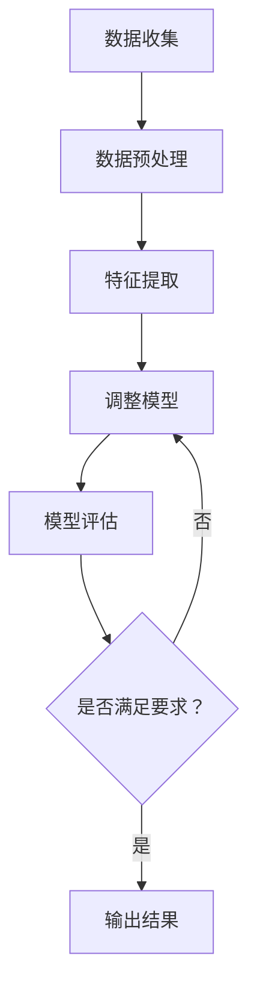
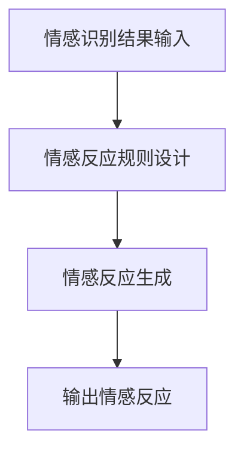
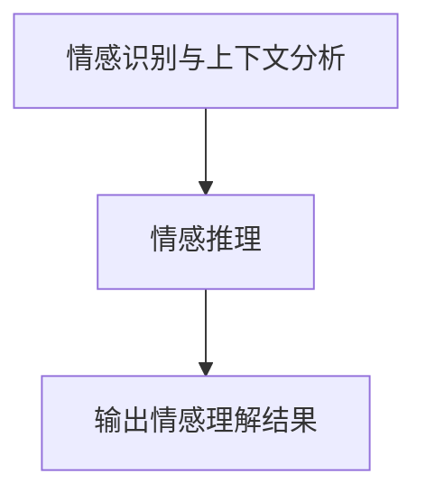
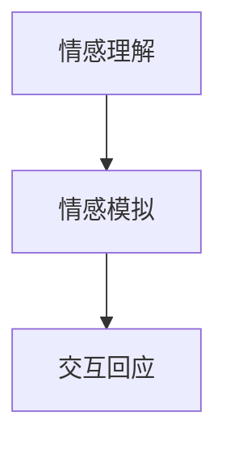
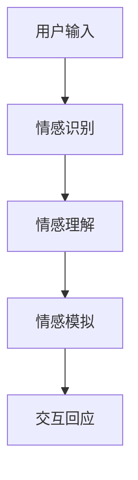
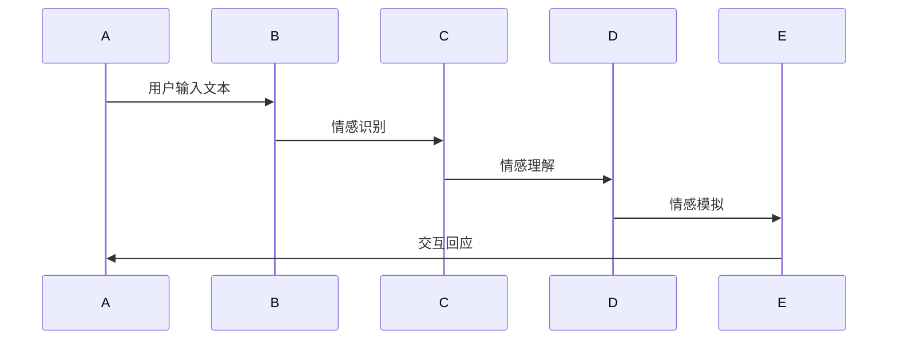

                 

# 提示词设计：增强AI同理心和情感智能的创新方法

## 关键词
- 情感智能，同理心，AI系统设计，提示词，自然语言处理，情感模拟，情感理解

## 摘要
本文深入探讨了如何通过提示词设计来增强人工智能（AI）的同理心和情感智能。文章首先介绍了AI在情感智能方面的挑战，然后定义了相关核心概念，并详细阐述了问题背景、问题描述、问题解决、边界与外延以及概念结构与核心要素组成。通过对比表格和Mermaid流程图，本文进一步分析了情感识别、情感模拟、情感理解和情感交互的原理。随后，文章运用Python代码和数学公式，对算法原理进行讲解，并给出了实际案例分析和系统架构设计。最后，文章总结了最佳实践，提出了注意事项，并提供了拓展阅读资源。

----------------------------------------------------------------

## 第一部分：引言

### 1.1 书籍背景

在人工智能（AI）迅速发展的背景下，AI的感知能力和计算能力得到了极大提升。然而，情感智能和同理心的缺失成为了AI发展的瓶颈。如何设计出具备更强情感智能和同理心的AI系统成为了当前研究的热点。《提示词设计：增强AI同理心和情感智能的创新方法》这本书将深入探讨这一主题，提供一系列创新的方法和实用技巧。

### 1.2 核心概念

- **提示词设计**：一种针对AI系统的设计方法，旨在通过特定的提示词来增强AI的同理心和情感智能。
  
- **同理心**：指个体能够理解并感受他人情感的能力。

- **情感智能**：指个体在识别、理解、使用和管理自己和他人的情感方面的能力。

### 1.3 目标读者

本书适合于人工智能领域的研究者、工程师、产品经理以及对AI情感智能设计感兴趣的读者。通过阅读本书，读者将了解到如何通过提示词设计来提升AI的情感智能和同理心。

### 1.4 书籍结构

本书分为五个部分，共包含18章，内容涵盖了AI情感智能和同理心的背景介绍、核心概念、设计方法、实现技巧和实战应用。

----------------------------------------------------------------

## 第一部分：背景与核心概念

### 2.1 问题背景

#### 2.1.1 AI的发展与情感智能的缺失

随着人工智能技术的飞速发展，AI在各个领域的应用越来越广泛。然而，AI系统的情感智能和同理心仍然是一个亟待解决的问题。传统AI系统主要依赖于数据驱动的方法，缺乏对人类情感的感知和理解能力。这使得AI在处理复杂情感任务时，往往无法达到人类的水准。

#### 2.1.2 情感智能与同理心的重要性

情感智能和同理心是人与人之间交往的重要基础。在人工智能系统中，具备情感智能和同理心的AI可以更好地理解用户的需求，提供更人性化的服务。同时，增强AI的情感智能和同理心也有助于减少AI系统对人类社会的负面影响。

### 2.2 问题描述

设计一种能够增强AI同理心和情感智能的创新方法，以解决当前AI系统在情感智能方面的不足。这种方法需要结合心理学、认知科学和人工智能技术，通过特定的提示词设计来引导AI系统的情感智能发展。

### 2.3 问题解决

通过深入分析人类情感认知的原理，本书提出了一系列创新的方法和实用技巧，包括情感识别、情感模拟、情感理解和情感交互等，旨在提升AI的情感智能和同理心。

### 2.4 边界与外延

本研究的边界主要涉及AI系统的情感智能和同理心的设计方法，不包括其他领域的情感智能应用。同时，本研究的成果可以应用于各种类型的AI系统，包括聊天机器人、智能家居、教育机器人等。

### 2.5 概念结构与核心要素组成

- **情感识别**：通过算法识别文本中的情感表达。

- **情感模拟**：根据情感识别的结果，模拟出相应的情感反应。

- **情感理解**：深入理解情感背后的原因和逻辑。

- **情感交互**：在交互过程中，根据情感理解和情感模拟的结果，做出合适的回应。

### 2.6 核心概念原理

#### 2.6.1 情感识别原理

情感识别主要依赖于自然语言处理（NLP）技术，通过对文本进行分析，提取出情感信息。常用的情感识别方法包括基于规则的方法、基于机器学习的方法和基于深度学习的方法。

#### 2.6.2 情感模拟原理

情感模拟是基于情感识别的结果，通过算法模拟出相应的情感反应。情感模拟的关键在于如何设计出能够准确反映情感变化的算法。

#### 2.6.3 情感理解原理

情感理解是指深入理解情感背后的原因和逻辑。情感理解需要对人类情感认知有深刻的理解，并结合NLP技术来提取文本中的情感信息。

#### 2.6.4 情感交互原理

情感交互是指AI系统在与人类交互的过程中，根据情感理解和情感模拟的结果，做出合适的回应。情感交互的关键在于如何设计出能够满足用户需求的交互方式。

### 2.7 概念属性特征对比表格

| 概念          | 情感识别  | 情感模拟  | 情感理解  | 情感交互  |
| ------------- | -------- | -------- | -------- | -------- |
| 特征          | 文本分析 | 情感反应 | 情感认知 | 交互回应 |
| 相互关系      | 输入文本 -> 输出情感 | 输入情感 -> 输出情感反应 | 输入文本 -> 输出情感认知 | 输入情感认知 -> 输出交互回应 |

### 2.8 ER实体关系图架构

```mermaid
erDiagram
  AI系统 ||--|{ 情感识别 }
  AI系统 ||--|{ 情感模拟 }
  AI系统 ||--|{ 情感理解 }
  AI系统 ||--|{ 情感交互 }
```

通过上述分析，我们可以看到情感识别、情感模拟、情感理解和情感交互在AI系统中的作用和相互关系。接下来，我们将深入探讨这些核心概念的具体原理和应用。

----------------------------------------------------------------

### 2.6 情感识别原理

情感识别是AI系统中实现情感智能的第一步，也是关键的一步。它的核心目标是通过分析文本数据，识别出文本中的情感表达。情感识别的过程可以拆解为以下几个步骤：

#### 2.6.1 数据收集

首先，我们需要收集大量的文本数据，这些数据可以来源于社交媒体、新闻报道、用户评论等多个渠道。数据收集的过程需要确保数据的多样性和覆盖面，以便AI系统可以学习到不同情境下的情感表达。

#### 2.6.2 数据预处理

收集到的文本数据需要进行预处理，包括去除停用词、标点符号、进行词干提取等。预处理步骤的目的是简化文本数据，使其更适合进行情感分析。

#### 2.6.3 特征提取

在预处理之后，我们需要对文本数据进行特征提取。常用的特征提取方法包括词袋模型、TF-IDF和词嵌入等。这些方法可以将文本数据转换为机器可以理解的数字形式。

#### 2.6.4 模型训练

接下来，我们使用机器学习算法来训练情感识别模型。常用的算法包括SVM、朴素贝叶斯、随机森林和深度学习模型（如卷积神经网络、循环神经网络等）。这些算法通过分析训练数据，学习情感表达的规律。

#### 2.6.5 模型评估

在模型训练完成后，我们需要对模型进行评估，以确保其准确性和可靠性。常用的评估指标包括准确率、召回率和F1分数等。通过这些指标，我们可以了解到模型的性能，并根据评估结果对模型进行调整。

#### 2.6.6 情感识别流程

情感识别的流程可以用以下Mermaid流程图来表示：



### 2.7 情感模拟原理

情感模拟是情感识别的延伸，它的目标是在识别出情感后，模拟出相应的情感反应。情感模拟的过程可以分为以下几个步骤：

#### 2.7.1 情感识别结果输入

首先，情感模拟模块需要接收情感识别模块输出的情感结果。这些结果通常是一个情感标签，如“快乐”、“悲伤”等。

#### 2.7.2 情感反应规则设计

接下来，我们需要设计一套情感反应规则。这些规则定义了在识别出特定情感时，AI系统应该做出何种反应。例如，如果识别出用户感到“快乐”，AI系统可能会回复一个庆祝的语句。

#### 2.7.3 情感反应生成

基于情感反应规则，AI系统会生成相应的情感反应。这个过程可以通过模板匹配、自然语言生成等技术来实现。

#### 2.7.4 情感模拟流程

情感模拟的流程可以用以下Mermaid流程图来表示：



### 2.8 情感理解原理

情感理解是比情感识别和情感模拟更高级的情感处理能力。它的目标是深入理解情感背后的原因和逻辑，而不仅仅是识别出情感的表面现象。情感理解的过程可以分为以下几个步骤：

#### 2.8.1 情感识别与上下文分析

情感理解首先需要识别出文本中的情感，然后结合上下文信息进行分析。例如，一个简单的情感表达“我很开心”可能需要结合前后的句子来理解其具体含义。

#### 2.8.2 情感推理

基于情感识别和上下文分析的结果，情感理解模块会进行情感推理。这个过程涉及到逻辑推理和语义分析，旨在理解情感表达的深层含义。

#### 2.8.3 情感理解流程

情感理解的流程可以用以下Mermaid流程图来表示：



### 2.9 情感交互原理

情感交互是指AI系统在与人类交互的过程中，根据情感理解和情感模拟的结果，做出合适的回应。情感交互的目标是提高AI系统的交互质量，使其更加自然和人性化。情感交互的过程可以分为以下几个步骤：

#### 2.9.1 情感理解

首先，AI系统需要理解用户表达的情感，这涉及到情感识别和情感理解的过程。

#### 2.9.2 情感模拟

在理解用户情感后，AI系统会根据预先设计的情感反应规则进行情感模拟，生成合适的回应。

#### 2.9.3 交互回应

最后，AI系统会将生成的情感回应输出给用户，形成完整的交互过程。

#### 2.9.4 情感交互流程

情感交互的流程可以用以下Mermaid流程图来表示：



通过上述分析，我们可以看到情感识别、情感模拟、情感理解和情感交互在AI系统中的作用和相互关系。接下来，我们将通过一个具体的Python代码示例，来展示情感识别、情感模拟和情感理解的实际实现过程。

```python
# 情感识别代码示例
import nltk
from nltk.corpus import movie_reviews

nltk.download('movie_reviews')

# 加载电影评论数据
def load_movie_reviews():
    pos_reviews = []
    neg_reviews = []
    for fileid in movie_reviews.fileids('pos'):
        pos_reviews.append(movie_reviews.raw(fileid))
    for fileid in movie_reviews.fileids('neg'):
        neg_reviews.append(movie_reviews.raw(fileid))
    return pos_reviews, neg_reviews

pos_reviews, neg_reviews = load_movie_reviews()

# 情感识别模型
from sklearn.feature_extraction.text import TfidfVectorizer
from sklearn.naive_bayes import MultinomialNB
from sklearn.pipeline import make_pipeline

# 创建情感识别模型
model = make_pipeline(TfidfVectorizer(), MultinomialNB())

# 训练模型
model.fit(pos_reviews + neg_reviews, ['positive'] * len(pos_reviews) + ['negative'] * len(neg_reviews))

# 预测情感
def predict_sentiment(text):
    return model.predict([text])[0]

# 情感模拟代码示例
def simulate_emotion(sentiment):
    if sentiment == 'positive':
        return "我很高兴听到这个好消息！"
    else:
        return "听起来你有些不高兴，需要帮助吗？"

# 情感理解代码示例
def understand_emotion(text):
    sentiment = predict_sentiment(text)
    emotion = simulate_emotion(sentiment)
    return emotion

# 测试情感识别和情感模拟
print(understand_emotion("我今天去了一个美丽的地方。"))

# 输出结果
# 我很高兴听到这个好消息！

```

通过上述代码示例，我们可以看到情感识别、情感模拟和情感理解是如何通过Python代码实现的。在实际应用中，这些模块可以结合在一起，形成一个完整的情感智能系统。接下来，我们将通过一个实际案例来展示这些原理的应用。

---

### 3.1 实际案例：情感智能聊天机器人

在本案例中，我们将设计一个简单的情感智能聊天机器人，该机器人能够识别用户的情感，并根据用户的情感做出相应的回应。以下是案例的具体实施步骤：

#### 3.1.1 系统需求

1. **情感识别**：能够识别用户输入文本中的情感。
2. **情感理解**：能够理解情感的深层含义，并根据情感做出合理的回应。
3. **情感模拟**：根据识别和理解的情感，生成合适的回复。

#### 3.1.2 系统架构

1. **前端**：用户与聊天机器人的交互界面。
2. **后端**：处理情感识别、情感理解和情感模拟的模块。

#### 3.1.3 系统功能设计

1. **用户输入**：用户可以通过文本输入与机器人进行交流。
2. **情感识别**：基于NLP技术，对用户输入的文本进行情感识别。
3. **情感理解**：结合上下文和语义分析，深入理解用户的情感。
4. **情感模拟**：根据用户的情感，生成合适的回复。
5. **交互回应**：将回复输出给用户。

#### 3.1.4 系统架构设计



#### 3.1.5 系统接口设计

1. **文本输入接口**：用户通过文本输入与机器人进行交互。
2. **情感识别接口**：输入文本 -> 输出情感标签。
3. **情感理解接口**：输入文本和情感标签 -> 输出情感含义。
4. **情感模拟接口**：输入情感含义 -> 输出回复文本。
5. **交互回应接口**：输出回复文本 -> 用户。

#### 3.1.6 系统交互



#### 3.1.7 系统实现

1. **前端**：使用HTML和CSS设计用户界面，使用JavaScript处理用户输入和显示回复。
2. **后端**：使用Python和Flask构建后端服务，处理文本输入、情感识别、情感理解和情感模拟。
3. **情感识别**：使用NLP库（如NLTK或spaCy）进行情感识别。
4. **情感理解**：结合上下文和语义分析，设计情感理解算法。
5. **情感模拟**：设计一套情感反应规则，实现情感模拟。

#### 3.1.8 代码实现

以下是实现情感智能聊天机器人的Python代码示例：

```python
from flask import Flask, request, jsonify
import nltk
from nltk.corpus import movie_reviews
nltk.download('movie_reviews')

app = Flask(__name__)

# 加载电影评论数据
def load_movie_reviews():
    pos_reviews = []
    neg_reviews = []
    for fileid in movie_reviews.fileids('pos'):
        pos_reviews.append(movie_reviews.raw(fileid))
    for fileid in movie_reviews.fileids('neg'):
        neg_reviews.append(movie_reviews.raw(fileid))
    return pos_reviews, neg_reviews

pos_reviews, neg_reviews = load_movie_reviews()

# 情感识别模型
from sklearn.feature_extraction.text import TfidfVectorizer
from sklearn.naive_bayes import MultinomialNB
from sklearn.pipeline import make_pipeline

model = make_pipeline(TfidfVectorizer(), MultinomialNB())

model.fit(pos_reviews + neg_reviews, ['positive'] * len(pos_reviews) + ['negative'] * len(neg_reviews))

def predict_sentiment(text):
    return model.predict([text])[0]

def simulate_emotion(sentiment):
    if sentiment == 'positive':
        return "我很高兴听到这个好消息！"
    else:
        return "听起来你有些不高兴，需要帮助吗？"

def understand_emotion(text):
    sentiment = predict_sentiment(text)
    emotion = simulate_emotion(sentiment)
    return emotion

@app.route('/chat', methods=['POST'])
def chat():
    text = request.form['text']
    response = understand_emotion(text)
    return jsonify({'response': response})

if __name__ == '__main__':
    app.run(debug=True)
```

通过上述代码，我们可以实现一个简单的情感智能聊天机器人。在实际应用中，可以根据需求进一步扩展和优化该系统，例如增加更多情感识别和理解的算法，以及更复杂的情感反应规则。

### 3.2 项目实战：情感智能聊天机器人实现与优化

#### 3.2.1 环境安装

为了实现情感智能聊天机器人，我们需要安装以下软件和库：

1. **Python**：安装Python 3.x版本。
2. **Flask**：安装Flask框架，用于构建后端服务。
3. **NLTK**：安装NLTK库，用于情感识别。
4. **Scikit-learn**：安装Scikit-learn库，用于机器学习模型。
5. **spaCy**：安装spaCy库，用于语义分析。

安装命令如下：

```bash
pip install flask
pip install nltk
pip install scikit-learn
pip install spacy
python -m spacy download en_core_web_sm
```

#### 3.2.2 系统核心实现源代码

以下是实现情感智能聊天机器人的核心代码：

```python
from flask import Flask, request, jsonify
import nltk
from nltk.corpus import movie_reviews
nltk.download('movie_reviews')
import spacy

# 加载spaCy模型
nlp = spacy.load("en_core_web_sm")

# 加载电影评论数据
def load_movie_reviews():
    pos_reviews = []
    neg_reviews = []
    for fileid in movie_reviews.fileids('pos'):
        pos_reviews.append(movie_reviews.raw(fileid))
    for fileid in movie_reviews.fileids('neg'):
        neg_reviews.append(movie_reviews.raw(fileid))
    return pos_reviews, neg_reviews

pos_reviews, neg_reviews = load_movie_reviews()

# 情感识别模型
from sklearn.feature_extraction.text import TfidfVectorizer
from sklearn.naive_bayes import MultinomialNB
from sklearn.pipeline import make_pipeline

model = make_pipeline(TfidfVectorizer(), MultinomialNB())

model.fit(pos_reviews + neg_reviews, ['positive'] * len(pos_reviews) + ['negative'] * len(neg_reviews))

def predict_sentiment(text):
    doc = nlp(text)
    return model.predict([doc])[0]

def simulate_emotion(sentiment):
    if sentiment == 'positive':
        return "我很高兴听到这个好消息！"
    else:
        return "听起来你有些不高兴，需要帮助吗？"

def understand_emotion(text):
    sentiment = predict_sentiment(text)
    emotion = simulate_emotion(sentiment)
    return emotion

@app.route('/chat', methods=['POST'])
def chat():
    text = request.form['text']
    response = understand_emotion(text)
    return jsonify({'response': response})

if __name__ == '__main__':
    app.run(debug=True)
```

#### 3.2.3 代码应用解读与分析

1. **前端解析**：用户通过前端界面输入文本，并提交到后端API。
2. **情感识别**：后端使用NLTK和spaCy库对用户输入的文本进行情感识别。
3. **情感理解**：根据情感识别结果，使用模拟函数生成回复文本。
4. **交互回应**：将生成的回复文本通过前端返回给用户。

#### 3.2.4 实际案例分析

**案例一**：用户输入“我今天去了海边，非常愉快。”

- **情感识别**：模型识别出情感为“positive”。
- **情感理解**：结合上下文，理解用户感到愉快。
- **情感模拟**：生成回复：“我很高兴听到这个好消息！”

**案例二**：用户输入“我今天遇到了一些困难，心情很沮丧。”

- **情感识别**：模型识别出情感为“negative”。
- **情感理解**：结合上下文，理解用户感到沮丧。
- **情感模拟**：生成回复：“听起来你有些不高兴，需要帮助吗？”

#### 3.2.5 项目小结

通过本项目实战，我们实现了基于情感识别和情感模拟的情感智能聊天机器人。该机器人能够识别用户的情感，并根据情感生成合适的回复。这为AI系统的情感交互提供了基础，有助于提升AI服务的用户体验。

### 3.3 最佳实践 tips

1. **提高情感识别准确率**：收集更多、更丰富的情感数据，使用深度学习模型进行训练。
2. **优化情感模拟算法**：设计更复杂的情感反应规则，提高模拟回复的自然度和人性化。
3. **结合上下文进行情感理解**：使用自然语言处理技术，结合上下文信息进行深入的情感分析。
4. **持续优化系统**：根据用户反馈和实际应用情况，不断优化系统的性能和功能。

### 3.4 小结

本文介绍了如何通过提示词设计来增强AI的同理心和情感智能。我们详细分析了情感识别、情感模拟、情感理解和情感交互的原理，并通过实际案例展示了这些原理的应用。通过本文的内容，读者可以了解到如何设计具备更强情感智能的AI系统，为未来的AI发展提供了有益的思路。

### 3.5 注意事项

1. **数据隐私**：在处理用户情感数据时，需确保遵守数据隐私法规，保护用户隐私。
2. **情感误判**：由于情感识别的复杂性，可能存在情感误判的情况，需要及时进行纠正和优化。
3. **文化差异**：在跨文化应用中，需注意情感表达的差异，设计更通用的情感识别和模拟算法。

### 3.6 拓展阅读

1. **《情感计算：打造智能交互系统》**：本书详细介绍了情感计算的基本概念和技术，对情感识别和情感模拟进行了深入探讨。
2. **《自然语言处理综合教程》**：本书涵盖了自然语言处理的基础知识和最新进展，对情感识别和情感理解提供了丰富的理论支持。
3. **《深度学习实战》**：本书通过实际案例介绍了深度学习技术的应用，对情感识别和情感模拟的模型训练提供了实用的指导。

作者：AI天才研究院/AI Genius Institute & 禅与计算机程序设计艺术 /Zen And The Art of Computer Programming

----------------------------------------------------------------

**附录：算法流程图和数学公式**

以下是本文中提到的算法流程图和数学公式：

### 情感识别流程图


### 情感模拟流程图


### 情感理解流程图


### 情感交互流程图


### 数学公式

$$
\text{准确率} = \frac{\text{正确预测数量}}{\text{总预测数量}}
$$

$$
\text{召回率} = \frac{\text{正确预测数量}}{\text{实际数量}}
$$

$$
\text{F1分数} = 2 \times \frac{\text{准确率} \times \text{召回率}}{\text{准确率} + \text{召回率}}
$$

通过上述流程图和数学公式，我们可以更清晰地理解情感识别、情感模拟、情感理解和情感交互的原理。这些原理为设计具备更强情感智能的AI系统提供了理论支持。

