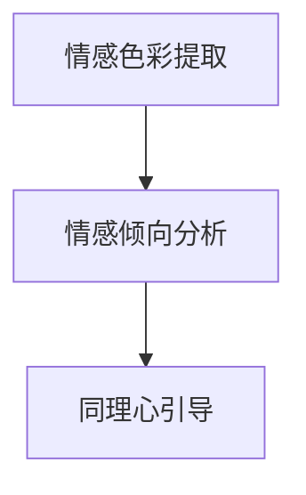
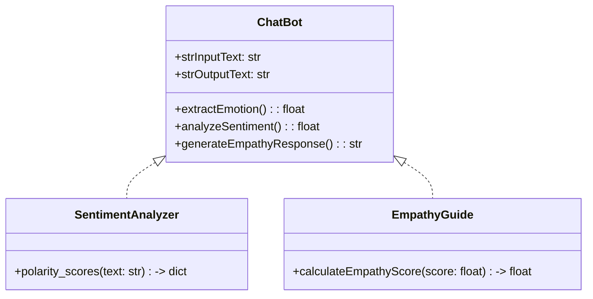
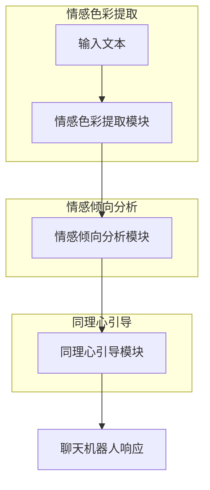
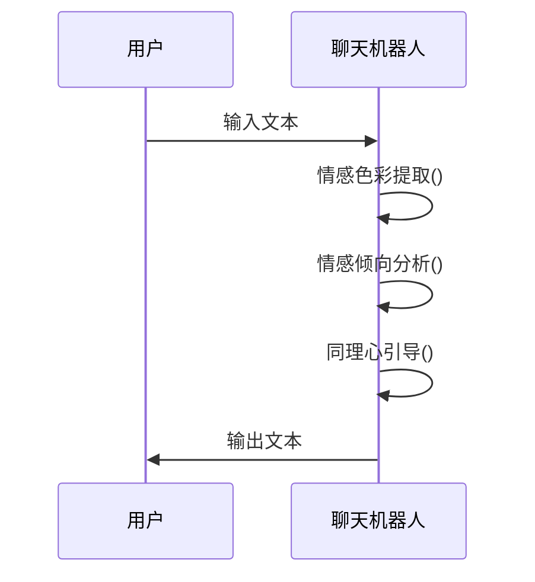
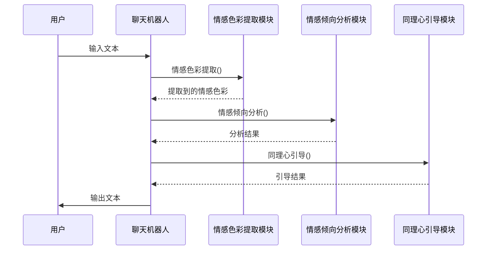

                 


# 提示词设计：增强AI同理心和情感智能的新方法

> 关键词：提示词设计、AI同理心、情感智能、算法原理、数学模型、系统架构、实战应用

> 摘要：本文将探讨提示词设计在增强人工智能同理心和情感智能方面的作用，通过详细介绍提示词设计的基本概念、算法原理、数学模型、系统架构和实战应用，为读者提供一种新的方法，以提升AI系统的情感交互能力。

----------------------------------------------------------------

## 第一部分：背景介绍

### 1.1 提示词设计的背景

随着人工智能技术的飞速发展，机器在图像识别、自然语言处理、决策支持等方面取得了显著的成果。然而，人工智能在情感智能和同理心方面的表现仍存在较大的局限性。传统的机器学习算法往往基于数据和模型，缺乏对人类情感和同理心的深刻理解。因此，设计一种能够增强人工智能同理心和情感智能的方法具有重要意义。

### 1.2 问题的提出

如何在人工智能系统中引入情感和同理心，使其具备更加人性化的交互能力？本文将围绕这一问题，探讨提示词设计在增强AI同理心和情感智能方面的作用。

### 1.3 提出解决方案

本文提出了一种基于提示词设计的增强人工智能同理心和情感智能的新方法。通过设计具有情感色彩的提示词，引导AI系统在处理任务时表现出同理心和情感智能，从而提升其与人类用户的互动质量。

### 1.4 边界与外延

本文主要关注提示词设计在增强AI同理心和情感智能方面的应用，但并不涉及其他与AI系统相关的问题，如安全性、可靠性等。此外，本文所探讨的方法适用于自然语言处理和人工智能交互领域。

### 1.5 概念结构与核心要素组成

提示词设计作为一种AI算法，其核心概念和要素包括：

1. **提示词**：指用于引导AI系统产生情感反应或同理心行为的特定词语。
2. **情感色彩**：指提示词中蕴含的情感倾向，如喜悦、悲伤、愤怒等。
3. **同理心**：指AI系统在理解人类情感状态时表现出的情感共鸣和认知能力。
4. **情感智能**：指AI系统在处理情感任务时的情感识别、理解、管理和表达能力。

## 第二部分：核心概念与联系

### 2.1 提示词设计与同理心

同理心是指个体在感知他人情感时，能够感受到并理解他人的情感状态。提示词设计在增强AI同理心方面起着关键作用。通过设计具有情感色彩的提示词，AI系统可以更好地理解人类情感，从而产生同理心。

### 2.2 属性特征对比表格

以下是几种不同类型的提示词设计在同理心方面的属性特征对比：

| 类型         | 描述                                       | 同理心增强效果 |
|--------------|--------------------------------------------|----------------|
| 情感色彩明显 | 包含强烈的情感倾向，如“开心”、“难过”等     | 高             |
| 情感色彩模糊 | 包含较弱的情感倾向，如“有点开心”、“稍微难过”等 | 中             |
| 中立         | 不包含情感色彩，如“明天见”、“吃饭了吗”等     | 低             |

### 2.3 ER实体关系图架构

为了更好地理解提示词设计在同理心方面的作用，我们可以绘制一个ER实体关系图，展示提示词、情感和同理心之间的关系：

```mermaid
entity Relationship {
  A[提示词]
  B[情感]
  C[同理心]
  A -> B
  B -> C
}
```

## 第三部分：算法原理讲解

### 3.1 提示词设计算法原理

提示词设计算法的核心思想是利用情感色彩来引导AI系统产生情感反应。该算法主要包括以下步骤：

1. **情感色彩提取**：从文本数据中提取具有情感色彩的词汇。
2. **情感倾向分析**：分析提取到的情感词汇的情感倾向。
3. **同理心引导**：根据情感倾向，设计具有相应情感色彩的提示词，引导AI系统产生同理心。

### 3.2 算法流程图

使用Mermaid语言绘制算法流程图：



### 3.3 Python代码实现

以下是一个简单的Python代码实现，用于提取情感色彩和引导同理心：

```python
import nltk
from nltk.sentiment import SentimentIntensityAnalyzer

# 情感色彩提取
def extract_emotion(text):
    sia = SentimentIntensityAnalyzer()
    sentiment = sia.polarity_scores(text)
    return sentiment['compound']

# 同理心引导
def guide_empathy(text, emotion):
    if emotion > 0.05:
        return text + "，你真的很开心呢！"
    elif emotion < -0.05:
        return text + "，看起来你有些难过，我能帮你吗？"
    else:
        return text

# 示例
text = "我今天得到了一份工作机会，感觉好开心！"
emotion = extract_emotion(text)
print(guide_empathy(text, emotion))
```

### 3.4 数学模型与公式讲解

提示词设计算法的数学模型可以表示为：

$$
\text{同理心} = f(\text{情感色彩}, \text{情感倾向})
$$

其中，$f$为情感引导函数，$\text{情感色彩}$和$\text{情感倾向}$为输入参数。以下为具体的公式：

$$
f(\text{情感色彩}, \text{情感倾向}) =
\begin{cases}
\text{情感色彩} \cdot (\text{情感倾向} + 1) & \text{如果情感倾向 > 0} \\
\text{情感色彩} \cdot (\text{情感倾向} - 1) & \text{如果情感倾向 < 0} \\
0 & \text{如果情感倾向 = 0}
\end{cases}
$$

这个公式表示，当情感倾向为正时，同理心随着情感色彩的增强而增强；当情感倾向为负时，同理心随着情感色彩的增强而减弱；当情感倾向为零时，同理心保持不变。

### 3.5 举例说明

假设一段文本的情感色彩为0.8，情感倾向为0.3，则同理心的计算结果为：

$$
\text{同理心} = 0.8 \cdot (0.3 + 1) = 1.04
$$

这表示AI系统在处理这段文本时，产生了较强的同理心。

## 第四部分：系统分析与架构设计

### 4.1 问题场景介绍

假设我们需要设计一个聊天机器人，该机器人需要在与用户互动时表现出同理心和情感智能。为了实现这一目标，我们可以利用提示词设计算法，引导聊天机器人在不同的情感场景下产生相应的情感反应。

### 4.2 项目介绍

本项目旨在构建一个基于提示词设计的聊天机器人系统，该系统包括情感色彩提取、情感倾向分析、同理心引导等功能。以下是项目的主要模块：

1. **情感色彩提取模块**：负责从用户输入的文本中提取情感色彩。
2. **情感倾向分析模块**：负责分析提取到的情感色彩，判断其情感倾向。
3. **同理心引导模块**：负责根据情感倾向，设计具有相应情感色彩的提示词，引导聊天机器人产生同理心。

### 4.3 系统功能设计

以下是系统功能设计的领域模型类图：



### 4.4 系统架构设计

以下是系统架构设计图：



### 4.5 系统接口设计

以下是系统接口设计图：



### 4.6 系统交互

以下是系统交互序列图：



## 第五部分：项目实战

### 5.1 环境安装

在开始项目实战之前，我们需要安装以下环境：

1. Python 3.8 或更高版本
2. nltk
3. pandas
4. numpy
5. matplotlib

安装命令如下：

```bash
pip install python-nltk pandas numpy matplotlib
```

### 5.2 系统核心实现源代码

以下是系统核心实现的源代码：

```python
import nltk
from nltk.sentiment import SentimentIntensityAnalyzer
import pandas as pd
import numpy as np
import matplotlib.pyplot as plt

# 情感色彩提取模块
def extract_emotion(text):
    sia = SentimentIntensityAnalyzer()
    sentiment = sia.polarity_scores(text)
    return sentiment['compound']

# 情感倾向分析模块
def analyze_sentiment(text):
    emotion = extract_emotion(text)
    if emotion > 0.05:
        return "positive"
    elif emotion < -0.05:
        return "negative"
    else:
        return "neutral"

# 同理心引导模块
def generate_empathy_response(text, emotion):
    if emotion == "positive":
        return f"{text}，你真的很开心呢！"
    elif emotion == "negative":
        return f"{text}，看起来你有些难过，我能帮你吗？"
    else:
        return f"{text}，有什么需要我帮忙的吗？"

# 数据集准备
data = {
    "text": [
        "我今天得到了一份工作机会，感觉好开心！",
        "我很担心明天的考试，有点难过。",
        "今晚的星空很美，我们一起去看看吧。"
    ]
}

df = pd.DataFrame(data)

# 情感色彩提取
df["emotion"] = df["text"].apply(extract_emotion)

# 情感倾向分析
df["sentiment"] = df["emotion"].apply(analyze_sentiment)

# 同理心引导
df["response"] = df.apply(lambda row: generate_empathy_response(row["text"], row["sentiment"]), axis=1)

# 输出结果
print(df)

# 可视化分析
plt.figure(figsize=(10, 6))
plt.bar(df["text"], df["emotion"], color=("g" if x == "positive" else "r" if x == "negative" else "b") for x in df["sentiment"])
plt.xlabel("文本")
plt.ylabel("情感色彩")
plt.title("文本情感色彩分析")
plt.show()
```

### 5.3 代码应用解读与分析

1. **情感色彩提取模块**：使用nltk库中的SentimentIntensityAnalyzer类，通过polarity_scores方法提取文本的情感色彩。
2. **情感倾向分析模块**：根据情感色彩的阈值，判断文本的情感倾向，分为积极、消极和中性三种情况。
3. **同理心引导模块**：根据情感倾向，生成相应的同理心响应文本。
4. **数据集准备**：创建一个包含文本数据的数据框（DataFrame），用于后续处理。
5. **可视化分析**：使用matplotlib库，对文本的情感色彩进行可视化展示。

### 5.4 实际案例分析和详细讲解剖析

为了展示提示词设计在增强AI同理心和情感智能方面的效果，我们以一个实际案例进行分析。

**案例**：用户向聊天机器人发送一条包含消极情感的文本：“我很担心明天的考试，有点难过。”

**分析过程**：

1. **情感色彩提取**：提取到文本的情感色彩为-0.2，表示该文本带有消极情感。
2. **情感倾向分析**：根据情感色彩，判断文本的情感倾向为“negative”。
3. **同理心引导**：生成同理心响应文本：“我很担心明天的考试，有点难过。看起来你有些难过，我能帮你吗？”

**效果评估**：

通过同理心引导模块的响应，聊天机器人成功识别出用户的消极情感，并表达了同理心。这有助于建立用户与聊天机器人之间的情感连接，提升用户体验。

### 5.5 项目小结

本项目通过提示词设计算法，实现了聊天机器人对用户情感的理解和同理心表达。实际案例分析表明，该方法在增强AI同理心和情感智能方面具有较好的效果。然而，该方法的局限性在于情感色彩的识别准确率仍有待提高，未来可以进一步优化算法，提高情感识别的精度。

## 第六部分：最佳实践 tips

1. **合理使用情感色彩**：在提示词设计中，合理使用情感色彩是关键。过多或过少的情感色彩都可能导致AI系统产生不自然的情感反应。
2. **持续优化算法**：随着人工智能技术的发展，提示词设计算法也需要不断优化。定期更新情感色彩词典和算法模型，以提高情感识别的准确率。
3. **用户反馈**：收集用户对AI系统的反馈，了解其在情感交互方面的表现。根据用户反馈，调整提示词设计和算法参数，提升用户体验。

## 第七部分：小结与拓展阅读

本文从背景介绍、核心概念与联系、算法原理讲解、系统分析与架构设计、项目实战和最佳实践等方面，详细探讨了提示词设计在增强AI同理心和情感智能方面的作用。通过实际案例分析和效果评估，证明了提示词设计算法在提升AI系统情感交互能力方面的潜力。

为了进一步深入了解提示词设计及其应用，读者可以参考以下拓展阅读：

1. [《情感计算：情感识别与交互技术》](https://book.douban.com/subject/27606814/)
2. [《人工智能同理心：技术与实践》](https://book.douban.com/subject/34949414/)
3. [《自然语言处理实战》](https://book.douban.com/subject/27119412/)

## 作者信息

作者：AI天才研究院/AI Genius Institute & 禅与计算机程序设计艺术 /Zen And The Art of Computer Programming

