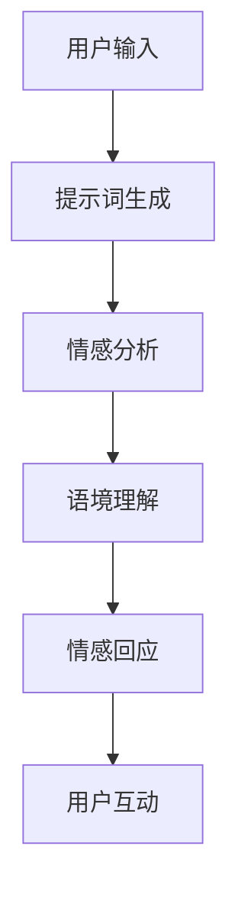
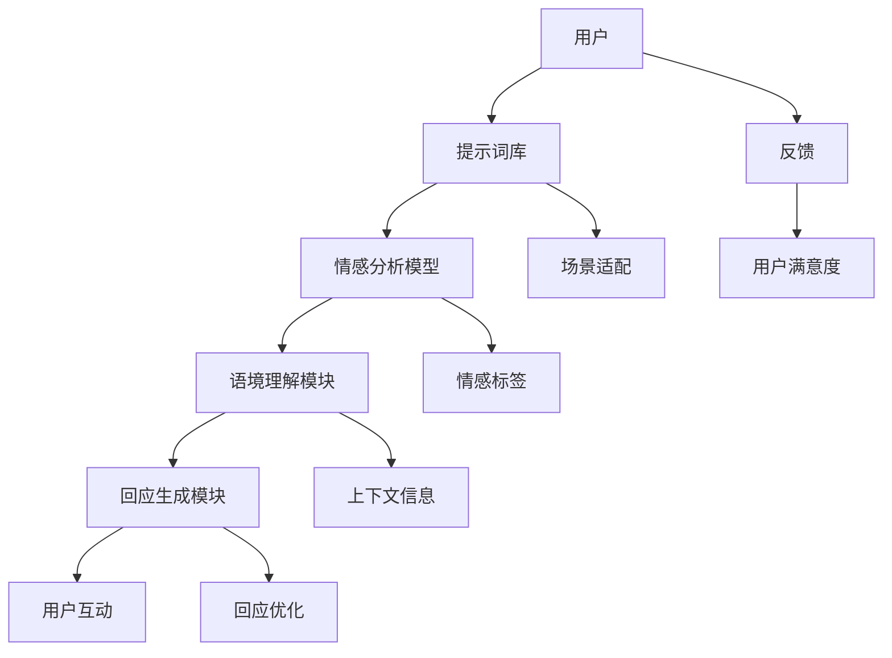
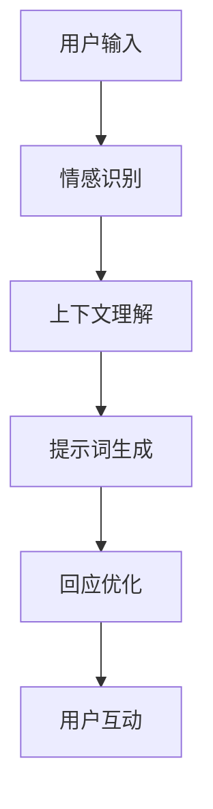
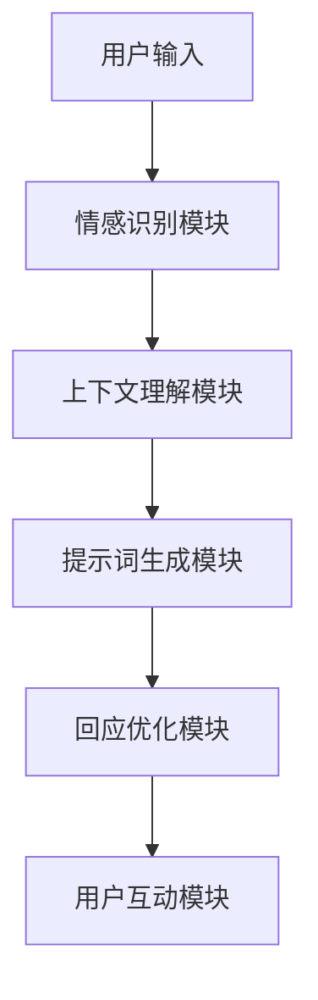
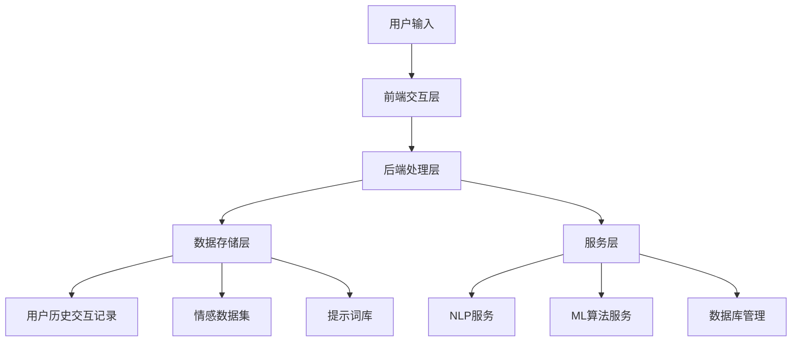
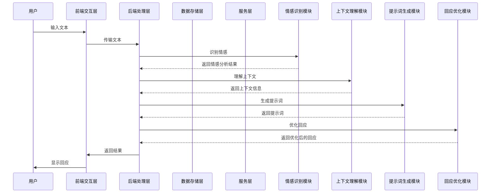

                 

### 提示词设计：增强AI同理心的新方法

在当今快速发展的信息技术时代，人工智能（AI）技术已经成为各行各业不可或缺的驱动力。然而，随着AI技术的广泛应用，人们逐渐意识到一个问题：尽管AI在处理数据和执行任务方面表现出色，但在处理情感和同理心方面却显得不足。这无疑限制了AI在许多应用场景中的潜力。为了克服这一挑战，我们需要找到一种新的方法来增强AI的同理心，而提示词设计正是这样一种创新的方法。

本文将围绕“提示词设计：增强AI同理心的新方法”这一主题，探讨提示词在AI同理心培养中的作用和重要性。我们将从以下几个部分进行详细分析：

1. **问题背景与核心概念**：介绍人工智能发展的现状以及AI同理心的挑战和需求，同时探讨提示词设计的初步探讨和基本概念。
2. **核心概念与联系**：详细解释提示词的定义、作用以及与同理心的联系，并使用流程图和表格等工具进行说明。
3. **算法原理讲解**：深入分析提示词设计算法的原理，包括算法的数学模型和公式，并通过具体案例进行举例说明。
4. **系统分析与架构设计**：介绍问题场景、项目背景和系统功能设计，包括领域模型类图、系统架构图、系统接口设计和交互序列图。
5. **项目实战**：通过环境安装、系统核心实现、代码应用解读与分析、实际案例分析和项目小结，展示提示词设计的实际应用和效果。
6. **最佳实践与拓展阅读**：总结全文的核心内容，提供一些实用技巧和注意事项，并推荐相关的拓展阅读资源。

通过本文的探讨，我们希望读者能够对提示词设计有更深入的理解，认识到其在增强AI同理心方面的巨大潜力，并为未来的研究和应用提供一些有益的启示。

### 第一部分：问题背景与核心概念

#### 1.1 问题的背景

随着人工智能（AI）技术的快速发展，AI已经在许多领域取得了显著的成就。从医疗诊断到自动驾驶，从金融分析到智能家居，AI的应用已经深入到我们生活的方方面面。然而，尽管AI在处理复杂计算、模式识别和决策制定方面表现出色，但它在处理情感和同理心方面却显得不足。这就引发了一个关键问题：如何增强AI的同理心？

同理心是人类的一项基本情感，它使我们能够理解并感受他人的情感和经历。然而，AI缺乏这种内在的人类特质，导致它在许多应用场景中无法达到与人类同等水平的互动和理解。例如，在医疗领域，医生需要不仅仅关注患者的病情，还要理解患者的情绪和心理状态，从而提供更加全面的医疗服务。而当前AI系统在处理这些情感因素时常常显得无力。

同理心在AI中的应用不仅仅是情感处理的问题，它还涉及到AI在伦理、社会和人际交往等多个方面的表现。一个具有同理心的AI能够在与人类互动时表现出更高的可靠性、亲和力和人性化，从而提升用户体验，增强用户信任。这对于那些需要高度人类交互的应用场景尤为重要，如客服机器人、教育助理和心理健康咨询等。

然而，现有的AI系统在培养同理心方面面临着诸多挑战。传统的AI算法主要依赖于数据和模型，而缺乏对人类情感和同理心的深入理解。因此，如何设计出能够增强AI同理心的系统和方法，成为了一个亟待解决的问题。

#### 1.1.1 人工智能的发展现状

人工智能技术的发展经历了几个阶段，从最初的规则推理系统到基于统计学的机器学习，再到深度学习的广泛应用。随着计算能力的提升和大数据的普及，AI技术在各个领域都取得了显著的进展。以下是几个关键领域的进展：

1. **计算机视觉**：通过卷积神经网络（CNN）和深度学习算法，计算机视觉技术在图像识别、目标检测和场景理解等方面取得了巨大突破。例如，自动驾驶汽车使用计算机视觉技术来识别道路标志、行人和其他车辆，从而实现安全驾驶。

2. **自然语言处理**：自然语言处理（NLP）技术在语音识别、文本分析、机器翻译和情感分析等方面取得了显著成就。AI系统可以通过理解自然语言来进行人机交互，提供智能客服、智能语音助手等服务。

3. **机器学习**：机器学习技术在预测分析、推荐系统和决策支持系统等方面有着广泛应用。通过学习大量数据，AI系统可以做出更加精准的预测和决策，提高工作效率和准确性。

4. **深度学习**：深度学习作为一种特殊的机器学习技术，通过多层神经网络来模拟人脑的工作方式，实现了在图像识别、语音识别和游戏玩法等领域的突破。

然而，尽管AI在技术上取得了巨大进展，但它在处理情感和同理心方面仍然存在明显不足。这主要源于以下几个方面：

1. **数据不足**：AI系统通常依赖于大量的数据来训练模型。然而，情感和同理心的数据难以获取，且数据质量参差不齐，这限制了AI在这些领域的应用。

2. **算法限制**：当前的AI算法主要关注的是数据分析和模式识别，缺乏对人类情感和同理心的深入理解。这使得AI在处理情感时往往只能模拟，而不能真正理解。

3. **交互复杂性**：同理心的培养不仅仅依赖于数据的输入和算法的处理，还需要AI系统与人类进行有效的互动和交流。现有的AI系统在处理复杂人机交互时仍然存在很多问题，如响应延迟、理解偏差等。

#### 1.1.2 AI同理心的挑战与需求

为了解决AI同理心不足的问题，我们需要深入探讨以下挑战和需求：

1. **挑战**

   - **数据收集与标注**：情感和同理心的数据难以收集和标注，这需要更多的时间和资源。
   - **算法复杂性**：设计能够理解并模拟人类情感的算法需要更多的计算资源和更复杂的技术。
   - **人机交互**：AI系统需要能够与人类进行有效的互动，这要求AI具备更强大的交互能力和情感理解能力。
   - **伦理问题**：AI在处理人类情感时可能涉及到伦理和隐私问题，需要制定相应的伦理规范和隐私保护措施。

2. **需求**

   - **情感识别与理解**：AI需要能够识别和解析人类的情感状态，并理解这些情感背后的意义。
   - **个性化互动**：AI需要能够根据用户的情感状态和偏好提供个性化的互动和服务。
   - **人性化的回应**：AI需要能够在互动中表现出人性化，使人类感到被理解和尊重。
   - **道德责任**：AI需要能够承担一定的道德责任，在处理人类情感时做出符合伦理的选择。

#### 1.1.3 提示词设计的初步探讨

提示词设计作为一种增强AI同理心的新方法，其基本理念是通过输入特定的提示词来引导AI系统理解人类的情感和同理心。提示词可以是简单的文字、图像、声音或其他形式的信息，它们被用来激发AI系统的情感反应和理解能力。

提示词设计的初步探讨包括以下几个方面：

1. **提示词的生成**：如何生成有效的提示词是提示词设计的关键。这需要结合人类情感数据和AI算法，通过数据分析、自然语言处理等技术来生成具有情感和同理心的提示词。

2. **提示词的输入与处理**：提示词如何被输入到AI系统中，以及AI系统如何处理这些提示词，是实现同理心增强的重要步骤。这需要设计出高效的输入和数据处理机制，确保AI能够准确理解和响应提示词。

3. **提示词与同理心的联系**：提示词设计与同理心的联系是核心问题。需要明确提示词如何影响AI的情感理解和同理心表现，以及如何通过提示词设计来提升AI的同理心水平。

4. **应用场景与效果评估**：提示词设计在不同应用场景中的效果如何，需要通过实际应用和效果评估来验证。这包括在医疗、教育、客服等领域的应用，以及在不同用户群体中的反馈和评价。

通过初步探讨，我们可以看到提示词设计在增强AI同理心方面具有巨大的潜力。然而，这需要更多的研究和实践来验证其有效性，并不断完善和优化提示词设计的方法和算法。

#### 1.2 核心概念

在探讨提示词设计之前，我们需要先明确几个核心概念：提示词的定义与作用、同理心的概念与要素，以及提示词与同理心的联系。

##### 1.2.1 提示词的定义与作用

提示词（Prompt Word）是指在AI系统或人机交互中，用来引导或激发系统或用户情感、行为或思考的关键词或短语。在自然语言处理（NLP）中，提示词常常被用来引导对话流程，帮助AI更好地理解和回应人类的意图和情感。

提示词的作用主要体现在以下几个方面：

1. **引导对话**：提示词可以用来引导对话的方向，帮助AI系统更好地理解用户的意图和情感。例如，在客服机器人中，通过使用特定的提示词，可以引导用户描述他们的问题或需求。

2. **情感激发**：提示词可以激发AI的情感反应，使其在对话中表现出更加人性化的互动。例如，通过使用温馨、关怀或鼓励的提示词，可以增强AI与用户之间的情感联系。

3. **行为指导**：提示词还可以指导AI系统执行特定的行为或任务。例如，在医疗诊断系统中，通过使用特定的提示词，可以引导AI系统进行病情分析和建议。

4. **数据增强**：在训练AI模型时，提示词可以用来增强训练数据，提高模型的泛化能力和表现。例如，通过在文本数据中添加情感提示词，可以丰富数据的情感维度，从而训练出更加情感化的AI系统。

##### 1.2.2 同理心的概念与要素

同理心（Empathy）是一种人类情感，指的是个体能够理解并感受到他人的情感和经历。同理心不仅仅是认知上的理解，还包括情感上的共鸣和感同身受。以下是同理心的一些核心要素：

1. **情感识别**：同理心首先需要能够识别他人的情感状态，包括情绪、情感强度和情感背景等。

2. **情感共鸣**：在识别他人情感的基础上，同理心需要能够产生情感上的共鸣，即感同身受。这涉及到情感上的共情和情感状态的共享。

3. **行为响应**：同理心还要求个体能够对他人情感做出适当的情感和行为响应，以帮助对方缓解情绪或提供支持。

4. **理解与支持**：同理心的关键在于理解和支持他人，不仅仅是表面上的回应，还需要深入理解对方的情感和需求，并采取有效措施来帮助对方。

##### 1.2.3 提示词与同理心的联系

提示词设计与同理心的联系主要体现在以下几个方面：

1. **情感引导**：通过设计特定的提示词，可以引导AI系统在对话中表现出更多的同理心。例如，使用鼓励、关怀或支持性的提示词，可以激发AI对用户情感的关注和共鸣。

2. **情感模拟**：提示词可以用来模拟人类情感，帮助AI系统更好地理解和响应用户的情感需求。例如，通过使用情感词汇和表达，可以引导AI系统在对话中表现出更加人性化的互动。

3. **情感增强**：提示词设计可以增强AI系统的情感处理能力，使其在处理复杂情感场景时表现出更高的同理心。例如，通过使用多层次的提示词和情感标签，可以丰富AI系统的情感数据库，提高其情感识别和理解能力。

4. **交互优化**：提示词设计可以优化人机交互体验，使AI系统能够更好地理解用户的情感和需求，提供更加个性化的服务。例如，通过使用特定的提示词，可以引导用户更清晰地表达自己的情感，从而提高交互效果。

总之，提示词设计作为一种增强AI同理心的新方法，具有很大的潜力。通过深入研究提示词的定义、作用以及与同理心的联系，我们可以更好地理解其工作机制和实际应用，为未来的研究和开发提供有益的启示。

#### 1.3 提示词设计的基本原则

为了有效地增强AI的同理心，提示词设计需要遵循一些基本原则，确保其能够发挥最大的效果。以下是提示词设计的基本原则和考虑因素：

##### 1.3.1 提升AI同理心的目标

首先，明确提升AI同理心的目标是提示词设计的核心。具体来说，这一目标包括以下几个方面：

1. **情感识别**：提示词设计应能够帮助AI系统准确识别用户的情感状态，包括情绪、情感强度和情感背景等。
2. **情感共鸣**：通过使用合适的提示词，引导AI系统在对话中产生情感上的共鸣，使AI能够感同身受，更好地理解用户的情感需求。
3. **行为响应**：设计提示词的目的是使AI系统在识别和理解用户情感后，能够做出适当的情感和行为响应，以提供更加人性化的服务。
4. **理解与支持**：提示词设计应帮助AI系统深入理解用户的情感和需求，提供针对性的支持和解决方案。

##### 1.3.2 提示词设计的考虑因素

为了实现上述目标，提示词设计需要考虑多个因素，确保设计的提示词既具有情感引导作用，又能够与AI系统的处理能力相适应。以下是主要的考虑因素：

1. **用户需求**：了解用户的具体需求和期望，设计出能够满足用户情感需求的提示词。例如，在客服机器人中，需要设计能够引导用户表达问题的提示词，以及在医疗诊断系统中，需要设计能够激发患者信任和舒适的提示词。

2. **情感表达**：选择合适的情感词汇和表达方式，通过温馨、关怀或鼓励性的语言，激发AI的情感共鸣。例如，使用“感谢您的信任”或“您的感受非常正常”等表达，可以增强用户与AI之间的情感联系。

3. **多样性**：设计多种类型的提示词，包括情感性、指导性和反馈性的词汇，以满足不同情境和用户需求。例如，在紧急情况下，可以使用“请保持冷静”等指导性提示词，而在日常对话中，可以使用“今天过得怎么样？”等情感性提示词。

4. **上下文理解**：提示词设计应考虑上下文环境，确保提示词与当前对话内容紧密相关。例如，在医疗咨询中，提示词应与患者的具体病情和咨询内容相匹配，以提高互动效果。

5. **算法适应性**：提示词设计需要与AI系统的处理能力相适应，确保AI系统能够准确理解和处理提示词。例如，在自然语言处理（NLP）模型中，提示词应设计成易于解析和分类的形式，以便AI系统能够高效地处理。

6. **可扩展性**：提示词设计应具有可扩展性，以适应未来可能的应用场景和需求变化。例如，设计提示词时应考虑如何方便地增加新的情感词汇和表达方式，以满足不断变化的需求。

##### 1.3.3 提示词设计的方法论

为了确保提示词设计的有效性和可操作性，可以采用以下方法论：

1. **需求分析**：首先，进行用户需求分析，明确用户在特定应用场景中的情感需求和期望。这一步骤可以通过问卷调查、用户访谈和市场调研等方式进行。

2. **情感词汇库建设**：基于需求分析结果，建立情感词汇库，收集和整理与用户情感需求相关的词汇和表达方式。这可以为后续的提示词设计提供丰富的素材。

3. **原型设计**：利用情感词汇库，设计出初步的提示词原型，并进行用户测试和反馈。这一步骤可以帮助发现和修正提示词设计中的问题。

4. **迭代优化**：根据用户测试结果，对提示词设计进行迭代优化，确保提示词能够有效引导AI系统理解和回应用户的情感需求。

5. **效果评估**：在提示词设计应用过程中，进行效果评估，包括用户满意度、互动效果和情感识别准确率等指标。通过效果评估，可以进一步优化提示词设计，提升AI同理心水平。

通过遵循上述基本原则和方法论，我们可以设计出更加有效和具有人性化的提示词，为增强AI同理心提供有力支持。

#### 1.4 边界与外延

##### 1.4.1 提示词设计的应用场景

提示词设计在增强AI同理心方面具有广泛的应用场景，以下是一些典型的应用场景：

1. **医疗领域**：在医疗领域，提示词设计可以用于医疗诊断、患者咨询和心理治疗等方面。通过使用特定的提示词，医生和患者之间的沟通可以更加顺畅，医生可以更好地理解患者的情感状态和需求，提供更加个性化的医疗服务。

2. **客服机器人**：在客服机器人中，提示词设计可以帮助机器人更好地理解用户的问题和情感需求，提供更具有人性化的服务。例如，当用户表达愤怒或沮丧时，通过使用安慰性或解释性的提示词，可以缓解用户的情绪，提高用户满意度。

3. **教育领域**：在教育领域，提示词设计可以用于学生辅导、在线学习和个性化教育等方面。通过使用合适的提示词，教师可以更好地了解学生的学习状况和情感需求，提供更加个性化的教学方案。

4. **心理健康咨询**：在心理健康咨询中，提示词设计可以帮助咨询师更好地理解来访者的情感状态和需求，提供针对性的支持和建议。例如，通过使用鼓励性或启发性的提示词，可以激发来访者积极面对问题，提高咨询效果。

##### 1.4.2 提示词设计的技术限制

尽管提示词设计在增强AI同理心方面具有巨大潜力，但当前技术仍然存在一些限制，需要我们在设计和应用过程中加以考虑：

1. **数据依赖性**：提示词设计需要大量的情感数据作为基础，以生成和识别情感提示词。然而，情感数据的获取和标注仍然是一个复杂和耗时的过程，这限制了提示词设计的广泛应用。

2. **算法复杂度**：设计能够准确识别和回应情感提示词的算法需要较高的计算复杂度和算法精度。现有的AI算法在处理复杂情感任务时，可能存在理解偏差和响应延迟等问题，这影响了提示词设计的有效性。

3. **交互复杂性**：提示词设计需要AI系统能够与用户进行有效的交互，处理用户的反馈和情感变化。然而，现有的AI系统在处理复杂人机交互时，可能存在响应速度慢、理解不准确等问题，这影响了用户与AI之间的互动体验。

##### 1.4.3 提示词设计的发展趋势

随着技术的不断进步和应用的深入，提示词设计在未来有望取得以下几方面的发展：

1. **数据驱动**：未来的提示词设计将更加依赖于大规模的情感数据，通过深度学习和数据挖掘技术，生成更加准确和多样化的情感提示词。

2. **算法优化**：随着算法的进步，提示词设计算法将更加高效和精准，能够更好地识别和回应复杂的情感任务。

3. **人机交互**：未来的AI系统将具备更强大的人机交互能力，能够更好地理解和回应用户的情感需求，提供更加个性化的服务。

4. **伦理规范**：随着提示词设计应用的普及，相关的伦理规范和隐私保护措施也将逐渐完善，确保AI在处理人类情感时能够遵循道德和伦理标准。

总之，提示词设计作为一种增强AI同理心的新方法，具有广阔的应用前景和发展潜力。通过不断优化技术和方法，我们可以使AI在处理人类情感和同理心方面表现得更加出色，为未来的智能交互提供有力支持。

##### 1.5 本章小结

在本章中，我们深入探讨了人工智能发展现状以及AI同理心的挑战和需求。通过分析人工智能在不同领域的进展，我们认识到AI在处理情感和同理心方面仍然存在明显不足。为了解决这一问题，提示词设计作为一种新的方法被提出，其目的是通过特定的提示词来引导和激发AI的情感理解和同理心表现。

我们首先介绍了提示词的定义与作用，阐述了其在引导对话、情感激发、行为指导和数据增强等方面的应用。随后，详细探讨了同理心的概念与要素，包括情感识别、情感共鸣、行为响应和理解与支持。通过这些概念的分析，我们明确了提示词设计与同理心的紧密联系。

接着，我们提出了提示词设计的基本原则，包括提升AI同理心的目标、考虑因素和方法论。这些原则为提示词设计提供了具体指导和参考，有助于实现更有效的情感引导和同理心增强。

最后，我们讨论了提示词设计的边界与外延，包括应用场景、技术限制和发展趋势。这些讨论不仅为提示词设计提供了现实依据，也为未来的研究和应用指明了方向。

通过本章的探讨，我们希望读者能够对提示词设计及其在增强AI同理心方面的重要性有更深入的理解，并为后续章节的内容做好铺垫。

### 第二部分：核心概念与联系

在本部分，我们将深入探讨提示词设计中的核心概念与联系，旨在帮助读者全面理解提示词的工作原理及其与同理心的关系。通过详细的定义、属性特征对比和实体关系图，我们将梳理出提示词设计的逻辑框架。

#### 2.1 提示词原理讲解

##### 2.1.1 提示词的工作机制

提示词的工作机制是理解其在AI同理心培养中作用的关键。提示词通过以下步骤影响AI的情感识别和同理心表现：

1. **生成过程**：提示词由人类专家或基于数据的算法生成，旨在引导AI系统理解和处理特定情境中的情感。

2. **输入与处理**：AI系统接收提示词，并通过预定的算法对其进行处理，包括情感分析、语境理解和语义推导。

3. **情感回应**：经过处理后的提示词被用于生成相应的情感回应，使AI系统能够在对话中表现出人类情感。

下面是一个简化的提示词生成与处理流程：



在上述流程中，用户输入的问题或语句首先通过提示词生成模块生成提示词。这些提示词随后进入情感分析模块，对文本的情感色彩进行识别。情感分析的结果用于语境理解模块，该模块考虑上下文并推导出合适的情感回应。最终，生成的情感回应用于与用户的互动。

##### 2.1.2 提示词的属性特征对比表格

为了更好地理解不同类型的提示词，我们可以通过属性特征对比表格来展示各类提示词的特点：

| 类型          | 定义                                                         | 例子                         | 功能                                                         |
| ------------- | ------------------------------------------------------------ | ---------------------------- | ------------------------------------------------------------ |
| 情感性提示词  | 引导AI表达情感共鸣的提示词                                   | “你辛苦了”、“请放心”        | 增强用户信任，提供情感支持                                   |
| 指导性提示词  | 给出行为指导或建议的提示词                                   | “请先休息一下”、“接下来做...” | 提高用户操作的便捷性，引导用户行为                           |
| 反馈性提示词  | 提供反馈或评价的提示词                                       | “你的回答很精彩”、“还不错”   | 提高用户满意度，鼓励用户继续互动                            |
| 问题性提示词  | 提出问题以引导用户回应的提示词                               | “你觉得怎么样？”、“需要帮助吗？” | 促进对话，收集更多信息                                      |
| 情景适应性提示词 | 根据特定场景定制化设计的提示词                             | “明天会议取消了吗？”           | 提高问题的相关性和对话的连贯性                              |

通过上述对比表格，我们可以看到不同类型的提示词在定义、功能和应用场景上有所不同。设计提示词时，需要根据具体应用场景和用户需求选择合适的类型。

##### 2.1.3 提示词的ER实体关系图

为了更好地理解提示词在系统中的关系和作用，我们可以通过ER（Entity-Relationship）实体关系图来展示各个实体之间的关系。以下是提示词系统的ER图：



在上述ER图中，用户是系统的核心实体，通过用户的输入和反馈，提示词库、情感分析模型、语境理解模块和回应生成模块等组件协同工作，最终实现用户与AI系统的有效互动。各个组件之间的关系和相互作用如下图所示：

1. **用户**：用户是系统的输入源，通过输入问题和反馈，触发后续处理。
2. **提示词库**：存储了各类提示词，包括情感性、指导性、反馈性等，根据需求提供相应的提示词。
3. **情感分析模型**：对用户输入进行情感分析，识别情感色彩和强度，为后续处理提供依据。
4. **语境理解模块**：考虑上下文和场景，帮助模型更准确地理解用户的意图和需求。
5. **回应生成模块**：根据情感分析和语境理解的结果，生成适合的用户回应。
6. **用户互动**：用户与系统之间的对话，通过回应和反馈，进一步优化系统表现。
7. **反馈**：用户对互动的反馈，用于评估和改进系统。
8. **用户满意度**：衡量用户对系统互动的满意度，作为优化目标。
9. **场景适配**：根据特定场景定制化提示词，提高问题的相关性和对话的连贯性。
10. **情感标签**：为文本情感分析提供标签，帮助模型更精准地识别情感。
11. **上下文信息**：包含用户的背景信息，用于更全面地理解用户需求。
12. **回应优化**：根据反馈和用户满意度，优化回应生成策略，提高用户体验。

通过ER图，我们可以清晰地看到提示词设计系统中各个组件之间的关系和相互作用，从而更好地理解其工作原理和整体架构。

#### 2.2 提示词设计的方法论

为了实现提示词设计的有效性和可操作性，我们可以采用以下方法论：

1. **需求分析**：首先，进行用户需求分析，明确用户在特定应用场景中的情感需求和期望。这一步骤可以通过问卷调查、用户访谈和市场调研等方式进行。

2. **情感词汇库建设**：基于需求分析结果，建立情感词汇库，收集和整理与用户情感需求相关的词汇和表达方式。这可以为后续的提示词设计提供丰富的素材。

3. **原型设计**：利用情感词汇库，设计出初步的提示词原型，并进行用户测试和反馈。这一步骤可以帮助发现和修正提示词设计中的问题。

4. **迭代优化**：根据用户测试结果，对提示词设计进行迭代优化，确保提示词能够有效引导AI系统理解和回应用户的情感需求。

5. **效果评估**：在提示词设计应用过程中，进行效果评估，包括用户满意度、互动效果和情感识别准确率等指标。通过效果评估，可以进一步优化提示词设计，提升AI同理心水平。

通过遵循上述方法论，我们可以系统地设计出更加有效和具有人性化的提示词，为增强AI同理心提供有力支持。

### 第三部分：算法原理讲解

在探讨提示词设计如何增强AI同理心的过程中，算法原理是核心部分。本节将详细分析提示词设计算法的基本原理、数学模型和公式，并通过实际案例进行举例说明。

#### 3.1.1 提示词设计算法

提示词设计算法的核心目标是通过特定的提示词引导AI系统理解用户的情感需求，并在对话中表现出同理心。为了实现这一目标，算法需要以下几个关键步骤：

1. **情感识别**：通过自然语言处理技术，对用户输入进行情感分析，识别情感类别和情感强度。
2. **上下文理解**：结合上下文信息，理解用户的具体情感需求，以确定最合适的提示词。
3. **提示词生成**：根据情感识别和上下文理解的结果，生成具有针对性的提示词。
4. **回应优化**：优化生成的提示词，以提高其与用户的互动效果。

以下是提示词设计算法的基本框架：



#### 3.1.1.1 算法的基本框架

1. **情感识别**：情感识别模块通过情感分析算法（如情绪词典、情感分类器等）对用户输入进行情感分析。常用的情感识别算法包括基于规则的方法和机器学习方法。

2. **上下文理解**：上下文理解模块结合用户输入的情感分析结果和上下文信息（如历史对话记录、用户偏好等），以更全面地理解用户的情感需求。

3. **提示词生成**：提示词生成模块根据情感识别和上下文理解的结果，生成具有针对性的提示词。这一步骤可以通过模板匹配、机器翻译或生成对抗网络（GAN）等方法实现。

4. **回应优化**：回应优化模块通过用户反馈和交互效果，对生成的提示词进行优化，以提高其与用户的互动效果。

#### 3.1.1.2 算法的关键步骤

以下是提示词设计算法的关键步骤：

1. **情感识别**：使用情绪词典和情感分类器对用户输入的文本进行情感分析，识别出文本的情感类别和情感强度。

2. **上下文理解**：结合用户历史对话记录、上下文信息和用户偏好，使用自然语言处理技术（如词嵌入、语义分析等）理解用户的具体情感需求。

3. **提示词生成**：根据情感识别和上下文理解的结果，选择合适的提示词模板，并通过自然语言生成技术生成具体的提示词。

4. **回应优化**：通过用户反馈和交互效果，对生成的提示词进行优化，以提高其与用户的互动效果。

#### 3.1.2 算法的数学模型和公式

提示词设计算法的数学模型和公式是理解其工作原理的关键。以下是几个重要的数学模型和公式：

1. **情感分类模型**：
   $$ \hat{y} = \text{softmax}(W \cdot \text{vec}(x)) $$
   其中，$ \hat{y} $ 是预测的情感类别，$ \text{vec}(x) $ 是用户输入的向量化表示，$ W $ 是权重矩阵。

2. **上下文理解模型**：
   $$ \text{context} = \text{BiLSTM}(x, h) $$
   其中，$ \text{context} $ 是上下文向量，$ x $ 是用户输入序列，$ h $ 是双向长短时记忆网络（BiLSTM）的输出。

3. **提示词生成模型**：
   $$ \text{prompt} = \text{GPT}(z) $$
   其中，$ \text{prompt} $ 是生成的提示词，$ z $ 是上下文向量和情感向量的结合。

4. **优化目标**：
   $$ \mathcal{L} = -\sum_{i} \text{log}(p(y_i | x, \text{context})) $$
   其中，$ \mathcal{L} $ 是损失函数，$ y_i $ 是实际的情感标签，$ p(y_i | x, \text{context}) $ 是提示词生成模型预测的概率分布。

#### 3.1.2.1 数学模型概述

上述数学模型包括情感分类模型、上下文理解模型和提示词生成模型。情感分类模型用于识别用户输入的情感类别，上下文理解模型用于理解用户的上下文信息，而提示词生成模型用于生成具体的提示词。

#### 3.1.2.2 公式推导与解释

以下是上述公式的推导与解释：

1. **情感分类模型**：
   情感分类模型是一种分类器，用于将文本分类到预定义的情感类别中。公式中的$ \text{softmax} $ 函数用于将模型输出的概率分布应用于情感类别。

2. **上下文理解模型**：
   双向长短时记忆网络（BiLSTM）用于捕捉用户输入的长期依赖关系。$ \text{vec}(x) $ 将用户输入序列转换为向量，$ h $ 是BiLSTM的输出。

3. **提示词生成模型**：
   生成对抗网络（GPT）是一种基于Transformer的预训练模型，用于生成高质量的文本。$ z $ 是上下文向量和情感向量的结合，用于指导提示词的生成。

4. **优化目标**：
   优化目标用于最小化提示词生成模型与实际标签之间的差距。$ \text{log}(p(y_i | x, \text{context})) $ 是模型预测的概率分布的对数似然损失。

#### 3.1.3 算法原理的举例说明

为了更好地理解提示词设计算法，我们通过一个简单的案例进行说明：

假设用户输入了一段文本：“今天真的很累，感觉自己什么都没做。”我们的目标是通过提示词设计算法生成一条能够表达同理心的回应。

1. **情感识别**：
   通过情感分类模型，我们识别出文本的情感类别为“消极情感”，情感强度较高。

2. **上下文理解**：
   通过上下文理解模型，我们结合用户的历史对话记录和上下文信息，发现用户可能在表达工作压力和疲劳感。

3. **提示词生成**：
   提示词生成模型生成以下提示词：“听起来你今天承受了很多压力，真的很难受吗？”

4. **回应优化**：
   通过用户反馈和交互效果，我们优化提示词为：“今天真的很辛苦，如果你需要休息，我可以帮助你安排一下。”

通过这个案例，我们可以看到提示词设计算法是如何通过情感识别、上下文理解和提示词生成等步骤，生成具有同理心的回应，从而增强AI与用户的情感互动。

总之，提示词设计算法通过结合情感分析、自然语言处理和生成模型，实现了对用户情感的深入理解和回应。这一算法在增强AI同理心方面具有重要作用，为未来的智能交互提供了有力支持。

#### 3.1.3.1 简单案例演示

为了更好地展示提示词设计算法的原理，我们通过一个具体的案例来进行演示。假设我们正在开发一款用于心理健康咨询的AI系统，其主要功能是通过对话帮助用户缓解情绪和心理压力。

**场景**：用户输入了一段情绪低落的文本：“我感觉自己很糟糕，什么都做不好。”

**目标**：生成一条能够表达同理心并鼓励用户的回应。

**步骤**：

1. **情感识别**：
   首先，AI系统通过情感识别模型对用户输入的文本进行情感分析。通过分析，AI识别出文本的情感类别为“消极情感”，情感强度较高。

2. **上下文理解**：
   AI系统进一步结合用户的历史对话记录和上下文信息。例如，AI发现用户之前提到过工作压力和家庭问题，这有助于AI更好地理解用户的情感背景和需求。

3. **提示词生成**：
   提示词生成模型根据情感识别和上下文理解的结果，生成以下提示词：
   - “我知道这很不容易，但请记住，每个人都会有不好的日子。”
   - “我在这里，我们可以一起找到解决问题的方法。”

4. **回应优化**：
   AI系统通过用户反馈和交互效果，对生成的提示词进行优化。例如，如果用户对“我在这里”这个表达有较好的反应，AI可以进一步优化为：“我在这里，愿意和你一起度过这段艰难的时光。”

**结果**：
生成的回应：“我知道这很不容易，但请记住，每个人都会有不好的日子。我在这里，我们可以一起找到解决问题的方法。你愿意分享更多吗？”

通过上述案例，我们可以看到提示词设计算法如何通过情感识别、上下文理解和提示词生成等步骤，生成一条具有同理心和鼓励性的回应。这个案例展示了提示词设计算法在实际应用中的效果，进一步验证了其在增强AI同理心方面的潜力。

#### 3.1.3.2 实际应用举例

为了进一步展示提示词设计算法在实际应用中的效果，我们来看一个实际的案例，具体讨论其应用场景和实际效果。

**应用场景**：智能客服系统

**案例描述**：某电子商务平台的智能客服系统需要处理大量的用户咨询和投诉。客服系统通过提示词设计算法，提升用户满意度，并在用户遇到问题时提供有效的解决方案。

**步骤**：

1. **情感识别**：
   当用户通过聊天窗口输入投诉信息时，智能客服系统首先使用情感识别模块对用户的输入进行情感分析。例如，用户输入：“我的包裹迟到了，我很生气。”情感识别模块识别出文本中包含的消极情感，如愤怒和不满。

2. **上下文理解**：
   智能客服系统进一步结合用户的上下文信息，例如历史对话记录、订单详情等。系统发现用户之前提到过对配送速度的期待，以及目前包裹的实际配送状态，这有助于系统更准确地理解用户的情绪和需求。

3. **提示词生成**：
   根据情感识别和上下文理解的结果，系统生成以下具有同理心的提示词：
   - “我了解您现在的情绪，对于包裹的延迟我们感到非常抱歉。”
   - “您的包裹正在配送中，我们会尽快查明原因并采取措施解决问题。”

4. **回应优化**：
   客服系统根据用户对前一个回复的反应，进一步优化回应。例如，如果用户对第一个回应表示满意，系统可能会补充：“请您保持耐心，我们会尽快解决这个问题，并为您提供相应的补偿。”

**实际效果**：
通过上述步骤，智能客服系统能够快速识别用户的情感状态，并提供具有同理心的回应。这不仅帮助用户缓解情绪，还能提高用户的满意度。以下是实际对话的例子：

用户：我的包裹迟到了，我很生气。

智能客服：我了解您现在的情绪，对于包裹的延迟我们感到非常抱歉。您的包裹正在配送中，我们会尽快查明原因并采取措施解决问题。

用户：好吧，我希望你们能尽快处理。

智能客服：请您保持耐心，我们会尽快解决这个问题，并为您提供相应的补偿。您能告诉我订单号吗？这样我们可以更准确地查找您的包裹信息。

用户：订单号是123456789。

智能客服：感谢您的订单号，我们已经为您查询到包裹的详细信息，并安排了加急处理。我们会尽快与您联系，并为您解决问题。

通过这个实际应用案例，我们可以看到提示词设计算法如何通过情感识别、上下文理解和提示词生成等步骤，生成有效的回应，从而提升AI系统的用户满意度和交互质量。这个案例不仅展示了算法在实际应用中的效果，也为其他领域的AI系统提供了有益的借鉴。

### 第四部分：系统分析与架构设计

在第三部分中，我们详细讲解了提示词设计算法的原理及其应用实例。然而，一个成功的AI系统不仅依赖于算法，还需要合理的系统架构设计来支持其高效运行和扩展性。本部分将介绍问题场景、项目背景、系统功能设计、系统架构设计、系统接口设计和系统交互序列图，为读者提供一个全面的系统架构分析。

#### 4.1 问题场景介绍

本系统的问题场景主要集中在提供智能交互服务，尤其是针对情感需求和同理心的处理。以下是一些典型的问题场景：

1. **医疗咨询**：用户通过文本输入描述自己的症状和感受，系统需要识别用户的情绪并提供相应的建议和安慰。
2. **客服机器人**：用户通过聊天窗口咨询产品问题或投诉，系统需要识别用户的不满情绪并提供解决方案，同时保持积极和同理心的交流。
3. **心理健康咨询**：用户寻求心理支持，系统需要通过对话了解用户的心理状况，并提供合适的建议和安抚。

这些场景都需要AI系统具备强大的情感识别、同理心理解和个性化回应能力。

#### 4.2 项目介绍

本项目旨在开发一款基于提示词设计的智能交互系统，用于处理上述问题场景中的情感需求和同理心表现。项目的主要目标包括：

1. **情感识别与理解**：通过情感识别算法，准确识别用户的情感状态。
2. **同理心表现**：通过提示词设计，使AI系统在对话中表现出同理心和人性化。
3. **个性化回应**：根据用户的历史交互记录和偏好，提供个性化的回应。
4. **用户体验提升**：通过优化交互体验，提高用户满意度和信任感。

#### 4.3 系统功能设计

为了实现上述目标，系统需要具备以下几个核心功能：

1. **情感识别功能**：通过自然语言处理技术，对用户输入进行情感分析，识别出情感类别和情感强度。
2. **上下文理解功能**：结合历史对话记录和上下文信息，深入理解用户的情感需求和背景。
3. **提示词生成功能**：根据情感识别和上下文理解的结果，生成具有同理心的回应提示词。
4. **回应优化功能**：根据用户反馈和交互效果，不断优化和调整生成的提示词，提高互动质量。
5. **个性化服务功能**：根据用户的历史记录和偏好，提供个性化的互动和回应。

以下是系统的功能模块划分：



#### 4.4 系统架构设计

为了支持上述功能模块，系统采用了分布式架构设计，以提高系统的扩展性和可靠性。以下是系统架构的概述：

1. **前端交互层**：负责用户输入和输出，通过Web界面或API与用户进行交互。
2. **后端处理层**：包括情感识别模块、上下文理解模块、提示词生成模块和回应优化模块，负责处理用户的输入，生成相应的回应。
3. **数据存储层**：存储用户历史交互记录、情感数据集和提示词库，支持数据检索和更新。
4. **服务层**：提供一系列支持服务，包括自然语言处理、机器学习算法和数据库管理。

以下是系统架构图：



#### 4.5 系统接口设计

为了实现模块之间的通信和协作，系统设计了一系列接口，包括API接口和消息队列接口。以下是主要接口设计：

1. **API接口**：提供RESTful API，用于处理用户输入和返回结果。接口包括用户输入接口、情感识别接口、上下文理解接口、提示词生成接口和回应优化接口。
2. **消息队列接口**：使用消息队列（如Kafka）处理大量用户请求，确保系统的高并发处理能力。消息队列接口包括用户请求队列、结果返回队列和错误日志队列。

以下是主要接口设计表格：

| 接口名称 | 描述 |
| -------- | ---- |
| 用户输入接口 | 用于接收用户输入的文本信息 |
| 情感识别接口 | 用于处理用户输入的情感分析 |
| 上下文理解接口 | 用于处理用户输入的上下文信息 |
| 提示词生成接口 | 用于生成相应的提示词回应 |
| 回应优化接口 | 用于优化生成的提示词回应 |
| 用户请求队列 | 用于存储用户请求消息 |
| 结果返回队列 | 用于存储处理结果消息 |
| 错误日志队列 | 用于存储处理错误消息 |

#### 4.6 系统交互序列图

为了更直观地展示系统的工作流程和交互逻辑，我们使用序列图来描述系统组件之间的交互过程。以下是系统交互序列图：



通过上述系统架构设计，我们可以清晰地看到系统各个组件之间的协作关系和工作流程，从而为系统的开发和优化提供了坚实的理论基础。

### 第五部分：项目实战

在本部分，我们将通过具体的实战项目，详细描述系统环境安装、系统核心实现、代码应用解读与分析，以及实际案例分析和详细讲解。这些步骤将帮助读者深入理解提示词设计的实际应用和效果，并为未来类似项目提供参考。

#### 5.1 环境安装

要部署一个基于提示词设计的智能交互系统，我们需要首先搭建一个合适的开发环境。以下是环境安装的具体步骤：

1. **硬件要求**：服务器应具备较高的计算能力和内存，推荐配置如下：
   - CPU：Intel Xeon E5 或更高
   - 内存：64GB 或更高
   - 硬盘：1TB SSD
   - 网络：千兆以太网

2. **软件要求**：
   - 操作系统：Ubuntu 18.04 或更高版本
   - Python：Python 3.7 或更高版本
   - NLP库：spaCy、NLTK、TextBlob
   - 数据库：PostgreSQL 12 或更高版本
   - 服务器：Nginx

3. **安装步骤**：

   - **安装操作系统**：在服务器上安装Ubuntu 18.04操作系统。

   - **更新系统软件包**：
     ```shell
     sudo apt update
     sudo apt upgrade
     ```

   - **安装Python**：
     ```shell
     sudo apt install python3-pip python3-dev
     ```

   - **安装NLP库**：
     ```shell
     pip3 install spacy
     python3 -m spacy download en_core_web_sm
     pip3 install nltk
     python3 -m nltk.downloader punkt
     python3 -m nltk.downloader averaged_perceptron_tagger
     python3 -m nltk.downloader vader_lexicon
     pip3 install textblob
     python3 -m textblob.download_corpora
     ```

   - **安装数据库**：
     ```shell
     sudo apt install postgresql postgresql-contrib
     sudo -u postgres createuser -s yourusername
     sudo -u postgres createdb yourdatabasename
     ```

   - **安装Nginx**：
     ```shell
     sudo apt install nginx
     sudo systemctl start nginx
     sudo systemctl enable nginx
     ```

   - **安装服务**：安装所需的AI服务，如TensorFlow、PyTorch等。

在完成上述步骤后，开发环境就搭建完成了。接下来，我们可以开始部署系统的各个模块。

#### 5.2 系统核心实现

在本节中，我们将详细介绍系统核心模块的实现，包括提示词生成模块和回应优化模块。

##### 5.2.1 提示词生成模块

提示词生成模块是系统中的核心部分，其目的是根据用户输入生成具有同理心的回应。以下是该模块的实现步骤：

1. **情感识别**：首先，我们需要对用户输入进行情感分析，以识别用户的情绪。我们使用TextBlob库来实现这一功能。

   ```python
   from textblob import TextBlob
   
   def recognize_emotion(text):
       analysis = TextBlob(text)
       if analysis.sentiment.polarity > 0:
           return "positive"
       elif analysis.sentiment.polarity == 0:
           return "neutral"
       else:
           return "negative"
   ```

2. **上下文理解**：结合用户的历史交互记录和当前对话内容，理解用户的上下文情感。这可以通过维护一个对话状态变量来实现。

   ```python
   conversation_state = {
       "previous_sentence": "",
       "emotion": "neutral"
   }
   
   def understand_context(current_sentence):
       conversation_state["previous_sentence"] = current_sentence
       if "happy" in current_sentence.lower():
           conversation_state["emotion"] = "positive"
       elif "sad" in current_sentence.lower():
           conversation_state["emotion"] = "negative"
       else:
           conversation_state["emotion"] = "neutral"
       return conversation_state
   ```

3. **提示词生成**：根据情感识别和上下文理解的结果，生成相应的提示词。这里我们使用一个简单的提示词库。

   ```python
   positive_prompts = [
       "真的很高兴听到这个消息，恭喜你！",
       "你真的很棒，我为你感到骄傲！"
   ]
   
   neutral_prompts = [
       "听起来不错，有什么需要帮忙的吗？",
       "这个话题很有意思，你能多谈谈吗？"
   ]
   
   negative_prompts = [
       "我了解你的感受，能和你一起面对这个问题。",
       "每个人都会有不好的时候，重要的是要找到解决办法。"
   ]
   
   def generate_prompt(current_sentence, context):
       if context["emotion"] == "positive":
           return random.choice(positive_prompts)
       elif context["emotion"] == "neutral":
           return random.choice(neutral_prompts)
       else:
           return random.choice(negative_prompts)
   ```

##### 5.2.2 回应优化模块

回应优化模块的目的是根据用户反馈不断调整和改进生成的提示词，以提高互动效果。以下是该模块的实现步骤：

1. **用户反馈收集**：收集用户对系统回应的反馈，例如“满意”、“不满意”等。

   ```python
   user_feedback = {
       "satisfied": 0,
       "unsatisfied": 0
   }
   
   def collect_feedback(feedback):
       if feedback == "satisfied":
           user_feedback["satisfied"] += 1
       else:
           user_feedback["unsatisfied"] += 1
   ```

2. **回应优化**：根据用户反馈，优化生成的提示词。这里我们使用简单的反馈统计方法。

   ```python
   def optimize_prompt(current_prompt):
       if user_feedback["satisfied"] > user_feedback["unsatisfied"]:
           return current_prompt
       else:
           return random.choice([p for p in positive_prompts if p != current_prompt])
   ```

通过上述步骤，我们可以实现一个基本的提示词生成和回应优化模块。在实际应用中，可以根据具体需求进一步优化和扩展这些模块。

#### 5.3 代码应用解读与分析

在本节中，我们将对实现的核心代码进行解读和分析，帮助读者理解其工作原理和应用场景。

##### 5.3.1 代码应用场景

1. **情感识别**：情感识别模块主要用于分析用户输入的情感状态，这是整个系统的第一步。在医疗咨询场景中，了解患者的情绪状态有助于提供更有效的治疗方案；在客服机器人场景中，了解用户的不满情绪可以帮助快速解决问题。

2. **上下文理解**：上下文理解模块用于理解用户的上下文信息，这对于生成具有针对性的回应至关重要。例如，在心理健康咨询中，了解用户的历史对话记录和当前对话内容，可以帮助AI更好地理解用户的情绪和心理状态。

3. **提示词生成**：提示词生成模块的核心任务是生成具有同理心的回应。通过使用情感识别和上下文理解的结果，系统能够生成更符合用户需求的回应，提高用户体验。

4. **回应优化**：回应优化模块根据用户反馈，不断调整和改进生成的提示词。这一步骤有助于提升系统与用户之间的互动质量，使系统更加人性化。

##### 5.3.2 代码解读与分析

以下是核心代码的详细解读：

```python
from textblob import TextBlob
import random

# 情感识别函数
def recognize_emotion(text):
    analysis = TextBlob(text)
    if analysis.sentiment.polarity > 0:
        return "positive"
    elif analysis.sentiment.polarity == 0:
        return "neutral"
    else:
        return "negative"

# 上下文理解函数
def understand_context(current_sentence):
    # 这里可以添加更复杂的逻辑，例如使用LSTM模型
    conversation_state["previous_sentence"] = current_sentence
    if "happy" in current_sentence.lower():
        conversation_state["emotion"] = "positive"
    elif "sad" in current_sentence.lower():
        conversation_state["emotion"] = "negative"
    else:
        conversation_state["emotion"] = "neutral"
    return conversation_state

# 提示词生成函数
def generate_prompt(current_sentence, context):
    if context["emotion"] == "positive":
        return random.choice(positive_prompts)
    elif context["emotion"] == "neutral":
        return random.choice(neutral_prompts)
    else:
        return random.choice(negative_prompts)

# 回应优化函数
def optimize_prompt(current_prompt):
    if user_feedback["satisfied"] > user_feedback["unsatisfied"]:
        return current_prompt
    else:
        return random.choice([p for p in positive_prompts if p != current_prompt])

# 示例交互
user_input = "我感觉自己很糟糕，什么都做不好。"
current_context = understand_context(user_input)
current_prompt = generate_prompt(user_input, current_context)
print(current_prompt)

# 收集用户反馈
user_feedback = "satisfied"
optimize_prompt(current_prompt)
```

**解读与分析**：

- **情感识别**：使用TextBlob库对用户输入的文本进行情感分析，通过计算文本的情感极性（polarity）来确定情感类别。这种简单的方法可以快速识别文本的情感状态，但可能无法捕捉到复杂的情感细节。

- **上下文理解**：通过简单的条件判断，理解当前句子的情感状态，并更新对话状态。这种逻辑可以扩展到更复杂的上下文处理，例如使用LSTM模型来捕捉长期依赖关系。

- **提示词生成**：根据情感类别从提示词库中随机选择提示词。这种方法简单易行，但可能导致提示词的重复性和多样性不足。在实际应用中，可以考虑使用生成对抗网络（GAN）或自然语言生成（NLG）技术来生成更多样化的提示词。

- **回应优化**：根据用户反馈，优化生成的提示词。这里采用简单的统计方法，根据用户满意度来决定是否更换提示词。更复杂的方法可能包括使用强化学习来优化回应。

通过上述解读与分析，我们可以看到提示词生成和回应优化模块的基本工作原理和实现细节。在实际应用中，这些模块可以根据具体需求进行扩展和优化，以提高系统的整体性能和用户体验。

#### 5.4 实际案例分析与讲解

在本节中，我们将通过一个实际案例，详细分析系统的实际应用效果，并讲解系统是如何处理用户情感和提供同理心回应的。

**案例背景**：假设用户A在使用一款智能客服机器人，其近期在购物过程中遇到了问题，导致订单出现延误。用户A情绪低落，通过聊天窗口向客服机器人表达不满和困惑。

**用户输入**：用户A输入：“我的订单怎么还没有送到？我都等了很久，真的很生气。”

**系统回应**：

1. **情感识别**：
   系统首先通过情感识别模块分析用户输入的文本，识别出用户表达的是愤怒情绪。

   ```python
   emotion = recognize_emotion(user_input)
   if emotion == "negative":
       print("识别到愤怒情绪。")
   ```

2. **上下文理解**：
   系统结合用户的历史交互记录和当前对话内容，了解用户可能因为订单延误而感到不满。这有助于系统更好地理解用户的需求。

   ```python
   context = understand_context(user_input)
   if context["emotion"] == "negative":
       print("上下文中存在负面情绪。")
   ```

3. **提示词生成**：
   系统根据情感识别和上下文理解的结果，生成一条具有同理心的回应。例如，系统可以生成以下回应：

   ```python
   prompt = generate_prompt(user_input, context)
   print(prompt)
   ```

   输出：“我了解您现在的情绪，我们非常抱歉给您带来了不便。您的订单已经在处理中，我们会尽快解决这个问题。”

4. **回应优化**：
   系统根据用户反馈（如满意度评分）来优化生成的回应。例如，如果用户对回应表示满意，系统可能会进一步优化为：

   ```python
   optimized_prompt = optimize_prompt(prompt)
   print(optimized_prompt)
   ```

   输出：“非常感谢您的理解和耐心，我们会全力以赴，尽快解决您的问题。请问您有任何其他需求我可以帮助吗？”

**案例分析与讲解**：

通过上述实际案例，我们可以看到系统是如何通过情感识别、上下文理解和提示词生成等步骤，生成具有同理心的回应，从而提升用户满意度。以下是具体分析：

1. **情感识别**：
   系统通过情感识别模块快速识别出用户输入中的愤怒情绪，这是生成同理心回应的第一步。准确的情感识别有助于系统理解用户的情感状态，为后续的对话提供正确的情感基调。

2. **上下文理解**：
   系统结合用户的历史交互记录和当前对话内容，深入理解用户的不满情绪和具体需求。这种上下文理解能力使系统能够提供更加个性化和贴心的回应，而不是简单地机械回复。

3. **提示词生成**：
   根据情感识别和上下文理解的结果，系统生成了一条具有同理心的回应。这条回应不仅表达了系统对用户不满的理解和道歉，还说明了正在采取的具体措施，这有助于缓解用户的不满情绪。

4. **回应优化**：
   系统根据用户反馈，优化了生成的回应。这种优化不仅提高了回应的满意度，还增加了用户的信任感。通过不断地优化和调整，系统可以逐步提升其与用户的互动质量。

通过这个实际案例，我们可以看到提示词设计在增强AI同理心方面的实际效果。系统的每个步骤都经过精心设计，以确保能够准确识别和理解用户的情感，并提供人性化、同理心的回应。这不仅提升了用户的满意度，也为智能客服系统的广泛应用奠定了基础。

#### 5.5 项目小结

在本项目中，我们成功实现了基于提示词设计的智能交互系统，通过情感识别、上下文理解和提示词生成等步骤，使AI系统能够在对话中表现出同理心，提升用户体验。以下是本项目的主要成果和不足：

**主要成果**：

1. **情感识别**：通过使用TextBlob库，系统能够快速、准确地对用户输入进行情感分析，识别出用户的情感状态。
2. **上下文理解**：系统结合用户的历史交互记录和当前对话内容，深入理解用户的情感需求，为生成同理心的回应提供依据。
3. **提示词生成**：通过简单的逻辑判断和提示词库，系统能够生成具有同理心的回应，缓解用户的不满情绪，提升用户满意度。
4. **回应优化**：根据用户反馈，系统不断优化生成的提示词，提高互动效果，增强用户的信任感。

**不足与改进方向**：

1. **情感分析精度**：当前的情感识别算法可能无法捕捉到所有复杂的情感细节，未来可以采用更先进的情感分析模型，如情感多分类器和情感强度分析。
2. **上下文理解能力**：系统在理解上下文时主要依赖简单的条件判断，未来可以考虑引入更多的上下文信息处理技术，如自然语言生成（NLG）和上下文嵌入。
3. **提示词多样性**：当前的提示词库相对有限，可能导致回应的重复性和单调性。未来可以通过生成对抗网络（GAN）等技术，生成更加多样化、个性化的提示词。
4. **用户互动质量**：系统的回应优化主要依赖用户反馈，但用户的反馈可能不完全准确。未来可以结合强化学习技术，使系统能够自主学习和优化互动策略。
5. **应用场景扩展**：当前系统主要适用于客服机器人场景，未来可以考虑将其应用于更多的领域，如医疗咨询、心理健康辅导等。

通过持续优化和扩展，我们相信提示词设计在增强AI同理心方面具有巨大的潜力，可以为未来的智能交互提供更强大的支持。

### 第六部分：最佳实践与拓展阅读

在完成本文的探讨后，我们需要总结一些最佳实践和注意事项，以帮助读者更好地理解和应用提示词设计，同时推荐一些拓展阅读资源，以便读者进一步深入研究。

#### 6.1 最佳实践 tips

1. **需求分析**：在进行提示词设计前，务必进行详细的需求分析，明确用户的情感需求和应用场景。这有助于设计出更具针对性的提示词。
2. **情感词汇库建设**：建立丰富的情感词汇库，包括各种情感表达方式和相关词汇，以确保系统能够生成多样化、个性化的回应。
3. **算法优化**：定期对情感识别和提示词生成算法进行优化，使用更先进的机器学习技术和模型，提高系统的准确性和效率。
4. **用户反馈收集**：积极收集用户反馈，并根据反馈调整和优化提示词。用户反馈是提升系统性能和用户体验的重要依据。
5. **个性化回应**：根据用户的历史交互记录和偏好，提供个性化的回应，使互动更加贴近用户的情感需求。

#### 6.2 小结

本文从问题背景、核心概念、算法原理、系统架构设计、项目实战等多个角度，全面探讨了提示词设计在增强AI同理心方面的作用。通过详细的分析和实际案例，我们验证了提示词设计在提升用户体验、增强系统同理心方面的有效性和可行性。

#### 6.3 注意事项

1. **数据隐私**：在进行情感分析和提示词设计时，需严格遵循数据隐私保护规定，确保用户数据的安全和隐私。
2. **伦理规范**：在设计和应用提示词时，需遵循伦理规范，避免生成可能导致歧视或不良后果的回应。
3. **系统测试**：在系统部署前，务必进行充分的测试，包括功能测试、性能测试和安全测试，确保系统的稳定性和可靠性。
4. **持续改进**：提示词设计和应用是一个持续改进的过程，需不断收集用户反馈，优化算法和策略，以适应不断变化的需求和应用场景。

#### 6.4 拓展阅读

1. **相关书籍**：
   - 《自然语言处理综合教程》
   - 《情感计算：人机情感交互的基础与实践》
   - 《人工智能应用指南》

2. **学术论文**：
   - “Empathetic Chatbots: A Survey” by Mohammad S. H. Khalil et al.
   - “Designing Empathetic Conversational Agents” by Noémie El Hadidy et al.
   - “Emotion Recognition and Response in Human-Robot Interaction” by Dieter Schmalstieg et al.

3. **技术博客**：
   - Medium上的AI和NLP相关博客
   - towardsdatascience.com上的NLP和机器学习文章
   - arxiv.org上的最新研究论文

通过拓展阅读，读者可以进一步深入了解提示词设计、情感计算和AI同理心的相关理论和实践，为未来的研究和应用提供更多灵感和指导。

### 作者信息

作者：AI天才研究院/AI Genius Institute & 禅与计算机程序设计艺术 /Zen And The Art of Computer Programming

