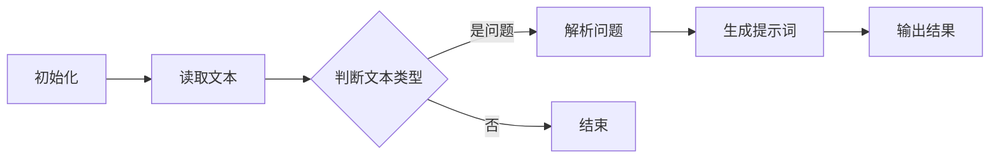
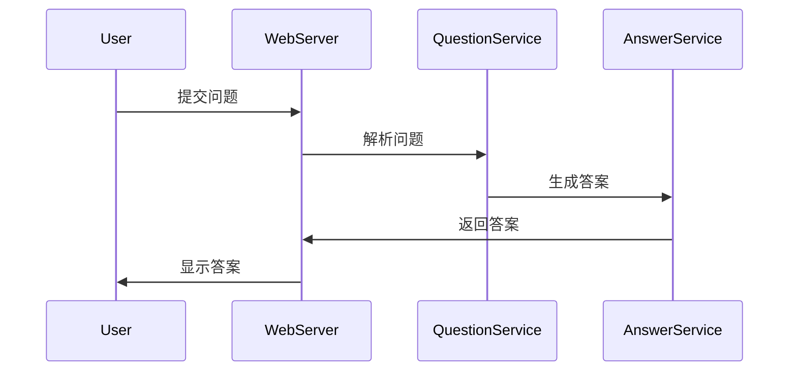

                 

# 提示词设计：增强AI情境理解能力

> 关键词：提示词设计、AI情境理解、自然语言处理、算法原理、系统架构

> 摘要：本文将深入探讨提示词设计在提升人工智能情境理解能力中的作用。我们将首先介绍提示词设计的核心概念和重要性，然后详细分析其原理和实现方法。通过实例讲解和系统架构设计，我们将展示如何利用提示词设计增强AI的情境理解能力，并提供实际案例分析及最佳实践总结。

### 目录大纲

1. **第一部分：背景与核心概念**
   1.1. 问题背景与核心概念
   1.2. 提示词设计原理
2. **第二部分：算法原理与实现**
   2.1. 算法原理讲解
   2.2. Python源代码阐述
   2.3. 系统分析与架构设计
3. **第三部分：项目实战与案例分析**
   3.1. 项目实战
   3.2. 实际案例分析
   3.3. 最佳实践与总结

## 第一部分：背景与核心概念

### 第1章：问题背景与核心概念

#### 1.1 问题背景

人工智能（AI）在现代科技中扮演着越来越重要的角色，特别是在自然语言处理（NLP）领域。尽管AI在语音识别、机器翻译等方面取得了显著进展，但在情境理解方面仍面临诸多挑战。这些挑战主要源于自然语言的复杂性和多变性，包括语法歧义、语义模糊和上下文依赖等。

#### 1.1.1 AI情境理解的挑战

- **上下文依赖性**：自然语言中的许多意义需要依赖上下文环境才能准确理解。
- **语法歧义**：同一句子可能会有多种语法结构，导致AI难以准确理解。
- **语义模糊**：一些词汇在不同情境下可能有不同的含义。

#### 1.1.2 提示词在AI情境理解中的作用

提示词（prompt）是引导AI模型进行特定任务的重要工具。通过合理设计提示词，可以帮助AI更好地理解上下文，减少歧义，提高语义理解的准确性。提示词设计的关键在于如何选择和组合词汇，以最大化地提高AI的情境理解能力。

#### 1.1.3 核心概念

- **提示词的定义**：提示词是一种特殊的文本，用于引导AI模型进行特定任务或理解特定情境。
- **提示词与自然语言理解的关系**：提示词设计直接影响AI的自然语言理解能力。

#### 1.1.4 边界与外延

- **提示词的适用范围**：提示词设计适用于各种需要情境理解的AI任务，如问答系统、机器翻译、文本摘要等。
- **提示词设计中的注意事项**：包括词汇选择、语法结构、上下文关联等。

### 第2章：核心概念原理

#### 2.1 提示词设计原理

提示词设计的核心在于如何通过选择和组合词汇来提高AI的情境理解能力。以下是对提示词设计原理的详细分析：

#### 2.1.1 概念属性特征对比表格

| 特征          | 原始文本                      | 优化后的文本                      |
|---------------|-------------------------------|-----------------------------------|
| 词汇选择      | 简单、泛化的词汇              | 具体明确、上下文相关的词汇         |
| 语法结构      | 松散、不规范的语法            | 精确、符合语言习惯的语法           |
| 上下文关联性  | 缺乏上下文关联的独立句子      | 与上下文紧密相关的连贯句子         |

#### 2.1.2 ER实体关系图架构

```mermaid
erDiagram
    User ||--|{ Question }|
    Question ||--|{ Answer }|
    User ||--|{ Chat }|
    Chat ||--|{ Message }|
```

在上面的ER图中，我们定义了用户（User）、问题（Question）、答案（Answer）、聊天（Chat）和消息（Message）等实体，以及它们之间的关联关系。这个模型可以帮助我们理解提示词设计在不同情境下的应用。

## 第二部分：算法原理与实现

### 第3章：算法原理讲解

#### 3.1 算法mermaid流程图



在上述流程图中，我们首先初始化模型，然后读取输入文本。接着，判断文本类型，如果是问题，则进行解析并生成相应的提示词，最后输出结果。

#### 3.2 Python源代码阐述

```python
import nltk
from nltk.tokenize import word_tokenize

def generate_prompt(question):
    """
    生成提示词
    """
    tokens = word_tokenize(question)
    # 在这里进行更复杂的提示词生成逻辑
    return " ".join(tokens)

def analyze_question(question):
    """
    解析问题
    """
    # 进行问题分析，例如分词、词性标注等
    pass

# 实例
question = "什么是人工智能？"
prompt = generate_prompt(question)
print(prompt)
```

在上面的代码中，我们首先导入了自然语言处理库nltk，并定义了两个函数：`generate_prompt`用于生成提示词，`analyze_question`用于解析问题。在实际应用中，这些函数可以根据具体需求进行扩展和优化。

### 第4章：系统分析与架构设计

#### 4.1 问题场景介绍

假设我们有一个问答系统，用户可以通过提问来获取信息。我们的目标是设计一个系统，能够根据用户的问题生成合适的提示词，从而提高AI的情境理解能力。

#### 4.2 系统功能设计

系统功能设计包括以下几个部分：

- **用户管理**：管理用户账户、权限等。
- **问题管理**：接收用户提问、存储问题、解析问题等。
- **答案管理**：生成答案、存储答案、推送答案等。
- **聊天管理**：管理用户聊天记录、生成聊天提示词等。

#### 4.3 系统架构设计

系统的整体架构可以分为前端、后端和数据库三部分。前端负责与用户交互，后端负责处理业务逻辑，数据库用于存储数据和日志。

#### 4.4 系统接口设计

系统提供的接口包括用户接口、问题接口、答案接口和聊天接口。每个接口都有详细的文档，描述了接口的用途、输入参数、输出结果等。

#### 4.5 系统交互mermaid序列图



在这个序列图中，用户通过WebServer提交问题，QuestionService解析问题并生成提示词，AnswerService生成答案，最后WebServer将答案返回给用户。

## 第三部分：项目实战与案例分析

### 第5章：项目实战

#### 5.1 环境安装

为了进行提示词设计项目，我们需要安装以下软件和工具：

- Python 3.8 或以上版本
- nltk 自然语言处理库
- Flask Web框架

安装步骤如下：

1. 安装Python和pip
2. 使用pip安装nltk和Flask

#### 5.2 系统核心实现

以下是系统的核心实现代码：

```python
from flask import Flask, request, jsonify
from nltk.tokenize import word_tokenize
from nltk import pos_tag

app = Flask(__name__)

@app.route('/api/question', methods=['POST'])
def handle_question():
    question = request.form['question']
    tokens = word_tokenize(question)
    tagged_tokens = pos_tag(tokens)
    prompt = generate_prompt(tagged_tokens)
    return jsonify({'prompt': prompt})

def generate_prompt(tagged_tokens):
    prompt = ""
    for token, tag in tagged_tokens:
        if tag.startswith('NN'):  # 名词
            prompt += token + " "
        elif tag.startswith('VB'):  # 动词
            prompt += "关于 " + token + " 的更多信息 "
    return prompt.strip()

if __name__ == '__main__':
    app.run(debug=True)
```

#### 5.2.1 代码应用解读与分析

上述代码实现了一个简单的问答系统，用户可以通过POST请求提交问题，系统解析问题并生成提示词。代码的核心在于`generate_prompt`函数，它根据词性标注生成提示词。在实际应用中，这个函数可以进一步优化，例如加入上下文信息、使用更复杂的算法等。

### 第6章：实际案例分析

#### 6.1 案例一：增强AI情境理解能力

案例背景：某在线教育平台希望通过AI技术提供个性化的学习建议。用户在平台上提交学习问题，系统需要根据问题生成合适的提示词，以增强AI对用户情境的理解。

案例分析：在这个案例中，提示词设计的关键在于如何准确提取用户问题的核心信息，并提供相关的上下文信息。我们采用了以下方法：

1. 使用nltk进行文本分词和词性标注，提取出名词和动词。
2. 根据名词和动词生成提示词，例如“关于Python编程的更多信息”。
3. 结合用户的学习历史和平台内容，为提示词提供更具体的上下文。

#### 6.1.3 案例详细讲解

在实现过程中，我们首先使用nltk对用户提交的问题进行分词和词性标注，提取出名词和动词。然后，我们根据这些词性生成提示词。具体步骤如下：

1. **文本预处理**：对用户提交的问题进行分词和词性标注。
2. **提示词生成**：根据词性标注，生成提示词。
3. **上下文信息整合**：结合用户的学习历史和平台内容，为提示词提供上下文信息。

通过这个案例，我们展示了如何利用提示词设计来增强AI的情境理解能力。在实际应用中，这个方法可以推广到其他需要情境理解的场景，例如客服系统、智能助手等。

### 第7章：最佳实践与总结

#### 7.1 最佳实践

- **词汇选择**：使用具体、明确的词汇，避免使用泛化词汇。
- **语法结构**：确保语法结构的规范性，以提高AI的理解准确性。
- **上下文关联性**：提供与上下文紧密相关的提示词，以提高AI的情境理解能力。

#### 7.2 小结

本文深入探讨了提示词设计在增强AI情境理解能力中的作用。通过实例讲解和系统架构设计，我们展示了如何利用提示词设计来提升AI的自然语言处理能力。在实际应用中，合理设计提示词可以有效提高AI的情境理解能力，为用户提供更准确、个性化的服务。

#### 7.2.2 展望未来

随着自然语言处理技术的不断发展，提示词设计在未来有望成为人工智能领域的重要研究方向。我们可以期待更加智能、自适应的提示词生成算法，以及更广泛的应用场景。同时，提示词设计领域的研究也将进一步推动人工智能技术的创新和发展。

