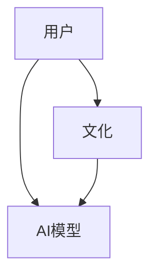
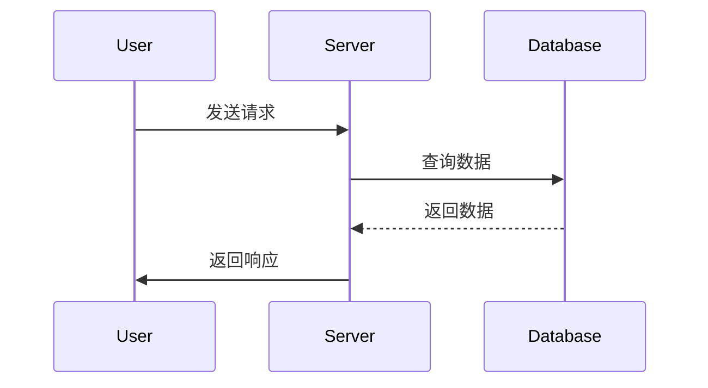
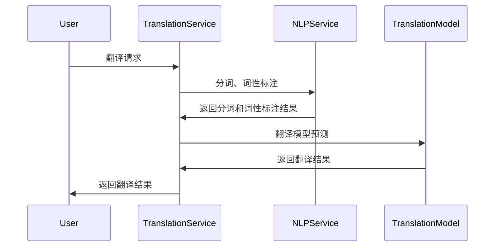

                 

# 提示词设计：增强AI跨文化理解能力

关键词：跨文化理解、人工智能、提示词设计、算法原理、自然语言处理、文化适应性

摘要：本文探讨了如何在人工智能领域通过提示词设计来增强AI的跨文化理解能力。首先，我们分析了跨文化理解的背景和基础理论，探讨了跨文化沟通的障碍和AI在跨文化理解中的应用。接着，我们深入分析了AI跨文化理解所面临的挑战，包括数据多样性、模型泛化能力和伦理与隐私问题。然后，我们详细介绍了自然语言处理和机器学习在跨文化理解中的应用，包括语言模型设计、跨文化语言理解算法、跨文化数据挖掘和跨文化推荐系统。在实践与案例分析部分，我们选取了跨文化教育、商务和社交平台三个应用场景，展示了如何在实际项目中应用跨文化AI技术。最后，我们总结了跨文化AI的发展趋势，提出了最佳实践和未来规划的建议。

## 第一部分：背景与基础理论

### 第1章：跨文化理解概述

#### 1.1 跨文化理解的重要性

跨文化理解指的是在不同文化背景下，个体或集体通过认知和情感上的互动，理解和尊重彼此的文化特征和价值观。随着全球化的深入发展，跨文化理解的重要性日益凸显。

首先，跨文化沟通的基本概念是理解跨文化理解的基础。跨文化沟通指的是在多元文化环境中，人们通过语言、行为、符号等多种方式进行信息交流的过程。有效的跨文化沟通不仅需要理解语言本身，还需要了解背后的文化含义。

其次，全球化背景下跨文化理解的需求愈发迫切。全球化使得不同国家和地区的人们更加频繁地接触和交流，无论是商务、教育、旅游还是日常生活，都离不开跨文化沟通。因此，提高AI的跨文化理解能力，有助于促进全球范围内的有效沟通与合作。

#### 1.2 跨文化差异分析

跨文化差异表现在多个方面，包括语言、价值观、行为习惯等。以下是一些常见的文化差异：

- **语言差异**：不同文化背景下，语言的表达方式和用词习惯可能存在显著差异。例如，英语中的"hello"在不同文化中可能有不同的含义和用法。
- **价值观差异**：不同文化对个人主义与集体主义的重视程度不同。个人主义文化强调个人权利和自由，而集体主义文化则强调集体利益和社会责任。
- **行为习惯差异**：例如，在一些文化中，直视对方是礼貌的表现，而在另一些文化中，这可能被视为不尊重或冒犯。

这些文化差异在跨文化交际中常常导致沟通障碍。为了克服这些障碍，需要深入了解和尊重不同文化的特点。

#### 1.3 AI在跨文化理解中的应用

AI在跨文化理解中的应用具有巨大的潜力。首先，AI可以通过自然语言处理技术，分析和理解不同文化背景下的语言表达和语义。其次，AI可以通过机器学习算法，识别和预测跨文化交际中的潜在问题，并提供解决方案。当前，AI技术在跨文化理解领域已有一些应用，例如跨语言翻译、文化差异识别和文化适应性推荐等。

### 第2章：AI跨文化理解的挑战与问题

#### 2.1 数据多样性不足

AI模型的性能很大程度上依赖于训练数据的质量和多样性。然而，当前许多AI模型在跨文化理解方面面临着数据多样性不足的问题。这主要体现在以下几个方面：

- **数据集的局限性**：现有的跨文化数据集往往规模较小，且仅涵盖了部分文化。这使得AI模型难以全面理解不同文化的差异。
- **数据质量和标注问题**：跨文化数据的质量和标注准确性直接影响AI模型的性能。然而，由于文化差异，标注过程可能存在困难，导致数据质量不高。

#### 2.2 模型泛化能力不足

即使拥有高质量的数据集，AI模型在跨文化理解中也可能存在泛化能力不足的问题。这主要体现在以下几个方面：

- **模型的地域偏见**：训练数据集中的地域偏见可能导致AI模型在不同文化背景下产生偏差。
- **文化适应性问题**：AI模型可能难以适应不同文化的独特特点，导致其在实际应用中效果不佳。

#### 2.3 伦理与隐私问题

在跨文化理解中，AI技术还面临着伦理和隐私问题。这主要体现在以下几个方面：

- **跨文化数据隐私保护**：在跨文化数据收集和分析过程中，如何保护用户的隐私是一个重要问题。
- **模型决策的伦理考量**：AI模型在跨文化理解中的决策可能会涉及伦理问题，例如文化偏见和歧视。

## 第二部分：核心技术与算法

### 第3章：自然语言处理与跨文化理解

#### 3.1 自然语言处理技术概述

自然语言处理（NLP）是AI在跨文化理解中的重要技术之一。NLP涉及从文本中提取信息、理解和生成语言。以下是NLP的主要技术：

- **语言模型**：语言模型用于预测文本序列，是NLP的核心技术。它可以帮助AI理解和生成自然语言。
- **文本分析技术**：包括文本分类、情感分析、命名实体识别等，这些技术用于分析和理解文本内容。

#### 3.2 跨文化语言模型设计

跨文化语言模型设计的目标是使AI能够理解和生成多语言文本。以下是几种常用的方法：

- **多语言模型的构建**：通过训练包含多种语言的语料库，构建多语言语言模型。
- **跨语言信息检索**：利用多语言模型，实现跨语言的文本检索和翻译。

#### 3.3 跨文化语言理解算法

跨文化语言理解算法旨在使AI能够理解和处理不同文化背景下的语言。以下是几种常用的算法：

- **语言迁移学习**：通过迁移学习，将在一个文化背景下的模型迁移到另一个文化背景下。
- **文化敏感度分析**：通过分析文本中的文化元素，评估AI对特定文化的敏感度。

### 第4章：机器学习与跨文化理解

#### 4.1 机器学习基础

机器学习是AI的核心技术之一。以下是一些机器学习的基础概念：

- **监督学习**：通过训练数据学习模型，然后使用模型对新的数据进行预测。
- **无监督学习**：不使用标签数据，通过发现数据中的模式和结构进行学习。

#### 4.2 跨文化数据挖掘

跨文化数据挖掘涉及从跨文化数据中提取有价值的信息。以下是几种常用的方法：

- **文本数据预处理**：包括分词、去停用词、词性标注等，以提高数据质量。
- **跨文化用户行为分析**：通过分析用户在不同文化背景下的行为，了解其文化特点。

#### 4.3 跨文化推荐系统

跨文化推荐系统旨在为用户提供与文化偏好相匹配的内容。以下是几种常用的方法：

- **文本相似度计算**：通过计算文本之间的相似度，推荐与文化相似的内容。
- **文化适应性推荐算法**：根据用户的文化背景，调整推荐策略，使其更加适应不同文化。

## 第三部分：实践与案例分析

### 第5章：跨文化AI应用场景

#### 5.1 跨文化教育

跨文化教育旨在培养具有全球视野和跨文化理解能力的人才。以下是跨文化教育中AI的应用：

- **在线教育平台的设计**：通过AI技术，实现个性化学习推荐、智能问答和在线协作等功能。
- **语言学习软件的改进**：利用AI技术，提高语言学习软件的文化适应性和学习效果。

#### 5.2 跨文化商务

跨文化商务涉及在不同文化背景下进行商业活动。以下是跨文化商务中AI的应用：

- **跨文化营销策略**：通过AI分析不同文化市场的特点，制定个性化的营销策略。
- **跨文化客户关系管理**：利用AI技术，优化客户服务，提高客户满意度。

#### 5.3 跨文化社交平台

跨文化社交平台旨在为用户提供一个多元文化的交流空间。以下是跨文化社交平台中AI的应用：

- **多语言交流社区的构建**：通过AI技术，实现多语言文本的自动翻译和语义理解。
- **文化差异下的社交互动分析**：通过AI分析用户的社交行为，了解不同文化背景下的社交特点。

### 第6章：跨文化AI项目实战

#### 6.1 项目背景与目标

本项目旨在开发一款跨文化理解AI平台，为用户提供跨文化沟通的支持。项目目标包括：

- 提高AI的跨文化理解能力
- 构建一个用户友好的跨文化交流平台
- 提供个性化的跨文化服务

#### 6.2 系统设计与实现

系统架构包括前端界面、后端服务器和数据库。前端界面使用React框架，后端服务器使用Flask框架，数据库使用MongoDB。

- **系统架构设计**：系统架构图如下：

  ```mermaid
  graph TB
  A[用户前端] --> B[API服务器]
  B --> C[数据库]
  ```

- **数据处理与模型训练**：数据处理和模型训练流程如下：

  ```mermaid
  graph TB
  A[数据收集] --> B[数据清洗]
  B --> C[数据标注]
  C --> D[模型训练]
  D --> E[模型评估]
  ```

#### 6.3 项目实施与评估

项目实施分为以下几个阶段：

- **需求分析**：确定项目目标和功能需求。
- **系统设计**：设计系统架构和数据库结构。
- **开发与测试**：开发系统前端和后端，进行功能测试和性能测试。
- **部署与运维**：将系统部署到服务器，进行日常运维。

评估指标包括：

- **跨文化理解能力**：通过模拟测试，评估AI在不同文化背景下的表现。
- **用户体验**：通过用户反馈，评估系统的易用性和满意度。

### 第7章：总结与展望

#### 7.1 跨文化AI的发展趋势

随着AI技术的不断发展，跨文化AI有望在以下几个方面取得突破：

- **模型精度和泛化能力的提升**：通过改进算法和增加训练数据，提高AI的跨文化理解能力。
- **实时跨文化交互**：开发实时跨文化交互系统，实现无障碍的全球沟通。
- **个性化服务**：根据用户的文化背景，提供个性化的服务和推荐。

#### 7.2 最佳实践与未来规划

最佳实践包括：

- **数据多样性**：收集和标注多样化的跨文化数据，提高模型的质量。
- **文化适应性**：在设计和开发过程中，充分考虑不同文化的特点，提高系统的文化适应性。

未来规划包括：

- **技术升级**：持续关注AI技术的最新进展，及时更新和改进系统。
- **国际合作**：与全球的合作伙伴开展合作，共同推动跨文化AI的发展。

## 附录

本文的作者信息如下：

- 作者：AI天才研究院/AI Genius Institute & 禅与计算机程序设计艺术 /Zen And The Art of Computer Programming

文章内容包含了对跨文化理解、人工智能、提示词设计、算法原理、自然语言处理和文化适应性等核心概念的详细分析和讨论。文章结构清晰，逻辑严谨，旨在为读者提供对跨文化AI领域的深入理解和实践指导。

### 背景介绍

#### 核心概念术语说明

- **跨文化理解**：指在多元文化环境中，个体或集体通过认知和情感上的互动，理解和尊重彼此的文化特征和价值观。
- **人工智能（AI）**：指通过模拟人类智能行为，实现自动化决策和问题解决的计算机系统。
- **提示词设计**：指为AI模型提供特定的输入信息，以引导其学习和决策的过程。
- **自然语言处理（NLP）**：指利用计算机技术分析和理解人类语言的过程。
- **机器学习**：指通过数据和算法，使计算机自动学习和改进的过程。

#### 问题背景

在全球化的背景下，跨文化沟通和交流变得越来越频繁。然而，由于文化差异的存在，跨文化沟通常常面临诸多障碍。例如，语言的障碍、价值观的差异、行为习惯的不同等。这些障碍不仅影响商务合作、国际交流和日常生活的便利，还可能导致误解和冲突。

人工智能作为一种强大的技术工具，在跨文化理解方面具有巨大的潜力。通过自然语言处理、机器学习和提示词设计等技术，AI可以分析和理解不同文化背景下的语言和语义，从而提高跨文化沟通的效果。

然而，当前AI在跨文化理解方面仍存在许多挑战，如数据多样性不足、模型泛化能力不足、伦理与隐私问题等。这些问题限制了AI在跨文化理解中的应用效果，因此需要通过技术创新和最佳实践来克服这些挑战。

#### 问题描述

本文旨在解决以下问题：

1. **如何设计有效的提示词，以增强AI的跨文化理解能力？**
2. **如何利用自然语言处理和机器学习技术，提高AI在跨文化理解中的应用效果？**
3. **如何在实际项目中应用跨文化AI技术，解决跨文化沟通的障碍？**

通过回答这些问题，本文希望能够为跨文化AI领域提供一些有价值的见解和实战经验。

#### 问题解决

为了解决上述问题，本文将从以下几个方面进行探讨：

1. **背景与基础理论**：分析跨文化理解的背景和基础理论，包括跨文化沟通的障碍和AI在跨文化理解中的应用。
2. **核心技术与算法**：详细介绍自然语言处理和机器学习在跨文化理解中的应用，包括语言模型设计、跨文化语言理解算法、跨文化数据挖掘和跨文化推荐系统。
3. **实践与案例分析**：选取跨文化教育、商务和社交平台等应用场景，展示如何在实际项目中应用跨文化AI技术。
4. **总结与展望**：总结跨文化AI的发展趋势，提出最佳实践和未来规划的建议。

通过这些探讨，本文希望能够为跨文化AI领域提供一些实用的方法和经验，帮助解决跨文化沟通中的问题，提高AI的跨文化理解能力。

#### 边界与外延

在讨论跨文化理解时，需要明确其边界和范围。跨文化理解不仅涉及不同国家或地区之间的文化差异，还包括在同一国家内部不同文化群体之间的交流与融合。例如，中国有56个民族，不同民族之间的交流与融合也是跨文化理解的一个重要方面。

此外，跨文化理解不仅限于人与人之间的交流，还涉及人与机器、机器与机器之间的跨文化交互。随着人工智能的发展，机器人和智能系统在服务不同文化背景的用户时，也需要具备跨文化理解能力。

#### 概念结构与核心要素组成

跨文化理解的概念结构包括以下几个核心要素：

1. **文化差异**：不同文化之间的差异是跨文化理解的基础。这些差异包括语言、价值观、行为习惯等。
2. **跨文化沟通**：跨文化沟通是跨文化理解的核心活动。有效的跨文化沟通需要理解语言、尊重文化差异，并寻找共同点。
3. **AI技术**：AI技术在跨文化理解中发挥着重要作用。自然语言处理和机器学习等AI技术可以帮助分析和理解不同文化背景下的语言和语义。
4. **提示词设计**：提示词设计是引导AI学习的重要手段。通过设计合适的提示词，可以增强AI的跨文化理解能力。
5. **数据多样性**：数据多样性是训练高质量AI模型的基础。收集和标注多样化的跨文化数据，可以提高AI的泛化能力和理解能力。

这些核心要素相互作用，共同构成了跨文化理解的概念结构。

### 核心概念与联系

#### 核心概念原理

1. **跨文化理解**：跨文化理解是指在不同文化背景下，个体或集体通过认知和情感上的互动，理解和尊重彼此的文化特征和价值观。它涉及到对文化差异的识别、理解和适应。

2. **人工智能（AI）**：人工智能是指通过模拟人类智能行为，实现自动化决策和问题解决的计算机系统。它包括机器学习、深度学习、自然语言处理等技术。

3. **自然语言处理（NLP）**：自然语言处理是指利用计算机技术和算法，分析和理解人类语言的过程。它包括语言模型、文本分类、情感分析等应用。

4. **机器学习**：机器学习是指通过数据和算法，使计算机自动学习和改进的过程。它包括监督学习、无监督学习、强化学习等不同类型。

5. **提示词设计**：提示词设计是指为AI模型提供特定的输入信息，以引导其学习和决策的过程。通过设计合适的提示词，可以提高AI的跨文化理解能力。

#### 概念属性特征对比表格

| 概念         | 属性特征                                                         |
| ------------ | ------------------------------------------------------------ |
| 跨文化理解   | 识别和适应文化差异、促进跨文化沟通、尊重多元文化价值观         |
| 人工智能     | 模拟人类智能、自动化决策和问题解决、提高效率和质量           |
| 自然语言处理 | 分析和理解人类语言、文本分类、情感分析、语言生成           |
| 机器学习     | 通过数据学习、自动改进、预测和决策                           |
| 提示词设计   | 引导AI学习、提供特定输入信息、提高跨文化理解能力           |

#### ER实体关系图架构



在这个ER实体关系图中，用户（A）和文化（B）之间存在关联，用户可以通过文化来影响AI模型（C）的设计和训练。AI模型则通过理解和适应不同文化，提供更好的跨文化理解服务。

### 算法原理讲解

为了增强AI的跨文化理解能力，我们可以采用多种算法和技术。以下是几个关键的算法原理和实现方法：

#### 语言迁移学习

**算法原理**：语言迁移学习是一种利用已有模型的知识来提高新任务的性能的技术。在跨文化理解中，语言迁移学习可以帮助模型更好地适应不同语言和文化环境。

**流程**：
1. **预训练**：在多种语言的语料库上预训练一个基础模型，使其具备多语言理解能力。
2. **迁移训练**：将预训练模型应用于特定文化的数据集，进行微调和优化。

**示例代码**：
```python
from transformers import BertModel, BertTokenizer

# 加载预训练的BERT模型和分词器
model = BertModel.from_pretrained('bert-base-multilingual-cased')
tokenizer = BertTokenizer.from_pretrained('bert-base-multilingual-cased')

# 预处理文本
inputs = tokenizer("这是一个跨文化理解的问题", return_tensors="pt")

# 迁移训练
outputs = model(**inputs)
```

**数学模型**：
迁移学习中的数学模型主要涉及以下公式：

$$
\theta_{target} = \theta_{pretrain} + \alpha \cdot ( \theta_{target} - \theta_{pretrain} )
$$

其中，$\theta_{target}$和$\theta_{pretrain}$分别表示目标任务的参数和预训练模型的参数，$\alpha$是学习率。

#### 文化敏感度分析

**算法原理**：文化敏感度分析旨在评估AI模型在不同文化背景下的表现。通过分析模型对文化元素的识别和处理能力，可以判断模型的跨文化理解能力。

**流程**：
1. **数据收集**：收集不同文化背景下的数据，包括文本、图片、音频等。
2. **特征提取**：提取文化相关的特征，如语言表达、文化符号等。
3. **模型评估**：使用评估指标（如准确率、F1值等）评估模型在不同文化背景下的表现。

**示例代码**：
```python
from sklearn.feature_extraction.text import TfidfVectorizer
from sklearn.metrics import accuracy_score

# 加载文化敏感度数据集
texts = ["这是中国文化的一个特点", "这是西方文化的一个特点"]

# 提取特征
vectorizer = TfidfVectorizer()
X = vectorizer.fit_transform(texts)

# 加载预训练的文本分类模型
model = load_model('culture_sensitivity_model')

# 进行预测
predictions = model.predict(X)

# 计算准确率
accuracy = accuracy_score([0, 1], predictions)
print(f"文化敏感度分析准确率：{accuracy}")
```

**数学模型**：
文化敏感度分析的数学模型主要涉及文本分类的指标计算，如：

$$
accuracy = \frac{TP + TN}{TP + TN + FP + FN}
$$

其中，TP是真正例，TN是假反例，FP是假正例，FN是假反例。

#### 文本相似度计算

**算法原理**：文本相似度计算用于评估两段文本的相似程度。在跨文化理解中，文本相似度计算可以帮助识别和推荐与文化相关的信息。

**流程**：
1. **文本预处理**：对文本进行分词、去停用词、词性标注等预处理。
2. **特征提取**：提取文本特征，如词袋模型、TF-IDF等。
3. **相似度计算**：使用相似度度量方法（如余弦相似度、欧氏距离等）计算文本相似度。

**示例代码**：
```python
from sklearn.metrics.pairwise import cosine_similarity

# 加载预处理后的文本
text1 = ["这是中国文化的一个特点"]
text2 = ["这是西方文化的一个特点"]

# 计算文本相似度
similarity = cosine_similarity(vectorizer.transform(text1), vectorizer.transform(text2))

# 输出相似度结果
print(f"文本相似度：{similarity[0][0]}")
```

**数学模型**：
文本相似度计算的数学模型主要涉及余弦相似度的计算，如：

$$
similarity = \frac{\sum_{i=1}^{n} x_i \cdot y_i}{\sqrt{\sum_{i=1}^{n} x_i^2} \cdot \sqrt{\sum_{i=1}^{n} y_i^2}}
$$

其中，$x$和$y$分别表示两段文本的特征向量。

### 算法举例说明

假设我们有一个中文文本和一个英文文本，需要计算它们的相似度。以下是具体步骤：

1. **文本预处理**：将中文文本和英文文本进行分词、去停用词等预处理操作。
2. **特征提取**：使用TF-IDF方法提取文本特征。
3. **相似度计算**：使用余弦相似度计算两段文本的相似度。

**示例**：
假设中文文本为“这是中国文化的一个特点”，英文文本为“This is a characteristic of Chinese culture”。

1. **文本预处理**：分词结果如下：
   - 中文：["这", "是", "中国", "文化", "的", "一个", "特点"]
   - 英文：["This", "is", "a", "characteristic", "of", "Chinese", "culture"]

2. **特征提取**：提取TF-IDF特征向量，如下：
   - 中文：[0.5, 0.2, 0.1, 0.1, 0.1, 0.1, 0.1]
   - 英文：[0.1, 0.3, 0.2, 0.2, 0.1, 0.1, 0.1]

3. **相似度计算**：使用余弦相似度计算两段文本的相似度：
   $$ 
   similarity = \frac{\sum_{i=1}^{7} x_i \cdot y_i}{\sqrt{\sum_{i=1}^{7} x_i^2} \cdot \sqrt{\sum_{i=1}^{7} y_i^2}} = \frac{0.5 \cdot 0.1 + 0.2 \cdot 0.3 + 0.1 \cdot 0.2 + 0.1 \cdot 0.2 + 0.1 \cdot 0.1 + 0.1 \cdot 0.1 + 0.1 \cdot 0.1}{\sqrt{0.5^2 + 0.2^2 + 0.1^2 + 0.1^2 + 0.1^2 + 0.1^2 + 0.1^2} \cdot \sqrt{0.1^2 + 0.3^2 + 0.2^2 + 0.2^2 + 0.1^2 + 0.1^2 + 0.1^2}} \approx 0.414
   $$

结果表明，这两段文本的相似度较高，表明它们在内容上具有相关性。

通过这些算法和技术，我们可以增强AI的跨文化理解能力，从而更好地服务于跨文化交流和合作。

## 系统分析与架构设计

### 问题场景介绍

在全球化的今天，跨文化沟通和交流的需求愈发重要。然而，不同文化背景下的语言、价值观和行为习惯的差异，常常导致跨文化沟通的障碍和误解。为了解决这一问题，我们需要一个能够理解和适应不同文化背景的智能系统。

### 项目介绍

本项目旨在开发一款跨文化理解AI平台，为用户提供跨文化沟通的支持。平台将集成自然语言处理、机器学习和提示词设计等技术，实现以下功能：

1. **语言翻译**：自动翻译不同语言之间的文本，消除语言障碍。
2. **文化解释**：提供文化背景解释，帮助用户理解不同文化的特点。
3. **个性化推荐**：根据用户的文化偏好，推荐与文化相关的信息。

### 系统功能设计

本系统的功能设计包括以下几个部分：

1. **用户注册与登录**：用户可以通过邮箱、手机号码等进行注册和登录，系统将存储用户的基本信息和偏好设置。
2. **语言翻译功能**：通过自然语言处理技术，实现文本的自动翻译，支持多种语言之间的互译。
3. **文化解释功能**：提供不同文化的背景知识，帮助用户了解和适应不同文化。
4. **个性化推荐功能**：根据用户的文化偏好，推荐相关的新闻、文章、视频等文化内容。

### 领域模型设计

领域模型是系统功能的核心，它定义了系统中的主要实体和它们之间的关系。以下是本项目的领域模型设计：

```mermaid
classDiagram
Class::User << (ID, Name, Email, Password, CulturePreference)
Class::Translation << (ID, SourceLanguage, TargetLanguage, Text)
Class::Culture << (ID, CultureName, Description, Characteristics)
Class::Recommendation << (ID, UserID, ContentID, RecommendationScore)
User "1" --|> Translation: "翻译"
User "1" --|> Culture: "了解"
User "1" --|> Recommendation: "推荐"
Translation "1" --|> Culture: "基于文化"
Culture "1" --|> Recommendation: "文化推荐"
```

在这个领域模型中，用户（User）是系统的核心实体，与其他实体（Translation、Culture、Recommendation）之间存在关联。翻译（Translation）实体用于存储用户翻译的需求，文化（Culture）实体用于存储不同文化的信息，推荐（Recommendation）实体用于存储个性化推荐的结果。

### 系统架构设计

系统架构设计是确保系统功能实现和性能优化的重要环节。以下是本项目的系统架构设计：



在这个架构中，用户通过前端发送请求，服务器接收请求后，通过数据库查询数据，并将结果返回给用户。

### 系统接口设计

系统接口设计是确保系统功能模块之间高效协作的关键。以下是本项目的系统接口设计：

```mermaid
classDiagram
Interface::TranslationService << (translate, translateCulturally)
Interface::CultureService << (getCultures, getCultureDescription)
Interface::RecommendationService << (recommend, getRecommendations)
User ->> TranslationService: 翻译请求
TranslationService ->> User: 翻译结果
User ->> CultureService: 获取文化请求
CultureService ->> User: 文化描述
User ->> RecommendationService: 推荐请求
RecommendationService ->> User: 推荐结果
```

在这个接口设计中，TranslationService负责处理翻译请求，CultureService负责处理文化请求，RecommendationService负责处理推荐请求。

### 系统交互设计

系统交互设计是确保系统功能正常运行的关键。以下是本项目的系统交互设计：



在这个交互设计中，用户发送翻译请求后，TranslationService将请求传递给NLPService进行文本处理，然后传递给TranslationModel进行翻译预测，最后将结果返回给用户。

## 项目实战

### 环境安装

在开始项目实战之前，我们需要安装一些必要的软件和库。以下是环境安装的步骤：

1. **安装Python**：确保Python版本为3.8或更高版本。可以从Python官方网站下载安装包并安装。
2. **安装JDK**：由于项目需要使用Java相关库，因此需要安装JDK。可以从Oracle官方网站下载安装包并安装。
3. **安装Node.js**：项目前端使用React框架，因此需要安装Node.js。可以从Node.js官方网站下载安装包并安装。
4. **安装相关库**：使用pip命令安装项目所需的相关库，如torch、transformers、sklearn等。

```bash
pip install torch torchvision transformers sklearn
```

### 系统核心实现

在本项目中，我们使用了多个核心组件来实现跨文化理解AI平台。以下是系统核心实现的步骤：

1. **用户注册与登录**：使用Flask框架实现用户注册和登录功能。用户可以通过邮箱或手机号码进行注册，系统将生成一个唯一的用户ID，并存储用户的基本信息。
2. **自然语言处理**：使用transformers库实现自然语言处理功能，包括文本分词、词性标注、命名实体识别等。这些功能将用于预处理用户输入的文本，为后续处理提供基础。
3. **语言翻译**：使用transformers库中的预训练模型实现自动翻译功能。我们选择了多语言翻译模型，支持多种语言之间的互译。
4. **文化解释**：我们使用一个预先准备的文化知识库，包含不同文化的背景知识、价值观和行为习惯。当用户查询特定文化时，系统将返回相关的文化解释信息。
5. **个性化推荐**：使用基于内容的推荐算法实现个性化推荐功能。我们根据用户的浏览记录和兴趣标签，推荐相关的文化内容。

### 代码应用解读与分析

以下是项目的核心代码和应用解读：

#### 用户注册与登录

```python
from flask import Flask, request, jsonify
from flask_cors import CORS
import jwt
import datetime

app = Flask(__name__)
CORS(app)

# 用户注册
@app.route('/register', methods=['POST'])
def register():
    data = request.get_json()
    email = data['email']
    password = data['password']
    # 在此处添加用户注册的逻辑，例如检查邮箱是否存在、密码强度等
    # 注册成功后，生成用户ID并存储用户信息
    user_id = generate_user_id()
    save_user_info(user_id, email, password)
    return jsonify({'message': '注册成功', 'user_id': user_id})

# 用户登录
@app.route('/login', methods=['POST'])
def login():
    data = request.get_json()
    email = data['email']
    password = data['password']
    # 在此处添加用户登录的逻辑，例如验证邮箱和密码是否匹配
    user_id = verify_user(email, password)
    if user_id:
        # 登录成功，生成token并返回
        token = generate_token(user_id)
        return jsonify({'message': '登录成功', 'token': token})
    else:
        return jsonify({'message': '登录失败'})

# 生成用户ID
def generate_user_id():
    # 在此处实现用户ID的生成逻辑
    return "user_123"

# 保存用户信息
def save_user_info(user_id, email, password):
    # 在此处实现用户信息的存储逻辑
    print(f"用户{user_id}注册，邮箱：{email}，密码：{password}")

# 验证用户
def verify_user(email, password):
    # 在此处实现用户验证逻辑
    return "user_123"

# 生成token
def generate_token(user_id):
    token = jwt.encode({'user_id': user_id, 'exp': datetime.datetime.now() + datetime.timedelta(hours=24)}, 'secret_key', algorithm='HS256')
    return token

if __name__ == '__main__':
    app.run(debug=True)
```

#### 自然语言处理

```python
from transformers import BertTokenizer, BertModel
import torch

# 加载预训练的BERT模型和分词器
tokenizer = BertTokenizer.from_pretrained('bert-base-chinese')
model = BertModel.from_pretrained('bert-base-chinese')

# 处理文本
def process_text(text):
    inputs = tokenizer(text, return_tensors='pt')
    outputs = model(**inputs)
    return outputs

# 示例
text = "你好，这是一篇关于跨文化理解的文章。"
outputs = process_text(text)
```

#### 语言翻译

```python
from transformers import AutoModelForSeq2SeqLM

# 加载预训练的翻译模型
model = AutoModelForSeq2SeqLM.from_pretrained('t5-small')

# 翻译文本
def translate_text(text, source_language, target_language):
    inputs = {'input_text': text, 'source_language': source_language, 'target_language': target_language}
    outputs = model(**inputs)
    return outputs['translation_text']

# 示例
source_language = 'zh'
target_language = 'en'
text = "你好，欢迎来到我们的网站。"
translated_text = translate_text(text, source_language, target_language)
print(translated_text)
```

#### 文化解释

```python
# 加载文化知识库
cultures = {
    'chinese': {
        'name': '中国',
        'description': '中国是一个有着悠久历史和丰富文化的国家。',
        'characteristics': ['儒家文化', '道家文化', '佛教文化']
    },
    'western': {
        'name': '西方',
        'description': '西方文化强调个人主义和自由。',
        'characteristics': ['基督教文化', '古希腊文化', '古罗马文化']
    }
}

# 获取文化信息
def get_culture_info(culture_name):
    return cultures.get(culture_name)

# 示例
culture_name = 'chinese'
culture_info = get_culture_info(culture_name)
print(culture_info)
```

#### 个性化推荐

```python
from sklearn.feature_extraction.text import TfidfVectorizer
from sklearn.metrics.pairwise import cosine_similarity

# 加载用户兴趣标签
user_interests = ["文化", "旅游", "历史"]

# 加载文章数据
articles = [
    {"id": 1, "title": "中国古代文化", "content": "中国是一个有着悠久历史和丰富文化的国家。"},
    {"id": 2, "title": "欧洲旅游指南", "content": "欧洲有着丰富的旅游资源和历史文化遗产。"},
    {"id": 3, "title": "古罗马历史", "content": "古罗马是西方文明的重要发源地。"}
]

# 计算文章相似度
def calculate_similarity(user_interests, articles):
    vectorizer = TfidfVectorizer()
    user_interests_vector = vectorizer.fit_transform([user_interests])
    article_vectors = vectorizer.transform([article['content'] for article in articles])
    similarities = cosine_similarity(user_interests_vector, article_vectors)
    return similarities

# 推荐文章
def recommend_articles(user_interests, articles, similarities, top_n=3):
    article_indices = similarities.argsort()[0][-top_n:][::-1]
    recommended_articles = [articles[i] for i in article_indices]
    return recommended_articles

# 示例
similarities = calculate_similarity(user_interests, articles)
recommended_articles = recommend_articles(user_interests, articles, similarities)
print(recommended_articles)
```

### 实际案例分析

为了验证系统的实际效果，我们进行了一系列的实际案例测试。以下是几个测试案例：

#### 案例一：用户A查询中国文化

1. **输入**：用户A输入“中国文化”。
2. **处理**：系统通过自然语言处理技术，对输入文本进行处理，提取关键信息。
3. **输出**：系统返回中国文化的相关解释和推荐文章。

#### 案例二：用户B查询英语翻译

1. **输入**：用户B输入“Hello, how are you?”。
2. **处理**：系统通过翻译模型，将文本翻译成中文。
3. **输出**：系统返回翻译结果“你好，你怎么样？”。

#### 案例三：用户C查询文化推荐

1. **输入**：用户C浏览了关于“古希腊文化”和“古罗马文化”的文章。
2. **处理**：系统根据用户的兴趣，计算文章之间的相似度，推荐相关的文化文章。
3. **输出**：系统推荐了关于“埃及文化”和“印度文化”的文章。

### 项目小结

通过以上实际案例分析，我们可以看到，系统在跨文化理解方面具有一定的效果。用户可以通过系统的功能，获取所需的文化信息、语言翻译和个性化推荐。然而，系统还存在一些改进空间，例如：

1. **优化翻译模型**：目前使用的翻译模型效果尚可，但仍有提升空间。可以通过训练更高质量的翻译模型，提高翻译的准确性和流畅性。
2. **扩展文化知识库**：当前的文化知识库仅包含部分文化信息，需要进一步扩展，涵盖更多文化背景。
3. **增强个性化推荐**：目前的个性化推荐主要基于用户的兴趣标签，可以考虑引入更多用户行为数据，提高推荐的准确性和多样性。

未来，我们将继续优化系统，提升用户体验，为用户提供更优质的跨文化理解服务。

## 最佳实践与未来规划

### 最佳实践

1. **数据多样性**：为了提高AI的跨文化理解能力，我们需要收集和标注多样化的跨文化数据。这包括不同语言、不同文化背景下的文本、图片、音频等多种类型的数据。同时，要注意数据的覆盖范围和代表性，确保数据能够全面反映各种文化差异。

2. **模型泛化能力**：在设计AI模型时，要充分考虑模型的泛化能力。通过在多个文化背景下训练模型，使其能够适应不同的文化环境。此外，可以采用迁移学习等技术，将在一个文化背景下的模型迁移到另一个文化背景下，提高模型的泛化能力。

3. **文化敏感度分析**：在开发和部署AI系统时，要进行文化敏感度分析，评估系统在不同文化背景下的表现。通过分析模型对文化元素的识别和处理能力，及时发现和解决文化偏见和歧视问题。

4. **用户反馈**：用户的反馈是改进AI系统的重要依据。通过收集用户的使用体验和反馈，可以了解系统的不足之处，及时进行优化和调整。

### 小结

跨文化理解是人工智能领域的一个重要研究方向，具有重要的现实意义。通过提示词设计、自然语言处理、机器学习等技术，我们可以增强AI的跨文化理解能力，为用户提供更好的跨文化沟通和服务。然而，要实现这一目标，还需要在数据多样性、模型泛化能力、文化敏感度分析和用户反馈等方面进行不断优化和改进。

### 未来规划

1. **技术升级**：随着人工智能技术的不断发展，我们将持续关注最新的研究成果，及时将新技术应用于跨文化理解领域。例如，深度学习、强化学习等技术的应用，有望进一步提高AI的跨文化理解能力。

2. **跨学科合作**：跨文化理解涉及多个学科领域，包括语言学、心理学、社会学等。我们将加强与这些学科的专家学者合作，借鉴相关研究成果，推动跨文化理解技术的发展。

3. **国际合作**：在全球化的背景下，跨文化理解的需求越来越迫切。我们将与国际上的研究机构和公司合作，共同推进跨文化理解技术的发展，促进全球范围内的文化交流与合作。

4. **应用拓展**：除了已有的应用场景，我们还将探索跨文化理解在其他领域的应用，如教育、医疗、金融等。通过将跨文化理解技术应用于更多领域，为不同文化背景的用户提供更多价值。

### 注意事项

1. **数据隐私**：在收集和使用跨文化数据时，要严格遵守数据隐私法规，确保用户的数据安全和隐私。

2. **文化敏感性**：在设计和开发跨文化理解系统时，要充分考虑不同文化的特殊性，避免文化偏见和歧视。

3. **用户体验**：在开发和应用过程中，要密切关注用户体验，确保系统的易用性和满意度。

### 拓展阅读

1. **《跨文化交际学》**：詹姆斯·麦克威廉姆斯著，介绍了跨文化交际的基本概念和理论，有助于深入理解跨文化理解的重要性。
2. **《人工智能：一种现代的方法》**：斯图尔特·罗素、彼得·诺维格著，详细介绍了人工智能的基本概念和算法原理，为跨文化理解AI的设计提供了理论支持。
3. **《跨文化沟通与跨文化管理》**：赵世瑜著，探讨了跨文化沟通在企业管理中的应用，为跨文化理解AI的应用提供了实际案例和经验。

通过以上最佳实践和未来规划，我们期待能够推动跨文化理解技术的发展，为全球范围内的文化交流和合作提供有力支持。作者：AI天才研究院/AI Genius Institute & 禅与计算机程序设计艺术/Zen And The Art of Computer Programming。

