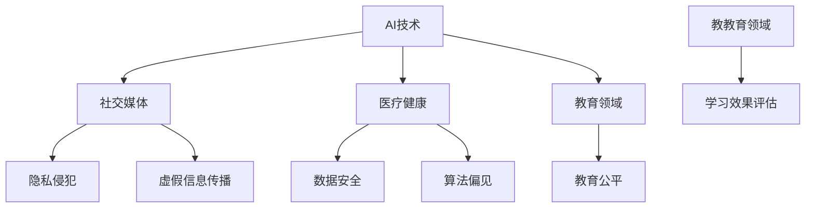
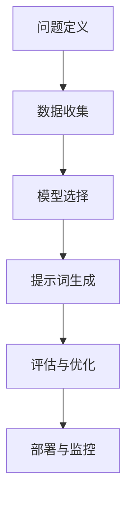

                 

### 第1章：问题背景与引言

#### 1.1.1 AI发展与伦理挑战

人工智能（AI）作为当今技术发展的前沿，已经在各个领域展现出巨大的潜力和应用价值。从自动化生产线、智能客服，到医疗诊断、金融分析，AI技术正在深刻改变我们的工作和生活方式。然而，随着AI技术的快速进步，也带来了诸多伦理挑战，引发了广泛的讨论和关注。

首先，AI技术在社交媒体领域的应用就引发了隐私侵犯和虚假信息传播的问题。例如，社交媒体平台通过AI算法推荐内容，可能加剧了信息茧房现象，使用户接收到的信息越来越偏向于自己的偏好，而减少了接触多元观点的机会。此外，AI算法在内容审核中可能存在偏见，导致某些群体受到不公平对待。

在医疗健康领域，AI技术在疾病诊断、个性化治疗等方面展现出了巨大潜力。然而，AI算法的决策过程往往依赖于大量数据，这些数据中可能包含了患者的隐私信息。如何在保障数据安全的同时，充分利用AI技术为患者提供更好的医疗服务，成为了一个重要的伦理问题。

教育领域同样是AI技术的重要应用场景。智能教育系统可以根据学生的学习进度和需求，提供个性化的学习资源。但是，如何确保教育公平，避免AI系统因算法偏见而影响学生的评价和机会，也是教育工作者和研究人员面临的挑战。

为了更好地理解这些伦理挑战，我们可以通过一个ER（实体关系）图来展示AI技术在不同领域的应用及其面临的伦理问题。



通过上述ER图，我们可以清晰地看到AI技术在不同领域中的应用以及相应的伦理挑战。

#### 1.1.2 提示词设计的重要性

提示词（Prompt）是AI系统中的一个重要概念，它用于引导AI模型执行特定的任务。在自然语言处理（NLP）中，提示词设计的好坏直接影响到模型的表现。一个优秀的提示词不仅能够提高模型的性能，还能在伦理约束的框架内引导AI做出合理、公平的决策。

首先，我们需要理解提示词设计的基本原理。提示词的设计需要结合具体任务的需求，同时考虑到数据的质量和多样性。例如，在训练一个用于医疗诊断的AI模型时，提示词应当涵盖各种可能的病例情况，以确保模型的泛化能力。

以下是一个简单的提示词设计流程，它可以帮助我们系统地构建一个高质量的提示词。



在这个流程中，首先需要明确问题定义，然后收集相关数据。接着，选择合适的模型，并基于模型的特点设计提示词。最后，通过评估和优化，确保提示词能够有效引导模型完成任务。

为了更好地理解提示词设计的原理，我们可以使用一个简单的Python代码示例。以下代码展示了一个用于生成提示词的基本框架。

```python
import numpy as np
import pandas as pd

# 问题定义
problem = "设计一个用于医疗诊断的AI模型"

# 数据收集
data = pd.read_csv("medical_data.csv")

# 模型选择
model = "BERT"

# 提示词生成
prompt = f"请基于BERT模型，针对以下病例数据进行诊断：{data}"

# 评估与优化
evaluate_and_optimize(prompt)
```

在这个代码中，我们首先定义了问题，然后收集了医疗数据，选择了BERT模型，并基于这些信息生成了一个提示词。最后，通过评估和优化，我们可以不断改进提示词，以获得更好的诊断效果。

通过上述讨论，我们可以看到，提示词设计不仅是一个技术问题，更是一个涉及伦理和社会责任的问题。一个优秀的提示词设计不仅需要技术上的创新，还需要在伦理约束的框架内，引导AI系统做出合理、公平的决策。因此，提示词设计的重要性不容忽视。

### 1.1.3 书籍结构概述

本书旨在探讨如何在AI技术快速发展的背景下，平衡创新与伦理约束，特别是通过提示词设计来实现这一目标。为了实现这一目标，本书的结构分为以下几个部分：

**第一部分：引言与背景**
- 第1章：介绍AI技术的发展与伦理挑战。
- 第2章：深入探讨提示词设计的核心概念和基础。

**第二部分：核心概念与基础**
- 第3章：介绍AI技术的基础知识。
- 第4章：详细解析提示词设计的概念和基本原则。

**第三部分：伦理约束与AI创新**
- 第5章：阐述伦理约束的概念和AI创新中的伦理困境。
- 第6章：探讨如何在AI创新中实现伦理约束与创新的平衡。

**第四部分：提示词设计的实践方法**
- 第7章：介绍提示词设计的实践方法和流程。
- 第8章：探讨提示词设计与伦理审查的关系。

**第五部分：应用场景与案例分析**
- 第9章：分析提示词设计在不同应用场景中的实际应用。
- 第10章：通过具体案例展示提示词设计的实践效果。

**第六部分：前沿技术与发展趋势**
- 第11章：探讨提示词设计的前沿技术和发展趋势。
- 第12章：分析AI伦理约束的当前趋势和未来发展方向。

**第七部分：结语与展望**
- 第13章：总结全书内容，展望AI伦理与创新的未来。
- 第14章：强调提示词设计的持续关注和改进的重要性。

通过上述结构，本书将为读者提供一个全面、系统的指南，帮助理解并掌握如何在AI技术中平衡创新与伦理约束，特别是通过提示词设计来实现这一目标。希望通过这本书，能够激发更多人对这一领域的深入研究和实践。

