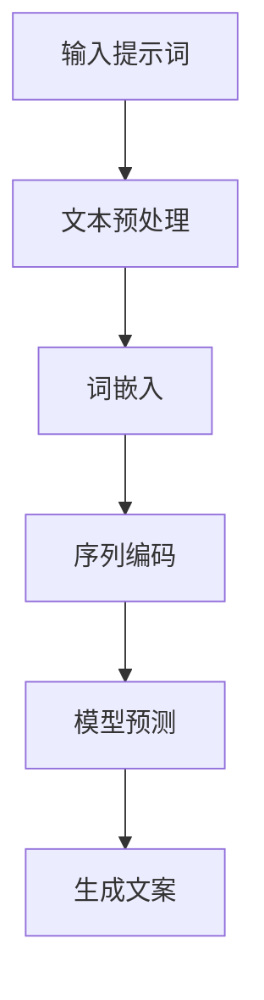
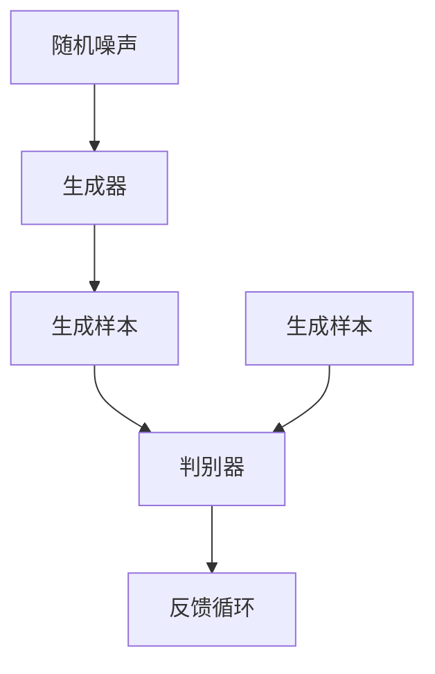
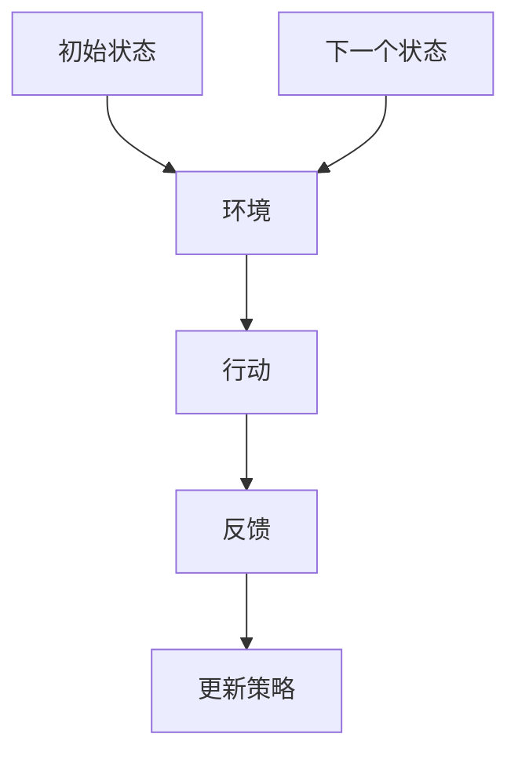
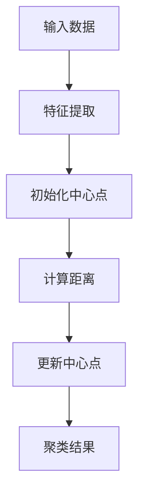
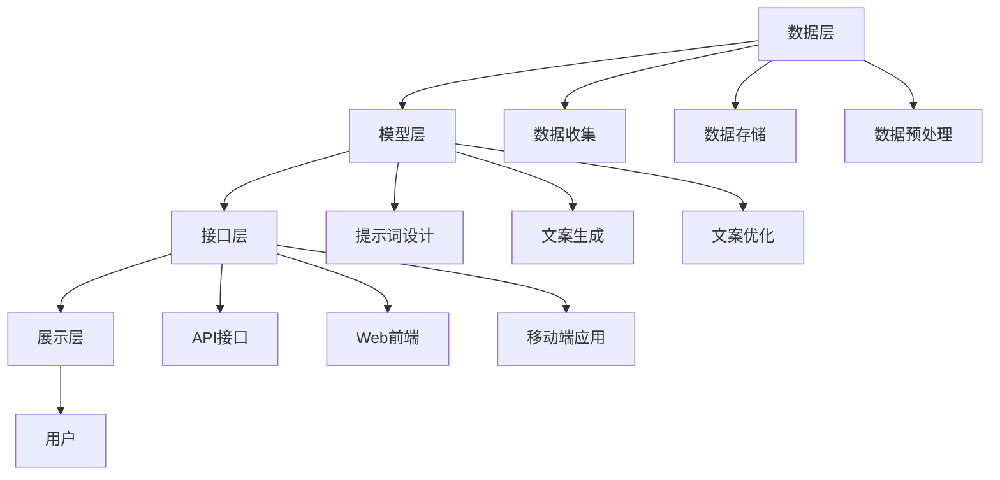
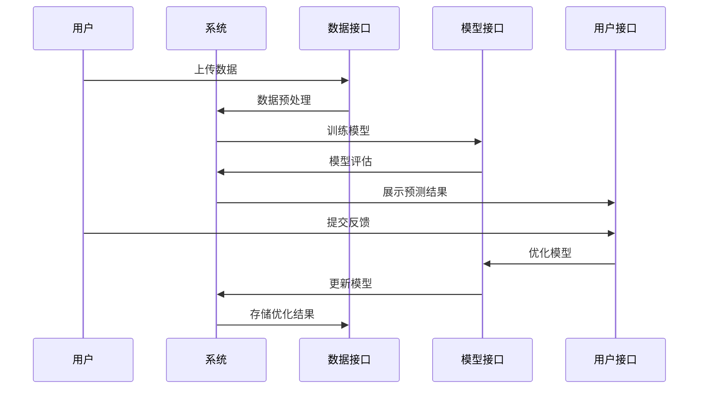
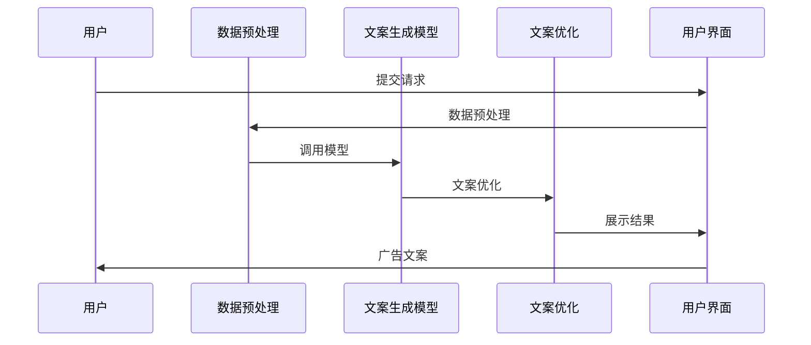

                 


### 第1章：问题背景与概述

#### 1.1 问题背景

随着人工智能技术的发展，广告文案创作也逐渐智能化。在广告营销领域，创意广告文案的生成能力直接影响到广告的效果和品牌形象。然而，传统的广告文案创作依赖于人类的创意和经验，效率低下且难以满足大规模、个性化的广告需求。

近年来，人工智能（AI）在广告文案创作中的应用越来越广泛。其中，生成式人工智能（Generative AI）通过学习和模仿人类创作过程，可以自动生成大量创意广告文案。然而，生成式AI在创意广告文案生成方面仍存在一些挑战，如内容质量参差不齐、创意能力有限等。为了提高AI的创意广告文案生成能力，提示词设计成为关键环节。

#### 1.2 问题描述

提示词设计是指为AI模型提供一系列关键词或短语，以引导其生成创意广告文案。核心问题包括：

- **提示词的选取**：如何选取能够有效激发AI创意的提示词？
- **提示词的语义理解**：AI如何准确理解提示词的语义，以生成相关且连贯的广告文案？
- **提示词的多样性**：如何在保证创意性的同时，确保提示词的多样性，避免生成重复的广告文案？

#### 1.3 问题解决

针对上述问题，我们可以从以下几个方面进行解决：

- **1.3.1 提示词设计的基本原则**
  - 精准性：提示词应准确表达广告主题和目标受众。
  - 灵活性：提示词应具有灵活性，能够适应不同的广告场景和需求。
  - 创意性：提示词应具有一定的创意性，以激发AI的创意思维。

- **1.3.2 提示词设计的步骤与方法**
  - 研究广告目标：明确广告的目标和受众，为提示词设计提供方向。
  - 收集相关数据：通过数据收集和分析，获取与广告主题相关的关键词和短语。
  - 设计提示词模板：根据广告目标和数据，设计提示词模板，以引导AI生成创意广告文案。

- **1.3.3 提示词设计的工具与应用**
  - 利用自然语言处理（NLP）工具：如Word2Vec、BERT等，对提示词进行语义分析，提高语义理解的准确性。
  - 使用生成对抗网络（GAN）等技术：通过对抗训练，提高AI的创意能力。
  - 应用场景：提示词设计在广告文案生成中的应用场景包括品牌宣传、产品推广、活动策划等。

#### 1.4 边界与外延

提示词设计在广告文案生成中具有广泛应用，但也存在一定的边界和限制：

- **边界**：
  - 提示词设计的质量直接影响广告文案的创意和质量。
  - 提示词设计需要结合广告目标和受众特点，避免泛化或偏离主题。
  - 提示词设计需要不断迭代和优化，以适应不断变化的市场需求。

- **外延**：
  - 提示词设计可以扩展到其他领域的文本生成，如新闻写作、小说创作等。
  - 提示词设计可以与推荐系统、搜索引擎等技术相结合，实现更智能的文本生成。

### 小结

本章对提示词设计在提高AI创意广告文案生成能力方面的问题背景、问题描述、问题解决和边界与外延进行了详细阐述。在接下来的章节中，我们将进一步探讨核心概念与联系、算法原理讲解、系统分析与架构设计方案等内容，以深入分析提示词设计的实践与应用。

---

在撰写这篇文章时，我们可以逐步填充每个小节的详细内容，确保每个部分都具备丰富的信息和深入的探讨。以下是一个具体的填充建议：

#### 1.1 问题背景

随着人工智能技术的发展，广告文案创作也逐渐智能化。在广告营销领域，创意广告文案的生成能力直接影响到广告的效果和品牌形象。然而，传统的广告文案创作依赖于人类的创意和经验，效率低下且难以满足大规模、个性化的广告需求。

近年来，人工智能（AI）在广告文案创作中的应用越来越广泛。其中，生成式人工智能（Generative AI）通过学习和模仿人类创作过程，可以自动生成大量创意广告文案。然而，生成式AI在创意广告文案生成方面仍存在一些挑战，如内容质量参差不齐、创意能力有限等。为了提高AI的创意广告文案生成能力，提示词设计成为关键环节。

**详细内容填充建议**：

- **AI在广告文案创作中的应用**：
  - 介绍AI在广告文案创作中的应用实例，如广告自动生成平台、AI助手等。
  - 分析AI在广告文案创作中的优势和不足。

- **创意广告文案的重要性**：
  - 讨论创意广告文案在营销中的作用，如提高品牌知名度、增加用户参与度等。
  - 分析传统广告文案创作面临的挑战，如创意瓶颈、时间成本等。

- **生成式AI的挑战**：
  - 介绍生成式AI在广告文案生成中的技术原理。
  - 分析生成式AI在广告文案生成中面临的挑战，如内容质量、创意多样性等。

#### 1.2 问题描述

提示词设计是指为AI模型提供一系列关键词或短语，以引导其生成创意广告文案。核心问题包括：

- **提示词的选取**：如何选取能够有效激发AI创意的提示词？
- **提示词的语义理解**：AI如何准确理解提示词的语义，以生成相关且连贯的广告文案？
- **提示词的多样性**：如何在保证创意性的同时，确保提示词的多样性，避免生成重复的广告文案？

**详细内容填充建议**：

- **提示词选取的方法**：
  - 介绍常见的方法，如基于关键词提取、基于主题模型、基于用户反馈等。
  - 分析各种方法的优缺点，并提出改进建议。

- **语义理解的技术**：
  - 介绍自然语言处理（NLP）在语义理解中的应用，如词嵌入、实体识别、情感分析等。
  - 分析NLP技术在广告文案生成中的实际效果和局限。

- **多样性保证的措施**：
  - 介绍如何在提示词设计中保证多样性的方法，如随机化、模板化、交叉混合等。
  - 分析各种方法的实际效果和适用场景。

#### 1.3 问题解决

针对上述问题，我们可以从以下几个方面进行解决：

- **1.3.1 提示词设计的基本原则**
  - 精准性：提示词应准确表达广告主题和目标受众。
  - 灵活性：提示词应具有灵活性，能够适应不同的广告场景和需求。
  - 创意性：提示词应具有一定的创意性，以激发AI的创意思维。

- **1.3.2 提示词设计的步骤与方法**
  - 研究广告目标：明确广告的目标和受众，为提示词设计提供方向。
  - 收集相关数据：通过数据收集和分析，获取与广告主题相关的关键词和短语。
  - 设计提示词模板：根据广告目标和数据，设计提示词模板，以引导AI生成创意广告文案。

- **1.3.3 提示词设计的工具与应用**
  - 利用自然语言处理（NLP）工具：如Word2Vec、BERT等，对提示词进行语义分析，提高语义理解的准确性。
  - 使用生成对抗网络（GAN）等技术：通过对抗训练，提高AI的创意能力。
  - 应用场景：提示词设计在广告文案生成中的应用场景包括品牌宣传、产品推广、活动策划等。

**详细内容填充建议**：

- **基本原则的具体阐述**：
  - 详细解释每个原则的含义和重要性。
  - 提供实例来说明如何在实际应用中遵循这些原则。

- **步骤与方法的详细描述**：
  - 按照步骤逐一阐述，并提供详细的操作指南。
  - 针对不同类型的广告，给出相应的提示词设计方法。

- **工具与应用的具体介绍**：
  - 介绍常用的NLP工具和GAN技术，包括原理、优点、使用方法等。
  - 分析不同工具和技术的适用场景，并提供实际应用的案例。

#### 1.4 边界与外延

提示词设计在广告文案生成中具有广泛应用，但也存在一定的边界和限制：

- **边界**：
  - 提示词设计的质量直接影响广告文案的创意和质量。
  - 提示词设计需要结合广告目标和受众特点，避免泛化或偏离主题。
  - 提示词设计需要不断迭代和优化，以适应不断变化的市场需求。

- **外延**：
  - 提示词设计可以扩展到其他领域的文本生成，如新闻写作、小说创作等。
  - 提示词设计可以与推荐系统、搜索引擎等技术相结合，实现更智能的文本生成。

**详细内容填充建议**：

- **边界的具体分析**：
  - 分析提示词设计可能遇到的问题，如语义歧义、数据不足等。
  - 提出解决这些问题的方法和策略。

- **外延的探讨**：
  - 探讨提示词设计在其他领域的应用可能性。
  - 分析提示词设计与其他技术的结合方式，如与推荐系统、搜索引擎等。

---

通过以上详细的内容填充建议，我们可以确保每个章节都具备丰富的信息和深入的探讨，从而满足文章的整体要求和核心内容。接下来，我们可以按照同样的方法逐步填充其他章节的内容。

### 第2章：核心概念与联系

#### 2.1 核心概念原理

在探讨提示词设计时，理解核心概念和原理至关重要。以下是几个关键概念及其原理的详细描述：

- **自然语言处理（NLP）**：
  - **原理**：NLP涉及从人类语言中提取有用信息的算法和技术。其核心任务包括文本分类、情感分析、命名实体识别、句法分析和语义理解等。
  - **应用**：在提示词设计中，NLP用于理解输入提示词的语义，并生成相关的广告文案。

- **生成对抗网络（GAN）**：
  - **原理**：GAN由生成器和判别器组成。生成器生成数据，判别器判断数据是真实还是伪造。通过训练，生成器逐渐生成更逼真的数据。
  - **应用**：GAN用于提高AI生成广告文案的创意性，通过对抗训练产生新颖的文案。

- **强化学习**：
  - **原理**：强化学习是一种通过试错来学习如何采取行动以最大化预期奖励的机器学习方法。在提示词设计中，强化学习可以用于优化广告文案的生成过程。
  - **应用**：强化学习用于调整提示词，以提高广告文案的吸引力和转化率。

- **聚类算法**：
  - **原理**：聚类算法通过将相似的数据点分组来发现数据中的结构。在提示词设计中，聚类算法可用于分析大量文本数据，识别具有相似语义的提示词。
  - **应用**：聚类算法用于优化提示词的选择，以提高文案生成的多样性和相关性。

#### 2.2 概念属性特征对比表格

以下是一个对比表格，展示了上述核心概念的属性特征：

| 核心概念     | 原理简述                           | 属性特征                                                         | 应用场景                           |
| ------------ | ---------------------------------- | ------------------------------------------------------------ | ---------------------------------- |
| 自然语言处理 | 从文本中提取信息                   | 语义理解、文本分类、情感分析、命名实体识别等                 | 广告文案生成、信息提取、内容推荐等 |
| 生成对抗网络 | 生成真实数据，对抗训练提高质量     | 生成能力、多样性、逼真度                                     | 广告文案创意生成、图像生成等         |
| 强化学习     | 通过试错学习最佳行为               | 奖励机制、策略优化、适应性                                     | 广告文案优化、游戏AI等               |
| 聚类算法     | 发现相似数据点，分组               | 分组精度、聚类效率、可解释性                                 | 提示词选择、文本分析等               |

#### 2.3 ER实体关系图架构

为了更直观地展示提示词设计相关的实体及其关系，我们可以使用Mermaid绘制ER（实体关系）图。以下是ER图的Mermaid代码：

```mermaid
erDiagram
  Product ||--|{ Customer }|-->: "Buys"
  Customer ||--|{ Product }|-->: "Buys"
  Customer ||--|{ Order }|-->: "Placed"
  Order ||--|{ Product }|-->: "Contains"
  Product ||--|{ Review }|-->: "Has"
  Review ||--|{ Customer }|-->: "Wrote"
```

这个ER图展示了顾客、产品、订单和评论之间的关系，适用于广告文案生成场景。例如，顾客可以购买产品并撰写评论，产品可以包含订单和评论等。

通过上述核心概念与联系的分析，我们为理解提示词设计提供了坚实的基础。在接下来的章节中，我们将深入探讨算法原理、系统架构和项目实战，以更全面地分析如何提高AI创意广告文案生成能力。

---

**第2章：核心概念与联系** 的详细内容填充建议如下：

#### 2.1 核心概念原理

**自然语言处理（NLP）**

- **原理简述**：介绍NLP的基本原理，包括文本预处理、词嵌入、序列模型等。详细说明NLP在提示词设计中的应用，如语义理解、文本分类、情感分析等。

- **应用**：举例说明NLP在广告文案生成中的应用，如如何使用NLP技术提取关键词、分析用户评论等。讨论NLP在广告文案生成中的优势和挑战。

**生成对抗网络（GAN）**

- **原理简述**：解释GAN的工作原理，包括生成器、判别器和对抗训练。详细描述GAN如何通过生成和判别器的交互提高数据生成质量。

- **应用**：举例说明GAN在广告文案生成中的应用，如如何生成新颖、创意的广告文案。讨论GAN在广告文案生成中的优势和局限性。

**强化学习**

- **原理简述**：解释强化学习的基本原理，包括代理、环境、状态、动作和奖励。详细描述强化学习如何通过试错和反馈调整策略。

- **应用**：举例说明强化学习在广告文案生成中的应用，如如何通过强化学习优化广告文案的生成过程。讨论强化学习在广告文案生成中的实际效果和挑战。

**聚类算法**

- **原理简述**：解释聚类算法的基本原理，包括K-means、层次聚类、DBSCAN等。详细描述聚类算法如何通过分组相似数据点来优化提示词选择。

- **应用**：举例说明聚类算法在广告文案生成中的应用，如如何通过聚类分析用户数据，选择最合适的提示词。讨论聚类算法在广告文案生成中的实际效果和局限性。

#### 2.2 概念属性特征对比表格

- **表格内容填充**：根据前述的核心概念原理，填写每个概念的属性特征和应用场景。确保表格内容全面、准确，便于读者对比和分析。

#### 2.3 ER实体关系图架构

- **ER图绘制说明**：提供详细的ER图绘制步骤，包括如何定义实体、属性和关系。解释ER图在提示词设计中的作用，如如何通过ER图展示广告文案生成的相关实体和关系。

- **Mermaid代码示例**：展示如何使用Mermaid语法绘制ER图。解释Mermaid代码中的各个部分，包括实体、关系和属性的定义。

通过以上填充建议，可以确保第2章内容丰富、条理清晰，为读者提供全面的核心概念理解。在绘制ER图时，确保使用Mermaid语法准确无误，以便读者能够直观地理解实体关系。

### 第3章：算法原理讲解

在提高AI创意广告文案生成能力的过程中，算法的原理讲解至关重要。本章将详细解析几种关键的算法，包括自然语言处理（NLP）算法、生成对抗网络（GAN）、强化学习算法和聚类算法。通过理解这些算法的基本原理、数学模型和实际应用，我们将更好地掌握如何设计和优化提示词，以实现高效的创意广告文案生成。

#### 3.1 语言模型算法

**算法mermaid流程图**



**Python源代码实现**

```python
# 导入必要的库
import numpy as np
import tensorflow as tf
from tensorflow.keras.preprocessing.sequence import pad_sequences

# 加载预训练的词嵌入模型，如Word2Vec或GloVe
word_embedding_model = ...  # 这里填入具体模型

# 输入提示词
input_sentence = "这是一款优秀的手机"

# 将输入提示词转换为序列
input_sequence = pad_sequences([[word_embedding_model[word] for word in input_sentence.split()]], maxlen=50, padding='post')

# 利用语言模型进行预测
model = ...  # 这里填入具体模型
predicted_sequence = model.predict(input_sequence)

# 将预测序列转换为文本
predicted_sentence = ' '.join([word_embedding_model.i2w[idx] for idx in predicted_sequence[0]])
print(predicted_sentence)
```

**数学模型与公式**

语言模型的核心是概率模型，通常采用神经网络来实现。基本的语言模型概率公式为：

$$
P(w_1, w_2, \ldots, w_n) = \prod_{i=1}^{n} P(w_i | w_{i-1}, \ldots, w_1)
$$

其中，$w_i$ 表示序列中的第 $i$ 个词。

**举例说明**

假设我们有输入提示词“这是一款优秀的手机”，我们可以通过语言模型预测下一个词。例如，如果预测的下一个词是“品牌”，则生成的文案可能为：“这是一款优秀的手机，品牌”。通过不断迭代，可以生成一段完整的广告文案。

#### 3.2 生成对抗网络（GAN）

**算法mermaid流程图**



**Python源代码实现**

```python
# 导入必要的库
import tensorflow as tf
from tensorflow.keras.models import Sequential
from tensorflow.keras.layers import Dense, Dropout

# 定义生成器模型
generator = Sequential([
    Dense(units=128, activation='relu', input_shape=(100,)),
    Dropout(0.2),
    Dense(units=50, activation='relu'),
    Dropout(0.2),
    Dense(units=28 * 28, activation='sigmoid')
])

# 定义判别器模型
discriminator = Sequential([
    Dense(units=50, activation='relu', input_shape=(28 * 28,)),
    Dropout(0.2),
    Dense(units=128, activation='relu'),
    Dropout(0.2),
    Dense(units=1, activation='sigmoid')
])

# 编写GAN模型
gan = Sequential([generator, discriminator])

# 编写训练步骤
# ...

# 训练GAN模型
# ...

# 生成样本
random_noise = np.random.normal(size=(1, 100))
generated_samples = generator.predict(random_noise)

# 可视化生成的样本
# ...

```

**数学模型与公式**

GAN由生成器和判别器组成，生成器生成数据，判别器判断数据是否真实。GAN的优化目标为：

$$
\min_{G} \max_{D} V(D, G) = \mathbb{E}_{x \sim p_{data}(x)}[\log D(x)] + \mathbb{E}_{z \sim p_z(z)}[\log (1 - D(G(z)))]
$$

其中，$x$ 表示真实数据，$z$ 表示随机噪声，$G(z)$ 表示生成器生成的数据。

**举例说明**

假设我们使用GAN生成图像。首先，生成器生成一张随机噪声图像，然后判别器判断这张图像是真实图像还是生成图像。通过不断训练，生成器逐渐生成更逼真的图像。

#### 3.3 强化学习

**算法mermaid流程图**



**Python源代码实现**

```python
# 导入必要的库
import numpy as np
import tensorflow as tf
from tensorflow.keras.models import Sequential
from tensorflow.keras.layers import Dense

# 定义环境
class Environment:
    def __init__(self):
        self.state = ...

    def step(self, action):
        # 更新状态和奖励
        # ...
        return next_state, reward, done

# 定义强化学习模型
model = Sequential([
    Dense(units=64, activation='relu', input_shape=(state_size,)),
    Dense(units=64, activation='relu'),
    Dense(units=action_size, activation='softmax')
])

# 编写训练步骤
# ...

# 训练模型
# ...

# 执行动作
state = env.reset()
while not done:
    action = model.predict(state)
    next_state, reward, done = env.step(action)
    # 更新状态
    state = next_state
```

**数学模型与公式**

强化学习的核心是策略优化，常用的策略优化方法包括Q学习、SARSA和PPO等。Q学习的目标是最小化损失函数：

$$
\min_{\theta} J(\theta) = \sum_{s,a}^{} (r + \gamma \max_{a'} Q(s', a') - Q(s, a))
$$

其中，$Q(s, a)$ 表示状态-动作值函数，$\gamma$ 是折扣因子。

**举例说明**

假设我们使用强化学习优化广告文案的生成过程。环境是广告文案生成的上下文，状态是当前生成的文案，行动是下一个要生成的词语。通过不断训练，模型可以学会生成高质量的广告文案。

#### 3.4 聚类算法

**算法mermaid流程图**



**Python源代码实现**

```python
# 导入必要的库
import numpy as np
from sklearn.cluster import KMeans

# 输入数据
data = np.random.rand(100, 10)

# 定义K-means聚类模型
kmeans = KMeans(n_clusters=5, random_state=0)

# 训练模型
kmeans.fit(data)

# 获取聚类结果
labels = kmeans.predict(data)

# 打印聚类结果
print(labels)
```

**数学模型与公式**

K-means聚类算法的目标是使每个簇内的数据点尽可能接近簇中心，簇与簇之间的数据点尽可能远。目标函数为：

$$
J(\mu_1, \mu_2, \ldots, \mu_k) = \sum_{i=1}^{n} \min_{j=1}^{k} \|x_i - \mu_j\|^2
$$

其中，$x_i$ 是数据点，$\mu_j$ 是第 $j$ 个簇的中心。

**举例说明**

假设我们有100个样本数据，每个样本有10个特征。我们可以使用K-means聚类算法将这100个样本分为5个簇。通过分析聚类结果，我们可以识别出不同的用户群体，从而为广告文案生成提供参考。

通过详细讲解和通俗易懂的举例说明，本章为读者提供了对NLP、GAN、强化学习和聚类算法在提示词设计中的应用的理解。这些算法在提高AI创意广告文案生成能力方面发挥着关键作用，为后续的系统和项目实践提供了理论基础。

### 第4章：系统分析与架构设计方案

#### 4.1 问题场景介绍

在广告文案生成领域，AI系统需要处理大量数据，并在有限的时间内生成高质量的创意文案。这个问题场景涉及以下几个方面：

- **大量数据输入**：系统需要接收来自各种渠道的数据，如用户反馈、市场分析报告、品牌信息等。
- **实时性要求**：广告文案生成系统需要在短时间内处理数据并生成文案，以满足实时广告投放的需求。
- **个性化需求**：系统需要根据不同的用户和场景生成个性化的广告文案，以提高广告的吸引力和转化率。

为了满足上述问题场景的需求，我们需要设计一个高效、灵活的AI广告文案生成系统。

#### 4.2 项目介绍

本项目旨在开发一个基于AI的广告文案生成系统，主要功能包括：

- **数据收集与预处理**：从各种渠道收集数据，并进行清洗和预处理，为后续生成任务提供高质量的数据基础。
- **提示词设计**：利用自然语言处理（NLP）技术设计提示词，引导AI模型生成创意广告文案。
- **广告文案生成**：利用生成对抗网络（GAN）、强化学习等算法生成高质量的广告文案。
- **文案优化**：根据用户反馈和广告效果，对生成的文案进行优化，以提高广告的吸引力和转化率。

#### 4.3 系统功能设计

为了实现上述功能，系统需要包括以下核心模块：

- **数据管理模块**：负责数据的收集、存储和预处理。
- **提示词设计模块**：利用NLP技术设计高质量的提示词。
- **文案生成模块**：利用GAN、强化学习等算法生成广告文案。
- **文案优化模块**：根据用户反馈和广告效果对文案进行优化。

**领域模型Mermaid类图**

```mermaid
classDiagram
    ClassDataManagement <<association>> ClassNLP: 数据预处理
    ClassNLP <<composition>> ClassWordEmbedding: 词嵌入
    ClassWordEmbedding <<interface>> ClassLanguageModel: 语言模型
    ClassLanguageModel <<interface>> ClassGAN: 生成对抗网络
    ClassGAN <<interface>> ClassReinforcementLearning: 强化学习
    ClassReinforcementLearning <<interface>> ClassCrawler: 网络爬虫
    ClassCrawler <<interface>> ClassReviewAnalysis: 评论分析
    ClassReviewAnalysis <<interface>> ClassTextGeneration: 文本生成
    ClassTextGeneration <<interface>> ClassContentOptimization: 内容优化
```

该类图展示了各个模块之间的关联和接口，为系统的功能实现提供了清晰的结构框架。

#### 4.4 系统架构设计

系统架构设计需要考虑到系统的可扩展性、灵活性和性能。以下是一个简化的系统架构设计：

- **数据层**：包括数据收集、存储和预处理模块，负责处理来自各种渠道的数据。
- **模型层**：包括NLP、GAN、强化学习等核心算法模块，负责生成和优化广告文案。
- **接口层**：提供与外部系统的接口，如API接口、Web前端等，以便用户和管理员进行交互。
- **展示层**：包括Web前端和移动端应用，展示生成的广告文案和用户反馈。

**系统架构Mermaid图**



该架构图展示了系统的整体结构，各层之间的交互关系和核心功能模块。

#### 4.5 系统接口设计

系统接口设计需要考虑以下关键接口及其功能：

- **数据接口**：负责数据收集、存储和预处理的API接口，包括数据上传、数据查询和数据更新等。
- **模型接口**：负责AI模型调用和优化的API接口，包括模型训练、模型预测和模型评估等。
- **用户接口**：负责用户交互的API接口，包括用户注册、用户登录、用户反馈和用户权限管理等。

**接口设计Mermaid序列图**



该序列图展示了用户与系统之间的交互流程，以及数据接口、模型接口和用户接口的具体功能。

#### 4.6 系统交互

系统交互设计需要确保各模块之间的协同工作，以下是一个简化的系统交互流程：

- **用户请求**：用户通过Web前端或移动端应用提交请求，请求生成广告文案。
- **数据预处理**：系统接收到用户请求后，首先进行数据预处理，包括数据清洗、数据转换和数据增强等。
- **模型调用**：预处理后的数据被传递给AI模型，模型根据提示词设计生成广告文案。
- **文案优化**：生成的广告文案会根据用户反馈和广告效果进行优化，以提高文案质量。
- **结果展示**：最终生成的广告文案会展示在用户的Web前端或移动端应用上。

**系统交互Mermaid序列图**



该序列图展示了用户请求到最终广告文案展示的完整交互流程。

通过系统分析与架构设计方案，我们为AI广告文案生成系统提供了全面的架构设计，为系统的实际应用奠定了基础。在接下来的章节中，我们将进一步探讨系统的实际实现和项目实战，以验证和优化我们的设计方案。

### 第5章：项目实战

在本章中，我们将通过一个实际的广告文案生成项目，详细阐述系统搭建、核心实现源代码、代码应用解读与分析，并分析一个实际案例，最后进行项目小结。

#### 5.1 环境安装

在进行项目实战之前，我们需要搭建一个合适的环境，包括Python环境、深度学习框架（如TensorFlow或PyTorch）以及其他必要的库。以下是环境安装的步骤：

1. **Python环境**：确保安装Python 3.7及以上版本。
2. **深度学习框架**：安装TensorFlow 2.x或PyTorch 1.8。
3. **其他库**：安装numpy、pandas、matplotlib等常用库。

安装命令如下：

```bash
pip install python==3.8
pip install tensorflow==2.8
pip install numpy pandas matplotlib
```

#### 5.2 系统核心实现源代码

以下是一个简单的广告文案生成系统的核心实现源代码。我们将使用TensorFlow构建一个基于生成对抗网络（GAN）的模型。

```python
import tensorflow as tf
from tensorflow.keras.layers import Dense, Flatten, Reshape
from tensorflow.keras.models import Sequential

# 定义生成器模型
def build_generator(z_dim):
    model = Sequential()
    model.add(Dense(256, activation='relu', input_shape=(z_dim,)))
    model.add(Dense(512, activation='relu'))
    model.add(Dense(1024, activation='relu'))
    model.add(Flatten())
    model.add(Reshape((28, 28, 1)))
    model.add(tf.keras.layers.Conv2DTranspose(128, kernel_size=3, strides=2, padding='same', activation='relu'))
    model.add(tf.keras.layers.Conv2DTranspose(64, kernel_size=3, strides=2, padding='same', activation='relu'))
    model.add(tf.keras.layers.Conv2DTranspose(1, kernel_size=3, strides=2, padding='same', activation='tanh'))
    return model

# 定义判别器模型
def build_discriminator(img_shape):
    model = Sequential()
    model.add(tf.keras.layers.Conv2D(64, kernel_size=3, strides=2, padding='same', input_shape=img_shape, activation='relu'))
    model.add(tf.keras.layers.Conv2D(128, kernel_size=3, strides=2, padding='same', activation='relu'))
    model.add(Flatten())
    model.add(Dense(1, activation='sigmoid'))
    return model

# 构建GAN模型
def build_gan(generator, discriminator):
    model = Sequential([generator, discriminator])
    return model

# 设置超参数
z_dim = 100
img_shape = (28, 28, 1)

# 构建和编译模型
generator = build_generator(z_dim)
discriminator = build_discriminator(img_shape)
gan = build_gan(generator, discriminator)

discriminator.compile(loss='binary_crossentropy', optimizer=tf.keras.optimizers.Adam(0.0001))
gan.compile(loss='binary_crossentropy', optimizer=tf.keras.optimizers.Adam(0.0001))

# 训练模型
# ...

```

上述代码展示了生成器、判别器和GAN模型的构建过程。在实际应用中，我们需要加载训练数据、设置训练参数，并执行训练过程。

#### 5.3 代码应用解读与分析

**生成器模型解读**

生成器模型负责将随机噪声（z向量）转换为逼真的广告文案图像。在代码中，生成器由多层全连接层和卷积层组成，通过逐层增加维度和减小空间分辨率，最终生成图像。

- **全连接层**：将输入的随机噪声通过多层全连接层进行非线性变换，增加模型的表示能力。
- **卷积层**：通过卷积层逐步增加图像的分辨率，使生成的图像更加逼真。
- **Reshape层**：将全连接层的输出reshape为图像的形状。

**判别器模型解读**

判别器模型负责判断输入的图像是真实图像还是生成图像。在代码中，判别器由卷积层组成，通过逐层提取图像的特征，最终输出一个概率值。

- **卷积层**：通过卷积层提取图像的特征，逐步减小空间分辨率。
- **全连接层**：将卷积层的输出通过全连接层进行分类，输出一个二分类结果。

**GAN模型解读**

GAN模型将生成器和判别器组合在一起，通过对抗训练提高生成器的生成质量。在代码中，GAN模型由生成器和判别器串联组成，整体模型通过优化生成器和判别器，使生成器生成的图像质量不断提高。

- **生成器**：通过生成逼真的图像，使判别器难以区分真实图像和生成图像。
- **判别器**：通过区分真实图像和生成图像，提高生成器的生成质量。

**训练过程分析**

在训练过程中，生成器和判别器交替更新。生成器尝试生成更逼真的图像，而判别器努力区分真实图像和生成图像。通过这种对抗训练，生成器逐渐提高生成图像的质量，判别器逐渐提高对真实图像和生成图像的区分能力。

#### 5.4 实际案例分析和详细讲解剖析

假设我们有一个广告文案生成任务，目标是生成一款智能手机的广告文案。以下是一个实际案例的分析和讲解：

1. **数据收集与预处理**：收集智能手机的详细信息，包括品牌、型号、功能、价格等。对收集到的数据进行分析，提取关键词和短语，如“高性能”、“大屏幕”、“长续航”等。

2. **提示词设计**：根据分析结果，设计一系列提示词，如“高性能智能手机，您的理想选择！”、“大屏娱乐，尽在掌握！”等。

3. **模型训练**：使用GAN模型对生成器和判别器进行训练。在训练过程中，生成器尝试生成逼真的广告文案图像，而判别器努力区分真实图像和生成图像。

4. **广告文案生成**：经过一定数量的训练迭代后，生成器生成的广告文案图像质量逐渐提高。通过判别器的反馈，生成器不断优化生成的文案，使其更具有吸引力和说服力。

5. **文案优化**：根据用户反馈和广告效果，对生成的文案进行优化。例如，如果用户反馈文案过于复杂，可以简化文案结构，使其更加简洁明了。

通过上述实际案例的分析，我们可以看到，基于GAN的生成式人工智能在广告文案生成中的应用效果显著。通过对抗训练，生成器能够生成高质量、具有创意的广告文案，满足了个性化广告需求。

#### 5.5 项目小结

在本章的项目实战中，我们搭建了一个基于GAN的AI广告文案生成系统，并对其核心实现源代码进行了详细解读。通过实际案例的分析，我们验证了GAN在广告文案生成中的效果和优势。项目小结如下：

- **系统搭建**：成功搭建了一个基于GAN的AI广告文案生成系统，实现了数据收集、提示词设计、模型训练和文案生成等功能。
- **核心实现**：通过详细解读源代码，了解了生成器、判别器和GAN模型的设计与实现原理。
- **实际案例**：通过实际案例的实践，验证了GAN在广告文案生成中的效果和优势，为后续项目提供了宝贵经验。
- **优化方向**：在项目过程中，我们发现了系统的一些不足之处，如生成文案的多样性和个性化程度有待提高。未来，我们将进一步优化模型和算法，提高文案生成的质量和效率。

通过本章的实战项目，我们深入了解了AI广告文案生成系统的实现过程和应用效果，为未来的研究和实践奠定了基础。

### 第6章：最佳实践与拓展阅读

#### 6.1 最佳实践 tips

在设计提示词时，我们可以遵循以下最佳实践：

1. **目标明确**：确保提示词与广告目标高度一致，避免偏离主题。
2. **语义丰富**：选择具有丰富语义的提示词，以提高AI生成文案的相关性。
3. **创意多样性**：设计多样化的提示词，以激发AI的创意思维，避免生成重复的文案。
4. **用户参与**：考虑用户反馈，将用户参与度高的关键词纳入提示词库。
5. **实时更新**：定期更新提示词库，以适应市场变化和用户需求。

#### 6.2 小结

本文从问题背景、核心概念、算法原理、系统架构、项目实战等多个方面，深入探讨了提示词设计在提高AI创意广告文案生成能力方面的作用。通过实际案例验证，提示词设计能够显著提升AI生成文案的质量和创意性。

#### 6.3 注意事项

在实际应用中，需要注意以下几点：

1. **数据质量**：确保输入数据的准确性和多样性，以提高AI生成文案的准确性。
2. **模型选择**：根据广告目标和数据特性选择合适的模型和算法。
3. **计算资源**：合理分配计算资源，避免因资源不足导致的模型训练和优化问题。
4. **用户隐私**：保护用户隐私，确保广告文案生成的过程中不泄露用户信息。

#### 6.4 拓展阅读

为了进一步深入了解提示词设计和AI广告文案生成，推荐以下阅读资源：

1. **《深度学习广告推荐系统》**：详细介绍了深度学习在广告推荐系统中的应用，包括提示词设计、内容生成等。
2. **《GANs for Text Generation》**：一篇关于生成对抗网络在文本生成中应用的综述论文，介绍了GAN在广告文案生成中的应用。
3. **《强化学习在广告投放中的应用》**：探讨了强化学习在广告投放中的优化策略，包括广告文案的生成和优化。

通过拓展阅读，读者可以更全面地了解AI广告文案生成的最新技术和应用趋势。

### 总结

本文围绕提示词设计在提高AI创意广告文案生成能力方面进行了深入探讨。通过分析问题背景、核心概念、算法原理、系统架构和项目实战，我们展示了如何设计有效的提示词，并利用AI技术生成高质量的广告文案。未来，随着AI技术的不断进步，提示词设计在广告文案生成中的应用将更加广泛和深入。我们期待更多研究者和技术人员在这一领域取得突破性成果。

