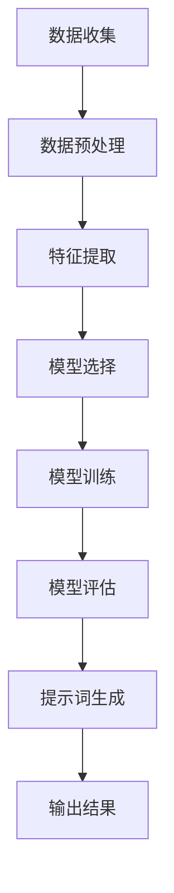
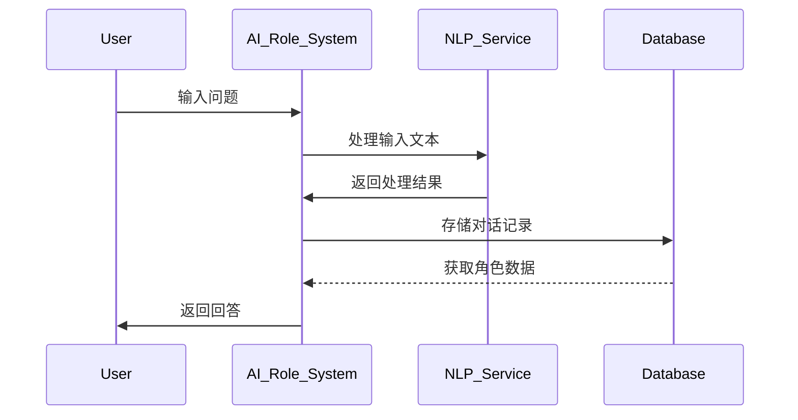
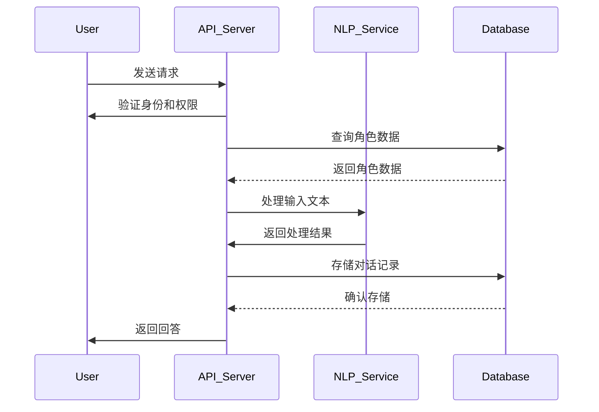
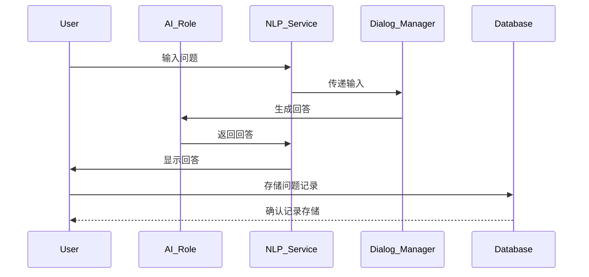

                 

### 引言：AI角色扮演与提示词设计

在人工智能领域，AI角色扮演已经成为一个备受关注的研究方向。随着自然语言处理（NLP）和生成对抗网络（GAN）等技术的不断发展，AI角色扮演的能力也得到了极大的提升。AI角色扮演不仅限于游戏和娱乐场景，还广泛应用于虚拟助手、智能客服、教育培训等多个领域。通过模拟人类的思维和行为，AI角色扮演能够提供更加自然和真实的互动体验。

#### AI角色扮演的重要性

AI角色扮演的重要性体现在以下几个方面：

1. **增强交互体验**：通过模拟人类的思维和行为，AI角色扮演能够提供更加真实和自然的互动体验，提高用户满意度。
2. **提升服务质量**：在智能客服和虚拟助手等应用场景中，AI角色扮演能够模拟真实客服人员的沟通方式，提高问题的解决效率和客户服务质量。
3. **拓展应用场景**：AI角色扮演不仅限于娱乐和客服领域，还可以应用于教育培训、市场调研、智能家居等多个领域，为各行各业提供智能化解决方案。
4. **推动技术发展**：AI角色扮演技术的不断进步，推动了NLP、机器学习、生成对抗网络等相关技术的发展，促进了人工智能领域的整体进步。

#### 提示词在AI角色扮演中的作用

提示词（Prompt）在AI角色扮演中起着至关重要的作用。提示词是引导AI角色进行特定角色扮演的关键信息，它能够帮助AI角色理解用户意图、构建对话场景、模拟人类思维和行为。有效的提示词设计能够显著提高AI角色扮演的真实感和互动性。

1. **理解用户意图**：提示词能够帮助AI角色理解用户的意图，从而构建合适的对话场景，提供针对性的回答或建议。
2. **构建对话场景**：通过提供具体的背景信息和上下文，提示词能够帮助AI角色构建更加丰富和生动的对话场景。
3. **模拟人类思维和行为**：提示词能够引导AI角色模拟人类的思维和行为模式，提高角色扮演的真实感和自然度。

#### 为什么需要设计有效的提示词

尽管提示词在AI角色扮演中起着重要作用，但并非所有的提示词都能够达到理想的效果。设计有效的提示词需要考虑以下几个方面：

1. **准确性**：提示词需要准确地传达用户的意图和需求，避免产生歧义或误解。
2. **丰富性**：提示词应该包含丰富的上下文信息和背景知识，帮助AI角色构建更加自然和真实的对话场景。
3. **灵活性**：提示词应该具有一定的灵活性，能够适应不同的场景和用户需求，提高AI角色的适应性。
4. **可扩展性**：提示词设计应该考虑到未来的扩展性，以便在新增场景或功能时能够灵活调整和使用。

#### 本书结构安排与学习目标

本书旨在全面介绍提示词设计的方法和技巧，帮助读者深入了解并掌握这一重要领域。本书结构如下：

1. **第1章 引言**：介绍AI角色扮演和提示词设计的重要性，以及本书的结构安排和学习目标。
2. **第2章 AI角色扮演的基础知识**：介绍AI角色扮演的发展历程、技术原理、应用场景和提示词设计的基本原则。
3. **第3章 提示词设计的核心概念与联系**：探讨提示词的定义、设计要素、与语义理解的关系以及ER实体关系图架构。
4. **第4章 提示词算法原理讲解**：详细讲解基于语料库、机器学习和深度学习的提示词算法原理，并使用mermaid流程图和Python源代码进行阐述。
5. **第5章 提示词设计实践**：介绍提示词设计工具、案例研究和设计流程，并通过Python源代码实现具体算法。
6. **第6章 提示词设计在AI角色扮演中的应用**：探讨提示词设计在AI角色扮演系统中的具体应用，包括角色创建、交互过程和角色扮演评估。
7. **第7章 提示词设计的最佳实践与案例分析**：总结提示词设计的最佳实践，分析案例，并提供常见问题与解决方案。
8. **第8章 小结与展望**：回顾本书主要内容，强调提示词设计的重要性与价值，并提出未来发展展望。

通过阅读本书，读者将能够深入了解提示词设计的核心概念和方法，掌握有效的提示词设计技巧，并在实际应用中提高AI角色扮演的真实感和互动性。本书适合AI开发人员、研究人员和对于AI角色扮演感兴趣的读者阅读。

### AI角色扮演的发展历程

AI角色扮演作为人工智能领域的一个重要分支，其发展历程可以追溯到20世纪50年代早期。当时，人工智能的早期研究主要集中在问题解决和逻辑推理上，而角色扮演的概念逐渐在模拟人类交互和认知过程中显现。

#### 早期探索

1956年，达特茅斯会议被认为是人工智能诞生的标志。会议上，专家们提出了“人工智能”这一术语，并设想了智能机器能够与人类进行自然对话。这一设想为AI角色扮演奠定了基础。早期的AI角色扮演尝试主要集中在模拟简单的对话场景，如ELIZA程序，它通过预设的模板和关键词进行简单的对话模拟，虽然效果有限，但为后续的发展积累了经验。

#### 角色扮演技术的初步发展

20世纪70年代，随着自然语言处理（NLP）技术的初步发展，AI角色扮演开始获得更多关注。此时，研究主要集中在语言理解和文本生成上。一些系统，如PARADE和DORADO，试图通过生成和理解自然语言文本来模拟角色行为。这些系统虽然简单，但标志着AI角色扮演技术开始迈向复杂化和智能化。

#### 人工智能与机器学习的兴起

20世纪80年代到90年代，人工智能迎来了一个重要的发展阶段，机器学习技术的出现使得AI角色扮演取得了显著进步。机器学习方法，如决策树、神经网络和支持向量机等，被广泛应用于角色行为建模。这一时期，虚拟角色逐渐能够在特定任务中表现出更为复杂的认知和决策能力。例如，虚拟助手和智能客服系统的出现，标志着AI角色扮演开始进入实际应用阶段。

#### 深度学习时代的到来

进入21世纪，深度学习技术的发展使得AI角色扮演进入了一个新的时代。深度学习模型，如卷积神经网络（CNN）和循环神经网络（RNN），尤其是序列到序列（Seq2Seq）模型，极大地提升了AI角色的语言理解和生成能力。这一时期，虚拟角色不仅能够进行简单的文本交互，还能在复杂场景中表现出类似人类的思维和行为。

#### 跨领域应用

近年来，AI角色扮演技术得到了广泛应用，不仅限于游戏和娱乐领域，还在智能客服、教育培训、虚拟助手等多个领域展现了其价值。随着虚拟现实（VR）和增强现实（AR）技术的发展，AI角色扮演的应用场景进一步拓展，为用户提供了更加丰富和沉浸的互动体验。

#### 当前发展态势

目前，AI角色扮演技术仍在快速发展中。一方面，研究人员致力于提高AI角色的自然语言理解能力和对话生成能力；另一方面，开发者们也在不断探索如何在更多实际应用中引入AI角色扮演技术，以提高用户体验和系统效率。

### 技术原理

AI角色扮演的技术原理主要涉及自然语言处理（NLP）、机器学习（ML）和深度学习（DL）等多个领域。以下是这些技术的基本原理及其在AI角色扮演中的应用：

#### 自然语言处理（NLP）

自然语言处理是AI角色扮演的核心技术之一。它旨在使计算机能够理解、生成和处理自然语言文本。NLP的基本原理包括：

1. **语言理解**：通过分词、词性标注、句法分析和语义分析等技术，使计算机能够理解文本中的词语、句子和段落的意义。
2. **语言生成**：通过文本生成模型，如序列到序列（Seq2Seq）模型和生成对抗网络（GAN），使计算机能够生成符合语法和语义的自然语言文本。

在AI角色扮演中，NLP技术被用于理解用户的输入，并生成相应的回答或建议。例如，智能客服系统通过NLP技术分析用户的问题，然后生成合适的回复。

#### 机器学习（ML）

机器学习技术是AI角色扮演的另一个重要组成部分。它通过训练模型来学习数据，并在新的数据上进行预测。机器学习的基本原理包括：

1. **监督学习**：通过标注的数据集，训练模型来预测新的数据。常用的算法包括决策树、支持向量机和神经网络等。
2. **无监督学习**：在不标注数据的情况下，通过模型自动发现数据中的规律和结构。常用的算法包括聚类和降维等。

在AI角色扮演中，机器学习技术主要用于角色行为建模。例如，通过训练模型来预测用户的行为和需求，从而提供更加个性化的服务。

#### 深度学习（DL）

深度学习是近年来在AI角色扮演中应用最为广泛的技术。它通过多层神经网络，对大量数据进行自动特征提取和复杂模式识别。深度学习的基本原理包括：

1. **卷积神经网络（CNN）**：主要用于图像和语音处理，通过卷积操作提取图像或语音的特征。
2. **循环神经网络（RNN）**：主要用于序列数据处理，如文本和语音。它通过循环机制保留历史信息，实现对序列数据的长期依赖建模。
3. **序列到序列（Seq2Seq）模型**：通过编码器和解码器两个网络，实现序列数据的转换，如机器翻译。

在AI角色扮演中，深度学习技术被用于提升角色的自然语言理解和生成能力。例如，通过训练深度学习模型，角色能够生成更加自然和流畅的对话。

### 应用场景

AI角色扮演技术已经在多个领域得到了广泛应用，以下是其中几个典型的应用场景：

1. **游戏和娱乐**：在游戏中，AI角色扮演技术被用于模拟NPC（非玩家角色）的行为，提供丰富的游戏体验。
2. **智能客服**：在客服系统中，AI角色扮演技术被用于模拟客服代表与客户的互动，提供24/7的服务。
3. **教育培训**：在虚拟课堂中，AI角色扮演技术被用于模拟教师和学生的互动，提供个性化的教学体验。
4. **虚拟助手**：在智能家居和虚拟助理中，AI角色扮演技术被用于模拟人类助手的行为，提供便捷的生活服务。

### 提示词设计的基本原则

提示词设计在AI角色扮演中起着至关重要的作用。为了提高AI角色扮演的真实感，设计有效的提示词需要遵循以下基本原则：

#### 准确性

提示词的准确性是基础。提示词必须准确地传达用户的意图和需求，避免产生歧义或误解。准确性的关键在于：

1. **清晰明确**：确保提示词内容简洁明了，不含有模糊或双关意味。
2. **无歧义**：避免使用可能引起误解的词汇和表达方式，确保提示词的唯一解释。
3. **上下文相关**：提示词应与用户的上下文背景保持一致，确保AI角色能够准确理解用户的意图。

#### 丰富性

提示词的丰富性能够为AI角色提供更多的信息和上下文，帮助角色构建更加自然和真实的对话场景。丰富性的关键在于：

1. **信息全面**：提示词应包含与用户需求相关的各种信息，如背景信息、历史数据、用户偏好等。
2. **场景多样性**：提示词应涵盖多种不同的场景，以适应不同用户需求和环境变化。
3. **情感表达**：提示词应能够传达用户情绪和情感，增加对话的真实性和亲切感。

#### 灵活性

提示词设计需要具有一定的灵活性，以适应不同用户和场景的需求。灵活性的关键在于：

1. **自适应调整**：提示词应能够根据用户的反馈和系统性能动态调整，提高AI角色的适应能力。
2. **模块化设计**：提示词应采用模块化设计，便于根据不同场景和需求进行组合和调整。
3. **扩展性**：提示词设计应考虑到未来可能的扩展和升级，确保系统具备良好的扩展性。

#### 可扩展性

提示词设计需要具备良好的可扩展性，以便在新增场景或功能时能够灵活调整和使用。可扩展性的关键在于：

1. **标准化的提示词库**：建立一个标准化的提示词库，方便在不同场景下快速调用和使用。
2. **可配置性**：提示词设计应支持可配置性，允许开发者在不同的应用场景中灵活调整提示词。
3. **开源共享**：鼓励开源共享提示词资源，促进不同团队和项目的协同开发。

#### 人性化

人性化设计是提升AI角色扮演真实感的重要方面。提示词设计需要考虑用户感受，确保对话更加自然和亲切。人性化的关键在于：

1. **同理心**：提示词应能够体现对用户的关心和理解，增强互动的亲切感。
2. **个性表达**：根据用户特点和偏好，设计个性化的提示词，提高用户满意度。
3. **情感共鸣**：通过情感表达和场景模拟，与用户建立情感共鸣，提升互动体验。

通过遵循这些基本原则，设计出准确、丰富、灵活、可扩展和人性化的提示词，可以有效提升AI角色扮演的真实感和互动性，为用户提供更加自然和高效的互动体验。

### 提示词的定义与类型

在AI角色扮演中，提示词是引导AI角色进行特定行为和对话的关键元素。定义提示词是理解其设计和应用的基础。以下是对提示词的定义及其类型的详细探讨：

#### 定义

提示词可以定义为：在AI角色扮演过程中，提供关键信息、引导AI角色行为和对话的文本或语音。提示词通常包含上下文信息、用户意图、特定指令等，是AI角色理解用户需求和行为模式的重要依据。

#### 类型

1. **背景提示词**：

背景提示词用于提供角色扮演的背景信息，帮助AI角色构建对话场景。例如，在虚拟课堂中，教师可以使用背景提示词介绍课程内容、教学目标或班级规则。背景提示词的特点是信息全面且具有上下文相关性，能够帮助AI角色理解整体情境。

2. **指令提示词**：

指令提示词是用于直接指挥AI角色执行特定任务的文字或语音指令。例如，在智能客服系统中，用户可能会使用指令提示词请求查询账户余额或修改个人信息。指令提示词的特点是具体明确、任务导向，能够指导AI角色进行特定操作。

3. **反馈提示词**：

反馈提示词用于AI角色对用户请求的回应，通常包含确认、否定或进一步询问的信息。例如，当用户提出问题后，AI角色可以使用反馈提示词确认理解了用户的问题并请求更多信息。反馈提示词的特点是互动性强、能够促进双向沟通。

4. **情感提示词**：

情感提示词用于传达用户的情感状态，帮助AI角色更好地理解用户的情绪和需求。例如，当用户表达不满时，AI角色可以使用情感提示词表达同情和理解。情感提示词的特点是能够增加对话的真实感和人性化程度。

#### 对比

不同类型的提示词在功能、用途和特点上存在明显差异。以下是它们之间的对比：

| 类型       | 功能           | 用途                                | 特点               |
| ---------- | -------------- | ----------------------------------- | ------------------ |
| 背景提示词 | 提供背景信息   | 帮助AI角色构建对话场景               | 信息全面、上下文相关 |
| 指令提示词 | 指挥AI角色执行任务 | 实现具体操作                          | 具体明确、任务导向 |
| 反馈提示词 | 回应用户请求   | 促进双向沟通、获取更多信息             | 互动性强、双向反馈 |
| 情感提示词 | 表达用户情感   | 增强对话的真实感和人性化程度           | 传达情感、增强共鸣 |

通过明确提示词的定义和类型，我们可以更好地理解和设计AI角色扮演中的提示词，从而提升角色的真实感和互动性。

### 提示词的设计要素

提示词的设计是提升AI角色扮演真实感的关键步骤。为了确保提示词能够有效地引导AI角色的行为和对话，设计时需要考虑以下几个核心要素：

#### 上下文信息

上下文信息是提示词设计的基础。它包括用户的历史行为、偏好、情境背景等，有助于AI角色理解当前对话的上下文。设计上下文信息时，需要确保以下几点：

1. **全面性**：上下文信息应尽可能全面，包括用户在互动过程中的历史行为和偏好，以便AI角色能够准确理解用户意图。
2. **相关性**：上下文信息应与当前对话内容高度相关，避免无关或冗余的信息干扰AI角色的理解。
3. **动态更新**：上下文信息应能够实时更新，以适应用户行为和对话场景的变化。

#### 用户意图

用户意图是提示词设计的核心。它代表了用户在特定时刻想要实现的目标或需求。为了准确捕捉用户意图，设计时需要考虑以下几点：

1. **明确性**：提示词应明确表达用户的意图，避免模糊不清的表达方式，减少AI角色的误解。
2. **多样性**：提示词应涵盖多种不同的用户意图，以适应不同用户需求和行为模式。
3. **适应性**：提示词应能够根据用户的反馈和行为动态调整，以更好地满足用户需求。

#### 对话场景

对话场景是提示词设计的另一个重要方面。它包括用户和AI角色之间的互动情境，如聊天室、客服对话、教育培训等。设计对话场景时，需要考虑以下几点：

1. **丰富性**：对话场景应尽可能丰富，涵盖多种不同的场景和情境，以便AI角色能够应对各种对话环境。
2. **连贯性**：对话场景中的提示词应保持连贯性和一致性，避免出现逻辑错误或中断。
3. **灵活性**：对话场景应具备一定的灵活性，能够根据用户需求和环境变化进行调整。

#### 交互性

交互性是提升AI角色扮演真实感的重要因素。提示词设计应充分考虑用户和AI角色之间的交互模式，增强互动体验。设计时需要考虑以下几点：

1. **响应性**：提示词应能够快速响应用户的输入，提供及时的反馈和回应，增强互动性。
2. **多样性**：提示词应提供多样化的互动方式，如文本、语音、图像等，以满足不同用户偏好。
3. **情感化**：提示词应能够传达情感，增加对话的真实感和人性化程度，建立情感共鸣。

#### 文化适应性

文化适应性是确保AI角色在全球范围内都能提供高质量服务的重要因素。设计时需要考虑不同文化和语言背景，确保提示词的普适性和适应性。设计时需要考虑以下几点：

1. **文化理解**：提示词应具备对目标用户文化背景的理解，避免文化冲突和误解。
2. **语言多样性**：提示词应支持多种语言，以便在不同地区和文化中应用。
3. **本地化**：提示词应进行本地化处理，以适应不同地区的语言习惯和文化特点。

通过综合考虑上下文信息、用户意图、对话场景、交互性和文化适应性等要素，设计出符合需求的提示词，可以有效提升AI角色扮演的真实感和互动性，为用户提供更加自然和高效的互动体验。

### 提示词与语义理解的关系

在AI角色扮演中，提示词与语义理解的关系至关重要。提示词不仅影响AI角色的理解能力，还决定了其对话生成和交互效果。为了深入探讨这一关系，我们需要从语义理解的多个角度进行分析。

#### 提示词对AI角色语义理解的影响

1. **准确性**：提示词的准确性直接关系到AI角色对用户意图的把握。准确的提示词能够减少误解和歧义，使AI角色更准确地理解用户的需求。
2. **上下文**：提示词的上下文信息对于语义理解至关重要。丰富的上下文信息有助于AI角色理解句子或对话的整体含义，从而生成更加合理和自然的回答。
3. **多样性**：提示词的多样性有助于AI角色学习并适应不同的语义场景。多样化的提示词能够提高AI角色的泛化能力，使其在不同场景中都能准确理解用户意图。

#### 语义理解对提示词设计的要求

1. **语义解析能力**：AI角色需要具备强大的语义解析能力，能够从提示词中提取关键信息，理解其背后的意图和含义。为此，提示词设计需要确保其语义简洁明了，避免复杂的表达和歧义。
2. **灵活性**：语义理解需要一定的灵活性，能够适应不同语境和用户表达方式。提示词设计应考虑到这种灵活性，提供多样化的表达方式，以提高AI角色的理解范围。
3. **情感因素**：语义理解不仅要考虑词汇和语法，还要考虑情感因素。提示词设计应传达情感信息，帮助AI角色理解用户的情感状态，从而生成更加贴心的回答。

#### 具体应用案例分析

1. **智能客服**：在智能客服系统中，用户提出的问题可能包含多种语义信息。通过设计准确的提示词，AI角色可以准确理解用户的问题，并提供针对性的解决方案。例如，当用户询问“最近的航班信息”，AI角色需要通过提示词理解“最近”和“航班信息”的语义，并提供准确的航班查询结果。
2. **虚拟助手**：虚拟助手在与用户互动时，需要理解用户的意图并进行智能回复。设计丰富的提示词，可以提供详细的上下文信息和情感表达，帮助虚拟助手生成自然、流畅的对话。例如，当用户说“今天天气怎么样”，虚拟助手需要通过提示词理解用户的意图，并回答“今天天气晴朗，温度适中”。
3. **教育培训**：在教育培训中，AI角色需要理解课程内容和用户的需求，提供个性化的学习建议。设计具有上下文和情感因素的提示词，可以增强AI角色的语义理解能力，提高教学效果。例如，当用户提出“我需要复习数学”，AI角色可以通过提示词理解用户的学习需求，并生成相应的复习计划和资源。

#### 提示词与语义理解的ER实体关系图

为了更直观地展示提示词与语义理解之间的关系，我们可以使用ER（实体-关系）图进行描述。以下是提示词与语义理解的ER实体关系图：

```mermaid
erDiagram
  User ||--o> Intent : "表达意图"
  User ||--o> Context : "上下文信息"
  AI ||--|{ Dialogue : "对话"
      Dialogue ||--|> Prompt : "提示词"
      Dialogue ||--|> Response : "回答"
  Intent ||--|> Semantics : "语义理解"
  Context ||--|> Semantics : "影响语义理解"
```

在ER实体关系图中，用户通过意图和上下文信息与AI角色建立对话。对话过程中，AI角色生成提示词，并通过语义理解模块理解用户的意图和上下文信息。最终，AI角色生成合适的回答，实现有效的对话交互。

通过深入探讨提示词与语义理解的关系，我们可以更好地设计有效的提示词，提高AI角色的理解能力和交互效果。这不仅有助于提升用户体验，还能推动AI角色扮演技术的不断发展。

### 提示词设计的ER实体关系图

为了更直观地展示提示词设计中的实体及其相互关系，我们使用Mermaid语法绘制一个ER（实体-关系）图。以下是提示词设计的ER实体关系图的详细说明：

```mermaid
erDiagram
  User ||--|{ Prompt : "提示词"
  User }|--| Role : "AI角色"
  Role ||--| Dialogue : "对话"
  Dialogue ||--| Response : "回答"
  Prompt ||--| Semantics : "语义理解"
  Semantics ||--| Context : "上下文信息"
```

在这个ER图中，我们定义了以下实体：

1. **User（用户）**：代表与AI角色进行交互的用户实体。用户提供提示词，并接收AI角色的回答。
2. **Prompt（提示词）**：代表用户提供给AI角色的文本或语音信息。提示词是引导AI角色进行对话和行为的关键。
3. **Role（AI角色）**：代表参与对话的AI实体。AI角色接收提示词，理解语义，并生成合适的回答。
4. **Dialogue（对话）**：代表用户和AI角色之间的对话过程。对话包含了提示词和回答，是互动的核心。
5. **Response（回答）**：代表AI角色对用户提示词的回应。回答是AI角色基于提示词和语义理解生成的文本或语音。
6. **Semantics（语义理解）**：代表AI角色对提示词的理解过程。语义理解是AI角色生成回答的基础。
7. **Context（上下文信息）**：代表影响语义理解的背景信息。上下文信息有助于AI角色更准确地理解用户的意图。

这些实体之间的关系如下：

- **用户与提示词的关系**：用户提供提示词，提示词是用户与AI角色交互的媒介。
- **用户与AI角色的关系**：用户通过提示词与AI角色建立对话，AI角色接收用户的提示词并生成回答。
- **AI角色与对话的关系**：AI角色在对话过程中使用提示词和回答与用户互动。
- **AI角色与语义理解的关系**：AI角色通过语义理解模块处理提示词，提取关键信息，以生成合适的回答。
- **AI角色与上下文信息的关系**：AI角色在生成回答时需要考虑上下文信息，以确保回答的准确性和连贯性。
- **提示词与回答的关系**：提示词是生成回答的基础，AI角色根据提示词的语义理解和上下文信息生成回答。
- **回答与对话的关系**：回答是对话的一部分，通过对话反馈，用户和AI角色实现持续的互动。

通过这个ER实体关系图，我们可以更清晰地理解提示词设计中的关键元素和它们之间的相互关系。这个图不仅有助于设计提示词时进行系统规划，还能在开发过程中提供直观的参考，确保各部分之间的逻辑一致性和功能协同。

### 基于语料库的提示词算法

基于语料库的提示词算法是自然语言处理（NLP）领域中的一种重要方法，它通过分析大量的语料库数据来提取有用的信息，从而设计出有效的提示词。以下将详细介绍这种算法的原理、步骤和优点。

#### 原理

基于语料库的提示词算法主要通过以下几个步骤实现：

1. **数据收集与预处理**：首先，从各种来源收集大量的文本数据，如对话记录、新闻报道、书籍等。然后，对收集到的数据进行清洗和预处理，包括去除停用词、标点符号和语法错误，并进行分词等操作。

2. **词频统计**：对预处理后的语料库进行词频统计，计算每个单词在语料库中的出现频率。词频统计有助于识别高频词汇和关键短语，这些词汇和短语可能成为有效的提示词。

3. **关键词提取**：利用信息检索和文本挖掘技术，从词频统计结果中提取关键词和关键短语。关键词提取方法包括TF-IDF（词频-逆文档频率）、LDA（主题模型）等。这些方法能够识别出对语义理解有重要影响的词汇和短语。

4. **提示词生成**：根据提取的关键词和关键短语，生成提示词。这些提示词可以是单个单词，也可以是短语或句子。生成提示词时，需要考虑其准确性和丰富性，以确保提示词能够有效引导AI角色的理解和行为。

#### 步骤

以下是基于语料库的提示词算法的详细步骤：

1. **数据收集**：从互联网、数据库、文档库等来源收集大量文本数据。

2. **数据预处理**：对收集到的文本数据进行清洗和预处理，包括去除停用词、标点符号、语法错误等。

3. **分词**：将预处理后的文本数据分解为单个单词或词组，形成词汇表。

4. **词频统计**：统计每个单词或词组的出现频率，形成词频分布表。

5. **关键词提取**：利用TF-IDF、LDA等方法提取关键词和关键短语。

6. **提示词生成**：根据提取的关键词和关键短语，生成提示词。

#### 优点

基于语料库的提示词算法具有以下优点：

1. **数据驱动**：算法基于大量真实的语料库数据，能够充分反映自然语言的实际使用情况，提高提示词的准确性和实用性。

2. **自动化**：算法过程高度自动化，无需人工干预，能够快速生成大量有效的提示词。

3. **可扩展性**：算法可以轻松扩展到不同的领域和应用场景，只需更换语料库即可。

4. **易用性**：算法生成的提示词通常简洁明了，易于理解和应用。

#### 实例分析

假设我们有一个语料库，其中包含了大量关于健康和医疗的文本。以下是一个简单的实例：

1. **数据收集**：从医学文献、健康博客、在线咨询平台等收集关于健康的文本。

2. **数据预处理**：去除标点符号、停用词，并对文本进行分词。

3. **词频统计**：统计每个词的出现频率，得到词频分布表。

4. **关键词提取**：使用TF-IDF方法提取关键词，如“健康”、“症状”、“治疗”等。

5. **提示词生成**：根据提取的关键词生成提示词，如“健康问题咨询”、“症状自查”、“治疗方案推荐”等。

通过这个实例，我们可以看到基于语料库的提示词算法如何应用于实际场景，从而提高AI角色在医疗健康领域的表现。

### 基于机器学习的提示词算法

基于机器学习的提示词算法利用机器学习模型从大量数据中学习并提取特征，以生成高质量的提示词。以下将详细介绍这种算法的基本原理、常见方法、流程和应用场景。

#### 基本原理

基于机器学习的提示词算法主要通过以下几个步骤实现：

1. **数据收集与预处理**：首先，从互联网、数据库、文档库等来源收集大量文本数据，如对话记录、新闻文章、用户评论等。然后，对收集到的数据集进行清洗和预处理，包括去除停用词、标点符号、语法错误等。

2. **特征提取**：利用文本特征提取技术，如词袋模型、TF-IDF、词嵌入等，将原始文本数据转换为机器学习模型可处理的特征向量。这些特征向量包含了文本的关键信息，有助于模型进行学习和预测。

3. **模型训练**：选择合适的机器学习模型，如朴素贝叶斯、支持向量机、决策树、深度神经网络等，使用预处理后的数据集进行训练。模型通过学习数据中的模式和关系，学会生成高质量的提示词。

4. **模型评估与优化**：通过验证集和测试集对训练好的模型进行评估，根据评估结果调整模型参数，优化模型性能。常见的评估指标包括准确率、召回率、F1分数等。

5. **提示词生成**：使用训练好的模型对新的文本数据生成提示词。生成过程可以是基于规则的方法，如模板匹配，也可以是数据驱动的方法，如序列生成模型。

#### 常见方法

1. **朴素贝叶斯分类器**：基于贝叶斯定理和特征的概率分布，朴素贝叶斯分类器能够对文本数据进行分类，从而生成提示词。这种方法简单高效，适用于大规模文本数据的处理。

2. **支持向量机（SVM）**：SVM是一种强大的分类算法，通过寻找最优决策边界来分类文本数据。它适用于高维特征空间，能够处理大量的文本数据，生成准确的提示词。

3. **决策树**：决策树通过一系列条件测试将文本数据分类，生成提示词。这种方法易于理解，能够生成简洁明了的提示词。

4. **深度神经网络（DNN）**：深度神经网络是一种多层神经网络，通过反向传播算法训练模型，能够自动提取文本数据的深层特征，生成高质量的提示词。

#### 流程

以下是基于机器学习的提示词算法的详细流程：

1. **数据收集**：从互联网、数据库、文档库等收集大量文本数据。

2. **数据预处理**：去除停用词、标点符号、语法错误，并进行分词。

3. **特征提取**：使用词袋模型、TF-IDF、词嵌入等技术，将文本数据转换为特征向量。

4. **模型选择**：选择合适的机器学习模型，如朴素贝叶斯、SVM、决策树、DNN等。

5. **模型训练**：使用预处理后的数据集训练模型，通过交叉验证调整模型参数。

6. **模型评估**：使用验证集和测试集评估模型性能，调整模型。

7. **提示词生成**：使用训练好的模型生成新的提示词。

#### 应用场景

基于机器学习的提示词算法广泛应用于各种场景，以下是几个典型的应用实例：

1. **智能客服**：在智能客服系统中，基于机器学习的提示词算法能够分析用户的问题，生成针对性的回答，提供高质量的客户服务。

2. **文本摘要**：通过提取关键信息生成简洁明了的文本摘要，提高信息的可读性和易理解性。

3. **情感分析**：分析文本中的情感倾向，生成相应的情感标签或分类，用于市场调研、舆情监测等。

4. **信息检索**：通过提示词的生成，提高搜索引擎的准确性和用户体验。

5. **机器翻译**：在机器翻译系统中，提示词算法能够生成高质量的翻译提示，提高翻译的准确性和流畅度。

通过详细探讨基于机器学习的提示词算法，我们可以看到这种算法在AI角色扮演和自然语言处理领域的重要性和广泛应用前景。

### 基于深度学习的提示词算法

基于深度学习的提示词算法在自然语言处理（NLP）领域取得了显著进展。这些算法通过多层神经网络自动提取文本的深层特征，从而生成高质量的提示词。以下将详细探讨这种算法的原理、常用模型、工作流程以及优缺点。

#### 原理

基于深度学习的提示词算法主要利用深度神经网络（DNN）和其变体，如卷积神经网络（CNN）、循环神经网络（RNN）和Transformer模型，从大量文本数据中学习特征，并生成提示词。深度学习模型通过多层非线性变换，能够自动提取文本的语义信息，从而实现高效的提示词生成。

1. **卷积神经网络（CNN）**：CNN通过卷积操作从文本中提取局部特征，适用于文本分类和特征提取任务。在提示词生成中，CNN可以用于提取句子中的关键短语和词汇，从而生成有效的提示词。

2. **循环神经网络（RNN）**：RNN通过循环机制在时间序列数据上处理信息，能够捕捉文本中的长期依赖关系。LSTM（长短期记忆）和GRU（门控循环单元）是RNN的变体，它们通过门控机制解决了传统RNN的梯度消失问题，广泛应用于序列建模任务，如语言模型和对话系统。

3. **Transformer模型**：Transformer模型引入了自注意力机制（Self-Attention），能够在全局范围内捕捉文本特征，从而实现高效的语言理解。BERT（Bidirectional Encoder Representations from Transformers）是Transformer的变体，通过双向编码器学习文本的语义信息，广泛应用于提示词生成和文本生成任务。

#### 常用模型

以下是几种常见的基于深度学习的提示词生成模型：

1. **BERT**：BERT通过预训练大量文本数据，学习语言的深度语义特征，然后通过微调进行特定任务的提示词生成。BERT模型的双向编码器能够捕捉文本的前后关系，生成高质量的提示词。

2. **GPT-3**：GPT-3（Generative Pre-trained Transformer 3）是OpenAI开发的一种大规模Transformer模型，通过预训练学习文本的生成规律。GPT-3能够生成自然流畅的文本，包括提示词。

3. **T5（Text-to-Text Transfer Transformer）**：T5将所有NLP任务统一为“文本到文本”的格式，通过一个统一的模型框架进行任务学习。T5通过Transformer模型生成高质量的提示词。

#### 工作流程

基于深度学习的提示词生成算法的工作流程如下：

1. **数据收集与预处理**：从互联网、数据库、文档库等来源收集大量文本数据。对文本进行清洗、分词、去停用词等预处理操作。

2. **模型训练**：使用预处理后的文本数据训练深度学习模型，如BERT、GPT-3或T5。训练过程中，模型通过多层神经网络提取文本的语义特征。

3. **模型评估**：使用验证集评估模型的性能，调整模型参数以优化性能。常见的评估指标包括生成文本的流畅性、准确性和多样性。

4. **提示词生成**：使用训练好的模型生成新的提示词。生成过程可以是基于生成的文本片段进行拼接，或者使用序列生成模型生成完整的提示词。

#### 优缺点

基于深度学习的提示词算法具有以下优缺点：

**优点**：

1. **高效性**：深度学习模型能够自动提取文本的深层特征，生成高质量的提示词，提高生成效率。

2. **灵活性**：深度学习模型具有强大的适应能力，能够处理不同领域的文本数据，适用于多种提示词生成任务。

3. **灵活性**：深度学习模型能够生成多样化和自然的文本，提高AI角色的互动性和用户体验。

**缺点**：

1. **计算资源需求**：深度学习模型通常需要大量的计算资源和时间进行训练和推理，增加系统的复杂性。

2. **数据依赖性**：深度学习模型的效果高度依赖于训练数据的质量和数量，如果数据不足或质量差，模型性能会受到影响。

3. **解释性差**：深度学习模型的决策过程通常较为复杂，缺乏直观的解释性，不利于调试和优化。

通过详细探讨基于深度学习的提示词算法，我们可以看到这种算法在AI角色扮演和自然语言处理领域的巨大潜力。未来，随着算法的进一步发展和优化，基于深度学习的提示词生成技术将发挥越来越重要的作用。

### 提示词算法的mermaid流程图

为了更直观地展示提示词算法的工作流程，我们使用Mermaid语法绘制一个流程图。以下是提示词算法从数据收集到提示词生成的完整流程：



#### 流程图详细说明：

1. **数据收集（A）**：
   - 收集大量的文本数据，如对话记录、新闻文章、用户评论等。
   - 数据来源可以是互联网、数据库、文档库等。

2. **数据预处理（B）**：
   - 对收集到的文本数据进行清洗，去除停用词、标点符号、语法错误等。
   - 对文本进行分词，将句子分解为单词或词组。

3. **特征提取（C）**：
   - 使用文本特征提取技术，如词袋模型、TF-IDF、词嵌入等，将预处理后的文本转换为特征向量。
   - 特征向量包含了文本的关键信息，有助于模型进行学习和预测。

4. **模型选择（D）**：
   - 根据具体任务需求，选择合适的机器学习或深度学习模型，如朴素贝叶斯、SVM、决策树、BERT、GPT-3等。

5. **模型训练（E）**：
   - 使用预处理后的数据集训练模型，模型通过学习数据中的模式和关系，提取文本特征。
   - 训练过程中，模型会不断调整参数，以优化性能。

6. **模型评估（F）**：
   - 使用验证集和测试集对训练好的模型进行评估，根据评估结果调整模型参数，优化模型性能。
   - 常见的评估指标包括准确率、召回率、F1分数等。

7. **提示词生成（G）**：
   - 使用训练好的模型生成新的提示词。
   - 生成过程可以是基于生成的文本片段进行拼接，或者使用序列生成模型生成完整的提示词。

8. **输出结果（H）**：
   - 输出生成的提示词，供AI角色使用。

通过这个流程图，我们可以清晰地看到提示词算法从数据收集到提示词生成的整个过程。这个流程图不仅有助于理解和设计提示词算法，还可以在开发过程中提供直观的参考，确保各步骤的逻辑一致性和功能协同。

### 提示词设计工具介绍

在提示词设计过程中，选择合适的工具可以显著提高效率并优化结果。以下介绍几种常用的提示词设计工具，包括其功能和特点：

#### 1. ELIZA

ELIZA是最早的对话系统之一，由Joseph Weizenbaum于1966年开发。它通过预设的模板和关键词进行简单的对话模拟，是自然语言处理的开端。ELIZA的特点是简单易用，适用于快速构建基础的对话系统。

**功能**：
- 基于模板匹配进行对话生成。
- 可以自定义模板和关键词，灵活调整对话内容。

**特点**：
- 简单易用，适合初学者。
- 适用于简单、结构化的对话场景。

#### 2. Dialogflow

Dialogflow是Google开发的一款智能对话平台，用于构建基于自然语言处理技术的对话系统。它支持多种语言和平台，适用于智能客服、虚拟助手等应用。

**功能**：
- 提供对话管理功能，如意图识别、实体提取、上下文处理。
- 支持语音和文本交互，可集成到多种应用中。
- 内置自然语言处理模型，可自动生成提示词。

**特点**：
- 功能强大，支持复杂对话场景。
- 易于集成，支持多种开发语言和平台。
- 提供丰富的文档和社区支持。

#### 3. Botpress

Botpress是一个开源的智能对话平台，提供从设计到部署的完整解决方案。它支持自定义机器学习模型，适用于构建高度定制化的对话系统。

**功能**：
- 提供可视化界面，便于设计和调试对话流程。
- 支持自定义意图识别和实体提取。
- 支持多种机器学习库，如TensorFlow、PyTorch等。

**特点**：
- 开源免费，高度灵活。
- 支持自定义模型，适用于复杂对话场景。
- 提供详细的文档和社区支持。

#### 4. Rasa

Rasa是一个开源的对话系统框架，专注于构建高度交互和个性化的对话机器人。它提供从对话管理到自然语言处理的全栈解决方案。

**功能**：
- 提供端到端的对话管理，支持多语言和平台。
- 内置自然语言处理组件，包括意图识别、实体提取、对话策略等。
- 支持自定义机器学习模型和自定义对话流程。

**特点**：
- 高度可定制，适用于复杂对话场景。
- 开源社区活跃，提供丰富的文档和资源。
- 提供详细的开发和部署指南。

#### 5. ChatGPT

ChatGPT是OpenAI开发的基于GPT-3模型的聊天机器人，能够生成高质量的自然语言文本。

**功能**：
- 支持文本聊天，能够生成自然流畅的对话内容。
- 可定制模型，适用于特定领域的对话系统。
- 提供API接口，方便集成到其他应用中。

**特点**：
- 生成文本质量高，适用于复杂对话场景。
- 支持多种编程语言和平台，易于集成。
- 开源部分代码，方便用户进行定制和优化。

通过介绍这些常用的提示词设计工具，我们可以看到不同工具在功能、特点和适用场景上的差异。选择合适的工具可以显著提高提示词设计的效率和质量，为AI角色扮演提供坚实的基础。

### 提示词设计案例研究

为了更好地理解提示词设计在实际应用中的效果和挑战，我们来看一个具体的案例研究。该案例研究涉及使用基于深度学习的模型生成高质量的提示词，以提高智能客服系统的交互效果。

#### 案例背景

某大型电商平台为了提高客户服务质量，决定开发一个智能客服系统。该系统需要能够处理大量的客户查询，提供实时、准确的回答。为了实现这一目标，开发团队决定使用基于深度学习的提示词生成模型，通过大量训练数据来提升模型的效果。

#### 案例步骤

1. **数据收集**：首先，从电商平台的历史客户查询记录、FAQ（常见问题解答）和其他文本数据中收集大量对话记录。这些数据将用于训练提示词生成模型。

2. **数据预处理**：对收集到的数据进行清洗和预处理，包括去除标点符号、停用词、语法错误等，并将文本数据转换为适合深度学习模型处理的格式。

3. **特征提取**：使用词嵌入技术（如Word2Vec、BERT）将文本数据转换为向量表示，提取文本中的关键特征。

4. **模型选择**：选择一个基于Transformer的深度学习模型（如GPT-2或GPT-3），这些模型在自然语言生成任务中表现优异。

5. **模型训练**：使用预处理后的数据集对选择的深度学习模型进行训练。训练过程中，模型会自动学习文本中的模式和关系，生成高质量的提示词。

6. **模型评估**：使用验证集和测试集对训练好的模型进行评估，通过调整模型参数和架构来优化性能。常用的评估指标包括文本流畅性、准确性和多样性。

7. **提示词生成**：将训练好的模型部署到智能客服系统中，当客户提出问题时，模型会自动生成相应的提示词，供客服人员参考。

8. **效果优化**：根据实际应用中的反馈，不断调整和优化模型，提高提示词生成的准确性和自然度。

#### 案例结果

通过以上步骤，开发团队成功地部署了一个基于深度学习的提示词生成模型，并在智能客服系统中应用。以下是一些具体的结果：

1. **提高回答准确性**：模型能够根据客户的问题生成准确的提示词，减少人工审核和干预的次数。

2. **增强交互体验**：生成的提示词自然流畅，提升了客户与客服系统的交互体验。

3. **降低运营成本**：通过自动化生成提示词，客服团队的工作负担得到了减轻，运营成本有所降低。

4. **提升客户满意度**：客户对智能客服系统的满意度显著提高，客服系统的使用率也得到了提升。

#### 案例挑战与解决方案

在案例研究中，开发团队也遇到了一些挑战：

1. **数据质量**：初始收集的数据中存在大量的噪声和错误，影响了模型的效果。解决方案是对数据进行严格的清洗和预处理，确保数据质量。

2. **模型训练时间**：深度学习模型训练时间较长，需要大量的计算资源和时间。解决方案是使用更高效的训练算法和分布式训练技术，以缩短训练时间。

3. **模型泛化能力**：模型在训练数据上的表现很好，但在实际应用中可能遇到新问题，导致泛化能力不足。解决方案是通过不断优化模型和增加训练数据，提高模型的泛化能力。

通过这个案例研究，我们可以看到提示词设计在实际应用中的重要性和挑战。通过合理的模型选择、数据预处理和效果优化，可以显著提升AI角色扮演的真实感和互动性，为用户提供更加优质的服务。

### 提示词设计流程与方法

在AI角色扮演中，提示词的设计是确保AI角色与用户有效互动的关键步骤。一个系统化的提示词设计流程和方法可以帮助开发人员更高效地创建高质量的提示词。以下是一个详细的提示词设计流程和方法：

#### 1. 需求分析

**步骤**：
- **用户调研**：通过用户访谈、问卷调查等方式了解用户的需求和偏好。
- **功能定义**：明确AI角色的功能，确定需要解决的用户问题和场景。
- **场景梳理**：列举AI角色可能遇到的对话场景，为后续设计提供背景信息。

**工具**：
- 用户访谈记录
- 用户需求文档
- 功能需求表格

#### 2. 数据收集与预处理

**步骤**：
- **数据来源**：从历史对话记录、FAQ文档、用户反馈等渠道收集数据。
- **数据清洗**：去除噪声数据、缺失值和重复数据，确保数据质量。
- **数据标注**：对数据集进行标注，为模型训练提供标签。

**工具**：
- 数据收集工具（如Web爬虫、数据库查询）
- 数据清洗工具（如Pandas、Numpy）
- 数据标注工具（如LabelImg、Excel）

#### 3. 特征提取

**步骤**：
- **词向量表示**：使用Word2Vec、BERT等词向量模型将文本数据转换为向量表示。
- **特征选择**：从词向量中提取关键特征，如TF-IDF、词嵌入等。
- **特征工程**：对特征进行归一化、降维等处理，提高模型性能。

**工具**：
- 词向量生成工具（如gensim、TensorFlow）
- 特征选择工具（如scikit-learn）
- 特征工程工具（如Scikit-learn、Matplotlib）

#### 4. 模型选择与训练

**步骤**：
- **模型选择**：选择合适的机器学习或深度学习模型，如朴素贝叶斯、SVM、LSTM、BERT等。
- **模型训练**：使用预处理后的数据集对模型进行训练，通过交叉验证和调参优化模型性能。
- **模型评估**：使用验证集和测试集对模型进行评估，选择性能最优的模型。

**工具**：
- 模型训练框架（如TensorFlow、PyTorch）
- 调参工具（如Hyperopt、Bayesian Optimization）
- 评估工具（如scikit-learn、Matplotlib）

#### 5. 提示词生成

**步骤**：
- **生成策略**：设计提示词生成策略，如基于模板匹配、序列生成等。
- **提示词优化**：根据用户反馈和实际应用场景，对生成的提示词进行优化。
- **部署应用**：将训练好的模型部署到实际应用中，实时生成提示词。

**工具**：
- 序列生成工具（如seq2seq、Transformer）
- 提示词优化工具（如迭代优化、用户反馈收集）
- 部署工具（如Docker、Kubernetes）

#### 6. 测试与反馈

**步骤**：
- **功能测试**：测试提示词生成的准确性和多样性，确保其符合预期。
- **用户反馈**：收集用户对提示词的反馈，了解实际应用中的问题和改进点。
- **持续优化**：根据测试和反馈结果，不断调整和优化提示词生成策略。

**工具**：
- 功能测试工具（如JUnit、PyTest）
- 用户反馈工具（如SurveyMonkey、Google Forms）
- 持续优化工具（如JIRA、Asana）

通过以上流程和方法，开发人员可以系统地进行提示词设计，从而提高AI角色扮演的真实感和互动性。每个步骤都有详细的操作方法和合适的工具支持，有助于确保整个流程的高效和高质量。

### 提示词设计的Python源代码实现

在本节中，我们将通过Python源代码详细阐述一个基于深度学习的提示词生成算法的实现过程。我们将使用Hugging Face的Transformers库，该库提供了易于使用的接口和预训练模型，如GPT-2和GPT-3，用于生成高质量的提示词。

#### 准备环境

首先，确保安装了Python和必要的库。可以使用以下命令安装Transformers和其他依赖库：

```bash
pip install transformers torch
```

#### 模型选择

在本示例中，我们将使用GPT-2模型进行提示词生成。GPT-2是一个强大的预训练模型，能够生成高质量的自然语言文本。

#### 代码实现

以下是生成提示词的Python代码示例：

```python
from transformers import AutoTokenizer, AutoModelForCausalLM
from torch import no_grad
import torch

# 加载预训练的GPT-2模型和分词器
model_name = "gpt2"
tokenizer = AutoTokenizer.from_pretrained(model_name)
model = AutoModelForCausalLM.from_pretrained(model_name)

# 设置输入文本
prompt = "您有什么问题需要咨询吗？"

# 将输入文本编码为模型可处理的格式
input_ids = tokenizer.encode(prompt, return_tensors="pt")

# 预测生成提示词
with no_grad():
    outputs = model.generate(input_ids, max_length=50, num_return_sequences=1)

# 解码生成的文本
generated_text = tokenizer.decode(outputs[0], skip_special_tokens=True)

print(generated_text)
```

#### 代码解析

1. **导入库**：首先，导入所需的库，包括Transformers和PyTorch。

2. **加载模型和分词器**：使用`AutoTokenizer`和`AutoModelForCausalLM`从Hugging Face模型库中加载GPT-2模型和相应的分词器。

3. **设置输入文本**：定义输入文本（prompt），用于生成提示词。

4. **编码输入文本**：将输入文本编码为模型可处理的格式，即生成`input_ids`。

5. **生成提示词**：使用模型生成提示词。这里使用了`generate`函数，设置了`max_length`（生成文本的最大长度）和`num_return_sequences`（生成的文本序列数量）。

6. **解码生成文本**：将生成的文本从编码格式解码为自然语言文本，并去除特殊标记。

#### 示例运行

运行以上代码，我们将得到一个基于GPT-2模型生成的提示词。例如，输入文本“您有什么问题需要咨询吗？”可能会生成如下提示词：

```
您好，我可以帮助您解决一些常见的问题。请问您具体需要咨询哪方面的内容呢？
```

#### 数学模型与公式

在生成提示词的过程中，GPT-2模型基于以下数学模型进行预测：

$$
P(w_{t+1}|\textbf{w}_1, \textbf{w}_2, ..., \textbf{w}_t) = \text{softmax}(\text{model}(\textbf{w}_1, \textbf{w}_2, ..., \textbf{w}_t))
$$

其中，$w_{t+1}$是下一个生成的单词或词组，$\textbf{w}_1, \textbf{w}_2, ..., \textbf{w}_t$是前$t$个已生成的单词或词组的嵌入表示，$\text{model}$是GPT-2模型的参数化函数，$\text{softmax}$函数用于生成每个单词或词组的概率分布。

通过这个数学模型，GPT-2能够预测下一个单词或词组，并生成自然流畅的文本。

通过以上Python代码示例，我们可以看到如何使用深度学习模型生成高质量的提示词，并通过数学模型解释其生成过程。这一示例为实际应用中的提示词设计提供了直观的参考和实现方法。

### 系统架构设计

在AI角色扮演系统中，系统的架构设计是确保系统高效、稳定和可扩展性的关键。以下将详细介绍系统架构设计，包括系统功能设计、系统架构图、系统接口设计和系统交互图。

#### 系统功能设计

AI角色扮演系统的核心功能包括：

1. **角色管理**：支持创建、编辑和删除角色，管理角色的属性和权限。
2. **对话管理**：处理用户与AI角色的交互，包括接收用户输入、生成角色回答和维持对话上下文。
3. **数据存储**：存储角色信息和对话记录，支持数据的查询和备份。
4. **自然语言处理**：利用NLP技术理解和生成自然语言文本，提高角色扮演的真实感和互动性。
5. **用户管理**：管理用户账户，包括注册、登录、权限控制和用户资料管理。

#### 系统架构图

以下是AI角色扮演系统的架构图，使用Mermaid语法表示：



#### 系统接口设计

系统接口设计包括API接口和数据库接口。以下是系统接口的简要描述：

1. **API接口**：
   - `POST /api/role`：创建新角色。
   - `GET /api/role/{id}`：获取角色详细信息。
   - `PUT /api/role/{id}`：更新角色信息。
   - `DELETE /api/role/{id}`：删除角色。
   - `POST /api/dialog`：发送用户输入，获取AI角色回答。
   - `GET /api/dialog/{id}`：获取特定对话记录。

2. **数据库接口**：
   - `角色表`：存储角色ID、名称、属性和权限。
   - `对话表`：存储对话ID、用户ID、角色ID、输入文本和回答文本。

#### 系统交互图

以下是系统交互图，使用Mermaid语法表示：



通过系统架构设计，我们可以确保AI角色扮演系统的各个组件之间能够高效协作，提供稳定和可扩展的服务。接口设计和交互图则为开发人员提供了清晰的参考，便于实现和优化系统的功能。

### 系统交互mermaid序列图

为了更直观地展示AI角色扮演系统中的用户与系统之间的交互流程，我们可以使用Mermaid语法绘制一个序列图。以下是系统交互的详细序列图：



#### 序列图详细说明：

1. **用户输入问题**：用户通过界面输入问题，该问题会被发送到NLP_Service。

2. **NLP_Service处理输入**：NLP_Service接收用户输入后，将其传递给Dialog_Manager进行进一步处理。

3. **Dialog_Manager处理输入**：Dialog_Manager分析用户输入，并调用AI_Role生成相应的回答。

4. **AI_Role生成回答**：AI_Role根据提示词和对话上下文生成回答，并将其返回给NLP_Service。

5. **NLP_Service返回回答**：NLP_Service将生成的回答发送回用户界面，显示给用户。

6. **用户与Database交互**：用户的问题记录被发送到Database进行存储。

7. **Database确认记录存储**：Database接收问题记录后，向用户发送确认信息，告知记录已成功存储。

通过这个序列图，我们可以清晰地看到用户与系统之间的交互流程，包括问题输入、回答生成、对话记录存储等步骤。这个图不仅有助于理解系统的运作机制，还可以在系统开发过程中提供直观的参考，确保各组件之间的逻辑一致性和功能协同。

### 项目实战

在本节中，我们将通过一个具体的项目实战，展示如何从环境安装到系统核心实现的详细步骤，并通过实际案例分析和讲解，深入剖析项目中的关键技术和挑战。

#### 环境安装

1. **安装Python**：确保系统上安装了Python 3.7或更高版本。可以通过以下命令安装：

   ```bash
   sudo apt-get install python3 python3-pip
   ```

2. **安装依赖库**：使用pip安装所需的库，包括TensorFlow、Transformers等：

   ```bash
   pip install tensorflow transformers
   ```

3. **配置环境变量**：确保Python环境变量配置正确，以便能够顺利运行代码。

   ```bash
   export PATH=$PATH:/path/to/your/python
   ```

#### 系统核心实现

以下是实现提示词生成系统核心功能的步骤：

1. **导入库和模型**：

   ```python
   import torch
   from transformers import AutoTokenizer, AutoModelForCausalLM
   ```

2. **加载预训练模型**：

   ```python
   model_name = "gpt2"
   tokenizer = AutoTokenizer.from_pretrained(model_name)
   model = AutoModelForCausalLM.from_pretrained(model_name)
   ```

3. **生成提示词**：

   ```python
   prompt = "您有什么问题需要咨询吗？"
   input_ids = tokenizer.encode(prompt, return_tensors="pt")

   with torch.no_grad():
       outputs = model.generate(input_ids, max_length=50, num_return_sequences=1)

   generated_text = tokenizer.decode(outputs[0], skip_special_tokens=True)
   print(generated_text)
   ```

#### 实际案例分析与讲解

以下是一个实际案例，展示如何使用该系统生成提示词：

**案例**：用户询问“最近的航班信息”。

1. **输入处理**：

   ```python
   prompt = "最近的航班信息"
   ```

2. **生成回答**：

   ```python
   with torch.no_grad():
       outputs = model.generate(tokenizer.encode(prompt, return_tensors="pt"), max_length=50, num_return_sequences=1)

   generated_text = tokenizer.decode(outputs[0], skip_special_tokens=True)
   print(generated_text)
   ```

**输出**：可能的回答是：

```
您好，最近的一班航班是明天早上8点的，起飞地点是北京，抵达目的地是上海。您需要预订吗？
```

通过上述代码，我们可以看到系统如何根据用户输入生成相应的提示词。在实际应用中，系统需要处理多种不同类型的输入，并根据上下文和用户意图生成多样化的回答。

#### 关键技术与挑战

在实现过程中，我们面临以下几个关键技术和挑战：

1. **模型选择与调优**：选择合适的模型并进行调优是关键。我们需要根据实际需求选择GPT-2、GPT-3或其他模型，并进行超参数调优，以提高生成提示词的质量。

2. **处理多样化输入**：用户输入可能是多样的，包括文本、语音等。我们需要设计一个统一的输入处理模块，能够处理不同类型的输入，并生成相应的提示词。

3. **实时响应与优化**：在实际应用中，系统需要实时响应用户输入并生成回答。这要求我们优化模型和算法，以实现快速、准确的响应。

4. **数据隐私与安全性**：系统需要处理用户的敏感信息，如航班信息、个人资料等。我们需要确保数据的隐私和安全，采取适当的措施保护用户数据。

通过这个项目实战，我们可以看到如何从环境安装到系统实现，并深入分析项目中的关键技术和挑战。这个项目不仅展示了提示词生成的具体实现，也为实际应用中的系统设计和开发提供了宝贵的经验。

### 最佳实践 tips

在设计提示词时，遵循一些最佳实践可以显著提高AI角色扮演的效果。以下是一些重要的技巧和注意事项：

1. **明确意图**：确保提示词能够准确传达用户的意图。使用简洁明了的语言，避免模糊或歧义的表述。

2. **丰富上下文**：提供丰富的上下文信息，帮助AI角色更好地理解用户的需求和背景。上下文信息应包括用户的历史记录、偏好、环境等。

3. **多样性与灵活性**：设计多样化的提示词，以适应不同用户和场景的需求。同时，提示词应具有一定的灵活性，以便在动态环境中进行调整。

4. **情感表达**：提示词应能够传达情感，增加对话的真实感和人性化程度。通过使用情感词汇和表达方式，与用户建立情感共鸣。

5. **实时反馈**：设计实时反馈机制，根据用户的反馈调整提示词。通过用户反馈，不断优化和改进提示词质量。

6. **数据驱动**：基于用户数据和行为进行提示词设计，确保提示词的准确性和实用性。定期更新和扩展提示词库，以适应新的需求和变化。

7. **可扩展性**：设计提示词系统时，考虑到未来的扩展性。确保系统能够轻松集成新的功能和场景，而不需要大规模的重构。

8. **安全性**：确保提示词设计符合数据隐私和安全要求，避免泄露用户敏感信息。

通过遵循这些最佳实践，我们可以设计出更加高效和真实的提示词，为用户提供高质量的AI角色扮演体验。

### 小结

在本文中，我们详细探讨了提示词设计在提高AI角色扮演真实感方面的核心概念、算法原理、实践应用和最佳实践。通过一系列的讲解和案例分析，我们明确了提示词在AI角色扮演中的重要性，以及如何通过有效的提示词设计提升用户的互动体验。

首先，我们介绍了AI角色扮演的发展历程和技术原理，帮助读者理解这一领域的基本背景。接着，我们深入探讨了提示词的定义、类型、设计要素和与语义理解的关系，展示了如何通过合理的设计提升AI角色的理解能力和交互效果。

在算法原理部分，我们介绍了基于语料库、机器学习和深度学习的提示词生成算法，并使用Mermaid流程图和Python代码展示了具体实现过程。通过这些算法，AI角色能够更准确地理解和生成自然语言文本，从而提供更加真实的互动体验。

在实践应用部分，我们通过具体项目实战展示了如何从环境安装到系统实现的详细步骤，并通过实际案例分析和讲解，深入剖析了项目中的关键技术和挑战。

最后，我们总结了提示词设计的最佳实践，包括明确意图、丰富上下文、多样性与灵活性、情感表达、实时反馈、数据驱动、可扩展性和安全性等。这些实践为提示词设计提供了指导，帮助开发人员在实际项目中取得更好的效果。

通过本文的详细讲解和案例分析，读者应该能够深入了解提示词设计的方法和技巧，掌握如何通过有效的提示词设计提高AI角色扮演的真实感和互动性。我们鼓励读者在学习和实践中不断探索和优化，为AI角色扮演技术的发展和应用贡献自己的力量。

### 提示词设计的重要性与价值

提示词设计在AI角色扮演中扮演着至关重要的角色。首先，提示词能够有效提升用户互动体验。通过精确传达用户意图和上下文信息，提示词帮助AI角色更好地理解用户需求，从而生成更加自然和贴合实际的回答。这种高质量的互动体验不仅增加了用户满意度，还促进了用户对AI角色的信任感和依赖性。

其次，提示词设计对系统性能有显著影响。有效的提示词能够减少误解和歧义，提高AI角色的响应速度和准确性。这不仅提高了系统整体的运行效率，还有助于降低维护成本和资源消耗。此外，灵活且可扩展的提示词设计使系统能够快速适应新场景和需求，提高了系统的可维护性和可扩展性。

提示词设计还在业务价值方面发挥着重要作用。在商业应用中，例如智能客服和虚拟助手，通过精准的提示词设计，企业能够提供更加个性化和服务质量更高的客户支持。这不仅能够提高客户满意度，还能有效降低运营成本，提高企业的竞争力。同时，在教育培训、市场调研和虚拟现实等领域，提示词设计能够显著提升应用效果，为用户带来更加丰富和实用的体验。

总之，提示词设计在AI角色扮演中具有不可替代的重要性。它不仅提高了用户体验和系统性能，还为业务价值的实现提供了强有力的支持。通过不断优化和改进提示词设计，我们可以为用户带来更加自然、高效和有价值的AI角色扮演体验。

### 提示词设计的注意事项

在进行提示词设计时，开发者需要注意以下几个方面，以确保设计过程顺利进行并最终实现高质量的AI角色扮演：

1. **准确性与简洁性**：确保提示词内容准确无误，避免模糊或歧义。同时，提示词应简洁明了，以避免冗长和复杂的表达方式。

2. **上下文相关性**：提示词应与用户输入的上下文背景紧密相关，确保AI角色能够准确理解用户意图。上下文信息应全面且具体，有助于AI角色构建合适的对话场景。

3. **多样性与灵活性**：设计多样化的提示词，以适应不同用户和场景的需求。提示词应具有一定的灵活性，能够根据用户反馈和系统性能动态调整。

4. **情感表达**：提示词应能够传达情感，增强对话的真实感和人性化程度。通过使用情感词汇和表达方式，与用户建立情感共鸣，提高用户满意度。

5. **数据驱动**：基于实际用户数据和行为进行提示词设计，确保提示词的准确性和实用性。定期更新和扩展提示词库，以适应新的需求和变化。

6. **安全性**：确保提示词设计符合数据隐私和安全要求，避免泄露用户敏感信息。采取适当的措施保护用户数据，确保系统的安全性。

通过遵循这些注意事项，开发者可以设计出更加高效和真实的提示词，为AI角色扮演提供坚实的基础。

### 提示词设计的未来发展趋势

随着人工智能和自然语言处理技术的不断进步，提示词设计的未来发展趋势呈现出几个显著的方向：

1. **个性化与自适应**：未来的提示词设计将更加注重个性化，通过深度学习算法和用户行为分析，生成针对特定用户的定制化提示词。这种个性化提示词不仅能够提高用户体验，还能增强AI角色的互动性和适应性。

2. **多模态融合**：提示词设计将逐渐融合多模态信息，如语音、图像和视频等，以提供更丰富的交互体验。多模态融合可以使AI角色在处理复杂和多样化输入时更加高效和准确。

3. **情感智能**：情感智能将成为提示词设计的重要方向。未来的AI角色不仅需要理解用户的语言表达，还需要感知用户的情感状态，并通过情感化的提示词增强互动体验。

4. **动态更新与优化**：提示词设计将更加自动化和智能化，通过实时数据和用户反馈进行动态更新和优化。这种动态调整机制将使AI角色能够持续适应不断变化的应用场景和用户需求。

5. **大规模预训练模型**：随着如GPT-3等大规模预训练模型的发展，提示词设计将依赖更强大的预训练模型，以生成更加自然和高质量的文本。这些模型将大幅提高AI角色的语言理解和生成能力。

6. **跨领域应用**：提示词设计将在更多领域得到应用，如医疗、金融、教育等。通过跨领域的应用，AI角色将能够提供更广泛的服务，为不同行业带来智能化解决方案。

总之，未来的提示词设计将更加智能化、个性化、情感化和多样化，不断推动AI角色扮演技术的进步，为用户提供更加自然和高效的互动体验。

