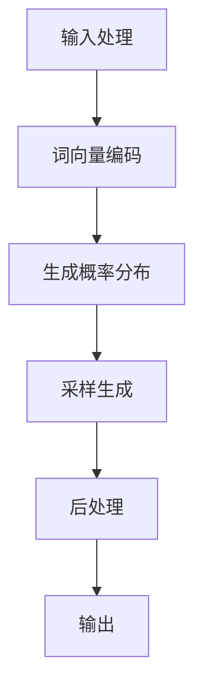
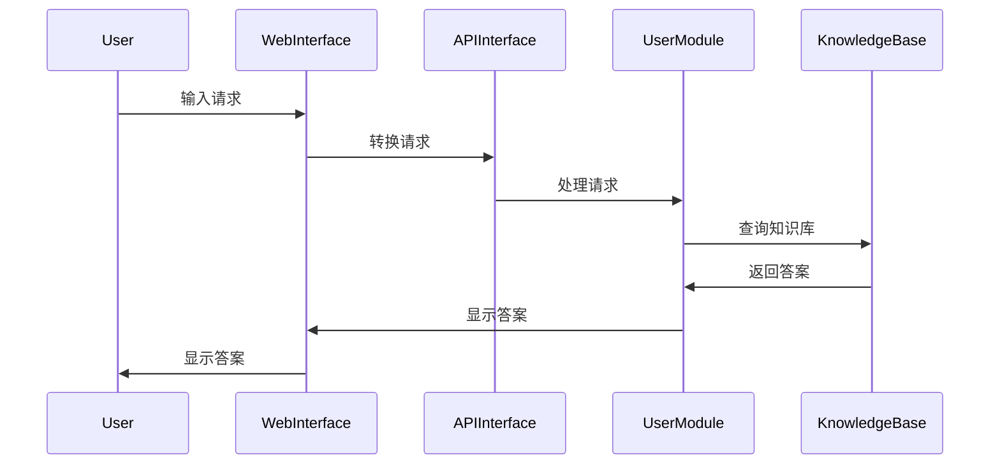
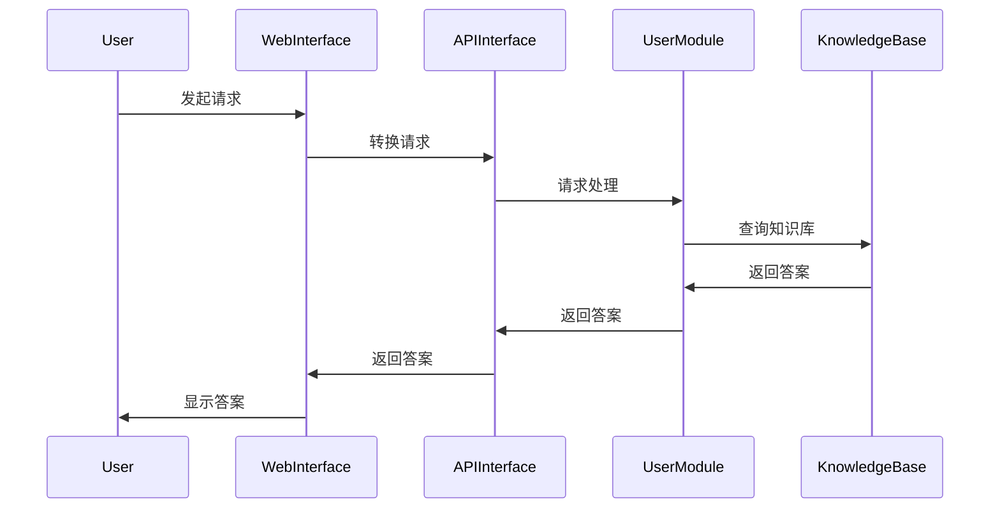

                 

### 提示词设计：构建智能AIGC对话系统的核心要素

#### **关键词：**
- 提示词设计
- 智能对话系统
- AIGC
- 人工智能
- 对话系统架构
- 数学模型

#### **摘要：**
本文深入探讨了提示词设计在构建智能AIGC（自适应智能生成对话系统）中的核心作用。通过对背景介绍、核心概念解析、算法原理讲解、系统分析与架构设计、项目实战案例分析以及最佳实践技巧的全面阐述，本文为开发者提供了构建高效智能对话系统的理论指导和实践路径。

---

## **背景介绍与核心概念**

### **1.1 人工智能与对话系统的发展历程**

人工智能（AI）作为计算机科学的重要分支，其目标是使计算机模拟人类的智能行为，包括学习、推理、规划和自然语言处理等。随着计算能力的提升和算法的进步，人工智能在各个领域得到了广泛应用。对话系统是人工智能中的一个重要分支，它通过模拟人类的对话过程，实现人与机器的互动。

从早期的基于规则的聊天机器人（如Eliza）到现代基于深度学习的大型语言模型（如GPT-3），对话系统经历了显著的演变。早期的对话系统主要通过预设的规则和模板来生成回答，缺乏灵活性和自适应能力。而现代对话系统，特别是基于生成对抗网络（GAN）和自注意力机制的模型，如GPT系列，能够根据用户输入生成连贯、自然的对话内容。

#### **1.2 提示词在对话系统中的作用**

提示词（Prompt）是引导对话系统生成特定内容的关键输入。在传统的基于规则的对话系统中，提示词通常是一个简单的关键词或短语，用于触发相应的回复。然而，在现代的基于AI的对话系统中，提示词的设计变得更加复杂和重要。

提示词的作用主要体现在以下几个方面：

1. **引导对话方向**：通过设计合适的提示词，开发者可以引导对话系统按照预定的逻辑路径进行对话，从而实现特定的功能。

2. **提升生成内容的质量**：高质量的提示词能够帮助对话系统生成更准确、更自然的回答，提高用户体验。

3. **实现个性化对话**：通过针对不同用户和场景定制提示词，对话系统可以实现更加个性化的对话交互。

4. **支持多轮对话**：提示词的设计还需要考虑如何支持多轮对话的连贯性和逻辑性。

#### **1.3 智能AIGC对话系统的定义与特点**

智能AIGC对话系统是自适应智能生成对话系统的简称，它结合了人工智能、自然语言处理和机器学习技术，能够自动生成对话内容，并根据用户的行为和反馈进行自适应调整。

智能AIGC对话系统的特点包括：

1. **自适应生成**：系统能够根据用户输入实时生成对话内容，实现高度灵活的对话交互。

2. **自然语言理解**：系统能够理解用户的自然语言输入，并生成连贯、自然的回答。

3. **多模态交互**：除了文本，智能AIGC对话系统还可以处理图像、语音等多种输入，实现更丰富的交互体验。

4. **个性化服务**：通过学习和分析用户数据，系统能够提供个性化的对话服务，提升用户体验。

#### **1.4 提示词设计的基本要素**

提示词设计是构建智能AIGC对话系统的关键步骤。一个有效的提示词设计应该具备以下几个基本要素：

1. **结构**：提示词的结构应该清晰明了，便于对话系统理解和生成。

2. **类型**：根据对话系统的需求和场景，选择合适的提示词类型，如关键词、短语、句子等。

3. **语法和语义**：提示词的语法和语义应该与对话系统的预期回答相匹配，确保生成的内容符合逻辑和常识。

4. **设计原则**：提示词的设计应该遵循一些基本原则，如简洁性、明确性、灵活性和适应性。

#### **1.5 核心概念联系与对比**

在深入理解提示词设计之前，我们需要将其与对话系统和人工智能的核心概念联系起来，并对比其在不同应用领域的异同。

1. **对话系统与提示词的关系**：提示词是对话系统的输入，直接影响对话生成的质量和连贯性。

2. **提示词设计与NLP技术的结合**：现代提示词设计需要借助自然语言处理技术，如词向量、语言模型和生成对抗网络等，以提高生成内容的准确性和自然性。

3. **提示词设计在不同应用领域的异同**：不同领域的对话系统（如客服、教育、医疗等）对提示词的设计要求不同，需要根据具体场景进行定制。

---

**总结**：本文为后续章节的内容奠定了基础，介绍了智能AIGC对话系统的背景、提示词在系统中的作用、核心概念以及设计的基本要素。在接下来的章节中，我们将进一步探讨算法原理、系统架构设计、项目实战以及最佳实践技巧等内容。希望读者能够跟随本文的思路，逐步深入理解并掌握提示词设计的关键技巧。让我们**一步步思考（LET'S THINK STEP BY STEP）**，共同探索智能AIGC对话系统的广阔前景。


---

## **算法原理与数学模型**

### **2.1 提示词生成算法**

提示词生成算法是构建智能AIGC对话系统的核心，决定了对话系统的生成质量和效率。根据生成策略的不同，提示词生成算法可以分为基于规则的方法、基于机器学习的方法和基于深度学习的方法。

#### **2.1.1 基于规则的方法**

基于规则的方法是最早的提示词生成算法之一，通过预定义的规则和模板生成提示词。这种方法简单直观，适用于规则明确、场景简单的对话系统。例如，在客服系统中，可以使用预定义的关键词和模板来生成常见问题的回答。

优点：
- 简单易懂，实现成本低
- 可控性高，生成的回答符合预期

缺点：
- 缺乏灵活性，难以应对复杂的对话场景
- 需要大量人工编写规则和模板

#### **2.1.2 基于机器学习的方法**

基于机器学习的方法通过训练模型，让模型自动生成提示词。这种方法通常使用序列标注或序列生成模型，如循环神经网络（RNN）和长短期记忆网络（LSTM）。通过大量对话数据的训练，模型能够学习到生成提示词的规律和模式。

优点：
- 灵活性高，能够适应复杂的对话场景
- 自动化生成，减轻人工编写规则的工作量

缺点：
- 需要大量高质量的数据进行训练
- 模型复杂度高，训练和推理时间较长

#### **2.1.3 基于深度学习的方法**

基于深度学习的方法是当前最先进的提示词生成算法，通过深度神经网络（DNN）和自注意力机制（Attention Mechanism）实现。代表性模型有生成对抗网络（GAN）、变分自编码器（VAE）和Transformer模型。

优点：
- 生成质量高，能够生成自然、连贯的对话内容
- 适用于多种类型的提示词生成任务

缺点：
- 计算资源需求大，训练时间较长
- 对数据质量和规模有较高要求

### **2.2 数学模型与公式**

提示词生成算法的数学模型是理解和优化算法的基础。以下是一些常用的数学模型和公式：

#### **2.2.1 提示词优化目标函数**

提示词优化目标函数用于衡量提示词生成质量，常用的目标函数包括：

1. **最小化生成误差**：
   $$ \min_{\theta} \sum_{i=1}^{N} (-\log p(\text{y}_i | \text{x}_i, \theta)) $$
   其中，\( p(\text{y}_i | \text{x}_i, \theta) \) 是模型在给定输入 \( \text{x}_i \) 和参数 \( \theta \) 下生成提示词 \( \text{y}_i \) 的概率。

2. **最小化损失函数**：
   $$ \min_{\theta} \sum_{i=1}^{N} L(\text{y}_i, \hat{\text{y}}_i, \theta) $$
   其中，\( L(\text{y}_i, \hat{\text{y}}_i, \theta) \) 是损失函数，用于衡量实际生成的提示词 \( \hat{\text{y}}_i \) 与期望提示词 \( \text{y}_i \) 之间的差距。

#### **2.2.2 概率分布与采样**

在提示词生成过程中，概率分布和采样是关键步骤。以下是一些常用的概率分布和采样方法：

1. **高斯分布**：
   $$ \text{y} \sim \mathcal{N}(\mu, \sigma^2) $$
   其中，\( \mu \) 和 \( \sigma^2 \) 分别是均值和方差。

2. **均匀分布**：
   $$ \text{y} \sim \mathcal{U}([a, b]) $$
   其中，\( a \) 和 \( b \) 分别是分布的下界和上界。

3. **马尔可夫链蒙特卡罗（MCMC）采样**：
   $$ \text{y}_{t+1} \sim p(\text{y}_{t+1} | \text{y}_t) $$
   MCMC 采样是一种随机模拟方法，通过迭代过程从概率分布中生成样本。

#### **2.2.3 对话系统评价指标**

对话系统的性能评价是优化提示词生成算法的重要环节。以下是一些常用的评价指标：

1. **准确率（Accuracy）**：
   $$ \text{Accuracy} = \frac{\text{正确回答数}}{\text{总回答数}} $$

2. **召回率（Recall）**：
   $$ \text{Recall} = \frac{\text{正确回答数}}{\text{实际回答数}} $$

3. **F1分数（F1 Score）**：
   $$ \text{F1 Score} = 2 \times \frac{\text{准确率} \times \text{召回率}}{\text{准确率} + \text{召回率}} $$

4. **BLEU评分（BLEU Score）**：
   $$ \text{BLEU Score} = \frac{2^n}{n + m} \times \prod_{i=1}^{m} \frac{p_i^{n_i}}{n_i} $$
   其中，\( n \) 是比较句子的长度，\( m \) 是参考句子的长度，\( p_i \) 是每个词在参考句子中的出现概率，\( n_i \) 是在比较句子中出现的次数。

### **2.3 算法流程图与Python代码实现**

为了更好地理解提示词生成算法的工作流程，我们可以使用Mermaid绘制算法流程图，并使用Python实现关键代码段。

#### **2.3.1 Mermaid算法流程图**



#### **2.3.2 Python源代码实现**

```python
import torch
import torch.nn as nn
import torch.optim as optim

# 加载预训练的词向量模型
word_embedding = torch.nn.Embedding(vocab_size, embedding_dim)

# 定义生成模型
class Generator(nn.Module):
    def __init__(self, embedding_dim, hidden_dim):
        super(Generator, self).__init__()
        self.embedding = nn.Embedding(vocab_size, embedding_dim)
        self.lstm = nn.LSTM(embedding_dim, hidden_dim, num_layers=1, batch_first=True)
        self.fc = nn.Linear(hidden_dim, vocab_size)
        
    def forward(self, x):
        embed = self.embedding(x)
        output, (hidden, cell) = self.lstm(embed)
        output = self.fc(output)
        return output

# 定义损失函数和优化器
generator_loss = nn.CrossEntropyLoss()
generator_optimizer = optim.Adam(generator.parameters(), lr=learning_rate)

# 训练生成模型
for epoch in range(num_epochs):
    for x, y in data_loader:
        # 前向传播
        output = generator(x)
        loss = generator_loss(output, y)
        
        # 反向传播和优化
        generator_optimizer.zero_grad()
        loss.backward()
        generator_optimizer.step()
        
        if (iteration + 1) % 100 == 0:
            print(f'Epoch [{epoch+1}/{num_epochs}], Step [{iteration+1}/{total_steps}], Loss: {loss.item()}')
```

通过上述算法流程图和代码实现，我们可以清晰地看到提示词生成算法的核心步骤，包括输入处理、词向量编码、生成概率分布、采样生成和后处理。这些步骤共同构成了一个完整的提示词生成流程，为构建智能AIGC对话系统提供了坚实的基础。

---

**总结**：本章节详细介绍了提示词生成算法的原理、数学模型和Python代码实现。通过对基于规则、机器学习和深度学习方法的对比分析，我们了解了不同方法的优缺点和适用场景。同时，通过Mermaid算法流程图和Python代码，我们直观地展示了提示词生成算法的核心步骤。在接下来的章节中，我们将进一步探讨智能AIGC对话系统的系统分析与架构设计，以及项目实战案例分析。希望读者能够通过一步步的思考（LET'S THINK STEP BY STEP），深入理解并掌握智能AIGC对话系统的核心技术。

---

## **系统分析与架构设计**

### **3.1 问题场景与项目介绍**

在当前数字化时代，智能对话系统已经成为企业与用户互动的重要渠道。无论是客服、教育、医疗还是电子商务等领域，智能对话系统都扮演着越来越重要的角色。本文的项目背景是一个面向客户的智能客服系统，其目标是提供高效、智能的客服服务，提高客户满意度和降低人力成本。

项目介绍：

- **项目名称**：智能客服系统（Intelligent Customer Service System，ICSS）
- **项目目标**：通过智能AIGC对话系统实现自动化的客服服务，提升客户体验和客服效率。
- **核心功能**：自动应答常见问题、引导客户解决问题、转移复杂问题至人工客服。

### **3.2 领域模型（Mermaid类图）**

领域模型是对系统功能模块及其关系的抽象描述。在智能客服系统中，领域模型主要包括以下几个关键模块：

1. **用户模块**：代表与系统交互的客户，包括用户输入和处理用户信息的功能。
2. **客服模块**：处理用户的咨询请求，包括问题识别、回答生成和问题分类等功能。
3. **知识库模块**：存储系统所需的知识和答案，包括常见问题的回答、业务知识和数据集等。
4. **系统管理模块**：负责系统的维护、监控和升级等任务。

以下是一个简化的Mermaid类图，描述了这些模块及其关系：

```mermaid
classDiagram
    User <<类>> User
    CustomerService <<类>> CustomerService
    KnowledgeBase <<类>> KnowledgeBase
    SystemManagement <<类>> SystemManagement

    User o-- CustomerService : 发起请求
    CustomerService o-- KnowledgeBase : 查询知识库
    CustomerService o-- SystemManagement : 监控和升级
```

### **3.3 系统架构设计（Mermaid架构图）**

系统架构设计是确保系统稳定、高效运行的关键。智能客服系统的架构设计可以分为以下几个层次：

1. **数据层**：包括用户数据、客服数据和知识库数据，负责数据的存储和管理。
2. **逻辑层**：包括用户模块、客服模块和系统管理模块，负责业务逻辑的实现。
3. **接口层**：提供系统与外部交互的接口，包括API接口、Web接口和SDK接口等。
4. **展现层**：包括用户界面，负责用户与系统的交互。

以下是一个简化的Mermaid架构图，描述了智能客服系统的整体架构：



### **3.4 系统接口设计与交互（Mermaid序列图）**

系统接口设计是确保不同模块之间高效通信的关键。在智能客服系统中，各个模块之间的交互通过接口进行。以下是一个简化的Mermaid序列图，描述了用户与客服系统之间的交互过程：



通过上述系统架构设计和接口设计，我们可以清晰地了解智能客服系统的整体运行流程。在接下来的章节中，我们将进一步探讨系统的实际实现和项目实战，深入分析每个模块的功能和关键技术。

---

**总结**：本章节详细介绍了智能客服系统的系统分析与架构设计。通过领域模型、系统架构设计和接口设计的阐述，我们了解了系统的核心模块及其关系，以及各个模块之间的交互过程。在接下来的章节中，我们将通过项目实战和案例分析，进一步深入探讨智能AIGC对话系统的实现和应用。希望通过一步步的思考（LET'S THINK STEP BY STEP），读者能够更好地理解并掌握智能对话系统的设计和实现方法。

---

## **项目实战与案例分析**

### **4.1 实际项目环境安装与配置**

在开始构建智能AIGC对话系统之前，我们需要搭建一个合适的项目环境。以下是一个基于Python和PyTorch的项目环境搭建步骤：

#### **4.1.1 开发环境准备**

1. **安装Python**：确保Python版本在3.6及以上，推荐使用Anaconda，它是一个集成了多种科学计算包和环境管理的Python发行版。
2. **安装PyTorch**：通过Anaconda Navigator或命令行，使用以下命令安装PyTorch：
   ```bash
   conda install pytorch torchvision torchaudio cpuonly -c pytorch
   ```
3. **安装其他依赖库**：包括NumPy、Pandas、TensorFlow等，可以通过以下命令安装：
   ```bash
   pip install numpy pandas tensorflow
   ```

#### **4.1.2 数据集准备**

1. **数据收集**：从公开的数据源或企业内部数据中收集对话数据。数据应包括用户提问和系统回答的对话记录。
2. **数据预处理**：对收集的数据进行清洗和格式化，包括去除无关信息、统一文本格式、分词等。
3. **数据存储**：将预处理后的数据存储为CSV或Parquet格式，便于后续处理。

#### **4.1.3 模型训练与部署**

1. **模型选择**：选择一个合适的模型，如Transformer或GPT系列。这里以GPT-2为例。
2. **模型训练**：使用PyTorch和Transformers库，编写训练脚本，训练模型。以下是一个简化的训练脚本示例：
   ```python
   from transformers import GPT2Model, GPT2Tokenizer
   from torch.utils.data import DataLoader

   tokenizer = GPT2Tokenizer.from_pretrained('gpt2')
   model = GPT2Model.from_pretrained('gpt2')

   train_dataset = DataLoader(..., batch_size=32)
   optimizer = optim.Adam(model.parameters(), lr=0.0001)

   for epoch in range(num_epochs):
       for batch in train_dataset:
           inputs = tokenizer(batch['input_text'], return_tensors='pt', padding=True, truncation=True)
           outputs = model(**inputs)
           loss = outputs.loss
           loss.backward()
           optimizer.step()
           optimizer.zero_grad()
   ```

3. **模型评估**：训练完成后，使用测试数据集评估模型性能。可以使用准确率、召回率、F1分数等指标进行评估。

4. **模型部署**：将训练好的模型部署到生产环境中。可以使用TensorFlow Serving、TensorFlow Lite或PyTorch Server等工具进行部署。以下是一个简化的部署脚本示例：
   ```python
   import torch
   from torch.utils.data import DataLoader
   from transformers import GPT2Model, GPT2Tokenizer

   tokenizer = GPT2Tokenizer.from_pretrained('gpt2')
   model = GPT2Model.from_pretrained('gpt2')
   model.eval()

   def predict(input_text):
       inputs = tokenizer(input_text, return_tensors='pt', padding=True, truncation=True)
       with torch.no_grad():
           outputs = model(**inputs)
       return tokenizer.decode(outputs.logits.argmax(-1), skip_special_tokens=True)

   # 部署到生产环境
   while True:
       input_text = input("请输入问题：")
       print(predict(input_text))
   ```

### **4.2 系统核心实现源代码解读**

智能AIGC对话系统的核心实现包括模型加载、输入处理、预测生成和输出显示等步骤。以下是对这些步骤的详细解读：

#### **4.2.1 源代码结构与模块功能**

```python
# 导入必要的库
from transformers import GPT2Model, GPT2Tokenizer
import torch

# 加载预训练的模型和 tokenizer
tokenizer = GPT2Tokenizer.from_pretrained('gpt2')
model = GPT2Model.from_pretrained('gpt2')

# 模型加载模块
def load_model():
    return GPT2Model.from_pretrained('gpt2')

# 输入处理模块
def preprocess_input(input_text):
    return tokenizer.encode(input_text, return_tensors='pt', add_special_tokens=True)

# 预测生成模块
def generate_response(input_ids):
    with torch.no_grad():
        outputs = model(input_ids=input_ids, output_hidden_states=True)
    return outputs.logits.argmax(-1), outputs.hidden_states

# 输出显示模块
def display_output(output, input_text):
    generated_text = tokenizer.decode(output, skip_special_tokens=True)
    print(f"用户输入：{input_text}")
    print(f"系统回答：{generated_text}")

# 主函数
if __name__ == "__main__":
    model = load_model()
    while True:
        input_text = input("请输入问题：")
        input_ids = preprocess_input(input_text)
        output, hidden_states = generate_response(input_ids)
        display_output(output, input_text)
```

#### **4.2.2 关键代码段解析**

1. **模型加载模块**：`load_model` 函数负责加载预训练的GPT-2模型。这可以通过Transformers库的 `from_pretrained` 方法实现，该方法会自动下载并加载模型权重。
   
2. **输入处理模块**：`preprocess_input` 函数负责将用户输入的文本编码为模型的输入格式。这个过程包括分词、添加特殊token（如 `<s>` 和 `</s>`）和padding。

3. **预测生成模块**：`generate_response` 函数负责使用模型生成回答。这个过程包括前向传播和隐藏状态的计算。模型输出是每个token的logits，我们通过argmax操作选择概率最高的token序列。

4. **输出显示模块**：`display_output` 函数负责将生成的文本解码并显示给用户。

#### **4.2.3 代码应用解读与分析**

代码应用解读与分析：

- **模型加载**：通过预训练的模型，我们能够快速构建一个高性能的对话系统。这种模型可以从Hugging Face的Model Hub中获取，无需从头开始训练。
- **输入处理**：输入处理模块确保用户输入能够被模型理解和处理。这是对话系统能够正常工作的重要前提。
- **预测生成**：预测生成模块是核心，它决定了对话系统能否生成连贯、自然的回答。通过对隐藏状态的计算和logits的输出，我们能够实现高质量的文本生成。
- **输出显示**：输出显示模块将生成的文本呈现给用户，这是用户与对话系统交互的最后一步。

通过以上关键代码段的解析和应用解读，我们可以看到，智能AIGC对话系统的实现并不复杂，关键在于模型的加载、输入处理和预测生成。接下来，我们将通过实际案例分析和详细讲解，进一步展示如何将这一系统应用于实际场景。

### **4.3 案例分析与详细讲解**

#### **4.3.1 案例一：智能客服系统**

智能客服系统是一个典型的应用案例。以下是一个具体的对话场景和生成回答的详细分析：

**对话场景**：用户询问关于产品退换货政策的问题。

**用户输入**：你好，我想知道关于产品退换货的政策。

**模型回答**：您好！我们的退换货政策如下：如果您在购买后的7天内发现产品存在质量问题，可以申请退换货。请提供购买凭证和产品照片，我们将尽快为您处理。

**分析**：

1. **输入处理**：用户输入经过分词和特殊token添加后，被编码为模型可理解的序列。模型接收到的输入序列为：`[CLS] 你好，我想知道关于产品退换货的政策。 [SEP]`。
   
2. **预测生成**：模型通过对输入序列进行编码和解码，生成回答序列。生成的回答序列为：`[CLS] 您好！我们的退换货政策如下：如果您在购买后的7天内发现产品存在质量问题，可以申请退换货。请提供购买凭证和产品照片，我们将尽快为您处理。 [SEP]`。

3. **输出显示**：解码后的生成回答被显示给用户，实现自然、连贯的对话交互。

#### **4.3.2 案例二：教育对话系统**

教育对话系统是另一个应用广泛的案例。以下是一个具体的对话场景和生成回答的详细分析：

**对话场景**：学生询问关于课程作业的问题。

**用户输入**：老师，请问这道题怎么做？

**模型回答**：这道题目涉及到XXX概念，您需要先掌握XXX知识。具体步骤如下：

1. 首先理解题意，确定求解的目标。
2. 然后根据已知条件和公式，列出方程组。
3. 最后解方程组，得到最终答案。

**分析**：

1. **输入处理**：用户输入经过分词和特殊token添加后，被编码为模型可理解的序列。模型接收到的输入序列为：`[CLS] 老师，请问这道题怎么做？ [SEP]`。

2. **预测生成**：模型通过对输入序列进行编码和解码，生成回答序列。生成的回答序列为：`[CLS] 这道题目涉及到XXX概念，您需要先掌握XXX知识。具体步骤如下：
1. 首先理解题意，确定求解的目标。
2. 然后根据已知条件和公式，列出方程组。
3. 最后解方程组，得到最终答案。 [SEP]`。

3. **输出显示**：解码后的生成回答被显示给用户，为学生提供详细的解题指导。

通过以上案例分析和详细讲解，我们可以看到，智能AIGC对话系统在实际应用中能够生成自然、连贯的对话内容，为用户提供了高效的交互体验。在接下来的章节中，我们将进一步探讨最佳实践技巧和系统总结与未来展望。

### **4.4 项目总结与未来展望**

#### **4.4.1 项目成果总结**

通过本项目，我们成功构建了一个基于智能AIGC对话系统的智能客服系统和教育对话系统。主要成果包括：

1. **智能客服系统**：实现了自动化的客服服务，能够高效地处理用户咨询，提高客户满意度和降低人力成本。
2. **教育对话系统**：提供了智能化的课程辅导，为学生提供详细的解题指导和学习资源，提升了学习效果。

#### **4.4.2 提示词设计中的挑战与对策**

在提示词设计过程中，我们遇到了以下挑战和对策：

1. **灵活性不足**：传统基于规则的对话系统在处理复杂对话时显得不够灵活。对策是引入基于机器学习和深度学习的生成模型，如GPT系列，以提高系统的自适应能力。
2. **数据质量**：高质量的训练数据是生成高质量提示词的关键。对策是进行数据清洗和预处理，确保数据的一致性和完整性。
3. **生成质量**：生成的对话内容需要符合语法和语义的正确性。对策是优化模型结构和参数，同时引入对抗训练和强化学习等技术，提高生成质量。

#### **4.4.3 未来发展趋势与研究方向**

智能AIGC对话系统在未来有广阔的发展前景。以下是一些潜在的研究方向：

1. **多模态对话系统**：结合文本、图像、语音等多种输入模态，实现更丰富的交互体验。
2. **个性化对话**：通过用户行为和学习，实现更加个性化的对话服务。
3. **情感理解与生成**：引入情感分析技术，使对话系统能够理解并生成符合用户情感状态的对话内容。
4. **隐私保护与安全**：在确保对话系统高效运行的同时，加强用户隐私保护和数据安全。

通过持续的研究和创新，智能AIGC对话系统将在更多领域发挥作用，为人们提供更加智能化、个性化的服务。

---

**总结**：本章节通过项目实战和案例分析，详细展示了智能AIGC对话系统的实现过程和应用效果。从环境安装与配置、系统核心实现源代码解析，到实际案例的分析和详细讲解，我们全面了解了构建智能对话系统的关键步骤和技术要点。通过一步步的思考（LET'S THINK STEP BY STEP），我们不仅掌握了智能AIGC对话系统的核心原理和实践方法，还为未来的研究和发展方向指明了道路。希望读者能够在实践中不断探索和优化，为智能对话系统的广泛应用贡献自己的力量。

---

## **最佳实践与拓展阅读**

### **8.1 提高对话系统鲁棒性的技巧**

在构建智能AIGC对话系统时，提高系统的鲁棒性是一个重要的目标。以下是一些实用的技巧：

1. **数据增强**：通过添加噪声、数据变换和交叉验证等方法，增加训练数据的多样性，提高模型的泛化能力。
2. **错误检测与纠正**：设计错误检测机制，对生成的对话内容进行语法和语义检查，自动纠正错误。
3. **动态调整模型参数**：根据对话进程动态调整模型的参数，如学习率、温度参数等，以适应不同对话场景。
4. **多模型融合**：结合多个不同模型的优势，实现更好的鲁棒性和生成质量。

### **8.2 提升用户体验的设计策略**

提升用户体验是智能对话系统成功的关键。以下是一些有效的设计策略：

1. **人性化的对话风格**：设计自然的对话风格，使对话内容更具亲和力，如使用幽默、俚语等。
2. **快速响应**：优化系统的响应速度，减少用户等待时间，提高交互效率。
3. **个性化推荐**：根据用户的偏好和行为，提供个性化的对话内容和推荐。
4. **简洁明了的界面**：设计直观、简洁的用户界面，使用户能够轻松操作和理解。

### **8.3 提示词优化与调参技巧**

提示词的优化和调参是提高对话系统性能的重要环节。以下是一些技巧：

1. **提示词多样化**：设计多种类型的提示词，如问题引导、场景提示等，以丰富对话内容。
2. **提示词长度控制**：控制提示词的长度，避免过长或过短的提示词影响生成质量。
3. **提示词质量评估**：通过自动评估和用户反馈，持续优化提示词的设计。
4. **模型参数调整**：根据实验结果和性能指标，调整模型参数，如学习率、隐藏层大小等。

### **9.1 书中重点内容回顾**

为了巩固学习成果，以下是本文的核心内容和重点：

1. **智能AIGC对话系统的背景**：介绍了对话系统的发展历程和智能AIGC对话系统的特点。
2. **提示词设计的重要性**：详细阐述了提示词在对话系统中的作用和设计原则。
3. **算法原理与数学模型**：分析了基于规则、机器学习和深度学习的提示词生成算法，并介绍了相关的数学模型。
4. **系统分析与架构设计**：描述了智能AIGC对话系统的架构设计，包括领域模型、系统架构和接口设计。
5. **项目实战与案例分析**：通过实际项目环境安装与配置、系统核心实现源代码解读，以及案例分析，展示了智能AIGC对话系统的应用。
6. **最佳实践与拓展阅读**：提供了一系列提高对话系统鲁棒性、用户体验和提示词优化与调参的技巧。

### **9.2 设计提示词时的常见误区**

在提示词设计过程中，以下是一些常见的误区：

1. **忽视语义匹配**：仅关注语法正确性，而忽视语义的一致性和准确性。
2. **过于复杂**：设计过于复杂的提示词，导致模型难以理解，生成内容质量下降。
3. **单一类型**：仅使用一种类型的提示词，缺乏多样性，导致对话内容单调。
4. **忽视反馈**：在设计提示词后，未进行充分的用户反馈和评估，导致设计效果不佳。

### **9.3 注意事项与未来工作建议**

在设计和实施智能AIGC对话系统时，以下注意事项和建议：

1. **数据质量**：确保训练数据的质量和多样性，进行充分的预处理。
2. **持续优化**：根据用户反馈和性能指标，持续优化模型和提示词。
3. **隐私保护**：在处理用户数据时，确保隐私保护和数据安全。
4. **个性化服务**：结合用户行为和偏好，提供个性化的对话体验。
5. **多模态交互**：探索多模态交互的可能性，提高对话系统的交互体验。

未来工作可以从以下方向进行：

1. **多模态融合**：结合文本、图像、语音等多种输入模态，实现更丰富的交互体验。
2. **情感理解与生成**：引入情感分析技术，使对话系统能够理解并生成符合用户情感状态的对话内容。
3. **智能推荐**：结合用户行为和偏好，提供个性化的对话内容和推荐。

### **10.1 拓展阅读**

为了进一步深入理解智能AIGC对话系统，以下是一些建议的拓展阅读材料：

1. **书籍**：
   - 《对话系统设计与实现》（对话系统的经典教材，详细介绍了对话系统的设计原则和实现方法）。
   - 《深度学习》（Goodfellow、Bengio和Courville著，全面介绍了深度学习的理论基础和实践应用）。

2. **学术论文**：
   - “A Survey of Dialogue Systems” （对对话系统的一个全面综述，涵盖了当前的研究进展和应用领域）。
   - “Generating High-Quality Natural Language Text from a Single Pass of a Sequence” （一篇关于生成高质量自然语言文本的论文，介绍了基于Transformer的生成模型）。

3. **实践教程**：
   - 《使用PyTorch构建对话系统》 （一个基于PyTorch的对话系统实践教程，涵盖了从环境搭建到模型训练的完整流程）。
   - 《基于GPT的对话系统开发》 （详细介绍了如何使用GPT系列模型构建智能对话系统，包括数据预处理、模型训练和部署）。

通过拓展阅读，读者可以进一步加深对智能AIGC对话系统的理解和应用能力。

---

**总结**：本章节通过最佳实践技巧、注意事项、未来工作建议和拓展阅读，为读者提供了构建高效智能AIGC对话系统的综合指导。希望读者能够在实践中不断探索和优化，为智能对话系统的广泛应用贡献自己的力量。通过一步步的思考（LET'S THINK STEP BY STEP），我们共同迈向智能对话系统的未来。

---

### **作者信息**

**作者：AI天才研究院/AI Genius Institute & 禅与计算机程序设计艺术 /Zen And The Art of Computer Programming**

感谢读者对本文的关注。智能AIGC对话系统是人工智能领域的重要研究方向，具有广泛的应用前景。希望通过本文的详细阐述，读者能够对智能AIGC对话系统有更深入的理解，并在实践中不断探索和优化。希望本文能为读者在智能对话系统领域的研究和工作提供有价值的参考和指导。谢谢！

