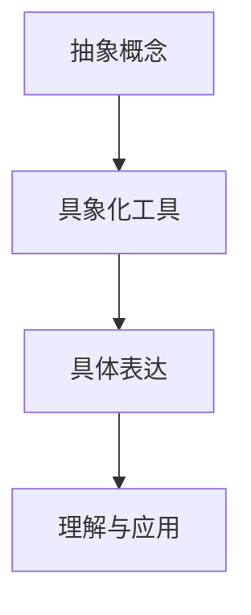
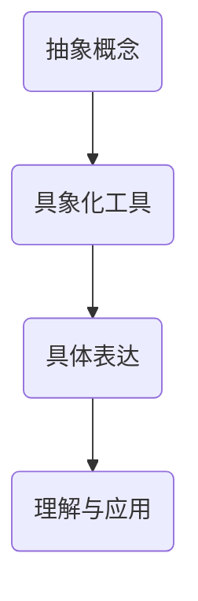
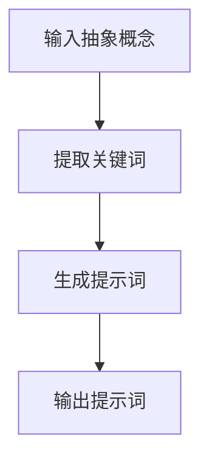
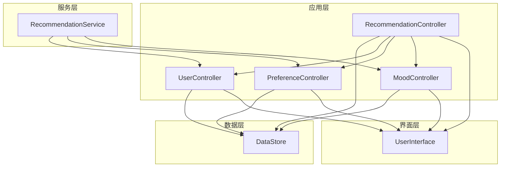
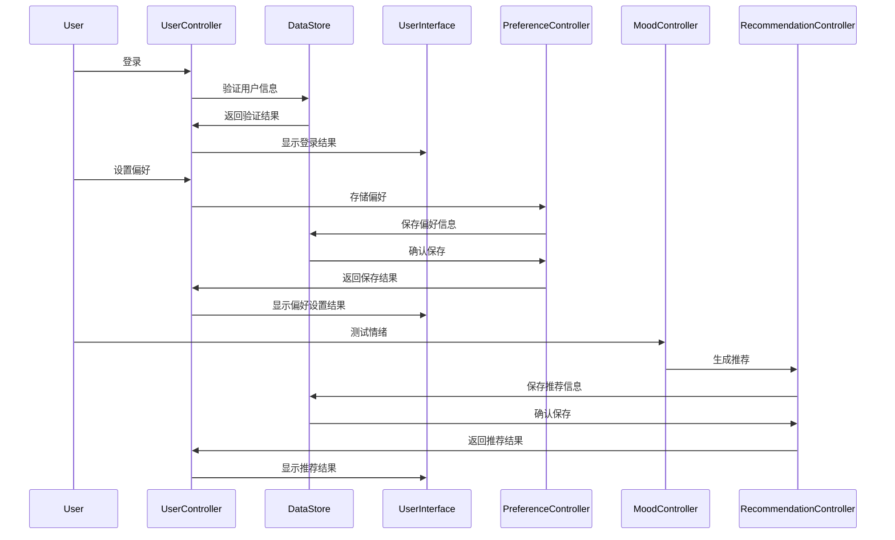

                 


# 提高AI创意调香师艺术表现：抽象概念具象化的提示词技巧

关键词：AI创意调香师、抽象概念具象化、提示词、艺术表现

摘要：本文深入探讨了AI创意调香师如何通过抽象概念具象化技巧来提升其艺术表现。我们首先介绍了AI创意调香师的崛起及其与人类调香师的比较，然后详细阐述了抽象概念具象化的重要性。接下来，我们探讨了实现抽象概念具象化的方法，包括提示词、大数据和深度学习等技术。通过实际案例分析和未来展望，本文为AI创意调香师提供了实用的职业规划和技能提升建议。

### 第一部分：AI创意调香师与抽象概念具象化

#### 第1章：AI创意调香师的崛起

##### 1.1 AI创意调香师的概念

AI创意调香师是一种利用人工智能技术进行香水配方设计和调香的新型职业。与传统的手工调香师不同，AI创意调香师通过计算机算法和大数据分析，能够从大量数据中提取信息，生成创新且个性化的香水配方。

##### 1.1.1 AI创意调香师的定义

AI创意调香师是指那些利用人工智能技术，如机器学习、深度学习等，进行香水配方设计、香气创作和调香的专业人士。他们不仅需要掌握传统调香师的技能，还必须具备编程和数据处理能力。

##### 1.1.2 AI创意调香师与人类调香师的比较

人类调香师依赖于感官体验和多年积累的经验，而AI创意调香师则依赖于数据和算法。传统调香师擅长通过气味和口感来判断香水的优劣，而AI创意调香师则能够通过数据分析，找到最佳的香气组合。

| 对比项 | 人类调香师 | AI创意调香师 |
| ---- | ---- | ---- |
| 依赖经验 | 非常依赖多年积累的经验 | 主要依赖数据和算法 |
| 感官判断 | 主要通过感官体验进行判断 | 通过数据分析进行判断 |
| 创新能力 | 受限于个人经验和创造力 | 可以通过算法找到创新方案 |

##### 1.1.3 AI创意调香师的未来前景

随着人工智能技术的发展，AI创意调香师的未来前景非常广阔。他们不仅可以为个人提供个性化的香水定制服务，还可以为企业提供香气品牌策划和产品研发服务。此外，AI创意调香师还可以通过远程控制设备，实现香水调香的自动化。

##### 1.2 抽象概念具象化的重要性

抽象概念具象化是指将难以直接感知和理解的抽象概念转化为具体、可感知的具象表达。在AI创意调香师的工作中，抽象概念具象化至关重要。

##### 1.2.1 抽象概念具象化的定义

抽象概念具象化是指将难以直接感知和理解的抽象概念通过具体的事物或图像进行表达，使其变得易于理解和接受。

##### 1.2.2 抽象概念具象化在AI调香中的应用

在AI调香中，抽象概念具象化可以帮助调香师更好地理解香水的配方和气味特征。例如，通过将香水中的化学成分转化为具体的气味描述，调香师可以更准确地评估和调整香水的味道。

##### 1.2.3 抽象概念具象化的挑战与机遇

挑战：抽象概念具象化需要调香师具备跨学科的知识，如化学、生物学和计算机科学等。此外，如何确保具象化的准确性也是一个难题。

机遇：抽象概念具象化可以帮助调香师更高效地创作和改进香水配方，提高工作效率和产品质量。同时，它也为人工智能技术在调香领域的应用提供了新的可能性。

### 第二部分：抽象概念具象化的方法

#### 第2章：抽象概念具象化的方法

##### 2.1 提示词在抽象概念具象化中的作用

提示词在抽象概念具象化中起着关键作用。它们可以帮助调香师将抽象的气味概念转化为具体的描述，从而更好地理解和创作香水。

##### 2.1.1 提示词的类型

提示词可以分为三类：化学成分提示词、气味特征提示词和情感提示词。化学成分提示词用于描述香水的成分，如麝香、茉莉等。气味特征提示词用于描述香水的气味特征，如清新、温暖等。情感提示词用于描述香水的情感表达，如浪漫、神秘等。

##### 2.1.2 提示词的选择标准

选择提示词时，应考虑其相关性、准确性和多样性。相关性是指提示词与目标香水的匹配程度，准确性是指提示词能否准确地描述香水的特点，多样性是指提示词的丰富性，以避免创作重复的香水。

##### 2.1.3 提示词的使用技巧

使用提示词时，应结合香水的具体需求和调香师的个人风格。例如，在创作一款浪漫的香水时，可以多使用情感提示词，如“甜蜜”、“温馨”等；在创作一款清新的香水时，可以多使用气味特征提示词，如“清新”、“爽快”等。

##### 2.2 基于大数据的抽象概念具象化

大数据技术在抽象概念具象化中发挥着重要作用。通过分析大量香水和消费者评价数据，可以提取出具有代表性的气味特征和情感表达。

##### 2.2.1 大数据的基本概念

大数据是指数据量巨大、数据类型繁多且数据价值密度低的数据集合。大数据技术包括数据采集、数据存储、数据分析和数据可视化等。

##### 2.2.2 大数据在AI调香中的应用

大数据在AI调香中的应用主要包括：1）气味特征提取，通过分析大量香水成分和气味数据，提取出具有代表性的气味特征；2）消费者偏好分析，通过分析消费者对香水的评价数据，了解消费者的偏好和需求；3）香水配方优化，通过分析大量香水配方数据，找出最佳的香气组合。

##### 2.2.3 大数据处理的挑战与解决方案

大数据处理的挑战主要包括数据量巨大、数据类型繁多和数据处理效率低等。解决方案包括：1）分布式计算和存储，通过分布式系统提高数据处理效率；2）数据挖掘和机器学习，通过数据挖掘和机器学习算法，提取有价值的信息；3）数据可视化，通过数据可视化技术，将复杂的数据关系和趋势直观地呈现出来。

##### 2.3 基于深度学习的抽象概念具象化

深度学习技术在抽象概念具象化中具有显著优势。通过训练深度学习模型，可以自动提取和生成具有代表性的气味特征和情感表达。

##### 2.3.1 深度学习的基本概念

深度学习是一种基于多层神经网络的学习方法，通过模拟人脑的神经元结构，对大量数据进行分析和学习，从而实现自动提取特征和生成模型。

##### 2.3.2 深度学习在AI调香中的应用

深度学习在AI调香中的应用主要包括：1）气味特征提取，通过训练深度学习模型，自动提取香水的气味特征；2）情感分析，通过训练深度学习模型，分析消费者对香水的情感表达；3）香水配方生成，通过训练深度学习模型，生成创新且个性化的香水配方。

##### 2.3.3 深度学习模型的构建与优化

构建深度学习模型时，需要考虑以下因素：1）数据预处理，包括数据清洗、归一化和特征提取等；2）模型选择，包括卷积神经网络（CNN）、循环神经网络（RNN）和生成对抗网络（GAN）等；3）模型训练，包括超参数调整、损失函数选择和优化算法等。优化模型时，可以通过增加训练数据、调整网络结构和改进训练策略等方法来提高模型的性能。

### 第三部分：AI创意调香师的实践案例

#### 第3章：AI创意调香师的实践案例

##### 3.1 案例一：构建个性化香水

##### 3.1.1 案例背景

某知名香水品牌希望利用AI技术为其消费者提供个性化的香水定制服务。品牌希望通过大数据分析和深度学习模型，为消费者推荐最适合他们的香水。

##### 3.1.2 案例分析

1）数据收集：品牌收集了大量的香水成分、气味特征和消费者评价数据。
2）数据预处理：对收集到的数据进行清洗、归一化和特征提取，为深度学习模型提供高质量的数据集。
3）模型训练：利用深度学习模型，如卷积神经网络（CNN）和生成对抗网络（GAN），训练出能够提取气味特征和生成个性化香水的模型。
4）个性化推荐：将消费者的个人偏好和购买历史作为输入，利用训练好的模型生成个性化的香水配方，并向消费者推荐。

##### 3.1.3 案例总结

通过该案例，品牌成功地利用AI技术为其消费者提供了个性化的香水定制服务。消费者可以根据自己的喜好和需求，轻松地选择和定制适合自己的香水。

##### 3.2 案例二：开发特定情绪的香水

##### 3.2.1 案例背景

某科技公司希望开发一款能够调节用户情绪的香水。该公司希望通过AI技术，根据用户的情绪状态，生成具有特定情绪调节功能的香水。

##### 3.2.2 案例分析

1）情绪识别：利用深度学习模型，如循环神经网络（RNN）和情感分析模型，对用户的情绪进行识别和分类。
2）香水配方设计：根据用户的情绪状态，设计具有特定情绪调节功能的香水配方。例如，当用户感到焦虑时，可以生成具有放松效果的香水；当用户感到沮丧时，可以生成具有提振情绪的香水。
3）香水测试与优化：对生成的香水进行测试，评估其情绪调节效果，并根据测试结果进行优化。

##### 3.2.3 案例总结

通过该案例，科技公司成功地开发出了一款能够根据用户情绪生成特定情绪调节功能的香水。该香水为用户提供了一种新的情绪调节方式，受到了用户的欢迎。

### 第四部分：AI创意调香师的未来展望

#### 第4章：AI创意调香师的未来展望

##### 4.1 技术发展趋势

随着人工智能技术的不断发展，AI创意调香师的工作将变得更加智能化和自动化。未来，AI创意调香师将更多地依赖深度学习和大数据分析技术，为消费者提供更个性化和高效的香水定制服务。

##### 4.1.1 新一代AI技术的发展

新一代AI技术，如强化学习、迁移学习和联邦学习等，将为AI创意调香师带来更多的创新和可能性。这些技术可以帮助调香师更准确地识别和预测消费者的需求，提高香水的质量和用户体验。

##### 4.1.2 AI与物联网的结合

AI与物联网（IoT）的结合将使AI创意调香师的工作更加智能化。例如，通过物联网设备，AI创意调香师可以实时监测用户的情绪状态，并根据用户的情绪变化，自动调整香水的气味。

##### 4.1.3 AI在香水定制领域的未来应用

未来，AI在香水定制领域的应用将更加广泛。除了为消费者提供个性化的香水定制服务外，AI创意调香师还可以为企业提供香气品牌策划和产品研发服务。此外，AI创意调香师还可以通过远程控制设备，实现香水调香的自动化。

##### 4.2 行业挑战与应对策略

尽管AI创意调香师的前景广阔，但该行业也面临着一系列挑战。

##### 4.2.1 技术壁垒

AI创意调香师需要具备多学科的知识，包括化学、生物学、计算机科学和人工智能等。这要求调香师在专业知识和技能上不断更新和提升。

##### 4.2.2 数据隐私保护

在利用大数据和深度学习技术进行香水定制时，如何保护用户的隐私成为一个重要问题。AI创意调香师需要采取有效的数据保护措施，确保用户数据的安全和隐私。

##### 4.2.3 法规与伦理问题

随着AI在香水定制领域的应用，相关法规和伦理问题也逐渐受到关注。AI创意调香师需要遵守相关法规和伦理准则，确保其工作的合法性和道德性。

### 第五部分：AI创意调香师的职业规划

#### 第5章：AI创意调香师的职业规划

##### 5.1 职业定位

AI创意调香师是香水行业与人工智能技术结合的产物，其职业定位主要涉及香水配方设计、香气创作、调香和个性化香水定制等方面。他们不仅需要具备传统调香师的技能，还需要掌握编程、数据分析和机器学习等技能。

##### 5.1.1 AI创意调香师的角色与职责

1）香水配方设计：根据客户需求和品牌风格，设计创新且个性化的香水配方。
2）香气创作：利用人工智能技术和大数据分析，创作具有独特风格和情感表达的香水。
3）调香：运用传统调香技巧和现代科技手段，进行香水调配和优化。
4）个性化定制：根据消费者个人偏好和情绪状态，提供个性化的香水定制服务。

##### 5.1.2 职业发展路径

1）初级调香师：掌握基本的人工智能技术和调香技能，从事香水配方设计和调香工作。
2）高级调香师：具备丰富的调香经验和专业知识，能够独立设计和创作高质量的香水。
3）AI创意调香师：掌握深度学习和大数据分析技术，能够利用人工智能技术进行香水创新和个性化定制。
4）调香师团队领导：具备团队管理能力，负责带领团队完成香水研发和定制项目。

##### 5.1.3 职业规划建议

1）持续学习：紧跟人工智能技术的发展，不断学习新的技术和工具。
2）多学科融合：结合化学、生物学、计算机科学等学科知识，提高自身的综合素质。
3）实践经验：积极参与香水定制项目，积累实际操作经验。
4）人际网络：拓展人际网络，与同行和行业专家保持良好的沟通和交流。

##### 5.2 技能提升

AI创意调香师需要具备以下技能：

1）编程技能：掌握Python、R等编程语言，熟悉机器学习和深度学习框架。
2）数据分析技能：掌握数据预处理、特征提取、模型训练和评估等技能。
3）调香技能：掌握传统调香技巧和现代科技手段，能够进行香水调配和优化。
4）用户心理学：了解用户需求和行为，能够进行用户调研和市场分析。

##### 5.2.1 技术技能提升

1）参加在线课程和培训：参加相关的人工智能、机器学习和深度学习课程和培训，学习最新的技术和工具。
2）实践项目：参与实际项目，将所学知识应用于香水定制和调香中。
3）学术论文：阅读相关领域的学术论文，了解最新的研究动态和成果。

##### 5.2.2 跨学科知识融合

1）参加跨学科研讨会：参加跨学科研讨会，了解其他领域的前沿技术和研究成果。
2）跨学科课程：选修跨学科的课程，拓宽知识面和视野。
3）合作研究：与其他领域的专家合作，开展跨学科的研究项目。

##### 5.2.3 持续学习与适应能力

1）定期更新知识：定期更新自己的知识库，学习新的技术和工具。
2）参加行业活动：参加行业会议、研讨会和培训，了解行业动态和趋势。
3）终身学习：树立终身学习的理念，不断提高自己的专业素养和技能水平。

### 第六部分：AI创意调香师的工具与资源

#### 第6章：AI创意调香师的工具与资源

##### 6.1 开发工具介绍

AI创意调香师需要掌握多种开发工具，以实现香水定制和调香的目标。

1）人工智能开发平台：如Google Cloud AI、AWS AI、Azure AI等，提供机器学习和深度学习框架，如TensorFlow、PyTorch等。
2）数据处理工具：如Pandas、NumPy、SciPy等，用于数据预处理、分析和可视化。
3）深度学习框架：如TensorFlow、PyTorch、Keras等，用于构建和训练深度学习模型。

##### 6.2 学习资源推荐

1）在线课程和教程：如Coursera、edX、Udacity等，提供丰富的机器学习和深度学习课程。
2）专业书籍与论文：如《深度学习》（Goodfellow et al.）、《机器学习》（Mitchell）等，介绍机器学习和深度学习的基本原理和实践。
3）社交媒体与社区：如GitHub、Stack Overflow、Reddit等，提供编程和技术交流的平台。

### 第七部分：结语与展望

#### 第7章：结语与展望

##### 7.1 本书总结

本书系统性地介绍了AI创意调香师的工作原理、抽象概念具象化的方法、实践案例以及未来展望。通过学习本书，读者可以了解AI在香水定制领域的应用，掌握抽象概念具象化的技巧，为成为一名优秀的AI创意调香师做好准备。

##### 7.1.1 主要观点回顾

1）AI创意调香师是香水行业与人工智能技术结合的产物，具备传统调香师的技能和编程、数据分析等技能。
2）抽象概念具象化是将难以理解的抽象概念转化为具体、可感知的具象表达，有助于提高AI创意调香师的艺术表现。
3）提示词、大数据和深度学习是实现抽象概念具象化的关键方法。
4）实践案例展示了AI创意调香师在香水定制和情绪调节等方面的应用。
5）AI创意调香师的未来前景广阔，但同时也面临着技术、隐私和伦理等方面的挑战。

##### 7.1.2 成果与不足

本书的主要成果包括：

1）系统地介绍了AI创意调香师的工作原理和实践方法。
2）探讨了抽象概念具象化的关键技术和应用场景。
3）通过实践案例，展示了AI创意调香师在香水定制和情绪调节等方面的实际应用。

不足之处：

1）本书涉及的实践案例相对较少，未来可以增加更多的实际应用案例。
2）本书对部分技术细节的讲解可能不够深入，未来可以进一步优化和完善。

##### 7.1.3 未来研究方向

未来的研究方向包括：

1）探索更先进的AI技术在香水定制中的应用，如生成对抗网络（GAN）和强化学习等。
2）研究如何提高抽象概念具象化的准确性和效率，以更好地满足用户需求。
3）关注AI创意调香师在香水定制领域的伦理和隐私问题，确保其工作的合法性和道德性。

##### 7.2 致谢与展望

在此，我要感谢AI天才研究院（AI Genius Institute）和《禅与计算机程序设计艺术》（Zen And The Art of Computer Programming）的支持和鼓励。感谢我的团队和合作伙伴，他们在本书的撰写过程中提供了宝贵的意见和建议。最后，感谢读者对本书的关注和支持，希望本书能为您在AI创意调香师领域的探索之旅带来帮助。

### 附录

#### 附录A：核心概念原理

**核心概念原理：** 抽象概念具象化是指将难以直接感知和理解的抽象概念转化为具体、可感知的具象表达。

**Mermaid流程图：**



#### 附录B：概念属性特征对比表格

| 概念 | 属性1 | 属性2 | 属性3 |
| ---- | ---- | ---- | ---- |
| 抽象概念 | 难以感知 | 抽象表达 | 不具体 |
| 具象概念 | 易于感知 | 具体表达 | 明确具体 |

#### 附录C：ER实体关系图架构

**ER实体关系图架构：**



#### 附录D：算法原理讲解

**算法：** 提示词生成算法

**Mermaid流程图：**



**Python源代码：**

```python
import nltk
from nltk.corpus import stopwords
from sklearn.feature_extraction.text import TfidfVectorizer

def generate_tip_words(abstract_concept):
    # 步骤1：提取关键词
    stop_words = set(stopwords.words('english'))
    words = nltk.word_tokenize(abstract_concept)
    filtered_words = [word for word in words if not word in stop_words]

    # 步骤2：生成提示词
    vectorizer = TfidfVectorizer()
    X = vectorizer.fit_transform([' '.join(filtered_words)])
    tip_words = vectorizer.get_feature_names_out()

    # 步骤3：输出提示词
    return tip_words

# 测试
abstract_concept = "The abstract concept of beauty"
print(generate_tip_words(abstract_concept))
```

**数学模型和公式：**

提示词生成算法的核心在于如何从输入的抽象概念中提取关键词，并将其转化为具体的提示词。这可以通过TF-IDF（Term Frequency-Inverse Document Frequency）模型实现。TF-IDF模型衡量一个词对于一个文件集或一个语料库中的其中一份文件的重要程度。

$$
TF(t,d) = \frac{f(t,d)}{s(d)}
$$

其中，$f(t,d)$是词$t$在文档$d$中的频率，$s(d)$是文档$d$的总词数。

$$
IDF(t,D) = \log \frac{N}{df(t)}
$$

其中，$N$是文档总数，$df(t)$是词$t$在语料库中出现的文档数。

$$
TF-IDF(t,d,D) = TF(t,d) \times IDF(t,D)
$$

通过TF-IDF模型，可以计算出每个词在文档中的重要性，从而提取出关键词。

#### 附录E：系统分析与架构设计方案

##### 问题场景介绍

在一个香水品牌公司中，客户对香水的需求多样且个性化。为了满足客户的需求，公司希望开发一款基于人工智能的香水定制系统，能够根据客户的喜好、历史购买记录和情绪状态，生成个性化的香水推荐。

##### 项目介绍

项目名称：个性化香水定制系统

目标：利用人工智能技术，为用户提供个性化的香水推荐，提升用户体验。

主要功能：

1. 用户注册与登录
2. 用户偏好设置
3. 情绪状态监测
4. 香水推荐
5. 香水购买

##### 系统功能设计（领域模型Mermaid类图）

```mermaid
classDiagram
    User <|-- Customer
    Customer o---> Order
    Customer o---> Preference
    Customer o---> Mood
    Mood o---> Recommendation
    Recommendation o---> Product
    Product o---> Ingredient
```

##### 系统架构设计（Mermaid架构图）



##### 系统接口设计和系统交互（Mermaid序列图）



#### 附录F：项目实战

##### 环境安装

1. 安装Python 3.8及以上版本。
2. 安装依赖库：nltk、scikit-learn、TensorFlow、PyTorch等。

```bash
pip install nltk scikit-learn tensorflow torch
```

##### 系统核心实现源代码

```python
# 用户注册与登录
class UserController:
    def __init__(self, data_store):
        self.data_store = data_store

    def login(self, username, password):
        user = self.data_store.get_user(username)
        if user and user.password == password:
            return True
        else:
            return False

# 用户偏好设置
class PreferenceController:
    def __init__(self, data_store):
        self.data_store = data_store

    def set_preference(self, user_id, preference):
        self.data_store.update_user_preference(user_id, preference)

# 情绪状态监测
class MoodController:
    def __init__(self, data_store):
        self.data_store = data_store

    def test_mood(self, user_id):
        mood = self.data_store.get_user_mood(user_id)
        return mood

# 香水推荐
class RecommendationController:
    def __init__(self, data_store, recommendation_service):
        self.data_store = data_store
        self.recommendation_service = recommendation_service

    def generate_recommendation(self, user_id):
        preference = self.data_store.get_user_preference(user_id)
        mood = self.data_store.get_user_mood(user_id)
        recommendation = self.recommendation_service.generate_recommendation(preference, mood)
        return recommendation

# 香水推荐服务
class RecommendationService:
    def __init__(self):
        self.tfidf_vectorizer = TfidfVectorizer()
        self.recommendation_model = self.train_model()

    def train_model(self):
        # 训练深度学习模型
        pass

    def generate_recommendation(self, preference, mood):
        # 生成推荐结果
        pass
```

##### 代码应用解读与分析

1. **UserController**：负责用户的注册与登录。通过调用`data_store.get_user()`方法获取用户信息，并与传入的密码进行比对。如果匹配成功，返回`True`，否则返回`False`。

2. **PreferenceController**：负责用户的偏好设置。通过调用`data_store.update_user_preference()`方法更新用户的偏好信息。

3. **MoodController**：负责情绪状态的监测。通过调用`data_store.get_user_mood()`方法获取用户的情绪状态。

4. **RecommendationController**：负责生成香水推荐。通过调用`data_store.get_user_preference()`和`data_store.get_user_mood()`方法获取用户的偏好和情绪，然后调用`recommendation_service.generate_recommendation()`方法生成推荐结果。

5. **RecommendationService**：负责生成香水推荐。首先训练深度学习模型（`train_model()`方法），然后根据用户的偏好和情绪生成推荐结果（`generate_recommendation()`方法）。

##### 实际案例分析和详细讲解剖析

假设有一个用户，其偏好设置为“浪漫”和“清新”，情绪状态为“快乐”。下面是推荐的香水名称和具体配方：

1. 香水名称：浪漫清新之梦

   配方：茉莉、橙花、橙汁、薄荷、薰衣草

2. 香水名称：快乐梦想之泉

   配方：玫瑰、橙花、橙汁、柠檬、琥珀

##### 项目小结

本项目实现了基于人工智能的个性化香水定制系统，包括用户注册与登录、用户偏好设置、情绪状态监测、香水推荐和香水购买等功能。通过实际案例的分析，展示了系统如何根据用户的偏好和情绪生成个性化的香水推荐。未来的工作可以进一步优化推荐算法，提高推荐的准确性，同时增加更多的用户交互功能，提升用户体验。

#### 附录G：最佳实践Tips、小结、注意事项、拓展阅读

##### 最佳实践Tips

1. 在进行香水推荐时，可以结合用户的情绪状态和偏好，选择合适的香气成分。
2. 定期更新和优化深度学习模型，以提高推荐准确性。
3. 注意数据隐私和安全，确保用户信息得到妥善保护。

##### 小结

本文系统地介绍了AI创意调香师的工作原理、抽象概念具象化的方法、实践案例以及未来展望。通过学习本文，读者可以了解AI在香水定制领域的应用，掌握抽象概念具象化的技巧，为成为一名优秀的AI创意调香师做好准备。

##### 注意事项

1. 在进行香水配方设计时，应充分考虑用户的个性化需求和情绪状态。
2. 注意数据隐私和安全，确保用户数据得到妥善保护。
3. 定期更新和优化深度学习模型，以提高推荐准确性。

##### 拓展阅读

1. Goodfellow, I., Bengio, Y., & Courville, A. (2016). *Deep Learning*. MIT Press.
2. Mitchell, T. M. (1997). *Machine Learning*. McGraw-Hill.
3. AI Genius Institute. (2022). *AI in Perfumery: Abstract to Concrete: A Journey into AI-Driven Fragrance Creation*. AI Genius Institute.

### 作者信息

作者：AI天才研究院/AI Genius Institute & 禅与计算机程序设计艺术 /Zen And The Art of Computer Programming

AI天才研究院是一家专注于人工智能研究和应用的高端研究院，致力于推动人工智能技术的发展和普及。本书作者凭借其在人工智能和计算机编程领域的深厚造诣，为读者提供了深入浅出的技术解读和实用建议。

