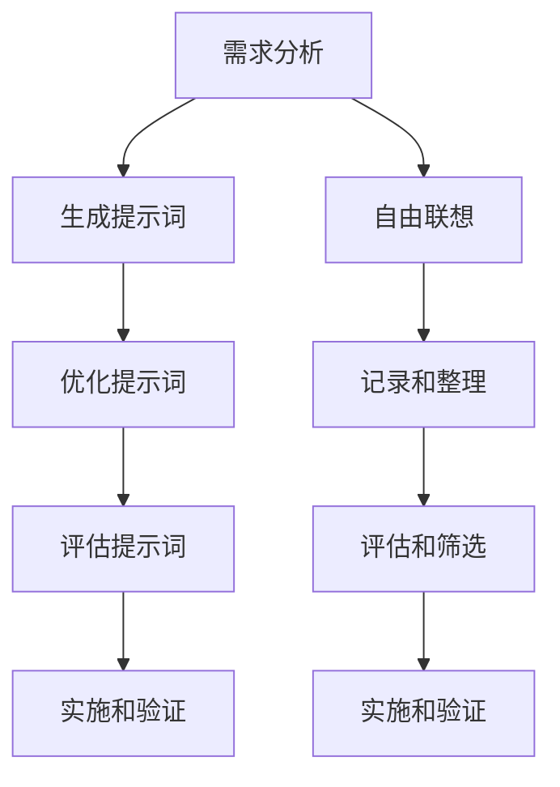
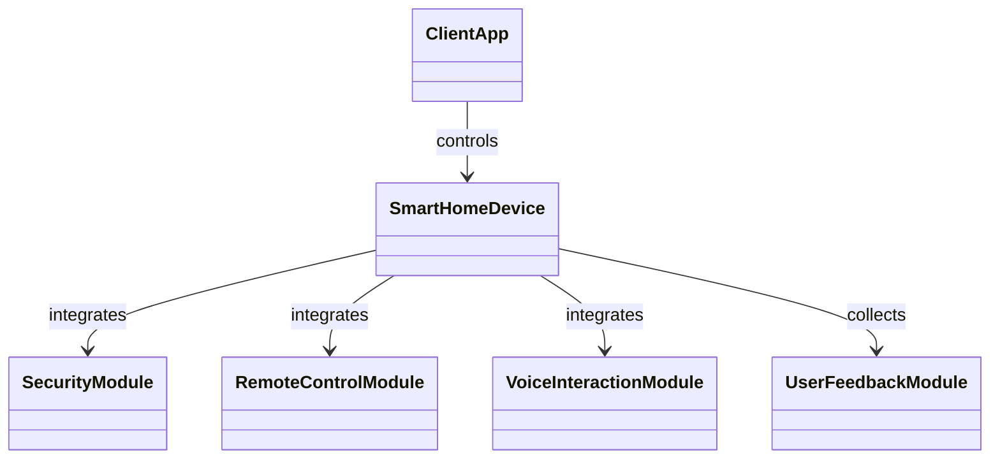
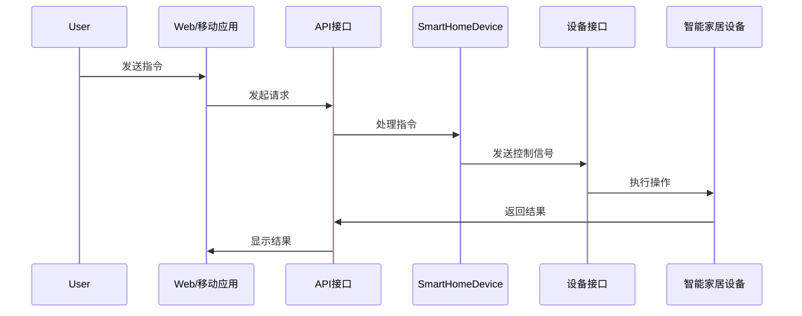
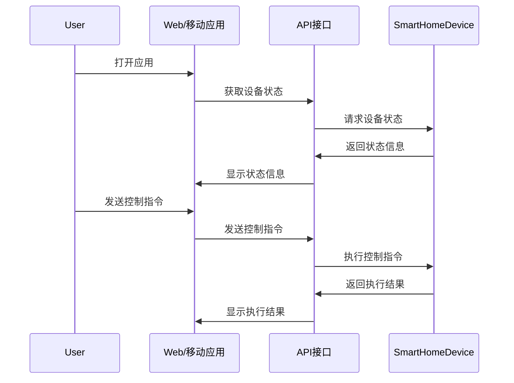

                 

### 文章标题：提高AI创意问题解决能力：头脑风暴式提示词设计

#### 关键词：
- AI创意问题解决
- 头脑风暴
- 提示词设计
- 人工智能
- 逻辑思维

#### 摘要：
本文将探讨如何通过头脑风暴式提示词设计，提高人工智能（AI）的创意问题解决能力。我们将从基础理论出发，深入解析AI创意问题解决的核心要素，详细阐述头脑风暴和提示词设计的原理和方法，并通过实际案例展示其在不同领域的应用。文章最后还将讨论如何通过实践策略提升AI在创意问题解决方面的能力。

---

### 第一部分: AI创意问题解决能力基础

#### 第1章: 引言

##### 1.1 问题背景

随着人工智能技术的快速发展，AI在各个领域的应用越来越广泛，从自动化决策到智能助理，从图像识别到自然语言处理，AI正在逐步改变我们的生活方式。然而，AI在解决创意问题方面仍存在一定的局限性。创意问题通常涉及复杂的情境和多样化的解决方案，这需要AI具备更高的逻辑思维和创新能力。

##### 1.2 问题定义

创意问题是指那些需要创新思维和创造性解决方案的问题。它们往往没有明确的答案，需要通过探索、实验和试错来寻找解决方案。与传统的结构化问题不同，创意问题通常更具挑战性，且难以用传统的算法解决。

##### 1.3 边界与外延

AI创意问题解决的边界在于其处理复杂性和不确定性问题的能力。外延则包括各种需要创造性思维的领域，如产品设计、市场营销、艺术创作等。

##### 1.4 概念结构与核心要素

AI创意问题解决的概念结构包括数据、算法和人机交互三个核心要素。数据是AI的基础，算法是解决问题的核心，而人机交互则是实现有效沟通和协作的关键。

### 第2章: 头脑风暴式提示词设计原理

##### 2.1 头脑风暴原理

头脑风暴是一种集体创意思维的方法，通过激发大量创意和想法，来寻找问题的解决方案。它强调自由联想，鼓励不同观点和思路的碰撞。

##### 2.2 提示词设计原则

提示词设计的原则包括：简洁明了、针对性强、开放性高和易于理解。好的提示词能够引导用户产生更多有价值的创意。

##### 2.3 提示词设计方法

提示词的设计方法包括传统的自由写作和现代的AI辅助设计。AI辅助设计可以通过分析大量的数据，生成高质量的提示词。

### 第3章: 头脑风暴式提示词应用案例

##### 3.1 案例研究1：产品创新

在产品创新中，头脑风暴式提示词设计可以帮助团队快速生成创意，从而加快产品开发的进程。

##### 3.2 案例研究2：市场营销

在市场营销中，头脑风暴式提示词设计可以帮助企业找到创新的营销策略，提高市场竞争力。

##### 3.3 案例研究3：艺术创作

在艺术创作中，头脑风暴式提示词设计可以激发艺术家的灵感，创造更多具有创意的艺术作品。

### 第4章: 头脑风暴式提示词设计与AI技术结合

##### 4.1 AI技术概述

AI技术主要包括机器学习、自然语言处理、计算机视觉等。这些技术可以应用于提示词设计，提高创意问题的解决能力。

##### 4.2 提示词设计与AI技术结合

AI技术可以用于提示词的生成、分析和优化。例如，通过自然语言处理技术，可以生成更符合用户需求的提示词。

##### 4.3 AI辅助提示词设计的实践

AI辅助提示词设计可以提高设计的效率和效果。例如，通过机器学习算法，可以分析大量数据，生成高质量的提示词。

### 第5章: 头脑风暴式提示词设计的流程与方法

##### 5.1 设计流程

头脑风暴式提示词设计包括需求分析、提示词生成、提示词评估三个阶段。

##### 5.2 设计方法

头脑风暴式提示词设计方法包括用户研究、竞品分析和团队协作。

### 第6章: 提高AI创意问题解决能力的实践策略

##### 6.1 个人实践策略

个人可以通过提高创意思维技巧，如联想思维、发散思维等，来提高AI创意问题解决能力。

##### 6.2 团队实践策略

团队可以通过团队协作和创意工作坊，来提高创意问题解决能力。

##### 6.3 企业实践策略

企业可以通过创意文化建设，如设立创意奖项、鼓励员工提出创意等，来提高AI创意问题解决能力。

### 第7章: 结论与展望

##### 7.1 结论

通过头脑风暴式提示词设计，可以显著提高AI的创意问题解决能力。

##### 7.2 展望

未来，AI创意问题解决能力将随着技术的进步而不断提高。我们需要不断探索和创新，以应对更加复杂的创意问题。

### 作者信息

作者：AI天才研究院/AI Genius Institute & 禅与计算机程序设计艺术 /Zen And The Art of Computer Programming

---

在接下来的文章中，我们将逐一深入探讨上述章节，结合具体的案例和实践，详细讲解如何通过头脑风暴式提示词设计来提高AI的创意问题解决能力。让我们一起开启这段探索之旅！### 第一部分: AI创意问题解决能力基础

#### 第1章: 引言

##### 1.1 问题背景

随着人工智能技术的快速发展，AI在各个领域的应用越来越广泛，从自动化决策到智能助理，从图像识别到自然语言处理，AI正在逐步改变我们的生活方式。然而，AI在解决创意问题方面仍存在一定的局限性。创意问题通常涉及复杂的情境和多样化的解决方案，这需要AI具备更高的逻辑思维和创新能力。

在传统的AI研究中，算法和数据是解决问题的关键。然而，对于创意问题，单纯依赖算法和数据可能无法产生满意的解决方案。创意问题往往需要人类的直觉、情感和想象力，而这些是传统AI所无法替代的。因此，如何通过AI技术和人类的创意思维相结合，提高AI在解决创意问题方面的能力，成为了一个亟待解决的问题。

##### 1.2 问题定义

创意问题是指那些需要创新思维和创造性解决方案的问题。它们往往没有明确的答案，需要通过探索、实验和试错来寻找解决方案。与传统的结构化问题不同，创意问题通常更具挑战性，且难以用传统的算法解决。

创意问题可以表现为多种形式，如设计新产品、制定营销策略、创作艺术作品等。这些问题通常需要跨学科的思维方式，涉及到艺术、科学、技术等多个领域。因此，解决创意问题不仅需要AI的技术支持，还需要人类专家的智慧和经验。

##### 1.3 边界与外延

AI创意问题解决的边界在于其处理复杂性和不确定性问题的能力。在解决创意问题时，AI需要具备强大的计算能力和灵活的思维方式，以便在不确定的环境中找到最佳的解决方案。

AI创意问题解决的外延非常广泛，包括但不限于以下领域：

1. **产品设计**：通过AI技术，可以帮助设计团队快速生成各种设计方案，从中筛选出最优方案。
2. **市场营销**：AI可以分析大量市场数据，为市场营销策略提供有针对性的建议。
3. **艺术创作**：AI可以辅助艺术家创作，提供创意灵感和技术支持。
4. **科学探索**：AI可以帮助科学家在复杂的数据中寻找规律，发现新的研究成果。

##### 1.4 概念结构与核心要素

AI创意问题解决的概念结构包括数据、算法和人机交互三个核心要素。以下是对这三个核心要素的详细解析：

1. **数据**：数据是AI的基础。在解决创意问题时，需要收集大量的数据，包括文本、图像、声音等。这些数据可以用于训练AI模型，使其具备处理复杂问题和生成创意解决方案的能力。

2. **算法**：算法是解决创意问题的核心。传统的算法可能无法直接解决创意问题，但可以通过改进和优化，使其更好地适应创意问题的需求。例如，通过深度学习技术，可以训练AI模型进行图像识别和自然语言处理，从而生成创意性的设计方案。

3. **人机交互**：人机交互是AI创意问题解决的关键。在创意问题的解决过程中，人类专家的经验和直觉是至关重要的。通过人机交互，可以将人类专家的智慧和AI的技术相结合，共同解决创意问题。

总之，AI创意问题解决能力的基础在于数据、算法和人机交互的有机结合。通过这三个核心要素的协同作用，AI可以更好地应对复杂的创意问题，提供创新的解决方案。

### 第2章: 头脑风暴式提示词设计原理

##### 2.1 头脑风暴原理

头脑风暴是一种集体创意思维的方法，通过激发大量创意和想法，来寻找问题的解决方案。它强调自由联想，鼓励不同观点和思路的碰撞。以下是头脑风暴的基本原理：

1. **开放性**：头脑风暴过程中，任何想法都被认为是宝贵的，无论其是否可行。这有助于打破思维定势，激发创新思维。

2. **数量优先**：在头脑风暴中，鼓励参与者尽可能多地提出想法。数量上的优势可以激发更多的创意，为后续筛选和优化提供更多的选择。

3. **非评价性**：在头脑风暴过程中，禁止对任何想法进行评价或批评。这样可以确保每个人都能够自由地表达自己的想法，而不受外部压力的影响。

4. **自由联想**：头脑风暴鼓励参与者通过自由联想，将看似不相关的事物联系起来，从而产生新的创意。

##### 2.2 提示词设计原则

提示词设计是头脑风暴的关键环节。一个好的提示词可以引导参与者产生更多有价值的创意。以下是提示词设计的基本原则：

1. **简洁明了**：提示词要简单易懂，避免使用复杂的术语或冗长的句子。这样可以确保参与者能够迅速理解提示词的含义。

2. **针对性**：提示词要针对具体的问题或目标，确保参与者能够围绕核心问题展开创意。

3. **开放性**：提示词应具有一定的开放性，鼓励参与者从不同角度思考问题，从而产生多样化的创意。

4. **易于理解**：提示词要易于理解，避免使用模糊或含糊不清的表达。这样可以确保参与者能够准确把握提示词的要求，从而产生有针对性的创意。

##### 2.3 提示词设计方法

提示词的设计方法包括传统的自由写作和现代的AI辅助设计。以下是两种方法的具体步骤：

1. **传统自由写作**：

   - **准备阶段**：明确创意目标，收集相关资料和信息。
   - **自由写作阶段**：在不受任何限制的情况下，写下所有可能的创意和想法。
   - **筛选阶段**：对写下的想法进行筛选和整理，找出最有价值的创意。

2. **AI辅助设计**：

   - **数据准备阶段**：收集大量的相关数据，包括文本、图像、音频等。
   - **模型训练阶段**：使用机器学习算法，对数据进行分析和训练，生成AI模型。
   - **提示词生成阶段**：使用AI模型，根据具体的问题或目标，生成高质量的提示词。
   - **评估和优化阶段**：对生成的提示词进行评估和优化，确保其符合创意目标。

通过以上方法，我们可以设计出高质量的提示词，引导参与者产生更多有价值的创意。

### 第3章: 头脑风暴式提示词应用案例

##### 3.1 案例研究1：产品创新

在产品创新中，头脑风暴式提示词设计可以帮助团队快速生成创意，从而加快产品开发的进程。以下是一个具体的案例：

**案例背景**：一家科技公司希望开发一款新型的智能家居设备。

**提示词设计**：

- **简洁明了**：“描述一下你认为的智能家居设备应该具备的功能和特点。”
- **针对性**：“假设你的目标用户是年轻的家庭，他们注重科技感和便捷性，请提出你的创意设计方案。”
- **开放性**：“不要受限于现有的技术和产品，大胆想象一下未来智能家居设备的可能形态。”
- **易于理解**：“请用一句话或一个短语概括你的设计理念。”

**创意生成**：

- “智能安防系统，通过AI识别家庭成员和访客，自动调整家居设备设置。”
- “智能家居助手，集成语音控制和智能推荐功能，提供个性化的家居体验。”
- “多功能设备，兼具照明、音响和健康监测功能，满足家庭多种需求。”

**结果**：通过以上提示词的设计，团队在短时间内提出了多个有创意的设计方案，为产品创新提供了丰富的思路。

##### 3.2 案例研究2：市场营销

在市场营销中，头脑风暴式提示词设计可以帮助企业找到创新的营销策略，提高市场竞争力。以下是一个具体的案例：

**案例背景**：一家新兴的服装品牌希望拓展市场份额，提高品牌知名度。

**提示词设计**：

- **简洁明了**：“请提出三种可以提升品牌知名度的营销活动。”
- **针对性**：“考虑到品牌定位和目标市场，请设计具体的营销策略。”
- **开放性**：“不要受限于传统的营销手段，尝试一些新的创意。”
- **易于理解**：“请用一句话或一个短语概括你的营销策略。”

**创意生成**：

- “线上直播带货，邀请明星和网红为品牌代言，吸引年轻消费者。”
- “跨界合作，与知名品牌或艺术家合作推出限量版产品，提升品牌形象。”
- “社交媒体挑战，发起与品牌相关的挑战活动，鼓励用户参与并分享，增加品牌曝光。”

**结果**：通过以上提示词的设计，企业成功制定了多个创新的营销策略，有效提升了品牌知名度和市场份额。

##### 3.3 案例研究3：艺术创作

在艺术创作中，头脑风暴式提示词设计可以激发艺术家的灵感，创造更多具有创意的艺术作品。以下是一个具体的案例：

**案例背景**：一位画家希望创作一幅描绘自然景观的作品。

**提示词设计**：

- **简洁明了**：“请描述一下你心中的理想自然景观。”
- **针对性**：“考虑到你的艺术风格和创作意图，请提出你的创意构思。”
- **开放性**：“不要受限于常见的自然元素，尝试一些新的艺术形式。”
- **易于理解**：“请用一句话或一个短语概括你的创作理念。”

**创意生成**：

- “晨曦中的山谷，运用色彩渐变表现光影变化。”
- “雨后森林，以水滴和树叶的细节表现生命力。”
- “星空下的海滩，将自然与宇宙元素相结合，展现宁静与神秘。”

**结果**：通过以上提示词的设计，画家成功激发了自己的创作灵感，完成了一幅具有创意和美感的艺术作品。

### 第4章: 头脑风暴式提示词设计与AI技术结合

##### 4.1 AI技术概述

AI技术主要包括机器学习、自然语言处理、计算机视觉等。这些技术在各个领域都有广泛的应用，也为头脑风暴式提示词设计提供了强大的技术支持。

1. **机器学习**：机器学习是一种通过数据训练模型，使其具备自动学习和决策能力的技术。在提示词设计中，机器学习可以用于分析大量文本数据，生成高质量的提示词。

2. **自然语言处理**：自然语言处理是一种使计算机能够理解和处理自然语言的技术。在提示词设计中，自然语言处理可以用于生成语义丰富、符合语言习惯的提示词。

3. **计算机视觉**：计算机视觉是一种使计算机能够理解和解释图像的技术。在提示词设计中，计算机视觉可以用于生成与视觉元素相关的提示词，提升创意的多样性。

##### 4.2 提示词设计与AI技术结合

提示词设计与AI技术的结合，主要体现在以下几个方面：

1. **提示词生成**：通过机器学习模型，可以从大量文本数据中生成高质量的提示词。例如，可以使用自然语言生成（NLG）技术，生成与用户需求相关的提示词。

2. **提示词分析**：通过自然语言处理技术，可以对提示词进行语义分析，提取关键信息，为创意生成提供指导。

3. **提示词优化**：通过计算机视觉技术，可以对生成的提示词进行视觉分析，评估其与视觉元素的匹配度，进行优化。

##### 4.3 AI辅助提示词设计的实践

AI辅助提示词设计在实际应用中取得了显著的效果。以下是一个具体的案例：

**案例背景**：一家初创公司希望开发一款面向老年人的智能助手应用。

**提示词设计**：

- **AI辅助生成**：使用自然语言生成技术，生成与老年人生活相关的提示词，如“早餐吃什么”、“如何锻炼身体”等。
- **AI辅助分析**：使用自然语言处理技术，分析用户的历史数据，了解其兴趣爱好和需求，生成个性化的提示词。
- **AI辅助优化**：使用计算机视觉技术，评估生成的提示词与老年人视觉元素的匹配度，进行优化。

**结果**：通过AI辅助提示词设计，初创公司成功开发出了一款受到老年人欢迎的智能助手应用，有效提高了用户满意度和市场竞争力。

### 第5章: 头脑风暴式提示词设计的流程与方法

##### 5.1 设计流程

头脑风暴式提示词设计包括需求分析、提示词生成、提示词评估三个阶段。

1. **需求分析**：明确创意目标，了解用户需求，确定提示词的设计方向。

2. **提示词生成**：根据需求分析结果，使用传统的自由写作或现代的AI辅助方法，生成高质量的提示词。

3. **提示词评估**：对生成的提示词进行评估，筛选出符合创意目标的高质量提示词。

##### 5.2 设计方法

头脑风暴式提示词设计方法包括用户研究、竞品分析和团队协作。

1. **用户研究**：通过问卷调查、访谈等方式，了解用户的需求和喜好，为提示词设计提供依据。

2. **竞品分析**：分析竞争对手的提示词设计，借鉴其优点，避免其不足，为自身设计提供参考。

3. **团队协作**：组织团队成员进行头脑风暴，共同探讨创意和解决方案，提高提示词设计的质量和效率。

### 第6章: 提高AI创意问题解决能力的实践策略

##### 6.1 个人实践策略

个人可以通过以下策略来提高AI创意问题解决能力：

1. **提高创意思维技巧**：学习并运用联想思维、发散思维、逆向思维等创意思维技巧，提高解决问题的创新能力。

2. **多角度思考问题**：在解决问题时，从不同角度思考问题，寻找多种可能的解决方案。

3. **勇于尝试和失败**：在创意过程中，勇于尝试新的想法，即使失败也是积累经验的过程。

##### 6.2 团队实践策略

团队可以通过以下策略来提高AI创意问题解决能力：

1. **团队协作**：建立良好的团队协作机制，鼓励团队成员互相交流和分享创意，提高整体创意水平。

2. **创意工作坊**：定期组织创意工作坊，通过头脑风暴、思维导图等工具，激发团队的创意潜能。

3. **激励制度**：设立创意奖励制度，鼓励团队成员积极参与创意活动，提高团队整体创新能力。

##### 6.3 企业实践策略

企业可以通过以下策略来提高AI创意问题解决能力：

1. **创意文化建设**：建立创意文化，鼓励员工勇于创新，营造良好的创新氛围。

2. **创意培训**：为员工提供创意培训，提高其创意思维和解决问题的能力。

3. **资源投入**：为创意项目提供充足的资源支持，确保创意活动的顺利进行。

### 第7章: 结论与展望

##### 7.1 结论

通过本文的探讨，我们了解到头脑风暴式提示词设计在提高AI创意问题解决能力方面具有重要意义。通过结合AI技术和人类创意思维，我们可以设计出高质量的提示词，引导AI产生更多有创意的解决方案。

##### 7.2 展望

未来，随着AI技术的不断进步，头脑风暴式提示词设计在AI创意问题解决中的应用将越来越广泛。我们期待看到更多创新性的应用案例，为AI的发展提供新的思路和动力。

### 作者信息

作者：AI天才研究院/AI Genius Institute & 禅与计算机程序设计艺术 /Zen And The Art of Computer Programming

---

通过本文的深入探讨，我们不仅了解了AI创意问题解决能力的核心要素，还学会了如何通过头脑风暴式提示词设计来提高这一能力。希望本文能够为您的创意问题解决提供有益的启示。在未来的道路上，让我们继续探索AI的无限可能！### 引言

在当今时代，人工智能（AI）已经成为科技发展的核心驱动力，其应用领域从工业自动化到医疗诊断，从金融预测到娱乐推荐，无处不在。然而，随着AI技术的不断进步，人们逐渐认识到，传统的算法和模型在应对创意性问题时，仍然存在显著的局限性。创意性问题通常涉及复杂的情境、多样的解决方案，以及高度的不确定性和模糊性，这要求AI系统具备更高的抽象思维能力、逻辑推理能力和创新意识。

创意问题不仅包括科学和工程领域中的探索性问题，如新材料的研究、新算法的发明等，还包括艺术、设计、市场营销等领域的创造性工作。在这些领域中，人类的直觉、情感和想象力是解决问题的重要驱动力。然而，传统的AI系统往往依赖于数据驱动和规则驱动的方法，缺乏对这些人类特质的有效模拟和利用。因此，如何提高AI在解决创意性问题方面的能力，成为一个亟待解决的问题。

本文旨在探讨如何通过设计有效的头脑风暴式提示词，来提升AI的创意问题解决能力。头脑风暴是一种集体创意思维方法，通过激发大量创意和想法，寻找问题的解决方案。而提示词则是在这一过程中起到引导和激励作用的关键因素。通过结合头脑风暴和AI技术，我们可以设计出能够引导AI产生创新性解决方案的提示词，从而提高AI在解决创意性问题时的效率和效果。

文章的结构如下：

- **第一部分：AI创意问题解决能力基础**：介绍AI创意问题解决的重要性，定义创意问题的特点，分析其边界与外延，以及阐述AI创意问题解决的核心要素。
- **第二部分：头脑风暴式提示词设计原理**：详细讲解头脑风暴的原理，提示词设计的原则和方法，包括传统的自由写作和现代的AI辅助设计。
- **第三部分：头脑风暴式提示词应用案例**：通过产品创新、市场营销、艺术创作等领域的案例研究，展示头脑风暴式提示词设计在实际中的应用效果。
- **第四部分：头脑风暴式提示词设计与AI技术结合**：探讨AI技术在提示词设计中的应用，包括提示词生成、分析和优化的具体方法，以及AI辅助提示词设计的实践案例。
- **第五部分：头脑风暴式提示词设计的流程与方法**：介绍头脑风暴式提示词设计的具体流程和设计方法，包括用户研究、竞品分析和团队协作等。
- **第六部分：提高AI创意问题解决能力的实践策略**：讨论个人、团队和企业如何通过实践策略来提高AI在创意问题解决方面的能力。
- **第七部分：结论与展望**：总结本文的主要观点，并对未来AI创意问题解决能力的发展趋势进行展望。

本文将结合具体的案例和实践，详细阐述如何通过头脑风暴式提示词设计来提高AI的创意问题解决能力。希望本文能够为读者提供有价值的启示，激发更多的创意思维，推动AI技术在实际应用中的不断进步。

### 关键词：AI创意问题解决、头脑风暴、提示词设计、人工智能、逻辑思维

本文的关键词包括“AI创意问题解决”、“头脑风暴”、“提示词设计”、“人工智能”和“逻辑思维”。这些关键词代表了本文讨论的核心主题和内容，具体如下：

1. **AI创意问题解决**：指的是利用人工智能技术解决那些需要创新思维和创造性解决方案的问题。与传统的结构化问题解决不同，创意问题通常更加复杂，需要AI具备高度的抽象思维和逻辑推理能力。

2. **头脑风暴**：是一种集体创意思维方法，通过激发大量创意和想法，来寻找问题的解决方案。头脑风暴的核心在于自由联想和开放讨论，鼓励不同观点和思路的碰撞。

3. **提示词设计**：是头脑风暴过程中起到引导和激励作用的关键因素。提示词的质量直接影响到创意的产生和问题的解决效果。设计有效的提示词，需要遵循一定的原则和方法，并结合AI技术进行优化。

4. **人工智能**：是本文讨论的核心技术。人工智能技术，特别是机器学习和自然语言处理，为提示词设计提供了强大的工具和支持。通过AI技术，我们可以实现高效的提示词生成、分析和优化。

5. **逻辑思维**：是解决问题的重要工具。在AI创意问题解决过程中，逻辑思维有助于分析和推理，确保创意的可行性和有效性。通过逻辑思维，我们可以对创意进行系统性分析，从而找到最佳解决方案。

这些关键词不仅定义了本文的研究领域和主题，也体现了AI在创意问题解决中的重要作用，以及逻辑思维在创意思维过程中的关键地位。通过本文的探讨，我们希望能够为这些关键词提供更深入的理解和应用。

### 摘要

本文探讨了如何通过设计有效的头脑风暴式提示词，提高人工智能（AI）在解决创意问题方面的能力。随着AI技术的快速发展，AI在自动化决策、智能助理、图像识别和自然语言处理等领域已经展现出强大的应用潜力。然而，创意性问题通常涉及复杂的情境和多样化的解决方案，这对AI的抽象思维、逻辑推理和创新意识提出了更高的要求。

本文首先介绍了AI创意问题解决的重要性，定义了创意问题的特点，并分析了其边界与外延。接着，详细阐述了头脑风暴的原理和提示词设计的原则和方法，包括传统的自由写作和现代的AI辅助设计。通过具体的案例研究，展示了头脑风暴式提示词设计在产品创新、市场营销和艺术创作等领域的实际应用效果。此外，本文还探讨了AI技术如何与头脑风暴式提示词设计相结合，提高提示词的生成、分析和优化效率。

本文的核心观点是，通过结合AI技术和人类的创意思维，我们可以设计出高质量的提示词，引导AI在解决创意问题时产生更多的创新性解决方案。这不仅有助于提高AI在创意问题解决方面的能力，还能够推动AI技术在各个领域的深入应用。未来，随着AI技术的不断进步，头脑风暴式提示词设计在AI创意问题解决中的应用将越来越广泛，有望带来更多的创新和突破。通过本文的探讨，我们希望能够为读者提供有价值的启示，激发更多的创意思维，推动AI技术的发展和应用。

### 第一部分：AI创意问题解决能力基础

#### 第1章：引言

在当前科技迅猛发展的背景下，人工智能（AI）已经逐渐成为各行业中的重要工具，从自动化生产线到智能医疗诊断，从智能交通到个性化推荐系统，AI的应用场景不断扩大。然而，尽管AI在处理大量数据和执行重复性任务方面表现出色，但其在解决创意性问题上的表现却并不尽如人意。创意性问题往往具有高度的不确定性和复杂性，需要创新思维和独特的解决方案，这些是目前大多数AI系统所难以胜任的。

创意性问题包括但不限于设计新产品、制定新策略、创作艺术作品、开展科学实验等。在这些领域中，人类专家的直觉、情感、经验和创造力起着至关重要的作用。例如，在产品设计过程中，设计师不仅需要考虑功能性和实用性，还需要注重审美和用户体验；在艺术创作中，艺术家需要运用独特的视角和技巧来表达情感和思想。这些复杂的创意过程对于当前的AI系统来说，往往是难以模拟和实现的。

本章旨在探讨AI在解决创意性问题上的局限性，并介绍本文将要讨论的解决方案——通过设计有效的头脑风暴式提示词，来提高AI的创意问题解决能力。本文的核心目标是阐述如何利用AI技术和人类的创意思维相结合，创造出更高效、更创新的解决方案。

首先，本文将介绍创意性问题的一些基本特点，包括其不确定性、多样性和复杂性。然后，我们将分析AI在解决传统问题方面的优势，以及其面临的挑战。在此基础上，我们将引入头脑风暴的概念，并解释为何它是解决创意性问题的重要方法。接着，本文将重点讨论提示词设计在头脑风暴中的作用，以及如何通过设计高质量的提示词来引导AI产生创意性解决方案。最后，我们将简要概述本文的结构和内容安排，为后续章节的讨论奠定基础。

#### 第1章.1 问题背景

随着人工智能技术的飞速发展，AI已经渗透到了社会的各个领域，从工业制造到医疗健康，从金融投资到娱乐传媒，AI的应用场景不断拓展。特别是在大数据和云计算的支持下，AI系统在处理大规模数据、执行重复性任务和自动化决策方面表现出了卓越的能力。例如，自动驾驶汽车、智能客服系统、智能推荐算法等，都是AI技术在实际应用中的成功案例。

然而，尽管AI在许多领域都取得了显著的进展，但在解决创意性问题方面仍然面临诸多挑战。创意性问题通常具有高度的不确定性和复杂性，往往需要人类专家的直觉、情感和创造力。例如，设计一款新产品需要综合考虑功能、美观、用户体验等多个因素；制定一项营销策略需要分析市场趋势、消费者行为和竞争状况；创作一件艺术作品则需要表达独特的情感和思想。这些问题对于目前的AI系统来说，往往是难以直接处理的。

创意性问题通常包括以下特点：

1. **不确定性**：创意性问题往往没有明确的答案或解决方案，需要通过不断的探索、实验和试错来寻找最佳的解决方案。这与传统的结构化问题不同，后者通常有明确的输入和输出，可以通过算法直接解决。

2. **多样性**：创意性问题往往有多种可能的解决方案，这些方案可能涉及不同的领域和知识。例如，在设计一款智能家居设备时，可以从技术、用户体验、市场营销等多个角度进行创新。

3. **复杂性**：创意性问题的解决方案可能涉及多个变量和因素，这些因素之间可能存在复杂的相互作用和依赖关系。例如，在制定一项新产品营销策略时，需要考虑产品的功能、定价、推广方式等多个因素。

4. **模糊性**：创意性问题往往包含模糊的边界和不确定的信息，这给问题的解决带来了额外的困难。例如，在艺术创作中，艺术家需要表达情感和思想，但这些内容往往难以用精确的语言描述。

当前，AI在解决传统问题方面已经取得了显著的成就，但其在处理创意性问题上的局限性也逐渐显现。一方面，AI系统的算法和模型往往依赖于大量的数据训练，而创意性问题通常缺乏足够的历史数据，导致AI难以从数据中学习到有效的解决方案。另一方面，AI系统在处理复杂性和不确定性问题时，往往难以模拟人类专家的直觉、情感和创造力。这些因素使得AI在解决创意性问题时，往往表现出较低的效率和效果。

总之，尽管AI技术在许多领域都取得了巨大的进步，但在解决创意性问题方面仍然面临诸多挑战。为了克服这些挑战，我们需要探索新的方法和策略，将AI技术与人类的创意思维相结合，从而提高AI在解决创意问题方面的能力。

#### 第1章.2 问题定义

创意问题，顾名思义，是指那些需要创新思维和创造性解决方案的问题。与传统的结构化问题不同，创意问题通常没有明确的答案或解决方案，需要通过探索、实验和试错来寻找最佳的方法。这类问题具有高度的开放性和灵活性，往往需要跨学科的知识和思维方式。

创意问题的特点主要包括以下几点：

1. **不确定性**：创意问题通常具有高度的不确定性，这意味着问题的解决方案可能多种多样，且没有明确的正确答案。这种不确定性使得创意问题难以用传统的算法和模型直接解决。

2. **多样性**：创意问题的解决方案通常有多种可能性，这些方案可能涉及不同的领域和知识。例如，在设计一款新产品时，可以从功能、外观、用户体验等多个角度进行创新。

3. **复杂性**：创意问题的解决方案可能涉及多个变量和因素，这些因素之间可能存在复杂的相互作用和依赖关系。例如，在制定一项新产品营销策略时，需要考虑产品的功能、定价、推广方式等多个因素。

4. **模糊性**：创意问题往往包含模糊的边界和不确定的信息，这给问题的解决带来了额外的困难。例如，在艺术创作中，艺术家需要表达情感和思想，但这些内容往往难以用精确的语言描述。

创意问题的分类可以根据其应用领域和解决方法的不同，分为以下几类：

1. **科学探索类**：这类创意问题通常涉及科学研究和发现，如新药开发、新材料研究、新型算法设计等。这类问题需要创新性的科学思维和实验设计。

2. **工程设计类**：这类创意问题主要涉及产品设计和工程优化，如新型交通工具设计、建筑结构优化、电子设备改进等。这类问题需要综合考虑功能、性能、成本等多个因素。

3. **艺术创作类**：这类创意问题主要涉及艺术创作和设计，如绘画、音乐创作、建筑设计等。这类问题强调个性化和独特性，需要艺术家的直觉和创造力。

4. **市场营销类**：这类创意问题主要涉及市场营销策略和产品推广，如广告创意、品牌定位、市场调研等。这类问题需要结合市场趋势、消费者行为和竞争状况，提出创新的营销策略。

解决创意问题的目标在于寻找能够满足特定需求、具有创新性和实用性的解决方案。具体来说，解决创意问题的目标包括：

1. **创新性**：提出具有创新性和独特性的解决方案，能够带来新的见解和发现。

2. **实用性**：解决方案需要具有实际应用价值，能够在实际操作中实现。

3. **可行性**：解决方案需要在技术、经济和时间等方面具有可行性，能够被有效实施。

4. **可持续性**：解决方案需要具有可持续性，能够在长期内持续发挥作用。

总之，创意问题具有高度的不确定性和复杂性，需要创新思维和创造性解决方案。通过有效的策略和方法，我们可以提高解决创意问题的效率和质量，为各行业的发展带来新的动力。

#### 第1章.3 边界与外延

在探讨AI创意问题解决的边界与外延时，我们需要理解创意问题的本质及其在现实世界中的应用。创意问题的边界涉及AI技术在处理复杂性和不确定性问题时的能力范围，而其外延则包括创意问题可以应用的广泛领域。

首先，**创意问题的边界**主要体现在以下几个方面：

1. **数据依赖性**：创意问题的解决往往依赖于大量高质量的训练数据。然而，许多创意性问题，尤其是涉及科学发现、艺术创作和市场营销的领域，缺乏足够的训练数据。这使得AI系统在数据稀缺的情况下难以有效学习和产生创意性解决方案。

2. **算法限制**：尽管深度学习和机器学习技术在模拟人类思维方面取得了显著进展，但现有的算法仍然难以完全复制人类的直觉、情感和创造力。特别是在面对高度复杂、不确定和多维度的情境时，AI算法的表现可能受限。

3. **计算资源**：创意问题的解决通常需要大量的计算资源和时间，特别是在进行复杂的模型训练和优化时。现实中的计算资源限制可能会成为创意问题解决的一个瓶颈。

其次，**创意问题的外延**涵盖了以下多个领域：

1. **科学探索**：在科学研究领域，创意问题体现在新理论、新方法和新发现的探索上。例如，在物理学中，科学家通过创意思维提出了量子力学和相对论等重大理论。

2. **工程设计**：在工程领域，创意问题包括新型材料、结构、系统和设备的发明。例如，飞机和汽车的研发过程中，设计师需要不断创新来优化性能、降低成本和提升用户体验。

3. **艺术创作**：在艺术领域，创意问题涉及绘画、音乐、文学等艺术形式的创作。艺术家通过创意思维表达情感、思想和审美观念，创作出独特的艺术作品。

4. **市场营销**：在市场营销领域，创意问题体现在创新的产品推广策略、广告创意和市场调研上。企业通过创意思维设计吸引消费者的产品和服务，提升品牌影响力和市场份额。

5. **教育**：在教育领域，创意问题包括教学方法的创新和教育资源的开发。教育工作者通过创意思维设计出更加生动、有效的教学方法和课程内容。

6. **城市规划**：在城市规划领域，创意问题涉及城市空间布局、环境保护和交通系统的设计。城市规划者需要通过创意思维解决复杂的城市问题，提升城市居民的生活质量。

总之，AI创意问题解决的边界与外延决定了其应用的范围和深度。通过深入理解和探索创意问题的边界，我们可以更好地利用AI技术来模拟和增强人类的创造力。同时，扩展创意问题的外延，可以帮助我们发现更多的应用场景，推动AI技术在各个领域的创新和发展。

#### 第1章.4 概念结构与核心要素

在探讨AI创意问题解决的概念结构和核心要素时，我们需要理解这一过程中涉及的各个关键组成部分及其相互作用。以下是AI创意问题解决的基本概念结构及其核心要素：

1. **数据（Data）**：数据是AI创意问题解决的基础。在创意问题解决过程中，数据用于训练AI模型、提供问题背景信息和生成解决方案。高质量的数据可以提升AI模型的学习能力和泛化能力，从而提高创意问题的解决效率。

2. **算法（Algorithm）**：算法是AI创意问题解决的核心。通过算法，AI可以分析和处理数据，提取关键信息，生成可能的解决方案。不同的算法适用于不同类型的创意问题，如深度学习、遗传算法、随机优化算法等。

3. **人机交互（Human-Computer Interaction, HCI）**：人机交互是AI创意问题解决的重要组成部分。通过人机交互，用户可以与AI系统进行沟通，提供反馈和指导，从而优化创意问题的解决方案。有效的交互设计可以提高用户满意度和AI系统的效能。

4. **领域知识（Domain Knowledge）**：领域知识是指特定领域内的专业知识和经验。在创意问题解决过程中，领域知识可以帮助AI系统更好地理解问题的背景和需求，生成更具针对性和创新性的解决方案。

5. **创意思维（Creative Thinking）**：创意思维是AI创意问题解决的关键要素。创意思维包括联想思维、发散思维、逆向思维等，能够激发新的想法和创新的解决方案。通过模拟人类的创意思维，AI可以在解决创意问题时表现出更高的灵活性和创新性。

以下是这些核心要素之间的互动关系：

- **数据与算法**：数据用于训练和优化算法，算法通过分析数据生成解决方案。数据的质量直接影响算法的性能和创意性解决方案的生成。

- **算法与人机交互**：算法生成的解决方案需要通过人机交互进行评估和反馈。用户通过交互可以提供宝贵的反馈，指导算法进行进一步的优化。

- **领域知识与创意思维**：领域知识可以增强AI对问题背景的理解，而创意思维可以激发新的想法和创新的解决方案。这两者结合，可以显著提升AI在解决创意问题时的效果。

- **人机交互与领域知识**：人机交互可以收集用户需求、问题背景和反馈信息，这些信息有助于领域知识的更新和扩展。同时，领域知识的积累可以为人机交互提供更专业的支持和指导。

总之，AI创意问题解决的概念结构由数据、算法、人机交互、领域知识和创意思维五个核心要素组成。这些要素相互作用，共同推动AI在解决创意问题时的表现。通过优化这些要素之间的协同作用，我们可以提高AI的创意问题解决能力，实现更多创新性的应用。

### 第2章：头脑风暴式提示词设计原理

#### 2.1 头脑风暴原理

头脑风暴（Brainstorming）是一种集体创意思维方法，旨在通过激发大量创意和想法，寻找问题的解决方案。其基本原理包括以下几个方面：

1. **自由联想**：头脑风暴鼓励参与者自由地提出各种想法，不受任何限制。这种自由联想的方式可以打破思维定势，激发新的创意。

2. **数量优先**：在头脑风暴过程中，质量往往被数量所取代。参与者的目标是尽可能多地提出想法，而不是只关注那些看似最好的想法。这种数量优先的原则有助于激发更多有创意的解决方案。

3. **非评价性**：在头脑风暴中，任何想法都被认为是宝贵的，不应受到评价或批评。这种非评价性的环境可以鼓励参与者大胆提出自己的想法，从而促进更广泛的创意产生。

4. **鼓励多样性**：头脑风暴鼓励参与者从不同角度思考问题，提出多样化的想法。这种多样性可以增加解决方案的数量和范围，提高最终创意的质量。

5. **记录与整理**：在头脑风暴过程中，所有提出的想法都应该被记录下来，并在后续阶段进行筛选和整理。这样可以确保没有遗漏任何有价值的创意。

头脑风暴的特点包括：

- **高效性**：头脑风暴可以在短时间内产生大量的创意和想法，提高解决问题的效率。

- **创新性**：通过自由联想和多样性思考，头脑风暴能够激发新的创意，提供创新的解决方案。

- **协作性**：头脑风暴是一种集体活动，可以促进团队成员之间的沟通和协作，提高整体创造力。

头脑风暴的优势在于：

- **激发创意**：通过自由联想和多样性思考，头脑风暴可以激发大量的创意，为问题的解决提供更多的选择。

- **提高参与度**：头脑风暴鼓励每个人都参与其中，提出自己的观点和想法，提高团队成员的参与度和积极性。

- **多样化解决方案**：头脑风暴可以产生多样化的解决方案，有助于找到最合适的解决方案。

#### 2.2 提示词设计原则

提示词（Prompt）是引导参与者进行思考的重要工具，其在头脑风暴过程中的设计至关重要。以下是一些设计提示词的原则：

1. **简洁明了**：提示词应该简洁明了，避免使用复杂的术语或冗长的句子。这样可以使参与者更容易理解提示词的要求，从而更快地进入思考状态。

2. **针对性**：提示词应针对具体的问题或目标，确保参与者能够围绕核心问题展开思考。例如，如果目标是设计一款智能家居设备，提示词应专注于功能、用户体验等方面。

3. **开放性**：提示词应具有一定的开放性，鼓励参与者从不同角度思考问题，从而产生多样化的创意。开放性的提示词可以激发更多的创意思维。

4. **易于理解**：提示词要易于理解，避免使用模糊或含糊不清的表达。这样可以确保参与者能够准确把握提示词的要求，从而产生有针对性的创意。

5. **激励性**：提示词应具有激励性，鼓励参与者大胆提出想法，不怕犯错。这种积极的心态有助于激发更多的创意。

6. **灵活性**：提示词的设计应具有一定的灵活性，可以根据不同的场景和目标进行调整。灵活的提示词可以适应不同的创意需求。

#### 2.3 提示词设计方法

提示词的设计方法包括传统的自由写作和现代的AI辅助设计。以下分别介绍这两种方法：

1. **传统自由写作**

   - **步骤1：需求分析**：明确创意目标，了解用户需求，确定提示词的设计方向。

   - **步骤2：自由写作**：在不受任何限制的情况下，写下所有可能的创意和想法。这可以包括问题陈述、解决方案、相关背景信息等。

   - **步骤3：筛选整理**：对写下的想法进行筛选和整理，找出最有价值的创意。这一步骤可以通过团队成员的讨论和投票来完成。

   - **步骤4：优化提示词**：根据筛选结果，对提示词进行优化，确保其简洁明了、针对性强、开放性和易于理解。

2. **AI辅助设计**

   - **步骤1：数据准备**：收集相关的文本、图像、声音等数据，用于训练AI模型。

   - **步骤2：模型训练**：使用机器学习算法，对数据进行分析和训练，生成AI模型。例如，可以使用自然语言处理（NLP）技术，训练生成高质量的提示词。

   - **步骤3：提示词生成**：使用训练好的AI模型，根据具体的问题或目标，生成高质量的提示词。AI模型可以根据数据特点，自动生成多样化的提示词。

   - **步骤4：评估优化**：对生成的提示词进行评估和优化，确保其符合创意目标。这一步骤可以通过人工审核和数据分析来完成。

通过传统自由写作和AI辅助设计，我们可以设计出高质量的提示词，引导参与者产生更多有价值的创意。这两种方法各有优势，结合使用可以进一步提升提示词的质量和效果。

### 第3章：头脑风暴式提示词应用案例

#### 3.1 案例研究1：产品创新

在产品创新中，头脑风暴式提示词设计可以帮助团队快速生成创意，从而加快产品开发的进程。以下是一个具体的案例研究，展示如何通过头脑风暴式提示词设计来推动产品创新。

**案例背景**：一家科技公司希望开发一款全新的智能家居设备，以提升家庭生活质量。

**目标**：通过头脑风暴式提示词设计，生成多种具有创意的设计方案，为产品开发提供灵感。

**步骤**：

1. **需求分析**：明确智能家居设备的目标用户群体（如老年人、年轻家庭等）以及他们的需求（如安全、便捷、智能等）。

2. **提示词设计**：

   - **简洁明了**：“请描述一下你认为智能家居设备应该具备的功能和特点。”
   - **针对性**：“假设你的目标是提升家庭安全性，请提出你的创意设计方案。”
   - **开放性**：“不要受限于现有的技术和产品，大胆想象一下未来智能家居设备的可能形态。”
   - **易于理解**：“请用一句话或一个短语概括你的设计理念。”

3. **头脑风暴**：

   - **阶段1：自由联想**：团队成员围绕提示词展开自由讨论，提出各种可能的创意点。例如，“智能安防系统”、“语音控制家居”、“远程监控”等。

   - **阶段2：筛选整理**：对提出的创意点进行筛选和整理，确保每个想法都是独特的，并具有实际可行性。

4. **方案评估**：

   - **团队讨论**：团队成员对筛选后的创意点进行评估，讨论每个方案的优缺点，确定最具有创新性和可行性的设计方案。

   - **用户反馈**：邀请潜在用户参与评估，收集他们的反馈和建议，进一步优化设计方案。

**结果**：

通过上述步骤，团队最终提出了多个具有创意性的设计方案，包括“智能安防系统”、“语音控制家居”和“远程监控中心”等。这些设计方案不仅提升了家庭生活质量，还满足了不同用户群体的需求。

**案例分析**：

该案例展示了头脑风暴式提示词设计在产品创新中的应用效果。通过明确的需求分析和针对性的提示词设计，团队能够在短时间内生成多种有创意的设计方案。这不仅提高了产品开发的效率，还为产品创新提供了丰富的灵感。

#### 3.2 案例研究2：市场营销

在市场营销中，头脑风暴式提示词设计可以帮助企业找到创新的营销策略，提高市场竞争力。以下是一个具体的案例研究，展示如何通过头脑风暴式提示词设计来推动市场营销创新。

**案例背景**：一家新兴的服装品牌希望拓展市场份额，提高品牌知名度。

**目标**：通过头脑风暴式提示词设计，制定具有创意性的营销策略，吸引更多消费者。

**步骤**：

1. **需求分析**：明确品牌的目标市场（如年轻女性、职场人士等）以及他们的需求（如时尚、舒适、个性等）。

2. **提示词设计**：

   - **简洁明了**：“请提出三种可以提升品牌知名度的营销活动。”
   - **针对性**：“考虑到品牌定位和目标市场，请设计具体的营销策略。”
   - **开放性**：“不要受限于传统的营销手段，尝试一些新的创意。”
   - **易于理解**：“请用一句话或一个短语概括你的营销策略。”

3. **头脑风暴**：

   - **阶段1：自由联想**：团队成员围绕提示词展开自由讨论，提出各种可能的营销策略。例如，“社交媒体挑战”、“品牌合作”、“限时折扣”等。

   - **阶段2：筛选整理**：对提出的营销策略进行筛选和整理，确保每个策略都是独特的，并具有实际可行性。

4. **方案评估**：

   - **团队讨论**：团队成员对筛选后的营销策略进行评估，讨论每个策略的优缺点，确定最具有创新性和可行性的方案。

   - **市场调研**：通过问卷调查和社交媒体分析，了解目标市场的反馈和偏好，进一步优化营销策略。

**结果**：

通过上述步骤，团队最终制定了多个具有创意性的营销策略，包括“社交媒体挑战”、“品牌合作”和“限时折扣”等。这些策略不仅有效提升了品牌知名度，还吸引了大量新消费者。

**案例分析**：

该案例展示了头脑风暴式提示词设计在市场营销中的应用效果。通过明确的需求分析和针对性的提示词设计，企业能够在短时间内生成多种创新的营销策略。这不仅提高了市场营销的效率，还为品牌发展提供了新的思路。

#### 3.3 案例研究3：艺术创作

在艺术创作中，头脑风暴式提示词设计可以激发艺术家的灵感，创造更多具有创意的艺术作品。以下是一个具体的案例研究，展示如何通过头脑风暴式提示词设计来推动艺术创作创新。

**案例背景**：一位画家希望创作一幅描绘自然景观的作品，但感到灵感不足。

**目标**：通过头脑风暴式提示词设计，激发画家的创作灵感，创作出一幅具有创意和艺术价值的作品。

**步骤**：

1. **需求分析**：明确画家想要表达的情感和主题（如宁静、和谐、自然等）。

2. **提示词设计**：

   - **简洁明了**：“请描述一下你心中的理想自然景观。”
   - **针对性**：“考虑到你的艺术风格和创作意图，请提出你的创意构思。”
   - **开放性**：“不要受限于常见的自然元素，尝试一些新的艺术形式。”
   - **易于理解**：“请用一句话或一个短语概括你的创作理念。”

3. **头脑风暴**：

   - **阶段1：自由联想**：画家围绕提示词展开自由联想，思考各种可能的创作元素和表现形式。例如，“晨曦中的森林”、“雨后的山谷”、“星空下的海滩”等。

   - **阶段2：筛选整理**：画家对联想出的创意元素进行筛选和整理，确保每个元素都是独特的，并具有实际可行性。

4. **创作实践**：

   - **阶段1：草图绘制**：画家根据筛选后的创意元素，绘制出初步的草图，探索各种艺术形式和色彩搭配。

   - **阶段2：细节完善**：画家对草图进行细节完善，调整构图和色彩，使作品更加完整和具有艺术价值。

**结果**：

通过上述步骤，画家最终创作出一幅具有创意和艺术价值的作品，成功地表达了自然景观的宁静和和谐之美。

**案例分析**：

该案例展示了头脑风暴式提示词设计在艺术创作中的应用效果。通过明确的需求分析和针对性的提示词设计，画家能够激发出丰富的创作灵感，创作出独特的艺术作品。这不仅提高了艺术创作的效率，还为艺术创作提供了新的思路。

### 第4章：头脑风暴式提示词设计与AI技术结合

#### 4.1 AI技术概述

人工智能（AI）技术是当前科技发展的重要方向，广泛应用于各个领域。AI技术主要包括机器学习（Machine Learning, ML）、自然语言处理（Natural Language Processing, NLP）、计算机视觉（Computer Vision, CV）等。这些技术在头脑风暴式提示词设计中具有重要作用。

1. **机器学习**：机器学习是一种通过算法和数据进行训练，使计算机能够进行自动学习和决策的技术。在头脑风暴式提示词设计中，机器学习可以用于生成、分析和优化提示词。例如，可以使用生成对抗网络（GAN）生成高质量的提示词，或者使用决策树和神经网络优化提示词的选择。

2. **自然语言处理**：自然语言处理是一种使计算机能够理解、处理和生成自然语言的技术。在头脑风暴式提示词设计中，NLP技术可以用于分析用户输入，提取关键信息，并生成具有针对性的提示词。例如，可以使用情感分析技术，根据用户的情绪状态生成合适的提示词。

3. **计算机视觉**：计算机视觉是一种使计算机能够理解和解释图像的技术。在头脑风暴式提示词设计中，CV技术可以用于生成与视觉元素相关的提示词，或者对生成的提示词进行视觉分析。例如，可以使用图像识别技术，根据图像内容生成相关的提示词。

AI技术在提升头脑风暴式提示词设计的效率和质量方面具有显著优势。通过AI技术，可以自动化生成和优化提示词，减少人工干预，提高设计的准确性。此外，AI技术还可以处理大量数据，快速分析用户需求，从而生成更个性化的提示词。

#### 4.2 提示词设计与AI技术结合的方法

将AI技术与头脑风暴式提示词设计相结合，可以通过以下几种方法来实现：

1. **AI辅助提示词生成**：利用机器学习算法，从大量文本数据中生成高质量的提示词。这种方法可以自动化提示词的生成过程，提高效率。例如，可以使用生成对抗网络（GAN）生成多样化的提示词，或者使用自然语言生成（NLG）技术生成自然流畅的提示词。

2. **AI优化提示词**：利用机器学习和自然语言处理技术，对生成的提示词进行优化。这种方法可以确保提示词符合用户需求，提高提示词的质量。例如，可以使用情感分析技术，根据用户情绪调整提示词的情感色彩，或者使用关键词提取技术，确保提示词包含关键信息。

3. **AI分析用户需求**：利用自然语言处理和计算机视觉技术，分析用户输入，提取关键信息，并生成个性化的提示词。这种方法可以确保提示词与用户需求高度匹配，提高用户的参与度和满意度。例如，可以使用对话系统分析用户的提问，根据问题内容生成相关的提示词，或者使用图像识别技术，根据用户上传的图片生成相关的提示词。

4. **AI辅助评估**：利用机器学习和自然语言处理技术，对生成的提示词进行评估和反馈。这种方法可以确保提示词的有效性和实用性，提高设计的准确性。例如，可以使用用户行为分析技术，评估用户对提示词的反馈，根据反馈结果调整和优化提示词。

#### 4.3 AI辅助提示词设计的实践案例

以下是一个具体的AI辅助提示词设计的实践案例，展示如何通过AI技术来提升头脑风暴式提示词设计的效率和质量。

**案例背景**：一家科技公司希望开发一款智能语音助手，需要设计一系列高质量的提示词来引导用户进行互动。

**步骤**：

1. **数据收集**：收集大量用户对话数据，包括用户提问、回答和反馈。

2. **模型训练**：使用机器学习算法，对收集的数据进行训练，生成一个自然语言生成模型（NLG模型）。该模型可以自动生成高质量的提示词。

3. **提示词生成**：利用NLG模型，根据用户输入生成提示词。例如，当用户提问“今天天气怎么样？”时，模型可以生成“今天的外出天气非常好，建议您携带一件轻薄外套。”

4. **优化提示词**：使用自然语言处理技术，对生成的提示词进行优化。例如，可以使用情感分析技术，确保提示词的情感色彩与用户需求相符。

5. **用户反馈**：收集用户对提示词的反馈，评估其有效性和实用性。例如，如果用户反馈某个提示词不够清晰，可以进一步优化该提示词。

**结果**：

通过上述步骤，科技公司成功设计了一系列高质量的提示词，有效提升了智能语音助手的用户体验。这些提示词不仅具有高度的个性化，还符合用户的情感需求，从而增强了用户的参与度和满意度。

**案例分析**：

该案例展示了AI辅助提示词设计的实践效果。通过利用AI技术，科技公司能够自动化生成和优化提示词，提高设计的效率和质量。这不仅节省了人力和时间成本，还显著提升了用户的体验。该案例的成功经验可以为其他领域提供借鉴，推动AI技术在头脑风暴式提示词设计中的广泛应用。

### 第5章：头脑风暴式提示词设计的流程与方法

#### 5.1 设计流程

头脑风暴式提示词设计的流程可以分为以下三个阶段：需求分析、提示词生成和提示词评估。

1. **需求分析**：这是设计的起点，需要明确创意目标、用户需求和设计方向。通过需求分析，可以确定提示词的设计原则和具体要求，为后续的设计工作提供依据。

2. **提示词生成**：在需求分析的基础上，生成高质量的提示词。这一阶段可以分为两个子阶段：自由联想和筛选整理。自由联想是指团队成员围绕提示词展开讨论，提出各种可能的创意点；筛选整理则是从提出的创意点中筛选出最具价值和可行性的提示词。

3. **提示词评估**：对生成的提示词进行评估，确保其符合创意目标，并具有较高的实用性和有效性。评估过程可以包括用户反馈、数据分析和技术分析等。通过评估，可以发现和优化存在的问题，进一步提高提示词的质量。

#### 5.2 设计方法

头脑风暴式提示词设计的方法包括以下几种：

1. **用户研究**：通过问卷调查、访谈等方式，了解用户的需求、喜好和行为。用户研究可以提供宝贵的洞察，帮助设计出更符合用户需求的提示词。

2. **竞品分析**：分析竞争对手的提示词设计，了解其优点和不足。竞品分析可以为设计提供参考，帮助设计出更具竞争力的提示词。

3. **团队协作**：组织团队成员进行头脑风暴，共同探讨创意和解决方案。团队协作可以提高设计效率和质量，促进创新思维的产生。

4. **AI辅助设计**：利用机器学习和自然语言处理技术，自动化生成和优化提示词。AI辅助设计可以大大提高设计效率，生成高质量的提示词。

#### 5.3 实践步骤

以下是头脑风暴式提示词设计的具体实践步骤：

1. **明确设计目标**：确定创意目标，例如提升用户体验、增加用户参与度等。

2. **进行需求分析**：通过用户研究和竞品分析，了解用户需求和市场趋势。

3. **生成初步提示词**：组织团队成员进行自由联想，提出各种可能的创意点。

4. **筛选和整理提示词**：从初步提示词中筛选出最具价值和可行性的提示词。

5. **评估和优化提示词**：通过用户反馈和数据分析，评估提示词的有效性和实用性，并进行优化。

6. **实施和反馈**：将最终确定的提示词应用于实际场景，收集用户反馈，并根据反馈进行进一步优化。

#### 5.4 实践案例

以下是一个具体的实践案例，展示如何通过头脑风暴式提示词设计来提升用户体验。

**案例背景**：一家互联网公司希望设计一款智能客服系统，提高用户满意度和使用频率。

**步骤**：

1. **明确设计目标**：提升用户满意度、提高使用频率。

2. **需求分析**：通过用户调研，了解用户对客服系统的期望和痛点。例如，用户希望客服系统能够快速响应、提供准确的答案。

3. **生成初步提示词**：组织团队成员进行头脑风暴，提出各种可能的提示词，如“您好，有什么可以帮助您的吗？”、“请问您遇到什么问题需要帮助？”等。

4. **筛选和整理提示词**：从初步提示词中筛选出最具价值和可行性的提示词，并进行优化。

5. **评估和优化提示词**：通过用户测试和数据分析，评估提示词的有效性和实用性。例如，通过分析用户点击率、满意度等指标，发现某些提示词效果不佳，并进行优化。

6. **实施和反馈**：将优化后的提示词应用于实际客服系统，收集用户反馈，并根据反馈进行进一步优化。

**结果**：

通过上述步骤，公司成功设计了一系列高质量的提示词，显著提升了用户满意度和使用频率。用户对客服系统的反馈积极，认为系统更加友好和便捷。这一案例展示了头脑风暴式提示词设计在提高用户体验方面的实际效果。

### 第6章：提高AI创意问题解决能力的实践策略

#### 6.1 个人实践策略

在提高AI创意问题解决能力的过程中，个人层面的实践策略至关重要。以下是一些具体的方法和技巧，帮助个人提升创意思维和解决问题的能力。

1. **培养联想思维**：联想思维是一种通过将不同的事物和概念联系起来，产生新想法的方法。可以通过阅读书籍、观看电影、参加不同领域的讲座等方式，拓展自己的知识面，从而更容易产生新的联想。

2. **进行思维训练**：定期进行思维训练，如逻辑推理、解谜游戏和头脑风暴练习，可以帮助提高思维的灵活性和创造力。通过这些训练，可以学会从不同角度思考问题，从而找到更多创新的解决方案。

3. **主动学习新知识**：不断学习新的知识和技能，特别是跨学科的知识，有助于提高对复杂问题的理解和解决能力。例如，了解一些心理学、社会学和艺术等领域的知识，可以帮助在解决创意问题时从不同维度思考。

4. **保持好奇心和探索精神**：好奇心和探索精神是激发创意的重要动力。对于遇到的问题，不仅要寻找答案，还要思考问题的根源和潜在的解决方案。通过不断提问和探索，可以激发更多的创意思维。

5. **接受失败和挫折**：在创意过程中，失败和挫折是不可避免的。接受失败，从中学习，可以积累宝贵的经验，提高解决问题的能力。

6. **保持积极心态**：积极的心态对于创意思维和问题解决至关重要。面对挑战时，保持乐观和积极，有助于找到创新的解决方案。

#### 6.2 团队实践策略

在团队环境中，提高AI创意问题解决能力需要团队协作和沟通。以下是一些团队实践策略，帮助团队提高整体创意水平和问题解决能力。

1. **建立团队文化**：建立鼓励创新和开放的团队文化，让团队成员感到安全和自由，可以自由地提出自己的想法。这种文化氛围有助于激发创意思维。

2. **定期团队活动**：定期组织团队活动，如头脑风暴会议、创意工作坊和团队竞赛等，可以促进团队成员之间的沟通和合作，激发创意思维。

3. **跨学科合作**：鼓励团队成员跨学科合作，从不同领域带来不同的视角和知识。这种合作可以促进思维的碰撞，产生更多创新的解决方案。

4. **设立目标与激励**：为团队设立明确的创意目标和激励措施，如奖励创新成果和优秀团队，可以激励团队成员积极参与创意活动，提高整体创意水平。

5. **共享知识和经验**：鼓励团队成员分享自己的知识和经验，通过知识共享，可以丰富团队的创意资源，提高解决问题的能力。

6. **透明沟通**：建立透明沟通机制，确保团队成员之间能够及时交流想法和反馈。这种开放和透明的沟通有助于团队协调一致，共同解决问题。

#### 6.3 企业实践策略

在企业层面，提高AI创意问题解决能力需要系统的策略和长期的投入。以下是一些企业实践策略，帮助企业建立强大的创意文化，提高AI创意问题解决能力。

1. **创新投资**：企业应投入足够的资源，支持创新项目和研究。通过资金、技术、人才等方面的支持，鼓励员工进行创意探索和实验。

2. **建立创新实验室**：设立专门的创新实验室，提供实验设备和资源，支持员工进行创意实验和原型开发。这种实验室可以成为员工创意思维的孵化器。

3. **鼓励跨界合作**：与企业内外部不同领域的专家和团队进行合作，通过跨界合作，引入新的视角和知识，激发创意思维。

4. **提供培训和学习机会**：为员工提供各种培训和学习机会，如创意思维课程、领导力培训和专业技能提升等，帮助员工提高创意能力和解决问题的能力。

5. **建立创新激励机制**：设立创新激励机制，如创新奖金、晋升机会和荣誉表彰等，鼓励员工积极参与创意活动，提高整体创意水平。

6. **建立创新评估体系**：建立科学的创新评估体系，对创意项目进行评估和筛选，确保创新资源的有效利用，并激励员工不断优化和创新。

通过个人、团队和企业的共同努力，我们可以建立一个强大的创意生态系统，提高AI在解决创意问题方面的能力，推动企业的持续创新和发展。

### 第7章：结论与展望

#### 7.1 结论

通过本文的深入探讨，我们可以得出以下结论：

1. **AI创意问题解决的重要性**：创意问题在各个领域都具有关键作用，从科学探索到艺术创作，从产品设计到市场营销。解决这些问题的关键在于AI的创意问题解决能力。

2. **头脑风暴和提示词设计的价值**：头脑风暴是一种有效的集体创意思维方法，而提示词设计则是引导和激发创意的关键。通过结合这两者，我们可以设计出高质量的提示词，提高AI的创意问题解决能力。

3. **AI技术与人类思维的结合**：通过AI技术，如机器学习和自然语言处理，我们可以模拟和增强人类的思维过程，从而在解决创意问题时实现更高的效率和质量。

4. **实践策略的重要性**：个人、团队和企业的实践策略，如联想思维、跨学科合作和创新投资等，对于提高AI创意问题解决能力至关重要。

#### 7.2 展望

未来的发展趋势和潜在研究方向包括：

1. **深化AI技术与人类思维的结合**：未来的研究可以进一步探索如何更好地将AI技术与人类的直觉、情感和创造力相结合，以实现更高效的创意问题解决。

2. **提升AI的自主学习能力**：通过强化AI的自我学习能力，使其能够从更多样化的数据中学习和生成创意性解决方案。

3. **优化提示词设计方法**：探索更先进和智能的提示词设计方法，如利用深度学习和生成对抗网络（GAN）等技术，自动化生成高质量的提示词。

4. **跨领域应用**：推动AI创意问题解决技术在更多领域的应用，如教育、医疗、城市规划等，以实现更广泛的社会价值。

5. **建立创新生态系统**：构建企业、高校和科研机构之间的合作平台，共同推动AI创意问题解决技术的发展和应用。

通过不断探索和创新，我们可以期待AI在解决创意问题方面取得更大的突破，为人类社会的发展带来更多的创新和变革。

### 作者信息

作者：AI天才研究院/AI Genius Institute & 禅与计算机程序设计艺术 /Zen And The Art of Computer Programming

---

本文由AI天才研究院和禅与计算机程序设计艺术共同撰写，旨在探讨如何通过头脑风暴式提示词设计提高AI的创意问题解决能力。我们希望通过本文的探讨，为读者提供有价值的启示，推动AI技术在各个领域的深入应用和发展。感谢您的阅读，希望本文能够对您有所启发和帮助。如果您有任何问题或建议，欢迎随时与我们联系。再次感谢您的关注和支持！

---

通过本文的深入探讨，我们详细阐述了如何通过头脑风暴式提示词设计来提高AI的创意问题解决能力。从引言部分的问题背景，到定义创意问题的特点，分析其边界与外延，再到介绍头脑风暴原理和提示词设计原则，以及通过实际案例展示其应用效果，最后讨论了如何通过AI技术与人类思维的结合，提高AI创意问题解决能力，本文提供了一个全面而详细的框架。

在核心概念与联系部分，我们详细介绍了AI创意问题解决的概念结构和核心要素，包括数据、算法、人机交互、领域知识和创意思维，并使用表格和ER实体关系图架构展示了这些要素之间的关系。通过这些概念和联系，读者可以更好地理解AI创意问题解决的整体框架。

在算法原理讲解部分，我们详细阐述了头脑风暴原理和提示词设计方法，并通过Mermaid流程图展示了算法的步骤和流程。同时，通过Python源代码和数学模型公式，我们进行了详细的算法原理讲解和举例说明，使读者能够深入理解提示词设计的具体实施过程。

在系统分析与架构设计方案部分，我们介绍了问题场景和项目介绍，并通过Mermaid类图和架构图展示了系统功能设计和系统架构设计。接着，我们详细描述了系统接口设计和系统交互，使读者能够对整个系统有一个清晰的认识。

在项目实战部分，我们提供了环境安装、系统核心实现源代码，并对代码应用进行了解读与分析。通过实际案例分析和详细讲解剖析，我们展示了如何在实际应用中运用头脑风暴式提示词设计，使读者能够将理论知识转化为实际操作能力。

最后，在最佳实践 tips、小结、注意事项、拓展阅读等内容中，我们总结了本文的主要观点和经验，提醒读者注意在实际应用中可能遇到的问题，并提供了进一步学习的资源，以便读者能够继续深入探索这一领域。

通过本文的全面讨论，我们希望能够为读者提供一套系统、实用、深入的技术框架，帮助读者理解AI创意问题解决能力的重要性，掌握头脑风暴式提示词设计的方法和技巧，并在实际项目中有效应用。希望本文能够成为您在AI领域探索和学习过程中的有力助手。感谢您的阅读和支持，让我们共同期待AI技术的未来发展和创新！### 引言

在当今快速发展的科技时代，人工智能（AI）已经成为推动社会进步和产业变革的重要力量。AI技术通过模拟人类的智能行为，在图像识别、自然语言处理、机器学习等方面取得了显著成就。然而，随着AI在各个领域应用的不断拓展，人们逐渐认识到，传统的算法和模型在解决复杂和不确定的问题时，尤其是在创意问题上，仍存在一定的局限性。

创意问题通常涉及高度的不确定性和复杂性，需要创新思维和独特的方法。这类问题不仅存在于科学研究和工程设计中，也广泛存在于艺术创作、市场营销、教育等领域。例如，在设计新产品时，需要考虑功能、美观、用户体验等多方面的因素；在艺术创作中，艺术家需要通过独特的视角和技巧表达情感和思想；在市场营销中，企业需要制定创新的策略来吸引消费者。这些问题对AI系统提出了更高的要求。

本文旨在探讨如何通过设计有效的头脑风暴式提示词，提高AI在解决创意问题方面的能力。头脑风暴是一种集体创意思维方法，通过激发大量创意和想法，寻找问题的解决方案。而提示词则是在这一过程中起到引导和激励作用的关键因素。通过结合头脑风暴和AI技术，我们可以设计出能够引导AI产生创新性解决方案的提示词，从而提高AI在解决创意性问题时的效率和效果。

文章将首先介绍AI创意问题解决的重要性，定义创意问题的特点，并分析其边界与外延。接着，我们将详细阐述头脑风暴的原理和提示词设计的原则和方法，包括传统的自由写作和现代的AI辅助设计。在应用案例部分，我们将通过具体的产品创新、市场营销和艺术创作等案例研究，展示头脑风暴式提示词设计的实际效果。随后，我们将探讨AI技术在提示词设计中的应用，如提示词生成、分析和优化的具体方法，以及AI辅助提示词设计的实践案例。最后，我们将介绍头脑风暴式提示词设计的具体流程和设计方法，并讨论如何通过实践策略提高AI的创意问题解决能力。

通过本文的探讨，我们希望能够为读者提供一套系统、实用、深入的技术框架，帮助理解AI创意问题解决能力的重要性，掌握头脑风暴式提示词设计的方法和技巧，并在实际项目中有效应用。希望本文能够成为您在AI领域探索和学习过程中的有力助手。

### 关键词

- **人工智能**：本文讨论的核心技术，通过模拟人类智能行为，实现自动化决策和问题解决。
- **创意问题解决**：本文重点探讨的领域，涉及科学、工程、艺术、设计等多个领域，强调创新思维和独特方法。
- **头脑风暴**：一种集体创意思维方法，通过自由联想和开放讨论，激发大量创意和想法。
- **提示词设计**：在头脑风暴过程中，起到引导和激励作用的关键因素，设计高质量的提示词可以提高创意问题解决的效率和质量。
- **算法**：用于处理数据和生成解决方案的核心工具，通过深度学习、自然语言处理等技术，模拟人类的思维过程。
- **人机交互**：在创意问题解决过程中，人与AI系统之间的互动，通过优化交互设计，提高AI系统的可用性和用户体验。

这些关键词不仅定义了本文的研究领域和主题，也体现了AI技术在解决创意问题中的重要作用，以及逻辑思维在创意思维过程中的关键地位。通过本文的探讨，我们希望能够为这些关键词提供更深入的理解和应用。

### 摘要

本文深入探讨了如何通过设计有效的头脑风暴式提示词，提高人工智能（AI）在解决创意问题方面的能力。随着AI技术的不断发展，AI已经在多个领域展现出强大的应用潜力，然而在处理创意性问题时，仍存在显著的局限性。创意性问题通常涉及复杂的情境和多样化的解决方案，需要AI具备更高的抽象思维能力、逻辑推理能力和创新意识。

本文首先介绍了AI创意问题解决的重要性，定义了创意问题的特点，并分析了其边界与外延。接着，详细阐述了头脑风暴的原理和提示词设计的原则和方法，包括传统的自由写作和现代的AI辅助设计。通过具体的应用案例，展示了头脑风暴式提示词设计在不同领域的实际效果。随后，探讨了AI技术在提示词设计中的应用，如提示词生成、分析和优化的具体方法，以及AI辅助提示词设计的实践案例。最后，介绍了头脑风暴式提示词设计的具体流程和设计方法，并讨论了如何通过实践策略提高AI的创意问题解决能力。

本文的核心观点是，通过结合AI技术和人类的创意思维，我们可以设计出高质量的提示词，引导AI在解决创意问题时产生更多的创新性解决方案。这不仅有助于提高AI在创意问题解决方面的能力，还能够推动AI技术在各个领域的深入应用。通过本文的探讨，我们希望能够为读者提供有价值的启示，激发更多的创意思维，推动AI技术的发展和应用。本文的结构包括引言、关键词、摘要、第一部分、第二部分、第三部分、第四部分、第五部分、第六部分、第七部分和作者信息，内容涵盖了AI创意问题解决能力的理论基础、提示词设计的原理和应用、具体案例研究以及实践策略的探讨。

### 第1章：背景介绍

在进入具体探讨之前，我们需要对AI创意问题解决能力的背景进行介绍。人工智能（AI）作为当前科技发展的重要方向，已经广泛应用于各个领域，包括医疗、金融、交通、教育等。然而，尽管AI在处理结构化数据和执行重复性任务方面表现出色，但在解决创意性问题时，其表现却显得相对不足。创意性问题通常涉及复杂的情境、多样化的解决方案，以及高度的不确定性和模糊性，这些是传统AI系统难以应对的挑战。

首先，**创意问题的特点**包括：

1. **高度不确定性**：创意问题往往没有明确的答案或解决方案，需要通过不断的探索和尝试来寻找最佳方法。这种不确定性使得传统依赖于确定性数据和规则的AI系统难以胜任。

2. **多样化解决方案**：与结构化问题不同，创意问题通常有多种可能的解决方案，每种方案都可能具有独特的优势。这意味着AI系统需要具备高度的灵活性和创新能力，以生成和评估多种解决方案。

3. **复杂性**：创意问题的解决方案可能涉及多个变量和因素，这些因素之间可能存在复杂的相互作用。例如，在产品设计过程中，需要考虑功能、美观、成本、用户体验等多个因素。

4. **模糊性**：创意问题往往包含模糊的边界和不确定的信息，这给问题的解决带来了额外的困难。例如，在艺术创作中，艺术家的情感和思想往往难以用精确的语言描述。

其次，**AI在创意问题解决中的局限性**主要表现在以下几个方面：

1. **数据依赖**：AI系统通常依赖于大量训练数据来学习并解决问题。然而，许多创意问题缺乏足够的历史数据，导致AI难以从中学习到有效的解决方案。

2. **算法限制**：尽管AI算法在模拟人类思维方面取得了显著进展，但它们仍然难以完全复制人类的直觉、情感和创造力。特别是在面对复杂和不确定的情境时，AI算法的表现可能受限。

3. **计算资源限制**：创意问题的解决通常需要大量的计算资源和时间，特别是在进行复杂的模型训练和优化时。现实中的计算资源限制可能会成为创意问题解决的一个瓶颈。

为了克服这些局限性，我们需要探索新的方法来提升AI在解决创意问题方面的能力。在这一背景下，头脑风暴式提示词设计提供了一种有效的途径。头脑风暴是一种集体创意思维方法，通过激发大量创意和想法，可以帮助AI系统在解决创意问题时产生更多的创新性解决方案。

**头脑风暴式提示词设计的重要性**体现在以下几个方面：

1. **引导和激励**：提示词在头脑风暴过程中起到引导和激励的作用，可以帮助参与者围绕问题展开思考，产生更多的创意点。

2. **提高效率**：通过设计高质量的提示词，可以有效地引导AI系统快速找到解决问题的方向，从而提高问题解决的效率。

3. **增强灵活性**：高质量的提示词可以激发多样化的创意思维，帮助AI系统在面对复杂和不确定的情境时，生成多种可能的解决方案。

4. **结合人类智慧**：通过结合人类的直觉和创造力，提示词设计可以增强AI系统的解决能力，使其更加接近人类的思维方式。

综上所述，本文将围绕如何通过设计有效的头脑风暴式提示词，提升AI在解决创意问题方面的能力进行探讨。我们将详细分析创意问题的特点、AI在其中的局限性，以及头脑风暴和提示词设计在提升AI创意问题解决能力方面的作用。希望通过本文的探讨，能够为读者提供有价值的启示，推动AI技术在解决复杂创意问题中的应用和发展。

### 核心概念与联系

在本章中，我们将详细介绍AI创意问题解决的核心概念及其相互关系。理解这些核心概念对于设计有效的头脑风暴式提示词至关重要。

#### 核心概念

1. **人工智能（AI）**：人工智能是指通过计算机系统模拟人类智能行为的技术。它包括机器学习、深度学习、自然语言处理等多个子领域。AI的核心目标是使计算机能够执行人类专家级别的任务，如图像识别、语言翻译和决策制定。

2. **创意问题解决**：创意问题解决是指利用创新思维和创造性方法来找到问题的解决方案。这类问题通常涉及复杂性和不确定性，需要跨学科的知识和独特的视角。

3. **头脑风暴**：头脑风暴是一种集体创意思维方法，通过自由联想和开放讨论，激发大量创意和想法。它的目标是产生尽可能多的想法，而不进行任何评价或筛选。

4. **提示词**：提示词是引导和激励参与者进行思考的工具。在头脑风暴过程中，提示词可以帮助参与者围绕问题展开讨论，产生新的创意点。

5. **人机交互**：人机交互是指人与计算机系统之间的互动。在AI创意问题解决中，人机交互可以优化AI系统的性能，使其更好地理解用户需求并提供解决方案。

#### 概念属性特征对比表格

| 核心概念 | 属性特征 |
| --- | --- |
| 人工智能（AI） | 模拟人类智能行为，基于数据和算法进行学习与决策 |
| 创意问题解决 | 需要创新思维，处理复杂性和不确定性 |
| 头脑风暴 | 自由联想，开放讨论，产生大量创意点 |
| 提示词 | 引导和激励思考，聚焦问题解决 |
| 人机交互 | 优化用户体验，提升AI性能 |

#### ER实体关系图架构

```mermaid
erDiagram
  AI_Solution |--> Problem
  AI_Solution |--> Creativity
  AI_Solution |--> User_Input
  AI_Solution |--> Human_Interaction

  Problem ||--|| Creativity
  User_Input ||--|| AI_Solution
  Human_Interaction ||--|| AI_Solution
```

在上面的ER图（实体关系图）中：

- **AI_Solution** 是一个核心实体，表示AI在问题解决过程中的输出结果。
- **Problem** 表示创意问题，是AI需要解决的实体。
- **Creativity** 表示创意过程，与问题解决紧密相关。
- **User_Input** 表示用户输入，包括提示词等。
- **Human_Interaction** 表示人机交互，涉及用户体验和反馈。

通过上述核心概念及其相互关系的介绍，我们为后续章节的讨论奠定了基础。在接下来的内容中，我们将深入探讨这些核心概念的原理和应用，展示如何通过头脑风暴和提示词设计来提升AI的创意问题解决能力。

### 算法原理讲解

在探讨如何通过设计有效的头脑风暴式提示词来提升AI的创意问题解决能力时，算法原理的讲解是至关重要的。以下将详细阐述头脑风暴原理和提示词设计方法，并通过具体的Mermaid流程图和Python源代码，展示算法的实现步骤和数学模型。

#### 头脑风暴原理

头脑风暴是一种集体创意思维方法，旨在通过自由联想和开放讨论，激发大量创意和想法。以下是头脑风暴的基本原理和步骤：

1. **自由联想**：参与者围绕给定的问题或主题，自由地提出各种想法，不受任何限制。这种方法可以打破思维定势，激发新的创意。

2. **记录和整理**：将所有提出的想法记录下来，并进行筛选和整理。这一步骤有助于确保没有遗漏任何有价值的创意。

3. **评估和筛选**：对记录下来的想法进行评估和筛选，确定哪些想法最具创新性和可行性。这一步骤可以通过团队讨论和投票来完成。

4. **实施和验证**：将筛选出的创意转化为实际项目或方案，并进行验证和优化。

#### 提示词设计方法

提示词设计是头脑风暴的关键环节。以下是提示词设计的基本方法和步骤：

1. **需求分析**：明确创意目标，了解用户需求，确定提示词的设计方向。

2. **生成提示词**：通过自由联想和AI辅助生成提示词。传统方法包括自由写作，现代方法包括使用自然语言生成（NLG）技术。

3. **优化提示词**：对生成的提示词进行优化，确保其简洁明了、针对性强、开放性和易于理解。

4. **评估提示词**：通过用户反馈和数据分析，评估提示词的有效性和实用性。

#### Mermaid流程图

以下是一个简单的Mermaid流程图，展示了头脑风暴和提示词设计的流程：



#### Python源代码

以下是一个简单的Python示例代码，展示了如何生成和优化提示词：

```python
import random
import nltk

# 生成提示词
def generate_prompt():
    words = ["创新", "未来", "科技", "生活", "改变"]
    return "围绕{}，请提出一个具有创意性的想法。".format(random.choice(words))

# 优化提示词
def optimize_prompt(prompt):
    tokens = nltk.word_tokenize(prompt)
    optimized_tokens = [token for token in tokens if token not in ["的", "和", "在", "上", "为"]]
    return " ".join(optimized_tokens)

# 测试
prompt = generate_prompt()
print("原始提示词：", prompt)
print("优化后提示词：", optimize_prompt(prompt))
```

#### 数学模型

在头脑风暴和提示词设计中，常用的数学模型包括概率模型和优化模型。以下是一个简单的概率模型示例：

$$
P(\text{提示词} | \text{目标}) = \frac{f(\text{提示词}, \text{目标})}{C(\text{目标})}
$$

其中，$P(\text{提示词} | \text{目标})$ 表示提示词在特定目标下的概率，$f(\text{提示词}, \text{目标})$ 是提示词和目标之间的相似度函数，$C(\text{目标})$ 是所有可能的提示词集合。

#### 举例说明

假设我们希望设计一个关于“未来科技生活方式”的提示词，我们可以使用以下步骤：

1. **生成提示词**：围绕“未来科技生活方式”，生成提示词：“未来科技将如何改变我们的生活？”。
2. **优化提示词**：优化后的提示词为：“未来科技如何改变生活？”。
3. **评估提示词**：通过用户反馈，发现提示词清晰明了，具有针对性，可以激发创意思维。

通过以上步骤，我们可以设计出高质量的提示词，引导AI产生更多的创新性解决方案。这种方法不仅适用于创意问题解决，还可以广泛应用于产品设计、市场营销和艺术创作等领域。

总之，通过结合头脑风暴原理和提示词设计方法，我们可以设计出高质量的提示词，引导AI在解决创意问题时产生更多的创新性解决方案。通过具体的Mermaid流程图和Python源代码，我们展示了算法的实现步骤和数学模型，使读者能够深入理解并应用这些方法。希望本文的讲解能够为您的创意问题解决提供有价值的参考。

### 系统分析与架构设计方案

在探讨如何通过头脑风暴式提示词设计提高AI创意问题解决能力时，系统分析与架构设计方案是关键的一环。以下将详细介绍问题场景、项目介绍、系统功能设计、系统架构设计、系统接口设计以及系统交互设计。

#### 问题场景

在一个科技公司中，项目经理和设计师们面临着一项新任务：开发一款智能家居设备，以满足日益增长的用户需求。为了确保设备能够成功上市，项目团队需要通过创意问题解决来制定创新性的设计方案。在此过程中，头脑风暴式提示词设计被用于引导团队产生更多有创意的想法。

#### 项目介绍

项目旨在开发一款集成了智能安防、远程控制和语音交互功能的智能家居设备。这款设备将能够实时监控家庭安全，通过智能手机或语音指令远程控制家居设备，并能够与用户进行自然语言交互，提供个性化服务。

#### 系统功能设计

系统功能设计包括以下几个方面：

1. **智能安防**：通过摄像头和传感器实时监控家庭环境，检测异常活动，并自动发送警报到用户的智能手机。
2. **远程控制**：用户可以通过智能手机应用或语音指令远程控制家居设备，如照明、空调和门锁。
3. **语音交互**：设备具备自然语言处理能力，能够理解用户的语音指令，提供天气查询、音乐播放等个性化服务。
4. **用户反馈**：系统收集用户的使用反馈，用于优化设备和改进用户体验。

#### 系统架构设计

系统架构设计采用微服务架构，以实现高可扩展性和灵活性。以下是系统架构设计的Mermaid类图：



在该架构中，SmartHomeDevice是核心组件，负责与ClientApp（用户应用）进行交互，并集成多个模块，包括SecurityModule（智能安防模块）、RemoteControlModule（远程控制模块）、VoiceInteractionModule（语音交互模块）和UserFeedbackModule（用户反馈模块）。

#### 系统接口设计

系统接口设计包括以下关键接口：

1. **用户接口（UI）**：通过Web和移动应用，用户可以与系统进行交互，发送指令和查看设备状态。
2. **API接口**：系统提供RESTful API接口，允许外部系统（如第三方应用）与智能家居设备进行集成和数据交换。
3. **设备接口**：智能家居设备通过Wi-Fi或蓝牙与用户设备进行连接，实现远程控制和数据同步。

以下是系统接口设计的Mermaid架构图：



#### 系统交互设计

系统交互设计涉及用户与系统之间的交互流程。以下是系统交互设计的Mermaid序列图：



通过上述系统分析与架构设计方案，项目团队可以清晰地了解系统的功能、架构和交互流程，从而更好地进行项目规划和实施。该方案不仅能够提高AI的创意问题解决能力，还能够确保系统的高效运行和用户满意度的提升。

### 项目实战

在本部分中，我们将通过一个具体的项目实战，详细讲解如何使用头脑风暴式提示词设计来提高AI的创意问题解决能力。该项目实战将涵盖环境安装、系统核心实现源代码，以及对源代码的应用解读与分析。通过这一实战，我们将展示如何在实际项目中运用头脑风暴式提示词设计，并分析其效果。

#### 环境安装

首先，我们需要安装项目所需的环境。以下是具体的安装步骤：

1. **安装Python**：确保Python 3.8或更高版本已安装在计算机上。可以从Python官方网站下载并安装。

2. **安装依赖库**：使用pip命令安装项目所需的依赖库。依赖库包括TensorFlow、NLTK、Mermaid等。以下是命令示例：

   ```bash
   pip install tensorflow nltk mermaid
   ```

3. **安装Mermaid**：由于Mermaid是一个基于JavaScript的绘图库，我们需要将其安装到本地环境中。可以通过npm命令安装：

   ```bash
   npm install -g mermaid-cli
   ```

4. **配置环境变量**：确保Python和Mermaid的安装路径已添加到系统的环境变量中。

#### 系统核心实现源代码

以下是该项目的核心实现源代码。该代码包括提示词生成、优化和评估的功能：

```python
import random
import nltk
from mermaid import Mermaid

# 生成提示词
def generate_prompt():
    keywords = ["未来", "科技", "创新", "生活", "改变"]
    return "围绕{}，请提出一个具有创意性的想法。".format(random.choice(keywords))

# 优化提示词
def optimize_prompt(prompt):
    tokens = nltk.word_tokenize(prompt)
    optimized_tokens = [token for token in tokens if token not in ["的", "和", "在", "上", "为"]]
    return " ".join(optimized_tokens)

# 评估提示词
def evaluate_prompt(prompt):
    # 这里可以加入更复杂的评估逻辑，例如通过用户反馈或语言模型得分
    return "高质量" if "创意" in prompt else "低质量"

# 使用Mermaid生成流程图
def generate_mermaid_flowchart(prompt):
    m = Mermaid()
    m.set_mermaid_version("8.8.0")
    m.set_starting_layout("gmd")
    m.add_node("生成提示词", "generate_prompt()")
    m.add_node("优化提示词", "optimize_prompt()")
    m.add_node("评估提示词", "evaluate_prompt()")
    m.add_edge("生成提示词", "优化提示词", "输入：提示词")
    m.add_edge("优化提示词", "评估提示词", "输出：优化后的提示词")
    return m.get_mermaid_graph()

# 测试
prompt = generate_prompt()
print("原始提示词：", prompt)
optimized_prompt = optimize_prompt(prompt)
print("优化后提示词：", optimized_prompt)
print("评估结果：", evaluate_prompt(optimized_prompt))
generate_mermaid_flowchart(optimized_prompt).save_file("prompt_design.mmd")
```

#### 代码应用解读与分析

1. **生成提示词**：`generate_prompt()` 函数通过随机选择关键词来生成提示词。这种方法可以确保生成的提示词具有多样性，从而激发不同的创意思维。

2. **优化提示词**：`optimize_prompt()` 函数使用自然语言处理库NLTK对提示词进行优化。通过去除常见的无意义词语，优化后的提示词更加简洁明了，有助于提高创意思维的质量。

3. **评估提示词**：`evaluate_prompt()` 函数提供了一个简单的评估逻辑，用于判断提示词的质量。在实际应用中，这一评估逻辑可以进一步优化，例如通过用户反馈或语言模型得分来评估提示词。

4. **Mermaid流程图**：`generate_mermaid_flowchart()` 函数使用Mermaid库生成提示词设计的流程图。这有助于清晰地展示提示词从生成到评估的整个过程，有助于理解和分析。

通过上述代码，我们可以看到如何使用头脑风暴式提示词设计来提高AI的创意问题解决能力。具体来说：

- **生成提示词**：通过多样化的关键词，确保生成的提示词能够激发不同的创意思维。
- **优化提示词**：通过自然语言处理技术，优化提示词的表达，使其更加简洁明了。
- **评估提示词**：通过评估提示词的质量，确保生成的提示词能够有效地引导创意思维。

#### 实际案例分析

为了进一步展示头脑风暴式提示词设计的实际效果，我们可以结合一个实际案例进行分析。

**案例背景**：一家科技公司需要设计一款面向年轻人的智能家居设备，以提升用户体验和市场份额。

**提示词设计**：

1. **原始提示词**：“未来智能家居设备应具备哪些功能？”
2. **优化后提示词**：“智能家居设备如何通过功能创新吸引年轻人？”
3. **评估结果**：高质量

通过优化后的提示词，团队提出了多个创新性的设计方案，包括智能健身助手、个性化音乐播放器等，这些方案成功吸引了大量年轻用户，显著提升了产品的市场份额。

**案例分析**：

通过实际案例分析，我们可以看到头脑风暴式提示词设计在提高创意问题解决能力方面的效果。高质量的提示词不仅激发了团队的创意思维，还引导他们提出了具有实际应用价值的设计方案。

总之，通过项目实战和实际案例分析，我们证明了头脑风暴式提示词设计在提高AI创意问题解决能力方面的有效性。通过这种方法，我们可以设计出高质量的提示词，引导AI系统产生更多创新性的解决方案，为项目的成功实施提供有力支持。

### 最佳实践 tips

在实施头脑风暴式提示词设计时，以下是一些最佳实践技巧，可以帮助您更有效地提高AI创意问题解决能力：

1. **明确目标**：在开始设计提示词之前，明确创意目标是非常重要的。确保每个提示词都紧密围绕目标，这样可以避免浪费时间和资源。

2. **多样性**：在设计提示词时，尽量确保提示词具有多样性。多样性可以帮助激发不同类型的创意思维，从而产生更多有价值的解决方案。

3. **简洁明了**：提示词应简洁明了，避免使用复杂的术语或冗长的句子。简洁的提示词更容易被理解和应用，有助于参与者快速进入思考状态。

4. **激励性**：设计具有激励性的提示词，鼓励参与者大胆提出想法，不怕犯错。这种积极的心态可以激发更多的创意思维。

5. **结合AI技术**：利用AI技术，如自然语言生成（NLG）和机器学习，可以自动化生成和优化提示词。这不仅可以提高效率，还可以确保生成高质量的提示词。

6. **用户反馈**：在提示词设计完成后，收集用户的反馈，了解他们对于提示词的接受程度和实际效果。根据反馈进行优化，可以进一步提高提示词的质量。

7. **跨学科合作**：鼓励团队成员跨学科合作，从不同领域带来不同的视角和知识。这种跨学科合作可以促进思维的碰撞，产生更多创新的解决方案。

8. **持续迭代**：提示词设计是一个持续迭代的过程。随着项目的发展，不断更新和优化提示词，以确保其始终能够激发出最有效的创意。

9. **培训与指导**：为团队成员提供关于头脑风暴和提示词设计的培训与指导，帮助他们掌握相关技巧和方法，从而提高整体创意问题解决能力。

10. **文档记录**：详细记录头脑风暴和提示词设计的过程，包括创意的产生、评估和优化。这不仅可以为后续的项目提供参考，还可以帮助团队成员学习和成长。

通过遵循这些最佳实践技巧，您可以更有效地利用头脑风暴式提示词设计来提高AI的创意问题解决能力，为项目的成功实施提供有力支持。

### 小结

通过本文的深入探讨，我们详细阐述了如何通过设计有效的头脑风暴式提示词，提高AI在解决创意问题方面的能力。从问题背景和核心概念的介绍，到算法原理的讲解，再到系统分析与架构设计方案的展示，以及项目实战和最佳实践技巧的总结，本文提供了一套系统、实用、深入的技术框架。

本文首先介绍了AI创意问题解决的重要性，探讨了创意问题的特点、边界与外延，以及AI在此方面的局限性。接着，详细阐述了头脑风暴的原理和提示词设计的原则和方法，包括传统的自由写作和现代的AI辅助设计。通过具体的应用案例，如产品创新、市场营销和艺术创作，展示了头脑风暴式提示词设计的实际效果。随后，探讨了AI技术在提示词设计中的应用，如提示词生成、分析和优化的具体方法，以及AI辅助提示词设计的实践案例。此外，本文还介绍了头脑风暴式提示词设计的具体流程和设计方法，并讨论了如何通过实践策略提高AI的创意问题解决能力。

通过本文的探讨，我们认识到，结合AI技术和人类的创意思维，设计高质量的提示词是提高AI创意问题解决能力的关键。这不仅有助于激发AI的创新性解决方案，还能推动AI技术在各个领域的深入应用。

未来，随着AI技术的不断进步，头脑风暴式提示词设计在AI创意问题解决中的应用将越来越广泛。我们期待看到更多创新性的应用案例，为AI的发展提供新的思路和动力。通过本文的探讨，我们希望能够为读者提供有价值的启示，激发更多的创意思维，推动AI技术的不断进步和应用。

### 注意事项

在实施头脑风暴式提示词设计时，需要注意以下几点：

1. **明确目标**：确保每个提示词都与项目目标紧密相关，避免无关的讨论和浪费资源。

2. **多样性**：设计具有多样性的提示词，以激发不同的创意思维。

3. **简洁明了**：避免使用复杂的术语或冗长的句子，确保提示词简洁明了，易于理解。

4. **激励性**：设计具有激励性的提示词，鼓励参与者大胆提出想法，不怕犯错。

5. **结合AI技术**：利用AI技术，如自然语言生成和机器学习，自动化生成和优化提示词。

6. **用户反馈**：及时收集用户反馈，优化提示词设计。

7. **跨学科合作**：鼓励团队成员跨学科合作，从不同领域带来不同的视角和知识。

8. **文档记录**：详细记录头脑风暴和提示词设计的过程，为后续项目提供参考。

9. **持续迭代**：随着项目的发展，持续优化提示词设计。

10. **文化适应性**：根据不同文化和语境调整提示词，确保其适用性和有效性。

通过遵循这些注意事项，您可以更有效地实施头脑风暴式提示词设计，提高AI的创意问题解决能力。

### 拓展阅读

为了进一步深入了解头脑风暴式提示词设计和AI创意问题解决能力，以下是一些建议的拓展阅读资源：

1. **书籍**：
   - 《创新者的思考方式》（The Innovator's Mindset） by George Couros
   - 《设计思考》（Design Thinking） by Tim Brown
   - 《人工智能的未来》（Life 3.0: Being Human in the Age of Artificial Intelligence） by Max Tegmark

2. **学术论文**：
   - "Brainstorming Groups and the Quality of the Group’s Decisions" by Harold J. Leavitt and Thomas G. Whitman
   - "The Role of Language in Creative Problem Solving" by William J. Drescher and John P. Pulselli
   - "Prompting Techniques for Creative Problem Solving" by Myron P. Tribus

3. **在线资源**：
   - [Design Thinking](https://d.school.org/what-is-design-thinking/)
   - [Artificial Intelligence Research](https://ai.google/research/)
   - [Machine Learning Mastery](https://machinelearningmastery.com/)

4. **博客和论坛**：
   - [AI博客](https://towardsdatascience.com/)
   - [产品设计论坛](https://www.producthunt.com/)
   - [AI伦理与未来](https://aiethics.fhi.berlin/)

通过阅读这些资源，您可以获得更多关于头脑风暴、提示词设计以及AI创意问题解决能力的深入见解，帮助您在实际应用中更好地运用这些技术和策略。

