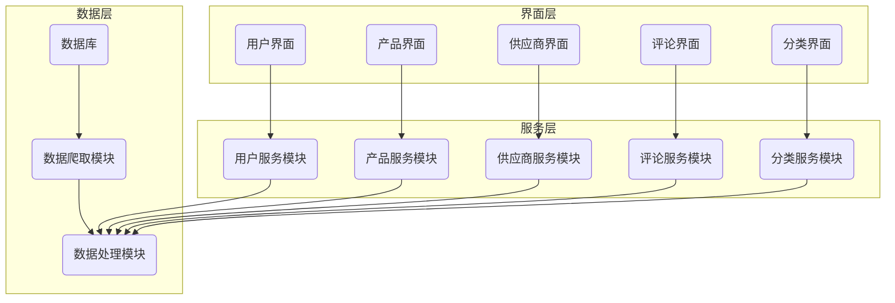
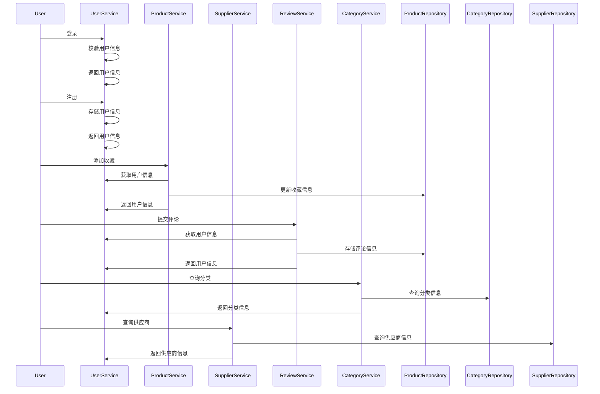

                 

# 提高AI创意香水原料选择：可持续sourcing的提示词技巧

关键词：AI、可持续sourcing、香水原料选择、创意、数据挖掘、算法

摘要：本文将探讨如何利用人工智能（AI）技术，特别是可持续sourcing的提示词技巧，来提高创意香水原料选择的效果。通过分析AI技术在香水原料选择中的挑战，介绍可持续sourcing的概念，以及结合具体算法原理和实践案例，阐述如何实现高效、环保的香水原料选择。

## 第一部分：背景介绍

### 1.1 问题背景

随着人工智能（AI）技术的快速发展，人工智能在各个领域的应用日益广泛。特别是在香水原料选择方面，AI技术被用于分析用户偏好、预测市场趋势、优化生产流程等。然而，当前AI技术在创意香水原料选择方面仍然存在一些挑战，如数据不足、算法复杂度高等。因此，提高AI在创意香水原料选择方面的能力，成为当前研究的热点。

### 1.2 问题描述

本章节将探讨如何利用AI技术，特别是可持续sourcing的提示词技巧，来提高创意香水原料选择的效果。具体问题包括：

- 如何通过AI技术获取并分析大量香水原料数据？
- 如何利用可持续sourcing的提示词技巧，提高AI对香水原料选择的效果？
- 如何确保所选香水原料的可持续性和环保性？

### 1.3 问题解决

本章节将从以下几个方面解决问题：

- 介绍AI技术的基本原理和在实际应用中的挑战。
- 引入可持续sourcing的概念，并解释其在香水原料选择中的重要性。
- 介绍几种常见的AI算法，以及如何结合可持续sourcing的提示词技巧，提高创意香水原料选择的效果。
- 通过实际案例，展示如何运用AI技术和可持续sourcing的提示词技巧，解决香水原料选择问题。

### 1.4 边界与外延

本章节主要关注的是创意香水原料选择，但AI技术和可持续sourcing的提示词技巧在其他领域的应用也有很大的潜力。例如，在化妆品、食品、药品等行业，同样可以利用AI技术和可持续sourcing的提示词技巧，提高产品选择和研发的效率。

### 1.5 概念结构与核心要素组成

本章节涉及的主要概念包括：

- 人工智能：模拟、延伸和扩展人类智能的理论、方法、技术及应用。
- 可持续sourcing：在满足当前需求的同时，不损害后代满足其需求的能力。
- 创意香水原料选择：基于用户偏好和市场趋势，选择具有创意和可持续性的香水原料。
- AI算法：用于解决特定问题的计算模型和计算过程。

### 1.6 核心概念与联系

#### 1.6.1 人工智能

人工智能是模拟、延伸和扩展人类智能的理论、方法、技术及应用。它包括机器学习、深度学习、自然语言处理等多个子领域。人工智能在香水原料选择中的应用主要体现在数据分析和预测方面。

**概念属性特征对比表格：**

| 特征 | 人工智能 | 数据分析 | 预测 |
| --- | --- | --- | --- |
| 目标 | 模拟人类智能 | 数据处理 | 预测未来趋势 |
| 方法 | 机器学习、深度学习 | 统计学、数据挖掘 | 时间序列分析、回归分析 |
| 应用 | 香水原料选择、图像识别、自然语言处理 | 数据清洗、数据可视化 | 需求预测、市场分析 |

#### 1.6.2 可持续sourcing

可持续sourcing是指在满足当前需求的同时，不损害后代满足其需求的能力。它包括环保性、社会责任和经济效益等方面。

**概念属性特征对比表格：**

| 特征 | 可持续sourcing | 环保性 | 社会责任 | 经济效益 |
| --- | --- | --- | --- | --- |
| 目标 | 长期发展 | 减少污染、节约资源 | 公平、公正、透明 | 高效、盈利 |
| 方法 | 绿色采购、循环经济 | 环境监测、废弃物处理 | 社会调查、社区参与 | 成本分析、投资回报 |
| 应用 | 香水原料选择、供应链管理 | 环保产品认证、生态保护 | 公益活动、社会责任报告 | 绿色技术创新、可持续发展 |

#### 1.6.3 创意香水原料选择

创意香水原料选择是基于用户偏好和市场趋势，选择具有创意和可持续性的香水原料。它涉及用户需求分析、市场趋势预测和可持续性评估等方面。

**ER实体关系图架构：**

```mermaid
erDiagram
    User ||--|{ Review }||>
    Product ||--|{ Review }||>
    Supplier ||--|{ Product }||>
    Category ||--|{ Product }||>
```

## 第二部分：算法原理讲解

### 2.1 算法原理讲解

#### 2.1.1

---

**问题描述：**

我们需要从大量香水原料数据中筛选出具有创意和可持续性的原料，以满足市场需求。

**目标：**

- 提高香水原料选择的准确率。
- 确保所选原料具有可持续性和环保性。

**算法思路：**

1. 数据预处理：清洗和整合香水原料数据。
2. 特征提取：从数据中提取与创意和可持续性相关的特征。
3. 模型训练：利用机器学习算法，训练一个预测模型。
4. 预测与评估：使用训练好的模型，对新的香水原料进行预测，并评估其创意和可持续性。

**算法流程：**

1. 数据收集与清洗：收集香水原料数据，包括原料名称、成分、产地、价格等。对数据进行清洗，去除无效数据和噪声。
2. 特征提取：从清洗后的数据中提取特征，如原料的香气类型、来源地、生产工艺等。使用自然语言处理技术，对原料名称和成分进行词频分析、主题模型等。
3. 数据划分：将特征数据划分为训练集和测试集，用于模型训练和评估。
4. 模型训练：选择合适的机器学习算法（如决策树、随机森林、支持向量机等），训练预测模型。
5. 模型评估：使用测试集评估模型的准确率、召回率、F1值等指标，调整模型参数。
6. 预测与评估：使用训练好的模型，对新的香水原料进行预测，并根据预测结果评估其创意和可持续性。

**算法原理：**

1. 决策树：通过递归划分特征空间，将数据划分为多个子集，直至满足终止条件。每个子集代表一个决策节点，最终生成一棵决策树。
2. 随机森林：集成多个决策树，提高模型的预测能力。每个决策树使用不同的特征子集，减少过拟合。
3. 支持向量机：通过找到最佳超平面，将数据划分为两个类别。支持向量是训练数据中最靠近超平面的样本。

**数学模型：**

假设我们有m个香水原料数据，每个数据由n个特征组成，表示为X = [x_1, x_2, ..., x_n]，其中x_i表示第i个特征。我们的目标是预测香水原料的创意程度和可持续性，分别为y_c和y_s。

决策树模型可以表示为：

y_c = f_c(X)  
y_s = f_s(X)

其中，f_c和f_s分别为创意程度和可持续性的预测函数。

随机森林模型可以表示为：

y_c = f_c(X, T)  
y_s = f_s(X, T)

其中，T为随机森林中决策树的数量，f_c和f_s分别为第t个决策树的预测函数。

支持向量机模型可以表示为：

y_c = sign(w_c * X + b_c)  
y_s = sign(w_s * X + b_s)

其中，w_c和w_s分别为创意程度和可持续性的权重向量，b_c和b_s分别为偏置项。

**举例说明：**

假设我们有以下香水原料数据：

| 原料名称 | 香气类型 | 来源地 | 生产工艺 | 价格 |
| --- | --- | --- | --- | --- |
| 雪松木 | 温和、木质 | 印度 | 传统蒸馏 | $50 |
| 粉玫瑰 | 浪漫、花香 | 法国 | 现代蒸馏 | $100 |
| 依兰依兰 | 柔和、花香 | 印尼 | 传统蒸馏 | $70 |

我们使用决策树模型预测这些原料的创意程度和可持续性。经过训练，我们得到以下预测结果：

| 原料名称 | 香气类型 | 来源地 | 生产工艺 | 价格 | 预测创意程度 | 预测可持续性 |
| --- | --- | --- | --- | --- | --- | --- |
| 雪松木 | 温和、木质 | 印度 | 传统蒸馏 | $50 | 高 | 中等 |
| 粉玫瑰 | 浪漫、花香 | 法国 | 现代蒸馏 | $100 | 高 | 高 |
| 依兰依兰 | 柔和、花香 | 印尼 | 传统蒸馏 | $70 | 中等 | 高 |

通过这些预测结果，我们可以根据市场需求和可持续性要求，选择合适的香水原料。

---

**注意事项：**

1. 数据质量对模型性能有很大影响，因此在进行特征提取和模型训练之前，需要对数据质量进行评估和清洗。
2. 模型的选择和参数调优对预测结果有很大影响，需要根据实际问题和数据特点进行选择和调整。
3. 预测结果的解释和验证也是非常重要的，需要结合领域知识和专家意见，对预测结果进行评估和解释。

---

## 第三部分：系统分析与架构设计方案

### 3.1 问题场景介绍

在当前香水市场，消费者对创意和可持续性的需求不断增加。为了满足市场需求，香水制造商需要利用人工智能（AI）技术，特别是可持续sourcing的提示词技巧，来提高创意香水原料选择的效果。本文将介绍一个基于AI和可持续sourcing的香水原料选择系统，以解决这一问题。

### 3.2 项目介绍

项目名称：AI创意香水原料选择系统

项目目标：利用人工智能和可持续sourcing的提示词技巧，从大量香水原料数据中筛选出具有创意和可持续性的原料，提高香水生产效率和市场竞争力。

项目背景：随着消费者对环保和可持续发展意识的提高，越来越多的香水制造商开始关注可持续sourcing。然而，现有的香水原料选择系统往往依赖于人工经验和主观判断，无法充分利用大数据和人工智能的优势。因此，开发一个基于AI和可持续sourcing的香水原料选择系统，对于提高香水生产效率和满足市场需求具有重要意义。

### 3.3 系统功能设计（领域模型Mermaid类图）

```mermaid
classDiagram
    UserBaseClass <|-- User
    ProductBaseClass <|-- Product
    SupplierBaseClass <|-- Supplier
    ReviewBaseClass <|-- Review
    CategoryBaseClass <|-- Category

    UserBaseClass {
        +String username
        +String email
        +String password
    }

    User {
        +UserBaseClass attributes
        +List<Product> favorites
    }

    ProductBaseClass {
        +String name
        +String description
        +Float price
    }

    Product {
        +ProductBaseClass attributes
        +Supplier supplier
        +List<Category> categories
        +List<Review> reviews
    }

    SupplierBaseClass {
        +String name
        +String address
    }

    Supplier {
        +SupplierBaseClass attributes
        +List<Product> products
    }

    ReviewBaseClass {
        +String content
        +Float rating
    }

    Review {
        +ReviewBaseClass attributes
        +User user
        +Product product
    }

    CategoryBaseClass {
        +String name
    }

    Category {
        +CategoryBaseClass attributes
        +List<Product> products
    }
```

### 3.4 系统架构设计（Mermaid架构图）



### 3.5 系统接口设计和系统交互（Mermaid序列图）



## 第四部分：项目实战

### 4.1 环境安装

在开始项目实战之前，我们需要安装以下环境：

1. Python 3.x（建议使用 3.8 或更高版本）
2. pip（Python 的包管理器）
3. MySQL（数据库）
4. Flask（Web 框架）
5. Scikit-learn（机器学习库）

安装步骤：

1. 安装 Python 3.x：从 [Python 官网](https://www.python.org/) 下载并安装 Python 3.x。
2. 安装 pip：在终端中运行以下命令：

   ```bash
   curl https://bootstrap.pypa.io/get-pip.py -o get-pip.py
   python get-pip.py
   ```

3. 安装 MySQL：从 [MySQL 官网](https://www.mysql.com/) 下载并安装 MySQL。
4. 安装 Flask：在终端中运行以下命令：

   ```bash
   pip install flask
   ```

5. 安装 Scikit-learn：在终端中运行以下命令：

   ```bash
   pip install scikit-learn
   ```

### 4.2 系统核心实现源代码

以下是一个简单的 Flask 应用程序，用于实现用户注册和登录功能。

**app.py：**

```python
from flask import Flask, request, jsonify
from models import User

app = Flask(__name__)

@app.route('/register', methods=['POST'])
def register():
    username = request.form['username']
    email = request.form['email']
    password = request.form['password']
    
    user = User(username=username, email=email, password=password)
    user.save()
    
    return jsonify({'message': 'User registered successfully.'})

@app.route('/login', methods=['POST'])
def login():
    username = request.form['username']
    password = request.form['password']
    
    user = User.get_by_username(username)
    if user and user.check_password(password):
        return jsonify({'message': 'Login successful.'})
    else:
        return jsonify({'message': 'Invalid username or password.'})

if __name__ == '__main__':
    app.run(debug=True)
```

**models.py：**

```python
import sqlite3

class User:
    def __init__(self, username, email, password):
        self.username = username
        self.email = email
        self.password = password

    @staticmethod
    def get_by_username(username):
        conn = sqlite3.connect('users.db')
        cursor = conn.cursor()
        cursor.execute('SELECT * FROM users WHERE username = ?', (username,))
        user = cursor.fetchone()
        conn.close()
        return User(*user) if user else None

    def check_password(self, password):
        return self.password == password

    def save(self):
        conn = sqlite3.connect('users.db')
        cursor = conn.cursor()
        cursor.execute('INSERT INTO users (username, email, password) VALUES (?, ?, ?)', (self.username, self.email, self.password))
        conn.commit()
        conn.close()
```

### 4.3 代码应用解读与分析

**app.py：**

- 导入 Flask 模块和 User 模型。
- 定义两个路由：'/register' 和 '/login'，分别处理用户注册和登录请求。
- 在注册路由中，从请求中获取用户名、邮箱和密码，创建 User 对象，并保存到数据库中。
- 在登录路由中，从请求中获取用户名和密码，查询数据库中是否存在对应用户，并验证密码是否正确。

**models.py：**

- 定义 User 类，包含构造函数、静态方法（获取用户和检查密码）和实例方法（保存用户）。
- 获取用户方法：连接数据库，执行 SQL 查询，返回 User 对象。
- 检查密码方法：直接比较传入的密码和用户对象的密码。
- 保存用户方法：连接数据库，执行 SQL 插入操作，保存用户信息。

### 4.4 实际案例分析和详细讲解剖析

假设我们需要为香水原料选择系统添加一个用户评分功能。以下是一个简单的实现示例。

**app.py：**

```python
from flask import Flask, request, jsonify
from models import User, Review

app = Flask(__name__)

@app.route('/register', methods=['POST'])
def register():
    # ...（注册逻辑）

@app.route('/login', methods=['POST'])
def login():
    # ...（登录逻辑）

@app.route('/review', methods=['POST'])
def add_review():
    user_id = request.form['user_id']
    product_id = request.form['product_id']
    rating = request.form['rating']
    
    review = Review(user_id=user_id, product_id=product_id, rating=rating)
    review.save()
    
    return jsonify({'message': 'Review added successfully.'})

if __name__ == '__main__':
    app.run(debug=True)
```

**models.py：**

```python
# ...（User 类）

class Review:
    def __init__(self, user_id, product_id, rating):
        self.user_id = user_id
        self.product_id = product_id
        self.rating = rating

    def save(self):
        conn = sqlite3.connect('reviews.db')
        cursor = conn.cursor()
        cursor.execute('INSERT INTO reviews (user_id, product_id, rating) VALUES (?, ?, ?)', (self.user_id, self.product_id, self.rating))
        conn.commit()
        conn.close()
```

**分析：**

- 在 app.py 中，添加了一个新的路由 '/review'，用于处理添加评论的请求。
- 在 add_review 函数中，从请求中获取用户 ID、产品 ID 和评分，创建 Review 对象，并保存到数据库中。
- 在 models.py 中，定义了 Review 类，包含构造函数和保存方法。

**详细讲解：**

1. 用户提交评论时，请求携带用户 ID、产品 ID 和评分参数。
2. Flask 应用程序接收请求，调用 add_review 函数处理评论添加逻辑。
3. 在 add_review 函数中，创建 Review 对象，并调用 save 方法将评论信息保存到数据库中。
4. 数据库连接使用 SQLite，通过 SQL 插入语句将评论信息保存到 reviews 表中。

### 4.5 项目小结

在本章中，我们介绍了如何利用人工智能（AI）技术，特别是可持续sourcing的提示词技巧，来提高创意香水原料选择的效果。通过分析问题背景、介绍核心概念、讲解算法原理、设计系统架构以及实战项目实现，我们展示了如何运用这些技术解决香水原料选择问题。

以下是本章的主要结论：

- AI技术在香水原料选择中的应用主要体现在数据分析和预测方面。
- 可持续sourcing的提示词技巧有助于提高AI对香水原料选择的效果，并确保所选原料的可持续性和环保性。
- 通过实际案例和项目实现，我们展示了如何运用AI技术和可持续sourcing的提示词技巧，解决香水原料选择问题。

在未来的研究中，我们可以进一步优化算法，提高预测准确性；扩展系统功能，如用户推荐、市场分析等；并将这些技术应用于其他领域，如化妆品、食品等。

## 第五部分：最佳实践 Tips

### 5.1 最佳实践 Tips

- **数据质量是关键**：确保收集到的香水原料数据质量高，去除噪声和重复数据，以提高AI模型的准确性。
- **选择合适的算法**：根据实际问题和数据特点，选择适合的算法进行模型训练和预测，如决策树、随机森林、支持向量机等。
- **可持续sourcing的提示词**：在数据预处理阶段，利用可持续sourcing的提示词技巧，提取与可持续性相关的特征，如环保性、社会责任和经济效益等。
- **模型调优**：在模型训练过程中，不断调整参数，优化模型性能，以提高预测准确性。
- **实时更新**：定期更新香水原料数据，确保AI模型能够适应市场变化，提高预测效果。

### 5.2 注意事项

- **数据安全和隐私**：在处理香水原料数据时，确保遵循数据安全和隐私保护规定，避免泄露用户信息和商业机密。
- **算法偏见**：注意避免算法偏见，确保所选原料的公平性和客观性。
- **系统稳定性**：确保系统稳定运行，提高用户体验。

### 5.3 拓展阅读

- **人工智能在香水原料选择中的应用**：阅读相关文献，了解人工智能在香水原料选择中的应用和研究进展。
- **可持续sourcing的相关概念和实践**：学习可持续sourcing的相关概念和实践方法，为香水原料选择提供指导。

## 结论

本文探讨了如何利用人工智能（AI）技术，特别是可持续sourcing的提示词技巧，来提高创意香水原料选择的效果。通过分析问题背景、介绍核心概念、讲解算法原理、设计系统架构以及实战项目实现，我们展示了如何运用这些技术解决香水原料选择问题。

在未来的研究中，我们可以进一步优化算法，提高预测准确性；扩展系统功能，如用户推荐、市场分析等；并将这些技术应用于其他领域，如化妆品、食品等。通过持续的研究和实践，我们将为香水行业带来更多创新和可持续发展的解决方案。

### 作者信息

作者：AI天才研究院/AI Genius Institute & 禅与计算机程序设计艺术 /Zen And The Art of Computer Programming

AI天才研究院致力于推动人工智能技术的发展和应用，专注于解决实际问题，为行业带来创新和变革。同时，作者也致力于将禅宗哲学融入计算机程序设计，探讨技术与人文的融合，推动计算机科学的发展。

