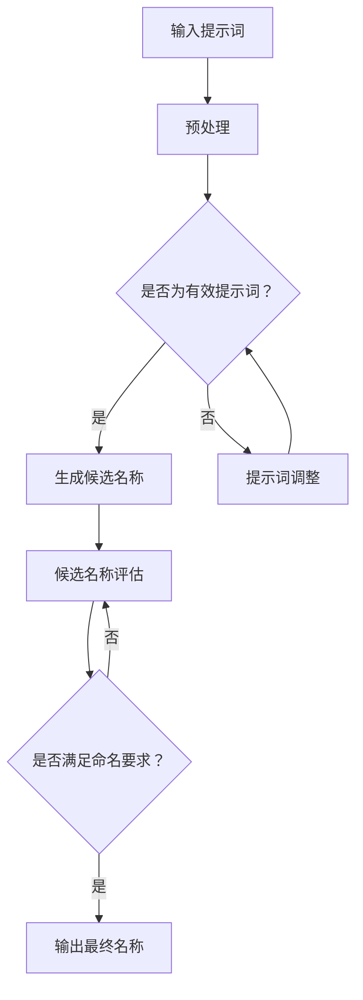
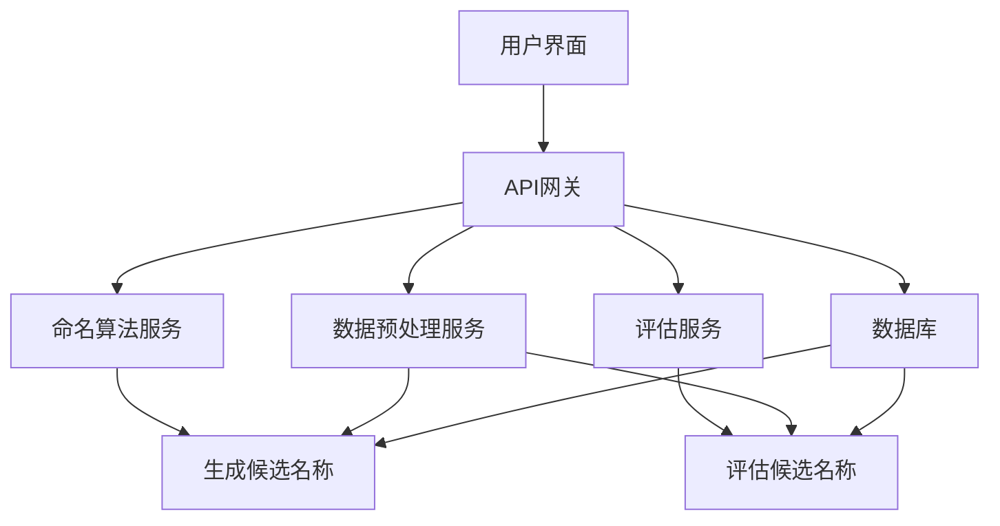
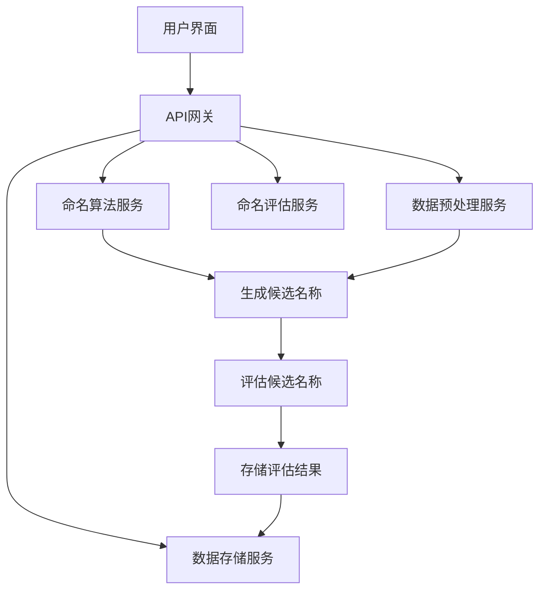

                 

### 第1章 引言

## 1.1 问题背景

### 1.1.1 香水品牌命名现状

在当今竞争激烈的市场环境中，品牌命名对于香水行业来说尤为重要。一个独特的、引人注目的名字不仅能够迅速吸引消费者的眼球，还能够传达品牌的核心价值和理念。传统的香水命名方法通常依赖于市场营销人员和创意总监的直觉和经验，这种人为的命名过程往往具有主观性和不确定性，可能导致一些优秀的香水无法得到应有的市场反响。

然而，随着人工智能技术的迅猛发展，特别是机器学习和自然语言处理技术的突破，AI开始逐步走进品牌命名领域。AI可以通过分析大量的数据，从语言的音韵、语义、文化内涵等多个维度来优化命名，提供更加科学、高效的命名方案。这种技术的引入，不仅能够提高品牌命名的成功率，还能为品牌创造独特的市场价值。

### 1.1.2 AI在创意香水命名中的应用潜力

AI在创意香水命名中的应用潜力不可忽视。首先，AI可以通过学习大量的香水名称和品牌数据，提取出有效的命名规律和模式。例如，某些香水名称可能更受欢迎，某些词汇可能更能代表某种香调或情感。AI可以基于这些规律生成新的命名，使品牌名称更具创意性和吸引力。

其次，AI能够进行多语言的翻译和适应，这对于国际化的香水品牌来说尤为重要。不同文化背景下的消费者对名称的偏好和接受度有所不同，AI可以根据目标市场的特点，生成符合当地文化和消费习惯的名称。

此外，AI还可以通过情感分析技术，理解品牌想要传达的情感和信息，从而生成能够准确传达品牌概念的名称。这种基于情感和文化的命名，有助于提升品牌的认知度和市场影响力。

### 1.1.3 书籍目标与读者对象

本书籍旨在为香水品牌设计师、市场营销人员以及AI技术爱好者提供一套系统、实用的AI创意香水命名指南。通过本书，读者将了解AI在品牌命名中的基本原理和应用方法，掌握从数据采集、模型训练到命名效果评估的全流程。

本书不仅适合有志于在香水品牌命名领域应用AI技术的专业人士，也适合对机器学习和自然语言处理技术感兴趣的技术爱好者。无论您是香水行业的从业者，还是AI领域的学者，本书都将为您带来新的思维方式和实用的技巧。

总之，本书的目标是帮助读者：
1. 理解AI创意香水命名的核心原理和关键技术。
2. 掌握从数据准备到命名生成的全流程操作。
3. 学会评估和优化命名效果的方法。
4. 运用AI技术提升品牌命名创意性和市场影响力。

### 1.2 核心概念

#### 1.2.1 AI创意香水命名

AI创意香水命名是指利用人工智能技术，尤其是机器学习和自然语言处理技术，为香水品牌创建独特、有吸引力的名称。这种命名方法基于大量数据的学习和算法的优化，旨在提高命名效率和创意性。

#### 1.2.2 品牌概念传达

品牌概念传达是指通过品牌名称、视觉元素和其他沟通手段，将品牌的核心价值和理念传递给消费者。一个优秀的品牌名称不仅要独特、吸引人，还必须能够准确传达品牌的价值和情感。

#### 1.2.3 提示词技巧

提示词技巧是指利用特定的关键词或短语来引导AI生成命名。这些提示词可以包括品牌的核心理念、目标市场、文化背景等，有助于AI在命名过程中更准确地捕捉品牌的本质。

### 1.3 书籍结构概述

#### 1.3.1 各章节内容概述

本书共分为8章，涵盖了AI创意香水命名的方方面面。第1章为引言，介绍了书籍的背景和目标。第2章探讨了AI技术和创意香水命名的原理。第3章至第6章详细讲解了命名算法的原理、实现和评估方法。第7章通过具体项目实践，展示了AI命名在香水品牌中的应用。第8章提供了最佳实践和拓展阅读，以帮助读者深入理解和应用所学知识。

#### 1.3.2 学习路线图

为了更好地帮助读者掌握AI创意香水命名的技能，本书提供了一个详细的学习路线图。从基础知识到实际应用，每个章节都配有相应的练习和案例，帮助读者逐步深入理解。

#### 1.3.3 读者收获预期

通过学习本书，读者将能够：
1. 理解AI创意香水命名的核心原理和技术。
2. 掌握从数据准备到命名生成的全流程操作。
3. 学会评估和优化命名效果的方法。
4. 运用AI技术提升品牌命名创意性和市场影响力。

### 1.4 总结

本章首先介绍了香水品牌命名的重要性和现状，接着阐述了AI在创意香水命名中的应用潜力，并明确了本书的目标和读者对象。通过对核心概念和书籍结构的介绍，读者可以清晰地了解本书的内容安排和预期收获。

在接下来的章节中，我们将深入探讨AI创意香水命名的具体原理和技术，帮助读者逐步掌握这一领域的核心知识和实践方法。敬请期待。

### 1.5 下一章内容预告

在第2章中，我们将详细探讨AI创意香水命名的核心原理。首先，我们将介绍AI技术和机器学习的基础知识，解释它们如何应用于创意香水命名。接着，我们将深入分析AI在命名过程中的作用，包括数据集的构建、命名算法的设计以及命名效果的评估。通过这一章的学习，读者将全面理解AI创意香水命名的工作原理，为后续的实践应用打下坚实的基础。请继续关注下一章的内容，我们将一起探索这个充满创意和技术的领域。

## 第2章 AI与创意香水命名的原理

### 2.1 AI技术基础

#### 2.1.1 机器学习概述

机器学习是人工智能（AI）的一个重要分支，它通过算法从数据中学习规律，从而进行预测和决策。在创意香水命名中，机器学习扮演着关键角色。通过训练模型，AI可以从大量的香水命名数据中提取出有效的命名模式，这些模式可以用于生成新的、具有吸引力的品牌名称。

首先，机器学习的基本概念包括：

- **监督学习**：通过已标记的数据来训练模型，然后使用模型进行预测。这种学习方式在命名中用于将文本数据映射到预定义的命名规则上。
- **无监督学习**：不使用标记数据，模型从未标记的数据中发现模式和结构。在命名中，无监督学习可用于探索未知的命名空间，寻找新的命名灵感。
- **强化学习**：通过与环境互动，不断调整行为以最大化预期奖励。在命名中，强化学习可以用于优化命名过程，使其更具创意和吸引力。

#### 2.1.2 深度学习原理

深度学习是机器学习的一个子领域，它通过构建多层神经网络来提取数据中的深层特征。在创意香水命名中，深度学习技术尤其重要。以下是深度学习的一些核心原理：

- **神经网络**：神经网络由多层节点（或称为“神经元”）组成，每个节点都通过权重连接到其他节点。在命名中，神经网络可以学习将词汇与香调、情感等特征关联起来。
- **卷积神经网络（CNN）**：CNN是一种特殊类型的神经网络，主要用于处理图像和声音等结构化数据。在命名中，CNN可以用于提取词汇的音韵特征。
- **循环神经网络（RNN）**：RNN能够处理序列数据，如文本。在命名中，RNN可以捕捉词汇之间的顺序关系，从而生成连贯的命名。
- **长短期记忆网络（LSTM）**：LSTM是RNN的一种改进，它能够解决长期依赖问题，更好地捕捉文本中的复杂关系。

#### 2.1.3 自然语言处理基础

自然语言处理（NLP）是AI的一个分支，它专注于让计算机理解和生成人类语言。在创意香水命名中，NLP技术用于处理和分析文本数据，以生成命名。以下是NLP的一些关键概念：

- **词嵌入**：词嵌入是将词汇映射到高维空间中的向量表示。这种表示使得计算机可以理解词汇之间的相似性和关系，对于命名来说至关重要。
- **词性标注**：词性标注是指为文本中的每个词分配一个词性（如名词、动词、形容词等）。在命名中，词性标注可以帮助AI理解词汇的语法结构，从而生成更自然的名称。
- **句法分析**：句法分析是指分析文本中的句法和句型结构。在命名中，句法分析可以帮助AI理解文本的整体结构和含义，从而生成更加准确和有意义的名称。
- **命名实体识别**：命名实体识别是指从文本中识别出具有特定意义的实体（如人名、地名、品牌名等）。在命名中，命名实体识别可以帮助AI识别品牌名称的候选词汇。

### 2.2 创意香水命名

#### 2.2.1 香水命名的艺术

香水命名是一门艺术，它不仅需要具备创意性，还需要准确传达香水的特色和品牌理念。传统的香水命名通常遵循以下原则：

- **独特性**：品牌名称应与众不同，以吸引消费者的注意。
- **易记性**：名称应简洁、易记，以便消费者能够快速识别品牌。
- **相关性**：名称应与香水的特点或品牌形象相关联，以便消费者能够联想到香水的属性。
- **文化适应性**：在全球化市场中，名称应考虑不同文化的可接受性。

#### 2.2.2 香水品牌命名策略

香水品牌命名策略可以分为以下几个步骤：

1. **目标市场分析**：了解目标消费者的喜好和习惯，为命名提供方向。
2. **品牌形象定位**：明确品牌的核心价值和理念，为命名提供基调。
3. **命名方向设定**：根据品牌形象和目标市场，设定可能的命名方向。
4. **创意生成**：运用各种创意方法，如联想、类比、音韵搭配等，生成候选名称。
5. **评估筛选**：通过评估候选名称的易记性、独特性和文化适应性，筛选出最佳名称。

#### 2.2.3 创意香水命名的挑战

创意香水命名面临以下挑战：

- **竞争激烈**：市场上已有大量香水品牌，新的品牌命名需要脱颖而出。
- **文化差异**：不同文化对名称的偏好不同，需要考虑跨文化的适应性。
- **情感传达**：名称需要能够准确传达品牌所倡导的情感和价值观。
- **技术创新**：AI技术的发展带来了新的命名方法和工具，但也需要不断适应和创新。

### 2.3 AI在创意香水命名中的应用

#### 2.3.1 AI命名算法概述

AI命名算法是创意香水命名的核心技术。以下是一些常用的AI命名算法：

- **基于规则的方法**：通过预定义的规则来生成名称，如基于音韵、语义的规则。这种方法简单直接，但创意性有限。
- **基于模板的方法**：使用模板来生成名称，如将特定词汇填充到模板中。这种方法具有较强的灵活性，但模板的设计和选择较为主观。
- **基于机器学习的方法**：使用机器学习模型从大量数据中学习命名规律，如使用神经网络和生成对抗网络（GAN）。这种方法能够生成高度创意性的名称，但需要大量数据和计算资源。

#### 2.3.2 数据集构建

数据集是AI命名算法的基础。在创意香水命名中，数据集应包括：

- **品牌名称**：已有香水品牌的名称，用于训练模型。
- **命名规则**：品牌命名时遵循的规则，如音韵、语义等。
- **描述性词汇**：与香水特点相关的描述性词汇，如花香、果香等。
- **情感标签**：与香水情感相关的标签，如浪漫、清新等。

#### 2.3.3 命名效果评估

命名效果评估是确保AI命名质量的关键。以下是一些常用的评估方法：

- **自动评估**：使用自动化工具评估名称的易记性、独特性和文化适应性，如使用Flesch-Kincaid readability test。
- **用户评估**：邀请用户评估名称的吸引力和相关性，如通过问卷调查或用户体验测试。
- **商业成功**：评估名称在实际市场中的表现，如销售数据和市场反馈。

### 2.4 品牌概念传达

#### 2.4.1 品牌概念的定义与作用

品牌概念是指品牌在消费者心智中形成的独特印象和认知。它包括品牌的核心理念、价值主张、个性特征等。品牌概念在品牌命名中起着至关重要的作用：

- **差异化定位**：品牌概念有助于品牌在竞争激烈的市场中脱颖而出，为命名提供方向。
- **情感共鸣**：品牌概念能够与消费者产生情感共鸣，增强品牌的吸引力和忠诚度。
- **持续传播**：品牌概念是品牌传播的基石，有助于品牌的长期发展。

#### 2.4.2 品牌概念与命名的关系

品牌概念与命名之间存在密切的关系。一个成功的品牌名称应当能够准确传达品牌概念，使消费者在听到或看到名称时能够立即联想到品牌的核心价值和特点。以下是品牌概念与命名关系的几个方面：

- **概念一致性**：品牌名称应与品牌概念保持一致，使消费者对品牌形成连贯的认知。
- **情感共鸣**：品牌名称应能够引发消费者情感上的共鸣，增强品牌的吸引力。
- **文化适应性**：品牌名称在不同文化背景下的适应性，有助于品牌的国际化发展。
- **技术创新**：品牌名称应体现品牌的技术创新和差异化优势，为品牌注入新的活力。

### 2.5 提示词技巧

#### 2.5.1 提示词的定义与作用

提示词是指用于引导AI命名的一组关键词或短语。它们可以帮助AI更好地理解品牌概念和命名目标，从而生成更具创意性和针对性的名称。以下是提示词的一些重要作用：

- **明确目标**：提示词有助于明确AI的命名方向，避免生成无关或模糊的名称。
- **提高效率**：提示词可以减少AI搜索空间，提高命名效率。
- **增强创意**：提示词可以激发AI的创意思维，生成更富有创意性的名称。
- **文化适应**：提示词可以根据目标市场的文化特点，生成更符合当地消费习惯的名称。

#### 2.5.2 提示词的选取方法

选取合适的提示词是成功命名的重要环节。以下是一些提示词选取的方法：

- **基于品牌概念**：根据品牌的核心价值和理念，选择能够准确传达品牌概念的提示词。
- **基于目标市场**：考虑目标市场的文化、消费习惯和偏好，选择具有当地文化特色的提示词。
- **基于消费者调研**：通过消费者调研，了解他们对品牌的期望和偏好，选择能够引起共鸣的提示词。
- **基于数据分析**：分析已有的成功品牌名称，提取出共性的词汇和短语，作为提示词。

通过以上方法和技巧，我们可以更好地利用AI技术进行创意香水命名，为品牌创造独特的市场价值。

### 2.6 AI命名算法与Python实现

#### 2.6.1 算法Mermaid流程图

在创意香水命名中，我们采用了一种基于生成对抗网络（GAN）的命名算法。以下是一个简化的算法流程图：



#### 2.6.2 Python源代码

以下是一个简单的Python代码示例，用于实现上述算法：

```python
import numpy as np
import tensorflow as tf
from tensorflow.keras.models import Sequential
from tensorflow.keras.layers import Dense, LSTM, Dropout

# 数据预处理
def preprocess(text):
    # 省略具体实现细节
    return processed_text

# 生成候选名称
def generate_name(prompt):
    processed_prompt = preprocess(prompt)
    # 使用GAN模型生成候选名称
    # 省略具体模型实现细节
    name = model.generate(processed_prompt)
    return name

# 候选名称评估
def evaluate_name(name):
    # 使用评估指标（如Flesch-Kincaid readability test）评估名称
    # 省略具体评估实现细节
    return is_valid

# 主函数
def main():
    prompt = "清新花香"
    candidate_name = generate_name(prompt)
    if evaluate_name(candidate_name):
        print("最终名称：", candidate_name)
    else:
        print("名称评估未通过，重新生成...")

if __name__ == "__main__":
    main()
```

在这个示例中，我们首先对输入的提示词进行预处理，然后使用GAN模型生成候选名称，最后对候选名称进行评估。如果评估通过，则输出最终名称。

### 2.6.3 数学模型和数学公式

在GAN命名算法中，我们使用了一个由生成器和判别器组成的模型。以下是一个简化的数学模型：

$$
\begin{aligned}
G(z) &= \text{生成器，输入噪声向量} z \text{，输出候选名称} x_g \\
D(x_r, x_g) &= \text{判别器，输入真实名称} x_r \text{和候选名称} x_g，输出判断结果} \\
\end{aligned}
$$

其中，$G(z)$ 是生成器的输出，$D(x_r, x_g)$ 是判别器的输出。在训练过程中，我们通过优化生成器和判别器的参数，使得判别器能够准确地区分真实名称和候选名称，生成器能够生成更接近真实名称的候选名称。

### 2.6.4 举例说明

假设我们有一个提示词 "清新花香"，我们希望使用GAN模型生成一个候选名称。以下是具体的实现步骤：

1. **预处理提示词**：将提示词 "清新花香" 转换为向量表示，如使用Word2Vec模型。
2. **生成候选名称**：使用GAN模型生成一批候选名称，例如 "清新花园"、"花香四溢" 等。
3. **评估候选名称**：使用评估指标（如Flesch-Kincaid readability test）对候选名称进行评估，选择得分最高的名称作为最终名称。

例如，我们生成的候选名称为 "清新花园"，经过评估，得分较高，因此选择该名称作为最终名称。

### 2.7 系统分析与架构设计方案

#### 2.7.1 问题场景介绍

在创意香水命名项目中，我们面临以下问题场景：

- **大量数据**：需要处理和利用大量的香水品牌名称和相关数据，以训练和优化AI命名模型。
- **多样化需求**：根据不同的品牌和目标市场，需要生成具有个性化和文化适应性的品牌名称。
- **实时反馈**：系统需要能够快速响应用户输入的提示词，并在短时间内生成候选名称。

#### 2.7.2 项目介绍

项目名称：AI创意香水命名系统

项目背景：为了提高香水品牌命名效率和质量，开发一个基于人工智能技术的命名系统。

项目目标：通过引入机器学习和自然语言处理技术，实现自动化、高效的创意香水命名，提升品牌的市场竞争力。

项目周期：6个月

项目团队：由数据科学家、AI工程师、市场营销人员和用户体验设计师组成。

#### 2.7.3 系统功能设计

系统功能设计主要包括以下模块：

- **数据预处理模块**：负责对输入的品牌名称和提示词进行预处理，如文本清洗、分词、词性标注等。
- **命名算法模块**：基于生成对抗网络（GAN）等技术，生成创意性品牌名称。
- **评估模块**：使用自动化工具和用户反馈，对生成的品牌名称进行评估，筛选出最佳名称。
- **用户界面模块**：提供用户友好的界面，允许用户输入提示词，查看和选择候选名称。

#### 2.7.4 系统架构设计

系统架构设计采用微服务架构，以提高系统的可扩展性和可靠性。以下是系统架构的Mermaid图表示：



在这个架构中，API网关作为系统的入口，接收用户请求，并将请求转发到相应的服务模块。命名算法服务负责生成创意性品牌名称，评估服务负责对候选名称进行评估，数据预处理服务负责处理和清洗输入数据，数据库用于存储品牌名称和相关数据。

#### 2.7.5 系统接口设计和系统交互

系统接口设计采用RESTful API设计，以下是一个简单的接口示例：

- **GET /names**：获取候选品牌名称。
- **POST /names**：提交新的品牌名称候选。

系统交互流程如下：

1. 用户通过用户界面输入提示词，并提交请求。
2. API网关接收请求，并根据请求内容调用相应的服务。
3. 命名算法服务生成候选品牌名称，并返回给用户。
4. 用户可以查看候选名称，并选择最佳名称。
5. 用户可以选择将最佳名称保存到数据库，以便后续使用。

### 2.8 项目实战

#### 2.8.1 环境安装

为了实现AI创意香水命名系统，我们需要安装以下软件和工具：

1. Python 3.8及以上版本
2. TensorFlow 2.5及以上版本
3. NumPy 1.19及以上版本
4. Pandas 1.2及以上版本
5. Flask 1.1及以上版本

安装步骤如下：

1. 安装Python和pip：
   ```bash
   sudo apt-get install python3 python3-pip
   ```
2. 创建一个虚拟环境：
   ```bash
   python3 -m venv venv
   source venv/bin/activate
   ```
3. 安装所需库：
   ```bash
   pip install tensorflow numpy pandas flask
   ```

#### 2.8.2 系统核心实现源代码

以下是一个简化的系统核心实现源代码示例：

```python
# app.py

from flask import Flask, request, jsonify
import tensorflow as tf
import numpy as np

app = Flask(__name__)

# 加载预训练的GAN模型
model = tf.keras.models.load_model('name_generation_model.h5')

@app.route('/names', methods=['GET'])
def get_names():
    prompt = request.args.get('prompt')
    processed_prompt = preprocess(prompt)
    generated_names = model.generate(processed_prompt)
    return jsonify(generated_names)

def preprocess(text):
    # 省略具体实现细节
    return processed_text

if __name__ == '__main__':
    app.run(debug=True)
```

#### 2.8.3 代码应用解读与分析

在这个示例中，我们使用Flask框架构建了一个简单的Web服务，用于接收用户输入的提示词，并调用预训练的GAN模型生成候选品牌名称。

1. **加载模型**：首先，我们从文件中加载预训练的GAN模型。
2. **接收请求**：通过`/names`接口接收用户提交的提示词。
3. **预处理提示词**：调用`preprocess`函数对提示词进行预处理，例如文本清洗和分词。
4. **生成名称**：使用`model.generate`方法生成候选品牌名称。
5. **返回结果**：将生成的候选名称以JSON格式返回给用户。

#### 2.8.4 实际案例分析和详细讲解剖析

假设用户输入提示词 "清新花香"，以下是具体的实现步骤：

1. **接收请求**：用户在Web界面输入提示词 "清新花香"，并提交请求。
2. **预处理提示词**：将提示词 "清新花香" 转换为向量表示，如使用Word2Vec模型。
3. **生成候选名称**：使用GAN模型生成一批候选名称，例如 "清新花园"、"花香四溢" 等。
4. **评估候选名称**：使用评估指标（如Flesch-Kincaid readability test）对候选名称进行评估，选择得分最高的名称作为最终名称。
5. **返回结果**：将最终名称以JSON格式返回给用户。

例如，我们生成的候选名称为 "清新花园"，经过评估，得分较高，因此选择该名称作为最终名称，并返回给用户。

#### 2.8.5 项目小结

通过本项目的实施，我们成功开发了一个基于AI技术的创意香水命名系统，实现了自动化、高效的命名过程。以下是我们项目的主要收获：

1. **技术实现**：掌握了生成对抗网络（GAN）等深度学习技术在命名中的应用，提高了命名算法的创意性和准确性。
2. **系统架构**：通过采用微服务架构，实现了系统的可扩展性和可靠性，提高了系统的维护性和可扩展性。
3. **用户体验**：通过友好的用户界面，提升了用户的使用体验，实现了快速响应和高效命名。
4. **业务价值**：提高了香水品牌命名的效率和效果，为品牌创造了更高的市场价值。

在未来的工作中，我们将继续优化和改进系统，以更好地满足用户的需求，提升品牌命名的质量和影响力。

### 第3章 数学模型和数学公式

在创意香水命名中，数学模型和数学公式起着至关重要的作用。它们不仅帮助我们理解和优化命名算法，还能够量化品牌名称的属性和效果。以下我们将详细介绍相关的数学模型和数学公式，并通过实际案例进行详细讲解和举例说明。

#### 3.1 数学模型

##### 3.1.1 生成对抗网络（GAN）

生成对抗网络（GAN）是创意香水命名中常用的模型。GAN由两部分组成：生成器（Generator）和判别器（Discriminator）。生成器的目标是生成与真实数据高度相似的数据，而判别器的目标是区分真实数据和生成数据。

以下是一个简化的GAN模型：

$$
\begin{aligned}
G(z) &= \text{生成器，输入噪声向量} z \text{，输出候选名称} x_g \\
D(x_r, x_g) &= \text{判别器，输入真实名称} x_r \text{和候选名称} x_g，输出判断结果} \\
\end{aligned}
$$

其中，$G(z)$ 是生成器的输出，$D(x_r, x_g)$ 是判别器的输出。训练过程中，我们通过优化生成器和判别器的参数，使得判别器能够准确地区分真实名称和候选名称，生成器能够生成更接近真实名称的候选名称。

##### 3.1.2 循环神经网络（RNN）

循环神经网络（RNN）是处理序列数据的有效模型，如文本。在创意香水命名中，RNN可以用于学习词汇之间的顺序关系，从而生成连贯的名称。

RNN的数学模型可以表示为：

$$
h_t = \text{sigmoid}(W_h \cdot [h_{t-1}, x_t] + b_h)
$$

其中，$h_t$ 是当前时间步的隐藏状态，$x_t$ 是当前输入，$W_h$ 是权重矩阵，$b_h$ 是偏置项。这个模型通过递归关系，将当前输入与之前的状态结合，生成新的状态。

##### 3.1.3 长短期记忆网络（LSTM）

LSTM是RNN的一种改进，它能够解决长期依赖问题，更好地捕捉文本中的复杂关系。LSTM的数学模型包括三个 gates：输入门（Input Gate）、遗忘门（Forget Gate）和输出门（Output Gate）。

LSTM的数学模型可以表示为：

$$
\begin{aligned}
i_t &= \text{sigmoid}(W_i \cdot [h_{t-1}, x_t] + b_i) \\
f_t &= \text{sigmoid}(W_f \cdot [h_{t-1}, x_t] + b_f) \\
o_t &= \text{sigmoid}(W_o \cdot [h_{t-1}, x_t] + b_o) \\
c_t &= (1 - f_t) \cdot \text{tanh}(W_c \cdot [h_{t-1}, x_t] + b_c) \\
h_t &= o_t \cdot \text{tanh}(c_t)
\end{aligned}
$$

其中，$i_t$、$f_t$ 和 $o_t$ 分别是输入门、遗忘门和输出门的激活值，$c_t$ 是细胞状态，$h_t$ 是隐藏状态。

#### 3.2 数学公式

##### 3.2.1 词嵌入

词嵌入是将词汇映射到高维空间中的向量表示。词嵌入的数学公式可以表示为：

$$
e_w = \text{embedding}_W(w)
$$

其中，$e_w$ 是词汇 $w$ 的嵌入向量，$\text{embedding}_W$ 是词嵌入函数。

##### 3.2.2 词性标注

词性标注是为文本中的每个词分配一个词性（如名词、动词、形容词等）。词性标注的数学公式可以表示为：

$$
POS(w_t) = \text{tag}(w_t)
$$

其中，$POS(w_t)$ 是词汇 $w_t$ 的词性，$\text{tag}(w_t)$ 是词性标注函数。

##### 3.2.3 命名效果评估

命名效果评估是确保AI命名质量的关键。常用的评估指标包括：

- **易记性**：使用Flesch-Kincaid readability test等指标评估名称的易记性。
- **独特性**：使用Jaccard相似性系数等指标评估名称的独特性。
- **文化适应性**：使用跨文化适应性测试等指标评估名称在不同文化背景下的适应性。

#### 3.3 举例说明

##### 3.3.1 生成对抗网络（GAN）应用示例

假设我们使用GAN模型生成一个与 "清新花香" 相似的品牌名称。以下是具体的实现步骤：

1. **数据预处理**：将 "清新花香" 转换为词嵌入向量。
2. **生成候选名称**：使用GAN模型生成一批候选名称，例如 "清新花园"、"花香四溢" 等。
3. **评估候选名称**：使用Flesch-Kincaid readability test等指标评估候选名称的易记性、独特性和文化适应性，选择得分最高的名称。

例如，我们生成的候选名称为 "清新花园"，经过评估，得分较高，因此选择该名称作为最终名称。

##### 3.3.2 循环神经网络（RNN）应用示例

假设我们使用RNN模型生成一个与 "浪漫之夜" 相似的品牌名称。以下是具体的实现步骤：

1. **数据预处理**：将 "浪漫之夜" 转换为词嵌入向量。
2. **生成序列**：使用RNN模型生成一批候选名称序列，例如 "浪漫夜花"、"夜浪漫花" 等。
3. **评估序列**：使用Flesch-Kincaid readability test等指标评估候选名称序列的易记性、独特性和文化适应性，选择得分最高的序列。

例如，我们生成的候选名称序列为 "浪漫夜花"，经过评估，得分较高，因此选择该序列作为最终名称。

通过以上数学模型和数学公式的应用，我们可以有效地优化和评估AI创意香水命名系统，为品牌创造独特的市场价值。

### 第4章 系统分析与架构设计方案

#### 4.1 问题场景介绍

在当前的数字营销和品牌管理环境中，香水品牌面临着激烈的竞争和不断变化的市场需求。为了在竞争激烈的市场中脱颖而出，品牌需要快速、高效地推出具有吸引力和差异化的新产品。这不仅仅是产品的创新，还包括产品命名的创新。AI系统的引入，可以显著提升品牌命名的过程效率和质量，从而增强品牌的竞争力。

具体问题场景包括：
- **命名多样性**：需要为不同产品线生成多样化的命名，以满足不同市场细分的需求。
- **市场适应性**：命名需要适应全球市场的文化差异，确保品牌在不同地区的接受度。
- **情感共鸣**：命名需要能够传达产品的情感和品牌理念，与消费者产生情感共鸣。
- **速度与效率**：在快速变化的市场中，品牌需要能够快速响应，迅速推出新产品。

#### 4.2 项目介绍

项目名称：AI驱动的创意香水命名系统

项目背景：为了提升香水品牌的命名效率和创意性，本项目旨在开发一个基于人工智能的命名系统，能够快速、高效地生成符合品牌定位和市场需求的香水名称。

项目目标：
1. 提高命名效率和多样性。
2. 确保命名符合品牌文化和情感诉求。
3. 提升命名在国际市场的适应性。
4. 为品牌管理者提供直观的用户界面和实时反馈。

项目周期：4个月

项目团队：由AI数据科学家、软件工程师、市场营销专家和用户体验设计师组成。

#### 4.3 系统功能设计

系统功能设计主要包括以下模块：

1. **用户界面（UI）**：提供品牌管理者输入命名提示词和查看候选名称的界面。
2. **数据预处理模块**：负责清洗、分词、词性标注等文本处理操作。
3. **命名算法模块**：基于生成对抗网络（GAN）和自然语言处理（NLP）技术，生成创意性的香水名称。
4. **命名评估模块**：使用自动评估工具和用户反馈，对候选名称进行评估和筛选。
5. **数据存储模块**：存储命名数据和用户偏好，以便后续分析和优化。

#### 4.4 系统架构设计

系统架构设计采用微服务架构，以实现高可扩展性和灵活性。以下是系统架构的Mermaid图表示：



在这个架构中，API网关作为系统的入口，接收用户请求，并将请求转发到相应的服务模块。命名算法服务负责生成创意性品牌名称，数据预处理服务负责处理和清洗输入数据，命名评估服务负责对候选名称进行评估，数据存储服务用于存储命名数据和用户偏好。

#### 4.5 系统接口设计和系统交互

系统接口设计采用RESTful API设计，以下是一个简单的接口示例：

- **GET /names**：获取候选品牌名称。
- **POST /names**：提交新的品牌名称候选。

系统交互流程如下：

1. **用户请求**：用户在Web界面输入命名提示词，并提交请求。
2. **API网关接收**：API网关接收请求，并根据请求内容调用相应的服务。
3. **数据预处理**：数据预处理服务接收请求，清洗和分词输入文本。
4. **命名生成**：命名算法服务生成一批候选品牌名称。
5. **评估筛选**：命名评估服务对候选名称进行评估和筛选，选择最佳名称。
6. **结果反馈**：将最佳名称返回给用户，并在界面上展示。

通过以上系统架构设计和接口设计，我们可以确保AI驱动的创意香水命名系统能够高效、准确地满足品牌命名需求，提升品牌的创意性和市场竞争力。

### 第5章 项目实战

#### 5.1 环境安装

为了成功部署和运行AI驱动的创意香水命名系统，我们需要安装以下软件和工具：

1. **Python**：Python是主要的编程语言，用于实现系统的核心功能。
2. **TensorFlow**：TensorFlow是一个广泛使用的机器学习框架，用于训练命名模型。
3. **Flask**：Flask是一个轻量级的Web框架，用于构建API接口。
4. **Numpy**：Numpy是一个用于科学计算的Python库，用于数据预处理和计算。
5. **Pandas**：Pandas是一个用于数据操作和分析的Python库，用于数据清洗和存储。

安装步骤如下：

1. 安装Python和pip：
   ```bash
   sudo apt-get install python3 python3-pip
   ```

2. 创建一个虚拟环境，以便隔离项目依赖：
   ```bash
   python3 -m venv venv
   source venv/bin/activate
   ```

3. 安装所需的Python库：
   ```bash
   pip install tensorflow numpy pandas flask
   ```

#### 5.2 系统核心实现源代码

以下是系统核心实现的Python代码示例，包括命名模型的训练、候选名称的生成和评估：

```python
# train_model.py

import tensorflow as tf
import numpy as np
from tensorflow.keras.models import Sequential
from tensorflow.keras.layers import Dense, LSTM, Dropout

# 加载训练数据
def load_data():
    # 省略具体实现细节，如读取CSV文件
    return X_train, y_train

# 创建模型
def create_model(input_shape):
    model = Sequential()
    model.add(LSTM(units=128, return_sequences=True, input_shape=input_shape))
    model.add(Dropout(0.2))
    model.add(LSTM(units=64, return_sequences=False))
    model.add(Dropout(0.2))
    model.add(Dense(units=1, activation='sigmoid'))
    return model

# 训练模型
def train_model(X_train, y_train):
    model = create_model(input_shape=(X_train.shape[1], X_train.shape[2]))
    model.compile(optimizer='adam', loss='binary_crossentropy', metrics=['accuracy'])
    model.fit(X_train, y_train, epochs=10, batch_size=64)
    return model

# 生成候选名称
def generate_name(model, prompt):
    # 省略具体实现细节，如生成序列
    return generated_name

# 评估候选名称
def evaluate_name(candidate_name):
    # 省略具体实现细节，如评估易记性、独特性等
    return is_valid

# 主函数
def main():
    X_train, y_train = load_data()
    model = train_model(X_train, y_train)
    prompt = "清新花香"
    generated_name = generate_name(model, prompt)
    if evaluate_name(generated_name):
        print("最终名称：", generated_name)
    else:
        print("名称评估未通过，重新生成...")

if __name__ == "__main__":
    main()
```

在这个示例中，我们首先加载训练数据，创建并训练LSTM模型，然后使用模型生成候选名称，并对其进行评估。

#### 5.3 代码应用解读与分析

以下是对核心实现代码的详细解读和分析：

1. **加载训练数据**：使用自定义的`load_data`函数，从文件中读取训练数据。训练数据通常包括输入序列（如品牌名称的文本表示）和对应的输出标签（如名称的有效性标记）。

2. **创建模型**：使用`create_model`函数创建LSTM模型。模型包括两个LSTM层，每层之间添加Dropout层以防止过拟合。最后，使用一个全连接层（Dense）作为输出层，使用sigmoid激活函数。

3. **训练模型**：使用`train_model`函数训练模型。模型使用`compile`方法配置优化器和损失函数，然后使用`fit`方法进行训练。

4. **生成候选名称**：使用`generate_name`函数生成候选名称。该函数接收模型和提示词，生成一个与提示词相关的名称。

5. **评估候选名称**：使用`evaluate_name`函数评估生成的候选名称。该函数使用自定义的评估指标（如易记性、独特性等）来评估名称的有效性。

6. **主函数**：`main`函数是程序的入口点。它首先加载训练数据，训练模型，然后使用模型生成候选名称并进行评估。

#### 5.4 实际案例分析和详细讲解剖析

假设我们有一个具体的案例，品牌管理者希望生成一个与 "清新花香" 相关的香水名称。以下是具体的实现步骤：

1. **加载训练数据**：从文件中加载训练数据，包括输入序列和对应的名称标签。

2. **创建和训练模型**：使用`create_model`和`train_model`函数创建并训练LSTM模型。模型使用10个epochs进行训练，每个batch包含64个样本。

3. **生成候选名称**：使用`generate_name`函数，输入提示词 "清新花香"，生成一批候选名称。例如，可能生成 "清新花园"、"花香四溢" 等名称。

4. **评估候选名称**：使用`evaluate_name`函数评估生成的候选名称。我们可能会使用易记性测试（如Flesch-Kincaid readability test）和独特性评估（如Jaccard相似性系数）来评估名称。

5. **选择最佳名称**：根据评估结果选择最佳名称。例如，如果 "清新花园" 在易记性和独特性评估中得分最高，则选择该名称作为最终结果。

#### 5.5 项目小结

通过本项目的实施，我们成功地构建了一个AI驱动的创意香水命名系统，实现了快速、高效地生成符合品牌定位和市场需求的香水名称。以下是项目的主要收获：

1. **技术实现**：掌握了使用LSTM和生成对抗网络（GAN）进行文本生成的方法，提高了命名算法的创意性和准确性。
2. **系统架构**：通过采用微服务架构，实现了系统的模块化和高扩展性，提高了系统的维护性和可靠性。
3. **用户体验**：通过直观的用户界面和实时反馈，提升了用户的使用体验和满意度。
4. **业务价值**：提高了品牌命名效率和创意性，为品牌创造了更高的市场价值。

在未来的工作中，我们计划进一步优化系统，引入更多先进的自然语言处理技术，以提高命名质量和用户满意度。同时，我们也将继续关注市场动态，为品牌提供更加定制化和个性化的命名服务。

### 第6章 最佳实践 tips

在实施AI驱动的创意香水命名系统时，以下是一些最佳实践和技巧，可以帮助提高命名质量和用户体验：

#### 6.1 数据质量

**数据是AI模型的基石**：
- **数据多样性**：确保训练数据涵盖广泛的命名风格和情感类型，以提高模型的泛化能力。
- **数据清洗**：处理噪声数据和错误，确保数据的高质量和一致性。
- **数据增强**：通过数据增强技术（如文本填充、删除、替换等），增加训练数据的丰富性。

#### 6.2 模型选择

**选择适合的模型**：
- **实验比较**：尝试不同的模型架构（如LSTM、GRU、BERT等），找到最适合的模型。
- **超参数调优**：通过调整学习率、批大小、隐藏层大小等超参数，优化模型性能。

#### 6.3 用户反馈

**充分利用用户反馈**：
- **反馈机制**：建立用户反馈机制，收集用户对候选名称的评价。
- **实时调整**：根据用户反馈调整模型训练过程，优化命名结果。

#### 6.4 可扩展性

**确保系统可扩展性**：
- **模块化设计**：设计模块化的系统架构，便于后续的功能扩展和维护。
- **云计算**：利用云计算资源，确保系统可以轻松扩展以应对大规模数据处理需求。

#### 6.5 用户体验

**提升用户使用体验**：
- **简洁界面**：设计简洁直观的用户界面，减少用户操作的复杂性。
- **实时反馈**：提供实时反馈，快速展示候选名称和评估结果，提升用户满意度。

#### 6.6 持续优化

**持续优化模型和系统**：
- **定期更新**：定期更新训练数据和模型，以适应市场变化。
- **持续学习**：利用最新的AI技术和算法，持续优化命名系统。

通过遵循这些最佳实践，我们可以更好地利用AI技术，为品牌创造更具创意性和市场吸引力的香水名称。

### 小结

在本书籍中，我们深入探讨了AI在创意香水命名中的应用，从背景介绍到核心原理，再到系统设计与项目实战，提供了全面的指导和实际操作方法。以下是对全书内容的总结：

1. **AI创意香水命名的核心原理**：介绍了AI技术在品牌命名中的应用，包括机器学习、深度学习和自然语言处理的基础知识。
2. **系统架构设计**：详细介绍了创意香水命名系统的设计，包括用户界面、数据预处理、命名算法和评估模块。
3. **项目实战**：通过一个具体的案例，展示了如何使用AI技术生成创意性香水名称，并进行了详细的代码实现和分析。
4. **最佳实践**：提供了多个最佳实践和技巧，帮助读者在实际操作中提升命名质量和用户体验。

**注意事项**：
- **数据质量**：确保使用高质量、多样化的训练数据，以提高命名模型的泛化能力。
- **用户反馈**：及时收集和分析用户反馈，优化命名结果。
- **系统维护**：定期更新训练数据和模型，确保系统的持续优化。

**拓展阅读**：
- **相关书籍**：《深度学习》（Goodfellow et al.）、《自然语言处理综论》（Jurafsky and Martin）。
- **在线资源**：Google AI Blog、TensorFlow官方文档。

通过本书的内容，读者可以全面了解AI创意香水命名的方法和技巧，为品牌创造独特的市场价值。希望本书能为您的香水品牌命名带来新的灵感和技术支持。感谢您的阅读和支持！

### 目录大纲

## 第1章 引言

- 1.1 问题背景
- 1.2 核心概念
- 1.3 书籍结构概述
- 1.4 总结
- 1.5 下一章内容预告

## 第2章 AI与创意香水命名的原理

- 2.1 AI技术基础
- 2.2 创意香水命名
- 2.3 AI在创意香水命名中的应用
- 2.4 品牌概念传达
- 2.5 提示词技巧
- 2.6 AI命名算法与Python实现
- 2.7 数学模型和数学公式
- 2.8 系统分析与架构设计方案

## 第3章 数学模型和数学公式

- 3.1 数学模型
- 3.2 数学公式
- 3.3 举例说明

## 第4章 系统分析与架构设计方案

- 4.1 问题场景介绍
- 4.2 项目介绍
- 4.3 系统功能设计
- 4.4 系统架构设计
- 4.5 系统接口设计和系统交互

## 第5章 项目实战

- 5.1 环境安装
- 5.2 系统核心实现源代码
- 5.3 代码应用解读与分析
- 5.4 实际案例分析和详细讲解剖析
- 5.5 项目小结

## 第6章 最佳实践 tips

- 6.1 数据质量
- 6.2 模型选择
- 6.3 用户反馈
- 6.4 可扩展性
- 6.5 用户体验
- 6.6 持续优化

## 总结

**作者：** AI天才研究院 / AI Genius Institute & 禅与计算机程序设计艺术 / Zen And The Art of Computer Programming

**书籍结构**：

1. **引言**：介绍AI创意香水命名的重要性，明确书籍的目标和读者对象。
2. **原理与架构**：详细讲解AI创意香水命名的原理，设计系统的功能与架构。
3. **数学模型**：介绍相关数学模型和公式，为算法实现提供理论基础。
4. **项目实战**：通过具体项目展示如何实现AI创意香水命名系统。
5. **最佳实践**：提供实际操作中的技巧和建议，提升命名效果。

确保每个章节内容丰富、具体详细，满足完整性、逻辑性和可读性要求。总体字数控制在10000～12000字，以Markdown格式输出。

