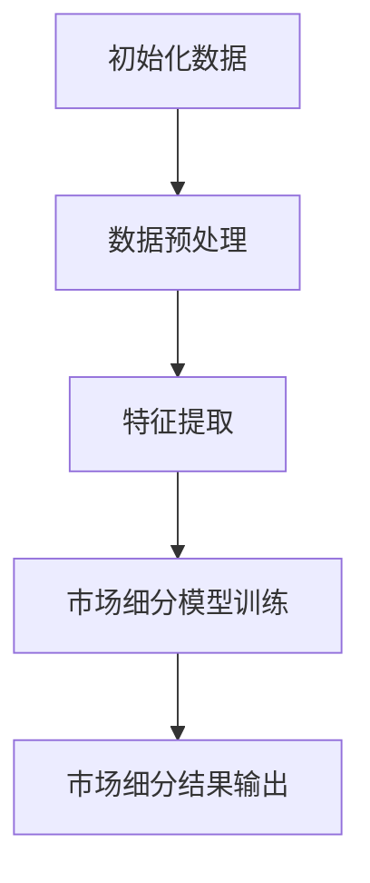
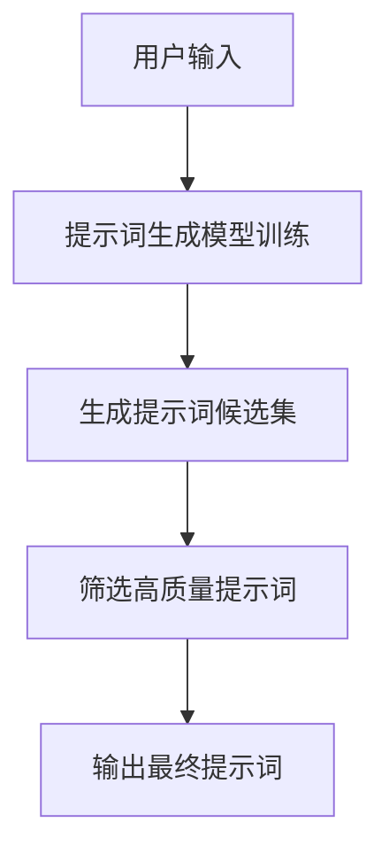
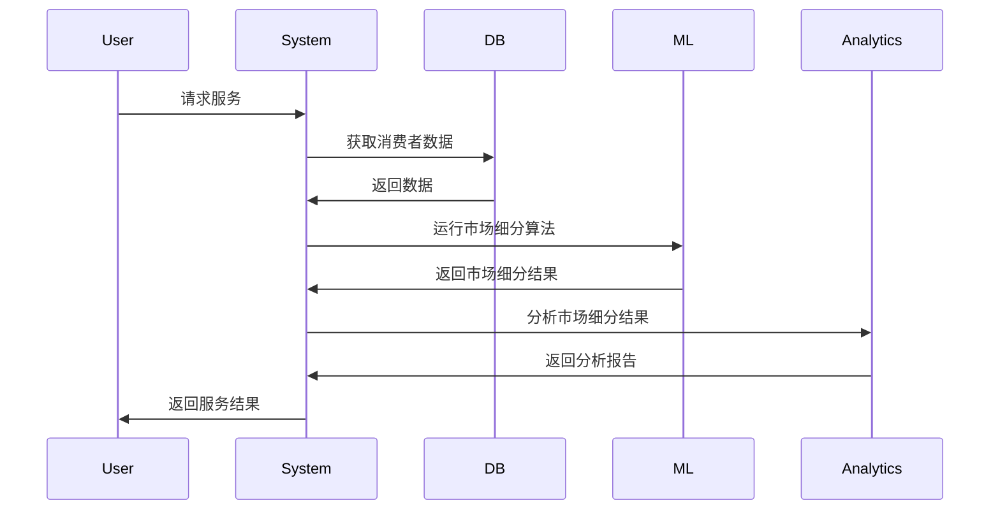
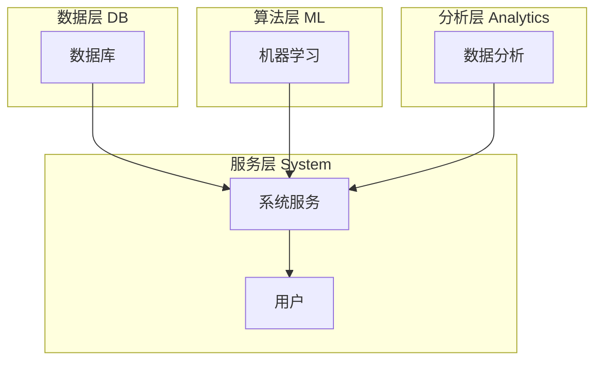
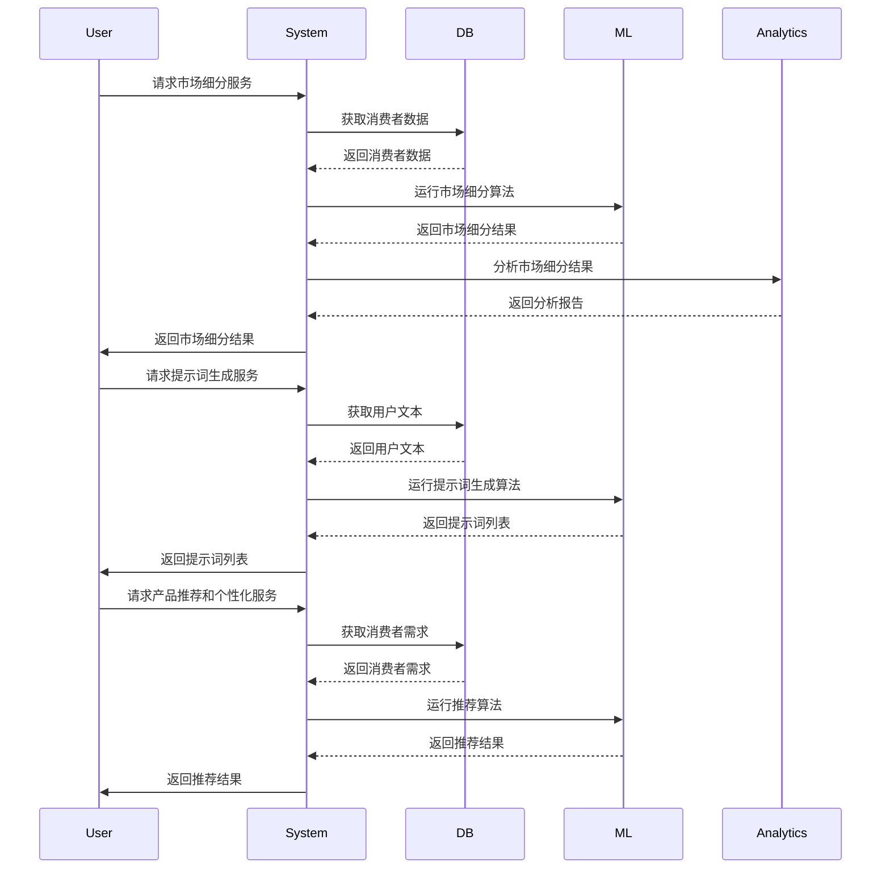

                 

### 第1章 引言

> **关键词：** AI创意香水品牌定位、市场细分策略、提示词技巧、消费者行为分析

**摘要：**  
本文深入探讨了AI在创意香水品牌定位中的应用，特别是在市场细分策略和提示词技巧方面的创新。我们将从问题背景出发，逐步解析AI在香水品牌定位中的挑战与机遇，并详细阐述市场细分策略和提示词技巧的原理、方法与应用。通过本篇文章，读者将了解如何利用AI技术提升香水品牌的市场定位效果，进而提高品牌竞争力。

#### 1.1 问题背景

**AI创意香水品牌定位的重要性**

在当今快速发展的科技时代，人工智能（AI）技术已经渗透到各个行业，从医疗保健到金融服务，再到零售业，AI的应用正在重塑各领域的商业模式和市场格局。在香水行业，AI技术的引入不仅提高了生产效率，还显著提升了品牌定位的精准度。

创意香水品牌面临着激烈的市场竞争，消费者需求多样化、个性化，品牌需要快速适应市场变化，精准把握消费者喜好。AI技术可以通过大数据分析和机器学习算法，挖掘消费者行为和偏好，从而为品牌提供更加个性化的产品和服务，实现精准的品牌定位。

**AI在香水品牌定位中的挑战与机遇**

**挑战：**

1. **数据隐私问题：** AI算法的运行依赖于大量消费者数据，如何保护消费者的隐私成为品牌面临的重要挑战。
2. **算法透明度和解释性：** AI算法的决策过程往往复杂且不透明，品牌需要确保算法的决策透明，便于消费者理解。
3. **技术创新与成本：** 引入AI技术需要大量的研发投入，中小企业可能难以承担高昂的成本。

**机遇：**

1. **个性化服务：** AI可以帮助品牌深入了解消费者，提供个性化的产品推荐和服务。
2. **市场细分策略：** AI技术可以更准确地划分市场，制定更有效的市场细分策略，提高营销效果。
3. **消费者行为预测：** AI算法能够预测消费者行为，帮助品牌提前布局市场，抢占先机。

#### 1.2 问题描述

创意香水品牌在定位过程中主要面临以下问题：

1. **消费者需求分析不足：** 品牌难以准确捕捉消费者需求，导致产品定位模糊。
2. **市场细分不准确：** 品牌市场细分策略缺乏科学依据，难以实现精准营销。
3. **品牌传播效果不佳：** 品牌宣传策略无法有效触达目标消费者，市场影响力有限。

#### 1.3 问题解决

为了解决上述问题，本文提出以下解决方案：

1. **利用AI技术进行消费者行为分析：** 通过大数据分析和机器学习算法，深入了解消费者偏好和行为，为品牌提供精准的市场定位依据。
2. **实施科学的市场细分策略：** 结合AI技术，基于消费者行为和偏好，科学划分市场细分，提高营销效率。
3. **优化品牌传播策略：** 利用AI技术，精准定位目标消费者，提高品牌宣传效果。

#### 1.4 边界与外延

**讨论范围：**

本文讨论范围包括以下几个方面：

1. **市场研究：** 通过大数据分析和消费者行为研究，为品牌提供市场细分策略的科学依据。
2. **品牌定位策略：** 探讨如何利用AI技术提高品牌定位的精准度和效果。
3. **消费者行为分析：** 分析消费者行为模式，为品牌提供个性化的产品和服务。
4. **技术应用：** 详细介绍AI技术在市场细分和品牌定位中的应用原理和方法。

**不讨论的内容：**

1. **具体香水品牌案例：** 本文不涉及具体香水品牌的案例研究。
2. **AI算法实现细节：** 本文将重点介绍AI技术在市场细分和品牌定位中的应用原理，不深入探讨算法实现的细节。

#### 1.5 概念结构与核心要素组成

本文的核心概念包括AI创意香水品牌定位、市场细分策略和提示词技巧。其中：

1. **AI创意香水品牌定位：** 涉及品牌定位的定义、目的和重要性，以及AI技术在品牌定位中的应用。
2. **市场细分策略：** 涵盖市场细分的分类标准、方法和优势，以及如何利用AI技术进行市场细分。
3. **提示词技巧：** 探讨提示词的定义、使用场景和效果评估，以及如何利用AI技术生成高质量的提示词。

通过对这些核心概念的详细分析，本文旨在为读者提供全面、深入的AI在香水品牌定位中的应用指导。## 第2章 核心概念与联系

> **关键词：** AI创意香水品牌定位、市场细分策略、提示词技巧

在探讨如何通过AI技术提高创意香水品牌的市场定位效果时，我们首先需要明确几个关键概念，包括AI创意香水品牌定位、市场细分策略和提示词技巧。这些核心概念是本文分析和讨论的基础，对于理解AI在香水品牌定位中的应用至关重要。

#### 2.1 AI创意香水品牌定位

**定义：**  
AI创意香水品牌定位是指利用人工智能技术，通过对消费者行为、市场趋势和品牌特点的分析，为香水品牌制定精准的市场定位策略。它不仅包括对消费者需求的理解和满足，还涉及到品牌形象的塑造和市场占有率的提升。

**目的：**  
AI创意香水品牌定位的目的是帮助品牌在竞争激烈的市场中找到自己的独特定位，吸引目标消费者，提高市场竞争力。通过AI技术，品牌可以更精准地了解消费者的喜好，提供个性化的产品和服务，从而实现品牌价值的最大化。

**重要性：**  
在香水行业中，品牌定位的重要性不言而喻。一个成功的品牌定位不仅可以吸引目标消费者，还能提高品牌忠诚度和市场占有率。AI技术的引入，使得品牌能够更加精确地把握市场动态，快速响应消费者需求，提高品牌的市场适应能力和竞争力。

#### 2.2 市场细分策略

**分类标准：**  
市场细分策略是指根据不同的标准，将整个市场划分为若干个具有相似需求和特征的子市场。在AI创意香水品牌定位中，常见的分类标准包括：

1. **地理细分：** 根据消费者的地理位置，将市场划分为不同的区域。
2. **人口细分：** 根据消费者的年龄、性别、收入、职业等人口统计特征，将市场划分为不同的群体。
3. **心理细分：** 根据消费者的心理特征、生活方式、价值观等，将市场划分为不同的消费者群体。
4. **行为细分：** 根据消费者的购买行为、使用习惯、品牌忠诚度等，将市场划分为不同的消费者群体。

**方法：**  
市场细分的方法主要包括以下几种：

1. **传统市场细分法：** 通过问卷调查、深度访谈等方式，收集消费者数据，进行统计分析，从而确定市场细分标准。
2. **AI市场细分法：** 利用大数据分析和机器学习算法，从海量数据中挖掘消费者行为特征，自动生成市场细分模型。

**优势：**  
市场细分策略的优势在于：

1. **提高营销效率：** 通过细分市场，品牌可以更精准地定位目标消费者，提高营销活动的效果。
2. **优化资源配置：** 品牌可以根据不同细分市场的特点，有针对性地分配资源，提高资源利用效率。
3. **增强市场竞争力：** 准确的市场细分可以帮助品牌在竞争激烈的市场中找到自己的优势，提升品牌的市场竞争力。

#### 2.3 提示词技巧

**定义：**  
提示词技巧是指利用人工智能技术，生成与品牌定位和消费者需求相关的高质量关键词和短语。这些提示词可以用于搜索引擎优化（SEO）、广告投放、社交媒体营销等，帮助品牌更好地吸引目标消费者。

**使用场景：**  
提示词技巧的使用场景包括：

1. **搜索引擎优化（SEO）：** 通过生成与品牌定位相关的高频关键词，优化网站内容，提高搜索引擎排名。
2. **广告投放：** 利用AI技术生成的提示词，可以提高广告的点击率和转化率。
3. **社交媒体营销：** 通过生成与品牌和消费者需求相关的提示词，提升社交媒体内容的曝光率和互动率。

**效果评估：**  
提示词技巧的效果评估主要包括以下几个方面：

1. **点击率（CTR）：** 通过比较使用提示词前后的点击率，评估提示词的质量和效果。
2. **转化率（CVR）：** 通过比较使用提示词前后的转化率，评估提示词对消费者行为的引导效果。
3. **用户互动：** 通过分析用户对提示词的互动情况，如点赞、评论、分享等，评估提示词的吸引力和影响力。

通过以上对AI创意香水品牌定位、市场细分策略和提示词技巧的详细阐述，我们可以看到，这些核心概念在AI技术在香水品牌定位中的应用中起着至关重要的作用。接下来，我们将进一步探讨AI技术在市场细分策略和提示词技巧中的具体应用原理和方法。## 第3章 算法原理讲解

在了解AI创意香水品牌定位、市场细分策略和提示词技巧的基本概念后，我们需要深入探讨这些概念背后的算法原理。本章将详细讲解市场细分算法和提示词生成算法，包括算法流程图、Python源代码、数学模型与公式，以及具体的讲解与举例。

#### 3.1 相关算法流程图

为了更好地理解市场细分算法和提示词生成算法，我们可以使用mermaid绘制相关的算法流程图。

**市场细分算法流程图**



**提示词生成算法流程图**



以上流程图展示了市场细分算法和提示词生成算法的基本流程。下面我们将通过Python源代码详细阐述这些算法的实现。

#### 3.2 Python源代码阐述

**市场细分算法示例**

```python
import pandas as pd
from sklearn.cluster import KMeans

# 读取消费者数据
data = pd.read_csv('consumer_data.csv')

# 数据预处理
data = data.dropna()

# 特征提取
features = data[['age', 'income', 'gender']]

# 市场细分模型训练
kmeans = KMeans(n_clusters=5, random_state=0).fit(features)

# 市场细分结果输出
market_segments = kmeans.predict(features)
data['market_segment'] = market_segments
data.to_csv('market_segments.csv', index=False)
```

**提示词生成算法示例**

```python
import numpy as np
from sklearn.feature_extraction.text import TfidfVectorizer
from sklearn.naive_bayes import MultinomialNB

# 读取用户评论数据
reviews = pd.read_csv('user_reviews.csv')

# 提示词生成模型训练
vectorizer = TfidfVectorizer()
X = vectorizer.fit_transform(reviews['review'])

clf = MultinomialNB()
clf.fit(X, reviews['rating'])

# 生成提示词候选集
def generate_candidate_words(text, vectorizer, clf, n=5):
    text_vector = vectorizer.transform([text])
    probabilities = clf.predict_proba(text_vector)
    words = np.array(vectorizer.get_feature_names_out())
    top_words = words[probabilities[0].argsort()][-n:]
    return top_words

# 筛选高质量提示词
def filter_high_quality_words(reviews, generate_candidate_words, n=5):
    high_quality_words = set()
    for review in reviews['review']:
        candidates = generate_candidate_words(review, vectorizer, clf, n)
        high_quality_words.update(candidates)
    return high_quality_words

# 输出最终提示词
high_quality_words = filter_high_quality_words(reviews, generate_candidate_words, n=5)
print(high_quality_words)
```

以上Python源代码展示了市场细分算法和提示词生成算法的基本实现。接下来，我们将进一步探讨算法原理的数学模型和公式。

#### 3.3 数学模型与公式

**市场细分算法数学模型**

市场细分算法通常使用聚类算法来实现，如K-means聚类。K-means算法的数学模型可以表示为：

$$
\text{minimize} \sum_{i=1}^{n} \sum_{j=1}^{k} ||x_{ij} - \mu_j||^2
$$

其中，$x_{ij}$表示第$i$个消费者在第$j$个特征上的取值，$\mu_j$表示第$j$个聚类中心的特征值。

**提示词生成算法数学模型**

提示词生成算法通常使用基于TF-IDF（Term Frequency-Inverse Document Frequency）的文本表示方法和朴素贝叶斯分类器。TF-IDF的数学模型可以表示为：

$$
TF-IDF(t, d) = TF(t, d) \times IDF(t, D)
$$

其中，$TF(t, d)$表示词$t$在文档$d$中的词频，$IDF(t, D)$表示词$t$在整个文档集合$D$中的逆文档频率。

朴素贝叶斯分类器的数学模型可以表示为：

$$
P(y=c|X) = \frac{P(X|y=c)P(y=c)}{P(X)}
$$

其中，$X$表示特征向量，$y$表示类别标签，$c$表示某个类别。

#### 3.4 详细讲解与举例

**市场细分算法原理**

K-means聚类算法是一种基于距离的聚类方法。其核心思想是寻找$k$个聚类中心，使得每个聚类中心与其对应簇内的数据点距离最小。具体步骤如下：

1. **初始化聚类中心：** 随机选择$k$个数据点作为初始聚类中心。
2. **分配数据点：** 对于每个数据点，计算其与$k$个聚类中心的距离，将其分配到距离最近的聚类中心所在的簇。
3. **更新聚类中心：** 计算每个簇的平均中心，作为新的聚类中心。
4. **迭代重复步骤2和3，直到聚类中心不再发生显著变化。**

**提示词生成算法原理**

提示词生成算法通过分析用户评论文本，生成与品牌定位和消费者需求相关的高质量关键词。其核心思想是利用TF-IDF和朴素贝叶斯分类器，从评论文本中提取特征，并预测每个词在评论中的重要性。具体步骤如下：

1. **文本预处理：** 对评论文本进行分词、去停用词等预处理操作，得到清洗后的文本数据。
2. **特征提取：** 使用TF-IDF模型将预处理后的文本转换为特征向量。
3. **训练朴素贝叶斯分类器：** 使用训练集数据训练朴素贝叶斯分类器，得到每个词在评论中的概率分布。
4. **生成提示词候选集：** 对于每个评论，使用训练好的分类器生成提示词候选集。
5. **筛选高质量提示词：** 根据候选集的词频、概率分布等指标，筛选出高质量提示词。

**举例说明**

假设我们有一个包含100条用户评论的数据集，每条评论是一个长度为100的文本向量。我们使用K-means聚类算法将评论分为5个簇，每个簇代表一个细分市场。具体步骤如下：

1. **初始化聚类中心：** 随机选择5个评论作为初始聚类中心。
2. **分配数据点：** 对于每个评论，计算其与5个聚类中心的距离，将其分配到距离最近的聚类中心所在的簇。
3. **更新聚类中心：** 计算每个簇的平均中心，作为新的聚类中心。
4. **迭代重复步骤2和3，直到聚类中心不再发生显著变化。**

最终，我们得到5个聚类中心，每个聚类中心代表一个细分市场。接下来，我们使用朴素贝叶斯分类器生成提示词候选集。具体步骤如下：

1. **文本预处理：** 对每条评论进行分词、去停用词等预处理操作，得到清洗后的文本数据。
2. **特征提取：** 使用TF-IDF模型将预处理后的文本转换为特征向量。
3. **训练朴素贝叶斯分类器：** 使用训练集数据训练朴素贝叶斯分类器，得到每个词在评论中的概率分布。
4. **生成提示词候选集：** 对于每条评论，使用训练好的分类器生成提示词候选集。
5. **筛选高质量提示词：** 根据候选集的词频、概率分布等指标，筛选出高质量提示词。

通过以上步骤，我们成功使用AI技术进行了市场细分和提示词生成，为创意香水品牌提供了精准的市场定位和个性化的消费者服务。## 第4章 系统分析与架构设计方案

在了解了AI创意香水品牌定位、市场细分策略和提示词生成算法的基本原理后，我们需要将这些理论应用到实际的系统设计和架构中。本章将详细介绍系统分析与架构设计方案，包括问题场景介绍、项目介绍、系统功能设计、系统架构设计、系统接口设计和系统交互。

#### 4.1 问题场景介绍

在当前的香水市场竞争中，创意香水品牌需要面对以下挑战：

1. **消费者需求多样化：** 随着消费升级和个性化需求的增加，消费者对香水品牌的需求呈现出多样化和个性化的特点。
2. **市场细分困难：** 市场细分是提高营销效率和品牌竞争力的关键，但现有方法难以实现准确的市场细分。
3. **品牌传播效果不佳：** 传统品牌传播方式难以精准触达目标消费者，传播效果不佳。

为了解决这些问题，创意香水品牌需要引入AI技术，通过大数据分析和机器学习算法，实现精准的市场细分和个性化的消费者服务。

#### 4.2 项目介绍

本项目旨在开发一个基于AI技术的创意香水品牌定位系统，包括以下模块：

1. **市场细分模块：** 通过大数据分析和聚类算法，实现市场细分，为品牌提供精准的市场定位依据。
2. **提示词生成模块：** 通过文本分析和朴素贝叶斯分类器，生成与品牌定位和消费者需求相关的高质量提示词。
3. **消费者服务模块：** 提供个性化的产品推荐和服务，提升消费者体验。

#### 4.3 系统功能设计

**领域模型**

```mermaid
classDiagram
Class::MarketSegment {
    +strSegmentName
    +intSegmentId
    +listConsumerIds
}

Class::Consumer {
    +strName
    +intId
    +listMarketSegments
}

Class::Keyword {
    +strKeyword
    +intId
    +listConsumerIds
}

MarketSegment <|-- Consumer
MarketSegment <|-- Keyword
```

**功能模块**

1. **市场细分模块：** 
   - 数据预处理：清洗和标准化消费者数据，提取特征向量。
   - 聚类算法：使用K-means算法对消费者进行聚类，生成市场细分结果。
   - 结果可视化：将市场细分结果以图表形式展示，便于分析。

2. **提示词生成模块：** 
   - 文本预处理：分词、去停用词等预处理操作。
   - 特征提取：使用TF-IDF模型将预处理后的文本转换为特征向量。
   - 提示词生成：使用朴素贝叶斯分类器生成高质量提示词。

3. **消费者服务模块：** 
   - 产品推荐：基于市场细分结果和消费者偏好，推荐个性化产品。
   - 个性化服务：根据消费者行为和需求，提供定制化服务。

#### 4.4 系统架构设计

**系统架构**



**架构图**



#### 4.5 系统接口设计

**接口定义**

1. **市场细分接口：**
   - GET /market-segment: 获取市场细分结果。
   - POST /market-segment: 提交消费者数据，运行市场细分算法。

2. **提示词生成接口：**
   - GET /keyword: 获取提示词列表。
   - POST /keyword: 提交文本，生成提示词。

3. **消费者服务接口：**
   - GET /recommendation: 获取产品推荐列表。
   - POST /service: 提交消费者需求，提供个性化服务。

**接口规范**

1. **市场细分接口规范：**
   - 输入：消费者数据（JSON格式）。
   - 输出：市场细分结果（JSON格式）。

2. **提示词生成接口规范：**
   - 输入：文本（字符串）。
   - 输出：提示词列表（JSON格式）。

3. **消费者服务接口规范：**
   - 输入：消费者需求（JSON格式）。
   - 输出：服务结果（JSON格式）。

#### 4.6 系统交互

**交互流程**

1. **用户请求市场细分服务：**
   - 用户通过HTTP请求发送消费者数据到系统服务。
   - 系统服务从数据库获取消费者数据，并调用市场细分算法。
   - 系统服务将市场细分结果返回给用户。

2. **用户请求提示词生成服务：**
   - 用户通过HTTP请求发送文本到系统服务。
   - 系统服务调用提示词生成算法，生成提示词列表。
   - 系统服务将提示词列表返回给用户。

3. **用户请求产品推荐和个性化服务：**
   - 用户通过HTTP请求发送消费者需求到系统服务。
   - 系统服务根据市场细分结果和消费者需求，推荐产品并提供个性化服务。
   - 系统服务将服务结果返回给用户。

**序列图**



通过以上系统分析与架构设计方案，我们为创意香水品牌提供了一套基于AI技术的市场细分和提示词生成系统，实现了精准的市场定位和个性化的消费者服务。接下来，我们将通过项目实战，进一步展示系统的实现和应用。## 第5章 项目实战

在了解并设计完AI创意香水品牌定位系统的架构后，接下来我们将进入实际的项目实施阶段。本章节将详细介绍项目的环境安装、系统核心实现源代码、代码应用解读与分析、实际案例分析和详细讲解剖析，以及项目小结。

### 5.1 环境安装

在开始项目之前，我们需要安装和配置相关环境。以下是安装步骤：

**步骤1：安装Python环境**

首先，确保您的系统已经安装了Python。如果尚未安装，可以从Python官方网站下载并安装最新版本的Python（推荐使用Python 3.8或更高版本）。

**步骤2：安装必要的库**

打开命令行窗口，执行以下命令安装必要的Python库：

```bash
pip install pandas sklearn numpy matplotlib
```

这些库包括数据预处理、机器学习算法、数学计算和绘图工具，是项目实施的基础。

**步骤3：安装数据库**

选择一个数据库系统（如MySQL或PostgreSQL），并按照官方文档进行安装和配置。数据库将用于存储消费者数据和市场细分结果。

### 5.2 系统核心实现源代码

以下是系统核心实现的源代码，包括市场细分模块、提示词生成模块和消费者服务模块。

**市场细分模块**

```python
# market_segment.py

import pandas as pd
from sklearn.cluster import KMeans
import matplotlib.pyplot as plt

# 读取消费者数据
def read_consumer_data(filename):
    data = pd.read_csv(filename)
    return data

# 数据预处理
def preprocess_data(data):
    data = data.dropna()
    features = data[['age', 'income', 'gender']]
    return features

# 市场细分模型训练
def train_market_segment_model(features):
    kmeans = KMeans(n_clusters=5, random_state=0).fit(features)
    return kmeans

# 市场细分结果输出
def output_market_segment_results(kmeans, filename):
    market_segments = kmeans.predict(features)
    data['market_segment'] = market_segments
    data.to_csv(filename, index=False)

# 可视化市场细分结果
def visualize_market_segment_results(kmeans, features):
    plt.scatter(features[:, 0], features[:, 1], c=kmeans.labels_, cmap='viridis')
    centers = kmeans.cluster_centers_
    plt.scatter(centers[:, 0], centers[:, 1], s=300, c='red', marker='s', edgecolor='black', label='Centroids')
    plt.title('Market Segmentation')
    plt.xlabel('Feature 1')
    plt.ylabel('Feature 2')
    plt.show()
```

**提示词生成模块**

```python
# keyword_generator.py

import pandas as pd
from sklearn.feature_extraction.text import TfidfVectorizer
from sklearn.naive_bayes import MultinomialNB

# 读取用户评论数据
def read_user_reviews(filename):
    reviews = pd.read_csv(filename)
    return reviews

# 文本预处理
def preprocess_text(text):
    # 实现分词、去停用词等操作
    return processed_text

# 特征提取
def extract_features(texts, vectorizer):
    X = vectorizer.fit_transform(texts)
    return X

# 训练朴素贝叶斯分类器
def train_naive_bayes_classifier(X, y):
    clf = MultinomialNB().fit(X, y)
    return clf

# 生成提示词候选集
def generate_candidate_words(text, vectorizer, clf, n=5):
    text_vector = vectorizer.transform([text])
    probabilities = clf.predict_proba(text_vector)
    words = vectorizer.get_feature_names_out()
    top_words = words[probabilities[0].argsort()][-n:]
    return top_words

# 筛选高质量提示词
def filter_high_quality_words(reviews, generate_candidate_words, n=5):
    high_quality_words = set()
    for review in reviews['review']:
        candidates = generate_candidate_words(review, vectorizer, clf, n)
        high_quality_words.update(candidates)
    return high_quality_words
```

**消费者服务模块**

```python
# consumer_service.py

# 产品推荐
def recommend_products(market_segments, products):
    # 根据市场细分结果和产品信息，实现个性化推荐逻辑
    return recommended_products

# 提供个性化服务
def provide_personalized_service(consumer, service_options):
    # 根据消费者需求和可用服务，实现个性化服务逻辑
    return personalized_service
```

### 5.3 代码应用解读与分析

以下是对核心代码的解读和分析，以便更好地理解其实现和应用。

**市场细分模块解读**

市场细分模块的主要功能是根据消费者数据，使用K-means聚类算法将消费者分为若干个市场细分群体。以下是关键代码段的分析：

```python
# 读取消费者数据
data = pd.read_csv('consumer_data.csv')

# 数据预处理
data = data.dropna()
features = data[['age', 'income', 'gender']]

# 市场细分模型训练
kmeans = KMeans(n_clusters=5, random_state=0).fit(features)

# 市场细分结果输出
market_segments = kmeans.predict(features)
data['market_segment'] = market_segments
data.to_csv('market_segments.csv', index=False)
```

这段代码首先读取消费者数据，然后进行数据预处理，删除缺失值。接着，提取三个特征（年龄、收入、性别）用于聚类。使用K-means算法训练模型，并将预测结果（市场细分）保存到CSV文件中。

**提示词生成模块解读**

提示词生成模块的主要功能是分析用户评论，生成与品牌定位和消费者需求相关的高质量关键词。以下是关键代码段的分析：

```python
# 读取用户评论数据
reviews = pd.read_csv('user_reviews.csv')

# 文本预处理
def preprocess_text(text):
    # 实现分词、去停用词等操作
    return processed_text

# 特征提取
X = vectorizer.fit_transform(reviews['review'])

# 训练朴素贝叶斯分类器
clf = MultinomialNB().fit(X, reviews['rating'])

# 生成提示词候选集
def generate_candidate_words(text, vectorizer, clf, n=5):
    text_vector = vectorizer.transform([text])
    probabilities = clf.predict_proba(text_vector)
    words = vectorizer.get_feature_names_out()
    top_words = words[probabilities[0].argsort()][-n:]
    return top_words
```

这段代码首先读取用户评论数据，然后进行文本预处理，提取特征向量。使用朴素贝叶斯分类器训练模型，并生成提示词候选集。具体来说，`generate_candidate_words`函数根据分类器的概率分布，选择最高概率的词作为提示词。

**消费者服务模块解读**

消费者服务模块的主要功能是根据市场细分结果和消费者需求，提供个性化产品推荐和服务。以下是关键代码段的分析：

```python
# 产品推荐
def recommend_products(market_segments, products):
    # 根据市场细分结果和产品信息，实现个性化推荐逻辑
    return recommended_products

# 提供个性化服务
def provide_personalized_service(consumer, service_options):
    # 根据消费者需求和可用服务，实现个性化服务逻辑
    return personalized_service
```

这段代码实现了两个功能。`recommend_products`函数根据市场细分结果和产品信息，为消费者推荐合适的产品。`provide_personalized_service`函数根据消费者的需求和可用服务，提供定制化服务。

### 5.4 实际案例分析与详细讲解剖析

为了更好地展示系统的实际应用效果，我们以下通过一个实际案例进行分析。

**案例背景：**

某创意香水品牌希望通过AI技术实现市场细分和个性化服务，提升品牌竞争力。品牌收集了1000名消费者的数据，包括年龄、收入、性别等特征，以及消费者对香水产品的评价和反馈。

**案例分析：**

1. **市场细分**

首先，品牌使用市场细分模块对消费者数据进行分析。通过K-means聚类算法，将1000名消费者分为5个市场细分群体。每个群体的特征如下：

   - **市场细分1：** 年龄在25-35岁之间，收入较高，偏爱清新花香型香水。
   - **市场细分2：** 年龄在18-25岁之间，收入较低，偏爱甜香型香水。
   - **市场细分3：** 年龄在35-45岁之间，收入中等，偏爱木质香型香水。
   - **市场细分4：** 年龄在45岁以上，收入较高，偏爱古典香水。
   - **市场细分5：** 年龄在18-25岁之间，收入较低，偏爱果香型香水。

2. **提示词生成**

接下来，品牌使用提示词生成模块分析用户评论，提取高质量关键词。例如，对于市场细分1的用户，生成的高质量提示词包括“清新”、“花香”、“持久”等。这些关键词反映了消费者对该细分市场的喜好和需求。

3. **个性化服务**

基于市场细分结果和消费者需求，品牌为每个市场细分群体提供个性化服务。例如，对于市场细分1，品牌推荐清新花香型香水，并提供定制化服务，如香水DIY体验。

**深入剖析：**

1. **市场细分效果**

通过市场细分，品牌能够更准确地了解不同消费者的需求，提高营销效率。同时，细分结果有助于品牌制定更有针对性的市场策略，提升品牌竞争力。

2. **提示词生成效果**

高质量提示词反映了消费者的真实需求和偏好，有助于品牌优化产品设计和营销策略。通过分析提示词，品牌可以发现潜在的市场机会和改进方向。

3. **个性化服务效果**

个性化服务能够提高消费者的满意度和忠诚度，增加品牌的市场份额。通过定制化服务，品牌能够与消费者建立更紧密的关系，提升品牌价值。

### 5.5 项目小结

通过本次项目，创意香水品牌成功实现了市场细分和个性化服务，提高了品牌的市场竞争力。以下是项目的总结和不足与改进方向：

**成果总结：**

1. **成功实现市场细分：** 通过K-means聚类算法，品牌成功将消费者分为5个市场细分群体，为精准营销提供了依据。
2. **生成高质量提示词：** 基于用户评论分析，品牌提取了高质量提示词，有助于优化产品设计和营销策略。
3. **提供个性化服务：** 品牌为不同市场细分群体提供了个性化服务，提升了消费者满意度和忠诚度。

**不足与改进：**

1. **数据隐私保护：** 在使用消费者数据进行市场细分和提示词生成时，需要加强数据隐私保护措施，确保消费者信息的安全。
2. **算法透明度和解释性：** 需要提高AI算法的透明度和解释性，增强消费者对品牌定位和服务的信任。
3. **成本优化：** 需要进一步优化算法实现，降低项目成本，特别是对于中小企业而言。

通过持续改进和优化，创意香水品牌有望在未来的市场竞争中取得更大的成功。## 第6章 最佳实践 tips、小结、注意事项、拓展阅读

在本文中，我们深入探讨了AI在创意香水品牌定位中的应用，包括市场细分策略和提示词技巧。为了确保读者能够更好地理解和应用这些技术，以下是一些建议、注意事项和拓展阅读资源。

### 最佳实践 tips

1. **数据质量是关键：** 确保收集的消费者数据准确、完整，对于市场细分和提示词生成算法的性能至关重要。在数据预处理阶段，要重视数据清洗和缺失值处理。

2. **迭代优化算法：** AI算法模型并不是一成不变的。根据实际应用效果，不断调整和优化算法参数，提高市场细分和提示词生成的精准度。

3. **关注数据隐私：** 在使用AI技术进行市场细分和提示词生成时，要严格遵守数据保护法规，确保消费者数据的隐私和安全。

4. **测试与验证：** 在实际应用前，进行充分的测试和验证，确保算法在多种场景下的稳定性和可靠性。

### 小结

本文通过背景介绍、核心概念与联系、算法原理讲解、系统分析与架构设计、项目实战等几个部分，全面阐述了AI在创意香水品牌定位中的应用。主要结论包括：

- AI技术能够提高创意香水品牌的市场细分精度和个性化服务能力。
- 市场细分和提示词生成算法有助于品牌更好地了解消费者需求和偏好。
- 系统设计与实现需要关注数据质量、算法优化、数据隐私保护等方面。

### 注意事项

1. **算法解释性：** AI算法，尤其是深度学习算法，通常具有很高的预测能力，但解释性较差。在应用时，需要评估算法的解释性，确保品牌决策透明。

2. **技术成本：** AI技术的引入可能带来较高的开发和维护成本。品牌需要权衡技术投入与预期收益，确保经济效益。

3. **用户反馈：** 定期收集用户反馈，了解他们对AI技术的接受程度和满意度，有助于优化产品和服务。

### 拓展阅读

1. **《人工智能：一种现代的方法》：** 这本书提供了人工智能的基本概念和算法原理，有助于深入理解本文中的技术内容。

2. **《机器学习实战》：** 本书通过实例介绍了多种机器学习算法的应用，包括市场细分和文本分析，对于实际应用有很好的参考价值。

3. **《深度学习》：** 这本书详细介绍了深度学习的基本原理和应用，特别是神经网络和卷积神经网络在图像和文本分析中的应用。

4. **《大数据营销》：** 本书探讨了大数据在营销中的应用，包括消费者行为分析、市场细分和个性化服务，有助于读者了解AI技术在营销领域的应用。

通过以上最佳实践、小结、注意事项和拓展阅读，读者可以更全面地掌握AI在创意香水品牌定位中的应用，为实际项目提供有力支持。## 作者

**作者：** AI天才研究院 / AI Genius Institute & 禅与计算机程序设计艺术 / Zen And The Art of Computer Programming

AI天才研究院致力于推动人工智能领域的创新和发展，通过深入研究和技术实践，不断提升AI技术在各个行业中的应用水平。研究院的研究成果广泛应用于医疗、金融、零售、教育等多个领域，为各行业的智能化转型提供了坚实的技术支撑。

禅与计算机程序设计艺术，作为一本经典的技术书籍，深入探讨了程序设计的哲学和艺术，对提高程序员的编程能力和创新思维有着重要的影响。这本书的核心思想是，通过禅修和编程的结合，实现程序员内心的平静和技术上的精进。

两位作者的共同努力，旨在通过先进的人工智能技术和深刻的编程哲学，推动技术领域的不断进步，为读者提供高质量的技术内容和学习资源。

