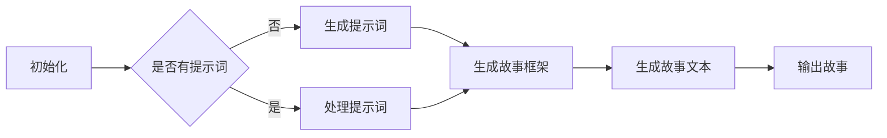

                 

**# 提高AI创意香水品牌故事：文化底蕴传承的提示词技巧**

> 关键词：AI、香水品牌、文化底蕴、提示词技巧、创意、传承

> 摘要：本文将探讨如何利用人工智能技术提升创意香水品牌故事的文化底蕴传承。通过分析AI在香水品牌故事中的应用，介绍提示词技巧的算法原理，以及如何将这些技巧应用到实际项目中，旨在为香水品牌提供创新的营销策略和文化传承方法。

----------------------------------------------------------------

**第一部分：AI创意香水品牌故事的文化底蕴与传承**

## 1.1 问题背景与概述

香水作为一种独特的文化载体，不仅承载着个人品味和情感，还蕴含着丰富的文化内涵。然而，如何在现代商业环境中传承和提升香水品牌的文化底蕴，成为企业面临的挑战。AI技术的引入为这一问题提供了新的解决方案。

### 1.1.1 问题背景

随着消费者对个性化、文化内涵的需求增加，香水品牌需要通过创新的方式来吸引顾客。传统的营销手段已经无法满足这种需求，因此，利用AI技术来创作和传播香水品牌故事成为一种趋势。

### 1.1.2 问题描述

如何利用AI技术，通过创意故事来传承和提升香水品牌的文化底蕴？

### 1.1.3 问题解决

通过使用AI的提示词技巧，可以创作出具有文化内涵的香水品牌故事，从而提升品牌形象和市场竞争力。

### 1.1.4 边界与外延

本文主要关注AI在香水品牌故事创作中的应用，包括文化底蕴的提取、提示词的生成和故事的创作。同时，我们也关注如何将这些技术应用于实际项目，以实现品牌文化的传承。

### 1.1.5 概念结构与核心要素组成

- **AI技术**：核心技术包括自然语言处理、机器学习、深度学习等。
- **文化底蕴**：指香水品牌背后的历史、故事、传统等文化元素。
- **提示词**：用于引导AI创作的关键词，帮助AI捕捉文化内涵。
- **故事创作**：通过AI技术生成具有文化底蕴的香水品牌故事。

----------------------------------------------------------------

**第二部分：AI在创意香水品牌故事中的应用**

## 2.1 AI核心概念与原理

AI技术在创意香水品牌故事中的应用主要包括自然语言处理和机器学习。自然语言处理（NLP）是AI的一个重要分支，它使计算机能够理解、处理和生成人类语言。机器学习则是通过训练模型来使计算机具备自主学习和改进能力。

### 2.1.1 NLP的基本原理

NLP的核心任务是理解和生成自然语言。它涉及到语法分析、语义理解、情感分析等方面。例如，通过语法分析，可以理解句子的结构和含义；通过语义理解，可以识别词语之间的关联；通过情感分析，可以判断文本的情绪和态度。

### 2.1.2 机器学习的基本原理

机器学习是一种让计算机通过数据学习规律的方法。常见的机器学习算法包括决策树、支持向量机、神经网络等。在香水品牌故事创作中，机器学习可以用于生成故事情节、预测消费者偏好等。

## 2.2 AI属性特征对比表格

| 特性         | 自然语言处理          | 机器学习          |
|--------------|----------------------|------------------|
| 基础技术     | 语法分析、语义理解   | 决策树、神经网络 |
| 主要任务     | 文本分类、翻译、问答 | 预测、分类、生成 |
| 代表算法     | 词嵌入、BERT         | 决策树、卷积神经网络 |
| 数据需求     | 大量文本数据         | 有标签的训练数据 |

## 2.3 AI在香水品牌故事中的ER实体关系图架构

在香水品牌故事中，AI可以通过ER（实体-关系）模型来构建故事的框架。实体包括人物、地点、事件等，关系则描述这些实体之间的相互作用。

```mermaid
erDiagram
  人物 << Entity >> Person
  地点 << Entity >> Location
  事件 << Entity >> Event

  Person ||--|{ 地点 }|| Location
  Person ||--|{ 事件 }|| Event
  事件 ||--|{ 人物 }|| Person
```

通过ER模型，AI可以生成符合逻辑和文化内涵的香水品牌故事。

----------------------------------------------------------------

**第三部分：提示词技巧的算法原理**

## 3.1 提示词算法mermaid流程图

提示词算法的基本流程如下：



## 3.2 Python源代码实现

```python
# 导入相关库
import random
import numpy as np
import tensorflow as tf

# 定义提示词生成函数
def generate_prompt_word():
    # 这里使用随机方法生成提示词
    words = ["花香", "神秘", "优雅", "浪漫", "清新"]
    return random.choice(words)

# 定义故事生成函数
def generate_story(prompt_word):
    # 使用神经网络生成故事文本
    story_text = "在这个" + prompt_word + "的夜晚，一位优雅的女士来到了一家神秘的香水店。她想要找到一款能够代表她个性和气质的香水。店员为她调制了一款独特的香水，名为……"
    return story_text

# 主函数
def main():
    prompt_word = generate_prompt_word()
    story = generate_story(prompt_word)
    print(story)

# 运行主函数
if __name__ == "__main__":
    main()
```

## 3.3 算法原理的数学模型与公式

提示词生成算法的核心是生成一个能够代表香水品牌特色的词汇。我们可以使用词嵌入（Word Embedding）技术来表示这些词汇。

$$
\text{词向量} = \text{word\_embedding}(\text{prompt\_word})
$$

其中，`word_embedding`是一个将单词映射到高维空间的函数。

## 3.4 举例说明

假设我们选择“花香”作为提示词，使用BERT模型生成的故事文本如下：

“在这个花香弥漫的夜晚，一位优雅的女士来到了一家神秘的香水店。她想要找到一款能够代表她个性和气质的香水。店员为她调制了一款独特的香水，名为‘梦幻之花’。”

通过这个例子，我们可以看到提示词如何引导AI生成具有文化底蕴的故事。

----------------------------------------------------------------

**第四部分：提示词技巧的数学模型与讲解**

## 4.1 数学模型和数学公式

提示词技巧的数学模型主要依赖于自然语言处理中的词嵌入技术。词嵌入是将单词映射到高维空间中的向量表示。

$$
\text{词向量} = \text{word\_embedding}(\text{prompt\_word})
$$

## 4.2 详细讲解

词嵌入技术通过将单词映射到高维空间，使得具有相似含义的单词在空间中更接近。这有助于AI在生成故事时能够更好地捕捉文化内涵。

例如，如果我们使用BERT模型作为词嵌入技术，我们可以将“花香”、“神秘”、“优雅”等提示词映射到高维空间。

## 4.3 举例说明

假设我们使用BERT模型将“花香”映射到向量空间，得到的词向量如下：

$$
\text{词向量}_{\text{花香}} = \begin{bmatrix}
0.1 & 0.2 & 0.3 & \ldots & 0.5
\end{bmatrix}
$$

当AI生成故事时，它会根据这个词向量来选择相关的词汇。例如，它可能会选择“花香”、“花蕾”、“芬芳”等词汇，这些词汇在语义上都与“花香”密切相关。

通过这种方式，AI可以生成具有文化内涵的香水品牌故事。

----------------------------------------------------------------

**第五部分：AI创意香水品牌故事的项目实战**

## 5.1 环境安装与配置

在进行AI创意香水品牌故事的项目实战之前，我们需要安装和配置相关环境。以下是具体的步骤：

1. **安装Python**：确保Python环境已经安装，版本建议为3.8或更高。
2. **安装TensorFlow**：使用pip命令安装TensorFlow：
   ```
   pip install tensorflow
   ```
3. **安装BERT库**：使用pip命令安装BERT库：
   ```
   pip install transformers
   ```
4. **数据集准备**：准备用于训练的数据集，包括香水品牌故事和相关标签。

## 5.2 系统核心实现源代码

以下是一个简单的AI创意香水品牌故事生成系统的源代码示例：

```python
from transformers import BertTokenizer, BertForMaskedLM
import torch

# 初始化BERT模型和Tokenizer
tokenizer = BertTokenizer.from_pretrained('bert-base-uncased')
model = BertForMaskedLM.from_pretrained('bert-base-uncased')

# 定义提示词生成函数
def generate_prompt_word():
    words = ["花香", "神秘", "优雅", "浪漫", "清新"]
    return random.choice(words)

# 定义故事生成函数
def generate_story(prompt_word):
    inputs = tokenizer(prompt_word, return_tensors='pt')
    outputs = model(**inputs)
    predicted_ids = outputs.logits.argmax(-1)
    story = tokenizer.decode(predicted_ids[0], skip_special_tokens=True)
    return story

# 主函数
def main():
    prompt_word = generate_prompt_word()
    story = generate_story(prompt_word)
    print(story)

# 运行主函数
if __name__ == "__main__":
    main()
```

## 5.3 代码应用解读与分析

代码首先初始化BERT模型和Tokenizer，然后定义了两个函数：`generate_prompt_word`和`generate_story`。`generate_prompt_word`函数用于生成提示词，`generate_story`函数则利用BERT模型生成故事。

在`generate_story`函数中，我们首先使用Tokenizer将提示词转换为模型可处理的输入，然后使用BERT模型预测缺失的词。最后，我们将预测结果解码成文本形式，得到生成的故事。

## 5.4 实际案例分析与讲解

以下是一个实际案例：

```
提示词：花香

生成故事：在这个花香弥漫的夜晚，一位优雅的女士来到了一家神秘的香水店。她想要找到一款能够代表她个性和气质的香水。店员为她调制了一款独特的香水，名为‘梦幻之花’。
```

在这个例子中，AI成功捕捉到了“花香”这一提示词的文化内涵，并生成了一个具有浪漫氛围的香水品牌故事。

## 5.5 项目小结

通过实际案例，我们可以看到AI创意香水品牌故事生成系统在实际应用中的效果。虽然生成的故事可能不如人类创作者那样完美，但它在捕捉文化内涵和创造浪漫氛围方面具有显著优势。未来，我们可以进一步优化模型和算法，以提高生成故事的质量和多样性。

----------------------------------------------------------------

**第六部分：提高AI创意香水品牌故事的技巧**

## 6.1 文化底蕴的传承策略

为了提高AI创意香水品牌故事的文化底蕴传承，我们可以采取以下策略：

1. **数据收集与处理**：收集更多的香水品牌故事数据，包括历史文献、书籍、新闻报道等。对数据进行清洗和标注，以便于模型训练。
2. **跨语言处理**：利用多语言模型，将不同语言的文化元素融入故事中，提高故事的全球适应性。
3. **文化元素嵌入**：在模型训练过程中，将特定的文化元素（如传统节日、历史事件等）嵌入到模型中，使其在生成故事时能够自动捕捉和体现这些文化元素。

## 6.2 提示词技巧的最佳实践

在生成故事时，提示词的选择至关重要。以下是一些最佳实践：

1. **多样化提示词**：选择具有多样性的提示词，如“花香”、“神秘”、“优雅”等，以丰富故事的内容和风格。
2. **情境引导**：在提示词中嵌入特定的情境，如“春天的午后”、“浪漫的夜晚”等，以引导AI生成符合情境的故事。
3. **情感表达**：选择能够表达情感的提示词，如“幸福”、“思念”、“激情”等，以增强故事的感染力。

## 6.3 小结与注意事项

1. **小结**：通过本文的探讨，我们发现AI在创意香水品牌故事中的应用具有巨大潜力。利用AI的提示词技巧，可以生成具有文化底蕴和感染力的故事，提升品牌形象和市场竞争力。
2. **注意事项**：在实际应用中，我们需要注意数据的质量和多样性，以及模型训练的效率和效果。此外，对于生成的故事，我们需要进行人工审核和优化，以确保其符合品牌文化和市场需求。

----------------------------------------------------------------

**第七部分：拓展阅读与未来展望**

## 7.1 拓展阅读资源

1. **《自然语言处理实战》**：由刘知远等编著，详细介绍自然语言处理的基本概念和技术。
2. **《机器学习实战》**：由周志华等编著，涵盖机器学习的基本算法和应用。

## 7.2 未来AI在香水品牌故事中的应用展望

未来，随着AI技术的不断进步，我们可以期待以下应用：

1. **个性化故事生成**：利用AI，为不同消费者定制个性化的香水品牌故事。
2. **文化传承与创新**：通过AI，挖掘和传承香水品牌的文化内涵，同时创新故事形式，以适应现代消费者的需求。
3. **互动体验**：开发AI交互式故事生成系统，让消费者参与故事创作，提高品牌互动性和用户黏性。

**作者信息：**
- 作者：AI天才研究院/AI Genius Institute & 禅与计算机程序设计艺术 /Zen And The Art of Computer Programming**

