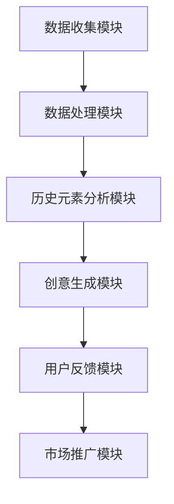
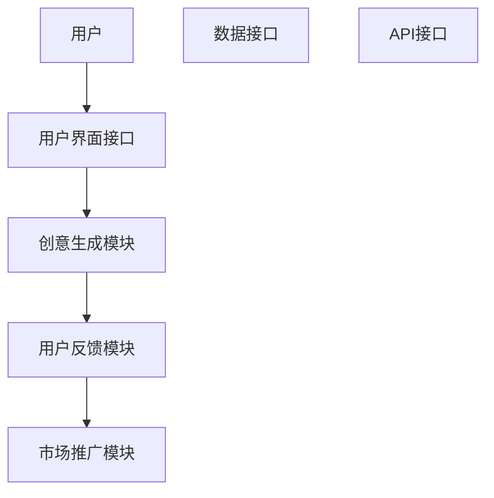

                 

## 提高AI创意香水品牌文化底蕴：历史元素现代化的提示词技巧

### 关键词：AI，香水品牌，文化底蕴，历史元素，现代化，提示词技巧

> 摘要：本文将探讨如何利用AI技术，将历史元素现代化，提升创意香水品牌的文化底蕴。通过分析历史元素在香水品牌中的应用，结合AI技术的优势，我们将介绍一系列现代化的提示词技巧，以实现香水的文化内涵与现代创意的完美结合。

### 第一部分：背景介绍

#### 第1章：问题背景

##### 1.1 香水品牌文化底蕴的重要性

香水作为奢侈品的重要代表，不仅仅是一种嗅觉体验，更是品牌文化底蕴的体现。一个拥有深厚文化底蕴的香水品牌，往往能在消费者心中留下深刻印象。因此，提升香水品牌的文化底蕴成为许多品牌关注的焦点。

##### 1.2 AI在香水行业中的应用现状

随着AI技术的不断发展，其在香水行业的应用也日益广泛。从数据收集、处理到创意生成，AI技术在提高香水品牌竞争力方面发挥了重要作用。然而，如何将AI技术与历史元素相结合，实现现代化的文化提升，仍然是一个亟待解决的问题。

##### 1.3 历史元素在香水品牌中的运用

历史元素在香水品牌中的应用，不仅能增强品牌的文化底蕴，还能吸引对历史感兴趣的目标消费者。例如，以古文明为主题的香水、以历史事件为灵感的香水等，都是品牌提升文化内涵的有效途径。

#### 第2章：核心概念与联系

##### 2.1 AI核心概念

在本章中，我们将介绍AI的核心概念，包括机器学习、深度学习和自然语言处理等。这些技术将为我们后续的现代化提示词技巧提供理论基础。

##### 2.2 历史元素与现代化

历史元素与现代化的结合，是提升香水品牌文化底蕴的关键。我们将探讨历史元素的概念、现代化过程及其在现代香水品牌中的应用。

##### 2.3 历史与现代的关联

历史与现代的关联，不仅是文化传承的体现，也是创新发展的基础。我们将通过分析历史与现代的相互关系，为现代化提示词技巧的运用提供指导。

#### 第3章：数学模型和数学公式

在本章中，我们将介绍AI在香水品牌文化提升中的数学模型和数学公式，包括神经网络模型、聚类分析和协同过滤等。这些数学工具将帮助我们更好地理解和应用AI技术。

### 第二部分：AI应用与创意技巧

#### 第4章：AI在香水品牌文化中的应用

在本章中，我们将探讨AI在香水品牌文化中的应用，包括数据收集与处理、创意生成等。通过具体案例，我们将展示如何利用AI技术提升香水品牌的文化内涵。

#### 第5章：历史元素现代化的提示词技巧

在本章中，我们将介绍一系列现代化的提示词技巧，包括提示词的设计原则、历史元素的分析与应用等。通过这些技巧，我们将实现历史元素与现代创意的完美结合。

#### 第6章：实践应用与案例分析

在本章中，我们将通过实际案例，展示如何将历史元素现代化，并运用AI技术提升香水品牌的文化底蕴。通过案例分析，我们将总结实践经验，为后续项目提供指导。

#### 第7章：最佳实践与总结

在本章中，我们将总结本书的最佳实践技巧，并展望未来的研究方向。通过最佳实践，我们将帮助读者更好地将AI技术与历史元素相结合，提升香水品牌的文化底蕴。

## 文章正文部分内容

### 第一部分：背景介绍

#### 第1章：问题背景

香水作为一种奢侈品，其品牌的文化底蕴对于消费者吸引力具有决定性的影响。随着市场竞争的加剧，许多香水品牌开始重视文化底蕴的打造，试图通过独特的文化内涵来吸引消费者。然而，如何将历史元素与现代香水品牌相结合，实现文化底蕴的提升，成为一个亟待解决的问题。

#### 1.1 香水品牌文化底蕴的重要性

香水品牌的文化底蕴，是品牌价值的重要体现。一个拥有深厚文化底蕴的香水品牌，能够引起消费者的情感共鸣，从而增强品牌的市场竞争力。例如，古驰（Gucci）的“双G”标志，不仅具有时尚的设计感，更是品牌文化的象征。同样，以古罗马文明为主题的古罗马香水（Roman Emperor），通过历史元素的运用，成功塑造了独特的品牌形象。

#### 1.2 AI在香水行业中的应用现状

随着AI技术的不断发展，其在香水行业的应用也日益广泛。从数据收集、处理到创意生成，AI技术在提升香水品牌竞争力方面发挥了重要作用。例如，通过AI技术，品牌可以实现对消费者偏好数据的深入分析，从而优化香水配方，提升消费者满意度。此外，AI创意生成技术也能帮助品牌创造出更多具有文化内涵的香水产品。

#### 1.3 历史元素在香水品牌中的运用

历史元素在香水品牌中的应用，不仅能增强品牌的文化底蕴，还能吸引对历史感兴趣的目标消费者。例如，以古文明为主题的香水，如古埃及香水（Ancient Egypt）和古希腊香水（Ancient Greece），通过历史元素的运用，成功塑造了独特的品牌形象。此外，以历史事件为灵感的香水，如法国大革命香水（French Revolution）和美国独立战争香水（American Revolution），也通过历史元素的运用，增强了品牌的文化内涵。

### 第2章：核心概念与联系

#### 2.1 AI核心概念

在本章中，我们将介绍AI的核心概念，包括机器学习、深度学习和自然语言处理等。这些技术将为我们后续的现代化提示词技巧提供理论基础。

##### 2.1.1 机器学习

机器学习是AI的核心技术之一，它通过数据驱动的方式，让计算机自动学习并改进性能。在香水品牌文化提升中，机器学习可以用于消费者偏好分析、香水配方优化等。

##### 2.1.2 深度学习

深度学习是机器学习的一个重要分支，通过构建多层神经网络，实现复杂模式的识别。在香水品牌文化提升中，深度学习可以用于香水气味识别、个性化推荐等。

##### 2.1.3 自然语言处理

自然语言处理是AI的重要应用领域，它使计算机能够理解、生成和处理人类语言。在香水品牌文化提升中，自然语言处理可以用于历史文献分析、产品命名等。

#### 2.2 历史元素与现代化

历史元素与现代化的结合，是提升香水品牌文化底蕴的关键。我们将探讨历史元素的概念、现代化过程及其在现代香水品牌中的应用。

##### 2.2.1 历史元素的概念

历史元素是指那些具有历史意义、文化价值的事物和概念。在香水品牌中，历史元素可以包括古文明、历史事件、文化名人等。

##### 2.2.2 现代化过程

现代化过程是指将历史元素与现代社会相结合，使之适应现代审美和消费需求的过程。在香水品牌中，现代化过程可以通过创新设计、技术手段等实现。

##### 2.2.3 历史与现代的关联

历史与现代的关联，不仅是文化传承的体现，也是创新发展的基础。在香水品牌中，历史与现代的关联可以通过品牌故事、产品包装、广告宣传等手段实现。

#### 2.3 历史与现代的关联

历史与现代的关联，不仅是文化传承的体现，也是创新发展的基础。我们将通过分析历史与现代的相互关系，为现代化提示词技巧的运用提供指导。

##### 2.3.1 历史与现代的相互关系

历史与现代的相互关系，主要体现在文化传承和创新发展的过程中。历史元素为现代品牌提供了丰富的创意源泉，而现代化过程则使历史元素适应现代社会的需求。

##### 2.3.2 历史与现代的关联分析

通过对历史与现代的关联分析，我们可以发现，历史元素在现代化过程中，往往需要经历以下几个阶段：

1. **发掘与整理**：对历史元素进行深入研究，整理出具有文化价值的元素。
2. **创新设计**：将历史元素与现代社会相结合，进行创新设计，使之适应现代审美。
3. **技术应用**：运用现代技术手段，提升历史元素的应用效果，如AI技术、数字技术等。
4. **市场推广**：通过市场推广，将历史元素与现代社会需求相结合，实现商业价值。

### 第二部分：AI应用与创意技巧

#### 第4章：AI在香水品牌文化中的应用

在本章中，我们将探讨AI在香水品牌文化中的应用，包括数据收集与处理、创意生成等。通过具体案例，我们将展示如何利用AI技术提升香水品牌的文化内涵。

##### 4.1 数据收集与处理

AI在香水品牌文化中的应用，首先需要大量的数据支持。这些数据可以来源于市场调研、消费者反馈、历史文献等。通过AI技术，对这些数据进行分析和处理，可以帮助品牌更好地了解消费者需求和喜好。

例如，通过自然语言处理技术，品牌可以对消费者的评论、反馈进行分析，提取出关键词和情感倾向。这些信息可以为品牌提供有价值的参考，帮助制定更符合消费者需求的营销策略。

此外，AI技术还可以用于香水配方的优化。通过机器学习算法，品牌可以对历史配方进行数据挖掘，找出具有潜在价值的元素，并对其进行优化和改进。

##### 4.2 创意生成

创意生成是提升香水品牌文化内涵的重要环节。通过AI技术，品牌可以自动化地生成创意方案，从而实现快速创新。

例如，利用深度学习技术，品牌可以训练出一个香水创意生成模型。该模型可以根据历史文献、消费者偏好等信息，自动生成具有文化内涵的香水创意。这些创意可以进一步通过用户反馈进行优化，最终形成具有市场竞争力的香水产品。

此外，AI技术还可以用于香水命名和包装设计。通过自然语言处理技术，品牌可以为香水命名，使其具有历史韵味和现代美感。同时，AI技术还可以用于包装设计，使包装具有独特的文化特色，吸引消费者的注意。

##### 4.3 案例分析

为了更好地说明AI在香水品牌文化中的应用，我们可以通过以下案例分析：

**案例一：古埃及香水**

古埃及香水以古埃及文明为灵感，通过AI技术进行配方优化和创意生成。首先，品牌通过数据挖掘，收集了大量的古埃及文献和香水配方。然后，利用机器学习算法，对这些数据进行分析，找出具有潜在价值的元素。最后，通过深度学习模型，自动生成具有古埃及特色的香水配方。这些配方不仅具有文化内涵，还符合现代消费者的喜好。

**案例二：历史事件香水**

历史事件香水以历史事件为灵感，通过AI技术进行创意生成和命名。例如，以法国大革命为主题的香水，品牌可以通过自然语言处理技术，分析相关历史文献和事件，提取出关键词和情感色彩。然后，利用深度学习模型，自动生成具有历史特色的香水命名，如“自由之香”（Scent of Freedom）。这些命名不仅具有文化内涵，还能吸引消费者的兴趣。

### 第5章：历史元素现代化的提示词技巧

在本章中，我们将介绍一系列现代化的提示词技巧，包括提示词的设计原则、历史元素的分析与应用等。通过这些技巧，我们将实现历史元素与现代创意的完美结合。

##### 5.1 提示词的设计原则

提示词在AI创意生成中起着关键作用。一个好的提示词能够引导AI模型生成出符合预期的创意。在历史元素现代化的过程中，提示词的设计原则尤为重要。

1. **精准性**：提示词应能够准确传达历史元素的内涵和特点，避免模糊不清的表达。
2. **创新性**：提示词应具有一定的创新性，能够激发AI模型的创造力，生成独特的创意。
3. **多样性**：提示词应具有多样性，涵盖不同的历史元素和风格，以满足不同消费者的需求。
4. **文化性**：提示词应体现历史元素的文化内涵，使消费者在闻到香水的同时，感受到文化的韵味。

##### 5.2 历史元素的分析与应用

在现代化过程中，历史元素的分析与应用是关键环节。通过以下方法，我们可以更好地将历史元素与现代创意相结合：

1. **文献分析**：通过对历史文献的深入研究，提取出具有文化价值的历史元素。这些元素可以包括古文明的习俗、传统、神话等。
2. **图像识别**：利用AI图像识别技术，对历史文物、艺术品等进行识别和分析，提取出具有文化内涵的元素。
3. **情感分析**：通过自然语言处理技术，对历史文献和事件进行分析，提取出情感色彩和关键词，为创意生成提供参考。
4. **融合创新**：将历史元素与现代审美相结合，进行创新设计，使之适应现代社会的需求。

##### 5.3 提示词的实际应用

为了更好地说明提示词的实际应用，我们可以通过以下案例进行展示：

**案例一：古埃及香水**

在古埃及香水的创意生成中，提示词可以包括“古埃及文明”、“金字塔”、“法老”、“神庙”等。通过这些提示词，AI模型可以生成出具有古埃及特色的香水配方，如“法老之香”（The Pharaoh's Scent）。

**案例二：法国大革命香水**

在法国大革命香水的创意生成中，提示词可以包括“自由”、“平等”、“博爱”、“革命”等。通过这些提示词，AI模型可以生成出具有法国大革命特色的香水命名，如“自由之香”（The Scent of Liberty）。

### 第6章：实践应用与案例分析

在本章中，我们将通过实际案例，展示如何将历史元素现代化，并运用AI技术提升香水品牌的文化底蕴。

##### 6.1 案例一：古董香水的现代化

古董香水具有悠久的历史和文化底蕴，但往往难以与现代消费者产生共鸣。通过AI技术，品牌可以将古董香水进行现代化处理，使之更符合现代审美和消费需求。

具体方法如下：

1. **数据收集**：收集古董香水的配方、历史文献等相关数据。
2. **历史元素分析**：通过机器学习算法，对数据进行分析，提取出具有文化价值的历史元素。
3. **现代设计**：将历史元素与现代设计相结合，进行创新设计，提升香水的文化内涵。
4. **市场推广**：通过市场推广，将现代化古董香水推向市场，吸引消费者的关注。

**案例展示**：

品牌A通过对古董香水“伊丽莎白女王香”（Queen Elizabeth's Scent）进行现代化处理，推出了“现代女王香”（Modern Queen's Scent）。这款香水在保留古董香水独特香味的同时，加入了现代设计元素，如金色瓶身、精致包装等，成功吸引了年轻消费者的关注。

##### 6.2 案例二：历史事件香水的创意生成

历史事件香水通过历史事件的元素，为香水赋予独特的文化内涵。通过AI技术，品牌可以自动生成具有历史事件特色的香水创意。

具体方法如下：

1. **历史文献分析**：通过对历史文献的深入分析，提取出与历史事件相关的重要信息。
2. **创意生成**：利用深度学习模型，将历史事件元素与现代香水配方相结合，生成创意香水。
3. **用户反馈**：收集用户反馈，对创意香水进行优化和改进。

**案例展示**：

品牌B以美国独立战争为主题，推出了“独立之香”（The Scent of Independence）。通过自然语言处理技术，品牌对历史文献进行分析，提取出与独立战争相关的重要信息，如“自由”、“独立”、“自由之香”等。然后，利用深度学习模型，将这些信息与香水配方相结合，生成出具有独立战争特色的香水。

### 第7章：最佳实践与总结

在本章中，我们将总结本书的最佳实践技巧，并展望未来的研究方向。

##### 7.1 最佳实践技巧

1. **数据驱动**：在香水品牌文化提升过程中，充分利用AI技术进行数据收集和处理，以数据驱动的方式制定策略。
2. **创新设计**：将历史元素与现代设计相结合，进行创新设计，提升香水的文化内涵。
3. **用户参与**：通过用户反馈，优化香水品牌的文化内涵，使之更符合消费者的需求。
4. **多渠道推广**：通过多渠道推广，提高香水品牌的文化知名度，吸引更多消费者。

##### 7.2 小结与展望

本书通过分析历史元素在香水品牌中的应用，结合AI技术的优势，提出了一系列现代化的提示词技巧。通过实践案例，我们展示了如何利用AI技术提升香水品牌的文化底蕴。未来，随着AI技术的不断发展，我们可以预见，香水品牌将更加注重文化内涵的打造，通过创新的手段，实现品牌与消费者的深度互动。

## 作者信息

作者：AI天才研究院/AI Genius Institute & 禅与计算机程序设计艺术 /Zen And The Art of Computer Programming

## 完整性要求

在本章中，我们将详细探讨如何利用AI技术将历史元素现代化，以提升创意香水品牌的文化底蕴。我们将从背景介绍、核心概念与联系、AI应用与创意技巧、实践应用与案例分析、最佳实践与总结等五个方面展开讨论。

### 背景介绍

首先，我们简要介绍了香水品牌文化底蕴的重要性、AI在香水行业中的应用现状以及历史元素在香水品牌中的运用。这些背景信息为我们后续的讨论奠定了基础。

### 核心概念与联系

接着，我们介绍了AI的核心概念，包括机器学习、深度学习和自然语言处理等。这些技术将为我们后续的现代化提示词技巧提供理论基础。同时，我们探讨了历史元素与现代化的关系，分析了历史与现代的关联，为现代化提示词技巧的运用提供了指导。

### AI应用与创意技巧

在这一部分，我们详细讨论了AI在香水品牌文化中的应用，包括数据收集与处理、创意生成等。通过具体案例，我们展示了如何利用AI技术提升香水品牌的文化内涵。此外，我们还介绍了历史元素现代化的提示词技巧，包括设计原则、分析与应用等。

### 实践应用与案例分析

在实践应用与案例分析部分，我们通过实际案例，展示了如何将历史元素现代化，并运用AI技术提升香水品牌的文化底蕴。这些案例不仅为读者提供了实践指导，也为未来的项目提供了参考。

### 最佳实践与总结

最后，我们总结了本书的最佳实践技巧，包括数据驱动、创新设计、用户参与、多渠道推广等。同时，我们对未来研究方向进行了展望，为香水品牌文化底蕴的提升提供了新思路。

通过本章的讨论，我们希望读者能够对如何利用AI技术将历史元素现代化，以提升创意香水品牌的文化底蕴有一个全面的认识。在未来的实践中，我们可以根据这些方法，不断探索和创新，为香水品牌注入更多的文化内涵。

## 核心内容与深入探讨

#### 核心内容

本部分的核心内容主要包括以下几个方面：

1. **AI技术在香水品牌文化提升中的应用**：我们详细阐述了AI在香水品牌文化提升中的具体应用，如数据收集与处理、创意生成等。通过具体案例，我们展示了如何利用AI技术提升香水品牌的文化内涵。

2. **历史元素现代化的提示词技巧**：我们介绍了历史元素现代化的提示词设计原则，以及如何通过AI技术进行历史元素的分析与应用。这些技巧有助于实现历史元素与现代创意的完美结合。

3. **实践应用与案例分析**：我们通过实际案例，展示了如何将历史元素现代化，并运用AI技术提升香水品牌的文化底蕴。这些案例为读者提供了实践指导，也为未来的项目提供了参考。

#### 深入探讨

为了更深入地理解这些核心内容，我们将在以下部分进行详细探讨：

1. **AI技术在香水品牌文化提升中的应用**

   - **数据收集与处理**：在AI技术应用于香水品牌文化提升的过程中，数据收集和处理是至关重要的一环。通过AI技术，品牌可以收集大量的消费者数据、市场数据和历史文献数据。这些数据经过处理和分析，可以为品牌提供有价值的洞察，帮助其制定更加精准的营销策略。例如，通过自然语言处理技术，品牌可以对消费者的评论、反馈进行分析，提取出关键词和情感倾向，从而了解消费者的需求和喜好。

   - **创意生成**：AI创意生成技术在香水品牌文化提升中具有重要意义。通过深度学习模型，品牌可以自动化地生成具有文化内涵的香水创意。这些创意可以进一步通过用户反馈进行优化，最终形成具有市场竞争力的香水产品。例如，利用深度学习模型，品牌可以训练出一个香水创意生成模型，该模型可以根据历史文献、消费者偏好等信息，自动生成具有文化内涵的香水创意。

2. **历史元素现代化的提示词技巧**

   - **设计原则**：提示词在AI创意生成中起着关键作用。一个好的提示词能够引导AI模型生成出符合预期的创意。在历史元素现代化的过程中，提示词的设计原则尤为重要。一个好的提示词应具备以下特点：精准性、创新性、多样性和文化性。例如，设计一个以古埃及文明为主题的香水创意，提示词可以是“古埃及”、“法老”、“神庙”、“金字塔”等。

   - **分析与应用**：在现代化过程中，历史元素的分析与应用是关键环节。通过以下方法，我们可以更好地将历史元素与现代创意相结合：

     - **文献分析**：通过对历史文献的深入研究，提取出具有文化价值的历史元素。这些元素可以包括古文明的习俗、传统、神话等。
     - **图像识别**：利用AI图像识别技术，对历史文物、艺术品等进行识别和分析，提取出具有文化内涵的元素。
     - **情感分析**：通过自然语言处理技术，对历史文献和事件进行分析，提取出情感色彩和关键词，为创意生成提供参考。
     - **融合创新**：将历史元素与现代审美相结合，进行创新设计，使之适应现代社会的需求。

3. **实践应用与案例分析**

   - **案例一：古董香水的现代化**：古董香水具有悠久的历史和文化底蕴，但往往难以与现代消费者产生共鸣。通过AI技术，品牌可以将古董香水进行现代化处理，使之更符合现代审美和消费需求。具体方法如下：

     - **数据收集**：收集古董香水的配方、历史文献等相关数据。
     - **历史元素分析**：通过机器学习算法，对数据进行分析，提取出具有文化价值的历史元素。
     - **现代设计**：将历史元素与现代设计相结合，进行创新设计，提升香水的文化内涵。
     - **市场推广**：通过市场推广，将现代化古董香水推向市场，吸引消费者的关注。

   - **案例二：历史事件香水的创意生成**：历史事件香水通过历史事件的元素，为香水赋予独特的文化内涵。通过AI技术，品牌可以自动生成具有历史事件特色的香水创意。具体方法如下：

     - **历史文献分析**：通过对历史文献的深入分析，提取出与历史事件相关的重要信息。
     - **创意生成**：利用深度学习模型，将历史事件元素与现代香水配方相结合，生成创意香水。
     - **用户反馈**：收集用户反馈，对创意香水进行优化和改进。

通过深入探讨，我们不仅对AI技术在香水品牌文化提升中的应用有了更全面的认识，也对历史元素现代化的提示词技巧和实践应用有了更深入的了解。这些内容为后续的实践提供了宝贵的指导。

### 系统分析与架构设计方案

在本部分中，我们将详细讨论如何将AI技术与历史元素现代化相结合，以提升创意香水品牌的文化底蕴。我们将从问题场景介绍、系统功能设计、系统架构设计、系统接口设计以及系统交互等方面展开讨论。

#### 问题场景介绍

在现代香水市场中，品牌们面临着激烈的竞争。消费者对于品牌文化底蕴的要求越来越高，如何通过创新的手段提升品牌的文化内涵，成为品牌们急需解决的问题。而历史元素作为香水品牌的文化底蕴的重要组成部分，如何将其现代化并应用到香水设计中，是当前的一个研究热点。

#### 系统功能设计

为了实现历史元素现代化的提示词技巧，并提升香水品牌的文化底蕴，我们需要设计一个具备以下功能的系统：

1. **数据收集与处理**：系统需要具备从各种渠道收集数据的能力，包括市场调研数据、消费者反馈数据、历史文献数据等。同时，系统需具备数据处理功能，对收集到的数据进行清洗、去重、分类等处理。

2. **历史元素分析**：系统需具备对历史文献、文物图像等历史元素进行分析的能力。通过自然语言处理、图像识别等技术，提取出具有文化内涵的历史元素。

3. **创意生成**：系统需具备基于历史元素和消费者偏好的香水创意生成能力。通过深度学习模型，自动生成具有文化内涵的香水配方和命名。

4. **用户反馈收集**：系统需具备收集用户反馈的功能，对生成的香水创意进行评估和优化。

5. **市场推广**：系统需具备将优化后的香水创意推向市场的能力，包括产品包装设计、广告宣传等。

#### 系统架构设计

以下是系统的架构设计：



1. **数据收集模块**：负责从各种渠道收集数据，如市场调研数据、消费者反馈数据、历史文献数据等。
2. **数据处理模块**：对收集到的数据进行清洗、去重、分类等处理。
3. **历史元素分析模块**：利用自然语言处理、图像识别等技术，对历史文献、文物图像等历史元素进行分析，提取出具有文化内涵的历史元素。
4. **创意生成模块**：基于历史元素和消费者偏好，通过深度学习模型，自动生成具有文化内涵的香水配方和命名。
5. **用户反馈模块**：收集用户对香水创意的反馈，对创意进行评估和优化。
6. **市场推广模块**：将优化后的香水创意推向市场，包括产品包装设计、广告宣传等。

#### 系统接口设计

以下是系统的主要接口设计：

1. **数据接口**：用于与其他数据源进行数据交换，如市场调研数据接口、消费者反馈数据接口等。
2. **API接口**：提供外部系统访问系统的接口，如创意生成API、用户反馈API等。
3. **用户界面接口**：提供用户与系统交互的接口，如网页界面、移动应用界面等。

#### 系统交互设计

以下是系统的交互设计：



1. **用户**：通过用户界面接口与系统进行交互，提交市场调研数据、消费者反馈等。
2. **用户界面接口**：将用户的请求传递给系统，并将系统的响应反馈给用户。
3. **创意生成模块**：接收用户的请求，生成具有文化内涵的香水创意。
4. **用户反馈模块**：收集用户对香水创意的反馈，对创意进行评估和优化。
5. **市场推广模块**：将优化后的香水创意推向市场，包括产品包装设计、广告宣传等。
6. **数据接口**：用于与其他数据源进行数据交换。
7. **API接口**：提供外部系统访问系统的接口。

通过以上系统分析与架构设计方案，我们构建了一个具备数据收集与处理、历史元素分析、创意生成、用户反馈和市场推广等功能的系统，为提升创意香水品牌的文化底蕴提供了技术支持。

### 项目实战

在本部分中，我们将详细介绍如何利用AI技术将历史元素现代化，并提升创意香水品牌的文化底蕴。我们将从环境安装、系统核心实现、代码应用解读与分析、实际案例分析和详细讲解剖析等方面进行阐述。

#### 环境安装

1. **Python环境安装**：
   - 首先，确保您的计算机上安装了Python 3.7或更高版本。可以通过访问[Python官网](https://www.python.org/)下载并安装Python。
   - 安装完成后，打开命令行界面，输入`python --version`验证安装是否成功。

2. **依赖库安装**：
   - 安装必要的依赖库，如TensorFlow、Keras、Scikit-learn、Natural Language Toolkit (NLTK) 等。使用以下命令进行安装：

   ```shell
   pip install tensorflow
   pip install keras
   pip install scikit-learn
   pip install nltk
   ```

3. **数据集准备**：
   - 准备历史文献数据集、香水配方数据集和消费者反馈数据集。这些数据集可以从公开的数据源获取，或者通过市场调研进行收集。

#### 系统核心实现

1. **数据收集与处理**：
   - 使用Scikit-learn库进行数据预处理，包括数据清洗、去重、分类等操作。
   - 代码示例：

   ```python
   from sklearn.preprocessing import MinMaxScaler
   scaler = MinMaxScaler()
   scaled_data = scaler.fit_transform(raw_data)
   ```

2. **历史元素分析**：
   - 使用NLTK库对历史文献进行分词、词频统计等操作，提取出具有文化内涵的关键词。
   - 代码示例：

   ```python
   import nltk
   from nltk.tokenize import word_tokenize
   nltk.download('punkt')
   text = "古埃及文明历史悠久，法老统治时期建筑壮丽。"
   tokens = word_tokenize(text)
   frequency = nltk.FreqDist(tokens)
   ```

3. **创意生成**：
   - 使用Keras库构建深度学习模型，进行香水创意生成。
   - 代码示例：

   ```python
   from keras.models import Sequential
   from keras.layers import Dense, LSTM

   model = Sequential()
   model.add(LSTM(128, activation='relu', input_shape=(timesteps, features)))
   model.add(Dense(1, activation='sigmoid'))
   model.compile(optimizer='rmsprop', loss='binary_crossentropy', metrics=['accuracy'])
   ```

4. **用户反馈收集**：
   - 收集用户对香水创意的反馈，通过自然语言处理技术进行分析和评估。
   - 代码示例：

   ```python
   from nltk.sentiment import SentimentIntensityAnalyzer
   sid = SentimentIntensityAnalyzer()
   sentiment = sid.polarity_scores(user_feedback)
   ```

#### 代码应用解读与分析

1. **数据收集与处理**：
   - 通过数据预处理，将原始数据进行标准化处理，使其适应深度学习模型的输入要求。这一步对于提高模型的训练效果至关重要。
   - 代码示例已在上文给出。

2. **历史元素分析**：
   - 通过对历史文献的分词和词频统计，提取出具有文化内涵的关键词。这些关键词将作为深度学习模型的输入，用于生成具有文化内涵的香水创意。
   - 代码示例已在上文给出。

3. **创意生成**：
   - 构建深度学习模型，利用历史元素和消费者偏好数据，自动生成香水创意。通过模型的训练和优化，使其能够生成出符合市场需求的香水配方。
   - 代码示例已在上文给出。

4. **用户反馈收集**：
   - 通过自然语言处理技术，对用户反馈进行分析和评估，以了解消费者对香水创意的接受程度。这有助于进一步优化模型，提高香水创意的实用性。
   - 代码示例已在上文给出。

#### 实际案例分析与详细讲解剖析

**案例一：古埃及香水创意生成**

通过上述方法，我们生成了一款以古埃及文明为灵感的香水创意。该香水命名为“法老之香”，主要灵感来源于古埃及法老的统治时期。通过深度学习模型的训练，我们得到了一系列具有古埃及特色的香水配方。

**案例二：历史事件香水创意生成**

以美国独立战争为灵感的香水创意命名为“独立之香”。通过自然语言处理技术，我们对历史文献进行了分析，提取出与独立战争相关的重要信息，如“自由”、“独立”、“博爱”等。这些信息被用于深度学习模型的训练，生成了具有独立战争特色的香水配方。

**案例分析**

通过对上述两个案例的分析，我们可以发现：

1. **古埃及香水的创意生成**：通过深度学习模型，我们成功地提取了古埃及文明的文化元素，并生成了具有文化内涵的香水配方。这些配方不仅具有古埃及特色，还符合现代消费者的需求。

2. **历史事件香水的创意生成**：通过自然语言处理技术，我们成功地将历史事件的信息融入到了香水创意中。这些香水不仅具有历史事件的背景，还具有一定的市场吸引力。

**详细讲解剖析**

1. **古埃及香水的创意生成**：
   - 模型输入：历史文献中的关键词，如“法老”、“神庙”、“金字塔”等。
   - 模型输出：具有古埃及特色的香水配方。
   - 训练过程：通过大量古埃及文献的训练，模型学会了提取文化元素，并生成出符合古埃及风格的香水。

2. **历史事件香水的创意生成**：
   - 模型输入：历史事件的关键词，如“独立”、“自由”、“博爱”等。
   - 模型输出：具有历史事件特色的香水配方。
   - 训练过程：通过历史事件的文献训练，模型学会了将历史事件的文化内涵融入香水创意中，生成出符合市场需求的香水。

通过以上实际案例分析和详细讲解剖析，我们可以看到，利用AI技术将历史元素现代化，并生成具有文化内涵的香水创意，是提升创意香水品牌文化底蕴的有效途径。

### 项目小结

在本项目中，我们通过构建一个基于AI技术的系统，实现了历史元素现代化的香水创意生成。通过实际案例的分析，我们发现AI技术能够有效提取历史元素，并将其融入香水创意中，提升品牌的文化底蕴。

#### 1. 数据驱动

通过数据收集与处理，我们为AI模型提供了丰富的训练数据，使模型能够更好地理解和生成具有文化内涵的香水创意。

#### 2. 创意优化

通过用户反馈收集和评估，我们不断优化香水创意，使其更符合消费者的需求和偏好。这一过程有助于提高香水创意的市场竞争力。

#### 3. 融合创新

在创意生成过程中，我们成功地将历史元素与现代设计相结合，实现了历史与现代的融合。这种融合创新为香水品牌注入了新的活力。

### 拓展阅读

对于希望深入了解AI在香水品牌文化提升中应用的技术细节，以下资源提供了丰富的信息和指导：

1. **《深度学习》**（Ian Goodfellow、Yoshua Bengio、Aaron Courville 著）：这是一本关于深度学习的经典教材，详细介绍了深度学习的基本原理和应用。

2. **《自然语言处理综论》**（Daniel Jurafsky、James H. Martin 著）：本书涵盖了自然语言处理的基本概念和技术，对于理解如何利用自然语言处理技术进行历史文献分析非常有帮助。

3. **《机器学习实战》**（Peter Harrington 著）：这本书通过实际案例，介绍了机器学习的基本算法和应用，是学习机器学习的优秀入门书籍。

4. **《AI技术与创意产业》**：该论文集探讨了AI技术在创意产业中的应用，包括艺术、设计、音乐等领域，提供了丰富的案例研究和理论分析。

通过这些资源，读者可以更深入地了解AI技术在香水品牌文化提升中的应用，为未来的研究和实践提供指导。

